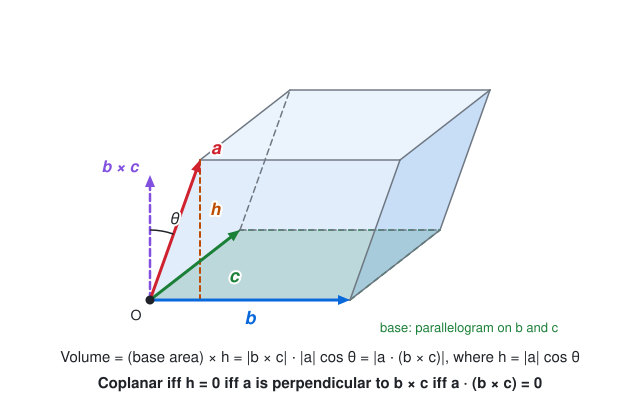
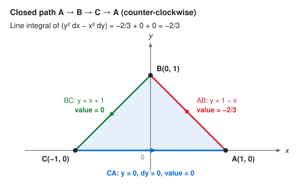
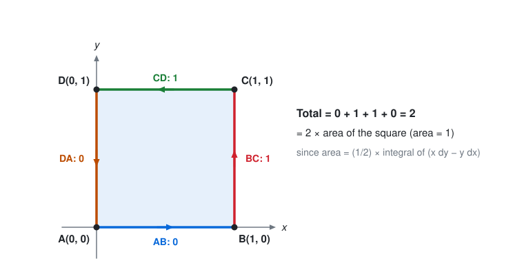
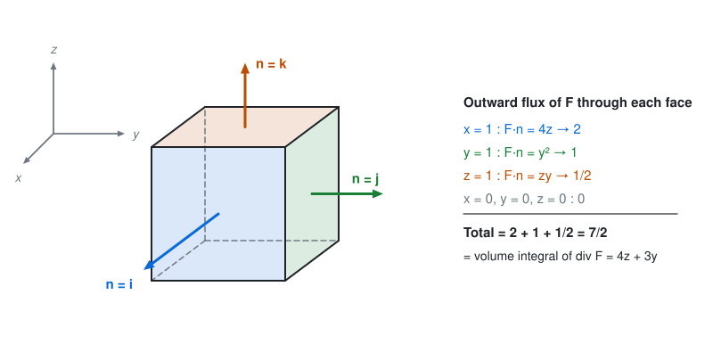
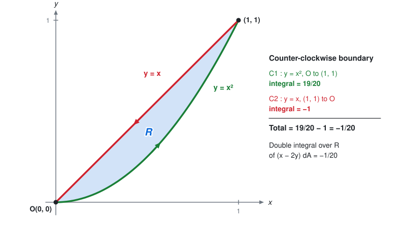
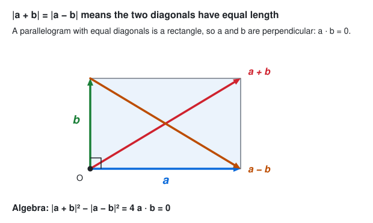
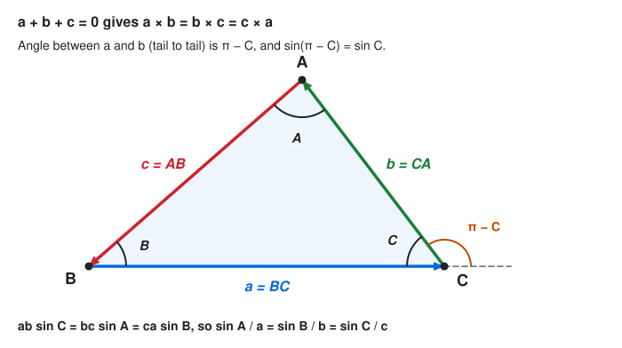
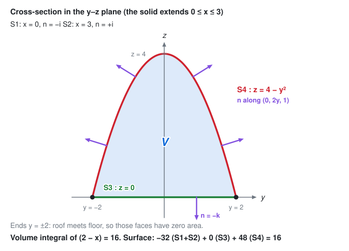
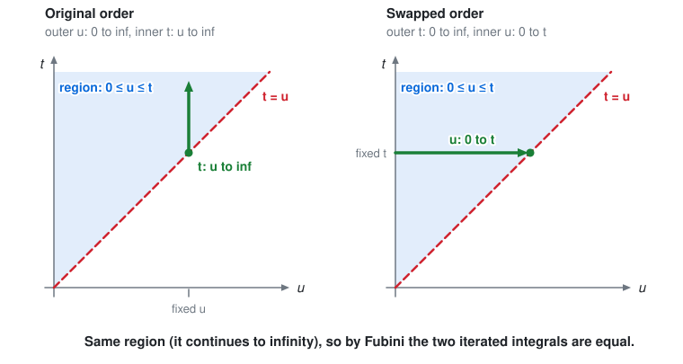
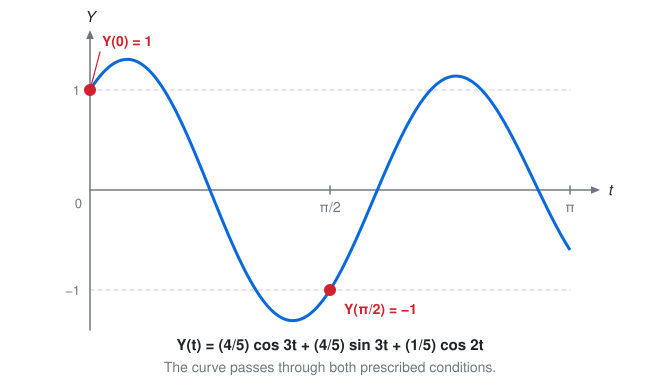

# Vector Calculus & Laplace Transform: Model Answers

Exam-style solutions in two parts.

- **Part I** covers 21 practice questions on vector calculus and the Laplace convolution theorem.
- **Part II** covers the MS103 2023 examination answers (Sections A and B).

Math is written in GitHub-flavored LaTeX. Figures are SVG files stored in the repository's `assets/` folder and linked as `../../assets/<file>.svg`, so this file is meant to live two folders below the repository root (for example `docs/ms103/`).

**Notation (Part I):** $\mathbf{i},\mathbf{j},\mathbf{k}$ are the unit vectors along $x,y,z$; $\nabla=\mathbf{i}\ \partial_x+\mathbf{j}\ \partial_y+\mathbf{k}\ \partial_z$; $[\mathbf{a}\ \mathbf{b}\ \mathbf{c}]=\mathbf{a}\cdot(\mathbf{b}\times\mathbf{c})$. Part II keeps the exam script's notation ($\hat\imath,\hat\jmath,\hat k$ and $\vec a$).

## Contents

| Part | Question | Topic | Answer |
|:----:|:--------:|-------|--------|
| I | [1](#q1) | Conservative field, find $a,b$ | $a=3,\ b=-8$ (see note on a sign typo) |
| I | [2](#q2) | $r^n\mathbf{r}$ solenoidal | $n=-3$ |
| I | [3](#q3) | Coplanarity test | proof |
| I | [4](#q4) | Vector triple product | proof |
| I | [5](#q5) | Line integral, triangle | $-\tfrac23$ |
| I | [6](#q6) | Line integral, square | $2$ |
| I | [7](#q7) | Gauss theorem, unit cube | $\tfrac72$ |
| I | [8](#q8) | Angle between $\mathbf{A},\mathbf{B}$ | $\cos^{-1}\tfrac{8}{21}\approx 67.6^\circ$ |
| I | [9](#q9) | Conservative field proof | curl is zero |
| I | [10](#q10) | Green's theorem | $-\tfrac1{20}$ |
| I | [11](#q11) | curl of curl | proof |
| I | [12](#q12) | $\sum \mathbf{i}\times(\mathbf{a}\times\mathbf{i})=2\mathbf{a}$ | proof |
| I | [13](#q13) | Equal diagonals | proof |
| I | [14](#q14) | Parallelogram area | $10\sqrt3$ |
| I | [15](#q15) | Angle between $\mathbf{a},\mathbf{b}$ | $\approx 67.1^\circ$ |
| I | [16](#q16) | Law of sines | proof |
| I | [17](#q17) | $(\mathbf{a}\times\mathbf{b})\times(\mathbf{c}\times\mathbf{d})$ | proof |
| I | [18](#q18) | div of curl | proof |
| I | [19](#q19) | Gauss theorem, parabolic solid | $16$ |
| I | [20](#q20) | Scalar product of two cross products | proof |
| I | [21](#q21) | Convolution theorem | proof |
| II | [3(a)](#ms-q3a) | $\vec a\times(\vec b\times\vec c)$ | proof |
| II | [3(b)](#ms-q3b) | Conservative field, find $a,b$ | $a=3,\ b=-8$ |
| II | [3(c)](#ms-q3c) | $r^n\vec r$ solenoidal | $n=-3$ |
| II | [4(a)](#ms-q4a) | $\sum \hat\imath\times(\vec a\times\hat\imath)$ | proof |
| II | [4(b)](#ms-q4b) | div curl is zero | proof |
| II | [4(c)](#ms-q4c) | curl of curl | proof |
| II | [6(a)](#ms-q6a) | Laplace transform of a sum | see answer |
| II | [6(b)](#ms-q6b) | First shifting property | proof |
| II | [6(c)](#ms-q6c) | Transform of $F'''(t)$ | proof |
| II | [6(d)](#ms-q6d) | Inverse transform | see answer |
| II | [8(a)](#ms-q8a) | Inverse transform, partial fractions | see answer |
| II | [8(b)](#ms-q8b) | $t^2\cos at$ and $t^3e^t$ | see answer |
| II | [8(c)](#ms-q8c) | ODE with two conditions | see answer |

## Identities used repeatedly

$$\mathbf{a}\times(\mathbf{b}\times\mathbf{c}) = \mathbf{b}(\mathbf{a}\cdot\mathbf{c}) - \mathbf{c}(\mathbf{a}\cdot\mathbf{b})$$

$$\nabla\times\mathbf{F}=\begin{vmatrix}\mathbf{i}&\mathbf{j}&\mathbf{k}\\ \partial_x&\partial_y&\partial_z\\ P&Q&R\end{vmatrix},\qquad \mathbf{F}\ \text{is conservative}\iff\nabla\times\mathbf{F}=\mathbf{0}\ \text{(on a simply connected domain)}$$

---

# Part I: Practice Questions

## Q1. Find $a, b$ so that $\mathbf{A}$ is conservative

$$\mathbf{A}=(2xy+3yz)\,\mathbf{i}+(x^2+axz-4z^2)\,\mathbf{j}-(3xy+byz)\,\mathbf{k}$$

**Method.** $\mathbf{A}$ is conservative if and only if $\nabla\times\mathbf{A}=\mathbf{0}$. Write $\mathbf{A}=P\mathbf{i}+Q\mathbf{j}+R\mathbf{k}$ with $P=2xy+3yz$ and $Q=x^2+axz-4z^2$.

**Check the problem as printed.** Here $R=-(3xy+byz)$, so

$$(\nabla\times\mathbf{A})_j=\frac{\partial P}{\partial z}-\frac{\partial R}{\partial x}=3y-(-3y)=6y\neq0$$

The $\mathbf{j}$-component is $6y$ whatever $a,b$ are, and the $\mathbf{i}$ and $\mathbf{k}$ components ask for $a=-3$ and $a=3$ at the same time. So **as printed, no constants $a,b$ exist**. The standard version of this problem has $+(3xy+byz)\ \mathbf{k}$, so the working below uses $R=3xy+byz$.

**Solution (with $R=3xy+byz$).**

$$(\nabla\times\mathbf{A})_i=\frac{\partial R}{\partial y}-\frac{\partial Q}{\partial z}=(3x+bz)-(ax-8z)=(3-a)x+(b+8)z$$

$$(\nabla\times\mathbf{A})_j=\frac{\partial P}{\partial z}-\frac{\partial R}{\partial x}=3y-3y=0$$

$$(\nabla\times\mathbf{A})_k=\frac{\partial Q}{\partial x}-\frac{\partial P}{\partial y}=(2x+az)-(2x+3z)=(a-3)z$$

Setting every component to zero for all $x,y,z$ gives $3-a=0$, $b+8=0$ and $a-3=0$.

**Answer.** $a=3$ and $b=-8$.

## Q2. $r^n\mathbf{r}$ is solenoidal when $n=-3$

**Given.** $\mathbf{r}=x\mathbf{i}+y\mathbf{j}+z\mathbf{k}$ and $r=|\mathbf{r}|$. **To show.** $\nabla\cdot(r^n\mathbf{r})=0$ when $n=-3$.

**Proof.** Since $r^2=x^2+y^2+z^2$, differentiating gives $r\ \partial_x r=x$, so $\nabla r=\mathbf{r}/r$ and

$$\nabla(r^n)=n r^{n-1}\nabla r=n r^{n-2}\,\mathbf{r}$$

Using $\nabla\cdot(\phi\mathbf{F})=\nabla\phi\cdot\mathbf{F}+\phi\ \nabla\cdot\mathbf{F}$ with $\nabla\cdot\mathbf{r}=3$:

$$\nabla\cdot(r^n\mathbf{r})=n r^{n-2}(\mathbf{r}\cdot\mathbf{r})+3r^n=n r^n+3r^n=(n+3)\,r^n$$

This vanishes for all $r\neq0$ exactly when $n+3=0$, that is $n=-3$. Hence $r^{-3}\mathbf{r}$ is solenoidal. $\blacksquare$

## Q3. Three vectors are coplanar if and only if $\mathbf{a}\cdot(\mathbf{b}\times\mathbf{c})=0$

The number $|\mathbf{a}\cdot(\mathbf{b}\times\mathbf{c})|$ is the volume of the parallelepiped built on the three vectors.

**Forward direction.** Suppose $\mathbf{a},\mathbf{b},\mathbf{c}$ are coplanar. If $\mathbf{b}\parallel\mathbf{c}$ then $\mathbf{b}\times\mathbf{c}=\mathbf{0}$ and the product is $0$. Otherwise $\mathbf{b}\times\mathbf{c}$ is perpendicular to the plane of $\mathbf{b}$ and $\mathbf{c}$. The vector $\mathbf{a}$ lies in that plane, so $\mathbf{a}$ is perpendicular to $\mathbf{b}\times\mathbf{c}$ and $\mathbf{a}\cdot(\mathbf{b}\times\mathbf{c})=0$.

**Converse.** Suppose $\mathbf{a}\cdot(\mathbf{b}\times\mathbf{c})=0$. If $\mathbf{b}\times\mathbf{c}=\mathbf{0}$, then $\mathbf{b}\parallel\mathbf{c}$ and any three such vectors are coplanar. Otherwise $\mathbf{a}$ is perpendicular to $\mathbf{b}\times\mathbf{c}$, so $\mathbf{a}$ lies in the plane through the origin perpendicular to $\mathbf{b}\times\mathbf{c}$. That plane contains $\mathbf{b}$ and $\mathbf{c}$. Hence $\mathbf{a},\mathbf{b},\mathbf{c}$ are coplanar. $\blacksquare$

## Q4. Vector triple product: $(\mathbf{a}\times\mathbf{b})\times\mathbf{c}=(\mathbf{a}\cdot\mathbf{c})\mathbf{b}-(\mathbf{b}\cdot\mathbf{c})\mathbf{a}$

Both sides are vectors defined without reference to a coordinate system, so we may choose axes conveniently. Take $\mathbf{i}$ along $\mathbf{a}$ and $\mathbf{j}$ in the plane of $\mathbf{a},\mathbf{b}$:

$$\mathbf{a}=a_1\mathbf{i},\qquad \mathbf{b}=b_1\mathbf{i}+b_2\mathbf{j},\qquad \mathbf{c}=c_1\mathbf{i}+c_2\mathbf{j}+c_3\mathbf{k}$$

**Left side.** $\mathbf{a}\times\mathbf{b}=a_1b_2\ \mathbf{k}$, so

$$(\mathbf{a}\times\mathbf{b})\times\mathbf{c}=a_1b_2\,\mathbf{k}\times(c_1\mathbf{i}+c_2\mathbf{j}+c_3\mathbf{k})=a_1b_2\,(c_1\mathbf{j}-c_2\mathbf{i})$$

**Right side.** $\mathbf{a}\cdot\mathbf{c}=a_1c_1$ and $\mathbf{b}\cdot\mathbf{c}=b_1c_1+b_2c_2$, so

$$(\mathbf{a}\cdot\mathbf{c})\mathbf{b}-(\mathbf{b}\cdot\mathbf{c})\mathbf{a}=a_1c_1(b_1\mathbf{i}+b_2\mathbf{j})-a_1(b_1c_1+b_2c_2)\mathbf{i}=a_1b_2c_1\,\mathbf{j}-a_1b_2c_2\,\mathbf{i}$$

The two sides are equal. $\blacksquare$

## Q5. Line integral of $y^2\ dx-x^2\ dy$ around the triangle $A(1,0)\to B(0,1)\to C(-1,0)\to A$

The path is taken as the closed loop $A\to B\to C\to A$.

**Side AB.** $y=1-x$, $dy=-dx$, and $x$ runs from $1$ to $0$.

$$\int_{AB}=\int_{1}^{0}\big[(1-x)^2+x^2\big]dx=-\int_0^1(1-2x+2x^2)\,dx=-\Big(1-1+\tfrac23\Big)=-\tfrac23$$

**Side BC.** $y=x+1$, $dy=dx$, and $x$ runs from $0$ to $-1$.

$$\int_{BC}=\int_0^{-1}\big[(x+1)^2-x^2\big]dx=\int_0^{-1}(2x+1)\,dx=\big[x^2+x\big]_0^{-1}=0$$

**Side CA.** $y=0$ and $dy=0$, so $\int_{CA}=0$.

**Answer.** The line integral equals $-\tfrac23$.

**Check by Green's theorem.** With $P=y^2$ and $Q=-x^2$ the integrand is $\partial_xQ-\partial_yP=-2x-2y$. The $x$-term vanishes by symmetry. The region is $0\le y\le1-|x|$, so

$$-2\int_{-1}^{1}\frac{(1-|x|)^2}{2}\,dx=-2\cdot\frac13=-\frac23$$

This agrees. ✓

## Q6. Line integral of $x\ dy-y\ dx$ around the square $A(0,0)\to B(1,0)\to C(1,1)\to D(0,1)\to A$

| Side | Description | Integrand | Value |
|------|-------------|-----------|-------|
| AB | $y=0$, $dy=0$ | $0$ | $0$ |
| BC | $x=1$, $dx=0$ | $x\ dy=dy$, $y$ from $0$ to $1$ | $1$ |
| CD | $y=1$, $dy=0$ | $-y\ dx=-dx$, $x$ from $1$ to $0$ | $1$ |
| DA | $x=0$, $dx=0$ | $0$ | $0$ |

**Answer.** The line integral equals $0+1+1+0=2$.

**Check.** The quantity $\tfrac12\oint(x\ dy-y\ dx)$ is the enclosed area, so the integral should be $2\times1=2$. ✓

## Q7. Verify Gauss's divergence theorem for $\mathbf{F}=4xz\ \mathbf{i}+y^2\ \mathbf{j}+zy\ \mathbf{k}$ over the unit cube

Gauss's theorem states

$$\iiint_V(\nabla\cdot\mathbf{F})\,dV=\iint_S\mathbf{F}\cdot\hat{\mathbf{n}}\,dS$$

**Volume integral.**

$$\nabla\cdot\mathbf{F}=4z+2y+y=4z+3y$$

$$\int_0^1\int_0^1\int_0^1(4z+3y)\,dx\,dy\,dz=4\cdot\tfrac12+3\cdot\tfrac12=\tfrac72$$

**Surface integral** over the six faces:

| Face | $\hat{\mathbf{n}}$ | $\mathbf{F}\cdot\hat{\mathbf{n}}$ | Integral over the face |
|------|-----|-----------|------------|
| $x=1$ | $\mathbf{i}$ | $4z$ | $2$ |
| $x=0$ | $-\mathbf{i}$ | $-4xz=0$ | $0$ |
| $y=1$ | $\mathbf{j}$ | $y^2=1$ | $1$ |
| $y=0$ | $-\mathbf{j}$ | $-y^2=0$ | $0$ |
| $z=1$ | $\mathbf{k}$ | $zy=y$ | $\tfrac12$ |
| $z=0$ | $-\mathbf{k}$ | $-zy=0$ | $0$ |

For example, on $x=1$ the integral is $\int_0^1\int_0^1 4z\ dy\ dz=2$, and on $z=1$ it is $\int_0^1\int_0^1 y\ dx\ dy=\tfrac12$.

$$\text{Surface integral}=2+1+\tfrac12=\tfrac72$$

Both sides equal $\tfrac72$, so the theorem is verified. $\blacksquare$

## Q8. Angle between $\mathbf{A}=2\mathbf{i}-3\mathbf{j}+6\mathbf{k}$ and $\mathbf{B}=\mathbf{i}+2\mathbf{j}+2\mathbf{k}$

$$\mathbf{A}\cdot\mathbf{B}=2-6+12=8,\qquad |\mathbf{A}|=\sqrt{4+9+36}=7,\qquad |\mathbf{B}|=\sqrt{1+4+4}=3$$

$$\cos\theta=\frac{\mathbf{A}\cdot\mathbf{B}}{|\mathbf{A}||\mathbf{B}|}=\frac{8}{21}$$

**Answer.** $\theta=\cos^{-1}\tfrac{8}{21}\approx67.6^\circ$.

## Q9. Prove that $\mathbf{F}=(2xz^3+6y)\mathbf{i}+(6x-2yz)\mathbf{j}+(3x^2z^2-y^2)\mathbf{k}$ is conservative

Let $P=2xz^3+6y$, $Q=6x-2yz$ and $R=3x^2z^2-y^2$.

$$(\nabla\times\mathbf{F})_i=\partial_yR-\partial_zQ=-2y-(-2y)=0$$

$$(\nabla\times\mathbf{F})_j=\partial_zP-\partial_xR=6xz^2-6xz^2=0$$

$$(\nabla\times\mathbf{F})_k=\partial_xQ-\partial_yP=6-6=0$$

So $\nabla\times\mathbf{F}=\mathbf{0}$ and $\mathbf{F}$ is conservative. $\blacksquare$

**Scalar potential (for completeness).** Take $\phi=x^2z^3+6xy-y^2z$. Then $\phi_x=2xz^3+6y$, $\phi_y=6x-2yz$ and $\phi_z=3x^2z^2-y^2$, so $\nabla\phi=\mathbf{F}$. ✓

## Q10. Verify Green's theorem for $\oint (xy+y^2)\ dx+x^2\ dy$ bounded by $y=x$ and $y=x^2$

Green's theorem states

$$\oint_C P\,dx+Q\,dy=\iint_R\Big(\frac{\partial Q}{\partial x}-\frac{\partial P}{\partial y}\Big)dA$$

with $P=xy+y^2$ and $Q=x^2$. The curves meet at $O(0,0)$ and $(1,1)$.

**Line integral (counter-clockwise).**

Along $y=x^2$ from $x=0$ to $x=1$, with $dy=2x\ dx$:

$$\int\big[(x^3+x^4)\,dx+x^2(2x\,dx)\big]=\int_0^1(3x^3+x^4)\,dx=\tfrac34+\tfrac15=\tfrac{19}{20}$$

Along $y=x$ from $x=1$ to $x=0$, with $dy=dx$:

$$\int\big[(x^2+x^2)\,dx+x^2\,dx\big]=\int_1^0 3x^2\,dx=-1$$

$$\oint=\tfrac{19}{20}-1=-\tfrac1{20}$$

**Double integral.** Here $\partial_xQ-\partial_yP=2x-(x+2y)=x-2y$.

$$\int_0^1\int_{x^2}^{x}(x-2y)\,dy\,dx=\int_0^1\big[xy-y^2\big]_{x^2}^{x}dx=\int_0^1(-x^3+x^4)\,dx=-\tfrac14+\tfrac15=-\tfrac1{20}$$

Both sides equal $-\tfrac1{20}$, so Green's theorem is verified. $\blacksquare$

## Q11. Prove $\nabla\times(\nabla\times\mathbf{A})=\nabla(\nabla\cdot\mathbf{A})-\nabla^2\mathbf{A}$

Let $\mathbf{B}=\nabla\times\mathbf{A}$, whose components are

$$B_1=\partial_yA_z-\partial_zA_y,\qquad B_2=\partial_zA_x-\partial_xA_z,\qquad B_3=\partial_xA_y-\partial_yA_x$$

Take the $x$-component of $\nabla\times\mathbf{B}$:

$$\begin{aligned}
(\nabla\times\mathbf{B})_x&=\partial_yB_3-\partial_zB_2\\
&=\partial_y(\partial_xA_y-\partial_yA_x)-\partial_z(\partial_zA_x-\partial_xA_z)\\
&=\partial_x\partial_yA_y+\partial_x\partial_zA_z-\partial_y^2A_x-\partial_z^2A_x
\end{aligned}$$

Add and subtract $\partial_x^2A_x$:

$$=\partial_x(\partial_xA_x+\partial_yA_y+\partial_zA_z)-(\partial_x^2+\partial_y^2+\partial_z^2)A_x=\big[\nabla(\nabla\cdot\mathbf{A})\big]_x-\nabla^2A_x$$

The $y$ and $z$ components follow in the same way by cyclic permutation of $(x,y,z)$. Hence

$$\nabla\times(\nabla\times\mathbf{A})=\nabla(\nabla\cdot\mathbf{A})-\nabla^2\mathbf{A}\qquad\blacksquare$$

## Q12. Prove $\mathbf{i}\times(\mathbf{a}\times\mathbf{i})+\mathbf{j}\times(\mathbf{a}\times\mathbf{j})+\mathbf{k}\times(\mathbf{a}\times\mathbf{k})=2\mathbf{a}$

Use $\mathbf{u}\times(\mathbf{v}\times\mathbf{w})=\mathbf{v}(\mathbf{u}\cdot\mathbf{w})-\mathbf{w}(\mathbf{u}\cdot\mathbf{v})$ with $\mathbf{a}=a_1\mathbf{i}+a_2\mathbf{j}+a_3\mathbf{k}$:

$$\mathbf{i}\times(\mathbf{a}\times\mathbf{i})=\mathbf{a}(\mathbf{i}\cdot\mathbf{i})-\mathbf{i}(\mathbf{i}\cdot\mathbf{a})=\mathbf{a}-a_1\mathbf{i}$$

Similarly $\mathbf{j}\times(\mathbf{a}\times\mathbf{j})=\mathbf{a}-a_2\mathbf{j}$ and $\mathbf{k}\times(\mathbf{a}\times\mathbf{k})=\mathbf{a}-a_3\mathbf{k}$. Adding the three:

$$3\mathbf{a}-(a_1\mathbf{i}+a_2\mathbf{j}+a_3\mathbf{k})=3\mathbf{a}-\mathbf{a}=2\mathbf{a}\qquad\blacksquare$$

## Q13. If $|\mathbf{a}+\mathbf{b}|=|\mathbf{a}-\mathbf{b}|$ then $\mathbf{a}$ and $\mathbf{b}$ are perpendicular

Square both sides:

$$|\mathbf{a}|^2+2\,\mathbf{a}\cdot\mathbf{b}+|\mathbf{b}|^2=|\mathbf{a}|^2-2\,\mathbf{a}\cdot\mathbf{b}+|\mathbf{b}|^2\quad\Longrightarrow\quad4\,\mathbf{a}\cdot\mathbf{b}=0$$

So $\mathbf{a}\cdot\mathbf{b}=0$. For non-zero vectors this means $\cos\theta=0$, so the vectors are perpendicular. $\blacksquare$

**Geometric meaning.** The vectors $\mathbf{a}+\mathbf{b}$ and $\mathbf{a}-\mathbf{b}$ are the diagonals of the parallelogram on $\mathbf{a}$ and $\mathbf{b}$. A parallelogram with equal diagonals is a rectangle.

## Q14. Area of the parallelogram on $\mathbf{A}=3\mathbf{i}+\mathbf{j}-2\mathbf{k}$ and $\mathbf{B}=\mathbf{i}-3\mathbf{j}+4\mathbf{k}$

$$\mathbf{A}\times\mathbf{B}=\begin{vmatrix}\mathbf{i}&\mathbf{j}&\mathbf{k}\\3&1&-2\\1&-3&4\end{vmatrix}
=\mathbf{i}(4-6)-\mathbf{j}(12+2)+\mathbf{k}(-9-1)=-2\mathbf{i}-14\mathbf{j}-10\mathbf{k}$$

$$\text{Area}=|\mathbf{A}\times\mathbf{B}|=\sqrt{4+196+100}=\sqrt{300}=10\sqrt3$$

**Answer.** The area is $10\sqrt3\approx17.32$ square units.

## Q15. Angle between $\mathbf{a}=\mathbf{i}-7\mathbf{j}-\mathbf{k}$ and $\mathbf{b}=4\mathbf{i}-4\mathbf{j}+7\mathbf{k}$

$$\mathbf{a}\cdot\mathbf{b}=4+28-7=25,\qquad |\mathbf{a}|=\sqrt{1+49+1}=\sqrt{51},\qquad |\mathbf{b}|=\sqrt{16+16+49}=9$$

$$\cos\theta=\frac{25}{9\sqrt{51}}\approx0.389$$

**Answer.** $\theta\approx67.1^\circ$.

## Q16. Law of sines by vectors

Let the sides of triangle $ABC$ be the vectors $\mathbf{a}=\overrightarrow{BC}$, $\mathbf{b}=\overrightarrow{CA}$ and $\mathbf{c}=\overrightarrow{AB}$, with lengths $a,b,c$. Going once round the triangle,

$$\mathbf{a}+\mathbf{b}+\mathbf{c}=\mathbf{0}$$

Cross this relation with $\mathbf{a}$ and with $\mathbf{b}$:

$$\mathbf{a}\times(\mathbf{a}+\mathbf{b}+\mathbf{c})=\mathbf{0}\ \Longrightarrow\ \mathbf{a}\times\mathbf{b}=\mathbf{c}\times\mathbf{a}$$

$$\mathbf{b}\times(\mathbf{a}+\mathbf{b}+\mathbf{c})=\mathbf{0}\ \Longrightarrow\ \mathbf{a}\times\mathbf{b}=\mathbf{b}\times\mathbf{c}$$

Hence $\mathbf{a}\times\mathbf{b}=\mathbf{b}\times\mathbf{c}=\mathbf{c}\times\mathbf{a}$. Now take magnitudes. With the vectors placed tail to tail, the angle between $\mathbf{a}$ and $\mathbf{b}$ is $\pi-C$, between $\mathbf{b}$ and $\mathbf{c}$ is $\pi-A$, and between $\mathbf{c}$ and $\mathbf{a}$ is $\pi-B$. Since $\sin(\pi-\theta)=\sin\theta$,

$$ab\sin C=bc\sin A=ca\sin B$$

Dividing throughout by $abc$:

$$\frac{\sin A}{a}=\frac{\sin B}{b}=\frac{\sin C}{c}\qquad\blacksquare$$

## Q17. Prove $(\mathbf{a}\times\mathbf{b})\times(\mathbf{c}\times\mathbf{d})=[\mathbf{a}\ \mathbf{c}\ \mathbf{d}]\ \mathbf{b}-[\mathbf{b}\ \mathbf{c}\ \mathbf{d}]\ \mathbf{a}$

Put $\mathbf{u}=\mathbf{c}\times\mathbf{d}$. By the identity of Q4, $(\mathbf{a}\times\mathbf{b})\times\mathbf{u}=(\mathbf{a}\cdot\mathbf{u})\mathbf{b}-(\mathbf{b}\cdot\mathbf{u})\mathbf{a}$. Now

$$\mathbf{a}\cdot\mathbf{u}=\mathbf{a}\cdot(\mathbf{c}\times\mathbf{d})=[\mathbf{a}\ \mathbf{c}\ \mathbf{d}],\qquad \mathbf{b}\cdot\mathbf{u}=[\mathbf{b}\ \mathbf{c}\ \mathbf{d}]$$

Therefore

$$(\mathbf{a}\times\mathbf{b})\times(\mathbf{c}\times\mathbf{d})=[\mathbf{a}\ \mathbf{c}\ \mathbf{d}]\,\mathbf{b}-[\mathbf{b}\ \mathbf{c}\ \mathbf{d}]\,\mathbf{a}\qquad\blacksquare$$

## Q18. Prove $\nabla\cdot(\nabla\times\mathbf{A})=0$

Assume $\mathbf{A}$ has continuous second partial derivatives.

$$\begin{aligned}
\nabla\cdot(\nabla\times\mathbf{A})&=\partial_x(\partial_yA_z-\partial_zA_y)+\partial_y(\partial_zA_x-\partial_xA_z)+\partial_z(\partial_xA_y-\partial_yA_x)\\
&=(\partial_x\partial_yA_z-\partial_y\partial_xA_z)+(\partial_y\partial_zA_x-\partial_z\partial_yA_x)+(\partial_z\partial_xA_y-\partial_x\partial_zA_y)
\end{aligned}$$

Each bracket vanishes because mixed partial derivatives are equal for functions with continuous second derivatives. Hence $\nabla\cdot(\nabla\times\mathbf{A})=0$. $\blacksquare$

## Q19. Verify Gauss's theorem for $\mathbf{F}=(z^2-x)\mathbf{i}-xy\ \mathbf{j}+3z\ \mathbf{k}$ over $0\le x\le3$, $-2\le y\le2$, $0\le z\le4-y^2$

**Volume integral.**

$$\nabla\cdot\mathbf{F}=-1-x+3=2-x$$

$$\iiint(2-x)\,dV=\int_0^3(2-x)\,dx\int_{-2}^{2}(4-y^2)\,dy=\tfrac32\cdot\tfrac{32}{3}=16$$

**Surface integral.** The boundary has four pieces. The ends $y=\pm2$ have zero area, because the roof meets the floor there.

| Surface | $\hat{\mathbf{n}}$ | Computation | Value |
|---------|-----|-------------|-------|
| $S_1$: $x=0$ | $-\mathbf{i}$ | $-\iint z^2\ dz\ dy=-\tfrac13\int_{-2}^{2}(4-y^2)^3\ dy$ | $-\tfrac{4096}{105}$ |
| $S_2$: $x=3$ | $\mathbf{i}$ | $\iint(z^2-3)\ dz\ dy=\tfrac{4096}{105}-3\cdot\tfrac{32}{3}$ | $\tfrac{4096}{105}-32$ |
| $S_3$: $z=0$ | $-\mathbf{k}$ | $\mathbf{F}\cdot\hat{\mathbf{n}}=-3z=0$ | $0$ |
| $S_4$: $z=4-y^2$ | along $(0,2y,1)$ | see below | $48$ |

The value $\int_{-2}^{2}(4-y^2)^3\ dy=\tfrac{4096}{35}$ comes from expanding $(4-y^2)^3=64-48y^2+12y^4-y^6$.

For $S_4$, write the surface as $\phi=z+y^2-4=0$, so $\nabla\phi=(0,2y,1)$ points outward (upward). Then $\mathbf{F}\cdot\hat{\mathbf{n}}\ dS=\mathbf{F}\cdot\nabla\phi\ dx\ dy$ with $z=4-y^2$:

$$\mathbf{F}\cdot\nabla\phi=-2xy^2+3z=-2xy^2+3(4-y^2)$$

$$\int_{-2}^{2}\int_0^3\big[-2xy^2+12-3y^2\big]dx\,dy=\int_{-2}^{2}(36-18y^2)\,dy=48$$

Adding the four surfaces:

$$-\tfrac{4096}{105}+\Big(\tfrac{4096}{105}-32\Big)+0+48=16$$

Both sides equal $16$, so the theorem is verified. $\blacksquare$

## Q20. Prove $(\mathbf{A}\times\mathbf{B})\cdot(\mathbf{C}\times\mathbf{D})=(\mathbf{A}\cdot\mathbf{C})(\mathbf{B}\cdot\mathbf{D})-(\mathbf{A}\cdot\mathbf{D})(\mathbf{B}\cdot\mathbf{C})$

Let $\mathbf{u}=\mathbf{A}\times\mathbf{B}$. By the cyclic property of the scalar triple product, $\mathbf{u}\cdot(\mathbf{C}\times\mathbf{D})=[\mathbf{u}\ \mathbf{C}\ \mathbf{D}]=\mathbf{C}\cdot(\mathbf{D}\times\mathbf{u})$.

Now expand $\mathbf{D}\times\mathbf{u}=\mathbf{D}\times(\mathbf{A}\times\mathbf{B})=\mathbf{A}(\mathbf{D}\cdot\mathbf{B})-\mathbf{B}(\mathbf{D}\cdot\mathbf{A})$. Taking the dot product with $\mathbf{C}$:

$$(\mathbf{A}\times\mathbf{B})\cdot(\mathbf{C}\times\mathbf{D})=(\mathbf{A}\cdot\mathbf{C})(\mathbf{B}\cdot\mathbf{D})-(\mathbf{A}\cdot\mathbf{D})(\mathbf{B}\cdot\mathbf{C})\qquad\blacksquare$$

## Q21. Convolution theorem

**Statement.** Let $F(s)=\mathcal{L}\lbrace f(t)\rbrace$ and $G(s)=\mathcal{L}\lbrace g(t)\rbrace$ (the question writes these as $f(s)$ and $g(s)$). Then

$$\mathcal{L}^{-1}\lbrace F(s)G(s)\rbrace=\int_0^t f(v)\,g(t-v)\,dv=(f*g)(t)$$

**Proof.** For $s$ large enough that both transforms converge absolutely,

$$F(s)G(s)=\int_0^\infty e^{-su}f(u)\,du\int_0^\infty e^{-sw}g(w)\,dw=\int_0^\infty\int_0^\infty e^{-s(u+w)}f(u)\,g(w)\,dw\,du$$

In the inner integral hold $u$ fixed and substitute $t=u+w$, so $w=t-u$, $dw=dt$, and $t$ runs from $u$ to $\infty$:

$$F(s)G(s)=\int_0^\infty f(u)\int_u^\infty e^{-st}\,g(t-u)\,dt\,du$$

The region of integration is $0\le u\le t$ in the $(u,t)$ plane.

By Fubini's theorem (justified by absolute convergence) we may swap the order of integration:

$$F(s)G(s)=\int_0^\infty e^{-st}\left[\int_0^t f(u)\,g(t-u)\,du\right]dt=\mathcal{L}\left\lbrace\int_0^t f(u)\,g(t-u)\,du\right\rbrace$$

Renaming the dummy variable $u$ to $v$ and taking the inverse transform:

$$\mathcal{L}^{-1}\lbrace F(s)G(s)\rbrace=\int_0^t f(v)\,g(t-v)\,dv\qquad\blacksquare$$

**Quick example.** For $\mathcal{L}^{-1}\left\lbrace\dfrac{1}{s^2(s+1)}\right\rbrace$ take $f=t$ (from $1/s^2$) and $g=e^{-t}$:

$$\int_0^t v\,e^{-(t-v)}\,dv=e^{-t}\int_0^t v\,e^{v}\,dv=e^{-t}\big[(v-1)e^v\big]_0^t=t-1+e^{-t}$$

---

# Part II: MS103, 2023 Examination

## Section A: Vector Calculus

### Q3(a)

**To prove:** $\vec a\times(\vec b\times\vec c)=(\vec a\cdot\vec c)\vec b-(\vec a\cdot\vec b)\vec c$

**Proof:** Let $\vec a=a_1\hat\imath+a_2\hat\jmath+a_3\hat k$, and similarly for $\vec b$ and $\vec c$.

$$
\vec b\times\vec c=(b_2c_3-b_3c_2)\hat\imath+(b_3c_1-b_1c_3)\hat\jmath+(b_1c_2-b_2c_1)\hat k
$$

The $\hat\imath$ component of $\vec a\times(\vec b\times\vec c)$ is

$$
\begin{aligned}
&a_2(b_1c_2-b_2c_1)-a_3(b_3c_1-b_1c_3)\\
&=b_1(a_2c_2+a_3c_3)-c_1(a_2b_2+a_3b_3)\\
&=b_1(a_1c_1+a_2c_2+a_3c_3)-c_1(a_1b_1+a_2b_2+a_3b_3)\\
&=b_1(\vec a\cdot\vec c)-c_1(\vec a\cdot\vec b)
\end{aligned}
$$

(adding and subtracting $a_1b_1c_1$). Similarly the $\hat\jmath$ and $\hat k$ components are $b_2(\vec a\cdot\vec c)-c_2(\vec a\cdot\vec b)$ and $b_3(\vec a\cdot\vec c)-c_3(\vec a\cdot\vec b)$.

Hence $\vec a\times(\vec b\times\vec c)=(\vec a\cdot\vec c)\vec b-(\vec a\cdot\vec b)\vec c$. **(Proved)**

---

### Q3(b)

**Given:** $\vec A=(2xy+3yz)\hat\imath+(x^2+axz-4z^2)\hat\jmath-(3xy+byz)\hat k$ is conservative.

**Condition:** $\vec A$ conservative implies $\nabla\times\vec A=\vec 0$.

$$
\nabla\times\vec A=
\begin{vmatrix}
\hat\imath&\hat\jmath&\hat k\\
\dfrac{\partial}{\partial x}&\dfrac{\partial}{\partial y}&\dfrac{\partial}{\partial z}\\
2xy+3yz&x^2+axz-4z^2&-(3xy+byz)
\end{vmatrix}
$$

$$
\begin{aligned}
&=\hat\imath\left[-(3x+bz)-(ax-8z)\right]-\hat\jmath\left[-3y-3y\right]+\hat k\left[(2x+az)-(2x+3z)\right]\\
&=\hat\imath\left[-(3+a)x+(8-b)z\right]+6y\,\hat\jmath+(a-3)z\,\hat k
\end{aligned}
$$

> **Note:** As printed, the $\hat\jmath$ term $6y\neq0$, and the $\hat\imath$ and $\hat k$ terms demand $a=-3$ and $a=3$ together, so no $a,b$ exist. The intended vector is $\vec A=\dots+(3xy+byz)\hat k$ (sign typo). Solved below for that.

**With** $A_3=+(3xy+byz)$:

$$
\nabla\times\vec A=\hat\imath\left[(3-a)x+(b+8)z\right]+0\cdot\hat\jmath+(a-3)z\,\hat k=\vec0
$$

Equating coefficients to zero:

$$
3-a=0,\qquad b+8=0,\qquad a-3=0
$$

**Answer.** $a=3$ and $b=-8$.

---

### Q3(c)

**To find:** $n$ such that $r^n\vec r$ is solenoidal, that is $\nabla\cdot(r^n\vec r)=0$.

Using $\nabla\cdot(\phi\vec F)=\phi(\nabla\cdot\vec F)+\vec F\cdot\nabla\phi$ with $\phi=r^n$ and $\vec F=\vec r$:

$$
\nabla\cdot\vec r=3,\qquad \nabla r^n=nr^{n-1}\nabla r=nr^{n-2}\vec r
$$

$$
\nabla\cdot(r^n\vec r)=3r^n+\vec r\cdot nr^{n-2}\vec r=3r^n+nr^{n-2}r^2=(n+3)r^n
$$

For a solenoidal field, $(n+3)r^n=0$, so $n+3=0$.

**Answer.** $n=-3$.

---

### Q4(a)

**To prove:** $\hat\imath\times(\vec a\times\hat\imath)+\hat\jmath\times(\vec a\times\hat\jmath)+\hat k\times(\vec a\times\hat k)=2\vec a$

**Proof:** Using $\vec A\times(\vec B\times\vec C)=(\vec A\cdot\vec C)\vec B-(\vec A\cdot\vec B)\vec C$:

$$
\hat\imath\times(\vec a\times\hat\imath)=(\hat\imath\cdot\hat\imath)\vec a-(\hat\imath\cdot\vec a)\hat\imath=\vec a-a_1\hat\imath
$$

Similarly,

$$
\hat\jmath\times(\vec a\times\hat\jmath)=\vec a-a_2\hat\jmath,\qquad \hat k\times(\vec a\times\hat k)=\vec a-a_3\hat k
$$

Adding:

$$
\text{LHS}=3\vec a-(a_1\hat\imath+a_2\hat\jmath+a_3\hat k)=3\vec a-\vec a=2\vec a=\text{RHS}\quad\textbf{(Proved)}
$$

---

### Q4(b)

**Definitions.** Let $\nabla=\hat\imath\dfrac{\partial}{\partial x}+\hat\jmath\dfrac{\partial}{\partial y}+\hat k\dfrac{\partial}{\partial z}$.

**Gradient:** for a scalar point function $\phi(x,y,z)$,

$$\nabla\phi=\hat\imath\frac{\partial\phi}{\partial x}+\hat\jmath\frac{\partial\phi}{\partial y}+\hat k\frac{\partial\phi}{\partial z}$$

**Divergence:** for a vector point function $\vec A=A_1\hat\imath+A_2\hat\jmath+A_3\hat k$,

$$\nabla\cdot\vec A=\frac{\partial A_1}{\partial x}+\frac{\partial A_2}{\partial y}+\frac{\partial A_3}{\partial z}$$

**To prove:** $\nabla\cdot(\nabla\times\vec A)=0$

**Proof:**

$$
\nabla\times\vec A=\left(\frac{\partial A_3}{\partial y}-\frac{\partial A_2}{\partial z}\right)\hat\imath+\left(\frac{\partial A_1}{\partial z}-\frac{\partial A_3}{\partial x}\right)\hat\jmath+\left(\frac{\partial A_2}{\partial x}-\frac{\partial A_1}{\partial y}\right)\hat k
$$

$$
\begin{aligned}
\nabla\cdot(\nabla\times\vec A)
&=\frac{\partial^2A_3}{\partial x\partial y}-\frac{\partial^2A_2}{\partial x\partial z}+\frac{\partial^2A_1}{\partial y\partial z}-\frac{\partial^2A_3}{\partial y\partial x}+\frac{\partial^2A_2}{\partial z\partial x}-\frac{\partial^2A_1}{\partial z\partial y}
\end{aligned}
$$

Assuming continuous second-order partial derivatives, the mixed partials are equal, so all terms cancel in pairs:

$$
\nabla\cdot(\nabla\times\vec A)=0\quad\textbf{(Proved)}
$$

---

### Q4(c)

**To show:** $\nabla\times(\nabla\times\vec A)=\nabla(\nabla\cdot\vec A)-\nabla^2\vec A$

**Proof:** Let $\vec B=\nabla\times\vec A$, so

$$
B_1=\frac{\partial A_3}{\partial y}-\frac{\partial A_2}{\partial z},\qquad
B_2=\frac{\partial A_1}{\partial z}-\frac{\partial A_3}{\partial x},\qquad
B_3=\frac{\partial A_2}{\partial x}-\frac{\partial A_1}{\partial y}
$$

The $\hat\imath$ component of $\nabla\times\vec B$ is

$$
\begin{aligned}
\frac{\partial B_3}{\partial y}-\frac{\partial B_2}{\partial z}
&=\frac{\partial^2A_2}{\partial y\partial x}-\frac{\partial^2A_1}{\partial y^2}-\frac{\partial^2A_1}{\partial z^2}+\frac{\partial^2A_3}{\partial z\partial x}\\
&=\frac{\partial}{\partial x}\left(\frac{\partial A_2}{\partial y}+\frac{\partial A_3}{\partial z}\right)-\left(\frac{\partial^2}{\partial y^2}+\frac{\partial^2}{\partial z^2}\right)A_1
\end{aligned}
$$

Adding and subtracting $\dfrac{\partial^2A_1}{\partial x^2}$:

$$
=\frac{\partial}{\partial x}\left(\nabla\cdot\vec A\right)-\nabla^2A_1
$$

Similarly the $\hat\jmath$ and $\hat k$ components are $\dfrac{\partial}{\partial y}(\nabla\cdot\vec A)-\nabla^2A_2$ and $\dfrac{\partial}{\partial z}(\nabla\cdot\vec A)-\nabla^2A_3$.

Combining the three components,

$$
\nabla\times(\nabla\times\vec A)=\nabla(\nabla\cdot\vec A)-\nabla^2\vec A\quad\textbf{(Proved)}
$$

---

## Section B: Laplace Transform

### Q6(a)

**To find:** $\mathcal L\lbrace 4e^{5t}+6t^3-3\cos4t+4\sin5t\rbrace$

By linearity:

$$
\begin{aligned}
&=4\mathcal L\lbrace e^{5t}\rbrace+6\mathcal L\lbrace t^3\rbrace-3\mathcal L\lbrace\cos4t\rbrace+4\mathcal L\lbrace\sin5t\rbrace\\
&=\frac{4}{s-5}+6\cdot\frac{3!}{s^4}-3\cdot\frac{s}{s^2+16}+4\cdot\frac{5}{s^2+25}
\end{aligned}
$$

**Answer.**

$$
\frac{4}{s-5}+\frac{36}{s^4}-\frac{3s}{s^2+16}+\frac{20}{s^2+25}
$$

---

### Q6(b)

**First translation (shifting) property:** If $\mathcal L\lbrace F(t)\rbrace=f(s)$, then $\mathcal L\lbrace e^{at}F(t)\rbrace=f(s-a)$.

**Proof:** By definition,

$$
\mathcal L\lbrace e^{at}F(t)\rbrace=\int_0^\infty e^{-st}e^{at}F(t)\,dt=\int_0^\infty e^{-(s-a)t}F(t)\,dt=f(s-a)
$$

since $\int_0^\infty e^{-st}F(t)\ dt=f(s)$ with $s$ replaced by $s-a$. **(Proved)**

---

### Q6(c)

**To show:** $\mathcal L\lbrace F'''(t)\rbrace=s^3f(s)-s^2F(0)-sF'(0)-F''(0)$

**Proof:** For a function $G$ with $\mathcal L\lbrace G\rbrace=g(s)$, integration by parts gives

$$
\mathcal L\lbrace G'(t)\rbrace=\int_0^\infty e^{-st}G'(t)\,dt=\Big[e^{-st}G(t)\Big]_0^\infty+s\int_0^\infty e^{-st}G(t)\,dt=s\,g(s)-G(0)\qquad(1)
$$

Applying (1) with $G=F''$, then $F'$, then $F$:

$$
\begin{aligned}
\mathcal L\lbrace F'''\rbrace&=s\mathcal L\lbrace F''\rbrace-F''(0)\\
&=s\left[s\mathcal L\lbrace F'\rbrace-F'(0)\right]-F''(0)\\
&=s^2\left[s f(s)-F(0)\right]-sF'(0)-F''(0)\\
&=s^3f(s)-s^2F(0)-sF'(0)-F''(0)\quad\textbf{(Proved)}
\end{aligned}
$$

---

### Q6(d)

**To find:** $\mathcal L^{-1}\left\lbrace\dfrac{s+2}{s^2-4s+13}\right\rbrace$

Complete the square:

$$
s^2-4s+13=(s-2)^2+9
$$

$$
\frac{s+2}{(s-2)^2+3^2}=\frac{(s-2)+4}{(s-2)^2+3^2}=\frac{s-2}{(s-2)^2+3^2}+\frac43\cdot\frac{3}{(s-2)^2+3^2}
$$

By the first shifting property ($a=2$):

$$
\mathcal L^{-1}\lbrace\cdot\rbrace=e^{2t}\left[\cos3t+\frac43\sin3t\right]
$$

**Answer.** $e^{2t}\left(\cos3t+\dfrac43\sin3t\right)$

---

### Q8(a)

**To find:** $\mathcal L^{-1}\left\lbrace\dfrac{s^2+2s+3}{(s^2+2s+2)(s^2+2s+5)}\right\rbrace$

Put $u=s^2+2s$:

$$
\frac{u+3}{(u+2)(u+5)}=\frac{A}{u+2}+\frac{B}{u+5}
$$

$$
u+3=A(u+5)+B(u+2)
$$

Put $u=-2$: $1=3A$, so $A=\tfrac13$. Put $u=-5$: $-2=-3B$, so $B=\tfrac23$.

$$
\frac{s^2+2s+3}{(s^2+2s+2)(s^2+2s+5)}=\frac13\cdot\frac{1}{(s+1)^2+1^2}+\frac23\cdot\frac{1}{(s+1)^2+2^2}
$$

By the first shifting property ($a=-1$):

$$
\mathcal L^{-1}\lbrace\cdot\rbrace=\frac13e^{-t}\sin t+\frac23\cdot\frac12e^{-t}\sin2t
$$

**Answer.** $\dfrac13e^{-t}(\sin t+\sin2t)$

---

### Q8(b)

**To find:** $\mathcal L\lbrace t^2\cos at\rbrace$ and $\mathcal L\lbrace t^3e^t\rbrace$

**(i)** Use the formula $\mathcal L\lbrace t^nF(t)\rbrace=(-1)^n\dfrac{d^n}{ds^n}f(s)$. Here $F=\cos at$, $f(s)=\dfrac{s}{s^2+a^2}$ and $n=2$.

$$
f'(s)=\frac{(s^2+a^2)-s(2s)}{(s^2+a^2)^2}=\frac{a^2-s^2}{(s^2+a^2)^2}
$$

$$
\begin{aligned}
f''(s)&=\frac{-2s(s^2+a^2)^2-(a^2-s^2)\cdot2(s^2+a^2)\cdot2s}{(s^2+a^2)^4}\\
&=\frac{-2s(s^2+a^2)-4s(a^2-s^2)}{(s^2+a^2)^3}\\
&=\frac{2s^3-6a^2s}{(s^2+a^2)^3}
\end{aligned}
$$

$$
\mathcal L\lbrace t^2\cos at\rbrace=(-1)^2f''(s)=\frac{2s(s^2-3a^2)}{(s^2+a^2)^3}
$$

**(ii)** $\mathcal L\lbrace t^3\rbrace=\dfrac{3!}{s^4}=\dfrac{6}{s^4}$. By the first shifting property ($a=1$):

$$
\mathcal L\lbrace t^3e^t\rbrace=\frac{6}{(s-1)^4}
$$

**Answer.** (i) $\dfrac{2s(s^2-3a^2)}{(s^2+a^2)^3}$; (ii) $\dfrac{6}{(s-1)^4}$.

---

### Q8(c)

**To solve:** $Y''+9Y=\cos2t$ with $Y(0)=1$ and $Y(\pi/2)=-1$.

Let $Y'(0)=A$ (an unknown constant) and $\mathcal L\lbrace Y\rbrace=y(s)$. Taking the Laplace transform:

$$
\left[s^2y-sY(0)-Y'(0)\right]+9y=\frac{s}{s^2+4}
$$

$$
(s^2+9)y=s+A+\frac{s}{s^2+4}
$$

$$
y=\frac{s+A}{s^2+9}+\frac{s}{(s^2+4)(s^2+9)}
$$

Partial fractions:

$$
\frac{s}{(s^2+4)(s^2+9)}=\frac15\left[\frac{s}{s^2+4}-\frac{s}{s^2+9}\right]
$$

$$
y=\frac{s}{s^2+9}+\frac A3\cdot\frac{3}{s^2+9}+\frac15\cdot\frac{s}{s^2+4}-\frac15\cdot\frac{s}{s^2+9}
$$

Taking the inverse transform:

$$
Y(t)=\frac45\cos3t+\frac A3\sin3t+\frac15\cos2t
$$

Use $Y(\pi/2)=-1$ with $\cos\dfrac{3\pi}2=0$, $\sin\dfrac{3\pi}2=-1$ and $\cos\pi=-1$:

$$
-\frac A3-\frac15=-1\quad\Longrightarrow\quad\frac A3=\frac45
$$

**Answer.**

$$
Y(t)=\frac45\cos3t+\frac45\sin3t+\frac15\cos2t
$$

**Check.** $Y(0)=\tfrac45+\tfrac15=1$ ✓ and $Y(\pi/2)=0-\tfrac45-\tfrac15=-1$ ✓.

---

## Quick-Revision Summary (Part II)

| Q | Result |
|:--:|---|
| 3(b) | $a=3,\ b=-8$ (with $+$ sign on the $\hat k$ term) |
| 3(c) | $n=-3$ |
| 6(a) | $\dfrac{4}{s-5}+\dfrac{36}{s^4}-\dfrac{3s}{s^2+16}+\dfrac{20}{s^2+25}$ |
| 6(d) | $e^{2t}\left(\cos3t+\frac43\sin3t\right)$ |
| 8(a) | $\frac13e^{-t}(\sin t+\sin2t)$ |
| 8(b) | $\dfrac{2s(s^2-3a^2)}{(s^2+a^2)^3}$ and $\dfrac{6}{(s-1)^4}$ |
| 8(c) | $\frac45\cos3t+\frac45\sin3t+\frac15\cos2t$ |

**Key formulas**

| Formula | Statement |
|---|---|
| BAC–CAB | $\vec a\times(\vec b\times\vec c)=(\vec a\cdot\vec c)\vec b-(\vec a\cdot\vec b)\vec c$ |
| Conservative | $\nabla\times\vec A=\vec0$ |
| Solenoidal | $\nabla\cdot\vec A=0$ |
| First shift | $\mathcal L\lbrace e^{at}F\rbrace=f(s-a)$ |
| Multiplication by $t^n$ | $\mathcal L\lbrace t^nF\rbrace=(-1)^n f^{(n)}(s)$ |
| Derivative | $\mathcal L\lbrace F'\rbrace=sf-F(0)$ |
| Convolution | $\mathcal L^{-1}\lbrace F\ G\rbrace=\int_0^t f(v)\ g(t-v)\ dv$ |
