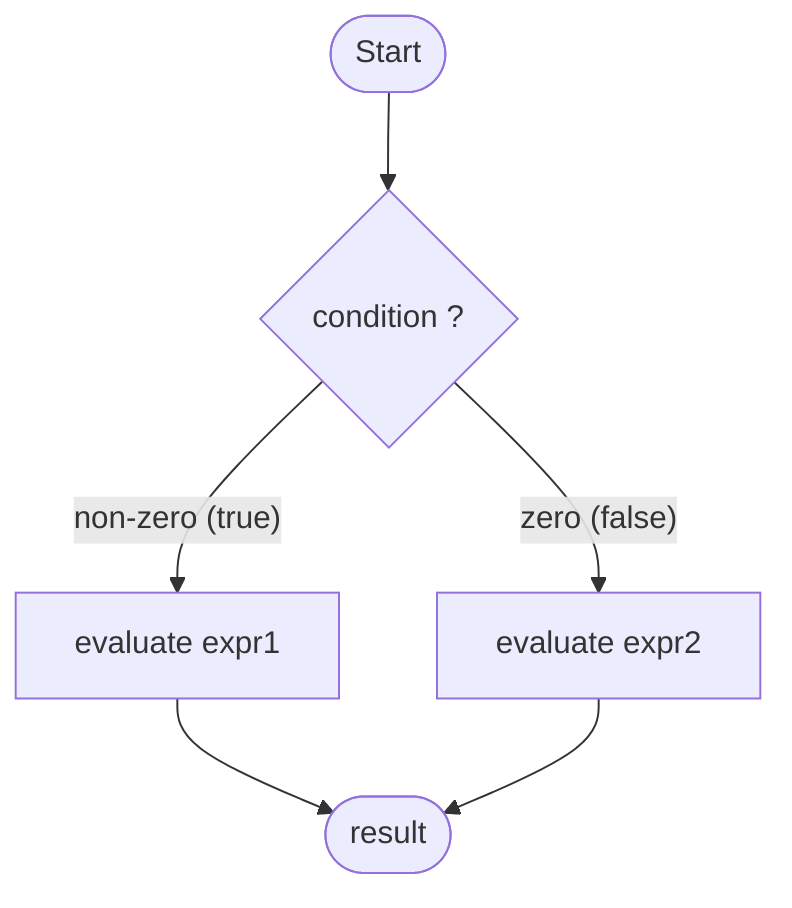
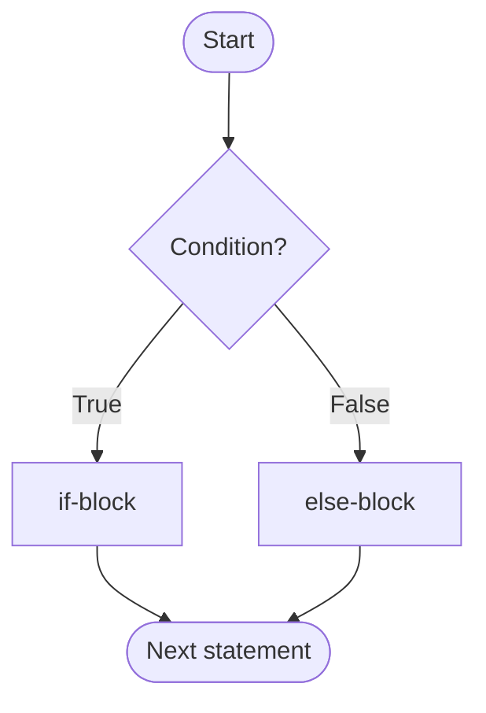
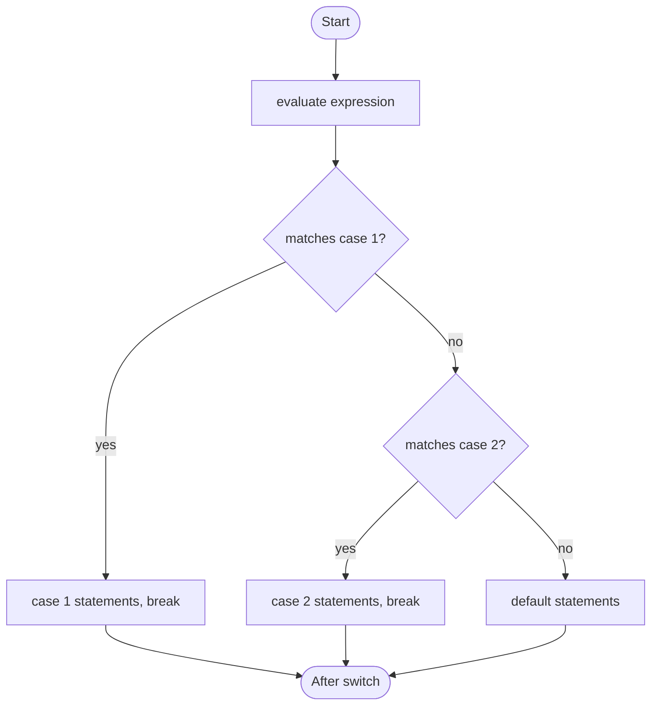
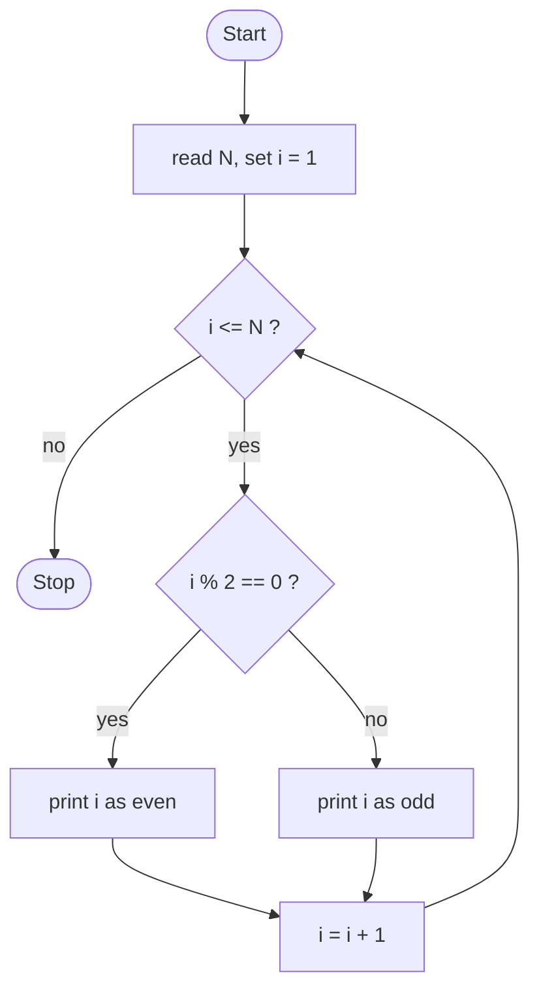

# C Programming — Complete Exam Answers

> A university-exam-style study sheet covering 19 core C topics, from identifiers to I/O functions. Every program is standard C (C99 or later) and every output block matches its program. Where a value depends on the machine or compiler, the text says so.

## Table of Contents

1. [Identifier in C Programming](#1-identifier-in-c-programming)
2. [Keyword](#2-keyword)
3. [Data Types](#3-data-types)
4. [Constants and Variables](#4-constants-and-variables)
5. [Ways of Defining Constants](#5-ways-of-defining-constants)
6. [Difference Between i++ and ++i](#6-difference-between-i-and-i)
7. [Pre-increment vs Post-increment](#7-pre-increment-vs-post-increment)
8. [Conditional Operator](#8-conditional-operator)
9. [Type Casting](#9-type-casting)
10. [break and continue](#10-break-and-continue)
11. [Array](#11-array)
12. [Type Conversion](#12-type-conversion)
13. [Implicit and Explicit Type Conversion](#13-implicit-and-explicit-type-conversion)
14. [Statements in C](#14-statements-in-c)
15. [if Statement](#15-if-statement)
16. [switch Statement](#16-switch-statement)
17. [Odd and Even Numbers Using a Loop](#17-odd-and-even-numbers-using-a-loop)
18. [2D Array and 3D Array](#18-2d-array-and-3d-array)
19. [I/O Functions](#19-io-functions)
20. [Quick Revision Tables](#quick-revision-tables)
21. [Frequently Confused Concepts](#frequently-confused-concepts)
22. [Important C Syntax at a Glance](#important-c-syntax-at-a-glance)
23. [Practice Questions](#practice-questions)

---

## 1. Identifier in C Programming

### Definition

An **identifier** is the name given by the programmer to a program element such as a variable, function, array, structure, label, or macro.

### Rules of Identifiers

1. It may contain only **letters (A–Z, a–z), digits (0–9), and the underscore `_`**.
2. It **must begin with a letter or an underscore**, never with a digit.
3. **No spaces or special characters** (`@ # $ % - + *` and so on) are allowed.
4. It **cannot be a keyword** (`int`, `if`, `while`, ...).
5. It is **case-sensitive**: `age`, `Age`, and `AGE` are three different identifiers.
6. It should be meaningful and not excessively long. The standard guarantees only the first 31 characters are significant for external names (63 for internal names in C99), so keep names shorter than that.
7. Avoid names beginning with an underscore followed by a capital letter, or with two underscores. These are reserved for the implementation.

### Examples

| Identifier | Valid? | Reason |
|---|---|---|
| `total` | Yes | Letters only |
| `_count` | Yes | May start with an underscore |
| `student1` | Yes | Digit allowed after the first character |
| `Roll_No` | Yes | Underscore allowed |
| `1st_year` | No | Starts with a digit |
| `my var` | No | Contains a space |
| `total-marks` | No | `-` is a special character (it is the minus operator) |
| `float` | No | Keyword |
| `price$` | No | `$` is not in the standard character set |

```c
#include <stdio.h>

int main(void)
{
    int Age = 20;
    int age = 25;   /* different identifier from Age */

    printf("Age = %d, age = %d\n", Age, age);
    return 0;
}
```

```text
Age = 20, age = 25
```

### Common Mistakes

```c
int 2nd = 5;       /* error: starts with a digit */
int total marks;   /* error: space inside the name */
int while = 3;     /* error: keyword used as identifier */
```

### Exam Point

- Identifier vs keyword: an identifier is chosen by the programmer, a keyword is reserved by the language.
- C is case-sensitive, so `INT` is a valid identifier but `int` is not.

---

## 2. Keyword

### Definition

A **keyword** is a **reserved word** with a fixed meaning to the compiler. It cannot be used as an identifier.

### Key Points

- Keywords are written in **lowercase**.
- ANSI C (C89) has **32 keywords**. Later standards add more (`inline`, `restrict`, `_Bool`, ...).
- Each keyword has a predefined purpose, for example `int` declares an integer and `if` starts a decision.

### The 32 Standard Keywords

| Category | Keywords |
|---|---|
| Data types | `int` `char` `float` `double` `void` |
| Type modifiers | `short` `long` `signed` `unsigned` |
| Storage classes | `auto` `register` `static` `extern` |
| Qualifiers | `const` `volatile` |
| User-defined types | `struct` `union` `enum` `typedef` |
| Selection | `if` `else` `switch` `case` `default` |
| Loops | `for` `while` `do` |
| Jump | `break` `continue` `goto` `return` |
| Operator | `sizeof` |

### Example

```c
#include <stdio.h>

int main(void)
{
    int value = 10;          /* 'int' is a keyword, 'value' is an identifier */
    if (value > 5)           /* 'if' is a keyword */
        printf("Greater\n");
    return 0;                /* 'return' is a keyword */
}
```

```text
Greater
```

### Exam Point

> `main`, `printf`, and `scanf` are **not** keywords. They are ordinary identifiers (function names). `sizeof` **is** a keyword although it looks like a function.

### Viva / Short Question

- *How many keywords are there in C?* 32 in ANSI C.
- *Can a keyword be used as a variable name?* No.

---

## 3. Data Types

### Definition

A **data type** specifies the **kind of value** a variable can hold, the **amount of memory** it needs, and the **operations** allowed on it.

### Classification

```text
C Data Types
├── Basic / Fundamental
│   ├── int
│   ├── char
│   ├── float
│   └── double
├── Derived
│   ├── Array
│   ├── Pointer
│   ├── Function
│   └── Structure / Union
├── Enumeration (enum)
└── Void (void)
```

Some textbooks list structure and union under a separate group called *user-defined types*.

### Types Explained

| Type | Meaning | Example | Format specifier |
|---|---|---|---|
| `int` | Whole numbers | `int age = 20;` | `%d` |
| `char` | A single character (stored as a small integer code) | `char grade = 'A';` | `%c` |
| `float` | Single-precision real number | `float pi = 3.14f;` | `%f` |
| `double` | Double-precision real number | `double e = 2.71828;` | `%f` (print), `%lf` (scan) |
| `void` | "No value": used for functions that return nothing, and for generic pointers | `void show(void);` | none |
| Array | Fixed number of same-type elements | `int a[5];` | none |
| Pointer | Holds a memory address | `int *p;` | `%p` |
| Structure | Group of different-type members | `struct Point { int x, y; };` | none |
| Enumeration | Named integer constants | `enum Day { MON, TUE };` | `%d` |

### Modifiers

`short`, `long`, `signed`, and `unsigned` change the size or range of the basic types, for example `unsigned int`, `long int`, `long double`.

### Example — Finding Sizes

Sizes are **implementation-defined**. Never assume a fixed byte count; use `sizeof`.

```c
#include <stdio.h>

int main(void)
{
    printf("char        : %zu byte(s)\n", sizeof(char));
    printf("int         : %zu byte(s)\n", sizeof(int));
    printf("float       : %zu byte(s)\n", sizeof(float));
    printf("double      : %zu byte(s)\n", sizeof(double));
    printf("long        : %zu byte(s)\n", sizeof(long));
    return 0;
}
```

Typical output on a 64-bit Linux system (Windows prints `4` for `long`):

```text
char        : 1 byte(s)
int         : 4 byte(s)
float       : 4 byte(s)
double      : 8 byte(s)
long        : 8 byte(s)
```

### Exam Point

- `sizeof(char)` is **always 1** by definition.
- The standard only guarantees minimum ranges, for example `int` holds at least 16 bits.

---

## 4. Constants and Variables

### Definitions

- A **variable** is a **named memory location** whose value **can change** during program execution.
- A **constant** is a value that **cannot change** during program execution.

### Syntax

```c
data_type variable_name;                 /* declaration */
data_type variable_name = value;         /* declaration + initialization */
const data_type constant_name = value;   /* constant object */
```

### Differences

| Feature | Constant | Variable |
|---|---|---|
| Value | Fixed, cannot be modified | Can be modified any time |
| Keyword / directive | `const`, `#define`, `enum`, or a literal | Plain declaration |
| Assignment after definition | Not allowed | Allowed |
| Example | `3.14`, `'A'`, `const int MAX = 100;` | `int marks = 70;` |
| Use | Fixed data such as π or a maximum size | Data that changes such as a counter or total |

### Example

```c
#include <stdio.h>

int main(void)
{
    const double PI = 3.14159;   /* constant */
    int radius = 5;              /* variable */

    radius = 10;                 /* allowed: variables can change */
    /* PI = 3.14;  -> error: assignment of read-only variable */

    printf("Area = %.2f\n", PI * radius * radius);
    return 0;
}
```

```text
Area = 314.16
```

### Common Mistakes

```c
const int MAX = 10;
MAX = 20;          /* error: cannot modify a const object */
```

### Exam Point

- **Declaration** reserves the name and type. **Initialization** gives the first value. A `const` object *must* be initialized where it is defined.

---

## 5. Ways of Defining Constants

### Definition

A constant can be introduced in C in four common ways: as a **literal**, with the **`const` qualifier**, with the **`#define` preprocessor directive**, or with an **`enum`**.

### 1. Literal Constants

The value written directly in the code.

| Kind | Examples |
|---|---|
| Integer | `10`, `-5`, `0x1F` (hex), `075` (octal) |
| Floating-point | `3.14`, `2.5e3`, `1.5f` |
| Character | `'A'`, `'\n'` |
| String | `"Hello"` |

### 2. `const` Qualifier

```c
const data_type name = value;
```

```c
const int MAX_MARKS = 100;
const float TAX = 0.15f;
```

- It creates a **typed, read-only object** that occupies memory and obeys scope rules.

### 3. `#define` Preprocessor Macro

```c
#define NAME value
```

```c
#define PI 3.14159
#define SIZE 5
```

- The preprocessor **replaces text** before compilation. There is **no type**, **no memory**, and **no semicolon** at the end.

### 4. `enum` (Enumerated Constants)

```c
enum { RED, GREEN, BLUE };            /* 0, 1, 2 */
enum Level { LOW = 1, HIGH = 10 };    /* explicit values */
```

- Gives names to a group of related integer constants.

### Comparison

| Feature | Literal | `const` | `#define` | `enum` |
|---|---|---|---|---|
| Has a type | Yes (implied) | Yes | No | Integer |
| Uses memory | No | Yes | No | No |
| Handled by | Compiler | Compiler | Preprocessor | Compiler |
| Obeys scope | n/a | Yes | No (file-wide from definition) | Yes |
| Semicolon | n/a | Yes | **No** | Yes |
| Best for | One-off values | Typed fixed values | Simple symbolic names | Groups of related codes |

### Example

```c
#include <stdio.h>

#define SIZE 3                       /* macro */

enum Day { MON, TUE, WED };          /* enum */

int main(void)
{
    const int BONUS = 50;            /* const object */
    int marks[SIZE] = {70, 80, 90};  /* SIZE replaced by 3 */

    printf("Total = %d\n", marks[0] + marks[1] + marks[2] + BONUS);
    printf("WED = %d\n", WED);
    return 0;
}
```

```text
Total = 290
WED = 2
```

### Common Mistakes

```c
#define PI = 3.14;      /* wrong: '=' and ';' become part of the text */
#define PI 3.14         /* correct */
```

### Exam Point

- A `const` object is **not** a constant expression in C, so `int a[BONUS];` is not portable at file scope. Use `#define` or `enum` for array sizes in classic exam-level C.

---

## 6. Difference Between i++ and ++i

### Definition

- `i++` is the **post-increment** operator: it uses the **current value** of `i` in the expression, **then** increments `i`.
- `++i` is the **pre-increment** operator: it **increments** `i` first, then uses the **new value** in the expression.

In both cases `i` ends up increased by 1. The difference is the **value of the expression**.

### Comparison Table

| Feature | `i++` | `++i` |
|---|---|---|
| Name | Post-increment | Pre-increment |
| Value of the expression | Old value of `i` | New value of `i` |
| When `i` changes | After the value is taken | Before the value is taken |
| Final value of `i` (i = 5) | 6 | 6 |
| Example | `x = i++;` gives x = 5 | `x = ++i;` gives x = 6 |

### Example 1 — Using `printf`

```c
#include <stdio.h>

int main(void)
{
    int i = 5;
    printf("%d\n", i++);   /* prints old value */
    printf("%d\n", i);     /* i is now 6 */

    int j = 5;
    printf("%d\n", ++j);   /* prints new value */
    printf("%d\n", j);
    return 0;
}
```

```text
5
6
6
6
```

### Example 2 — Same Problem in Both Forms

```c
#include <stdio.h>

int main(void)
{
    int a = 5, b;

    b = a++;
    printf("Post: a = %d, b = %d\n", a, b);

    a = 5;
    b = ++a;
    printf("Pre : a = %d, b = %d\n", a, b);
    return 0;
}
```

```text
Post: a = 6, b = 5
Pre : a = 6, b = 6
```

### Example 3 — Decrement Version

```c
int n = 10;
printf("%d ", n--);   /* 10, then n becomes 9 */
printf("%d\n", --n);  /* n becomes 8, prints 8 */
```

```text
10 8
```

### Exam Point

- As a **standalone statement** (`i++;` or `++i;`) both behave identically.
- `i++` needs a temporary copy of the old value, so `++i` can be marginally cheaper for class-like types in C++. For plain C integers, compilers optimize both the same way.

### Common Confusion

> "`i++` increments after the statement ends." **Wrong.** The increment happens at some point before the *next sequence point* (for example the end of a full expression), not necessarily at the end of the statement, and modifying `i` again in the same expression is undefined. See Topic 7.

---

## 7. Pre-increment vs Post-increment

### Definition

**Pre-increment** (`++x`) increases the operand and yields the **updated** value. **Post-increment** (`x++`) yields the **original** value and increases the operand as a side effect.

### Evaluation Order

```text
Post-increment  y = x++;          Pre-increment   y = ++x;
  x = 10                            x = 10
  1) take value of x  -> 10         1) x = x + 1        -> x = 11
  2) y = 10                         2) take value of x  -> 11
  3) x = x + 1        -> x = 11     3) y = 11
```

### Example 1 — Inside an Arithmetic Expression

```c
#include <stdio.h>

int main(void)
{
    int x = 10, y;

    y = x++ + 5;   /* uses 10, then x becomes 11 */
    printf("Post: x = %d, y = %d\n", x, y);

    x = 10;
    y = ++x + 5;   /* x becomes 11, uses 11 */
    printf("Pre : x = %d, y = %d\n", x, y);
    return 0;
}
```

```text
Post: x = 11, y = 15
Pre : x = 11, y = 16
```

### Example 2 — As an Array Index

```c
#include <stdio.h>

int main(void)
{
    int arr[] = {10, 20, 30};
    int i = 0;

    printf("%d ", arr[i++]);   /* arr[0], then i = 1 */
    printf("%d\n", arr[++i]);  /* i = 2, then arr[2] */
    return 0;
}
```

```text
10 30
```

### Example 3 — In a Loop

```c
for (int i = 0; i < 3; i++)  printf("%d ", i);   /* 0 1 2 */
for (int i = 0; i < 3; ++i)  printf("%d ", i);   /* 0 1 2 */
```

The loop update expression's *value is discarded*, so both forms give the same output.

### Comparison Table

| Aspect | Pre-increment `++i` | Post-increment `i++` |
|---|---|---|
| Increments | Before use | After use (value is captured first) |
| Result of expression | New value | Old value |
| Result is an lvalue in C? | No | No |
| Typical use | When the updated value is needed immediately | When the old value is needed, for example `arr[i++]` |

### Warning — Undefined Behavior

> Modifying the same variable more than once between two sequence points is **undefined behavior**. Never write the following. The result is unpredictable and different compilers may print different values.

```c
int i = 5;
int r = i++ + ++i;      /* UNDEFINED BEHAVIOR - do not use */
i = i++;                /* UNDEFINED BEHAVIOR - do not use */
printf("%d %d", i, i++);/* UNSPECIFIED/UNDEFINED - do not use */
```

### Exam Point

- Post: **use, then change**. Pre: **change, then use**.
- Precedence: postfix `++` binds tighter than prefix `++`, which binds tighter than `*` and `+`.

### Viva / Short Question

- *What is the output of `int a = 3; printf("%d %d", a, ++a);`?* Unspecified. The evaluation order of function arguments is not defined, so this is not a valid exam answer.

---

## 8. Conditional Operator

### Definition

The **conditional operator** `?:` is C's only **ternary operator** (three operands). It selects one of two expressions depending on a condition and works as a compact `if...else` that produces a value.

### Syntax

```c
condition ? expression_if_true : expression_if_false;
```

### Working

1. `condition` is evaluated first.
2. If it is **non-zero (true)**, only `expression_if_true` is evaluated and becomes the result.
3. If it is **zero (false)**, only `expression_if_false` is evaluated and becomes the result.



### Example 1 — Larger of Two Numbers

```c
#include <stdio.h>

int main(void)
{
    int a = 10, b = 20;
    int max = (a > b) ? a : b;

    printf("Maximum = %d\n", max);
    return 0;
}
```

```text
Maximum = 20
```

### Example 2 — Odd or Even

```c
#include <stdio.h>

int main(void)
{
    int n = 7;
    printf("%d is %s\n", n, (n % 2 == 0) ? "even" : "odd");
    return 0;
}
```

```text
7 is odd
```

### Example 3 — Nested (Grade)

```c
#include <stdio.h>

int main(void)
{
    int marks = 72;
    char grade = (marks >= 80) ? 'A' : (marks >= 60) ? 'B' : 'C';

    printf("Grade = %c\n", grade);
    return 0;
}
```

```text
Grade = B
```

### Same Logic With `if...else`

```c
int max;
if (a > b)
    max = a;
else
    max = b;
```

### Exam Point

- It is **right-associative**: `a ? b : c ? d : e` means `a ? b : (c ? d : e)`.
- Only the chosen branch is evaluated (short-circuit behavior).
- It returns a value, so it can appear inside `printf`, an assignment, or a `return`.

### Common Mistakes

```c
int m = a > b ? a : b = 5;   /* error: parsed as (a > b ? a : b) = 5, not an lvalue */
```

Use parentheses whenever the expression is not trivial.

---

## 9. Type Casting

### Definition

**Type casting** is the **explicit conversion** of a value from one data type to another, requested by the programmer through the cast operator.

### Syntax

```c
(target_type) expression
```

### Types of Conversion Related to Casting

| Type | Who performs it | Example |
|---|---|---|
| **Explicit** (type casting) | Programmer, with `(type)` | `(float) a / b` |
| **Implicit** (automatic) | Compiler | `int + float` is converted to float |

Casting itself is always *explicit*. The implicit form is covered in Topics 12 and 13.

### Working

The cast operator has **higher precedence than `*`, `/`, `+`, `-`**, so it applies to the operand that follows it, not to the whole expression.

### Example 1 — Fixing Integer Division

```c
#include <stdio.h>

int main(void)
{
    int a = 7, b = 2;

    float without_cast = a / b;          /* integer division first */
    float with_cast    = (float)a / b;   /* a becomes 7.0f first */
    float wrong_place  = (float)(a / b); /* cast AFTER dividing */

    printf("Without cast : %f\n", without_cast);
    printf("With cast    : %f\n", with_cast);
    printf("Wrong place  : %f\n", wrong_place);
    return 0;
}
```

```text
Without cast : 3.000000
With cast    : 3.500000
Wrong place  : 3.000000
```

### Example 2 — Other Casts

```c
#include <stdio.h>

int main(void)
{
    double price = 9.99;
    int whole = (int)price;      /* fractional part truncated, not rounded */
    char letter = (char)66;      /* integer code 66 is 'B' */
    int code = (int)'A';         /* character to its code */

    printf("%d %c %d\n", whole, letter, code);
    return 0;
}
```

```text
9 B 65
```

### Exam Point

- Casting a floating-point value to an integer **truncates toward zero** (`(int)-2.7` is `-2`).
- Casting does not change the variable itself; it produces a **converted temporary value**.
- Casting a value that does not fit in the target type may lose data or be undefined (for example a huge `double` to `int`).

### Common Mistakes

```c
float avg = (float)(sum / count);   /* integer division already happened */
float avg = (float)sum / count;     /* correct */
```

---

## 10. break and continue

### Definitions

- **`break`** immediately **terminates the nearest enclosing loop or `switch`** and transfers control to the statement after it.
- **`continue`** **skips the rest of the current iteration** of the nearest enclosing loop and proceeds to the next iteration.

### Syntax

```c
break;
continue;
```

### Flow Difference

```text
break:                           continue:
while (cond) {                   while (cond) {
    ...                              ...
    if (x) break;  --+               if (x) continue; --+
    ...              |               ...                |
}                    |           }  <-------------------+  (back to condition check)
next statement <-----+           next statement
```

### Example 1 — `break`

```c
#include <stdio.h>

int main(void)
{
    for (int i = 1; i <= 10; i++) {
        if (i == 5)
            break;            /* leave the loop completely */
        printf("%d ", i);
    }
    printf("\nLoop ended\n");
    return 0;
}
```

```text
1 2 3 4 
Loop ended
```

### Example 2 — `continue`

```c
#include <stdio.h>

int main(void)
{
    for (int i = 1; i <= 5; i++) {
        if (i == 3)
            continue;         /* skip only the value 3 */
        printf("%d ", i);
    }
    printf("\n");
    return 0;
}
```

```text
1 2 4 5 
```

### Example 3 — Side-by-Side (Same Loop, Same Condition)

```c
#include <stdio.h>

int main(void)
{
    printf("break   : ");
    for (int i = 1; i <= 5; i++) {
        if (i == 3) break;
        printf("%d ", i);
    }

    printf("\ncontinue: ");
    for (int i = 1; i <= 5; i++) {
        if (i == 3) continue;
        printf("%d ", i);
    }
    printf("\n");
    return 0;
}
```

```text
break   : 1 2 
continue: 1 2 4 5 
```

### Comparison Table

| Feature | `break` | `continue` |
|---|---|---|
| Effect | Exits the loop or `switch` entirely | Skips to the next iteration |
| Remaining iterations | Not executed | Still executed |
| Can be used in `switch` | **Yes** | **No** (only inside a loop) |
| Typical use | Stop on found/error/exit condition | Skip unwanted values |
| Control goes to | Statement after the loop | Loop condition/update |

### Nested Loops

Both affect **only the innermost** loop that contains them.

```c
#include <stdio.h>

int main(void)
{
    for (int i = 1; i <= 3; i++) {
        for (int j = 1; j <= 3; j++) {
            if (j == 2)
                break;                 /* leaves inner loop only */
            printf("(%d,%d) ", i, j);
        }
    }
    printf("\n");
    return 0;
}
```

```text
(1,1) (2,1) (3,1) 
```

### Inside `switch`

`break` ends the `switch`. A `continue` inside a `switch` that is inside a loop applies to the **loop**.

### Common Mistakes

- Using `continue` in a `while` loop **before** updating the counter creates an infinite loop:

```c
int i = 0;
while (i < 5) {
    if (i == 2) continue;   /* i never changes again -> infinite loop */
    i++;
}
```

### Viva / Short Question

- *Can `continue` be used with `switch` alone?* No. It requires an enclosing loop.

---

## 11. Array

### Definition

An **array** is a collection of a **fixed number of elements of the same data type**, stored in **contiguous memory locations** under **one name** and accessed using an **index**.

### Characteristics

1. All elements have the **same type**.
2. Elements occupy **consecutive** memory locations.
3. Indexing is **zero-based**: the first element is `a[0]`, the last is `a[n-1]`.
4. The size is **fixed** at declaration (for a standard array).
5. C performs **no bounds checking**. Accessing `a[n]` or beyond is undefined behavior.
6. The array name, in most expressions, decays to a pointer to its first element.

### Need

Storing 100 marks with 100 separate variables is impractical. An array stores them under one name and lets a loop process them.

### Declaration and Initialization

```c
data_type array_name[size];
```

```c
int a[5];                          /* declaration only: values are indeterminate */
int b[5] = {10, 20, 30, 40, 50};   /* full initialization */
int c[5] = {1, 2};                 /* rest become 0: {1, 2, 0, 0, 0} */
int d[]  = {5, 6, 7};              /* size deduced as 3 */
int e[5] = {0};                    /* all zeros */
```

### Visual Representation

```text
int b[5] = {10, 20, 30, 40, 50};

Index:      0     1     2     3     4
         +-----+-----+-----+-----+-----+
Array b: | 10  | 20  | 30  | 40  | 50  |
         +-----+-----+-----+-----+-----+
Address: 1000  1004  1008  1012  1016     (assuming 4-byte int)
```

### Accessing and Updating

```c
b[2] = 35;                 /* update third element */
int x = b[0] + b[4];       /* 10 + 50 = 60 */
int n = sizeof(b) / sizeof(b[0]);   /* number of elements: 5 */
```

### Example — Read, Print, Sum, Largest

```c
#include <stdio.h>

#define N 5

int main(void)
{
    int a[N];
    int sum = 0;

    printf("Enter %d integers: ", N);
    for (int i = 0; i < N; i++)
        scanf("%d", &a[i]);

    int largest = a[0];
    for (int i = 0; i < N; i++) {
        sum += a[i];
        if (a[i] > largest)
            largest = a[i];
    }

    printf("Elements: ");
    for (int i = 0; i < N; i++)
        printf("%d ", a[i]);

    printf("\nSum     = %d\n", sum);
    printf("Largest = %d\n", largest);
    return 0;
}
```

Sample run (the first line after the prompt is typed by the user):

```text
Enter 5 integers: 12 45 7 30 18
Elements: 12 45 7 30 18 
Sum     = 112
Largest = 45
```

### Exam Point

- `int a[5]` has valid indices **0 to 4**.
- Arrays cannot be assigned as a whole (`a = b;` is an error). Copy element by element or use `memcpy`.
- An array passed to a function is passed as a pointer, so the callee sees the original elements.

### Common Mistakes

```c
int a[3] = {1, 2, 3, 4};   /* too many initializers: error/warning */
for (int i = 0; i <= 3; i++) a[i] = 0;   /* i = 3 writes out of bounds: undefined behavior */
int n = 5; int arr[n];      /* variable-length array: C99 only, avoid in exam-level portable code */
```

---

## 12. Type Conversion

### Definition

**Type conversion** is the process of changing a value from one data type to another. In C it can be done **automatically by the compiler** (implicit) or **requested by the programmer** (explicit, via a cast).

### Categories

| Category | Also called | Done by | Example |
|---|---|---|---|
| Implicit conversion | Automatic / coercion | Compiler | `int + double` yields double |
| Explicit conversion | Type casting | Programmer | `(int) 3.9` |

### Implicit Conversion Rules

1. **Integer promotion:** `char` and `short` operands are promoted to `int` before arithmetic.
2. **Usual arithmetic conversions:** in a binary operation, the operand with the **lower** rank is converted to the **higher** rank.
3. **Assignment conversion:** the right-hand value is converted to the type of the left-hand variable (this may lose data).

Conversion hierarchy (low to high):

```text
char/short -> int -> unsigned int -> long -> unsigned long -> long long -> float -> double -> long double
```

### Example 1 — Widening (Safe)

```c
#include <stdio.h>

int main(void)
{
    char ch = 'A';
    int i = 5;
    float f = 2.5f;

    int n = ch + 1;          /* 'A' (65) promoted to int -> 66 */
    float r = i + f;         /* i converted to float -> 7.5 */

    printf("n = %d, r = %.1f\n", n, r);
    return 0;
}
```

```text
n = 66, r = 7.5
```

### Example 2 — Narrowing (Data May Be Lost)

```c
#include <stdio.h>

int main(void)
{
    double d = 9.99;
    int t = d;               /* fractional part discarded */
    int big = 65;
    char c = big;            /* stored as character 'A' */

    printf("t = %d, c = %c\n", t, c);
    return 0;
}
```

```text
t = 9, c = A
```

### Example 3 — A Classic Trap (Signed vs Unsigned)

```c
#include <stdio.h>

int main(void)
{
    int s = -1;
    unsigned int u = 1;

    if (s < u)
        printf("true\n");
    else
        printf("false\n");   /* s is converted to a huge unsigned value */
    return 0;
}
```

```text
false
```

Compilers with `-Wall -Wextra` warn about this comparison.

### Exam Point

- Widening (small to large) is generally safe. Narrowing (large to small, float to int) may lose data.
- `float` to `int` truncates; it does not round.

---

## 13. Implicit and Explicit Type Conversion

### Definitions

- **Implicit conversion:** performed **automatically by the compiler** when operands of different types are mixed.
- **Explicit conversion:** performed **deliberately by the programmer** using the cast operator `(type)`.

### Comparison Table

| Feature | Implicit conversion | Explicit conversion |
|---|---|---|
| Performed by | Compiler | Programmer |
| Syntax | None | `(type) expression` |
| Also called | Automatic conversion, coercion, promotion | Type casting |
| Control | No control over when it occurs | Full control |
| Data loss | Possible (for example double to int on assignment) | Possible, but intentional |
| Readability | Hidden, can surprise | Visible, documents intent |
| Example | `float f = 5;` | `float f = (float)5 / 2;` |

### Same Problem, Both Forms

Task: average of a total of 17 over 4 items.

```c
#include <stdio.h>

int main(void)
{
    int total = 17, count = 4;

    double wrong    = total / count;             /* integer division: 4 */
    double via_implicit = (total * 1.0) / count;     /* 1.0 forces implicit conversion */
    double via_cast = (double)total / count;     /* explicit cast */

    printf("No conversion : %.2f\n", wrong);
    printf("Implicit      : %.2f\n", via_implicit);
    printf("Explicit      : %.2f\n", via_cast);
    return 0;
}
```

```text
No conversion : 4.00
Implicit      : 4.25
Explicit      : 4.25
```

### More Examples

Implicit:

```c
int a = 10;
float b = a;          /* int -> float automatically: 10.0 */
double c = a + 2.5;   /* 10 becomes 10.0, result 12.5 */
```

Explicit:

```c
double pi = 3.14159;
int whole = (int)pi;              /* 3 */
int pct = (int)(0.756 * 100);     /* 75 (0.756*100 = 75.6, truncated) */
```

### Exam Point

- Every explicit conversion is a *conversion*, but not every conversion is explicit.
- Use an explicit cast when you want the code to show clearly that a change of type is intended.

---

## 14. Statements in C

### Definition

A **statement** is a complete instruction that causes the computer to perform an action. Most simple statements end with a **semicolon**.

### Types of Statements

| Type | Purpose | Example |
|---|---|---|
| Expression statement | Evaluates an expression (assignment, function call, increment) | `x = 5;` `printf("Hi");` `i++;` |
| Null statement | Does nothing | `;` |
| Compound (block) statement | Groups several statements inside `{ }` | `{ a = 1; b = 2; }` |
| Selection statement | Chooses a path | `if`, `if...else`, `switch` |
| Iteration statement | Repeats | `for`, `while`, `do...while` |
| Jump statement | Transfers control | `break`, `continue`, `goto`, `return` |
| Labeled statement | Marks a target | `case 1:`, `default:`, `label:` |

Declarations (for example `int x = 5;`) are not statements in the strict standard definition, but syllabi often group them with statements as *declaration statements*.

### Example

```c
#include <stdio.h>

int main(void)
{
    int x = 5;                       /* declaration */
    int sum = 0;

    x = x + 1;                       /* expression statement */

    if (x > 5) {                     /* selection + compound statement */
        sum = x * 2;
    }

    for (int i = 0; i < 3; i++) {    /* iteration statement */
        sum += i;
    }

    printf("Sum = %d\n", sum);       /* expression statement (function call) */
    return 0;                        /* jump statement */
}
```

```text
Sum = 15
```

Working: `x` becomes 6, so `sum = 12`. The loop adds 0, 1, 2, giving 15.

### Common Mistakes

```c
if (x > 5);          /* stray semicolon = null statement as the body */
    printf("Big");   /* always runs */
```

### Exam Point

- A **block** `{ ... }` is treated as one statement and needs no closing semicolon.

---

## 15. if Statement

### Definition

The **`if` statement** is a **selection (decision-making) statement** that executes a block of code only when a given condition is true (non-zero).

### Types

| Form | Use |
|---|---|
| Simple `if` | Run code only if the condition is true |
| `if...else` | Choose between two paths |
| `else-if` ladder | Choose among many mutually exclusive conditions |
| Nested `if` | An `if` inside another `if` |

### 1. Simple `if`

```c
if (condition) {
    statements;
}
```

```c
#include <stdio.h>

int main(void)
{
    int number = 5;
    if (number > 0)
        printf("Positive\n");
    return 0;
}
```

```text
Positive
```

### 2. `if...else`

```c
if (condition) {
    statements_if_true;
} else {
    statements_if_false;
}
```



```c
#include <stdio.h>

int main(void)
{
    int age = 16;
    if (age >= 18)
        printf("Eligible to vote\n");
    else
        printf("Not eligible to vote\n");
    return 0;
}
```

```text
Not eligible to vote
```

### 3. `else-if` Ladder

```c
if (condition1) {
    ...
} else if (condition2) {
    ...
} else if (condition3) {
    ...
} else {
    ...
}
```

Conditions are tested **top to bottom**. The first true one runs and the rest are skipped.

```c
#include <stdio.h>

int main(void)
{
    int marks = 72;

    if (marks >= 80)
        printf("Grade A\n");
    else if (marks >= 60)
        printf("Grade B\n");
    else if (marks >= 40)
        printf("Grade C\n");
    else
        printf("Fail\n");
    return 0;
}
```

```text
Grade B
```

### 4. Nested `if`

```c
if (condition1) {
    if (condition2) {
        ...
    }
}
```

```c
#include <stdio.h>

int main(void)
{
    int a = 15, b = 42, c = 27;
    int largest;

    if (a > b) {
        if (a > c) largest = a;
        else       largest = c;
    } else {
        if (b > c) largest = b;
        else       largest = c;
    }

    printf("Largest = %d\n", largest);
    return 0;
}
```

```text
Largest = 42
```

### Exam Point

- In C, **any non-zero value is true and 0 is false**.
- An `else` always pairs with the **nearest unmatched `if`** (the dangling-else rule). Use braces to make the pairing explicit.
- Braces are optional for a single statement, but always recommended.

### Common Mistakes

```c
if (x = 5)   { ... }   /* assignment, always true; meant x == 5 */
if (x > 5);  { ... }   /* semicolon ends the if; block always runs */
if (0 < x < 10)        /* wrong: (0 < x) is 0 or 1, always < 10 */
if (x > 0 && x < 10)   /* correct */
```

### Viva / Short Question

- *Difference between `=` and `==`?* `=` assigns, `==` compares.

---

## 16. switch Statement

### Definition

The **`switch` statement** is a **multi-way selection statement** that compares the value of one integer expression against a list of constant `case` labels and executes the matching block.

### Syntax

```c
switch (expression) {
    case constant1:
        statements;
        break;
    case constant2:
        statements;
        break;
    ...
    default:
        statements;
}
```

### Working

1. The controlling `expression` is evaluated once.
2. Its value is compared with each `case` constant.
3. On a match, execution starts at that label and **continues downward** until a `break` or the end of the `switch`.
4. If nothing matches, control goes to `default` (if present).



### Rules

1. The controlling expression must have **integer type** (`int`, `char`, `enum`). **`float`, `double`, and strings are not allowed.**
2. Each `case` label must be an **integer constant expression**, not a variable.
3. Case values must be **unique**.
4. `default` is **optional** and may appear anywhere, though it is usually last.
5. `break` is optional but normally needed to stop **fall-through**.
6. `case` labels only mark positions. Statements do not need braces, but declarations after a label need a block.

### Example 1 — Calculator

```c
#include <stdio.h>

int main(void)
{
    double a, b;
    char op;

    printf("Enter expression: ");
    scanf("%lf %c %lf", &a, &op, &b);

    switch (op) {
        case '+': printf("Result = %.2f\n", a + b); break;
        case '-': printf("Result = %.2f\n", a - b); break;
        case '*': printf("Result = %.2f\n", a * b); break;
        case '/':
            if (b != 0)
                printf("Result = %.2f\n", a / b);
            else
                printf("Division by zero\n");
            break;
        default:
            printf("Invalid operator\n");
    }
    return 0;
}
```

```text
Enter expression: 12 * 4
Result = 48.00
```

### Example 2 — What Happens Without `break` (Fall-Through)

```c
#include <stdio.h>

int main(void)
{
    int n = 2;

    printf("Without break:\n");
    switch (n) {
        case 1: printf("One\n");
        case 2: printf("Two\n");
        case 3: printf("Three\n");
        default: printf("Default\n");
    }

    printf("With break:\n");
    switch (n) {
        case 1: printf("One\n");   break;
        case 2: printf("Two\n");   break;
        case 3: printf("Three\n"); break;
        default: printf("Default\n");
    }
    return 0;
}
```

```text
Without break:
Two
Three
Default
With break:
Two
```

### Example 3 — Intentional Fall-Through (Grouped Cases)

```c
#include <stdio.h>

int main(void)
{
    char ch = 'e';

    switch (ch) {
        case 'a': case 'e': case 'i': case 'o': case 'u':
            printf("%c is a vowel\n", ch);
            break;
        default:
            printf("%c is not a vowel\n", ch);
    }
    return 0;
}
```

```text
e is a vowel
```

### `if...else` vs `switch`

| Feature | `if...else if` | `switch` |
|---|---|---|
| Condition type | Any expression (ranges, floats, logic) | Equality against integer constants only |
| Ranges | Yes (`x > 10 && x < 20`) | No |
| Readability with many fixed values | Lower | Higher |
| Fall-through | No | Yes (needs `break`) |

### Common Mistakes

```c
switch (x) {
    case 1.5: ...        /* error: not an integer constant */
    case y:   ...        /* error: y is a variable */
    case 1: ... case 1:  /* error: duplicate case value */
}
```

### Exam Point

- `break` in `switch` transfers control **out of the switch**, not out of an enclosing loop.

---

## 17. Odd and Even Numbers Using a Loop

### Core Logic

A whole number is **even** if it is divisible by 2 (remainder 0) and **odd** otherwise. The remainder is found with the modulus operator `%`.

```c
if (n % 2 == 0)   /* even */
if (n % 2 != 0)   /* odd: use != 0, not == 1 */
```

> Use `!= 0` for odd. In C99 and later, `-3 % 2` is `-1`, so the test `n % 2 == 1` fails for negative odd numbers.

### Algorithm (Print Odd and Even Numbers From 1 to N)

1. Start.
2. Read `N`.
3. Set `i = 1`.
4. If `i > N`, stop.
5. If `i % 2 == 0`, `i` is even. Otherwise `i` is odd.
6. Increase `i` by 1 and go to step 4.



### Program 1 — Odd and Even Numbers in a Range (`for` loop)

```c
#include <stdio.h>

int main(void)
{
    int n;

    printf("Enter the limit: ");
    scanf("%d", &n);

    printf("Even numbers: ");
    for (int i = 1; i <= n; i++) {
        if (i % 2 == 0)
            printf("%d ", i);
    }

    printf("\nOdd numbers : ");
    for (int i = 1; i <= n; i++) {
        if (i % 2 != 0)
            printf("%d ", i);
    }
    printf("\n");
    return 0;
}
```

```text
Enter the limit: 10
Even numbers: 2 4 6 8 10 
Odd numbers : 1 3 5 7 9 
```

### Program 2 — Checking Many Numbers (`while` loop, stops at 0)

```c
#include <stdio.h>

int main(void)
{
    int n;

    printf("Enter numbers (0 to stop): ");
    scanf("%d", &n);

    while (n != 0) {
        if (n % 2 == 0)
            printf("%d is even\n", n);
        else
            printf("%d is odd\n", n);
        scanf("%d", &n);
    }
    return 0;
}
```

```text
Enter numbers (0 to stop): 7 12 5 0
7 is odd
12 is even
5 is odd
```

### Program 3 — Faster Version (Step by 2)

```c
#include <stdio.h>

int main(void)
{
    int n = 10;

    printf("Even: ");
    for (int i = 2; i <= n; i += 2)
        printf("%d ", i);

    printf("\nOdd : ");
    for (int i = 1; i <= n; i += 2)
        printf("%d ", i);
    printf("\n");
    return 0;
}
```

```text
Even: 2 4 6 8 10 
Odd : 1 3 5 7 9 
```

### Exam Point

- `for` is preferred when the number of repetitions is known. `while` suits "repeat until a condition changes".
- Checking one number needs no loop; the loop is what lets us test a whole range.

---

## 18. 2D Array and 3D Array

### 2D Array

#### Definition

A **two-dimensional array** is an array of arrays, organized as **rows and columns** (a table or matrix). Each element is identified by **two indices**: `a[row][column]`.

#### Declaration and Initialization

```c
data_type name[rows][columns];
```

```c
int a[2][3];                       /* 2 rows, 3 columns, uninitialized */

int b[2][3] = {
    {1, 2, 3},                     /* row 0 */
    {4, 5, 6}                      /* row 1 */
};

int c[2][3] = {1, 2, 3, 4, 5, 6};  /* flat form, filled row by row */
int d[][3]  = {{1, 2, 3}, {4, 5, 6}};   /* only the first size may be omitted */
```

#### Visual

```text
int b[2][3]

          Col 0     Col 1     Col 2
        +---------+---------+---------+
Row 0   | b[0][0] | b[0][1] | b[0][2] |
        |    1    |    2    |    3    |
        +---------+---------+---------+
Row 1   | b[1][0] | b[1][1] | b[1][2] |
        |    4    |    5    |    6    |
        +---------+---------+---------+
```

#### Memory Layout (Row-Major)

C stores 2D arrays **row by row** in contiguous memory:

```text
Memory:  1   2   3   4   5   6
         b[0][0] b[0][1] b[0][2] b[1][0] b[1][1] b[1][2]

Offset of b[i][j] = i * COLUMNS + j     (in elements)
b[1][2]  ->  1 * 3 + 2 = 5  -> the 6th element (value 6)
```

#### Traversal Example

```c
#include <stdio.h>

int main(void)
{
    int a[2][3] = {
        {1, 2, 3},
        {4, 5, 6}
    };
    int total = 0;

    for (int i = 0; i < 2; i++) {
        int row_sum = 0;
        for (int j = 0; j < 3; j++) {
            printf("%d ", a[i][j]);
            row_sum += a[i][j];
        }
        printf("| row sum = %d\n", row_sum);
        total += row_sum;
    }
    printf("Total = %d\n", total);
    return 0;
}
```

```text
1 2 3 | row sum = 6
4 5 6 | row sum = 15
Total = 21
```

### 3D Array

#### Definition

A **three-dimensional array** is an array of 2D arrays. It is a collection of **layers (planes)**, each layer having rows and columns, and every element needs **three indices**: `a[layer][row][column]`.

#### Declaration and Initialization

```c
data_type name[layers][rows][columns];
```

```c
int b[2][2][3] = {
    {                    /* layer 0 */
        {1, 2, 3},
        {4, 5, 6}
    },
    {                    /* layer 1 */
        {7, 8, 9},
        {10, 11, 12}
    }
};
```

#### Visual

```text
int b[2][2][3]     (2 layers, each 2 rows x 3 columns)

Layer 0                    Layer 1
+----+----+----+           +----+----+----+
|  1 |  2 |  3 |  row 0    |  7 |  8 |  9 |  row 0
+----+----+----+           +----+----+----+
|  4 |  5 |  6 |  row 1    | 10 | 11 | 12 |  row 1
+----+----+----+           +----+----+----+
```

Total elements = 2 x 2 x 3 = 12.

Indexing: `b[1][0][2]` is layer 1, row 0, column 2, which is `9`.

Offset in memory = `(layer * ROWS + row) * COLUMNS + column` = `(1*2 + 0)*3 + 2` = 8, the 9th element.

#### Traversal Example

```c
#include <stdio.h>

int main(void)
{
    int b[2][2][3] = {
        {{1, 2, 3},  {4, 5, 6}},
        {{7, 8, 9},  {10, 11, 12}}
    };
    int sum = 0;

    for (int l = 0; l < 2; l++) {
        printf("Layer %d:\n", l);
        for (int r = 0; r < 2; r++) {
            for (int c = 0; c < 3; c++) {
                printf("%3d", b[l][r][c]);
                sum += b[l][r][c];
            }
            printf("\n");
        }
    }
    printf("Sum = %d\n", sum);
    return 0;
}
```

```text
Layer 0:
  1  2  3
  4  5  6
Layer 1:
  7  8  9
 10 11 12
Sum = 78
```

### Comparison

| Feature | 1D array | 2D array | 3D array |
|---|---|---|---|
| Indices | 1 | 2 | 3 |
| Model | List | Table (rows x columns) | Stack of tables |
| Declaration | `int a[5];` | `int a[3][4];` | `int a[2][3][4];` |
| Loops for traversal | 1 | 2 (nested) | 3 (nested) |
| Elements | n | r x c | l x r x c |

### Exam Point

- In every dimension after the first, the size **must** be given when the array is initialized or passed to a function.
- Valid row indices run from `0` to `rows - 1`, and the same for columns.

### Common Mistakes

```c
int a[2][3] = {{1, 2, 3}, {4, 5, 6}};
printf("%d", a[2][0]);       /* row 2 does not exist: undefined behavior */
printf("%d", a[1, 2]);       /* comma operator: NOT a[1][2] */
int m[][] = {{1, 2}, {3, 4}};/* error: column size missing */
```

---

## 19. I/O Functions

### Definition

**Input/output (I/O) functions** are library functions declared in `<stdio.h>` that let a program **read data** from an input device (usually the keyboard, `stdin`) and **write data** to an output device (usually the screen, `stdout`).

### Classification

| Kind | Input | Output |
|---|---|---|
| Formatted | `scanf()` | `printf()` |
| Character-oriented | `getchar()` | `putchar()` |
| String-oriented | `fgets()` | `puts()`, `fputs()` |

### 1. `printf()` — Formatted Output

```c
printf("format string", argument1, argument2, ...);
```

| Specifier | Prints | Example |
|---|---|---|
| `%d` / `%i` | `int` | `printf("%d", 25);` |
| `%u` | `unsigned int` | `printf("%u", 40u);` |
| `%ld` | `long` | `printf("%ld", 100000L);` |
| `%f` | `float` / `double` | `printf("%f", 3.5);` |
| `%c` | `char` | `printf("%c", 'A');` |
| `%s` | string | `printf("%s", "Hi");` |
| `%x` / `%o` | hexadecimal / octal | `printf("%x", 255);` gives `ff` |
| `%e` | scientific notation | `printf("%e", 1234.5);` |
| `%p` | pointer address | `printf("%p", (void *)&x);` |
| `%%` | a literal `%` | `printf("100%%");` |

Formatting controls:

| Format | Meaning | Output (`|` shows the field edge) |
|---|---|---|
| `%5d` | Width 5, right-aligned | `|   42|` |
| `%-5d` | Width 5, left-aligned | `|42   |` |
| `%05d` | Zero-padded | `|00042|` |
| `%.2f` | 2 decimal places | `3.14` |
| `%8.3f` | Width 8, 3 decimals | `|   3.142|` |

Escape sequences: `\n` newline, `\t` tab, `\\` backslash, `\"` double quote.

### 2. `scanf()` — Formatted Input

```c
scanf("format string", &variable1, &variable2, ...);
```

Rules:

1. Pass the **address** of each variable with `&` (except arrays used with `%s`, which already decay to an address).
2. Use `%d`, `%f`, `%c`, `%s` as for `printf`, but **`%lf` is required for `double`** in `scanf`.
3. `%s` stops at the first whitespace, so it reads one word only.
4. `scanf` returns the **number of items successfully read**. Check it.
5. Put a space before `%c` (`" %c"`) to skip leftover whitespace such as a newline.
6. Limit string input with a width: `%19s` for `char name[20]`.

### 3. `getchar()` and `putchar()`

```c
int getchar(void);        /* reads one character, returns EOF on end of input */
int putchar(int ch);      /* writes one character */
```

`getchar` returns `int` (not `char`) so that it can also represent `EOF`.

### 4. `fgets()` and `puts()`

```c
char *fgets(char *buffer, int size, FILE *stream);   /* reads a line safely */
int   puts(const char *str);                          /* prints string + newline */
int   fputs(const char *str, FILE *stream);           /* prints string, no newline */
```

- `fgets` reads at most `size - 1` characters, always adds `'\0'`, and **keeps the newline** if it fits.
- `puts` automatically appends `'\n'`.

### Legacy / Unsafe Function

> **`gets()` must never be used.** It has no size limit, which allows buffer overflow. It was deprecated in C99 and **removed in C11**. Use `fgets()`. Likewise, avoid unbounded `scanf("%s", ...)` and always give a width.

### Example 1 — `printf` and `scanf`

```c
#include <stdio.h>

int main(void)
{
    int age;
    float height;
    char grade;

    printf("Enter age, height, grade: ");
    if (scanf("%d %f %c", &age, &height, &grade) != 3) {
        printf("Invalid input\n");
        return 1;
    }

    printf("Age    : %d\n", age);
    printf("Height : %.2f\n", height);
    printf("Grade  : %c\n", grade);
    return 0;
}
```

```text
Enter age, height, grade: 21 1.75 A
Age    : 21
Height : 1.75
Grade  : A
```

### Example 2 — `getchar` and `putchar`

```c
#include <stdio.h>

int main(void)
{
    int ch;

    printf("Type a character: ");
    ch = getchar();

    printf("You typed: ");
    putchar(ch);
    putchar('\n');
    return 0;
}
```

```text
Type a character: Z
You typed: Z
```

### Example 3 — Reading a Full Line With `fgets`

```c
#include <stdio.h>
#include <string.h>

int main(void)
{
    char name[50];
    int age;
    float gpa;

    printf("Enter full name: ");
    if (fgets(name, sizeof name, stdin) == NULL)
        return 1;
    name[strcspn(name, "\n")] = '\0';    /* remove the trailing newline */

    printf("Enter age and GPA: ");
    if (scanf("%d %f", &age, &gpa) != 2) {
        printf("Invalid input\n");
        return 1;
    }

    puts("--- Student ---");
    printf("Name: %s\n", name);
    printf("Age : %d\n", age);
    printf("GPA : %.2f\n", gpa);
    return 0;
}
```

```text
Enter full name: Rahim Uddin
Enter age and GPA: 21 3.75
--- Student ---
Name: Rahim Uddin
Age : 21
GPA : 3.75
```

### Differences

| Comparison | Point 1 | Point 2 |
|---|---|---|
| `printf` vs `puts` | `printf` formats many types, adds no newline | `puts` prints one string, adds a newline |
| `scanf("%s")` vs `fgets` | `scanf` stops at whitespace, unbounded unless width given | `fgets` reads the whole line with a size limit, keeps `'\n'` |
| `getchar` vs `scanf("%c")` | Returns the char (or `EOF`), simple | Needs a format string and `&`, returns a count |
| `putchar` vs `printf("%c")` | One character only | Formatted, can print many items |

### Common Mistakes

```c
int x;
scanf("%d", x);        /* missing &: undefined behavior */
double d;
scanf("%f", &d);       /* wrong: use %lf for double */
char name[20];
scanf("%s", name);     /* no width: overflow risk; prefer %19s or fgets */
```

Leftover newline problem: after `scanf("%d", &n)` the newline stays in the input buffer, so a following `fgets` or `scanf("%c", ...)` may read that newline immediately. Read the number first and then discard the rest of the line, or read everything with `fgets`.

### Exam Point

- `printf` uses `%f` for both `float` and `double`; `scanf` needs `%lf` for `double`.
- `stdin`, `stdout`, and `stderr` are the three standard streams.

---

# Quick Revision Tables

### Operators Covered

| Operator | Name | Result |
|---|---|---|
| `i++` | Post-increment | Old value, then `i` increases |
| `++i` | Pre-increment | `i` increases, then new value |
| `?:` | Conditional (ternary) | One of two expressions |
| `(type)` | Cast | Explicitly converted value |
| `%` | Modulus | Remainder (integers only) |
| `sizeof` | Size operator | Size in bytes |

### Control Statements

| Statement | Purpose | Key rule |
|---|---|---|
| `if` / `if...else` | Two-way decision | Non-zero is true |
| `else-if` ladder | Many conditions | First true condition wins |
| `switch` | Many fixed integer values | `break` prevents fall-through |
| `for` | Known number of repeats | Init; condition; update |
| `while` | Repeat while true | Condition tested first |
| `do...while` | Runs at least once | Condition tested last |
| `break` | Exit loop or switch | Innermost only |
| `continue` | Next iteration | Loops only |

### Ways to Define Constants

| Method | Example |
|---|---|
| Literal | `100`, `'A'`, `3.14` |
| `const` | `const int MAX = 100;` |
| `#define` | `#define MAX 100` |
| `enum` | `enum { LOW, HIGH };` |

---

# Frequently Confused Concepts

| Pair | Difference |
|---|---|
| Identifier vs keyword | Programmer-chosen name vs reserved word |
| Declaration vs initialization | Introducing a name and type vs giving it a first value |
| `=` vs `==` | Assignment vs equality comparison |
| `i++` vs `++i` | Old value vs new value in the expression |
| `const` vs `#define` | Typed read-only object vs untyped text substitution |
| Implicit vs explicit conversion | Compiler-made vs programmer-requested |
| `break` vs `continue` | Leave the loop vs skip to the next iteration |
| `puts` vs `printf` | Adds newline, strings only vs formatted, flexible |
| `scanf("%s")` vs `fgets` | One word, unbounded vs a whole line, bounded |
| `a[2][3]` vs `a[2,3]` | Two-dimensional index vs comma operator |
| `int / int` vs `float / int` | Integer division vs floating-point division |

---

# Important C Syntax at a Glance

```c
/* variable and constant */
int x = 10;
const int MAX = 100;
#define PI 3.14159

/* operators */
y = x++;                    /* post */
y = ++x;                    /* pre  */
m = (a > b) ? a : b;        /* conditional */
f = (float)a / b;           /* cast */

/* selection */
if (cond) { ... } else if (cond2) { ... } else { ... }
switch (ch) { case 'a': ...; break; default: ...; }

/* loops */
for (int i = 0; i < n; i++) { ... }
while (cond) { ... }
do { ... } while (cond);

/* arrays */
int a[5] = {1, 2, 3, 4, 5};
int m[2][3] = {{1, 2, 3}, {4, 5, 6}};
int c[2][2][3];

/* I/O */
printf("%d %.2f %c %s\n", i, f, ch, str);
scanf("%d %lf", &i, &d);
fgets(buf, sizeof buf, stdin);
```

---

# Practice Questions

1. State the rules for naming an identifier. Which of these are invalid, and why: `_temp`, `9lives`, `sum-total`, `Float`, `float`?
2. What is a keyword? Name five keywords and say which of `main`, `sizeof`, `printf` are keywords.
3. Define a data type. Draw the classification of C data types and give one example for each basic type.
4. Differentiate between constants and variables with examples.
5. Explain four ways of defining a constant with syntax and one example each.
6. What is the output, and why? `int i = 5; printf("%d %d", i++, i);` (Hint: explain why the second value is unspecified.)
7. Write a program that shows the difference between `a++` and `++a` when assigned to another variable.
8. Explain the conditional operator. Write a program that finds the largest of three numbers using it.
9. What is type casting? Why does `(float)(7/2)` give `3.0` but `(float)7/2` give `3.5`?
10. Differentiate between `break` and `continue` with a program and its output.
11. Define an array. Write a program to read 5 integers and print their sum and the largest element.
12. What is type conversion? Explain the integer promotion and usual arithmetic conversion rules.
13. Compare implicit and explicit conversion in a table with two examples each.
14. List the types of statements in C with one example of each.
15. Explain the four forms of the `if` statement with syntax and examples.
16. Explain the `switch` statement. What happens if `break` is omitted? Give an example.
17. Write a C program to print all odd and even numbers from 1 to N using a loop.
18. Define 2D and 3D arrays. Write a program to print a 2 x 3 matrix and the sum of its elements.
19. Differentiate between `scanf` and `fgets`. Why must `gets` not be used?
20. Find the error: `int a[3] = {1, 2, 3}; for (int i = 0; i <= 3; i++) printf("%d", a[i]);`

---

> **End of study guide.** All examples use standard C and can be compiled with `gcc -std=c99 -Wall -Wextra file.c -o file`.
