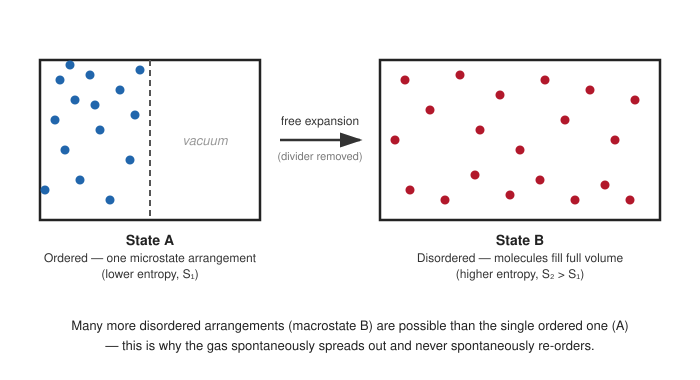
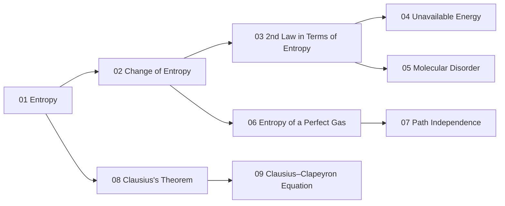

# 01. Entropy

**Course:** PHY-103 (Physics – II) · **Unit:** Entropy
**Prerequisite:** [Second Law of Thermodynamics](../thermodynamics/Thermodynamics_os.md#part-xi--second-law-of-thermodynamics) (Thermodynamics unit)
**Leads to:** [→ 02. Change of Entropy in Reversible & Irreversible Process](02_change_of_entropy_reversible_irreversible.md)

---

## 1. Overview

The second law of thermodynamics, introduced qualitatively in the Thermodynamics unit (heat does not spontaneously flow from cold to hot; no engine converts heat entirely into work), needs a precise *quantity* to make it mathematically usable. That quantity is **entropy**. This topic defines entropy from its rigorous thermodynamic (Clausius) basis, establishes it as a state function, and lays the notation this entire unit builds on — every later topic in this unit (change of entropy, the second law restated in entropy language, unavailable energy, molecular disorder, entropy of a perfect gas, path independence, Clausius's theorem, and the Clausius–Clapeyron equation) is a direct consequence or extension of the definition given here.

## 2. Definitions & Key Terms

1. **Entropy ($S$)** — *a thermodynamic state function whose infinitesimal change, for a reversible process, is $dS = \delta Q_{\text{rev}}/T$.*
   > Plain-English: a number attached to the state of a system that only depends on where the system is (its $P$, $V$, $T$), never on how it got there.

2. **Reversible heat ($\delta Q_{\text{rev}}$)** — *the heat exchanged when a process is carried out quasi-statically, through a continuous sequence of equilibrium states.*
   > Plain-English: heat exchanged "gently," slowly enough that the system is never far from equilibrium.

3. **State function** — *a property whose change between two states depends only on the initial and final states, not on the path taken.*
   > Plain-English: like altitude on a mountain — the change in altitude between base and summit doesn't care which trail you took.

4. **Path function** — *a quantity (like $Q$ or $W$) whose value depends on the specific process, not just the endpoints.*
   > Plain-English: unlike altitude, the distance you walked absolutely does depend on which trail you took.

## 3. Core Content

**1. Plain-word statement.** Entropy is the thermodynamic state function that captures how much of a system's energy has become "spread out" or degraded in a way that is unavailable to do useful work, and whose behavior gives the second law of thermodynamics a precise mathematical form.

**2. Experimental/theoretical basis.** Rudolf Clausius, working through the efficiency limits of heat engines established by Carnot, showed in 1854–1865 that the quantity $\oint \delta Q_{\text{rev}}/T$ vanishes for any reversible cyclic process (this is proved directly in [Topic 08 — Clausius's Theorem](08_clausius_theorem.md)). Because this integral is path-independent when restricted to reversible paths between two fixed states, it defines a new state function. Clausius named this function *entropy*, from the Greek *entropia* ("a turning toward"), deliberately chosen to echo *energy*.

**3. Full derivation — from Clausius's theorem to the definition of $S$.**

Step 1: Clausius's theorem (proved in Topic 08) states that for *any* reversible cycle,
$$\oint \frac{\delta Q_{\text{rev}}}{T} = 0$$

Step 2: Consider two arbitrary reversible paths, A and B, both connecting state 1 to state 2. Together, "go via A, return via B" forms a reversible cycle, so
$$\int_1^2\left(\frac{\delta Q_{\text{rev}}}{T}\right)_A + \int_2^1\left(\frac{\delta Q_{\text{rev}}}{T}\right)_B = 0$$

Step 3: Reversing the direction of integration over path B flips its sign:
$$\int_1^2\left(\frac{\delta Q_{\text{rev}}}{T}\right)_A = \int_1^2\left(\frac{\delta Q_{\text{rev}}}{T}\right)_B$$

Step 4: Since paths A and B were arbitrary, this integral has the **same value for every reversible path** between states 1 and 2 — it depends only on the endpoints. This is exactly the defining property of a state function.

Step 5: Define this state function as entropy, fixed up to an additive constant (the constant is irrelevant since only *changes* in $S$ are physically meaningful in classical thermodynamics):
$$\boxed{dS \equiv \frac{\delta Q_{\text{rev}}}{T}} \qquad\Longrightarrow\qquad \Delta S = \int_1^2 \frac{\delta Q_{\text{rev}}}{T}$$

**4. Symbols (SI units).**

| Symbol | Meaning | SI unit |
|---|---|---|
| $S$ | entropy | J K⁻¹ |
| $\delta Q_{\text{rev}}$ | heat exchanged reversibly | J |
| $T$ | absolute temperature | K |
| $\Delta S$ | entropy change between two states | J K⁻¹ |

Molar entropy ($S/n$) carries units J mol⁻¹ K⁻¹; specific entropy ($S/m$) carries units J kg⁻¹ K⁻¹.

**5. Limits of validity.** The defining relation $dS = \delta Q_{\text{rev}}/T$ requires the heat to be exchanged *reversibly*. For an actual irreversible process, $\delta Q_{\text{actual}} \neq T\,dS$ in general (in fact $\delta Q_{\text{actual}} < T\,dS$ — see [Topic 02](02_change_of_entropy_reversible_irreversible.md)); to compute $\Delta S$ for an irreversible process one must construct a *reversible* path between the same two endpoints and integrate along that instead, relying on the state-function property established above.

**6. Convention conflicts.**
> ⚠️ Convention: some texts (e.g. certain engineering thermodynamics books) define entropy via the statistical-mechanical relation $S = k_B\ln\Omega$ (Boltzmann's formula, covered in [Topic 05](05_entropy_and_molecular_disorder.md)) as the primary definition, treating the Clausius relation as a derived consequence. This unit follows the historical/Clausius (macroscopic, classical-thermodynamic) route as the primary definition, consistent with [Part XVII of the Thermodynamics unit](../thermodynamics/Thermodynamics_os.md#part-xvii--entropy), and introduces the statistical picture in Topic 05 as a complementary, deeper interpretation — not a competing definition.

## 4. Worked Examples

### Example 1 — 🟢 Foundational

A system absorbs $Q_{\text{rev}} = 600\ \text{J}$ of heat reversibly and isothermally at $T = 300\ \text{K}$. Find $\Delta S$.

**Solution**

Step 1: Since $T$ is constant, $\Delta S = \displaystyle\int \frac{\delta Q_{\text{rev}}}{T} = \frac{Q_{\text{rev}}}{T}$.

Step 2: $\Delta S = \dfrac{600}{300} = 2\ \text{J/K}$.

**Answer:** $\boxed{\Delta S = 2\ \text{J/K}}$

### Example 2 — 🟡 Intermediate

$1\ \text{mol}$ of an ideal monatomic gas ($C_V = \tfrac32 R$) is heated reversibly at constant volume from $T_1 = 300\ \text{K}$ to $T_2 = 450\ \text{K}$. Find $\Delta S$.

**Solution**

Step 1: At constant volume, $\delta Q_{\text{rev}} = nC_V\,dT$, so
$$\Delta S = \int_{T_1}^{T_2}\frac{nC_V\,dT}{T} = nC_V\ln\frac{T_2}{T_1}$$

Step 2: Substitute $n=1$, $C_V = \tfrac32(8.314) = 12.47\ \text{J mol}^{-1}\text{K}^{-1}$:
$$\Delta S = (1)(12.47)\ln\left(\frac{450}{300}\right) = 12.47\ln(1.5)$$

Step 3: $\ln(1.5) = 0.4055$, so $\Delta S = 12.47\times0.4055 = 5.06\ \text{J/K}$.

**Unit check:** J mol⁻¹K⁻¹ × mol × (dimensionless) = J/K ✓

**Answer:** $\boxed{\Delta S \approx 5.06\ \text{J/K}}$

### Example 3 — 🔴 Advanced / Exam-level

Show, using Clausius's theorem, that entropy is a state function — i.e. reproduce the four-step argument of the Core Content derivation, then use it to explain why $\Delta S$ can still be computed for an *irreversible* process even though $\delta Q_{\text{irr}}/T$ itself is not integrable in the same way.

**Solution**

Step 1: For a reversible cycle formed by going 1→2 along path A and returning 2→1 along path B, Clausius's theorem gives $\oint\delta Q_{\text{rev}}/T = 0$, so the two directed integrals sum to zero (Core Content, Steps 1–2).

Step 2: Reversing path B's direction of traversal flips the sign of its contribution, giving $\int_A = \int_B$ (Step 3). Since A, B were arbitrary reversible paths, the integral is path-independent — hence $S$ is a state function (Step 4).

Step 3: Because $S$ is a state function, $\Delta S = S_2 - S_1$ depends *only* on states 1 and 2 — not on which process (reversible or irreversible) actually connects them. So even though the actual irreversible process does not satisfy $\delta Q_{\text{irr}} = T\,dS$ at each step, one can imagine *any* reversible path between the same states 1 and 2, compute $\int \delta Q_{\text{rev}}/T$ along *that* imagined path, and the result equals the true $\Delta S$ of the irreversible process, because $\Delta S$ doesn't know or care which path was imagined.

**Answer:** $\boxed{\Delta S_{\text{irreversible process}} = \Delta S_{\text{along any reversible path between the same endpoints}}}$ — this is the entire practical method used throughout [Topic 02](02_change_of_entropy_reversible_irreversible.md).

## 5. Applications

1. **Engine and refrigerator performance limits** — entropy accounting is the standard tool engineers use to compute the maximum possible efficiency of any heat engine or the minimum work required by any refrigerator, going beyond the qualitative statements of the second law covered in the Thermodynamics unit.
2. **Chemical reaction spontaneity** — combined with enthalpy (via the Gibbs free energy $G = H - TS$, introduced in [Part XVIII of the Thermodynamics unit](../thermodynamics/Thermodynamics_os.md)), entropy change is one of the two ingredients that determine whether a chemical reaction proceeds spontaneously at a given temperature.

## 6. Diagram / Visual

*Figure 1: Removing the partition lets the gas spread through the whole container. The macroscopic entropy increase ($S_B > S_A$) reflects the system moving to a state reachable by vastly more microscopic arrangements — the statistical picture developed fully in [Topic 05](05_entropy_and_molecular_disorder.md).*

*Figure 2: This unit's prerequisite chain — every later topic traces back to the definition established here.*

## 7. Common Mistakes

- ❌ **Mistake:** Treating $\delta Q$ (any heat exchanged) and $\delta Q_{\text{rev}}$ (heat exchanged reversibly) as interchangeable in the defining relation.
  ✅ **Correct:** $dS = \delta Q_{\text{rev}}/T$ requires the *reversible* heat specifically; for an irreversible process, compute $\Delta S$ along an imagined reversible path between the same endpoints instead.

- ❌ **Mistake:** Assuming entropy is conserved, like energy.
  ✅ **Correct:** Entropy is *not* conserved — it strictly increases for the universe in any real (irreversible) process; only for perfectly reversible processes is $\Delta S_{\text{universe}} = 0$ (see [Topic 03](03_second_law_in_terms_of_entropy.md)).

- ❌ **Mistake:** Believing entropy only applies to gases or to heat engines.
  ✅ **Correct:** Entropy is defined for any thermodynamic system — solids, liquids, gases, chemical mixtures — wherever a well-defined temperature and reversible heat exchange can be identified.

- ❌ **Mistake:** Forgetting that $T$ in $dS = \delta Q_{\text{rev}}/T$ must be the absolute (Kelvin) temperature.
  ✅ **Correct:** Using Celsius directly would make $dS$ diverge or change sign incorrectly near $0\,^\circ\text{C}$; always convert to Kelvin first.

## 8. Practice Problems

**Problem 1:** A system releases $450\ \text{J}$ of heat reversibly and isothermally at $T = 350\ \text{K}$. Find $\Delta S$ for the system.

Solution

Heat is released, so $Q_{\text{rev}} = -450\ \text{J}$ (from the system's perspective).

$$\Delta S = \frac{Q_{\text{rev}}}{T} = \frac{-450}{350} = -1.286\ \text{J/K}$$

$$\text{Answer: } \Delta S \approx -1.29\ \text{J/K}$$

**Problem 2:** Explain, in one or two sentences, why $\oint \delta Q_{\text{rev}}/T = 0$ over any reversible cycle is exactly what's needed to define a *state* function.

Solution

If a quantity's integral around any closed loop (cycle) is zero, its value between two fixed points cannot depend on the path taken between them — otherwise going out one way and back another would not sum to zero. This path-independence is precisely the definition of a state function.

**Problem 3:** $2\ \text{mol}$ of an ideal gas absorb heat reversibly at constant temperature $T = 400\ \text{K}$, with $Q_{\text{rev}} = 3320\ \text{J}$. Compute $\Delta S$ and the molar entropy change $\Delta S/n$.

Solution

$$\Delta S = \frac{Q_{\text{rev}}}{T} = \frac{3320}{400} = 8.3\ \text{J/K}$$

$$\frac{\Delta S}{n} = \frac{8.3}{2} = 4.15\ \text{J mol}^{-1}\text{K}^{-1}$$

$$\text{Answer: } \Delta S = 8.3\ \text{J/K};\ \Delta S/n = 4.15\ \text{J mol}^{-1}\text{K}^{-1}$$

**Problem 4 (exam-style, multi-step):** A reversible process carries a system from state 1 to state 2 while absorbing heat according to $\delta Q_{\text{rev}} = (5\,T)\,dT$ (in joules, $T$ in kelvin), as $T$ rises from $250\ \text{K}$ to $310\ \text{K}$. Find $\Delta S$.

Solution

$$\Delta S = \int_{250}^{310}\frac{\delta Q_{\text{rev}}}{T} = \int_{250}^{310}\frac{5T\,dT}{T} = \int_{250}^{310} 5\,dT$$

$$\Delta S = 5(310-250) = 5(60) = 300\ \text{J/K}$$

$$\text{Answer: } \Delta S = 300\ \text{J/K}$$

## 9. Summary

| Concept | Result | Condition / Limit |
|---|---|---|
| Defining relation | $dS = \delta Q_{\text{rev}}/T$ | Reversible heat exchange only |
| State function property | $\Delta S = S_2 - S_1$, path-independent | Follows from Clausius's theorem ($\oint \delta Q_{\text{rev}}/T = 0$) |
| Units | J K⁻¹ (molar: J mol⁻¹K⁻¹) | — |
| Irreversible processes | Compute $\Delta S$ along an imagined reversible path between the same endpoints | Actual $\delta Q_{\text{irr}}/T \neq dS$ pointwise |

With entropy defined and established as a state function, the next topic works out exactly how to *compute* $\Delta S$ for both reversible and irreversible processes side by side.

## 10. References

1. **Halliday, Resnick & Walker, *Fundamentals of Physics*, 10th ed., Wiley** — Ch. 20, entropy and the second law, includes the free-expansion irreversibility example.
2. **Serway & Jewett, *Physics for Scientists and Engineers*, 9th ed., Cengage** — Ch. 22, entropy defined via Clausius's theorem with worked engine examples.
3. **HyperPhysics — Entropy** — concise derivation of $dS=\delta Q_{\text{rev}}/T$ and its consequences. [hyperphysics.phy-astr.gsu.edu](http://hyperphysics.phy-astr.gsu.edu/hbase/thermo/entrop.html)
4. **MIT OpenCourseWare 8.044 (Statistical Physics I)** — Lecture notes on entropy, connecting the Clausius and statistical definitions.
