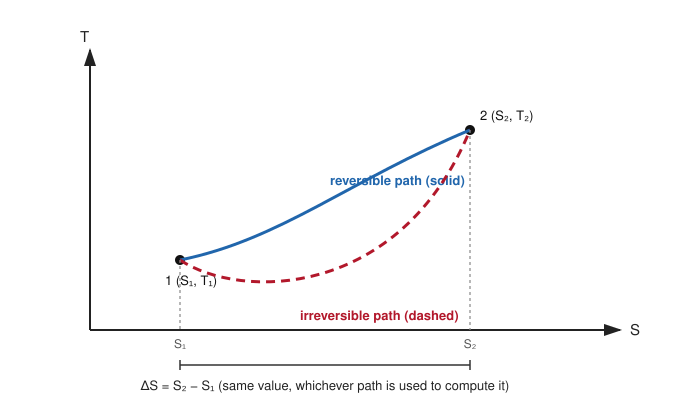
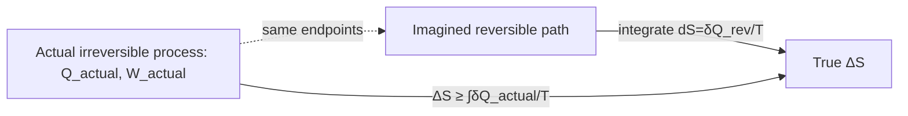

# 02. Change of Entropy in Reversible & Irreversible Process

**Course:** PHY-103 (Physics – II) · **Unit:** Entropy
**Prerequisite:** [→ 01. Entropy](01_entropy.md)
**Leads to:** [→ 03. Second Law of Thermodynamics in Terms of Entropy](03_second_law_in_terms_of_entropy.md), [→ 06. Entropy of a Perfect Gas](06_entropy_of_a_perfect_gas.md)

---

## 1. Overview

Topic 01 defined $\Delta S = \int \delta Q_{\text{rev}}/T$ and showed $S$ is a state function. This topic makes that definition operational: it works out the actual inequality that governs entropy change when heat is exchanged *irreversibly*, and shows concretely — via the standard example of free expansion — how $\Delta S$ is computed for an irreversible process by substituting a reversible path between the same endpoints. This distinction (reversible vs. irreversible entropy accounting) is the single most commonly tested idea in this unit and feeds directly into [Topic 03](03_second_law_in_terms_of_entropy.md), where it becomes the entropy statement of the second law.

## 2. Definitions & Key Terms

1. **Clausius inequality** — *for any process (reversible or not) connecting two states, $\displaystyle\Delta S \geq \int \frac{\delta Q_{\text{actual}}}{T}$, with equality iff the process is reversible.*
   > Plain-English: the entropy change is always at least as large as the "heat divided by temperature" you actually exchanged — you get exactly that much only if the process was reversible.

2. **Free (Joule) expansion** — *an ideal gas expanding into a vacuum with no heat or work exchanged with the surroundings ($Q=W=0$).*
   > Plain-English: pull a divider out of a box, half of which was vacuum; the gas rushes to fill the whole box, doing no work and exchanging no heat.

3. **Entropy generation ($S_{\text{gen}}$)** — *the extra entropy created inside a system due to irreversibilities (friction, unrestrained expansion, finite-difference heat transfer), beyond what crosses the system boundary as $Q/T$.*
   > Plain-English: the "penalty" entropy that appears out of nowhere whenever a process isn't done gently.

## 3. Core Content

**1. Plain-word statement.** For a reversible process, the entropy change of a system exactly equals the reversible heat exchanged divided by temperature. For an irreversible process, the *actual* heat exchanged, divided by temperature, always undershoots the true entropy change — the difference is entropy generated by the irreversibility itself.

**2. Experimental/theoretical basis.** This follows directly from Clausius's theorem (proved fully in [Topic 08](08_clausius_theorem.md)): for a cycle containing at least one irreversible leg, $\oint \delta Q/T < 0$ (strict inequality), rather than the $=0$ that holds for fully reversible cycles.

**3. Full derivation — the Clausius inequality.**

Step 1: Consider a cycle made of an irreversible process from state 1 to state 2, followed by a reversible return from 2 back to 1. Clausius's theorem (general form, covering cycles with irreversible legs) gives:
$$\oint \frac{\delta Q}{T} \leq 0$$

Step 2: Split the cyclic integral into its two legs:
$$\int_1^2\left(\frac{\delta Q}{T}\right)_{\text{irr}} + \int_2^1\left(\frac{\delta Q_{\text{rev}}}{T}\right)_{\text{rev}} \leq 0$$

Step 3: The reversible leg, by definition (Topic 01), equals $S_1 - S_2$ (traversed 2→1):
$$\int_1^2\left(\frac{\delta Q}{T}\right)_{\text{irr}} + (S_1-S_2) \leq 0$$

Step 4: Rearranging:
$$S_2 - S_1 \geq \int_1^2\left(\frac{\delta Q}{T}\right)_{\text{irr}}$$

i.e., in general,
$$\boxed{\Delta S \geq \int \frac{\delta Q_{\text{actual}}}{T}}$$
with equality holding **only** when the process is reversible. This is the **Clausius inequality**.

**4. Symbols (SI units).**

| Symbol | Meaning | SI unit |
|---|---|---|
| $\delta Q_{\text{actual}}$ | heat actually exchanged (any process) | J |
| $S_{\text{gen}}$ | entropy generated by irreversibility, $S_{\text{gen}}=\Delta S-\int\delta Q_{\text{actual}}/T\geq0$ | J K⁻¹ |

**5. Limits of validity.** The inequality assumes $T$ is a well-defined (uniform) temperature at the boundary where heat crosses; for processes with steep internal temperature gradients, $T$ in the integral refers to the boundary temperature at which the heat transfer actually occurs, not necessarily the bulk system temperature.

**6. Convention conflicts.**
> ⚠️ Convention: some engineering texts write the Clausius inequality with the heat term for the *surroundings* rather than the system, $\Delta S_{\text{surr}} \leq -\int \delta Q_{\text{system}}/T_{\text{boundary}}$; this is algebraically equivalent to the system-side form derived above once signs are tracked consistently. This unit consistently uses the system-side form.

**Worked derivation: free expansion (the canonical irreversible example).** An ideal gas at $T$ expands freely (no heat, no work, $\Delta U = 0$, so $T$ is unchanged for an ideal gas) from volume $V_1$ to $V_2$.

Step 1: Since $Q_{\text{actual}}=0$ throughout the free expansion, the Clausius-inequality bound gives $\int \delta Q_{\text{actual}}/T = 0$ — naively suggesting $\Delta S \geq 0$ but not telling us the actual value.

Step 2: To find the actual $\Delta S$, replace the irreversible free expansion with a reversible isothermal expansion between the *same* two states ($T$ constant, $V_1\to V_2$) — legitimate because $S$ is a state function (Topic 01).

Step 3: For the reversible isothermal path, $\delta Q_{\text{rev}} = -\delta W_{\text{rev}} = P\,dV = \dfrac{nRT}{V}dV$ (using $\Delta U=0$ at constant $T$ for an ideal gas), so
$$\Delta S = \int_{V_1}^{V_2}\frac{nRT}{VT}\,dV = nR\int_{V_1}^{V_2}\frac{dV}{V} = nR\ln\frac{V_2}{V_1}$$

Step 4: Since $V_2>V_1$, $\Delta S>0$ — entropy strictly increases, even though $Q_{\text{actual}}=0$. This confirms $\Delta S > \int \delta Q_{\text{actual}}/T = 0$, the strict Clausius inequality for an irreversible process.

$$\boxed{\Delta S_{\text{free expansion}} = nR\ln\frac{V_2}{V_1} > 0}$$

## 4. Worked Examples

### Example 1 — 🟢 Foundational

$1\ \text{mol}$ of an ideal gas undergoes free expansion, doubling its volume ($V_2 = 2V_1$). Find $\Delta S$.

**Solution**

Step 1: $\Delta S = nR\ln(V_2/V_1) = (1)(8.314)\ln(2)$.

Step 2: $\ln 2 = 0.693$, so $\Delta S = 8.314\times0.693 = 5.76\ \text{J/K}$.

**Answer:** $\boxed{\Delta S = 5.76\ \text{J/K}}$

### Example 2 — 🟡 Intermediate

Two blocks of the same material, mass $m=1\ \text{kg}$ each, specific heat $c=450\ \text{J kg}^{-1}\text{K}^{-1}$, at $T_H=350\ \text{K}$ and $T_C=290\ \text{K}$, are placed in thermal contact (irreversible heat flow) and reach a common final temperature $T_f$. Find $\Delta S_{\text{universe}}$.

**Solution**

Step 1: Energy conservation (equal masses, equal $c$): $T_f = (T_H+T_C)/2 = (350+290)/2 = 320\ \text{K}$.

Step 2: Each block's entropy change is computed along a reversible path (slow heating/cooling at constant pressure) between its own initial and final $T$:
$$\Delta S_H = mc\ln\frac{T_f}{T_H} = (1)(450)\ln\frac{320}{350}$$
$$\Delta S_C = mc\ln\frac{T_f}{T_C} = (1)(450)\ln\frac{320}{290}$$

Step 3: $\ln(320/350)=\ln(0.9143)=-0.0896$; $\ln(320/290)=\ln(1.1034)=0.0984$.

Step 4: $\Delta S_H = 450(-0.0896) = -40.3\ \text{J/K}$; $\Delta S_C = 450(0.0984)=44.3\ \text{J/K}$.

Step 5: $\Delta S_{\text{universe}} = \Delta S_H+\Delta S_C = -40.3+44.3 = 4.0\ \text{J/K}$.

**Answer:** $\boxed{\Delta S_{\text{universe}} \approx +4.0\ \text{J/K} > 0}$, confirming irreversibility (direct contact across a finite $\Delta T$ is always irreversible).

### Example 3 — 🔴 Advanced / Exam-level

Verify the Clausius inequality directly for the free-expansion example above: compute both $\Delta S$ (true entropy change) and $\int \delta Q_{\text{actual}}/T$ (actual heat term), and confirm $\Delta S > \int \delta Q_{\text{actual}}/T$.

**Solution**

Step 1: From the Core Content derivation, $\Delta S = nR\ln(V_2/V_1)$, which is strictly positive whenever $V_2>V_1$.

Step 2: For the actual (irreversible, free-expansion) process, $Q_{\text{actual}}=0$ throughout (no heat crosses the boundary — the gas expands into vacuum), so $\int \delta Q_{\text{actual}}/T = 0$.

Step 3: Comparing: $\Delta S = nR\ln(V_2/V_1) > 0 = \int \delta Q_{\text{actual}}/T$ whenever $V_2 > V_1$, confirming the strict Clausius inequality $\Delta S > \int \delta Q_{\text{actual}}/T$ for this irreversible process.

**Answer:** $\boxed{\Delta S_{\text{true}} = nR\ln(V_2/V_1) > 0 = \textstyle\int \delta Q_{\text{actual}}/T}$ — the "missing" entropy is exactly the entropy *generated* by the irreversibility, $S_{\text{gen}} = nR\ln(V_2/V_1)$.

## 5. Applications

1. **Refrigeration and air-conditioning design** — engineers use entropy-generation accounting (comparing actual cycles against ideal reversible ones) to identify and minimize the sources of inefficiency (throttling, finite-$\Delta T$ heat exchange) in real refrigeration cycles.
2. **Mixing processes in chemical engineering** — the entropy of mixing two different gases (a generalization of free expansion) determines the minimum work required to separate them again, relevant to industrial gas-separation and desalination design.

## 6. Diagram / Visual

*Figure 1: Whatever the actual process (reversible or irreversible) connecting states 1 and 2, $\Delta S = S_2-S_1$ is identical — computed, when necessary, along any convenient reversible path.*

*Figure 2: The practical recipe — replace the irreversible process with a reversible one between the same states to compute $\Delta S$.*

## 7. Common Mistakes

- ❌ **Mistake:** Computing $\Delta S$ for free expansion as $\int \delta Q_{\text{actual}}/T = 0$ because $Q_{\text{actual}}=0$.
  ✅ **Correct:** $\delta Q_{\text{actual}}=0$ does *not* mean $\Delta S=0$; $\Delta S$ must be computed along an imagined reversible path between the same endpoints, giving $\Delta S = nR\ln(V_2/V_1) > 0$.

- ❌ **Mistake:** Using the equality $\Delta S = \int \delta Q_{\text{actual}}/T$ for an irreversible process.
  ✅ **Correct:** Equality holds only for reversible processes; for irreversible ones, $\Delta S$ strictly exceeds $\int \delta Q_{\text{actual}}/T$.

- ❌ **Mistake:** Assuming the *system's* entropy always increases in any process.
  ✅ **Correct:** A system's own entropy can decrease (e.g. water freezing releases heat and lowers the water's entropy) — it is the *total* (system + surroundings) entropy that never decreases.

- ❌ **Mistake:** Forgetting to check whether two bodies exchanging heat are at the same final temperature before applying $\Delta S = mc\ln(T_f/T_i)$ separately to each.
  ✅ **Correct:** Always find the correct common final temperature (or given final state) from energy conservation first, then apply the formula to each body individually.

## 8. Practice Problems

**Problem 1:** $2\ \text{mol}$ of an ideal gas undergoes free expansion, tripling its volume. Find $\Delta S$.

Solution

$$\Delta S = nR\ln\frac{V_2}{V_1} = (2)(8.314)\ln(3) = (16.628)(1.0986) = 18.27\ \text{J/K}$$

$$\text{Answer: } \Delta S \approx 18.3\ \text{J/K}$$

**Problem 2:** State, without derivation, the sign of $\Delta S_{\text{universe}}$ for (a) a reversible process, (b) an irreversible process, (c) an impossible process.

Solution

(a) $\Delta S_{\text{universe}} = 0$. (b) $\Delta S_{\text{universe}} > 0$. (c) $\Delta S_{\text{universe}} < 0$ — forbidden by the second law.

**Problem 3:** Two identical bodies of heat capacity $C=200\ \text{J/K}$ at $400\ \text{K}$ and $300\ \text{K}$ are brought into contact. Find $\Delta S_{\text{universe}}$.

Solution

$T_f = (400+300)/2 = 350\ \text{K}$.

$\Delta S_1 = C\ln(350/400) = 200\ln(0.875) = 200(-0.1335) = -26.7\ \text{J/K}$

$\Delta S_2 = C\ln(350/300) = 200\ln(1.1667) = 200(0.1542) = 30.8\ \text{J/K}$

$\Delta S_{\text{universe}} = -26.7+30.8 = 4.1\ \text{J/K}$

$$\text{Answer: } \Delta S_{\text{universe}} \approx +4.1\ \text{J/K}$$

**Problem 4 (exam-style, multi-step):** $0.5\ \text{mol}$ of an ideal gas at $T=300\ \text{K}$ expands freely from $V_1$ to $4V_1$. Separately, calculate what the entropy change *would* have been for a reversible isothermal expansion between the same volumes, and confirm the two results are identical (illustrating the state-function argument).

Solution

**Free expansion (irreversible):** replace with reversible isothermal path between the same states (the only way to compute $\Delta S$, per Topic 01/02):
$$\Delta S = nR\ln\frac{V_2}{V_1} = (0.5)(8.314)\ln(4) = (4.157)(1.3863) = 5.76\ \text{J/K}$$

**Reversible isothermal expansion (same states):** identical formula applies directly since the process itself is reversible:
$$\Delta S = nR\ln\frac{V_2}{V_1} = 5.76\ \text{J/K}$$

Both give the same $\Delta S$ because $S$ is a state function — the *process* differs (irreversible vs. reversible) but the *entropy change* between the same two endpoints cannot differ.

$$\text{Answer: } \Delta S = 5.76\ \text{J/K in both cases}$$

## 9. Summary

| Concept | Result | Condition / Limit |
|---|---|---|
| Clausius inequality | $\Delta S \geq \int \delta Q_{\text{actual}}/T$ | Equality iff reversible |
| Free expansion | $\Delta S = nR\ln(V_2/V_1) > 0$ | $Q_{\text{actual}}=0$, ideal gas |
| Two-body contact | $\Delta S_i = m_ic_i\ln(T_f/T_i)$ per body, sum $>0$ | Direct contact across finite $\Delta T$ |
| Entropy generation | $S_{\text{gen}} = \Delta S - \int\delta Q_{\text{actual}}/T \geq 0$ | Zero only for reversible processes |

Having established how to compute $\Delta S$ for both reversible and irreversible processes, the next topic restates the second law of thermodynamics entirely in terms of this entropy-generation criterion.

## 10. References

1. **Halliday, Resnick & Walker, *Fundamentals of Physics*, 10th ed., Wiley** — Ch. 20, free-expansion worked example and entropy-change-for-irreversible-processes method.
2. **Serway & Jewett, *Physics for Scientists and Engineers*, 9th ed., Cengage** — Ch. 22, Clausius inequality and entropy generation.
3. **HyperPhysics — Entropy Change in Irreversible Processes** — worked examples of free expansion and heat conduction across finite $\Delta T$. [hyperphysics.phy-astr.gsu.edu](http://hyperphysics.phy-astr.gsu.edu/hbase/thermo/entrop2.html)
4. **MIT OCW 8.044** — lecture notes deriving the Clausius inequality from Clausius's theorem.
