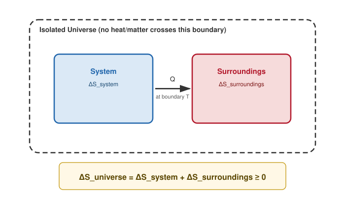

# 03. Second Law of Thermodynamics in Terms of Entropy

**Course:** PHY-103 (Physics – II) · **Unit:** Entropy
**Prerequisite:** [→ 02. Change of Entropy in Reversible & Irreversible Process](02_change_of_entropy_reversible_irreversible.md)
**Leads to:** [→ 04. Entropy and Unavailable Energy](04_entropy_and_unavailable_energy.md), [→ 05. Entropy and Molecular Disorder](05_entropy_and_molecular_disorder.md)

---

## 1. Overview

The [Second Law of Thermodynamics](../thermodynamics/Thermodynamics_os.md#part-xi--second-law-of-thermodynamics) was first stated qualitatively (Kelvin–Planck / Clausius statements, in the Thermodynamics unit) in terms of what heat engines and refrigerators *cannot* do. Having built the Clausius inequality in [Topic 02](02_change_of_entropy_reversible_irreversible.md), this topic shows that both qualitative statements are equivalent to a single, precise mathematical criterion: the total entropy of an isolated system (the "universe" of a process) never decreases. This entropy-based statement is what makes the second law directly usable in calculations, and underlies both [unavailable energy](04_entropy_and_unavailable_energy.md) and the statistical interpretation of disorder in [Topic 05](05_entropy_and_molecular_disorder.md).

## 2. Definitions & Key Terms

1. **Isolated system** — *a system that exchanges neither matter nor energy with its surroundings.*
   > Plain-English: a sealed box with perfect walls — nothing gets in or out.
2. **Universe (of a process)** — *the system together with all surroundings it interacts with, treated jointly as an isolated system.*
   > Plain-English: "everything that matters" for that particular process, lumped together.
3. **Entropy principle** — *the statement $\Delta S_{\text{universe}} \geq 0$ for any process, with equality only in the reversible limit.*
   > Plain-English: total disorder of "everything involved" can stay the same (idealized) or go up (real life) — never down.

## 3. Core Content

**1. Plain-word statement.** For any process occurring in an isolated system (system + all surroundings it exchanges energy with), the total entropy never decreases: it stays constant for a reversible process and strictly increases for any real, irreversible process.

**2. Experimental/theoretical basis.** This follows directly from the Clausius inequality (Topic 02) applied to an isolated system, where by definition no heat crosses the boundary of the combined system+surroundings.

**3. Full derivation.**

Step 1: Treat "system + surroundings" together as one isolated system. Being isolated, no heat crosses *its* outer boundary: $\delta Q_{\text{actual, universe}} = 0$ for every infinitesimal step.

Step 2: Apply the Clausius inequality (Topic 02) to this combined isolated system:
$$\Delta S_{\text{universe}} \geq \int \frac{\delta Q_{\text{actual, universe}}}{T} = \int 0 = 0$$

Step 3: Therefore
$$\boxed{\Delta S_{\text{universe}} \geq 0}$$
with equality holding if and only if every step of the process is reversible.

Step 4: Decompose $\Delta S_{\text{universe}} = \Delta S_{\text{system}} + \Delta S_{\text{surroundings}}$ (entropy, unlike heat, is additive over the parts of a composite isolated system, since it is an extensive state function). Heat lost by the system as $-Q$ at boundary temperature $T$ is heat gained by the surroundings as $+Q$ at the same $T$ (for a well-defined boundary temperature), so for a reversible exchange $\Delta S_{\text{system}} = -\Delta S_{\text{surroundings}}$, giving $\Delta S_{\text{universe}}=0$ exactly — recovering the reversible case as the equality condition of Step 3.

**4. Symbols (SI units).**

| Symbol | Meaning | SI unit |
|---|---|---|
| $\Delta S_{\text{universe}}$ | total entropy change (system + surroundings) | J K⁻¹ |
| $\Delta S_{\text{system}}$, $\Delta S_{\text{surroundings}}$ | entropy change of each part | J K⁻¹ |

**5. Limits of validity.** The result $\Delta S_{\text{universe}}\geq0$ holds for *any* process, classical or otherwise, as long as "universe" genuinely captures every part of the interaction (no hidden energy/entropy exchange left out); choosing too small a "system" and forgetting a relevant reservoir is the most common source of apparent violations in textbook problems.

**6. Convention conflicts.**
> ⚠️ Convention: this is sometimes called the "entropy statement of the second law" or the "principle of increase of entropy" interchangeably across textbooks — both names refer to the identical inequality $\Delta S_{\text{universe}}\geq0$ derived above.

**Equivalence with the Kelvin–Planck and Clausius statements (brief argument).** The Kelvin–Planck statement (no engine converts heat entirely into work with no other effect) and the Clausius statement (heat cannot spontaneously flow from cold to hot with no other effect) were shown in the Thermodynamics unit to be logically equivalent to each other. Both can be shown to violate $\Delta S_{\text{universe}}\geq0$ if assumed false: e.g., a "perfect" engine that extracted heat $Q$ from a single reservoir at $T$ and converted it entirely to work would decrease that reservoir's entropy by $Q/T$ with no compensating increase elsewhere, violating the entropy principle. This is why the entropy statement is regarded as the master (most general and most directly usable) form of the second law.

## 4. Worked Examples

### Example 1 — 🟢 Foundational

A reversible Carnot engine (see [Thermodynamics unit, Part XIV](../thermodynamics/Thermodynamics_os.md#part-xiv--carnot-cycle)) absorbs $Q_H=1000\ \text{J}$ from a hot reservoir at $T_H=500\ \text{K}$ and rejects $Q_C$ to a cold reservoir at $T_C=300\ \text{K}$. Verify $\Delta S_{\text{universe}}=0$.

**Solution**

Step 1: For a Carnot (fully reversible) engine, $Q_C/Q_H = T_C/T_H$, so $Q_C = 1000\times(300/500)=600\ \text{J}$.

Step 2: $\Delta S_{\text{hot reservoir}} = -Q_H/T_H = -1000/500=-2\ \text{J/K}$ (loses heat).

Step 3: $\Delta S_{\text{cold reservoir}} = +Q_C/T_C = 600/300=+2\ \text{J/K}$ (gains heat).

Step 4: $\Delta S_{\text{universe}} = -2+2 = 0\ \text{J/K}$.

**Answer:** $\boxed{\Delta S_{\text{universe}}=0}$, confirming the engine is reversible.

### Example 2 — 🟡 Intermediate

A real (irreversible) engine absorbs $Q_H=1000\ \text{J}$ from a reservoir at $T_H=500\ \text{K}$ and rejects $Q_C=700\ \text{J}$ (more than the reversible minimum) to a reservoir at $T_C=300\ \text{K}$. Find $\Delta S_{\text{universe}}$ and confirm it is consistent with irreversibility.

**Solution**

Step 1: $\Delta S_{\text{hot}} = -Q_H/T_H = -1000/500 = -2\ \text{J/K}$.

Step 2: $\Delta S_{\text{cold}} = +Q_C/T_C = 700/300 = +2.33\ \text{J/K}$.

Step 3: $\Delta S_{\text{universe}} = -2+2.33 = 0.33\ \text{J/K}$.

**Answer:** $\boxed{\Delta S_{\text{universe}} \approx +0.33\ \text{J/K} > 0}$, confirming the engine is irreversible (it rejects more heat, hence does less work, than the reversible Carnot limit for the same $Q_H,T_H,T_C$).

### Example 3 — 🔴 Advanced / Exam-level

Prove, by contradiction using the entropy principle, that no engine operating between two reservoirs can have efficiency greater than the Carnot efficiency $\eta_C = 1-T_C/T_H$.

**Solution**

Step 1: Suppose an engine absorbs $Q_H$ from the hot reservoir and does work $W > W_{\text{Carnot}}$, i.e. rejects $Q_C' = Q_H - W < Q_C = Q_H - W_{\text{Carnot}} = Q_H T_C/T_H$ (using the Carnot result from Example 1).

Step 2: Entropy change of the hot reservoir: $\Delta S_{\text{hot}} = -Q_H/T_H$ (unchanged, same heat absorbed).

Step 3: Entropy change of the cold reservoir: $\Delta S_{\text{cold}} = +Q_C'/T_C < Q_H T_C/(T_H T_C) = Q_H/T_H$ (using the assumed $Q_C' < Q_HT_C/T_H$).

Step 4: Total: $\Delta S_{\text{universe}} = -Q_H/T_H + Q_C'/T_C < -Q_H/T_H + Q_H/T_H = 0$.

Step 5: This violates $\Delta S_{\text{universe}}\geq0$ (Core Content), which must hold for *any* process. Contradiction — so no such engine can exist.

**Answer:** $\boxed{\eta \leq \eta_C = 1-T_C/T_H \text{ for any engine operating between reservoirs at } T_H, T_C}$, with equality only for a reversible (Carnot) engine — this reproduces [Carnot's Theorem](../thermodynamics/Thermodynamics_os.md#part-xvi--carnots-theorem) directly from the entropy principle.

## 5. Applications

1. **Power plant design limits** — the entropy-based second law sets the absolute thermodynamic ceiling on the efficiency of any real thermal power plant (coal, nuclear, solar-thermal), regardless of engineering improvements.
2. **Refrigeration and heat pump COP limits** — the same $\Delta S_{\text{universe}}\geq0$ principle bounds the maximum coefficient of performance achievable by any refrigerator or heat pump operating between two temperatures.

## 6. Diagram / Visual

*Figure 1: For the combined isolated system (dashed boundary), the sum of the two entropy changes can never be negative — equality holds only for a reversible exchange.*

## 7. Common Mistakes

- ❌ **Mistake:** Concluding a process is impossible just because a *system's own* entropy decreases.
  ✅ **Correct:** Check $\Delta S_{\text{universe}}$, not $\Delta S_{\text{system}}$ alone — a system's entropy can decrease as long as the surroundings' entropy increases by at least as much.

- ❌ **Mistake:** Forgetting to include *all* relevant reservoirs when computing $\Delta S_{\text{universe}}$.
  ✅ **Correct:** Identify every reservoir/surrounding that exchanges heat with the system in the process; omitting one gives a spuriously wrong (often negative) total.

- ❌ **Mistake:** Using $\Delta S_{\text{universe}} = 0$ for a real, physically irreversible engine or process.
  ✅ **Correct:** Real processes always have some irreversibility (friction, finite-$\Delta T$ heat transfer); $\Delta S_{\text{universe}}=0$ is an idealization reserved for the reversible limit.

- ❌ **Mistake:** Treating $\Delta S_{\text{universe}}\geq0$ as bounding the *rate* of entropy production.
  ✅ **Correct:** The inequality is about the net *change* over the whole process, not a statement about instantaneous rates (though a non-negative entropy-generation *rate* is a related, stronger local statement used in continuum thermodynamics, beyond this course's scope).

## 8. Practice Problems

**Problem 1:** A reversible engine works between $T_H=600\ \text{K}$ and $T_C=400\ \text{K}$, absorbing $Q_H=1200\ \text{J}$. Verify $\Delta S_{\text{universe}}=0$.

Solution

$Q_C = Q_H(T_C/T_H) = 1200(400/600)=800\ \text{J}$.

$\Delta S_{\text{universe}} = -Q_H/T_H + Q_C/T_C = -1200/600 + 800/400 = -2+2=0$.

$$\text{Answer: } \Delta S_{\text{universe}} = 0\ \text{J/K, confirming reversibility.}$$

**Problem 2:** An irreversible process transfers $500\ \text{J}$ of heat directly from a reservoir at $600\ \text{K}$ to one at $400\ \text{K}$, with no work done. Find $\Delta S_{\text{universe}}$.

Solution

$\Delta S_{\text{hot}} = -500/600 = -0.833\ \text{J/K}$

$\Delta S_{\text{cold}} = +500/400 = +1.25\ \text{J/K}$

$\Delta S_{\text{universe}} = -0.833+1.25 = 0.417\ \text{J/K}$

$$\text{Answer: } \Delta S_{\text{universe}} \approx +0.417\ \text{J/K} > 0$$

**Problem 3:** Explain briefly why $\Delta S_{\text{universe}} < 0$ is never observed in nature, in terms of the derivation in Core Content.

Solution

$\Delta S_{\text{universe}}\geq0$ was derived by applying the Clausius inequality to the isolated "system+surroundings" combination, where no heat crosses the outer boundary ($\delta Q_{\text{actual, universe}}=0$). The inequality $\Delta S \geq \int \delta Q_{\text{actual}}/T$ then directly forces $\Delta S_{\text{universe}}\geq0$; a negative value would contradict Clausius's theorem itself, which in turn rests on the impossibility of building a perpetual-motion-type heat engine (Kelvin–Planck statement).

**Problem 4 (exam-style, multi-step):** An engine claims to absorb $Q_H=2000\ \text{J}$ from a reservoir at $T_H=800\ \text{K}$, do work $W=1300\ \text{J}$, and reject the rest to a reservoir at $T_C=400\ \text{K}$. Determine whether this engine is thermodynamically possible.

Solution

Step 1: Heat rejected: $Q_C = Q_H - W = 2000-1300=700\ \text{J}$.

Step 2: $\Delta S_{\text{hot}} = -2000/800=-2.5\ \text{J/K}$; $\Delta S_{\text{cold}}=+700/400=+1.75\ \text{J/K}$.

Step 3: $\Delta S_{\text{universe}} = -2.5+1.75=-0.75\ \text{J/K} < 0$.

Step 4: This violates $\Delta S_{\text{universe}}\geq0$ — the engine is **impossible**. (Cross-check: its claimed efficiency is $W/Q_H = 1300/2000=0.65$, while the Carnot limit is $\eta_C=1-400/800=0.5$; exceeding the Carnot limit is exactly the impossibility flagged by the negative entropy change.)

$$\text{Answer: Impossible — } \Delta S_{\text{universe}} = -0.75\ \text{J/K} < 0.$$

## 9. Summary

| Concept | Result | Condition / Limit |
|---|---|---|
| Entropy principle | $\Delta S_{\text{universe}} \geq 0$ | Any process, isolated "system+surroundings" |
| Reversible limit | $\Delta S_{\text{universe}} = 0$ | Idealized, quasi-static processes only |
| Consequence | $\eta \leq \eta_C$ for any engine | Follows directly from the entropy principle |
| Diagnostic use | Negative computed $\Delta S_{\text{universe}}$ flags an impossible process | Must include all interacting reservoirs |

Having established the entropy criterion for the second law, the next two topics develop its two major consequences: the loss of *useful* work capacity ([unavailable energy](04_entropy_and_unavailable_energy.md)), and the deeper statistical meaning of entropy as [molecular disorder](05_entropy_and_molecular_disorder.md).

## 10. References

1. **Halliday, Resnick & Walker, *Fundamentals of Physics*, 10th ed., Wiley** — Ch. 20, entropy statement of the second law and its equivalence to the Kelvin–Planck/Clausius statements.
2. **Serway & Jewett, *Physics for Scientists and Engineers*, 9th ed., Cengage** — Ch. 22, entropy and the impossibility of perpetual-motion machines of the second kind.
3. **HyperPhysics — Entropy and the Second Law** — summary of the entropy-increase principle. [hyperphysics.phy-astr.gsu.edu](http://hyperphysics.phy-astr.gsu.edu/hbase/thermo/entrop.html)
4. **MIT OCW 8.044** — proof of Carnot's theorem from the entropy principle.
