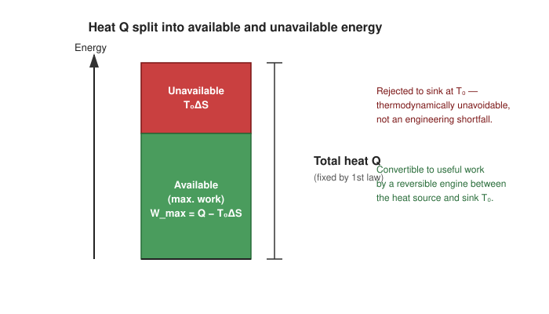

# 04. Entropy and Unavailable Energy

**Course:** PHY-103 (Physics – II) · **Unit:** Entropy
**Prerequisite:** [→ 03. Second Law of Thermodynamics in Terms of Entropy](03_second_law_in_terms_of_entropy.md)
**Leads to:** (feeds into general understanding of energy quality — no direct downstream topic in this unit; connects back to [Carnot Cycle](../thermodynamics/Thermodynamics_os.md#part-xiv--carnot-cycle))

---

## 1. Overview

[Topic 03](03_second_law_in_terms_of_entropy.md) established that $\Delta S_{\text{universe}}\geq0$ for any real process. This topic asks a practical question: what does entropy increase *cost* us, in terms of energy that could have been converted to useful work but no longer can be? The answer — unavailable energy — quantifies the everyday observation that energy is never destroyed (first law) but its *usefulness* degrades whenever entropy is generated (second law). This is the bridge between the abstract entropy principle and its concrete engineering consequence.

## 2. Definitions & Key Terms

1. **Available energy** — *the maximum work extractable from a given quantity of heat/internal energy, using a reversible process, given a specified low-temperature sink at $T_0$.*
   > Plain-English: the best-case, ideal amount of useful work you could ever squeeze out.
2. **Unavailable energy** — *the portion of energy that cannot be converted to work even in the ideal reversible limit, because it must be rejected to the sink at $T_0$.*
   > Plain-English: the "waste heat" that's thermodynamically unavoidable, not just an engineering shortfall.
3. **Sink (reference) temperature ($T_0$)** — *the lowest temperature reservoir available to a process (often the environment/atmosphere).*
   > Plain-English: the coldest place you're allowed to dump heat into.

## 3. Core Content

**1. Plain-word statement.** Whenever entropy $\Delta S$ is generated in a process (or is simply present because heat was exchanged at a finite temperature above the sink), an amount of energy equal to $T_0\Delta S$ becomes permanently unavailable for conversion to work, where $T_0$ is the temperature of the coldest available reservoir — even though the *total* energy is unchanged, as required by the first law.

**2. Experimental/theoretical basis.** This follows from combining the first law (energy conservation) with the Carnot-limited maximum work extractable between any two temperatures (established in the Thermodynamics unit), applied to heat that must ultimately be rejected to a fixed-temperature sink $T_0$.

**3. Full derivation.**

Step 1: Consider heat $\delta Q$ available at temperature $T$ (with $T>T_0$), to be converted to work via a reversible engine operating between $T$ and the sink $T_0$.

Step 2: The maximum (Carnot) efficiency of this engine is $\eta_C = 1 - T_0/T$, so the maximum work extractable is:
$$\delta W_{\text{max}} = \delta Q\left(1-\frac{T_0}{T}\right) = \delta Q - T_0\frac{\delta Q}{T}$$

Step 3: Recognize $\delta Q/T = dS$ for this reversible exchange (Topic 01's defining relation). So:
$$\delta W_{\text{max}} = \delta Q - T_0\,dS$$

Step 4: Integrating over the whole process delivering total heat $Q$ while producing total entropy change $\Delta S$:
$$W_{\text{max}} = Q - T_0\Delta S$$

Step 5: Since the total heat $Q$ is fixed (first law), the term $T_0\Delta S$ is exactly the part of $Q$ that *cannot* become work, regardless of how cleverly the conversion is engineered — it is rejected to the sink as a thermodynamic necessity, not an engineering failure:
$$\boxed{\text{Unavailable energy} = T_0\,\Delta S}$$
$$\boxed{\text{Available energy (max. work)} = Q - T_0\,\Delta S}$$

**4. Symbols (SI units).**

| Symbol | Meaning | SI unit |
|---|---|---|
| $T_0$ | sink/reference temperature | K |
| $\Delta S$ | entropy change associated with the heat $Q$ | J K⁻¹ |
| $W_{\text{max}}$ | maximum extractable work | J |
| $T_0\Delta S$ | unavailable energy | J |

**5. Limits of validity.** This result assumes $T_0$ is fixed and represents the coldest reservoir genuinely accessible to the process; if a colder sink were available, more energy would become "available" relative to that new $T_0$ — unavailable energy is always defined *relative to a stated sink temperature*, not an absolute property of the energy alone.

**6. Convention conflicts.**
> ⚠️ Convention: the quantity $T_0\Delta S$ is sometimes called "anergy" (as opposed to "exergy," the available part) in European engineering-thermodynamics texts; this course uses the plain terms "unavailable energy" and "available energy" consistent with the syllabus wording.

## 4. Worked Examples

### Example 1 — 🟢 Foundational

Heat $Q=5000\ \text{J}$ is available at $T=500\ \text{K}$, with a sink at $T_0=300\ \text{K}$. Find the unavailable energy and the maximum available work.

**Solution**

Step 1: For heat delivered reversibly at fixed $T$, $\Delta S = Q/T = 5000/500 = 10\ \text{J/K}$.

Step 2: Unavailable energy $= T_0\Delta S = 300\times10 = 3000\ \text{J}$.

Step 3: Available energy (max. work) $= Q - T_0\Delta S = 5000-3000=2000\ \text{J}$.

**Check:** $W_{\text{max}}/Q = 2000/5000=0.4 = 1-T_0/T = 1-300/500=0.4$ ✓ (matches Carnot efficiency directly).

**Answer:** $\boxed{\text{Unavailable} = 3000\ \text{J};\ \text{Available (max. work)} = 2000\ \text{J}}$

### Example 2 — 🟡 Intermediate

A hot reservoir at $T=800\ \text{K}$ irreversibly transfers $Q=4000\ \text{J}$ directly to a reservoir at $T=500\ \text{K}$ (no work extracted), before any engine can be used. Sink temperature $T_0=300\ \text{K}$. Find the increase in unavailable energy caused by this irreversible transfer.

**Solution**

Step 1: Entropy change of hot reservoir: $\Delta S_1 = -Q/T_H=-4000/800=-5\ \text{J/K}$.

Step 2: Entropy change of the 500 K reservoir: $\Delta S_2 = +Q/500=+8\ \text{J/K}$.

Step 3: Net entropy generated by this irreversible transfer: $\Delta S_{\text{gen}} = -5+8=3\ \text{J/K}$.

Step 4: Increase in unavailable energy $= T_0\Delta S_{\text{gen}} = 300\times3 = 900\ \text{J}$.

**Answer:** $\boxed{\text{Extra unavailable energy} = 900\ \text{J}}$ — this is exactly the work that *could* have been extracted (via a reversible engine operating between 800 K and 500 K) before the heat was irreversibly "downgraded" to the lower temperature.

### Example 3 — 🔴 Advanced / Exam-level

Show that for a fixed amount of heat $Q$ at temperature $T$, the fraction of unavailable energy $T_0\Delta S/Q$ increases as the sink temperature $T_0$ increases (i.e., unavailable energy is worse when the environment is hotter), and interpret this physically.

**Solution**

Step 1: With $\Delta S = Q/T$ (heat delivered at fixed $T$), the unavailable fraction is:
$$f_{\text{unavail}} = \frac{T_0\Delta S}{Q} = \frac{T_0(Q/T)}{Q} = \frac{T_0}{T}$$

Step 2: Differentiating with respect to $T_0$ (holding $T$ fixed): $\dfrac{d f_{\text{unavail}}}{dT_0} = \dfrac{1}{T} > 0$.

Step 3: Since the derivative is positive, $f_{\text{unavail}}$ strictly increases as $T_0$ increases.

Step 4: Physical interpretation: as the sink gets hotter (closer to the source temperature $T$), the temperature difference driving any heat engine shrinks, so the Carnot efficiency $1-T_0/T$ falls — less of the energy can be converted to work, and more becomes unavailable. In the extreme $T_0\to T$, $f_{\text{unavail}}\to1$: no work at all can be extracted.

**Answer:** $\boxed{f_{\text{unavail}} = T_0/T, \text{ strictly increasing in } T_0}$ — a hotter environment always makes a given quantity of heat *less* useful for work, consistent with the Carnot-efficiency intuition from the Thermodynamics unit.

## 5. Applications

1. **Power-plant siting and cooling-water temperature** — power engineers account for unavailable energy when choosing condenser cooling-water sources; a warmer river or sea-water intake (higher $T_0$) directly reduces the plant's achievable efficiency, independent of turbine engineering quality.
2. **Waste-heat recovery economics** — the concept of unavailable energy explains why low-grade waste heat (heat available only slightly above ambient $T_0$) is economically much less valuable for work recovery than high-grade heat, even though both may represent the same number of joules.

## 6. Diagram / Visual

*Figure 1: A fixed quantity of energy splits into a genuinely usable (available) part and a thermodynamically unavoidable (unavailable) part fixed by the sink temperature $T_0$ and the entropy $\Delta S$ associated with the heat.*

## 7. Common Mistakes

- ❌ **Mistake:** Treating "unavailable energy" as energy that has been destroyed.
  ✅ **Correct:** Total energy is always conserved (first law); "unavailable" means it cannot be converted to work given the specified sink — it still exists, e.g. as low-grade heat.

- ❌ **Mistake:** Computing unavailable energy without specifying (or being given) a sink temperature $T_0$.
  ✅ **Correct:** Unavailable energy $T_0\Delta S$ is only meaningful relative to a stated reference/sink temperature; changing $T_0$ changes the answer.

- ❌ **Mistake:** Assuming unavailable energy applies only to heat engines.
  ✅ **Correct:** The concept applies to any energy transformation involving entropy generation — chemical reactions, mixing, heat conduction — wherever a sink temperature can be specified.

- ❌ **Mistake:** Confusing "available energy" with "free energy" ($G$ or $A$) without qualification.
  ✅ **Correct:** Available energy here specifically means $Q-T_0\Delta S$ for a given heat interaction with a fixed sink; the thermodynamic potentials $G,A$ (Thermodynamics unit, Part XVIII) are related but more general state functions, not restricted to a single heat-and-sink scenario.

## 8. Practice Problems

**Problem 1:** Heat $Q=8000\ \text{J}$ is available at $T=600\ \text{K}$; sink at $T_0=350\ \text{K}$. Find the available and unavailable energy.

Solution

$\Delta S = Q/T = 8000/600=13.33\ \text{J/K}$

Unavailable $= T_0\Delta S = 350\times13.33=4667\ \text{J}$

Available $= Q - 4667 = 8000-4667=3333\ \text{J}$

$$\text{Answer: Available} \approx 3333\ \text{J};\ \text{Unavailable} \approx 4667\ \text{J}$$

**Problem 2:** Two identical amounts of heat $Q$ are available, one at $T=1000\ \text{K}$ and one at $T=400\ \text{K}$, both with sink $T_0=300\ \text{K}$. Which has the larger *fraction* of unavailable energy, and why (conceptually)?

Solution

Unavailable fraction $=T_0/T$: at $1000\ \text{K}$, fraction $=300/1000=0.3$; at $400\ \text{K}$, fraction $=300/400=0.75$.

The heat at the lower temperature (400 K) has the larger unavailable fraction, because it is thermodynamically "closer" to the sink — less temperature difference is available to drive work extraction.

**Problem 3:** A process irreversibly generates $\Delta S_{\text{gen}}=6\ \text{J/K}$ of entropy while a sink at $T_0=290\ \text{K}$ is available. Find the extra unavailable (permanently lost work-potential) energy caused by this irreversibility.

Solution

Extra unavailable energy $= T_0\Delta S_{\text{gen}} = 290\times6=1740\ \text{J}$

$$\text{Answer: } 1740\ \text{J of work-potential permanently lost.}$$

**Problem 4 (exam-style, multi-step):** A hot body at $T_H=700\ \text{K}$ transfers heat $Q=3000\ \text{J}$ irreversibly to a body at $T_M=500\ \text{K}$; that body then reversibly drives an ideal engine rejecting to a sink at $T_0=300\ \text{K}$. (a) Find the entropy generated by the irreversible step. (b) Find the total unavailable energy after both steps, and compare it to the unavailable energy if the heat had gone directly and reversibly from 700 K to the sink.

Solution

**(a)** $\Delta S_{\text{gen}} = -Q/T_H + Q/T_M = -3000/700+3000/500 = -4.29+6.00=1.71\ \text{J/K}$

**(b)** Available work from the 500 K reservoir onward (reversible engine to $T_0=300$ K): $W_{\text{max}} = Q(1-T_0/T_M)=3000(1-300/500)=3000(0.4)=1200\ \text{J}$; unavailable at this stage $=3000-1200=1800\ \text{J}$.

If the same heat had gone reversibly straight from 700 K to $T_0$: $W_{\text{max,direct}} = Q(1-T_0/T_H)=3000(1-300/700)=3000(0.571)=1714\ \text{J}$; unavailable $=3000-1714=1286\ \text{J}$.

Extra unavailable energy caused by the irreversible intermediate step $=1800-1286=514\ \text{J}$, consistent with (a): $T_0\Delta S_{\text{gen}}=300\times1.71=514\ \text{J}$. ✓

$$\text{Answer: } \Delta S_{\text{gen}}\approx1.71\ \text{J/K};\ \text{extra unavailable energy}\approx514\ \text{J}.$$

## 9. Summary

| Concept | Result | Condition / Limit |
|---|---|---|
| Available energy | $W_{\text{max}} = Q - T_0\Delta S$ | Reversible conversion, fixed sink $T_0$ |
| Unavailable energy | $T_0\Delta S$ | Relative to stated sink temperature |
| Unavailable fraction | $T_0/T$ (heat delivered at fixed $T$) | Equals $1-\eta_C$ |
| Irreversibility penalty | Extra unavailable energy $= T_0\Delta S_{\text{gen}}$ | Any entropy-generating step |

Having quantified the practical "cost" of entropy in terms of lost work potential, the next topic turns to the deeper, statistical-mechanical picture of what entropy *is* at the molecular level.

## 10. References

1. **Cengel & Boles, *Thermodynamics: An Engineering Approach*, 8th ed., McGraw-Hill** — Ch. 8, exergy/available-energy analysis (covers "unavailable energy"/anergy terminology).
2. **Halliday, Resnick & Walker, *Fundamentals of Physics*, 10th ed., Wiley** — Ch. 20, entropy and lost work capacity in irreversible processes.
3. **HyperPhysics — Availability and Irreversibility** — summary treatment of available/unavailable energy. [hyperphysics.phy-astr.gsu.edu](http://hyperphysics.phy-astr.gsu.edu/hbase/thermo/second.html)
4. **MIT OCW 2.43 (Applied Thermodynamics)** — lecture notes on exergy and lost available work.
