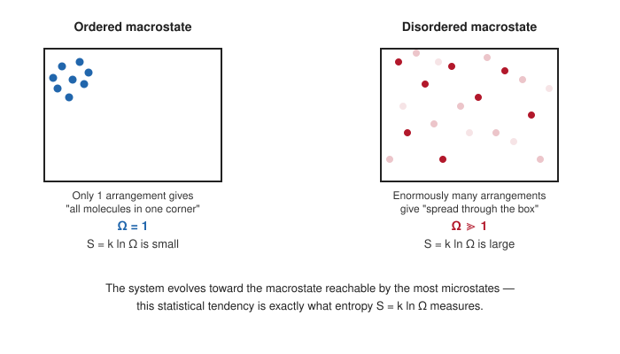

# 05. Entropy and Molecular Disorder

**Course:** PHY-103 (Physics – II) · **Unit:** Entropy
**Prerequisite:** [→ 03. Second Law of Thermodynamics in Terms of Entropy](03_second_law_in_terms_of_entropy.md)
**Leads to:** (conceptual link only — deepens the picture used throughout the rest of the unit, especially [06. Entropy of a Perfect Gas](06_entropy_of_a_perfect_gas.md))

---

## 1. Overview

So far, entropy has been defined purely macroscopically, through $dS=\delta Q_{\text{rev}}/T$ (Topic 01) and its consequences. This topic connects that macroscopic definition to its microscopic origin: entropy as a measure of the number of ways a system's molecules can be arranged while looking macroscopically the same. This statistical picture, due to Boltzmann, explains *why* entropy increases spontaneously (more disordered configurations are simply overwhelmingly more probable) and provides the physical intuition behind every result in this unit, without replacing the Clausius definition as the primary working tool.

## 2. Definitions & Key Terms

1. **Microstate** — *one specific, fully detailed arrangement of a system's particles (positions and velocities, or quantum states) consistent with a given macrostate.*
   > Plain-English: one exact "snapshot" of exactly where every single molecule is and how it's moving.
2. **Macrostate** — *the state of a system described by bulk, measurable variables ($P$, $V$, $T$, etc.), which can be realized by many different microstates.*
   > Plain-English: what you can actually measure with a thermometer and pressure gauge — many different molecular snapshots all give the same reading.
3. **Multiplicity ($\Omega$)** — *the number of distinct microstates corresponding to a given macrostate.*
   > Plain-English: how many different molecular "snapshots" all look the same from the outside.
4. **Boltzmann's entropy formula** — *$S = k_B\ln\Omega$, relating a macrostate's entropy directly to its multiplicity.*
   > Plain-English: more possible microscopic arrangements means more entropy.

## 3. Core Content

**1. Plain-word statement.** A macrostate with more accessible microstates (higher multiplicity $\Omega$) has higher entropy. Systems evolve toward higher-entropy macrostates not because of any special force pushing them there, but simply because such macrostates are statistically overwhelmingly more probable — there are vastly more ways to be "disordered" than to be "ordered."

**2. Experimental/theoretical basis.** Ludwig Boltzmann (1870s) connected the macroscopic thermodynamic entropy of Clausius to the statistical counting of microstates, a result later inscribed on his tombstone as $S=k\log W$. The formula was placed on rigorous statistical-mechanical footing by Gibbs and later developments in statistical mechanics.

**3. Full derivation — entropy of mixing as a concrete check of $S=k_B\ln\Omega$ against the Clausius result.**

Step 1: Consider free expansion of $N$ molecules of an ideal gas from volume $V_1$ into $V_2=2V_1$ (doubling volume), as in [Topic 02](02_change_of_entropy_reversible_irreversible.md).

Step 2: In the statistical picture, the multiplicity $\Omega$ of a macrostate for $N$ *independent, distinguishable placement choices* of molecules is (informally) proportional to $V^N$ — each molecule independently has $V$ times more accessible volume to be in, for a container of volume $V$ (holding momentum/energy states fixed for this argument).

Step 3: So the ratio of multiplicities between the final (volume $V_2$) and initial (volume $V_1$) macrostates is:
$$\frac{\Omega_2}{\Omega_1} = \left(\frac{V_2}{V_1}\right)^N$$

Step 4: Applying Boltzmann's formula:
$$\Delta S = S_2-S_1 = k_B\ln\Omega_2 - k_B\ln\Omega_1 = k_B\ln\frac{\Omega_2}{\Omega_1} = k_B\ln\left(\frac{V_2}{V_1}\right)^N = Nk_B\ln\frac{V_2}{V_1}$$

Step 5: Using $Nk_B = nN_Ak_B = nR$ (Avogadro's number $N_A$ and the gas constant $R=N_Ak_B$):
$$\boxed{\Delta S = nR\ln\frac{V_2}{V_1}}$$

Step 6: This **exactly matches** the Clausius (macroscopic) result derived independently in [Topic 02](02_change_of_entropy_reversible_irreversible.md), confirming that the statistical and classical-thermodynamic definitions of entropy agree for this process.

**4. Symbols (SI units).**

| Symbol | Meaning | SI unit |
|---|---|---|
| $\Omega$ | multiplicity (number of microstates) | dimensionless |
| $k_B$ | Boltzmann constant, $1.38\times10^{-23}$ | J/K |
| $N$ | number of molecules | dimensionless |
| $N_A$ | Avogadro's number, $6.022\times10^{23}$ | mol⁻¹ |

**5. Limits of validity.** Boltzmann's formula assumes the system can be meaningfully described by counting discrete (or, in the classical limit, appropriately coarse-grained continuous) microstates consistent with a given macrostate; it applies most cleanly to systems in or near equilibrium, and the "$V^N$" counting argument above is a simplified classical picture — a fully rigorous treatment requires quantum statistical mechanics (phase-space counting with Planck's constant $h$ setting the coarse-graining scale), beyond this course's scope.

**6. Convention conflicts.**
> ⚠️ Convention: some introductory treatments loosely describe entropy as "disorder" without further qualification, which can mislead in cases like crystallization from a supersaturated solution (where the crystal's own entropy decreases, but overall $\Delta S_{\text{universe}}>0$ due to the released latent heat warming the surroundings). "Disorder," precisely, refers to the *multiplicity of microstates* — the number of ways to arrange the system's parts and still get the same macrostate — not a vague intuitive sense of visual "messiness."

## 4. Worked Examples

### Example 1 — 🟢 Foundational

Explain briefly (no formula manipulation needed) why an ordered arrangement (e.g. all gas molecules in one corner of a box) has lower entropy than a disordered one (molecules spread throughout).

**Solution**

An ordered macrostate — all molecules confined to a small region — corresponds to relatively few possible molecular arrangements achieving that same "all in one place" description (small $\Omega$). A disordered macrostate — molecules spread throughout the container — can be achieved by an enormous number of different individual molecular arrangements (huge $\Omega$), since each molecule independently has far more available positions. By $S=k_B\ln\Omega$, the disordered macrostate therefore has higher entropy.

**Answer:** $\boxed{\text{Ordered: small } \Omega \Rightarrow \text{ low } S;\ \text{ disordered: large } \Omega \Rightarrow \text{ high } S}$

### Example 2 — 🟡 Intermediate

$3$ molecules are placed among $2$ boxes (left, right), each molecule equally likely to be in either box, independently. (a) List all microstates. (b) Compute $\Omega$ for the macrostate "all 3 in the left box" and for "2 in left, 1 in right." (c) Compare their entropies via $S=k_B\ln\Omega$.

**Solution**

Step 1 (all microstates): each molecule can be L or R, giving $2^3=8$ total microstates: LLL, LLR, LRL, RLL, LRR, RLR, RRL, RRR.

Step 2 ("all 3 in left" macrostate): only **1** microstate matches (LLL), so $\Omega_1=1$.

Step 3 ("2 in left, 1 in right" macrostate): microstates LLR, LRL, RLL match, so $\Omega_2=3$.

Step 4: $S_1 = k_B\ln(1) = 0$. $S_2 = k_B\ln(3) = k_B(1.0986) \approx 1.10\,k_B$.

**Answer:** $\boxed{\Omega_{\text{all-left}}=1,\ S=0;\qquad \Omega_{\text{2L-1R}}=3,\ S\approx1.10\,k_B}$ — the more "balanced" (less ordered) macrostate has strictly higher entropy, even for this tiny 3-molecule system, illustrating the same principle that governs macroscopic gases with $\sim10^{23}$ molecules.

### Example 3 — 🔴 Advanced / Exam-level

Using the statistical multiplicity argument (Core Content, Steps 1–5), derive $\Delta S$ for $2\ \text{mol}$ of an ideal gas whose volume increases by a factor of $5$, and confirm it matches the Clausius-based formula from Topic 02.

**Solution**

Step 1: From Core Content, $\Delta S = Nk_B\ln(V_2/V_1) = nR\ln(V_2/V_1)$ (statistical route, general $N$ and $V_2/V_1$).

Step 2: Substitute $n=2$, $V_2/V_1=5$: $\Delta S = (2)(8.314)\ln(5) = (16.628)(1.6094)$.

Step 3: $\Delta S = 26.77\ \text{J/K}$.

Step 4: Cross-check against the Clausius-based free-expansion formula of Topic 02, $\Delta S = nR\ln(V_2/V_1)$ — algebraically **identical** to the expression used in Step 1, confirming the two routes (macroscopic Clausius definition and microscopic Boltzmann counting) agree exactly.

**Answer:** $\boxed{\Delta S \approx 26.8\ \text{J/K}}$, identical whether derived from $dS=\delta Q_{\text{rev}}/T$ (Topic 01/02) or from $S=k_B\ln\Omega$ (this topic) — the two pictures of entropy are fully consistent.

## 5. Applications

1. **Explaining the direction of spontaneous mixing** — the statistical picture directly explains why two gases, once allowed to mix, are never observed to spontaneously separate again: the mixed macrostate has an astronomically larger $\Omega$ than the separated one, making unmixing statistically negligible (not strictly impossible, just fantastically improbable) for macroscopic amounts of gas.
2. **Information theory and Shannon entropy** — Boltzmann's $S=k_B\ln\Omega$ is the direct historical ancestor of Shannon's information entropy $H=-\sum p_i\log p_i$, widely used in data compression and communication theory, illustrating how "disorder"/uncertainty counting generalizes far beyond physics.

## 6. Diagram / Visual

*Figure 1: The disordered macrostate on the right is realized by vastly more individual molecular arrangements than the ordered one on the left, giving it higher entropy via $S=k_B\ln\Omega$.*

## 7. Common Mistakes

- ❌ **Mistake:** Treating "entropy = disorder" as a vague, purely qualitative slogan without reference to microstate counting.
  ✅ **Correct:** Entropy is precisely $k_B\ln\Omega$ — "disorder" means specifically "large multiplicity of microscopically distinct arrangements consistent with the same macrostate," not visual messiness.

- ❌ **Mistake:** Assuming the second law ($\Delta S_{\text{universe}}\geq0$) is an absolute, exceptionless mechanical law like Newton's laws.
  ✅ **Correct:** Statistically, a spontaneous decrease in entropy is not strictly forbidden — it is simply so overwhelmingly improbable for macroscopic systems ($N\sim10^{23}$) that it is never observed; for very small systems, fluctuations that momentarily decrease entropy are measurable (Boltzmann's constant sets the scale of such fluctuations).

- ❌ **Mistake:** Believing a locally ordered system (e.g. a living organism, or a growing crystal) violates the second law.
  ✅ **Correct:** Such systems are not isolated; their own entropy can decrease as long as they export at least as much entropy to their surroundings, keeping $\Delta S_{\text{universe}}\geq0$ overall.

- ❌ **Mistake:** Using $S=k_B\ln\Omega$ and $S=\delta Q_{\text{rev}}/T$ (integrated) as if they were unrelated or in competition.
  ✅ **Correct:** They are two equivalent descriptions of the same physical quantity, as verified explicitly in Example 3 above — the statistical formula gives the deeper "why," the Clausius formula gives the practical "how to calculate."

## 8. Practice Problems

**Problem 1:** For $4$ molecules distributed independently between 2 boxes, find $\Omega$ for the macrostate "3 in left, 1 in right."

Solution

Number of ways to choose which 1 of the 4 molecules is in the right box: $\binom{4}{1}=4$.

$$\text{Answer: } \Omega = 4$$

**Problem 2:** Using $S=k_B\ln\Omega$, find the entropy (in units of $k_B$) of the macrostate in Problem 1.

Solution

$S = k_B\ln(4) = k_B(1.386)$

$$\text{Answer: } S \approx 1.39\,k_B$$

**Problem 3:** $1\ \text{mol}$ of gas doubles its volume via free expansion. Using the statistical route ($\Delta S=Nk_B\ln(V_2/V_1)$ with $N=N_An$), find $\Delta S$ and confirm it matches $nR\ln2$.

Solution

$\Delta S = Nk_B\ln2 = (N_An)k_B\ln2 = n(N_Ak_B)\ln2 = nR\ln2$ (using $R=N_Ak_B$)

$= (1)(8.314)(0.693) = 5.76\ \text{J/K}$, identical to the Clausius-based result of Topic 02, Example 1.

$$\text{Answer: } \Delta S = 5.76\ \text{J/K, matching } nR\ln2 \text{ exactly.}$$

**Problem 4 (exam-style, multi-step):** A macrostate A has multiplicity $\Omega_A = 10^{20}$, and after a spontaneous process the system reaches macrostate B with $\Omega_B = 10^{25}$. (a) Find $\Delta S = S_B - S_A$ in terms of $k_B$. (b) Convert this to J/K. (c) Confirm the sign is consistent with the second law for a spontaneous (irreversible) process in an isolated system.

Solution

**(a)** $\Delta S = k_B\ln(\Omega_B/\Omega_A) = k_B\ln(10^{25}/10^{20}) = k_B\ln(10^5) = k_B(5\ln10) = k_B(11.51)$

**(b)** $\Delta S = (1.38\times10^{-23})(11.51) = 1.589\times10^{-22}\ \text{J/K}$

**(c)** $\Delta S > 0$, consistent with $\Delta S_{\text{universe}}\geq0$ (Topic 03) for a spontaneous process in an isolated system — the system evolved toward the vastly more probable (higher-multiplicity) macrostate, exactly as expected.

$$\text{Answer: } \Delta S \approx 11.5\,k_B \approx 1.59\times10^{-22}\ \text{J/K, positive as required.}$$

## 9. Summary

| Concept | Result | Condition / Limit |
|---|---|---|
| Boltzmann's formula | $S=k_B\ln\Omega$ | Statistical-mechanical definition of entropy |
| Free-expansion check | $\Delta S=Nk_B\ln(V_2/V_1)=nR\ln(V_2/V_1)$ | Matches Clausius result exactly |
| Direction of spontaneous change | Systems evolve toward higher-$\Omega$ (higher-entropy) macrostates | Statistical, not absolutely forbidding decrease |
| "Disorder" (precise meaning) | Multiplicity of microstates consistent with a macrostate | Not a vague visual notion |

Having connected entropy to microscopic disorder, the next topic returns to purely macroscopic (Clausius-based) calculation, deriving the general formula for the entropy change of a perfect gas that will be used repeatedly for the rest of the unit.

## 10. References

1. **Serway & Jewett, *Physics for Scientists and Engineers*, 9th ed., Cengage** — Ch. 22, statistical interpretation of entropy, coin-toss/molecule-counting examples.
2. **Halliday, Resnick & Walker, *Fundamentals of Physics*, 10th ed., Wiley** — Ch. 20, statistical mechanics of entropy, includes a similar box-and-molecules counting argument.
3. **HyperPhysics — Entropy as a Measure of Disorder** — $S=k\ln\Omega$ derivation and free-expansion cross-check. [hyperphysics.phy-astr.gsu.edu](http://hyperphysics.phy-astr.gsu.edu/hbase/therm/entrop2.html)
4. **MIT OCW 8.044 (Statistical Physics I)** — rigorous treatment of microstate counting and the Boltzmann entropy formula.
