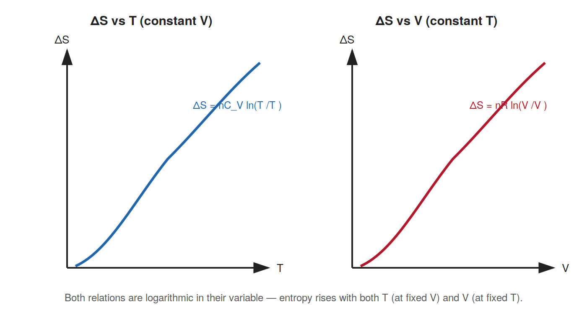

# 06. Entropy of a Perfect Gas

**Course:** PHY-103 (Physics – II) · **Unit:** Entropy
**Prerequisite:** [→ 02. Change of Entropy in Reversible & Irreversible Process](02_change_of_entropy_reversible_irreversible.md)
**Leads to:** [→ 07. Change of Entropy is Independent of the Path Chosen for the Transformation](07_entropy_independent_of_path.md)

---

## 1. Overview

[Topic 02](02_change_of_entropy_reversible_irreversible.md) computed entropy change for a few special cases (constant $T$, free expansion). This topic derives the **general** formula for the entropy change of an ideal (perfect) gas undergoing *any* reversible process between two arbitrary states $(T_1,V_1)\to(T_2,V_2)$ — the single most exam-relevant formula in this unit. The same derivation reappears, essentially unchanged, in [Part XVII, §38 of the Thermodynamics unit](../thermodynamics/Thermodynamics_os.md#38-entropy-change); this topic gives it in full standalone detail together with the equivalent $(T,P)$ form, and sets up the machinery needed to prove path-independence explicitly in [Topic 07](07_entropy_independent_of_path.md).

## 2. Definitions & Key Terms

1. **Perfect (ideal) gas** — *a gas obeying $PV=nRT$ exactly, with molar heat capacities $C_V,C_P$ that are constant over the temperature range of interest.*
   > Plain-English: the idealized gas from Kinetic Theory of Gases, with no intermolecular forces or finite molecular volume.
2. **Molar heat capacity at constant volume ($C_V$)** — *heat required per mole per kelvin to raise temperature at constant volume, $C_V=(\partial U/\partial T)_V/n$.*
3. **Molar heat capacity at constant pressure ($C_P$)** — *heat required per mole per kelvin at constant pressure; for an ideal gas, $C_P=C_V+R$ (from the [Thermodynamics unit](../thermodynamics/Thermodynamics_os.md)).*

## 3. Core Content

**1. Plain-word statement.** For an ideal gas, the entropy change between any two states can be written in closed form purely in terms of the initial and final temperatures and volumes (or temperatures and pressures) — no path details are needed, because $S$ is a state function (Topic 01).

**2. Experimental/theoretical basis.** The derivation combines the first law of thermodynamics, the ideal gas law, and the Clausius definition of entropy (Topic 01); all three are independently well-verified.

**3. Full derivation — $\Delta S$ in terms of $T$ and $V$.**

Step 1: For a reversible infinitesimal step, the first law gives $\delta Q_{\text{rev}} = dU + P\,dV$.

Step 2: For an ideal gas, $dU = nC_V\,dT$ (internal energy depends only on $T$ — a defining property of an ideal gas, established in the Thermodynamics unit), so:
$$\delta Q_{\text{rev}} = nC_V\,dT + P\,dV$$

Step 3: From the entropy definition (Topic 01), $dS = \delta Q_{\text{rev}}/T$:
$$dS = \frac{nC_V\,dT}{T} + \frac{P\,dV}{T}$$

Step 4: Use the ideal gas law $PV=nRT \Rightarrow P/T = nR/V$ to eliminate $P/T$:
$$dS = \frac{nC_V\,dT}{T} + \frac{nR\,dV}{V}$$

Step 5: Integrate both sides from state 1 $(T_1,V_1)$ to state 2 $(T_2,V_2)$, treating $C_V$ as constant over the range:
$$\int_1^2 dS = nC_V\int_{T_1}^{T_2}\frac{dT}{T} + nR\int_{V_1}^{V_2}\frac{dV}{V}$$

Step 6:
$$\boxed{\Delta S = nC_V\ln\frac{T_2}{T_1} + nR\ln\frac{V_2}{V_1}}$$

**Equivalent derivation — $\Delta S$ in terms of $T$ and $P$.**

Step 1: Start from the enthalpy form of the first law for a reversible process, $\delta Q_{\text{rev}} = dH - V\,dP$ (from $H=U+PV \Rightarrow dH = dU + P\,dV + V\,dP$, so $dU+P\,dV = dH - V\,dP$; see [Part XVIII](../thermodynamics/Thermodynamics_os.md#part-xviii--thermodynamic-functions) for enthalpy).

Step 2: For an ideal gas, $dH = nC_P\,dT$, so $\delta Q_{\text{rev}} = nC_P\,dT - V\,dP$.

Step 3: Divide by $T$ and use $V/T = nR/P$ (ideal gas law):
$$dS = \frac{nC_P\,dT}{T} - \frac{nR\,dP}{P}$$

Step 4: Integrating:
$$\boxed{\Delta S = nC_P\ln\frac{T_2}{T_1} - nR\ln\frac{P_2}{P_1}}$$

**4. Symbols (SI units).**

| Symbol | Meaning | SI unit |
|---|---|---|
| $C_V$, $C_P$ | molar heat capacities at constant $V$, $P$ | J mol⁻¹ K⁻¹ |
| $n$ | number of moles | mol |
| $R$ | universal gas constant, $8.314$ | J mol⁻¹ K⁻¹ |

**5. Limits of validity.** Both boxed formulas assume: (a) the gas is ideal ($PV=nRT$, $U=U(T)$ only); (b) $C_V$ (or $C_P$) is constant over $[T_1,T_2]$ — for large temperature ranges where heat capacities vary appreciably, the integral $\int nC_V\,dT/T$ must be evaluated with $C_V(T)$ left inside the integral.

**6. Convention conflicts.**
> ⚠️ Convention: some texts write the volume-based formula using $C_V$ per unit mass (specific heat, lower-case $c_v$) rather than molar $C_V$, requiring $n$ to be replaced by mass $m$ — always check which convention a given problem uses before substituting numbers.

## 4. Worked Examples

### Example 1 — 🟢 Foundational

$2\ \text{mol}$ of an ideal monatomic gas ($C_V=\tfrac32R$) is heated at constant volume from $T_1=280\ \text{K}$ to $T_2=420\ \text{K}$. Find $\Delta S$.

**Solution**

Step 1: At constant $V$, the volume term vanishes ($V_2=V_1$): $\Delta S = nC_V\ln(T_2/T_1)$.

Step 2: $C_V = \tfrac32(8.314)=12.47\ \text{J mol}^{-1}\text{K}^{-1}$.

Step 3: $\Delta S = (2)(12.47)\ln(420/280) = (24.94)\ln(1.5) = (24.94)(0.4055)$.

Step 4: $\Delta S = 10.12\ \text{J/K}$.

**Answer:** $\boxed{\Delta S \approx 10.1\ \text{J/K}}$

### Example 2 — 🟡 Intermediate

$1.5\ \text{mol}$ of an ideal diatomic gas ($C_V=\tfrac52R$) expands reversibly from $(T_1=300\ \text{K}, V_1=0.02\ \text{m}^3)$ to $(T_2=380\ \text{K}, V_2=0.05\ \text{m}^3)$. Find $\Delta S$ using the full two-term formula.

**Solution**

Step 1: $C_V=\tfrac52(8.314)=20.785\ \text{J mol}^{-1}\text{K}^{-1}$.

Step 2: Temperature term: $nC_V\ln(T_2/T_1) = (1.5)(20.785)\ln(380/300) = (31.18)\ln(1.267)$.

Step 3: $\ln(1.267)=0.2364$, so temperature term $=31.18\times0.2364=7.37\ \text{J/K}$.

Step 4: Volume term: $nR\ln(V_2/V_1) = (1.5)(8.314)\ln(0.05/0.02) = (12.47)\ln(2.5)$.

Step 5: $\ln(2.5)=0.9163$, so volume term $=12.47\times0.9163=11.43\ \text{J/K}$.

Step 6: $\Delta S = 7.37+11.43=18.80\ \text{J/K}$.

**Answer:** $\boxed{\Delta S \approx 18.8\ \text{J/K}}$

### Example 3 — 🔴 Advanced / Exam-level

$1\ \text{mol}$ of an ideal diatomic gas ($C_V=\tfrac52R$, $C_P=\tfrac72R$) goes from $(T_1=300\ \text{K}, P_1=2\times10^5\ \text{Pa})$ to $(T_2=450\ \text{K}, P_2=3\times10^5\ \text{Pa})$. Compute $\Delta S$ using the $(T,P)$ form, then verify it against the $(T,V)$ form by first finding $V_1$ and $V_2$.

**Solution**

**$(T,P)$ form:**

Step 1: $C_P = \tfrac72(8.314)=29.10\ \text{J mol}^{-1}\text{K}^{-1}$.

Step 2: $\Delta S = nC_P\ln(T_2/T_1) - nR\ln(P_2/P_1) = (1)(29.10)\ln(1.5) - (1)(8.314)\ln(1.5)$.

Step 3: $\ln(1.5)=0.4055$: $\Delta S = (29.10-8.314)(0.4055) = (20.79)(0.4055)=8.43\ \text{J/K}$.

**Cross-check via $(T,V)$ form:**

Step 4: $V_1 = nRT_1/P_1 = (1)(8.314)(300)/(2\times10^5) = 2494.2/200000=0.01247\ \text{m}^3$.

Step 5: $V_2 = nRT_2/P_2 = (1)(8.314)(450)/(3\times10^5) = 3741.3/300000=0.01247\ \text{m}^3$.

Step 6: Interesting special case — $V_2=V_1$ here (the ratios $T_2/T_1=1.5$ and $P_2/P_1=1.5$ are equal, so volume is unchanged). Then $\Delta S = nC_V\ln(T_2/T_1) = (1)(20.785)\ln(1.5)=(20.785)(0.4055)=8.43\ \text{J/K}$.

**Answer:** $\boxed{\Delta S \approx 8.43\ \text{J/K}}$, identical by both routes ✓ — confirming the internal consistency of the $(T,V)$ and $(T,P)$ forms (as they must be, since both equal $S_2-S_1$ for a state function).

## 5. Applications

1. **Compressor and turbine performance analysis** — the $(T,P)$ entropy formula is the standard tool for computing the entropy change (and hence irreversibility/efficiency losses) of gas compressors and turbines in mechanical and chemical engineering.
2. **Atmospheric science — adiabatic lapse rate context** — entropy-based reasoning about ideal-gas parcels underlies the derivation of how temperature changes with altitude in the atmosphere (connecting to the [adiabatic relations](../thermodynamics/Thermodynamics_os.md) covered in Kinetic Theory of Gases).

## 6. Diagram / Visual

*Figure 1: Both branches of $\Delta S = nC_V\ln(T_2/T_1) + nR\ln(V_2/V_1)$ are logarithmic in their respective variable — entropy increases with both temperature (at fixed $V$) and volume (at fixed $T$).*

## 7. Common Mistakes

- ❌ **Mistake:** Using the $(T,V)$ formula with pressure values, or the $(T,P)$ formula with volume values, without converting.
  ✅ **Correct:** Match the formula to the variables given; use the ideal gas law to convert between $(T,V)$ and $(T,P)$ descriptions if a mixed set of data is given (Example 3).

- ❌ **Mistake:** Forgetting the minus sign in the $(T,P)$ form: $\Delta S = nC_P\ln(T_2/T_1) - nR\ln(P_2/P_1)$.
  ✅ **Correct:** The pressure term is subtracted (increasing pressure at fixed $T$ *decreases* entropy, opposite to the effect of increasing volume).

- ❌ **Mistake:** Using $C_P$ in the $(T,V)$ formula or $C_V$ in the $(T,P)$ formula.
  ✅ **Correct:** Each formula pairs a specific heat capacity with its natural variable pair — $C_V$ with $(T,V)$, $C_P$ with $(T,P)$ — mixing them gives a wrong numerical answer even though the algebra "runs."

- ❌ **Mistake:** Assuming these formulas apply to real (non-ideal) gases without correction.
  ✅ **Correct:** Both boxed results rely on $PV=nRT$ and $U=U(T)$ only — strictly ideal-gas assumptions; real gases need van der Waals-type corrections (Kinetic Theory of Gases unit) for accurate entropy calculations.

## 8. Practice Problems

**Problem 1:** $3\ \text{mol}$ of an ideal monatomic gas is compressed at constant temperature from $V_1=0.08\ \text{m}^3$ to $V_2=0.02\ \text{m}^3$. Find $\Delta S$.

Solution

At constant $T$, only the volume term survives: $\Delta S = nR\ln(V_2/V_1) = (3)(8.314)\ln(0.25) = (24.94)(-1.386) = -34.6\ \text{J/K}$

$$\text{Answer: } \Delta S \approx -34.6\ \text{J/K (decrease, as expected for compression)}$$

**Problem 2:** $1\ \text{mol}$ of an ideal diatomic gas ($C_V=\tfrac52R$) is cooled at constant volume from $500\ \text{K}$ to $350\ \text{K}$. Find $\Delta S$.

Solution

$\Delta S = nC_V\ln(T_2/T_1) = (1)(20.785)\ln(350/500) = (20.785)\ln(0.7) = (20.785)(-0.3567) = -7.41\ \text{J/K}$

$$\text{Answer: } \Delta S \approx -7.41\ \text{J/K}$$

**Problem 3:** $2\ \text{mol}$ of an ideal gas ($C_P=\tfrac72R$) is heated at constant pressure from $300\ \text{K}$ to $500\ \text{K}$. Find $\Delta S$.

Solution

At constant $P$, the pressure term vanishes: $\Delta S = nC_P\ln(T_2/T_1) = (2)(29.10)\ln(500/300) = (58.20)\ln(1.667) = (58.20)(0.5108) = 29.73\ \text{J/K}$

$$\text{Answer: } \Delta S \approx 29.7\ \text{J/K}$$

**Problem 4 (exam-style, multi-step):** $1\ \text{mol}$ of an ideal monatomic gas ($C_V=\tfrac32R$) undergoes a two-step process: (i) isothermal expansion at $T=350\ \text{K}$ from $V_1=0.01\ \text{m}^3$ to $V=0.02\ \text{m}^3$; (ii) constant-volume heating from $350\ \text{K}$ to $500\ \text{K}$. Find the total $\Delta S$, and verify it equals the direct-formula result for the overall initial and final states.

Solution

**Step (i):** isothermal, $\Delta S_1 = nR\ln(V/V_1) = (1)(8.314)\ln(2) = 8.314(0.693) = 5.76\ \text{J/K}$

**Step (ii):** constant volume, $\Delta S_2 = nC_V\ln(T_2/T_1) = (1)(12.47)\ln(500/350) = (12.47)(0.357) = 4.45\ \text{J/K}$

**Total:** $\Delta S = \Delta S_1+\Delta S_2 = 5.76+4.45=10.21\ \text{J/K}$

**Direct-formula check** (overall states: $T_1=350\ \text{K},V_1=0.01\ \text{m}^3 \to T_2=500\ \text{K},V_2=0.02\ \text{m}^3$):
$$\Delta S = nC_V\ln\frac{500}{350}+nR\ln\frac{0.02}{0.01} = (12.47)(0.357)+(8.314)(0.693) = 4.45+5.76=10.21\ \text{J/K}$$

Both routes agree exactly ✓, confirming path-independence (proved generally in [Topic 07](07_entropy_independent_of_path.md)).

$$\text{Answer: } \Delta S = 10.21\ \text{J/K, same via the two-step and the direct route.}$$

## 9. Summary

| Concept | Result | Condition / Limit |
|---|---|---|
| Entropy change, $(T,V)$ form | $\Delta S = nC_V\ln(T_2/T_1)+nR\ln(V_2/V_1)$ | Ideal gas, constant $C_V$ |
| Entropy change, $(T,P)$ form | $\Delta S = nC_P\ln(T_2/T_1)-nR\ln(P_2/P_1)$ | Ideal gas, constant $C_P$ |
| Constant-volume special case | $\Delta S = nC_V\ln(T_2/T_1)$ | $V_2=V_1$ |
| Constant-pressure special case | $\Delta S = nC_P\ln(T_2/T_1)$ | $P_2=P_1$ |
| Isothermal special case | $\Delta S = nR\ln(V_2/V_1) = -nR\ln(P_2/P_1)$ | $T_2=T_1$ |

Having derived the general formula for an ideal gas's entropy change, the next topic proves explicitly — using a multi-step example like Practice Problem 4 above, generalized — that this result is genuinely independent of which specific reversible path is chosen between the two states.

## 10. References

1. **Halliday, Resnick & Walker, *Fundamentals of Physics*, 10th ed., Wiley** — Ch. 20, derivation of $\Delta S$ for an ideal gas via the first law and ideal gas law.
2. **Serway & Jewett, *Physics for Scientists and Engineers*, 9th ed., Cengage** — Ch. 22, entropy changes for ideal gases, worked multi-step examples.
3. **Cengel & Boles, *Thermodynamics: An Engineering Approach*, 8th ed., McGraw-Hill** — Ch. 7, entropy-change relations for ideal gases (both $T$–$V$ and $T$–$P$ forms).
4. **MIT OCW 8.044** — derivation of ideal-gas entropy from the combined first and second laws.
