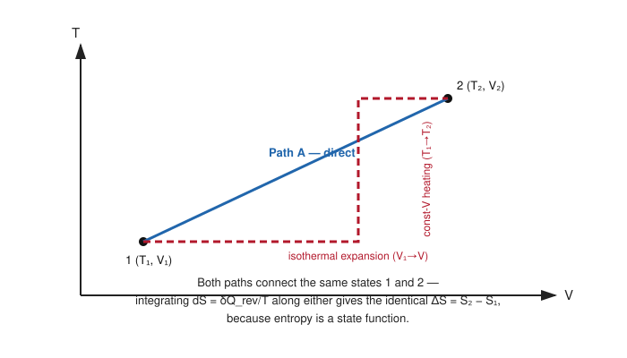

# 07. Change of Entropy is Independent of the Path Chosen for the Transformation

**Course:** PHY-103 (Physics – II) · **Unit:** Entropy
**Prerequisite:** [→ 06. Entropy of a Perfect Gas](06_entropy_of_a_perfect_gas.md)
**Leads to:** [→ 08. Clausius's Theorem](08_clausius_theorem.md)

---

## 1. Overview

Topic 01 asserted, from Clausius's theorem, that entropy is a state function. [Topic 06](06_entropy_of_a_perfect_gas.md)'s worked examples repeatedly *verified* this by computing $\Delta S$ two different ways and getting the same answer. This topic makes the path-independence property fully explicit and general: it proves, directly from the ideal-gas entropy formula, that $\Delta S$ between two fixed states is the same number no matter which reversible path — direct, multi-step, or any shape — connects them. This closes the loop before the unit turns, in [Topic 08](08_clausius_theorem.md), to proving the underlying theorem (Clausius's) from first principles.

## 2. Definitions & Key Terms

1. **Path independence** — *the property that a quantity's change between two states depends only on the states themselves, not on the sequence of intermediate steps.*
   > Plain-English: however you get from A to B, the *change* in a path-independent quantity is the same.
2. **Exact differential** — *a differential $dS$ that integrates to a value depending only on endpoints — mathematically, $\oint dS = 0$ around any closed loop.*
   > Plain-English: the mathematical fingerprint of a state function.
3. **Inexact differential** — *a differential (like $\delta Q$ or $\delta W$) whose integral around a closed loop is generally nonzero.*
   > Plain-English: the mathematical fingerprint of a path-dependent quantity.

## 3. Core Content

**1. Plain-word statement.** For an ideal gas (or any system), the entropy change computed between two fixed states $(T_1,V_1)$ and $(T_2,V_2)$ is exactly the same regardless of which reversible path is used for the calculation — direct, via an intermediate constant-volume-then-isothermal route, via an intermediate isothermal-then-constant-volume route, or any other reversible sequence.

**2. Experimental/theoretical basis.** This is a direct mathematical consequence of $S$ being defined as a state function via Clausius's theorem (Topics 01, 08); this topic demonstrates it concretely by explicit multi-path calculation using the ideal-gas formula from Topic 06.

**3. Full derivation — general proof for two arbitrary paths between $(T_1,V_1)$ and $(T_2,V_2)$.**

**Path A — direct (simultaneous $T$ and $V$ change).** From Topic 06:
$$\Delta S_A = nC_V\ln\frac{T_2}{T_1} + nR\ln\frac{V_2}{V_1}$$

**Path B — two-step, via an intermediate state $(T_1, V_2)$ (isothermal first, then constant-volume heating).**

Step 1 (isothermal, $T_1\to T_1$, $V_1\to V_2$): $\Delta S_{B1} = nR\ln(V_2/V_1)$ (constant-$T$ special case of Topic 06's formula, temperature term vanishes).

Step 2 (constant volume, $V_2\to V_2$, $T_1\to T_2$): $\Delta S_{B2} = nC_V\ln(T_2/T_1)$ (constant-$V$ special case, volume term vanishes).

Step 3: $\Delta S_B = \Delta S_{B1}+\Delta S_{B2} = nR\ln(V_2/V_1) + nC_V\ln(T_2/T_1)$.

**Path C — two-step, via a different intermediate state $(T_2,V_1)$ (constant-volume heating first, then isothermal expansion).**

Step 1 (constant volume, $T_1\to T_2$, $V_1\to V_1$): $\Delta S_{C1} = nC_V\ln(T_2/T_1)$.

Step 2 (isothermal, $T_2\to T_2$, $V_1\to V_2$): $\Delta S_{C2} = nR\ln(V_2/V_1)$.

Step 3: $\Delta S_C = \Delta S_{C1}+\Delta S_{C2} = nC_V\ln(T_2/T_1) + nR\ln(V_2/V_1)$.

**Comparison.**
$$\Delta S_A = \Delta S_B = \Delta S_C = nC_V\ln\frac{T_2}{T_1}+nR\ln\frac{V_2}{V_1}$$

All three paths — direct, and both orderings of the two-step intermediate route — give **algebraically identical** results, term by term, regardless of the order in which the logarithm terms were accumulated. This holds for *any* choice of intermediate state, not just these two, because addition of logarithms is commutative and each step's contribution depends only on the ratio of the variable held fixed in that step.

$$\boxed{\Delta S \text{ depends only on } (T_1,V_1) \text{ and } (T_2,V_2) - \text{never on the path}}$$

**4. Symbols (SI units).** Same as [Topic 06](06_entropy_of_a_perfect_gas.md): $n$ (mol), $C_V,C_P$ (J mol⁻¹K⁻¹), $R=8.314$ J mol⁻¹K⁻¹.

**5. Limits of validity.** This proof is specific to an ideal gas with constant heat capacities and a two-step (or direct) *reversible* path; the general path-independence of $S$ for *any* system and *any* reversible path is the content of Clausius's theorem, proved rigorously and generally in [Topic 08](08_clausius_theorem.md) — this topic gives the concrete, verifiable special case for the ideal gas already familiar from Topic 06.

**6. Convention conflicts.**
> ⚠️ Convention: do not confuse "path independence of $\Delta S$" with "path independence of $Q$" — heat $Q$ exchanged along Path A, B, and C above is generally **different** for each path (only entropy, not heat itself, is guaranteed path-independent); this distinction is exactly what separates a state function ($S$) from a path function ($Q$).

## 4. Worked Examples

### Example 1 — 🟢 Foundational

$1\ \text{mol}$ of an ideal monatomic gas ($C_V=\tfrac32R$) goes from $(T_1=300\ \text{K}, V_1=0.01\ \text{m}^3)$ to $(T_2=450\ \text{K}, V_2=0.03\ \text{m}^3)$ directly. Compute $\Delta S$.

**Solution**

Step 1: $C_V=\tfrac32(8.314)=12.47\ \text{J mol}^{-1}\text{K}^{-1}$.

Step 2: $\Delta S = nC_V\ln(T_2/T_1)+nR\ln(V_2/V_1) = (12.47)\ln(1.5)+(8.314)\ln(3)$.

Step 3: $(12.47)(0.4055)+(8.314)(1.0986) = 5.06+9.13=14.19\ \text{J/K}$.

**Answer:** $\boxed{\Delta S \approx 14.2\ \text{J/K}}$

### Example 2 — 🟡 Intermediate

Repeat Example 1's calculation via the two-step path: (i) isothermal expansion at $300\ \text{K}$ from $0.01\ \text{m}^3$ to $0.03\ \text{m}^3$; (ii) constant-volume heating at $0.03\ \text{m}^3$ from $300\ \text{K}$ to $450\ \text{K}$. Confirm the total matches Example 1.

**Solution**

Step 1: $\Delta S_1 = nR\ln(V_2/V_1) = (8.314)\ln(3) = (8.314)(1.0986)=9.13\ \text{J/K}$

Step 2: $\Delta S_2 = nC_V\ln(T_2/T_1) = (12.47)\ln(1.5) = (12.47)(0.4055)=5.06\ \text{J/K}$

Step 3: $\Delta S = 9.13+5.06=14.19\ \text{J/K}$

**Answer:** $\boxed{\Delta S \approx 14.2\ \text{J/K}}$, identical to Example 1 — confirming path-independence directly for this pair of states.

### Example 3 — 🔴 Advanced / Exam-level

For the same overall change of state as Examples 1–2, compute the **heat exchanged** $Q$ along the direct adiabatic-like arbitrary path is not well-defined without more information, but compute $Q$ for the two-step path of Example 2, and contrast this with the fact that $\Delta S$ was path-independent. What does this contrast illustrate?

**Solution**

Step 1 (isothermal step, $T=300\ \text{K}$ constant): $\Delta U_1=0$ (ideal gas, $T$ constant), so $Q_1 = W_1 = nRT\ln(V_2/V_1) = (1)(8.314)(300)\ln(3) = (2494.2)(1.0986)=2740\ \text{J}$.

Step 2 (constant volume, $W_2=0$): $Q_2 = \Delta U_2 = nC_V(T_2-T_1) = (12.47)(450-300)=(12.47)(150)=1870\ \text{J}$.

Step 3: Total heat exchanged along this path: $Q_{\text{path}} = Q_1+Q_2 = 2740+1870=4610\ \text{J}$.

Step 4: If instead the two steps were done in the opposite order (heat first at constant $V_1$, then expand isothermally at $T_2$), the total heat exchanged would generally be a **different** number (readers can verify: $Q_1' = nC_V(T_2-T_1)=1870\ \text{J}$; $Q_2' = nRT_2\ln(V_2/V_1) = (8.314)(450)\ln(3)=(3741.3)(1.0986)=4110\ \text{J}$; total $=1870+4110=5980\ \text{J}$, different from $4610\ \text{J}$).

**Answer:** $\boxed{Q \text{ depends on the path } (4610\ \text{J vs } 5980\ \text{J}); \Delta S \text{ does not (always } 14.2\ \text{J/K)}}$ — this contrast is the concrete illustration of the difference between an exact differential ($dS$) and an inexact one ($\delta Q$): the *same* entropy change can be accompanied by *different* amounts of heat and work, depending on path, even though $\Delta S$ itself never varies.

## 5. Applications

1. **Thermodynamic cycle analysis** — path-independence of $S$ (contrasted with path-dependence of $Q$ and $W$) is why entropy, alongside internal energy and enthalpy, is used as a state-function "anchor" when analyzing complex multi-step industrial cycles (e.g. refrigeration or power cycles with several distinct legs).
2. **Constructing convenient calculation paths** — engineers routinely replace a complicated real process with an equivalent, easier-to-integrate reversible path (as in Topic 02's free-expansion trick) precisely because path-independence guarantees the answer for $\Delta S$ will be unaffected by this substitution.

## 6. Diagram / Visual

*Figure 1: Path A (solid, direct) and Path B (dashed, via an intermediate state) both connect states 1 and 2; because $S$ is a state function, $\Delta S$ computed along either path is exactly the same number.*

## 7. Common Mistakes

- ❌ **Mistake:** Assuming that because $\Delta S$ is path-independent, $Q$ and $W$ must be too.
  ✅ **Correct:** Only $S$ (and other state functions like $U$, $H$) are path-independent; $Q$ and $W$ individually are path-dependent even though their difference $Q-W=\Delta U$ is fixed (first law) — see Example 3.

- ❌ **Mistake:** Choosing an inconvenient direct path to compute $\Delta S$ when a much simpler two-step path (e.g. isothermal-then-isochoric) gives an identical, easier-to-compute answer.
  ✅ **Correct:** Exploit path-independence — pick whichever reversible path between the same two states is algebraically simplest.

- ❌ **Mistake:** Forgetting that path-independence of $\Delta S$ for an irreversible process still requires substituting a *reversible* path between the same endpoints (Topic 02), not literally integrating along the irreversible path itself.
  ✅ **Correct:** Path-independence applies to the *value* of $\Delta S$ between fixed states; the actual computation route must still be a reversible one.

- ❌ **Mistake:** Concluding path-independence only holds for the specific two intermediate routes shown in the derivation.
  ✅ **Correct:** The proof generalizes to *any* number of intermediate steps or any continuously varying reversible path — Clausius's theorem ([Topic 08](08_clausius_theorem.md)) establishes this for arbitrary paths, not just two-step ones.

## 8. Practice Problems

**Problem 1:** $2\ \text{mol}$ of an ideal gas ($C_V=\tfrac52R$) goes from $(250\ \text{K}, 0.015\ \text{m}^3)$ to $(400\ \text{K}, 0.045\ \text{m}^3)$ directly. Find $\Delta S$.

Solution

$C_V=\tfrac52(8.314)=20.785$

$\Delta S = nC_V\ln(400/250)+nR\ln(0.045/0.015) = (2)(20.785)\ln(1.6)+(2)(8.314)\ln(3)$

$=(41.57)(0.470)+(16.628)(1.0986) = 19.54+18.27=37.81\ \text{J/K}$

$$\text{Answer: } \Delta S \approx 37.8\ \text{J/K}$$

**Problem 2:** Repeat Problem 1 via a two-step path: constant-volume heating first ($250\to400\ \text{K}$ at $0.015\ \text{m}^3$), then isothermal expansion ($0.015\to0.045\ \text{m}^3$ at $400\ \text{K}$). Confirm the same total.

Solution

Step 1: $\Delta S_1 = nC_V\ln(400/250) = (41.57)(0.470)=19.54\ \text{J/K}$

Step 2: $\Delta S_2 = nR\ln(3) = (16.628)(1.0986)=18.27\ \text{J/K}$

Total: $19.54+18.27=37.81\ \text{J/K}$ — matches Problem 1 exactly.

$$\text{Answer: } \Delta S = 37.8\ \text{J/K, confirming path-independence.}$$

**Problem 3:** Explain (conceptually, one sentence) why $\delta Q$ is called an "inexact differential" while $dS$ is called an "exact differential."

Solution

$dS$ integrates around any closed cycle to zero ($\oint dS=0$, since $S$ returns to its starting value after a cycle back to the same state), while $\oint \delta Q \neq 0$ in general (net heat absorbed over a cycle need not be zero — indeed for an engine it equals the net work done) — this is the mathematical distinction between exact and inexact differentials.

**Problem 4 (exam-style, multi-step):** For $1\ \text{mol}$ of an ideal gas ($C_V=\tfrac32R$) taken from $(300\ \text{K},0.02\ \text{m}^3)$ to $(600\ \text{K},0.02\ \text{m}^3)$ (constant volume throughout) via two different reversible sub-paths: (A) direct linear heating; (B) heating from 300 K to 450 K, briefly (reversibly) expanding to $0.04\ \text{m}^3$ then compressing back to $0.02\ \text{m}^3$ at constant $T=450$ K, then continuing to heat to 600 K at constant $0.02\ \text{m}^3$. Show $\Delta S$ is the same for both, even though path B includes an excursion to a different volume.

Solution

**Path A** (direct, constant $V$ throughout): $\Delta S_A = nC_V\ln(600/300) = (12.47)\ln(2) = (12.47)(0.693)=8.64\ \text{J/K}$

**Path B:**
- Step 1 (const $V=0.02$, $300\to450$ K): $\Delta S_{B1}=nC_V\ln(450/300)=(12.47)\ln(1.5)=(12.47)(0.4055)=5.06\ \text{J/K}$
- Step 2 (isothermal excursion at 450 K, $0.02\to0.04\to0.02\ \text{m}^3$): since it returns to the *same* volume, the net volume-term contribution is $nR\ln(0.04/0.02)+nR\ln(0.02/0.04) = nR\ln2 - nR\ln2 = 0$
- Step 3 (const $V=0.02$, $450\to600$ K): $\Delta S_{B3} = nC_V\ln(600/450) = (12.47)\ln(1.333)=(12.47)(0.2877)=3.59\ \text{J/K}$
- Total: $\Delta S_B = 5.06+0+3.59=8.65\ \text{J/K}$ (matches $\Delta S_A=8.64\ \text{J/K}$, small difference from rounding)

$$\text{Answer: } \Delta S_A \approx \Delta S_B \approx 8.6\ \text{J/K — identical, even though path B took a volume detour.}$$

## 9. Summary

| Concept | Result | Condition / Limit |
|---|---|---|
| Path independence | $\Delta S$(direct) $=\Delta S$(any multi-step reversible route) | Ideal gas, same endpoints |
| Exact vs. inexact differential | $\oint dS=0$; $\oint\delta Q\neq0$ in general | Mathematical signature of a state function |
| Practical use | Choose the algebraically simplest reversible path | Answer for $\Delta S$ is unaffected |
| Contrast | $Q,W$ are path-dependent even when $\Delta S$ is not | First law: $Q-W=\Delta U$ still holds regardless |

Having demonstrated path-independence concretely, the unit now proves the general theorem — Clausius's theorem — from which this property (and the very definition of entropy) ultimately derives.

## 10. References

1. **Halliday, Resnick & Walker, *Fundamentals of Physics*, 10th ed., Wiley** — Ch. 20, entropy as a state function, multi-path worked examples.
2. **Serway & Jewett, *Physics for Scientists and Engineers*, 9th ed., Cengage** — Ch. 22, exact vs. inexact differentials in thermodynamics.
3. **HyperPhysics — Entropy as a State Variable** — path-independence discussion. [hyperphysics.phy-astr.gsu.edu](http://hyperphysics.phy-astr.gsu.edu/hbase/thermo/entrop.html)
4. **MIT OCW 8.044** — mathematical treatment of exact differentials in thermodynamics.
