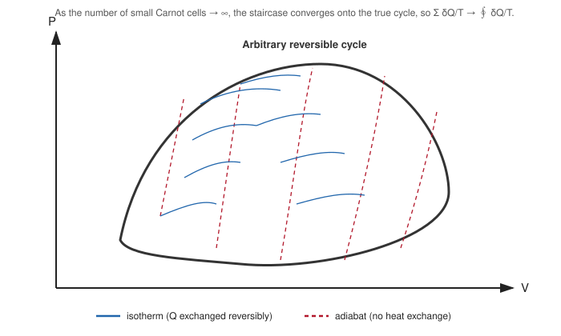

# 08. Clausius's Theorem

**Course:** PHY-103 (Physics – II) · **Unit:** Entropy
**Prerequisite:** [→ 01. Entropy](01_entropy.md), [Carnot Cycle](../thermodynamics/Thermodynamics_os.md#part-xiv--carnot-cycle) (Thermodynamics unit)
**Leads to:** [→ 09. Clausius–Clapeyron Equation](09_clausius_clapeyron_equation.md)

---

## 1. Overview

Every result in this unit so far — the definition of entropy (Topic 01), the Clausius inequality (Topic 02), the entropy statement of the second law (Topic 03), and path-independence (Topic 07) — was *asserted* to follow from Clausius's theorem: $\oint \delta Q_{\text{rev}}/T = 0$ for any reversible cycle. This topic finally proves that theorem, by decomposing an arbitrary reversible cycle into infinitesimally many Carnot cycles and applying the already-established Carnot efficiency result. This is the foundational derivation the rest of the unit has been building toward.

## 2. Definitions & Key Terms

1. **Clausius's theorem** — *for any reversible cyclic process, $\displaystyle\oint\frac{\delta Q_{\text{rev}}}{T}=0$; more generally, for any cycle (reversible or not), $\displaystyle\oint\frac{\delta Q}{T}\leq0$.*
   > Plain-English: sum up "heat exchanged divided by temperature" all the way around any closed cycle, and for an ideal (reversible) cycle it always comes out to exactly zero.
2. **Adiabat** — *a curve on a $P$–$V$ (or similar) diagram representing a reversible adiabatic process ($\delta Q=0$).*
   > Plain-English: a path along which no heat is exchanged at all.
3. **Isotherm** — *a curve representing a process at constant temperature.*

## 3. Core Content

**1. Plain-word statement.** Any reversible cyclic process, however complicated its shape on a $P$–$V$ diagram, can be approximated arbitrarily closely by a large number of tiny Carnot cycles stitched together; since each individual Carnot cycle satisfies $\delta Q_H/T_H = \delta Q_C/T_C$ exactly, summing this relation over all the tiny cycles and taking the limit of infinitely many, infinitesimally small cycles gives $\oint \delta Q_{\text{rev}}/T=0$ for the original arbitrary cycle.

**2. Experimental/theoretical basis.** This proof relies entirely on the Carnot engine result — that $Q_C/Q_H=T_C/T_H$ for *any* reversible engine operating between two fixed reservoirs — established via the Carnot cycle analysis in the [Thermodynamics unit](../thermodynamics/Thermodynamics_os.md#part-xiv--carnot-cycle).

**3. Full derivation — decomposition into infinitesimal Carnot cycles.**

Step 1: Consider an arbitrary reversible cyclic process, represented as a closed curve on a $P$–$V$ diagram. Draw a dense family of adiabats crossing the interior of this cycle, dividing it into many thin vertical "slices."

Step 2: Within each thin slice, connect the two adiabats with two short isothermal segments (at the local temperatures $T$ and $T+dT$ found where the adiabats meet the actual cycle boundary), forming a small Carnot cycle. As the number of slices $\to\infty$ (each becoming infinitesimally thin), the zig-zag staircase of these small Carnot cycles approximates the original arbitrary cycle arbitrarily well — the curved boundary segments not covered by isotherms/adiabats vanish in this limit (their net heat contribution $\to0$ as the slice width $\to0$, since heat exchanged along a segment scales with its length while the mismatch scales faster).

Step 3: For each individual small Carnot cycle $i$, operating between local hot temperature $T_{H,i}$ and cold temperature $T_{C,i}$, the Carnot result (Thermodynamics unit) gives:
$$\frac{\delta Q_{H,i}}{T_{H,i}} = \frac{\delta Q_{C,i}}{T_{C,i}} \quad\Longrightarrow\quad \frac{\delta Q_{H,i}}{T_{H,i}} - \frac{\delta Q_{C,i}}{T_{C,i}} = 0$$

Step 4: Sum this relation over all $N$ small Carnot cycles making up the decomposition:
$$\sum_{i=1}^{N}\left(\frac{\delta Q_{H,i}}{T_{H,i}} - \frac{\delta Q_{C,i}}{T_{C,i}}\right) = 0$$

Step 5: Each term $\delta Q_{H,i}/T_{H,i}$ or $-\delta Q_{C,i}/T_{C,i}$ is exactly the "$\delta Q/T$" contribution of one small isothermal leg of the original cycle (with appropriate sign for heat absorbed vs. rejected). As $N\to\infty$ (slices $\to0$ width), this sum becomes precisely the line integral around the original arbitrary reversible cycle:
$$\lim_{N\to\infty}\sum_{i=1}^{N}\left(\frac{\delta Q_{H,i}}{T_{H,i}}-\frac{\delta Q_{C,i}}{T_{C,i}}\right) = \oint\frac{\delta Q_{\text{rev}}}{T}$$

Step 6: Since the left side is exactly zero (Step 4) at every finite $N$, and remains zero in the limit:
$$\boxed{\oint\frac{\delta Q_{\text{rev}}}{T} = 0 \quad\text{(reversible cycle)}}$$

**General (irreversible) extension.** If any leg of the cycle is irreversible, that leg's actual efficiency is strictly less than the corresponding Carnot efficiency between the same two local temperatures (Carnot's theorem, [Thermodynamics unit, Part XVI](../thermodynamics/Thermodynamics_os.md#part-xvi--carnots-theorem)), so the corresponding small-cycle relation becomes an inequality rather than equality, $\delta Q_{H,i}/T_{H,i} - \delta Q_{C,i}/T_{C,i} \leq 0$, and summing gives the general form:
$$\boxed{\oint\frac{\delta Q}{T} \leq 0 \quad\text{(any cycle)}}$$
with equality iff the entire cycle is reversible — this is exactly the general statement used to derive the Clausius inequality in [Topic 02](02_change_of_entropy_reversible_irreversible.md).

**4. Symbols (SI units).** Same as previous topics: $Q$ (J), $T$ (K).

**5. Limits of validity.** The decomposition argument assumes the cycle can be covered by a dense, well-behaved family of adiabats and isotherms (true for any smooth thermodynamic cycle of a simple compressible substance); it does not require the substance to be an ideal gas — the Carnot efficiency result used in Step 3 is completely general for any working substance.

**6. Convention conflicts.**
> ⚠️ Convention: some texts present Clausius's theorem as a postulate/definition rather than proving it from the Carnot decomposition shown here; this unit follows the derivation-first convention of the rest of the repository and proves it explicitly, since the decomposition argument is the standard, examinable proof at this level.

## 4. Worked Examples

### Example 1 — 🟢 Foundational

A reversible cycle is decomposed into $3$ small Carnot cycles with $(Q_{H,i}, T_{H,i}, T_{C,i})$ given by: (500 J, 600 K, 400 K), (300 J, 500 K, 350 K), (200 J, 450 K, 300 K). Verify $\delta Q_{H,i}/T_{H,i} = \delta Q_{C,i}/T_{C,i}$ for the first cycle, i.e. find $Q_{C,1}$.

**Solution**

Step 1: Carnot relation: $Q_{C,1}/Q_{H,1} = T_{C,1}/T_{H,1}$.

Step 2: $Q_{C,1} = Q_{H,1}(T_{C,1}/T_{H,1}) = 500(400/600) = 333.3\ \text{J}$.

Step 3: Check: $Q_{H,1}/T_{H,1} = 500/600=0.833$; $Q_{C,1}/T_{C,1}=333.3/400=0.833$ ✓ equal.

**Answer:** $\boxed{Q_{C,1} = 333.3\ \text{J}}$, confirming $\delta Q_{H,1}/T_{H,1}=\delta Q_{C,1}/T_{C,1}$ exactly.

### Example 2 — 🟡 Intermediate

For the three small Carnot cycles of Example 1, find $Q_{C,i}$ for all three, then confirm that $\sum_i (Q_{H,i}/T_{H,i} - Q_{C,i}/T_{C,i}) = 0$, illustrating Core Content Step 4.

**Solution**

Step 1: Cycle 1 (from Example 1): $Q_{C,1}=333.3\ \text{J}$; $Q_{H,1}/T_{H,1}-Q_{C,1}/T_{C,1} = 0.833-0.833=0$.

Step 2: Cycle 2: $Q_{C,2} = 300(350/500)=210\ \text{J}$; $300/500 - 210/350 = 0.600-0.600=0$.

Step 3: Cycle 3: $Q_{C,3} = 200(300/450)=133.3\ \text{J}$; $200/450 - 133.3/300 = 0.444-0.444=0$.

Step 4: Sum over all three: $0+0+0=0$.

**Answer:** $\boxed{\sum_i\left(\dfrac{Q_{H,i}}{T_{H,i}}-\dfrac{Q_{C,i}}{T_{C,i}}\right)=0}$, exactly as Core Content Step 4 requires — each term vanishes individually (Carnot relation), so the sum trivially vanishes too, and this remains true as the number of such small cycles is increased without bound.

### Example 3 — 🔴 Advanced / Exam-level

Suppose one of the three small Carnot cycles in Examples 1–2 (say cycle 2) is actually **irreversible** and rejects $Q_{C,2}=230\ \text{J}$ instead of the reversible value $210\ \text{J}$ found above (holding $Q_{H,2}=300\ \text{J}$, $T_{H,2}=500\ \text{K}$, $T_{C,2}=350\ \text{K}$ fixed). Recompute $\sum_i(Q_{H,i}/T_{H,i}-Q_{C,i}/T_{C,i})$ and confirm it is now negative, consistent with the general (irreversible) form of Clausius's theorem.

**Solution**

Step 1: Cycles 1 and 3 are unchanged (still reversible): contributions $0$ and $0$ respectively (from Example 2).

Step 2: Cycle 2 (now irreversible): $Q_{H,2}/T_{H,2}-Q_{C,2}/T_{C,2} = 300/500 - 230/350 = 0.600-0.657=-0.057$.

Step 3: Total: $0+(-0.057)+0=-0.057$.

**Answer:** $\boxed{\sum_i\left(\dfrac{Q_{H,i}}{T_{H,i}}-\dfrac{Q_{C,i}}{T_{C,i}}\right)=-0.057 < 0}$, confirming $\oint\delta Q/T\leq0$ for a cycle containing an irreversible leg — the irreversible cycle rejects *more* heat to the cold reservoir than the reversible minimum, making its $Q_C/T_C$ term larger and the overall sum negative, exactly as the general form of Clausius's theorem (Core Content, "General (irreversible) extension") predicts.

## 5. Applications

1. **Justifying the existence of entropy tables** — Clausius's theorem is the rigorous reason why tabulated entropy values (used throughout engineering thermodynamics for steam, refrigerants, etc.) are self-consistent state functions, rather than depending on which reference process was used to measure them.
2. **Cycle-efficiency auditing in industrial plants** — engineers use the *inequality* form ($\oint\delta Q/T\leq0$, with the gap from zero quantifying total irreversibility) to audit how far a real industrial cycle falls short of the reversible ideal.

## 6. Diagram / Visual

*Figure 1: As the number of small Carnot cycles increases (each becoming infinitesimally thin), the zig-zag staircase converges to the original arbitrary cycle, and $\oint\delta Q_{\text{rev}}/T=0$ follows from summing the exact Carnot relation over every small cycle.*

## 7. Common Mistakes

- ❌ **Mistake:** Thinking Clausius's theorem only applies to cycles made of literal Carnot (two-isotherm, two-adiabat) legs.
  ✅ **Correct:** It applies to *any* smooth reversible cycle — the Carnot-cycle decomposition is a proof technique (approximating the arbitrary cycle), not a restriction on which cycles the theorem covers.

- ❌ **Mistake:** Applying the equality $\oint\delta Q/T=0$ to a cycle that contains any irreversible leg.
  ✅ **Correct:** Use the inequality $\oint\delta Q/T\leq0$ whenever any part of the cycle is irreversible; equality is reserved strictly for fully reversible cycles.

- ❌ **Mistake:** Forgetting that the decomposition requires temperatures $T_{H,i},T_{C,i}$ to be *local* (evaluated at each thin slice), not the overall maximum/minimum temperature of the whole cycle.
  ✅ **Correct:** Each small Carnot cycle uses its own local hot/cold temperatures where the adiabats meet the actual cycle boundary at that slice.

- ❌ **Mistake:** Treating Clausius's theorem and the definition of entropy as two independent facts to memorize separately.
  ✅ **Correct:** The definition of entropy in [Topic 01](01_entropy.md) is a direct logical *consequence* of this theorem — the theorem is proved first (this topic, using Carnot's result), and the state-function definition of $S$ follows from it, not the other way around.

## 8. Practice Problems

**Problem 1:** A small Carnot cycle absorbs $Q_H=800\ \text{J}$ at $T_H=700\ \text{K}$ and is reversible, rejecting heat at $T_C=350\ \text{K}$. Find $Q_C$ and verify $Q_H/T_H=Q_C/T_C$.

Solution

$Q_C = Q_H(T_C/T_H) = 800(350/700)=400\ \text{J}$

$Q_H/T_H = 800/700=1.143$; $Q_C/T_C=400/350=1.143$ ✓ equal.

$$\text{Answer: } Q_C = 400\ \text{J, confirming the Carnot relation.}$$

**Problem 2:** Explain briefly why the curved (non-adiabat, non-isotherm) boundary segments of an arbitrary cycle contribute negligibly to $\oint\delta Q/T$ in the limit of infinitely many decomposition slices.

Solution

As the slice width shrinks, the mismatch between the actual curved boundary and the adiabat/isotherm staircase approximating it shrinks even faster (the area/heat mismatch scales with the square of the slice width, while the number of slices only grows linearly), so the total error contribution vanishes in the limit of infinitely many infinitesimally thin slices — a standard argument in the calculus of such Riemann-sum-like decompositions.

**Problem 3:** Four small Carnot cycles, all reversible, have $(Q_{H,i}/T_{H,i})$ values: $0.5, 0.3, 0.7, 0.2$ (all in J/K). Find $\sum_i Q_{C,i}/T_{C,i}$.

Solution

Since each cycle is reversible, $Q_{C,i}/T_{C,i}=Q_{H,i}/T_{H,i}$ individually, so the sum equals $0.5+0.3+0.7+0.2=1.7\ \text{J/K}$.

$$\text{Answer: } \sum_i Q_{C,i}/T_{C,i} = 1.7\ \text{J/K}$$

**Problem 4 (exam-style, multi-step):** Outline the full six-step proof of Clausius's theorem (Core Content) in your own words, in no more than six sentences, explicitly stating which prior result (from the Thermodynamics unit) the proof depends on.

Solution

An arbitrary reversible cycle is covered by a dense grid of adiabats and isotherms, dividing it into many thin slices, each closed off into a small Carnot cycle. As the number of slices grows without bound, this staircase of small cycles approximates the original cycle arbitrarily closely. Each small Carnot cycle satisfies $Q_{H,i}/T_{H,i}=Q_{C,i}/T_{C,i}$ exactly, by the Carnot-cycle efficiency result proved in the Thermodynamics unit (Part XIV). Summing $(Q_{H,i}/T_{H,i}-Q_{C,i}/T_{C,i})=0$ over all the small cycles gives zero at every stage. Taking the limit of infinitely many, infinitesimally thin slices turns this sum into the line integral $\oint\delta Q_{\text{rev}}/T$ around the original cycle. Since the sum is zero at every finite stage and the boundary-mismatch error vanishes in the limit, $\oint\delta Q_{\text{rev}}/T=0$ for the original arbitrary reversible cycle.

$$\text{Answer: proof rests on the Carnot-cycle efficiency relation, } Q_C/Q_H=T_C/T_H \text{ (Thermodynamics unit, Part XIV).}$$

## 9. Summary

| Concept | Result | Condition / Limit |
|---|---|---|
| Clausius's theorem (reversible) | $\oint \delta Q_{\text{rev}}/T = 0$ | Any reversible cycle |
| Clausius's theorem (general) | $\oint \delta Q/T \leq 0$ | Any cycle; equality iff reversible |
| Proof technique | Decomposition into infinitesimal Carnot cycles | Relies on the Carnot efficiency relation |
| Consequence | Entropy is a state function (Topic 01); Clausius inequality (Topic 02) | Direct logical consequences of this theorem |

Having proved the theorem underlying entropy's very definition, the unit closes with one major practical application: deriving the Clausius–Clapeyron equation for phase-boundary slopes from the entropy of phase transitions.

## 10. References

1. **Halliday, Resnick & Walker, *Fundamentals of Physics*, 10th ed., Wiley** — Ch. 20, Carnot-cycle-decomposition proof of Clausius's theorem.
2. **Serway & Jewett, *Physics for Scientists and Engineers*, 9th ed., Cengage** — Ch. 22, entropy defined via Clausius's theorem.
3. **HyperPhysics — Clausius's Theorem** — summary and Carnot-decomposition sketch. [hyperphysics.phy-astr.gsu.edu](http://hyperphysics.phy-astr.gsu.edu/hbase/thermo/entrop.html)
4. **MIT OCW 8.044** — rigorous derivation of Clausius's theorem from the Carnot cycle.
