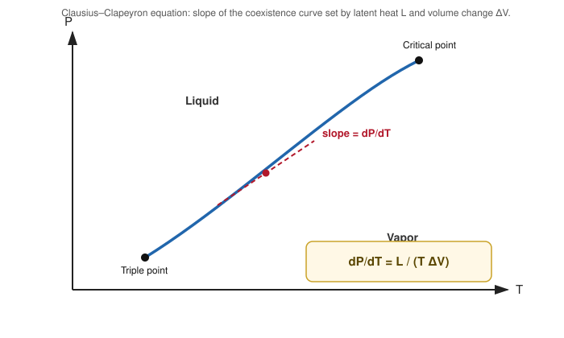

# 09. Clausius–Clapeyron Equation (First Latent Heat Equation)

**Course:** PHY-103 (Physics – II) · **Unit:** Entropy
**Prerequisite:** [→ 08. Clausius's Theorem](08_clausius_theorem.md), [Carnot Cycle](../thermodynamics/Thermodynamics_os.md#part-xiv--carnot-cycle) (Thermodynamics unit)
**Leads to:** (unit capstone — no further topic in this unit)

---

## 1. Overview

This final topic applies the entropy machinery built throughout the unit — specifically, the entropy of a phase transition, $\Delta S_{\text{transition}}=\Delta H_{\text{transition}}/T_{\text{transition}}$ (noted in [Topic 02](02_change_of_entropy_reversible_irreversible.md) and [Part XVII of the Thermodynamics unit](../thermodynamics/Thermodynamics_os.md#38-entropy-change)) — to derive one of the most practically important results in this unit: the slope of a phase boundary (e.g. the liquid–vapor coexistence curve on a $P$–$T$ diagram) in terms of the latent heat of transition. This is historically also called the **first latent heat equation**, and it connects the entropy concepts of this unit directly back to the [Carnot cycle](../thermodynamics/Thermodynamics_os.md#part-xiv--carnot-cycle) analysis from the Thermodynamics unit.

## 2. Definitions & Key Terms

1. **Phase boundary / coexistence curve** — *the curve on a $P$–$T$ diagram along which two phases (e.g. liquid and vapor) coexist in equilibrium.*
   > Plain-English: the line that tells you, for any pressure, exactly what temperature something boils (or melts, or sublimes) at.
2. **Latent heat ($L$)** — *the heat absorbed or released per unit mass (or per mole) during a phase transition at constant temperature and pressure.*
   > Plain-English: the extra heat needed to change phase, over and above just changing temperature.
3. **Clausius–Clapeyron equation** — *$\dfrac{dP}{dT} = \dfrac{L}{T\Delta V}$, giving the slope of the phase boundary in terms of the latent heat and the volume change of the transition.*

## 3. Core Content

**1. Plain-word statement.** The slope of a phase boundary (how much the equilibrium pressure must change per unit change in transition temperature, or vice versa) is set entirely by the latent heat of the transition and the volume change between the two phases, at the transition temperature.

**2. Experimental/theoretical basis.** The derivation combines a Carnot-cycle argument (treating the phase transition itself as a constant-temperature heat-absorption step of a tiny Carnot cycle) with the entropy-of-transition result $\Delta S=L/T$, both already established in this unit and the Thermodynamics unit.

**3. Full derivation — via a Carnot-cycle argument.**

Step 1: Consider $1$ mole of substance undergoing a phase transition (e.g. liquid $\to$ vapor) at temperature $T$ and pressure $P$ (a point on the coexistence curve), absorbing latent heat $L$ and changing volume by $\Delta V = V_{\text{vapor}}-V_{\text{liquid}}$.

Step 2: Construct an infinitesimal Carnot cycle using this phase transition as its isothermal-heat-absorption leg: (a) isothermal vaporization at $T$, absorbing $L$ and expanding by $\Delta V$; (b) a small adiabatic expansion, cooling by $dT$; (c) isothermal condensation at $T-dT$, releasing heat and contracting by $\Delta V$ (approximately, for small $dT$); (d) a small adiabatic compression back to the start.

Step 3: The work done in this small Carnot cycle equals the area enclosed on a $P$–$V$ diagram, which for a thin cycle bounded by two nearly-horizontal isothermal legs (at $P$ and $P-dP$, corresponding to $T$ and $T-dT$) and volume change $\Delta V$ is:
$$dW = dP\cdot\Delta V$$

Step 4: The Carnot efficiency of this small cycle is $\eta_C = dT/T$ (operating between $T$ and $T-dT$), so the work done also equals:
$$dW = \eta_C\cdot L = \frac{dT}{T}\cdot L$$

Step 5: Equate the two expressions for $dW$ (Steps 3 and 4):
$$dP\cdot\Delta V = \frac{L\,dT}{T}$$

Step 6: Rearranging:
$$\boxed{\frac{dP}{dT} = \frac{L}{T\Delta V}}$$

**Equivalent derivation, via entropy of transition (cross-check).**

Step 1: The entropy change of the transition is $\Delta S = L/T$ (Topic 02, phase-transition special case).

Step 2: Along the coexistence curve, the Gibbs free energies of the two phases are equal at every point (equilibrium condition, from the Thermodynamics unit's thermodynamic-potentials treatment): $G_{\text{liquid}}=G_{\text{vapor}}$, and this equality must be preserved under a small displacement $(dT,dP)$ along the curve, giving $dG_{\text{liquid}}=dG_{\text{vapor}}$.

Step 3: Using $dG=-S\,dT+V\,dP$ for each phase: $-S_{\text{liquid}}dT+V_{\text{liquid}}dP = -S_{\text{vapor}}dT+V_{\text{vapor}}dP$.

Step 4: Rearranging: $(S_{\text{vapor}}-S_{\text{liquid}})dT = (V_{\text{vapor}}-V_{\text{liquid}})dP$, i.e. $\Delta S\,dT = \Delta V\,dP$.

Step 5: So $\dfrac{dP}{dT} = \dfrac{\Delta S}{\Delta V} = \dfrac{L/T}{\Delta V} = \dfrac{L}{T\Delta V}$ — identical to the Carnot-cycle result of Step 6 above, confirming consistency between the two derivation routes.

**4. Symbols (SI units).**

| Symbol | Meaning | SI unit |
|---|---|---|
| $P$ | equilibrium (coexistence) pressure | Pa |
| $T$ | transition temperature | K |
| $L$ | latent heat (per mole or per unit mass, consistent with $\Delta V$) | J/mol or J/kg |
| $\Delta V$ | volume change of the transition | m³/mol or m³/kg |
| $dP/dT$ | slope of the phase boundary | Pa/K |

**5. Limits of validity.** The derivation assumes the transition occurs at a well-defined, sharp $(P,T)$ (true away from the critical point); very close to the critical point, $\Delta V\to0$ and the naive slope diverges, requiring more careful treatment beyond this course. For sublimation/solid–liquid boundaries the same formula applies with the appropriate $L$ and $\Delta V$ for that transition.

**6. Convention conflicts.**
> ⚠️ Convention: for the solid–liquid (melting) boundary, some substances (famously water) have $\Delta V<0$ (ice is less dense than liquid water), giving $dP/dT<0$ — a negatively sloped melting curve. This is a real physical feature captured correctly by the formula, not an error; always determine the sign of $\Delta V$ from the actual densities of the two phases rather than assuming $\Delta V>0$.

**Approximation for vapor-pressure curves (liquid–vapor, away from the critical point).** Since $V_{\text{vapor}}\gg V_{\text{liquid}}$, one often approximates $\Delta V\approx V_{\text{vapor}}$, and if the vapor also behaves as an ideal gas, $V_{\text{vapor}}=RT/P$ (per mole), giving:
$$\frac{dP}{dT} = \frac{LP}{RT^2} \quad\Longrightarrow\quad \frac{d(\ln P)}{dT} = \frac{L}{RT^2}$$
which integrates (treating $L$ as constant over a modest range) to the commonly used exponential form $P = P_0\exp\left[-\dfrac{L}{R}\left(\dfrac1T-\dfrac1{T_0}\right)\right]$.

## 4. Worked Examples

### Example 1 — 🟢 Foundational

Water boils at $T=373\ \text{K}$ under $P=1.013\times10^5\ \text{Pa}$, with latent heat of vaporization $L=2.26\times10^6\ \text{J/kg}$ and $\Delta V = 1.673\ \text{m}^3/\text{kg}$ (specific volume change, liquid to vapor). Find $dP/dT$.

**Solution**

Step 1: $\dfrac{dP}{dT} = \dfrac{L}{T\Delta V} = \dfrac{2.26\times10^6}{(373)(1.673)}$.

Step 2: Denominator: $373\times1.673=624.0$.

Step 3: $\dfrac{dP}{dT} = \dfrac{2.26\times10^6}{624.0} = 3621\ \text{Pa/K}$.

**Answer:** $\boxed{dP/dT \approx 3.62\times10^3\ \text{Pa/K}}$ — i.e. the boiling pressure rises by about $3.6\ \text{kPa}$ for every $1\ \text{K}$ rise in boiling temperature, near $100\,^\circ\text{C}$.

### Example 2 — 🟡 Intermediate

Using the result of Example 1, estimate the boiling point shift of water when the pressure changes from $1.013\times10^5\ \text{Pa}$ (sea level) to $0.8\times10^5\ \text{Pa}$ (moderate altitude), treating $dP/dT$ as approximately constant over this small range.

**Solution**

Step 1: $\Delta P = (0.8-1.013)\times10^5 = -0.213\times10^5 = -2.13\times10^4\ \text{Pa}$.

Step 2: Using $\Delta T \approx \Delta P / (dP/dT) = \dfrac{-2.13\times10^4}{3621}$.

Step 3: $\Delta T \approx -5.88\ \text{K}$.

**Answer:** $\boxed{\Delta T \approx -5.9\ \text{K}}$ — water boils about $6$ degrees cooler at this reduced (moderate-altitude) pressure, consistent with everyday experience of longer cooking times at altitude.

### Example 3 — 🔴 Advanced / Exam-level

Derive the approximate exponential vapor-pressure form $P=P_0\exp\left[-\dfrac{L}{R}\left(\dfrac1T-\dfrac1{T_0}\right)\right]$ starting from $d(\ln P)/dT = L/(RT^2)$ (treating molar $L$ and $R$ as constants), and use it to estimate the boiling pressure of water at $T=363\ \text{K}$ given $P_0=1.013\times10^5\ \text{Pa}$ at $T_0=373\ \text{K}$ and molar $L=4.06\times10^4\ \text{J/mol}$.

**Solution**

Step 1: Separate variables: $d(\ln P) = \dfrac{L}{R}\dfrac{dT}{T^2}$.

Step 2: Integrate both sides from $(T_0,P_0)$ to $(T,P)$, treating $L$ as constant:
$$\ln P - \ln P_0 = \frac{L}{R}\int_{T_0}^{T}\frac{dT'}{T'^2} = \frac{L}{R}\left[-\frac1{T'}\right]_{T_0}^{T} = \frac{L}{R}\left(\frac1{T_0}-\frac1T\right)$$

Step 3: So $\ln(P/P_0) = -\dfrac{L}{R}\left(\dfrac1T-\dfrac1{T_0}\right)$, giving $P=P_0\exp\left[-\dfrac{L}{R}\left(\dfrac1T-\dfrac1{T_0}\right)\right]$, as required.

Step 4: Substitute $T=363\ \text{K}$, $T_0=373\ \text{K}$: $\dfrac1T-\dfrac1{T_0} = \dfrac1{363}-\dfrac1{373} = 0.002755-0.002681=7.4\times10^{-5}\ \text{K}^{-1}$.

Step 5: Exponent: $-\dfrac{L}{R}\times7.4\times10^{-5} = -\dfrac{4.06\times10^4}{8.314}\times7.4\times10^{-5} = -(4884)(7.4\times10^{-5}) = -0.3614$.

Step 6: $P = (1.013\times10^5)e^{-0.3614} = (1.013\times10^5)(0.6967) = 7.06\times10^4\ \text{Pa}$.

**Answer:** $\boxed{P(363\ \text{K}) \approx 7.06\times10^4\ \text{Pa}}$ — noticeably below atmospheric pressure, consistent with water boiling at $363\ \text{K}$ ($90\,^\circ\text{C}$) only at reduced (sub-atmospheric) pressure, matching the altitude-boiling intuition of Example 2 in the opposite direction.

## 5. Applications

1. **Pressure cookers and altitude cooking** — the Clausius–Clapeyron equation is the exact physical basis for why raising pressure (pressure cookers) raises boiling temperature and speeds cooking, while high-altitude locations (lower atmospheric pressure) have water boiling well below $100\,^\circ\text{C}$.
2. **Refrigerant selection in HVAC/refrigeration engineering** — the vapor-pressure curve (governed by this equation) of candidate refrigerants determines the pressures a compressor must handle at given operating temperatures, a central design constraint in refrigeration-cycle engineering.

## 6. Diagram / Visual

*Figure 1: The slope of the coexistence curve at any point equals $L/(T\Delta V)$ — steeper where the latent heat is large relative to the volume change, at that transition temperature.*

## 7. Common Mistakes

- ❌ **Mistake:** Assuming $\Delta V$ is always positive (vapor/gas phase always has larger volume).
  ✅ **Correct:** For most substances $\Delta V>0$ for melting, but water is a famous exception ($\Delta V<0$ for melting, since ice is less dense than liquid water), giving a negative $dP/dT$ for its solid–liquid boundary.

- ❌ **Mistake:** Using the simplified exponential vapor-pressure formula (Example 3) far from the reference point $T_0$, where $L$ can no longer be treated as constant.
  ✅ **Correct:** The exponential approximation is only valid over a modest temperature range where $L$ doesn't vary much; for wide ranges, $L(T)$ must be included inside the integral.

- ❌ **Mistake:** Confusing the "first latent heat equation" (Clausius–Clapeyron, this topic) with unrelated "latent heat" formulas like $Q=mL$ (heat absorbed during a phase change at fixed $T,P$, covered in the Kinetic Theory of Gases unit).
  ✅ **Correct:** $Q=mL$ gives the *amount* of heat for a phase change at fixed conditions; Clausius–Clapeyron gives how the *equilibrium pressure/temperature relationship itself* changes — two related but distinct pieces of information.

- ❌ **Mistake:** Applying $dP/dT=L/(T\Delta V)$ with mismatched units (molar $L$ with per-unit-mass $\Delta V$, or vice versa).
  ✅ **Correct:** $L$ and $\Delta V$ must both be expressed per the same amount of substance (both per mole, or both per unit mass) for the formula to give correct units of Pa/K.

## 8. Practice Problems

**Problem 1:** A substance transitions at $T=250\ \text{K}$ with $L=3.0\times10^4\ \text{J/mol}$ and $\Delta V = 2.5\times10^{-3}\ \text{m}^3/\text{mol}$. Find $dP/dT$.

Solution

$dP/dT = L/(T\Delta V) = (3.0\times10^4)/[(250)(2.5\times10^{-3})] = (3.0\times10^4)/(0.625) = 4.8\times10^4\ \text{Pa/K}$

$$\text{Answer: } dP/dT = 4.8\times10^4\ \text{Pa/K}$$

**Problem 2:** For water's melting curve near $273\ \text{K}$, $L_{\text{fusion}}=3.34\times10^5\ \text{J/kg}$ and $\Delta V = -9.05\times10^{-5}\ \text{m}^3/\text{kg}$ (ice minus liquid, negative since ice expands). Find $dP/dT$ and interpret its sign.

Solution

$dP/dT = L/(T\Delta V) = (3.34\times10^5)/[(273)(-9.05\times10^{-5})] = (3.34\times10^5)/(-0.0247) = -1.35\times10^7\ \text{Pa/K}$

Negative slope: increasing pressure *lowers* the melting point of ice — this is why ice melts under the increased pressure beneath an ice skate's blade (a commonly cited, if slightly oversimplified, illustration of this negative slope).

$$\text{Answer: } dP/dT \approx -1.35\times10^7\ \text{Pa/K, negative as expected for water's anomalous melting curve.}$$

**Problem 3:** Using the formula $dP/dT = L/(T\Delta V)$, find $\Delta V$ for a substance transitioning at $T=350\ \text{K}$ with $L=4.5\times10^4\ \text{J/mol}$ and a measured slope $dP/dT = 2.0\times10^3\ \text{Pa/K}$.

Solution

$\Delta V = \dfrac{L}{T(dP/dT)} = \dfrac{4.5\times10^4}{(350)(2.0\times10^3)} = \dfrac{4.5\times10^4}{7.0\times10^5} = 0.0643\ \text{m}^3/\text{mol}$

$$\text{Answer: } \Delta V \approx 6.43\times10^{-2}\ \text{m}^3/\text{mol}$$

**Problem 4 (exam-style, multi-step):** Water's normal boiling point is $373\ \text{K}$ at $1.013\times10^5\ \text{Pa}$, with molar latent heat $L=4.06\times10^4\ \text{J/mol}$. (a) Using the exponential (integrated) form, estimate the pressure at which water would boil at $T=383\ \text{K}$ ($110\,^\circ\text{C}$). (b) State one real-world device that exploits this relationship.

Solution

**(a)** $\dfrac1{T}-\dfrac1{T_0} = \dfrac1{383}-\dfrac1{373} = 0.002611-0.002681=-7.0\times10^{-5}\ \text{K}^{-1}$

Exponent: $-\dfrac{L}{R}\left(\dfrac1T-\dfrac1{T_0}\right) = -\dfrac{4.06\times10^4}{8.314}\times(-7.0\times10^{-5}) = -(4884)(-7.0\times10^{-5})=0.3419$

$P = P_0e^{0.3419} = (1.013\times10^5)(1.4076) = 1.426\times10^5\ \text{Pa}$

**(b)** A pressure cooker: sealing the pot lets internal pressure rise above atmospheric, which (per this result) raises the boiling point of water inside, letting food cook faster at temperatures above $100\,^\circ\text{C}$.

$$\text{Answer: } P(383\ \text{K}) \approx 1.43\times10^5\ \text{Pa; pressure cookers exploit exactly this pressure–boiling-point relationship.}$$

## 9. Summary

| Concept | Result | Condition / Limit |
|---|---|---|
| Clausius–Clapeyron equation | $dP/dT = L/(T\Delta V)$ | Any first-order phase transition, exact at each $(P,T)$ on the boundary |
| Vapor-pressure approximation | $\ln(P/P_0) = -\dfrac{L}{R}\left(\dfrac1T-\dfrac1{T_0}\right)$ | Ideal-gas vapor, $\Delta V\approx V_{\text{vapor}}$, $L$ ~constant |
| Water's anomalous melting curve | $dP/dT < 0$ | $\Delta V<0$ (ice less dense than liquid water) |
| Physical meaning | Slope of the phase boundary set by latent heat and volume change | Away from the critical point |

This closes the Entropy unit: from the basic Clausius definition of $S$ (Topic 01) through its statistical meaning (Topic 05), its general-gas formula and path-independence (Topics 06–07), the theorem underlying it all (Topic 08), and finally this capstone application to phase equilibrium. For the broader thermodynamic-potential context (Gibbs free energy, Maxwell relations) that this derivation leaned on, see [Part XVIII–XXI of the Thermodynamics unit](../thermodynamics/Thermodynamics_os.md#part-xviii--thermodynamic-functions).

## 10. References

1. **Halliday, Resnick & Walker, *Fundamentals of Physics*, 10th ed., Wiley** — Ch. 20/App., Clausius–Clapeyron derivation via Carnot-cycle argument.
2. **Serway & Jewett, *Physics for Scientists and Engineers*, 9th ed., Cengage** — Ch. 22, phase-equilibrium thermodynamics and latent heat.
3. **Atkins, *Physical Chemistry*, 11th ed., Oxford** — rigorous Gibbs-free-energy derivation of the Clausius–Clapeyron equation and its ideal-gas vapor-pressure approximation.
4. **HyperPhysics — Clausius–Clapeyron Equation** — summary derivation and vapor-pressure applications. [hyperphysics.phy-astr.gsu.edu](http://hyperphysics.phy-astr.gsu.edu/hbase/thermo/phase.html)
5. **MIT OCW 5.60 (Thermodynamics & Kinetics)** — lecture notes on phase equilibrium and the Clausius–Clapeyron relation.
