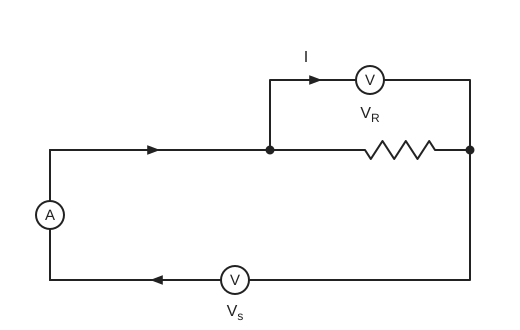
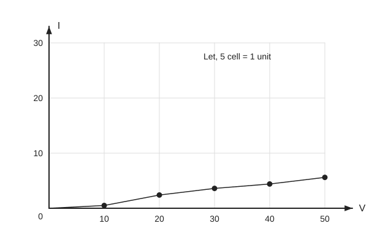

# Experiment 1 — Verification of Ohm's Law

## Aim
To verify Ohm's law by applying different voltages across a resistor, measuring voltage and current, and plotting current against voltage.

## Theory
If temperature and other physical conditions of a conductor stay unchanged, the current through it is directly proportional to the voltage between its two terminals.

$$
I \propto V \;\Rightarrow\; I = GV, \qquad G = \frac{1}{R}
$$

$$
I = \frac{V}{R} \;\Rightarrow\; R = \frac{V}{I} \qquad (1)
$$

- $G$ = conductance (constant); $R$ = resistance.
- Put $I = y$, $V = x$, $\dfrac{1}{R} = m$ in (1): $y = mx$, a straight line through the origin.
- Apply different voltages across a resistor, read $V$ (voltmeter) and $I$ (ammeter), and plot $I$ against $V$. A straight line verifies Ohm's law.
- The slope of the line is used to get $R$.

> **Source note:** the source says the slope "is calculated as $V/I$" and then "is equal to $1/R$". With $I$ on the y-axis and $V$ on the x-axis (as plotted), the slope is $\Delta I/\Delta V = 1/R$; $V/I$ would be $R$. Kept as written; the two statements are not consistent with each other.

## Principle / Law
**Ohm's law:** at constant temperature and physical conditions, current through a conductor is directly proportional to the voltage across it, $V = IR$.

## Apparatus
1. Bread board
2. Resistor
3. Variable DC power supply
4. Ammeter
5. Voltmeter
6. Connecting wires

## Diagram

*Fig. 1: Circuit diagram to verify Ohm's law.* $A$ = ammeter in the main loop; $V_R$ = voltmeter across the resistor (current $I$ marked); $V_s$ = voltmeter for the source voltage.

## Procedure
1. Connect all components on the bread board as in Fig. 1.
2. Turn on the power supply.
3. Set the DC supply voltage to zero volt.
4. Measure voltage (voltmeter) and current (ammeter).
5. Increase the supply voltage by 2 V and repeat step 4 a few times.

## Observation Table
**Table 1.** Readings of voltmeter and ammeter

| SL. No. | Source Voltage $V_s$ | Voltmeter Reading, Voltage (V) | Ammeter Reading, Current (mA) |
|:---:|:---:|:---:|:---:|
| 1 | 0 | 0 | 0 |
| 2 | 2 | | |
| 3 | 4 | | |
| 4 | 6 | | |
| 5 | 8 | | |
| 6 | 10 | | |

> **Source note:** voltmeter and ammeter cells for rows 2–6 are blank in the source (not recorded).

## Graph

- Axes as in source: $I$ on y (0–30 marked), $V$ on x (0–50 marked); note on graph: "Let, 5 cell = 1 unit".
- Five plotted points, joined by a line starting at the origin; the line is shallow and nearly straight.
- Point positions are traced from the hand-drawn graph and are approximate; the source gives no numeric values for them.

> **Source note:** the graph x-axis runs to 50 while the table's $V_s$ only goes 0–10. The source does not explain how the two scales relate; kept as written.

## Calculation
$$
R = \frac{V}{I}, \qquad \text{slope of } I\text{–}V \text{ line} = \frac{\Delta I}{\Delta V} = \frac{1}{R}
$$

Substitution and value of $R$: `[To be filled from observation]` (the source records no calculated $R$).

## Result
Ohm's law is verified because a straight line is obtained (as stated in the source).

## Precautions
1. DC voltage should be in the range 0 V to 20 V.
2. All circuit elements should be connected tightly.
3. Check the bread board, ammeter and voltmeter first.
4. Connect wires properly.
5. Take readings with great care.

## Sources of Error
- Loose connections.
- Problems in the apparatus.
- Fluctuating meter readings, so exact readings were hard to take.

## Discussion
- The V–I graph is not exactly a straight line; it deviates slightly from the ideal graph.
- The calculated error is stated to be relatively high (value not given in the source), attributed mostly to apparatus problems and loose connections.
- Voltage and current were measured with a digital multimeter, and the readings fluctuated.
