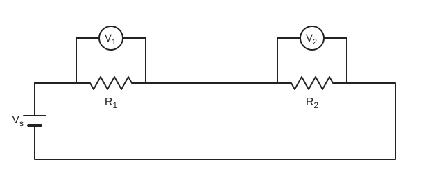

# Experiment 2 — Verification of Kirchhoff's Voltage Law (KVL)

## Aim
To verify Kirchhoff's Voltage Law in a series circuit of two resistors.

## Theory
In a series circuit (Fig. 1) the same current flows through all elements.

$$
R_T = R_1 + R_2, \qquad I = \frac{V_{supply}}{R_T}
$$

Applying KVL around the closed loop of Fig. 1:

$$
V_{supply} = V_1 + V_2, \qquad V_1 = IR_1, \quad V_2 = IR_2
$$

Voltage divider rule (VDR): the voltage across an element in a series circuit equals its resistance divided by the total resistance, times the total impressed voltage.

$$
V_1 = \frac{R_1 E}{R_T}, \qquad V_2 = \frac{R_2 E}{R_T}
$$

- $V_1, V_2$ = voltage across $R_1, R_2$; $I$ = common current.
- The source uses $V_{supply}$, $E$ and $V_s$ for the same source voltage.

## Principle / Law
**KVL:** around a closed loop, the voltage rises equal the voltage drops.

## Apparatus
1. Variable DC power supply
2. Digital multimeter
3. Analog multimeter
4. Resistances
5. Trainer board
6. Connecting wires

## Diagram

**Fig. 1:** source $V_s$ in series with $R_1$ and $R_2$; voltmeter $V_1$ across $R_1$ and voltmeter $V_2$ across $R_2$.

## Procedure
1. Construct the circuit as in Fig. 1.
2. Turn on the DC power supply and set it to 4 V, 5 V and 6 V in turn, checking with a voltmeter.
3. Measure the voltage across each resistor with the voltmeter and record it in a table.
4. Calculate $V_1, V_2$ using the voltage divider rule (VDR).

## Observation Table
| SL No | Source voltage | $V_1$ | $V_2$ | $V_1 + V_2$ |
|:---:|:---:|:---:|:---:|:---:|
| 1 | | | | |
| 2 | | | | |
| 3 | | | | |

> **Source note:** all cells are blank in the source. Values of $R_1$, $R_2$ and units are not recorded either.

## Calculation
$$
V_1 = \frac{R_1 V_s}{R_1 + R_2}, \qquad V_2 = \frac{R_2 V_s}{R_1 + R_2}, \qquad \text{check: } V_1 + V_2 = V_s
$$

Substitution and results: `[To be filled from observation]`

## Result
KVL is verified (as stated in the source; no readings are recorded in the source to support it).

## Precautions
1. DC voltage should be in the range 0 V to 20 V.
2. All circuit elements should be connected tightly.
3. Take readings with great care.
4. Connect wires properly.

## Sources of Error
> Not listed in the source. The points below are general, textbook-standard error sources for a series-circuit KVL experiment, not values or observations from your notebook.

- Contact/lead resistance at connection points adds small unaccounted voltage drops.
- Resistor tolerance — the actual resistance of $R_1$, $R_2$ can differ from the marked/nominal value.
- Multimeter accuracy and internal resistance (a voltmeter isn't truly ideal/infinite-resistance).
- Voltage supply drift while switching between 4 V, 5 V, 6 V settings.
- Loose or corroded connections on the trainer board.
