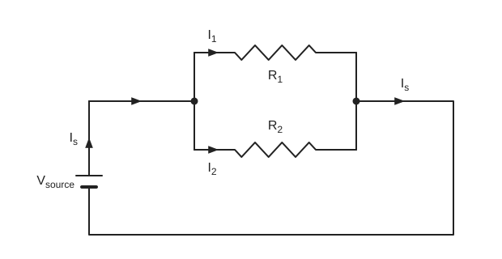

# Experiment 3 — Verification of Kirchhoff's Current Law (KCL)

## Aim
To verify Kirchhoff's Current Law in a parallel circuit of two resistors.

## Theory
In a parallel circuit (Fig. 1) the voltage across the parallel elements is the same. Total (equivalent) resistance:

$$
\frac{1}{R_T} = \frac{1}{R_1} + \frac{1}{R_2} + \frac{1}{R_3} + \frac{1}{R_4} + \cdots + \frac{1}{R_N}
$$

For only two resistors in parallel:

$$
R_{eq} = \frac{R_1 R_2}{R_1 + R_2}
$$

The total resistance is always less than the smallest resistor of the parallel network. For $N$ equal resistors $R$ the current divides equally and

$$
R_T = \frac{R}{N}
$$

KCL for the network of Fig. 1:

$$
I_T = I_1 + I_2 + I_3 + I_4 + \cdots + I_N
$$

Current divider rule (CDR) for two parallel resistors:

$$
I_1 = \frac{R_2 \, I_T}{R_1 + R_2}, \qquad I_2 = \frac{R_1 \, I_{z}}{R_1 + R_2}
$$

> **Source note:** in the $I_2$ formula the symbol in the numerator is written like $I_z$ in the source (probably $I_T$, as in the $I_1$ formula). Kept as written; original is unclear here.

## Principle / Law
**KCL:** the current entering a node equals the current leaving that node.

## Apparatus
1. Variable DC power supply
2. Digital multimeter
3. Analog multimeter
4. Resistors
5. Trainer board
6. Connecting wires

## Diagram

*Fig. 1: source $V_{source}$ feeding $R_1$ and $R_2$ in parallel.* Source current $I_s$ splits into $I_1$ (through $R_1$) and $I_2$ (through $R_2$) and recombines as $I_s$. The source draws no polarity signs on the battery.

## Procedure
1. Construct the circuit as in Fig. 1.
2. Turn on the DC power supply and set it to 5 V using a voltmeter.
3. Measure the currents $I_s, I_1, I_2$ with an ammeter and record them in Table 1.
4. Calculate $I_1, I_2$ using the current divider rule (CDR), using the measured values of resistance for all calculations.

## Observation Table
**Table 1:** source voltage 5 V

| $I_s$ (mA) | $I_1$ (mA) | $I_2$ (mA) | $I_T = I_1 + I_2$ (mA) |
|:---:|:---:|:---:|:---:|
| | | | |

> **Source note:** the single data row is blank in the source. Measured $R_1$, $R_2$ are not recorded either.

## Calculation
$$
I_1 = \frac{R_2 I_T}{R_1 + R_2}, \qquad I_2 = \frac{R_1 I_T}{R_1 + R_2}, \qquad \text{check: } I_s = I_1 + I_2
$$

Substitution and results: `[To be filled from observation]`

## Result
KCL is verified (as stated in the source; no readings are recorded in the source to support it).

## Precautions
1. DC voltage should be in the range 0 V to 20 V.
2. All circuit elements should be connected tightly.
3. Take readings with great care.
4. Connect wires properly.

## Sources of Error
> Not listed in the source. The points below are general, textbook-standard error sources for a parallel-circuit KCL experiment, not values or observations from your notebook.

- Resistor tolerance — actual $R_1$, $R_2$ can differ from nominal values used in the CDR calculation.
- Ammeter insertion resistance disturbs the branch currents slightly (an ideal ammeter has zero resistance).
- Contact/lead resistance at the parallel junction points.
- Supply voltage drift affecting all branch currents simultaneously.
- Loose or corroded trainer-board connections.
