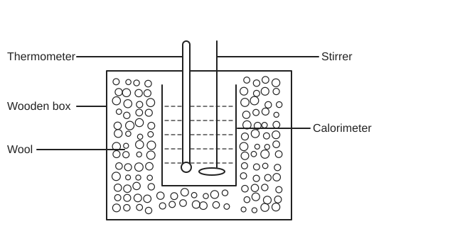
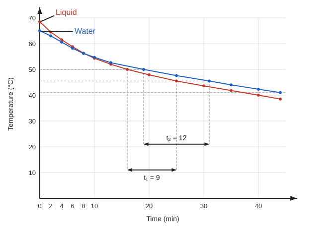

# Experiment 4 — Specific Heat of a Liquid by the Method of Cooling

## Aim
To determine the specific heat of a liquid by the method of cooling, comparing its cooling with that of an equal volume of water.

## Theory
Specific heat \(S\) is the heat needed to raise the temperature of unit mass of a material by 1 °C. By Newton's law of cooling, the rate of cooling of a body is directly proportional to the temperature difference between the body and its surroundings; this difference must be small. A heated liquid left to cool loses heat at a rate proportional to its temperature excess over the surroundings.

Symbols (source notation):

- \(m\) = mass of calorimeter with stirrer (kg); \(s\) = specific heat of calorimeter material (called \(S_c\) in the calculation).
- \(M_1\) = mass of liquid (kg); \(S_1\) = specific heat of liquid (J kg\(^{-1}\) K\(^{-1}\)); \(t_1\) = time for liquid to cool from \(\theta_1\) °C to \(\theta_2\) °C (s).
- \(M_2\) = mass of water of the same volume as the liquid (kg); \(S_2\) = specific heat of water (J kg\(^{-1}\) K\(^{-1}\)); \(t_2\) = time for water to cool from \(\theta_1\) °C to \(\theta_2\) °C (s).

Rates of cooling:

\[
\text{liquid: } \frac{(M_1 S_1 + ms)(\theta_1 - \theta_2)}{t_1}\ \mathrm{J\,s^{-1}}, \qquad
\text{water: } \frac{(M_2 S_2 + ms)(\theta_1 - \theta_2)}{t_2}\ \mathrm{J\,s^{-1}}
\]

The two rates are equal (Newton's law of cooling, per source):

\[
\frac{(M_1 S_1 + ms)(\theta_1 - \theta_2)}{t_1} = \frac{(M_2 S_2 + ms)(\theta_1 - \theta_2)}{t_2}
\]

\[
S_1 = \frac{M_2 S_2 t_1 + ms\,(t_1 - t_2)}{M_1 t_2}
\]

> **Source note:** in the first equality line of the source, the liquid's temperature factor is written like \((\theta_2 - \theta_2)\); the next line (the "or" line) has \((\theta_1 - \theta_2)\), which is used above.

## Principle / Law
**Newton's law of cooling:** the rate of loss of heat of a liquid is directly proportional to the difference between its temperature and that of the surroundings. Under the same conditions, the liquid and the water therefore have equal rates of cooling over the same temperature fall.

## Apparatus
1. Calorimeter with a stirrer
2. Chamber having two walls
3. Sensitive thermometer
4. Balance
5. Burner
6. Stop-watch

## Diagram

*Fig. 1: calorimeter (with liquid, thermometer and stirrer) inside a wool-packed wooden box.*

## Procedure
1. Weigh a clean, dry calorimeter together with its stirrer.
2. Heat water in another container to 70–75 °C, pour it into the calorimeter up to a fixed mark, and place the calorimeter in the two-walled chamber.
3. Stir slowly and record the water temperature at 1 °C intervals as it cools (it is above room temperature). Take 20–25 readings, then weigh the calorimeter with water. Mass of water = this weighing minus the first (empty) weighing.
4. Discard the water, clean and dry the calorimeter. Pour in the experimental liquid heated to 70–75 °C up to the same mark and place it in the chamber.
5. Stir slowly and repeat step 3 for the liquid (20–25 readings). Weigh the calorimeter with liquid; mass of liquid = this (3rd) weighing minus the first.
6. Enter all data in a table and draw a graph from it.

## Observation Table
**Table:** Time–Temperature record

| No. of observation | Time (min) | Temperature (°C), Water | Temperature (°C), Liquid |
|:---:|:---:|:---:|:---:|
| 1 | 0 | | |
| 2 | 2 | | |
| 3 | 4 | | |
| 4 | 6 | | |
| 5 | 8 | | |
| 6 | 10 | | |
| 7 | 12 | | |
| 8 | 14 | | |
| 9 | 16 | | |
| 10 | 18 | | |
| 11 | 20 | | |
| 12 | 22 | | |
| 13 | 24 | | |
| 14 | 26 | | |
| 15 | 28 | | |
| 16 | 30 | | |
| 17 | 33 | | |
| 18 | 36 | | |
| 19 | 39 | | |
| 20 | 42 | | |

> **Source note:** temperature cells are blank in the source table (the temperatures appear only as plotted points on the graph). The procedure says readings are taken at 1 °C intervals, while the table uses fixed time steps (2 min, then 3 min from row 17); kept as written.

## Graph

- Axes as in source: temperature (°C) on y, time (min) on x; two cooling curves, labelled Water and Liquid.
- Both curves start near 65–69 °C and fall to about 38–41 °C by about 44 min. The liquid curve starts higher, crosses the water curve at about 9 min, and ends lower.
- Reference levels (about 50 °C, 45.5 °C, 41 °C) and construction lines give the cooling times \(t_1 = 9\) and \(t_2 = 12\) (as written on the graph; units not written, minutes on the x-axis).
- Curves and construction lines are traced from the hand-drawn graph and are approximate; the source gives no numeric temperature values.

## Calculation
Data (from source): \(M_c = 12\) g, \(S_c = 0.0909\) (unit not stated), \(M_w = 100\) g, \(S_w = 1\) cal/gm·°C, \(M_l = 100\) g, \(t_1 = 9\), \(t_2 = 12\).

Source notation in this calculation: \(M_c S_c = ms\), \(M_w S_w = M_2 S_2\), \(M_l = M_1\).

\[
S_1 = \frac{M_w S_w t_1 + M_c S_c (t_1 - t_2)}{M_l\, t_2}
\]

\[
S_1 = \frac{(100 \times 1 \times 9) + 12 \times 0.0909\,(9 - 12)}{100 \times 12} = 0.747\ \mathrm{cal/gm\cdot{}^\circ C}
\]

(Arithmetic check: numerator \(= 900 - 3.27 = 896.73\); \(896.73 / 1200 = 0.7473\), matching the source.)

## Result
Specific heat of the liquid, \(S_1 = 0.747\ \mathrm{cal/gm\cdot{}^\circ C}\).

## Precautions
Taken from the source's Procedure and Discussion (the source has no separate precautions list):

1. Take equal volumes of water and liquid (fill to the same mark).
2. Do not use a volatile liquid.
3. Use a clean, dry calorimeter and weigh it accurately.
4. Stir slowly and read temperature and time accurately.

## Sources of Error
- Unclean calorimeter and inaccurate weighing, temperature or time readings make the result inaccurate.
- Unequal volumes of water and liquid introduce error.
- The bottom of the calorimeter was blackened, which increased its heat radiation.

> **Source note:** the first Discussion item in the source is partly garbled ("dirty and dry ... then experimental accurate"); the meaning above is the closest legible reading.
