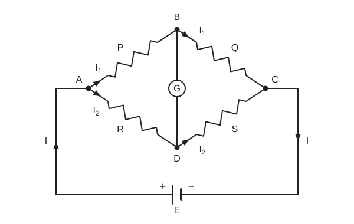
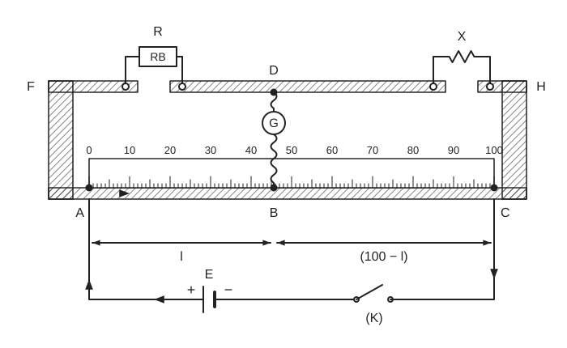

# Experiment 5 — Unknown Resistance of a Wire by Meter Bridge

## Aim
To determine the unknown resistance of a wire using a meter bridge.

## Theory
A meter bridge is a practical form of the Wheatstone bridge. Four resistances $P, Q, R, S$ are connected as in the Wheatstone diagram below. When the bridge is balanced (no deflection in the galvanometer $G$):

$$
\frac{P}{Q} = \frac{R}{S}
$$

This relation is used to find the unknown resistance $X$ of the wire. In the meter bridge:

$$
X = \frac{R\,(100 - l)}{l}
$$

- $R$ = known resistance taken from the resistance box (R.B.).
- $l$ = balancing length $AB$ in cm; $BC = 100 - l$.

> **Source note:** the Theory text calls $l$ the "length of wire"; the Procedure and diagram define it as the balancing length $AB$. The balancing-length meaning is used here.

## Principle / Law
**Wheatstone bridge principle:** with no galvanometer deflection, $P/Q = R/S$. The meter bridge applies this with the two ratio arms formed by the wire lengths $l$ and $100 - l$.

## Apparatus
The source has no apparatus list; the items below are compiled from its diagram and procedure.

1. Meter bridge (wire with metre scale, metal strips)
2. Resistance box (R.B.)
3. Unknown resistance wire $X$
4. Galvanometer $G$
5. Cell $E$ and key $K$
6. Jockey
7. Connecting wires and sand paper
8. Ordinary scale (to measure the length of the wire)

## Diagram

*Wheatstone bridge arrangement:* $P$ on $AB$, $Q$ on $BC$, $R$ on $AD$, $S$ on $DC$, galvanometer $G$ between $B$ and $D$; currents $I_1$ through $P$ and $Q$, $I_2$ through $R$ and $S$, total $I$; cell $E$ with "+" on the left.

*Meter bridge circuit:* resistance box $R$ in the left gap (strips $F$, $D$), unknown $X$ in the right gap (strips $D$, $H$); galvanometer $G$ joins $D$ to the jockey at $B$ on the wire $AC$ (scale 0–100); $AB = l$, $BC = 100 - l$; cell $E$ ("+" on the left) and key $K$ across $A$ and $C$.

> The position of $B$ is drawn at about the middle of the wire; it moves to the null point in the experiment.

## Procedure
1. Clean the connecting wires with sand paper and connect as in the meter bridge diagram. Take a suitable resistance $R$ from the resistance box.
2. Touch the jockey at point $A$; the galvanometer deflects to one side. Touch it at point $C$; the deflection must be to the other side. If so, the connection is correct.
3. Find the null point where the galvanometer deflection is zero. Note the length $AB$ ($= l$); then $BC = 100 - l$.
4. Repeat for different values of $R$, chosen so the null point lies between 30 cm and 70 cm of the wire. The point of zero deflection is the balance point.
5. Measure the length of the given wire with an ordinary scale.

## Observation Table
**Table for unknown resistance $X$:**

| Serial No. | Reading of Resistance Box $R$ (Ω) | Balancing length $l$ (cm) | Unknown Resistance $X = \dfrac{R(100-l)}{l}$ (Ω) |
|:---:|:---:|:---:|:---:|
| 1 | | | |
| 2 | | | |
| 3 | | | |
| 4 | | | |

> **Source note:** all cells are blank in the source table. The Result line (below) gives the $R$ and $X$ values that go with the four rows.

## Calculation
$$
X = \frac{R\,(100 - l)}{l}
$$

Values as stated in the source Result (the $l$ column is derived here from $l = \dfrac{100R}{R + X}$ and is **not** in the source):

| $R$ (Ω) | $X$ stated in source (Ω) | $l$ implied (cm) |
|:---:|:---:|:---:|
| 50 | 75 | 40 |
| 100 | 53.846 | 65 |
| 200 | 200 | 50 |
| 500 | 214.285 | 70 |

All implied $l$ values fall in the required 30–70 cm range.

Example (row 1, using the implied $l$): $X = \dfrac{50\,(100 - 40)}{40} = 75\ \Omega$.

## Result
For resistance-box readings 50 Ω, 100 Ω, 200 Ω and 500 Ω, the unknown resistance is 75 Ω, 53.846 Ω, 200 Ω and 214.285 respectively.

> **Source note:** the four $X$ values differ noticeably and the source gives no mean. The last value has no unit written. Values are kept exactly as stated.

## Precautions
1. Balance point should lie between 30 cm and 70 cm.
2. Clean the connecting wires and the connecting points of the meter bridge with sand paper.
3. All connections should be neat and tight.
4. Do not keep the jockey in contact with the wire for a long time.
5. Hold the jockey perpendicular to the meter bridge wire.

## Sources of Error
- Screws of the instruments may be loose.
- Keys of the resistance box may not be clean and tight.
- The wire may not be uniformly thick throughout.
