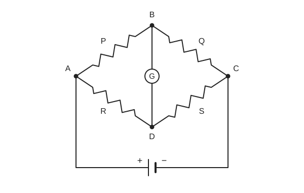

# Experiment 6 — Unknown Resistance by Post Office Box

## Aim
To determine the value of an unknown resistance of a wire using a post office box.

## Theory
$P$ and $Q$ are the resistances in the ratio arms, $R$ is the resistance in the third arm, and $S$, the unknown resistance, is in the fourth arm. When the galvanometer shows no reading (null point):

$$
\frac{P}{Q} = \frac{R}{S} \quad\Rightarrow\quad S = \frac{RQ}{P}
$$

> **Source note:** the source's opening sentence is garbled ("P and Q are the unknown resistance in the vako arm ..."), and its last line reads $S = \left(\dfrac{RQ}{P}\right)x$ with a stray "x". The calculation section of the source uses $S = RQ/P$, which is used here. Original is unclear here.

## Principle / Law
**Wheatstone bridge balance:** with no galvanometer deflection, $P/Q = R/S$, so $S = RQ/P$. The post office box is a Wheatstone bridge with plug-in resistance arms.

## Apparatus
1. Post office box
2. Unknown resistance
3. Zero-centre galvanometer and cell (written "Zero center galvanometer cell")
4. Commutators
5. Connecting wires

## Diagram

*Fig.: Post office box (Wheatstone form).* $P$ on $AB$, $Q$ on $BC$, $R$ on $AD$, $S$ on $DC$, galvanometer $G$ between $B$ and $D$; cell across $A$ and $C$ with "+" on the left.

## Procedure
1. Connect the galvanometer terminals between $Q$ and $k_1$ of the post office box; $k_2$ is internally connected to a point `[unclear]`. Connect the poles of cell $E$ through a resistance $R_m$ to point $k_1$; $ck$ is internally connected to $A$. Connect the terminals of the unknown resistance $S$ to a point `[unclear]` and $Q$.
2. Take out 10 Ω from each ratio arm ($BA$ and $BC$). Make sure all other plugs in the box are tight.
3. Gradually increase the resistance in the third arm until a resistance $R$ is found for which there is no galvanometer deflection when the circuit is closed. Then the unknown resistance is $S = \dfrac{10}{10} \times R_1 = R_1$.
4. Take out 100 Ω in arm $P$, keeping 10 Ω in arm $Q$, so that $\dfrac{Q}{P} = \dfrac{10}{100} = \dfrac{1}{10}$. The null point then occurs when the third-arm resistance is `[unclear: sentence incomplete in source]`.
5. Calculate the mean value of the unknown resistance.

## Observation Table
**Observation table 1** (Arm $Q$ = 10 Ω, Arm $P$ = 10 Ω)

| SL. No | Third arm $R$ (Ω) | Direction of deflection | Interface third arm resistance |
|:---:|:---:|:---:|:---|
| 1 | 0 | left | |
| 2 | 8 | Right | |
| 3 | 10 | left | |
| 4 | 12 | left | |
| 5 | 15 | left | |
| 6 | 19 | left | |
| 7 | 20 | left | |
| 8 | 25 | left | |
| 9 | 35 | left | |
| 10 | 50 | Null | Null point is obtained at 50 Ω |

**Observation table 2** (Arm $Q$ = 10 Ω, Arm $P$ = 100 Ω)

| SL. No | Third arm $R$ (Ω) | Direction of deflection | Interface third arm resistance |
|:---:|:---:|:---:|:---|
| 01 | 0 | left | |
| 02 | 8 | Right | |
| 03 | 10 | left | |
| 04 | 20 | left | |
| 05 | 50 | left | |
| 06 | 100 | left | |
| 07 | 200 | left | |
| 08 | 300 | left | |
| 09 | 500 | Null | Null point obtained at 500 Ω |

> **Source note:** in both tables the last column is one merged cell in the source ("Null point ... at 50 Ω" / "... at 500 Ω"); it is shown on the Null row here. Also, the source lists "Right" deflection at 8 Ω but "left" at 0 Ω and at 10 Ω and above; kept exactly as written.

## Calculation
$$
S = \frac{RQ}{P}
$$

From table 1 ($P = 10\ \Omega$, $Q = 10\ \Omega$, $R = 50\ \Omega$):

$$
S = \frac{50 \times 10}{10} = 50\ \Omega
$$

From table 2 ($P = 100\ \Omega$, $Q = 10\ \Omega$, $R = 500\ \Omega$):

$$
S = \frac{500 \times 10}{100} = 50\ \Omega
$$

Both give $S = 50\ \Omega$, so the mean is 50 Ω.

## Result
The value of the unknown resistance of the wire by post office box is **50 Ω**.

## Precautions
Taken from the source's Procedure and Discussion (the source has no separate precautions list):

1. Make sure all other plugs in the box are tight before starting.
2. Give every plug a turn within its socket to clean the surfaces of contact (source wording: "remove the o side", `[unclear]`).
3. Increase the third-arm resistance gradually until the galvanometer shows no deflection.

## Sources of Error
> Not listed in the source. The points below are general, textbook-standard error sources for a post office box / Wheatstone bridge experiment, not values or observations from your notebook.

- Plug contact resistance in the resistance-arm sockets, if a plug isn't fully seated.
- Thermoelectric EMF at junctions of dissimilar metals, affecting sensitive null-point readings.
- Galvanometer sensitivity limits — a broad null zone makes the balance point imprecise.
- End resistance / connecting-wire resistance not accounted for in the ratio arms.
- Self-inductance effects at the moment the key is closed, causing a transient (non-null) deflection.

## Discussion
- A cell of any kind may be used in post office box experiments.
- The position of the null point does not change when the galvanometer and the battery are interchanged.
