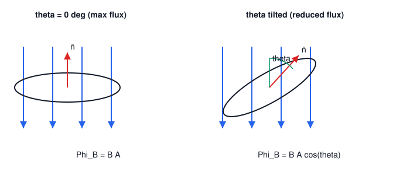

# 01. Magnetic Induction

**Course:** PHY-103 (Physics–II) · **Unit:** Magnetism
**Prerequisite:** None (entry point of the unit)
**Leads to:** Magnetic Force on a Current-Carrying Conductor, Faraday's Law

---

## A. Physical Idea

A moving electric charge or a current-carrying conductor creates a region of influence around itself in which another moving charge or current experiences a force. This region of influence is the **magnetic field**. Unlike the electric field, which is defined through the force on a *stationary* test charge, the magnetic field can only be detected through its effect on a *moving* charge or a current.

The strength and direction of this field at any point is described by a vector quantity called the **magnetic flux density**, commonly (if loosely) called the "magnetic field," and denoted $\mathbf{B}$. The word "induction" in "magnetic induction" is historical: early physicists thought of $\mathbf{B}$ as being "induced" in space by currents and magnets, in analogy with electrostatic induction. In modern usage, $\mathbf{B}$ is simply the fundamental field vector of magnetism.

A second, related idea is **magnetic flux** $\Phi_B$: the total "amount" of magnetic field passing through a given surface. Flux depends not only on how strong $\mathbf{B}$ is, but also on the area of the surface and its orientation relative to $\mathbf{B}$. This orientation-dependence is what makes Faraday's law (Topic 05) possible — flux can change even if $B$ itself never changes, simply because the area or the angle changes.

## B. Definition

**Magnetic flux density (magnetic induction), $\mathbf{B}$:** the vector field such that the force on a test charge $q$ moving with velocity $\mathbf{v}$ through it is $\mathbf{F} = q\mathbf{v}\times\mathbf{B}$.

> Plain-English: $\mathbf{B}$ tells you how strong the magnetic field is and which way it points, at a given point in space, based on how hard it pushes a moving charge sideways.

**Magnetic flux, $\Phi_B$:** the surface integral of $\mathbf{B}$ over an area $A$:
$$
\Phi_B = \int \mathbf{B}\cdot d\mathbf{A}
$$

> Plain-English: magnetic flux is a measure of how many field lines pass "through" a surface — more lines, or lines more perpendicular to the surface, means more flux.

⚠️ **Convention note:** Some textbooks (e.g., older engineering texts) call $\mathbf{H}$ the "magnetic field" and $\mathbf{B}$ the "magnetic induction" or "flux density," reserving $\mathbf{H}$ for the field produced purely by free currents. In this course, following Halliday/Resnick and Serway conventions, $\mathbf{B}$ is the primary field of interest, and $\mathbf{H}$ appears only in Topic 09 (magnetic materials).

## C. Governing Equations

For a uniform field over a flat surface of area $A$, with $\theta$ the angle between $\mathbf{B}$ and the area's outward normal $\hat{\mathbf{n}}$:
$$
\Phi_B = B A \cos\theta
$$

For a general (possibly non-uniform) field over an arbitrary surface:
$$
\Phi_B = \int \mathbf{B}\cdot d\mathbf{A}
$$

where:

| Symbol | Meaning |
|---|---|
| $\mathbf{B}$ | magnetic flux density vector at a point (T) |
| $A$ | area of the flat surface (m²) |
| $d\mathbf{A}$ | vector area element, magnitude $dA$, direction $\hat{\mathbf n}$ (normal to surface) |
| $\theta$ | angle between $\mathbf{B}$ and $\hat{\mathbf n}$ |
| $\Phi_B$ | magnetic flux through the surface (Wb) |

## D. Derivation: Flux Through a Uniform Field

Start from the general definition:
$$
\Phi_B = \int_S \mathbf{B}\cdot d\mathbf{A}
$$

**Step 1.** If the field is uniform, $\mathbf{B}$ is constant over the surface and can be taken outside the integral:
$$
\Phi_B = \mathbf{B}\cdot\int_S d\mathbf{A}
$$

**Step 2.** For a flat surface, all area elements $d\mathbf{A}$ point in the same direction $\hat{\mathbf n}$, so $\int_S d\mathbf{A} = A\hat{\mathbf n}$, where $A$ is the total area.
$$
\Phi_B = \mathbf{B}\cdot A\hat{\mathbf n} = A(\mathbf{B}\cdot\hat{\mathbf n})
$$

**Step 3.** By the definition of the dot product, $\mathbf{B}\cdot\hat{\mathbf n} = B\cos\theta$, where $\theta$ is the angle between $\mathbf{B}$ and $\hat{\mathbf n}$.
$$
\Phi_B = BA\cos\theta
$$

This is the working formula for a uniform field on a flat surface.

**What must be memorized:** the final result $\Phi_B = BA\cos\theta$ and the general integral form.
**What must be understood:** flux is a *scalar* obtained by projecting $\mathbf{B}$ onto the surface normal; it is maximum when $\mathbf{B}\parallel\hat{\mathbf n}$ and zero when $\mathbf{B}\perp\hat{\mathbf n}$ (field lines skimming along the surface, not passing through it).

## E. Vector Analysis

- $\mathbf{B}$ is a vector: it has both magnitude (strength of the field) and direction (the direction a compass needle would point, or the direction along which a moving charge feels *no* sideways force when moving parallel to $\mathbf{B}$).
- The surface normal $\hat{\mathbf n}$ is a matter of convention — for a closed surface it is chosen outward; for an open surface, a direction is chosen and a right-hand-rule sense is often attached to a bounding loop.
- Flux depends on $\cos\theta$, **not** $\sin\theta$, because it is a dot product ($\mathbf{B}\cdot d\mathbf{A}$), not a cross product.
  - $\theta = 0^\circ$: $\mathbf{B}$ parallel to $\hat{\mathbf n}$ → $\Phi_B = BA$ (maximum flux).
  - $\theta = 90^\circ$: $\mathbf{B}$ perpendicular to $\hat{\mathbf n}$ (i.e., $\mathbf{B}$ lies in the plane of the surface) → $\Phi_B = 0$.
  - $\theta = 180^\circ$: $\mathbf{B}$ antiparallel to $\hat{\mathbf n}$ → $\Phi_B = -BA$ (maximum magnitude, opposite sign).

## F. Units and Dimensions

| Quantity | Symbol | SI Unit | Dimension |
|---|---|---|---|
| Magnetic flux density | $B$ | tesla (T) = Wb/m² = kg·s⁻²·A⁻¹ | $\mathsf{M}\,\mathsf{T}^{-2}\,\mathsf{I}^{-1}$ |
| Area | $A$ | m² | $\mathsf{L}^2$ |
| Magnetic flux | $\Phi_B$ | weber (Wb) = T·m² = V·s | $\mathsf{M}\,\mathsf{L}^2\,\mathsf{T}^{-2}\,\mathsf{I}^{-1}$ |

**Dimensional check:** $[\Phi_B] = [B][A] = (\mathsf{M}\,\mathsf{T}^{-2}\,\mathsf{I}^{-1})(\mathsf{L}^2) = \mathsf{M}\,\mathsf{L}^2\,\mathsf{T}^{-2}\,\mathsf{I}^{-1}$, consistent with the weber defined via $\mathcal{E} = -d\Phi_B/dt$ (volt·second).

## G. Diagram

*Figure 1: A uniform field $\mathbf{B}$ crossing a flat loop of area $A$. Left: normal $\hat{\mathbf n}$ parallel to $\mathbf{B}$ ($\theta=0$, maximum flux). Right: loop tilted so $\hat{\mathbf n}$ makes angle $\theta$ with $\mathbf{B}$, reducing flux to $BA\cos\theta$.*

## Definitions & Key Terms

1. **Magnetic flux density ($\mathbf{B}$)** — the vector field defined via the force it exerts on a moving charge, $\mathbf{F}=q\mathbf{v}\times\mathbf{B}$.
   > Plain-English: how strong and in what direction the magnetic "push" is at a point in space.

2. **Magnetic flux ($\Phi_B$)** — the surface integral $\int\mathbf{B}\cdot d\mathbf{A}$.
   > Plain-English: the total amount of magnetic field passing through a chosen surface.

3. **Uniform magnetic field** — a field with the same magnitude and direction at every point in the region of interest.
   > Plain-English: field lines are straight, parallel, and evenly spaced.

4. **Non-uniform magnetic field** — a field whose magnitude and/or direction varies from point to point.
   > Plain-English: field lines converge, diverge, or curve.

## Worked Examples

### Example 1 — Foundational

**Given:** A flat circular loop of radius $r = 5\ \text{cm}$ lies with its plane perpendicular to a uniform field $B = 0.2\ \text{T}$.
**Required:** Magnetic flux through the loop.
**Principle:** $\Phi_B = BA\cos\theta$; plane perpendicular to $\mathbf{B}$ means $\hat{\mathbf n}\parallel\mathbf{B}$, so $\theta = 0^\circ$.

**Substitution:**
$$
A = \pi r^2 = \pi (0.05\ \text{m})^2 = \pi(2.5\times10^{-3}\ \text{m}^2) = 7.854\times10^{-3}\ \text{m}^2
$$
$$
\Phi_B = BA\cos 0^\circ = (0.2\ \text{T})(7.854\times10^{-3}\ \text{m}^2)(1)
$$

**Algebra:**
$$
\Phi_B = 1.571\times10^{-3}\ \text{Wb}
$$

**Unit check:** T·m² = Wb ✓

**Final answer:** $\boxed{\Phi_B \approx 1.57\times10^{-3}\ \text{Wb}}$

**Interpretation:** Since the loop's plane is perpendicular to $\mathbf{B}$, every field line that reaches the loop's area passes straight through — this is the maximum possible flux configuration for the given $B$ and $A$.

---

### Example 2 — Intermediate

**Given:** The same loop ($A = 7.854\times10^{-3}\ \text{m}^2$) is tilted so that its plane makes an angle of $60^\circ$ with the field direction, in field $B = 0.2\ \text{T}$.
**Required:** Flux through the loop.
**Principle:** $\Phi_B = BA\cos\theta$, where $\theta$ is measured between $\mathbf{B}$ and the *normal* $\hat{\mathbf n}$, not between $\mathbf{B}$ and the plane.

**Reasoning:** If the plane makes $60^\circ$ with $\mathbf{B}$, the normal makes $90^\circ - 60^\circ = 30^\circ$ with $\mathbf{B}$.

**Substitution:**
$$
\Phi_B = (0.2\ \text{T})(7.854\times10^{-3}\ \text{m}^2)\cos30^\circ
$$

**Algebra:**
$$
\Phi_B = (0.2)(7.854\times10^{-3})(0.866) = 1.360\times10^{-3}\ \text{Wb}
$$

**Final answer:** $\boxed{\Phi_B \approx 1.36\times10^{-3}\ \text{Wb}}$

**Interpretation:** This is a common exam trap — always confirm whether the given angle is between $\mathbf{B}$ and the *plane* or between $\mathbf{B}$ and the *normal* before substituting into $\cos\theta$.

---

### Example 3 — Advanced / Exam-Level

**Given:** A non-uniform field near a wire varies with distance $x$ from the wire as $B(x) = \dfrac{k}{x}$, where $k$ is a constant. A rectangular loop of length $\ell$ (parallel to the wire) and width $w$ lies in the same plane as the wire, with its near edge a distance $a$ from the wire and its far edge at $a+w$.
**Required:** Total flux through the loop.
**Principle:** Because $B$ varies with position, we must integrate: $\Phi_B = \int \mathbf{B}\cdot d\mathbf{A}$, with $d\mathbf{A} = \ell\,dx\,\hat{\mathbf n}$ and $\mathbf{B}\parallel\hat{\mathbf n}$ everywhere in this plane (field perpendicular to the loop's plane by the right-hand rule around the wire).

**Setting up the integral:**
$$
\Phi_B = \int_a^{a+w} B(x)\,\ell\,dx = \int_a^{a+w} \frac{k}{x}\,\ell\,dx = k\ell\int_a^{a+w}\frac{dx}{x}
$$

**Algebra:**
$$
\Phi_B = k\ell\Big[\ln x\Big]_a^{a+w} = k\ell\left(\ln(a+w) - \ln a\right) = k\ell\ln\!\left(\frac{a+w}{a}\right)
$$

**Unit check:** $k$ carries units of T·m (so that $k/x$ has units of T); $k\ell$ has units T·m², matching Wb, and the logarithm is dimensionless. ✓

**Final answer:**
$$
\boxed{\Phi_B = k\ell\ln\!\left(\frac{a+w}{a}\right)}
$$

**Interpretation:** This example shows that flux calculations for non-uniform fields require integration over the surface; the simple $BA\cos\theta$ formula only applies when $B$ is constant over the whole area. (This exact setup reappears in Topic 08, Mutual Induction, for a wire–loop system.)

## Common Mistakes

- ❌ **Mistake:** Confusing $B$ (a field magnitude at a point) with $\Phi_B$ (an integrated quantity over a surface).
  ✅ **Correct:** $B$ is measured in tesla and exists at every point; $\Phi_B$ is measured in weber and is meaningful only once a specific surface is specified.

- ❌ **Mistake:** Using the angle between $\mathbf{B}$ and the *plane* of the surface directly in $\cos\theta$.
  ✅ **Correct:** $\theta$ must be measured between $\mathbf{B}$ and the surface's *normal* vector $\hat{\mathbf n}$; convert plane-angles via $\theta_{\text{normal}} = 90^\circ - \theta_{\text{plane}}$.

- ❌ **Mistake:** Assuming flux is always positive.
  ✅ **Correct:** Flux is a signed scalar; its sign depends on the chosen direction of $\hat{\mathbf n}$ relative to $\mathbf{B}$.

- ❌ **Mistake:** Applying $\Phi_B = BA\cos\theta$ to a non-uniform field without integrating.
  ✅ **Correct:** For non-uniform $B$, flux requires $\Phi_B = \int\mathbf{B}\cdot d\mathbf{A}$; $BA\cos\theta$ is valid only when $B$ is uniform over the entire surface.

## Practice Problems

1. **Conceptual:** Explain why a compass needle aligns with $\mathbf{B}$ rather than being pushed sideways, even though the defining force law involves a cross product.
2. **Short derivation:** Starting from $\Phi_B = \int\mathbf{B}\cdot d\mathbf{A}$, show that the flux through *any* closed surface in a magnetic field is zero (Gauss's law for magnetism), given that magnetic field lines have no beginning or end.
3. **Numerical:** A square loop of side $10\ \text{cm}$ sits in a uniform field of $0.5\ \text{T}$ directed at $40^\circ$ to the loop's normal. Find the flux.
   

   
Solution

   Step 1: $A = (0.10\ \text{m})^2 = 0.01\ \text{m}^2$.

   Step 2: $\Phi_B = BA\cos\theta = (0.5)(0.01)\cos 40^\circ$.

   $$
   \Phi_B = (0.5)(0.01)(0.766) = 3.83\times10^{-3}\ \text{Wb}
   $$

   **Answer:** $\Phi_B \approx 3.83\times10^{-3}\ \text{Wb}$
   

4. **Vector/direction:** A loop's normal points in the $+z$ direction. A field $\mathbf{B} = 0.3\hat{\mathbf x} + 0.4\hat{\mathbf z}\ \text{T}$ exists. If the loop has area $2\times10^{-2}\ \text{m}^2$, find the flux, explaining why the $x$-component contributes nothing.
   

   
Solution

   Step 1: $\Phi_B = \mathbf{B}\cdot\mathbf{A} = \mathbf{B}\cdot(A\hat{\mathbf z})$.

   Step 2: Only the $z$-component of $\mathbf{B}$ has a nonzero dot product with $\hat{\mathbf z}$; the $x$-component is perpendicular to $\hat{\mathbf z}$ and contributes zero (its projection onto $\hat{\mathbf z}$ is zero).

   $$
   \Phi_B = (0.4\ \text{T})(2\times10^{-2}\ \text{m}^2) = 8\times10^{-3}\ \text{Wb}
   $$

   **Answer:** $\Phi_B = 8\times10^{-3}\ \text{Wb}$; the $x$-component of $\mathbf{B}$ lies entirely within the loop's plane and produces no flux.
   

5. **Exam-style, multi-step (no scaffolding):** A coil of $N = 50$ turns, each of area $4\times10^{-3}\ \text{m}^2$, is rotated in a uniform field $B = 0.15\ \text{T}$ so that the angle between the normal and the field changes from $0^\circ$ to $90^\circ$ in $0.2\ \text{s}$ at a constant rate. Determine the total flux linkage ($N\Phi_B$) at $t=0$ and at $t=0.2\ \text{s}$.
   

   
Solution

   Step 1: At $t=0$, $\theta = 0^\circ$: $\Phi_B = BA\cos0^\circ = (0.15)(4\times10^{-3})(1) = 6\times10^{-4}\ \text{Wb}$.

   Step 2: Flux linkage $= N\Phi_B = 50\times6\times10^{-4} = 3.0\times10^{-2}\ \text{Wb-turns}$.

   Step 3: At $t = 0.2\ \text{s}$, $\theta = 90^\circ$: $\Phi_B = BA\cos90^\circ = 0$.

   Step 4: Flux linkage $= N\Phi_B = 0$.

   **Answer:** Flux linkage drops from $3.0\times10^{-2}\ \text{Wb}$ to $0\ \text{Wb}$ over the interval. (This scenario is the physical basis of an AC generator — see Topic 05.)
   

## Summary

| Concept | Key Result | Condition / Limit |
|---|---|---|
| Magnetic flux density | $\mathbf{F}=q\mathbf{v}\times\mathbf{B}$ defines $\mathbf{B}$ | General |
| Flux (uniform field) | $\Phi_B = BA\cos\theta$ | $B$ constant over flat surface |
| Flux (general) | $\Phi_B = \int\mathbf{B}\cdot d\mathbf{A}$ | Any field, any surface |
| Maximum flux | $\theta=0^\circ \Rightarrow \Phi_B = BA$ | $\mathbf{B}\parallel\hat{\mathbf n}$ |
| Zero flux | $\theta=90^\circ \Rightarrow \Phi_B = 0$ | $\mathbf{B}\perp\hat{\mathbf n}$ |
| Unit | $1\ \text{Wb} = 1\ \text{T}\cdot\text{m}^2$ | SI |

Magnetic flux is the foundation for both the force laws (Topics 02–04, which describe how $\mathbf{B}$ acts on currents) and for electromagnetic induction (Topics 05–08, which describe how a *changing* $\Phi_B$ generates an emf).
