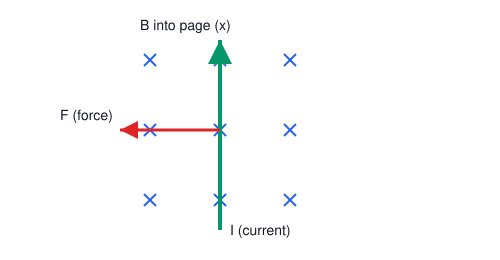

# 02. Magnetic Force on a Current-Carrying Conductor

**Course:** PHY-103 (Physics–II) · **Unit:** Magnetism
**Prerequisite:** Magnetic Induction (Topic 01)
**Leads to:** Torque on a Current-Carrying Loop (Topic 03), Hall Effect (Topic 04)

---

## A. Physical Idea

A current is nothing but a stream of moving charges. Since a single moving charge in a magnetic field experiences a sideways (Lorentz) force, a conductor carrying current — being full of moving charges — must also experience a net force when placed in a magnetic field. This is the physical basis of every electric motor, loudspeaker, and galvanometer.

The force does not depend on the conductor's material or its being a solid wire; it depends only on how much charge is moving, how fast, and at what angle to $\mathbf{B}$. Because current is a macroscopic, easily measurable quantity, it is more convenient to express the force in terms of current $I$ and conductor length $\mathbf{L}$ rather than individual charge velocities.

## B. Definition

**Magnetic force on a current element:** the force experienced by a straight current-carrying conductor of length $L$ carrying current $I$, placed in a magnetic field $\mathbf{B}$.

> Plain-English: a wire carrying current in a magnetic field gets pushed sideways, and how hard depends on the current, the wire's length, the field strength, and the angle between the wire and the field.

## C. Governing Equation

$$
\mathbf{F} = I\mathbf{L}\times\mathbf{B}
$$

where:

| Symbol | Meaning |
|---|---|
| $\mathbf{F}$ | force on the conductor (N) |
| $I$ | current in the conductor (A), scalar |
| $\mathbf{L}$ | vector along the conductor, magnitude = length, direction = direction of conventional current flow |
| $\mathbf{B}$ | magnetic flux density (T) |

For a conductor at angle $\theta$ to $\mathbf{B}$, the magnitude is:
$$
F = BIL\sin\theta
$$

## D. Derivation: From the Lorentz Force to the Current-Element Force

**Step 1.** A single charge $q$ moving with drift velocity $\mathbf{v}_d$ in field $\mathbf{B}$ experiences the Lorentz force:
$$
\mathbf{f} = q\mathbf{v}_d\times\mathbf{B}
$$

**Step 2.** Consider a straight conducting wire of cross-sectional area $A$, length $L$, containing $n$ free charge carriers per unit volume, each of charge $q$. The total number of carriers in the wire is:
$$
N = n\,(A L)
$$

**Step 3.** The total force is the vector sum of the force on each carrier. Since all carriers (for a given carrier type) drift with essentially the same $\mathbf{v}_d$ in a uniform $\mathbf{B}$:
$$
\mathbf{F} = N q\,\mathbf{v}_d\times\mathbf{B} = (nAL)\,q\,\mathbf{v}_d\times\mathbf{B}
$$

**Step 4.** Recall the microscopic definition of current: $I = nqv_dA$ (magnitude), where $v_d$ is the drift speed. Rearranged, $nqA\,\mathbf{v}_d = I\hat{\mathbf L}$, where $\hat{\mathbf L}$ is the unit vector along the current direction (this uses the fact that conventional current direction is defined as the direction of positive-carrier drift, or opposite to electron drift for negative carriers — the algebra works out consistently either way because both $q$ and $\mathbf{v}_d$ flip sign together for electrons).

**Step 5.** Substituting into Step 3:
$$
\mathbf{F} = L\,(nqA\,\mathbf{v}_d)\times\mathbf{B} = L\,(I\hat{\mathbf L})\times\mathbf{B} = I(L\hat{\mathbf L})\times\mathbf{B}
$$

**Step 6.** Defining the length vector $\mathbf{L} \equiv L\hat{\mathbf L}$ (magnitude $L$, direction along current flow):
$$
\boxed{\mathbf{F} = I\mathbf{L}\times\mathbf{B}}
$$

**What must be memorized:** $\mathbf{F} = I\mathbf{L}\times\mathbf{B}$ and $F = BIL\sin\theta$.
**What must be understood:** this is a macroscopic repackaging of the microscopic Lorentz force summed over all charge carriers in the wire; it assumes a straight wire in a uniform field.

## E. Vector Analysis

The force is a **cross product**, so:
$$
|\mathbf{F}| = BIL\sin\theta
$$

- $\theta = 0^\circ$ (current parallel to $\mathbf{B}$): $F = 0$. A wire aligned with the field feels no magnetic force.
- $\theta = 90^\circ$ (current perpendicular to $\mathbf{B}$): $F = BIL$, the maximum possible force.
- $\theta = 180^\circ$ (current antiparallel to $\mathbf{B}$): $F = 0$ again, since $\sin180^\circ = 0$.

**Direction — Right-Hand Rule:** Point the fingers of the right hand in the direction of current $I$ (i.e., along $\mathbf{L}$), then curl them toward $\mathbf{B}$; the thumb points in the direction of $\mathbf{F}$. Equivalently, use the "slap rule": fingers point along $I$, palm push direction (after curling fingers toward $\mathbf{B}$) gives $\mathbf{F}$. Because $\mathbf{L}\times\mathbf{B}$ is **not** commutative, reversing either the current direction or the field direction reverses the force; reversing both leaves the force unchanged.

**Connection with the Lorentz force:** $\mathbf{F} = I\mathbf{L}\times\mathbf{B}$ is the current (macroscopic) analog of $\mathbf{f} = q\mathbf{v}\times\mathbf{B}$ (microscopic, single-charge). Both are cross products of a "flow direction" vector with $\mathbf{B}$.

## F. Units and Dimensions

| Quantity | Symbol | SI Unit | Dimension |
|---|---|---|---|
| Force | $F$ | newton (N) | $\mathsf{M\,L\,T^{-2}}$ |
| Current | $I$ | ampere (A) | $\mathsf{I}$ |
| Length | $L$ | metre (m) | $\mathsf{L}$ |
| Magnetic flux density | $B$ | tesla (T) | $\mathsf{M\,T^{-2}\,I^{-1}}$ |

**Dimensional check:** $[BIL] = (\mathsf{M\,T^{-2}\,I^{-1}})(\mathsf{I})(\mathsf{L}) = \mathsf{M\,L\,T^{-2}}$ = newton. ✓

## G. Diagram

*Figure 1: A straight wire carrying current $I$ (green) lies perpendicular to field $\mathbf{B}$ (blue). Applying the right-hand rule ($I\mathbf{L}\times\mathbf{B}$) gives force $\mathbf{F}$ (red) directed out of the page.*

## Definitions & Key Terms

1. **Current element** — an infinitesimal or finite straight segment $I\mathbf{L}$ (or $I\,d\mathbf{l}$) carrying current $I$, treated as the basic source/receiver of magnetic force.
   > Plain-English: a small "chunk" of current-carrying wire, useful for building up forces on wires of any shape.

2. **Drift velocity, $\mathbf{v}_d$** — the average net velocity of charge carriers superimposed on their random thermal motion.
   > Plain-English: the slow, steady creep of electrons through a wire that constitutes current, even though individual electrons move fast and randomly.

3. **Lorentz force** — the total electromagnetic force on a moving charge, $\mathbf{f} = q(\mathbf{E}+\mathbf{v}\times\mathbf{B})$; in this topic only the magnetic part is considered.
   > Plain-English: the combined electric-push-plus-magnetic-push a charge feels.

## Worked Examples

### Example 1 — Foundational

**Given:** A straight wire of length $L = 0.5\ \text{m}$ carries current $I = 4\ \text{A}$, perpendicular to a field $B = 0.3\ \text{T}$.
**Required:** Force on the wire.
**Principle:** $F = BIL\sin\theta$, $\theta = 90^\circ$.

**Substitution:**
$$
F = (0.3\ \text{T})(4\ \text{A})(0.5\ \text{m})\sin90^\circ
$$

**Algebra:**
$$
F = (0.3)(4)(0.5)(1) = 0.6\ \text{N}
$$

**Unit check:** T·A·m = N ✓

**Final answer:** $\boxed{F = 0.6\ \text{N}}$

**Interpretation:** Since the wire is perpendicular to the field, this is the maximum possible force for these values of $B$, $I$, $L$.

---

### Example 2 — Intermediate

**Given:** The same wire ($I=4\ \text{A}$, $L=0.5\ \text{m}$) makes an angle of $30^\circ$ with a field $B = 0.3\ \text{T}$.
**Required:** Force, and the angle at which the force would be half of the maximum value found in Example 1.

**Part (a):**
$$
F = BIL\sin30^\circ = (0.3)(4)(0.5)(0.5) = 0.3\ \text{N}
$$

**Part (b):** Maximum force $F_{max} = 0.6\ \text{N}$ (from Example 1). We need $F = 0.3\ \text{N} = F_{max}\sin\theta$, i.e., $\sin\theta = 0.5 \Rightarrow \theta = 30^\circ$.

**Final answer:** $\boxed{F = 0.3\ \text{N at } 30^\circ\text{; this also equals half of }F_{max}\text{, consistent since }\sin30^\circ=0.5.}$

**Interpretation:** Force scales with $\sin\theta$, not linearly with angle — doubling the angle does not double the force except near small angles.

---

### Example 3 — Advanced / Exam-Level

**Given:** A wire bent into a semicircular arc of radius $R$ lies in the plane of the page, carrying current $I$, in a uniform field $B$ directed into the page. The arc runs from point $(-R,0)$ to $(R,0)$ through $(0,R)$.
**Required:** Net magnetic force on the curved wire (magnitude and direction), using the current-element approach.
**Principle:** Integrate $d\mathbf{F} = I\,d\boldsymbol{\ell}\times\mathbf{B}$ over the arc.

**Step 1 — Parametrize:** Let position on the arc be $\theta$, measured from the $+x$-axis, $\theta\in[0,\pi]$. Position: $(R\cos\theta, R\sin\theta)$. The current-element vector (direction of current flow, say from $(-R,0)$ to $(R,0)$, i.e., $\theta$ decreasing from $\pi$ to $0$):
$$
d\boldsymbol{\ell} = \frac{d\mathbf{r}}{d\theta}d\theta = (-R\sin\theta\,\hat{\mathbf x} + R\cos\theta\,\hat{\mathbf y})\,d\theta
$$
but since current flows with $\theta$ *decreasing*, we integrate with a sign flip; equivalently integrate from $\theta=\pi$ to $0$, which naturally accounts for direction.

**Step 2 — Force per element:** With $\mathbf{B} = -B\hat{\mathbf z}$ (into page):
$$
d\mathbf{F} = I\,d\boldsymbol{\ell}\times\mathbf{B}
$$
Using $\hat{\mathbf x}\times\hat{\mathbf z} = -\hat{\mathbf y}$ and $\hat{\mathbf y}\times\hat{\mathbf z} = \hat{\mathbf x}$:
$$
d\boldsymbol{\ell}\times(-B\hat{\mathbf z}) = -B\left[(-R\sin\theta)(\hat{\mathbf x}\times\hat{\mathbf z}) + (R\cos\theta)(\hat{\mathbf y}\times\hat{\mathbf z})\right]d\theta
$$
$$
= -B\left[(-R\sin\theta)(-\hat{\mathbf y}) + (R\cos\theta)(\hat{\mathbf x})\right]d\theta = -B\left[R\sin\theta\,\hat{\mathbf y} + R\cos\theta\,\hat{\mathbf x}\right]d\theta
$$

**Step 3 — Integrate** (from $\theta=\pi$ down to $0$, i.e., $\int_\pi^0(\cdots)d\theta = -\int_0^\pi(\cdots)d\theta$):
$$
\mathbf{F} = I\int_\pi^0 -B\left[R\cos\theta\,\hat{\mathbf x}+R\sin\theta\,\hat{\mathbf y}\right]d\theta = IB\int_0^\pi\left[R\cos\theta\,\hat{\mathbf x}+R\sin\theta\,\hat{\mathbf y}\right]d\theta
$$

**Step 4 — Evaluate:**
$$
\int_0^\pi R\cos\theta\,d\theta = R\big[\sin\theta\big]_0^\pi = R(0-0) = 0
$$
$$
\int_0^\pi R\sin\theta\,d\theta = R\big[-\cos\theta\big]_0^\pi = R(1-(-1)) = 2R
$$

So:
$$
\mathbf{F} = IB(0\cdot\hat{\mathbf x} + 2R\,\hat{\mathbf y}) = 2IBR\,\hat{\mathbf y}
$$

**Final answer:**
$$
\boxed{\mathbf{F} = 2BIR\ \hat{\mathbf y}\quad(\text{magnitude } 2BIR\text{, directed from the arc toward the chord, i.e., along } +y)}
$$

**Interpretation:** This is a classical exam result: the net force on *any* current-carrying arc equals the force on a straight wire connecting its two endpoints, carrying the same current, i.e., $F = BI(2R)$ — exactly matching the "chord" of length $2R$. This shortcut ("equivalent straight wire") is worth memorizing for curved-conductor problems.

## Common Mistakes

- ❌ **Mistake:** Writing $F = BIL$ without checking the angle.
  ✅ **Correct:** Always include $\sin\theta$; $F=BIL$ is only valid when the wire is perpendicular to $\mathbf{B}$.

- ❌ **Mistake:** Confusing this magnetic force with the electric force $F=qE$.
  ✅ **Correct:** The magnetic force on a current requires *motion* (current flow) and is perpendicular to both $I$ and $\mathbf{B}$; it does no work on the charges (it changes direction, not speed), unlike the electric force.

- ❌ **Mistake:** Reversing the order in the cross product, writing $\mathbf{F}=I\mathbf{B}\times\mathbf{L}$.
  ✅ **Correct:** Order matters: $\mathbf{F}=I\mathbf{L}\times\mathbf{B}$; reversing the order reverses the direction of $\mathbf{F}$.

- ❌ **Mistake:** Applying $\mathbf{F}=I\mathbf{L}\times\mathbf{B}$ directly to a curved wire without integrating.
  ✅ **Correct:** For non-straight conductors, integrate $d\mathbf{F}=I\,d\boldsymbol\ell\times\mathbf{B}$ along the path (see Example 3), or use the "equivalent chord" shortcut for uniform fields.

## Practice Problems

1. **Conceptual:** Explain why the magnetic force on a current-carrying wire does no work on the moving charges, even though the wire itself may visibly move (and thus mechanical work is done on the *wire*).
2. **Short derivation:** Show that for a closed current loop of arbitrary shape in a *uniform* field, the net magnetic force is always zero.
   

   
Solution

   Step 1: $\mathbf{F} = I\oint d\boldsymbol\ell\times\mathbf{B} = I\left(\oint d\boldsymbol\ell\right)\times\mathbf{B}$ (valid since $\mathbf{B}$ is uniform, so it can be pulled out of the integral).

   Step 2: For any closed path, $\oint d\boldsymbol\ell = 0$ (the vector sum of all displacement elements around a closed loop returns to the starting point).

   **Answer:** $\mathbf{F} = I(0)\times\mathbf{B} = 0$. Net force on a closed loop in a uniform field is always zero (though the *torque* need not be — see Topic 03).
   

3. **Numerical:** A $20\ \text{cm}$ wire carries $2.5\ \text{A}$ at $45^\circ$ to a $0.6\ \text{T}$ field. Find the force.
   

   
Solution

   $F = BIL\sin45^\circ = (0.6)(2.5)(0.2)(0.7071) = 0.212\ \text{N}$

   **Answer:** $F \approx 0.212\ \text{N}$
   

4. **Vector/direction:** Current flows in the $+x$ direction; $\mathbf{B}$ points in $+y$. Find the direction of $\mathbf{F}$ using the right-hand rule.
   

   
Solution

   $\hat{\mathbf x}\times\hat{\mathbf y} = \hat{\mathbf z}$, so $\mathbf{F}$ points in $+z$ (out of the plane formed by $x$ and $y$, e.g. "out of the page" if $x$-$y$ is the page).

   **Answer:** $\mathbf{F}$ is along $+\hat{\mathbf z}$.
   

5. **Exam-style, multi-step:** Two long parallel wires, $1\ \text{m}$ apart, each carry $I=10\ \text{A}$ in the same direction. Given that wire 1 produces a field $B_1 = \mu_0 I/(2\pi d)$ at the location of wire 2 (with $\mu_0 = 4\pi\times10^{-7}\ \text{T·m/A}$), find the force per unit length on wire 2, and state whether the wires attract or repel.
   

   
Solution

   Step 1: $B_1 = \dfrac{\mu_0 I}{2\pi d} = \dfrac{(4\pi\times10^{-7})(10)}{2\pi(1)} = 2\times10^{-6}\ \text{T}$.

   Step 2: Force per unit length on wire 2: $\dfrac{F}{L} = B_1 I\sin90^\circ = (2\times10^{-6})(10) = 2\times10^{-5}\ \text{N/m}$.

   Step 3: Direction: by the right-hand rule, parallel currents in the same direction attract (the field of wire 1 curls around it; applying $I\mathbf{L}\times\mathbf{B}$ at wire 2's location gives a force directed toward wire 1).

   **Answer:** $F/L = 2\times10^{-5}\ \text{N/m}$, attractive.
   

## Summary

| Concept | Key Result | Condition / Limit |
|---|---|---|
| Force on straight wire | $\mathbf{F}=I\mathbf{L}\times\mathbf{B}$ | Uniform $B$, straight wire |
| Magnitude | $F=BIL\sin\theta$ | — |
| Maximum force | $\theta=90^\circ \Rightarrow F=BIL$ | Wire ⊥ field |
| Zero force | $\theta=0^\circ,180^\circ$ | Wire ∥ or antiparallel to field |
| Closed loop, uniform field | $F_{net}=0$ | Any shape |
| Curved wire shortcut | Force = force on equivalent straight chord | Uniform field |

This force law on a straight current segment is the essential building block for the next topic, where forces on the two sides of a current *loop* combine to produce a net torque rather than a net force.
