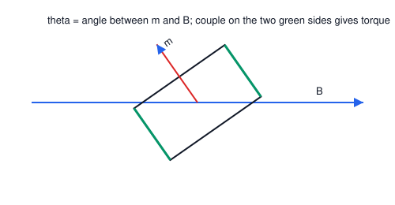

# 03. Torque on a Current-Carrying Loop

**Course:** PHY-103 (Physics–II) · **Unit:** Magnetism
**Prerequisite:** Magnetic Force on a Current-Carrying Conductor (Topic 02)
**Leads to:** Hall Effect (Topic 04, shares the current-in-field context)

---

## A. Physical Idea

Topic 02 showed that a *closed* current loop in a *uniform* field feels zero **net force**. But the individual sides of the loop still feel forces, and if the loop is not aligned with the field, those forces do not act along the same line — they form a **couple**, producing a net **torque** that tends to rotate the loop. This is exactly the principle behind electric motors and moving-coil galvanometers: current-carrying coils placed in a magnetic field experience a twisting effect that can be harnessed to do mechanical work or to deflect a pointer.

The relevant new concept is the **magnetic dipole moment** $\mathbf{m}$ of the loop, which packages the loop's current and area into a single vector, analogous to the electric dipole moment $\mathbf{p}$ in electrostatics.

## B. Definition

**Magnetic dipole moment** of a planar current loop: $\mathbf{m} = I\mathbf{A}$, where $\mathbf{A}$ is the vector area of the loop (magnitude = area, direction = normal given by the right-hand curl rule following the current direction).

> Plain-English: it's a single vector that tells you "how much current-loop" you have and which way it's facing — bigger current or bigger loop means a bigger magnetic moment.

**Torque on a magnetic dipole:** the rotational effect of a magnetic field on a current loop, tending to align $\mathbf{m}$ with $\mathbf{B}$.

> Plain-English: a current loop in a magnetic field acts like a tiny compass needle — the field tries to twist it into alignment.

## C. Governing Equations

$$
\boldsymbol{\tau} = \mathbf{m}\times\mathbf{B}, \qquad \tau = mB\sin\theta, \qquad m = IA \ \text{(single turn)}, \qquad m=NIA\ \text{(N turns)}
$$

| Symbol | Meaning |
|---|---|
| $\boldsymbol{\tau}$ | torque vector (N·m) |
| $\mathbf{m}$ | magnetic dipole moment (A·m²) |
| $\mathbf{B}$ | external magnetic flux density (T) |
| $I$ | current in the loop (A) |
| $A$ | area enclosed by the loop (m²) |
| $N$ | number of turns |
| $\theta$ | angle between $\mathbf{m}$ (loop normal) and $\mathbf{B}$ |

## D. Derivation: Torque from Forces on the Sides of a Rectangular Loop

Consider a rectangular loop of sides $a$ (horizontal) and $b$ (vertical), carrying current $I$, free to rotate about a vertical axis through its center, placed in a uniform field $\mathbf{B}$ lying in the horizontal plane. Let $\theta$ be the angle between the loop's normal $\hat{\mathbf n}$ and $\mathbf{B}$.

**Step 1 — Identify the four sides.** Label them: top and bottom (length $a$, horizontal, always perpendicular to $\mathbf{B}$ in this geometry — actually, for the standard derivation, take sides 1 and 3 (length $b$, vertical, parallel to the rotation axis) and sides 2 and 4 (length $a$, horizontal).

**Step 2 — Forces on the vertical sides (length $b$).** These sides are always perpendicular to $\mathbf{B}$ regardless of rotation angle (since $\mathbf{B}$ is horizontal and the sides are vertical, i.e., along the rotation axis... for the classical derivation we instead take sides 1 and 3 as the sides that rotate through the field). To match the standard textbook configuration: let the loop rotate about a vertical axis, with sides 1 and 3 (length $b$) horizontal and perpendicular to the axis, and sides 2 and 4 (length $a$) parallel to the axis.

- Sides 2 and 4 (length $a$, parallel to the rotation axis, i.e., vertical): current flows along $\pm\hat{\mathbf z}$ (up one side, down the other). Since $\mathbf B$ lies in the horizontal plane, the angle between these sides and $\mathbf B$ is always $90^\circ$, so each experiences a force of magnitude $F_a = BIa$, directed horizontally, perpendicular to $\mathbf B$ — these two forces are equal, opposite, and **collinear** (both act along the same horizontal line through the loop, in the plane of $\mathbf B$ and the axis), so **they produce no torque** about the vertical axis; they only tend to stretch or compress the loop.

- Sides 1 and 3 (length $b$, horizontal, perpendicular to the rotation axis): current flows in opposite horizontal directions on the two sides, each making angle $(90^\circ-\theta)$... For clarity, use the standard result directly.

**Step 3 — Standard result via sides 1 and 3.** Sides 1 and 3 (each length $b$) carry current in opposite directions and are always perpendicular to $\mathbf B$'s magnitude-component in the plane of rotation such that each feels a force:
$$
F_1 = F_3 = BIb
$$
directed perpendicular to the plane containing $\mathbf B$ and the loop's normal, i.e., these forces are equal, opposite, and **parallel but not collinear** — they are separated by a perpendicular (moment) distance.

**Step 4 — Moment arm.** The two forces $F_1$ and $F_3$ act on opposite sides of the loop, separated (measured along the loop's own plane, projected perpendicular to the force direction) by:
$$
d = a\sin\theta
$$
This is because the full separation between the sides is $a$ (when $\theta = 90°$, sides directly face the field and the lever arm is full $a$; at $\theta=0°$, the loop plane contains $\mathbf B$'s direction and the lever arm shrinks to zero — matching $a\sin\theta$).

**Step 5 — Torque from the couple.** For a couple (two equal, opposite, parallel, non-collinear forces), torque magnitude = force × perpendicular separation:
$$
\tau = F_1\cdot d = (BIb)(a\sin\theta) = BI(ab)\sin\theta
$$

**Step 6 — Substitute $A = ab$:**
$$
\tau = BIA\sin\theta = (IA)B\sin\theta = mB\sin\theta
$$

**Step 7 — Vector form.** Since the torque tends to rotate $\mathbf m$ toward $\mathbf B$, and its magnitude is $mB\sin\theta$ — exactly the magnitude of a cross product — we write:
$$
\boxed{\boldsymbol{\tau} = \mathbf{m}\times\mathbf{B}}
$$

For $N$ turns, each turn contributes independently and identically, so $\tau = NBIA\sin\theta$, i.e., $m = NIA$.

**What must be memorized:** $\boldsymbol\tau=\mathbf m\times\mathbf B$, $\tau=mB\sin\theta$, $m=NIA$.
**What must be understood:** the torque arises because two of the four sides form a force couple whose moment arm depends on $\sin\theta$; the other two sides produce forces that are collinear and contribute no torque.

## E. Vector Analysis

$$
|\boldsymbol\tau| = mB\sin\theta
$$

- $\theta=0^\circ$: $\mathbf m\parallel\mathbf B$ → $\tau=0$. This is **stable equilibrium** (loop's normal aligned with field; any small displacement creates a restoring torque).
- $\theta=90^\circ$: $\mathbf m\perp\mathbf B$ → $\tau = mB$, the **maximum torque**. This is the orientation used in moving-coil instruments (radial field design keeps $\theta\approx90^\circ$ at all times for a linear scale).
- $\theta=180^\circ$: $\mathbf m$ antiparallel to $\mathbf B$ → $\tau = 0$ again, but this is **unstable equilibrium** — any small perturbation grows rather than being restored.

**Right-hand rule for $\mathbf m$:** curl the right-hand fingers in the direction of conventional current flow around the loop; the thumb points along $\mathbf m$ (and along $\mathbf A$).

**Potential energy:** the work needed to rotate the dipole against the torque defines $U = -\mathbf m\cdot\mathbf B = -mB\cos\theta$, minimized (most stable) at $\theta=0^\circ$ and maximized (least stable) at $\theta=180^\circ$ — consistent with the equilibrium analysis above.

## F. Units and Dimensions

| Quantity | Symbol | SI Unit | Dimension |
|---|---|---|---|
| Torque | $\tau$ | newton-metre (N·m) | $\mathsf{M\,L^2\,T^{-2}}$ |
| Magnetic dipole moment | $m$ | ampere-metre² (A·m²) | $\mathsf{I\,L^2}$ |
| Magnetic flux density | $B$ | tesla (T) | $\mathsf{M\,T^{-2}\,I^{-1}}$ |

**Dimensional check:** $[mB] = (\mathsf{I\,L^2})(\mathsf{M\,T^{-2}\,I^{-1}}) = \mathsf{M\,L^2\,T^{-2}}$ = N·m. ✓

## G. Diagram

*Figure 1: Rectangular loop of area $A=ab$ carrying current $I$, tilted at angle $\theta$ from alignment with $\mathbf B$. Forces on the two vertical sides ($F=BIb$) form a couple with moment arm $a\sin\theta$, producing torque $\tau=mB\sin\theta$ that rotates $\mathbf m$ toward $\mathbf B$.*

## Definitions & Key Terms

1. **Magnetic dipole moment ($\mathbf m$)** — $\mathbf m = NI\mathbf A$ for an $N$-turn loop.
   > Plain-English: a vector "label" for a current loop that determines how strongly and in what orientation it interacts with an external field.

2. **Couple** — a pair of equal, opposite, non-collinear forces producing pure rotation with no net translational force.
   > Plain-English: two opposite pushes that don't cancel out in their turning effect, only in their straight-line effect.

3. **Stable/unstable equilibrium** (for a dipole) — $\theta=0^\circ$ (stable, $\mathbf m\parallel\mathbf B$) and $\theta=180^\circ$ (unstable, $\mathbf m$ antiparallel to $\mathbf B$).
   > Plain-English: stable means the loop "wants" to stay there and returns if nudged; unstable means the smallest nudge causes it to flip away.

## Worked Examples

### Example 1 — Foundational

**Given:** A single-turn square loop of side $8\ \text{cm}$ carries $I=2\ \text{A}$ in a field $B=0.4\ \text{T}$, with its normal at $90^\circ$ to $\mathbf B$.
**Required:** Torque.
**Principle:** $\tau = mB\sin\theta$, $m=IA$.

**Substitution:**
$$
A = (0.08)^2 = 6.4\times10^{-3}\ \text{m}^2,\qquad m = IA = (2)(6.4\times10^{-3}) = 1.28\times10^{-2}\ \text{A·m}^2
$$
$$
\tau = mB\sin90^\circ = (1.28\times10^{-2})(0.4)(1)
$$

**Algebra:**
$$
\tau = 5.12\times10^{-3}\ \text{N·m}
$$

**Unit check:** A·m²·T = N·m ✓

**Final answer:** $\boxed{\tau = 5.12\times10^{-3}\ \text{N·m}}$

**Interpretation:** With the loop's plane parallel to $\mathbf B$ (normal perpendicular to $\mathbf B$), the torque is at its maximum for these values of $I$, $A$, $B$.

---

### Example 2 — Intermediate

**Given:** A coil of $N=100$ turns, each of area $5\times10^{-3}\ \text{m}^2$, carries $I=0.5\ \text{A}$ in a field $B=0.2\ \text{T}$. The coil's normal makes $\theta=60^\circ$ with $\mathbf B$.
**Required:** Torque, and the maximum torque this coil could ever experience in this field.

**Substitution:**
$$
m = NIA = (100)(0.5)(5\times10^{-3}) = 0.25\ \text{A·m}^2
$$
$$
\tau = mB\sin60^\circ = (0.25)(0.2)(0.866)
$$

**Algebra:**
$$
\tau = 0.0433\ \text{N·m}
$$

**Maximum torque** occurs at $\theta=90^\circ$: $\tau_{max} = mB = (0.25)(0.2) = 0.05\ \text{N·m}$.

**Final answer:** $\boxed{\tau \approx 0.0433\ \text{N·m};\quad \tau_{max}=0.05\ \text{N·m}}$

**Interpretation:** This coil-in-field configuration, with a radial (rather than uniform) field, is exactly the working principle of a moving-coil galvanometer, engineered so that $\theta\approx90^\circ$ throughout the coil's swing, keeping deflection linear in $I$.

---

### Example 3 — Advanced / Exam-Level

**Given:** A circular coil of radius $r=4\ \text{cm}$, $N=60$ turns, carries current $I$, and is free to rotate about a vertical diameter in a uniform horizontal field $B=0.25\ \text{T}$. Starting from rest at $\theta=90^\circ$ (plane of coil containing $\mathbf B$, i.e., dipole moment perpendicular to $\mathbf B$), it is released and allowed to rotate toward $\theta=0^\circ$. The coil has moment of inertia $I_{rot}=3\times10^{-4}\ \text{kg·m}^2$ about the rotation axis. If $I = 1.5\ \text{A}$, estimate the angular speed as it passes through $\theta=0^\circ$, using energy conservation (ignore friction and assume the current is switched off exactly at $\theta=0$ so it doesn't overshoot due to continued torque — i.e., treat this as a conservative-energy problem up to that point).
**Required:** Angular speed $\omega$ at $\theta=0^\circ$.
**Principle:** Work done by the magnetic torque equals the loss in potential energy $U=-mB\cos\theta$, converted into rotational kinetic energy.

**Step 1 — Compute $m$:**
$$
A = \pi r^2 = \pi(0.04)^2 = 5.027\times10^{-3}\ \text{m}^2
$$
$$
m = NIA = (60)(1.5)(5.027\times10^{-3}) = 0.4524\ \text{A·m}^2
$$

**Step 2 — Potential energy at each angle:**
$$
U(\theta) = -mB\cos\theta
$$
$$
U(90^\circ) = -mB\cos90^\circ = 0
$$
$$
U(0^\circ) = -mB\cos0^\circ = -mB = -(0.4524)(0.25) = -0.1131\ \text{J}
$$

**Step 3 — Energy conservation:** Loss in $U$ = gain in rotational KE:
$$
\Delta U = U(90^\circ) - U(0^\circ) = 0 - (-0.1131) = 0.1131\ \text{J} = \frac{1}{2}I_{rot}\omega^2
$$

**Step 4 — Solve for $\omega$:**
$$
\omega^2 = \frac{2\Delta U}{I_{rot}} = \frac{2(0.1131)}{3\times10^{-4}} = 754.0\ \text{rad}^2/\text{s}^2
$$
$$
\omega = \sqrt{754.0} = 27.5\ \text{rad/s}
$$

**Unit check:** J / (kg·m²) = (kg·m²/s²)/(kg·m²) = s⁻², square root gives rad/s. ✓

**Final answer:** $\boxed{\omega \approx 27.5\ \text{rad/s}}$

**Interpretation:** This example combines the torque/energy relation of a magnetic dipole with rotational dynamics — a common exam extension that tests whether students recognize $U=-mB\cos\theta$ as the potential energy underlying $\tau=mB\sin\theta = -dU/d\theta$.

## Common Mistakes

- ❌ **Mistake:** Assuming a current loop in a uniform field feels a net force.
  ✅ **Correct:** Net force is always zero in a uniform field (Topic 02); only a net *torque* exists (unless the field is non-uniform).

- ❌ **Mistake:** Forgetting the $\sin\theta$ factor, or using $\cos\theta$ instead.
  ✅ **Correct:** Torque uses $\sin\theta$ (it is a cross product, $\boldsymbol\tau=\mathbf m\times\mathbf B$); potential energy uses $\cos\theta$ ($U=-\mathbf m\cdot\mathbf B$, a dot product). These are easily confused.

- ❌ **Mistake:** Treating $\theta=180^\circ$ (antiparallel) as a stable equilibrium just because $\tau=0$ there too.
  ✅ **Correct:** $\tau=0$ at both $\theta=0^\circ$ and $180^\circ$, but only $\theta=0^\circ$ is *stable* (restoring torque for small displacements); $\theta=180^\circ$ is unstable.

- ❌ **Mistake:** Using $m=IA$ for a multi-turn coil.
  ✅ **Correct:** For $N$ turns, $m=NIA$ — each turn contributes independently.

## Practice Problems

1. **Conceptual:** Why does a moving-coil galvanometer use a radial magnetic field (produced by curved pole pieces and a soft-iron core) rather than a simple uniform field?
2. **Short derivation:** Starting from $\tau = -\dfrac{dU}{d\theta}$ and $U=-mB\cos\theta$, derive $\tau = mB\sin\theta$.
   

   
Solution

   Step 1: $U(\theta) = -mB\cos\theta$.

   Step 2: $\tau = -\dfrac{dU}{d\theta} = -\dfrac{d}{d\theta}(-mB\cos\theta) = mB\dfrac{d}{d\theta}(\cos\theta)$... careful with sign: $\dfrac{d}{d\theta}(-mB\cos\theta) = mB\sin\theta$, so $\tau = -mB\sin\theta$... 

   Correction: $\tau = -\dfrac{dU}{d\theta} = -(mB\sin\theta) = -mB\sin\theta$. The sign indicates the torque acts to *decrease* $\theta$ (restoring), and the magnitude is $mB\sin\theta$.

   **Answer:** $|\tau| = mB\sin\theta$, directed so as to reduce $\theta$ (align $\mathbf m$ with $\mathbf B$).
   

3. **Numerical:** A 40-turn rectangular coil, $6\ \text{cm}\times4\ \text{cm}$, carries $0.8\ \text{A}$ in a $0.5\ \text{T}$ field at $\theta=45^\circ$. Find the torque.
   

   
Solution

   $A = 0.06\times0.04 = 2.4\times10^{-3}\ \text{m}^2$; $m=NIA=(40)(0.8)(2.4\times10^{-3})=0.0768\ \text{A·m}^2$.

   $\tau = mB\sin45^\circ = (0.0768)(0.5)(0.7071) = 0.02715\ \text{N·m}$

   **Answer:** $\tau \approx 0.0272\ \text{N·m}$
   

4. **Vector/direction:** A loop's magnetic moment points along $+\hat{\mathbf x}$; the external field is $\mathbf B = B\hat{\mathbf y}$. Find the direction of the torque and describe the resulting initial rotation.
   

   
Solution

   $\boldsymbol\tau = \mathbf m\times\mathbf B = (m\hat{\mathbf x})\times(B\hat{\mathbf y}) = mB(\hat{\mathbf x}\times\hat{\mathbf y}) = mB\hat{\mathbf z}$.

   **Answer:** Torque points along $+\hat{\mathbf z}$; the loop begins rotating so as to swing $\mathbf m$ from $+\hat x$ toward $+\hat y$ (i.e., counterclockwise when viewed from $+z$), aligning $\mathbf m$ with $\mathbf B$.
   

5. **Exam-style, multi-step:** A galvanometer coil (N=50, A=3×10⁻⁴ m², radial field B=0.1 T) has a restoring spring with torsional constant $k=2\times10^{-6}\ \text{N·m/rad}$. Find the current needed to produce a steady deflection of $30^\circ$ ($=\pi/6\ \text{rad}$), assuming the radial field keeps the torque at its maximum value ($\theta=90^\circ$ between coil normal and local field) throughout the deflection.
   

   
Solution

   Step 1: At equilibrium deflection, magnetic torque = restoring spring torque: $NBIA = k\phi$, where $\phi$ is the deflection angle.

   Step 2: $\phi = \pi/6 = 0.5236\ \text{rad}$.

   Step 3: Solve for $I$: $I = \dfrac{k\phi}{NBA} = \dfrac{(2\times10^{-6})(0.5236)}{(50)(0.1)(3\times10^{-4})}$.

   Step 4: Numerator $=1.047\times10^{-6}$; denominator $=1.5\times10^{-3}$.

   $$I = \frac{1.047\times10^{-6}}{1.5\times10^{-3}} = 6.98\times10^{-4}\ \text{A}$$

   **Answer:** $I \approx 0.70\ \text{mA}$
   

## Summary

| Concept | Key Result | Condition / Limit |
|---|---|---|
| Dipole moment | $\mathbf m = NI\mathbf A$ | Planar loop, $N$ turns |
| Torque | $\boldsymbol\tau = \mathbf m\times\mathbf B$, $\tau=mB\sin\theta$ | Uniform field |
| Maximum torque | $\theta=90^\circ$ | $\mathbf m\perp\mathbf B$ |
| Zero torque | $\theta=0^\circ$ (stable), $180^\circ$ (unstable) | $\mathbf m\parallel$ or antiparallel to $\mathbf B$ |
| Potential energy | $U=-\mathbf m\cdot\mathbf B=-mB\cos\theta$ | — |
| Net force (uniform field) | $F_{net}=0$ | Any closed loop |

The dipole-moment idea generalizes directly to individual moving charges (electrons in atoms), which is the microscopic starting point for classifying magnetic materials in Topic 09; it also sets up the current-and-field context needed for the Hall effect, discussed next.
