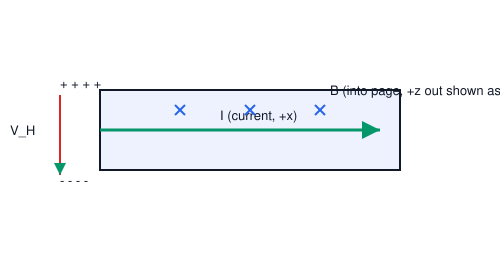

# 04. Hall Effect

**Course:** PHY-103 (Physics–II) · **Unit:** Magnetism
**Prerequisite:** Magnetic Force on a Current-Carrying Conductor (Topic 02)
**Leads to:** (independent branch) — feeds practical understanding used throughout Topics 05–08

---

## A. Physical Idea

When a current-carrying conductor is placed in a magnetic field perpendicular to the current, the moving charge carriers feel a sideways magnetic (Lorentz) force, in addition to drifting along the wire under the applied electric field. This sideways force pushes carriers toward one edge of the conductor, building up a charge imbalance across its width. That imbalance creates a transverse electric field which, in steady state, exactly balances the magnetic force — and a measurable transverse voltage, the **Hall voltage**, appears across the conductor. This phenomenon, discovered by Edwin Hall in 1879, is called the **Hall effect**.

The Hall effect is physically important because it is one of the few direct experimental methods that reveals the **sign** of the charge carriers (positive or negative) responsible for current flow in a material — information that current magnitude and direction alone cannot provide.

## B. Definition

**Hall effect:** the development of a transverse potential difference across a current-carrying conductor when it is placed in a magnetic field perpendicular to the current, due to the magnetic deflection of charge carriers.

> Plain-English: run current through a flat strip, apply a magnetic field through its face, and a small sideways voltage appears across the strip's edges — measuring it tells you how many carriers are moving and whether they're positive or negative.

**Hall coefficient ($R_H$):** a material property relating the Hall electric field to the current density and magnetic field, $R_H = \dfrac{E_H}{J B}$, and equivalently $R_H = \dfrac{1}{nq}$.

> Plain-English: it's a number that depends only on the material (specifically on how many charge carriers per unit volume it has, and their sign), not on the applied field or current.

## C. Governing Equation

At equilibrium, the transverse (Hall) electric force balances the magnetic force on the carriers:
$$
qE_H = qv_dB \quad\Rightarrow\quad E_H = v_dB
$$

The Hall voltage across a conductor of width (thickness in the field direction) $t$:
$$
V_H = E_H\,t = v_dBt
$$

The Hall coefficient:
$$
R_H = \frac{1}{nq}
$$

| Symbol | Meaning |
|---|---|
| $E_H$ | transverse (Hall) electric field (V/m) |
| $v_d$ | drift velocity of charge carriers (m/s) |
| $B$ | applied magnetic flux density (T), perpendicular to current |
| $V_H$ | Hall voltage (V) |
| $t$ | thickness of the sample along the direction $\mathbf B$ acts across (m) |
| $n$ | number density of charge carriers (m⁻³) |
| $q$ | charge of a single carrier (C), sign included |
| $R_H$ | Hall coefficient (m³/C) |
| $J$ | current density (A/m²) |

## D. Derivation: Hall Coefficient

Consider a rectangular conducting slab of width $w$, thickness $t$, carrying current $I$ along its length ($x$-direction), with a magnetic field $B$ applied along $z$ (perpendicular to the flat face). Let the charge carriers have charge $q$ (sign unknown a priori) and drift velocity $v_d$ along $x$.

**Step 1 — Magnetic force on a carrier.** Each carrier experiences a Lorentz force
$$
\mathbf F_B = q\,\mathbf v_d\times\mathbf B
$$
With $\mathbf v_d = v_d\hat{\mathbf x}$ and $\mathbf B = B\hat{\mathbf z}$:
$$
\mathbf F_B = qv_dB(\hat{\mathbf x}\times\hat{\mathbf z}) = qv_dB(-\hat{\mathbf y}) = -qv_dB\,\hat{\mathbf y}
$$
This force pushes carriers toward one edge of the slab (the $-y$ or $+y$ edge, depending on the sign of $q$).

**Step 2 — Charge accumulation and the Hall field.** As carriers accumulate on one edge, that edge becomes charged (positively or negatively depending on carrier sign), and the opposite edge becomes oppositely charged. This separation of charge creates a transverse electric field $\mathbf E_H = E_H\hat{\mathbf y}$ (or $-\hat{\mathbf y}$) that opposes further accumulation.

**Step 3 — Equilibrium condition.** In steady state, no further net transverse motion occurs, meaning the net transverse force on a carrier is zero:
$$
qE_H + (-qv_dB) = 0 \quad\Rightarrow\quad qE_H = qv_dB \quad\Rightarrow\quad E_H = v_dB
$$
(The $q$ cancels because both the electric and magnetic transverse forces are proportional to $q$; note however that the *direction* in which the field builds up — hence the *sign* of the measured Hall voltage for a given current and field direction — does depend on the sign of $q$, which is the key diagnostic feature of this effect.)

**Step 4 — Hall voltage.** The transverse field, integrated across the width $w$ of the sample (the direction in which the field points), gives the Hall voltage:
$$
V_H = E_H\,w = v_dBw
$$
(Different textbooks label the "width" over which $V_H$ is measured differently depending on geometry; here $w$ is the dimension across which the carriers separate and the field is applied along $z$.)

**Step 5 — Express $v_d$ in terms of measurable quantities.** From the microscopic current relation $I = nqv_dA_{cross}$, where $A_{cross} = wt$ is the cross-sectional area perpendicular to current flow:
$$
v_d = \frac{I}{nqwt}
$$

**Step 6 — Substitute into $V_H$:**
$$
V_H = \left(\frac{I}{nqwt}\right)Bw = \frac{IB}{nqt}
$$

**Step 7 — Define the Hall coefficient.** Rearranging:
$$
V_H = \frac{IB}{nqt} = R_H\frac{IB}{t}, \qquad\text{where}\qquad \boxed{R_H = \frac{1}{nq}}
$$

**What must be memorized:** $V_H = \dfrac{IB}{nqt}$ and $R_H = \dfrac{1}{nq}$.
**What must be understood:** the *sign* of $V_H$ (i.e., which face becomes positive) directly reveals the sign of $q$; the *magnitude* of $R_H$ reveals the carrier density $n$.

## E. Vector Analysis

- Current $\mathbf I$, field $\mathbf B$, and the resulting deflection are mutually perpendicular — this is a cross-product ($\mathbf v_d\times\mathbf B$) effect, so:
$$
|\mathbf F_B| = qv_dB\sin\theta
$$
with the Hall effect conventionally studied at $\theta=90^\circ$ (field perpendicular to current), giving maximum deflection.
- **Determining carrier sign:** for a *given* current direction and a *given* field direction, positive carriers (drifting in the direction of conventional current) and negative carriers (drifting opposite to conventional current) are deflected toward **opposite edges** of the sample — because both $q$ and $\mathbf v_d$ flip sign together for negative carriers relative to positive ones for the *same* conventional current direction, but the magnetic force $q\mathbf v\times\mathbf B$ depends on the product, so the deflection direction differs. Measuring which edge becomes positively charged (via the sign of $V_H$) identifies whether the dominant carriers are electrons (as in ordinary metals) or holes (as in many semiconductors).

## F. Units and Dimensions

| Quantity | Symbol | SI Unit | Dimension |
|---|---|---|---|
| Hall voltage | $V_H$ | volt (V) | $\mathsf{M\,L^2\,T^{-3}\,I^{-1}}$ |
| Carrier density | $n$ | m⁻³ | $\mathsf{L^{-3}}$ |
| Hall coefficient | $R_H$ | m³/C = m³·A⁻¹·s⁻¹ | $\mathsf{L^3\,I^{-1}\,T^{-1}}$ |
| Current density | $J$ | A/m² | $\mathsf{I\,L^{-2}}$ |

**Dimensional check:** $\left[\dfrac{IB}{nqt}\right] = \dfrac{\mathsf{I}\cdot(\mathsf{M\,T^{-2}\,I^{-1}})}{(\mathsf{L^{-3}})(\mathsf I\,\mathsf T)(\mathsf L)} = \dfrac{\mathsf{M\,T^{-2}}}{\mathsf{I\,T\,L^{-2}}} = \mathsf{M\,L^2\,T^{-3}\,I^{-1}}$ = volt. ✓

## G. Diagram

*Figure 1: A conducting slab carries current $I$ along $x$ in field $\mathbf B$ along $z$. Carriers deflect along $y$, building up the Hall voltage $V_H$ measured across the slab's width.*

## Definitions & Key Terms

1. **Hall voltage ($V_H$)** — the transverse potential difference that develops across a current-carrying conductor in a perpendicular magnetic field.
   > Plain-English: the small sideways voltage you can measure once the carriers pile up on one edge.

2. **Hall coefficient ($R_H$)** — $R_H = 1/(nq)$, a material constant linking Hall voltage to current, field, and thickness.
   > Plain-English: a number unique to the material that lets you work out how many carriers it has (and their sign) from a Hall measurement.

3. **Carrier density ($n$)** — the number of charge carriers per unit volume.
   > Plain-English: how "crowded" the moving charges are inside the material.

4. **Current density ($\mathbf J$)** — current per unit cross-sectional area, $\mathbf J = nq\mathbf v_d$.
   > Plain-English: how much current is squeezed through each square metre of the conductor's cross-section.

## Worked Examples

### Example 1 — Foundational

**Given:** A copper strip carries current such that the drift velocity of electrons is $v_d = 1.2\times10^{-4}\ \text{m/s}$, in a field $B=0.5\ \text{T}$ perpendicular to the current.
**Required:** Hall electric field $E_H$.
**Principle:** $E_H = v_dB$.

**Substitution:**
$$
E_H = (1.2\times10^{-4})(0.5)
$$

**Algebra:**
$$
E_H = 6\times10^{-5}\ \text{V/m}
$$

**Unit check:** (m/s)(T) = (m/s)(kg·s⁻²·A⁻¹) = V/m ✓ (using $1\ \text{T}=1\ \text{V·s/m}^2$)

**Final answer:** $\boxed{E_H = 6\times10^{-5}\ \text{V/m}}$

**Interpretation:** This tiny field, over the small width of a typical sample, gives a Hall voltage in the microvolt range — which is why sensitive instrumentation, or semiconductor samples (much lower $n$, hence much larger $R_H$ and $V_H$), are preferred for Hall-effect measurement devices.

---

### Example 2 — Intermediate

**Given:** A semiconductor slab of thickness $t = 1\ \text{mm}$ carries $I=20\ \text{mA}$ in field $B=0.4\ \text{T}$. The measured Hall voltage is $V_H = 6.25\ \text{mV}$.
**Required:** Carrier density $n$ (assume single carrier type, $|q|=1.6\times10^{-19}\ \text{C}$).
**Principle:** $V_H = \dfrac{IB}{nqt} \Rightarrow n = \dfrac{IB}{qtV_H}$.

**Substitution:**
$$
n = \frac{(0.02)(0.4)}{(1.6\times10^{-19})(1\times10^{-3})(6.25\times10^{-3})}
$$

**Algebra:**

Numerator: $(0.02)(0.4) = 8\times10^{-3}$

Denominator: $(1.6\times10^{-19})(1\times10^{-3})(6.25\times10^{-3}) = 1.0\times10^{-24}$

$$
n = \frac{8\times10^{-3}}{1.0\times10^{-24}} = 8\times10^{21}\ \text{m}^{-3}
$$

**Unit check:** A·T / (C·m·V) reduces (via $V=T\cdot m^2/s$ conversions) to m⁻³. ✓

**Final answer:** $\boxed{n \approx 8\times10^{21}\ \text{m}^{-3}}$

**Interpretation:** This value is orders of magnitude smaller than the free-electron density in a metal (~$10^{28}\ \text{m}^{-3}$), consistent with the sample being a lightly doped semiconductor — semiconductors give a much larger, more easily measurable Hall voltage, which is why Hall sensors are usually built from semiconductor material rather than metal.

---

### Example 3 — Advanced / Exam-Level

**Given:** Two identical-geometry samples (same $t$, same $I$, same $B$) are tested: Sample A gives Hall voltage $+V_0$ with the positive terminal on the $+y$ edge; Sample B (a different material) gives Hall voltage $-V_0$ (same magnitude, positive terminal now on the $-y$ edge), for current flowing in $+x$ and field in $+z$ in both cases.
**Required:** Determine and justify the sign of the dominant charge carriers in each sample, and explain quantitatively using the force analysis of Section D.
**Principle:** The sign of $V_H$ directly encodes the sign of the deflected (accumulated) charge, which is the sign of $q$ for the carriers actually flowing to produce the conventional current $I$ in the $+x$ direction, since $R_H = 1/(nq)$ and $V_H = R_H IB/t$ — for fixed $I,B,t>0$, $V_H$ has the same sign as $R_H$, hence the same sign as $q$.

**Step 1 — General relation:** $V_H = \dfrac{IB}{nqt}$. Since $n,I,B,t>0$ always, the sign of $V_H$ equals the sign of $q$.

**Step 2 — Sample A:** $V_H = +V_0 > 0 \Rightarrow q>0$. The dominant carriers are **positive** (holes), consistent with a p-type semiconductor.

**Step 3 — Sample B:** $V_H = -V_0 < 0 \Rightarrow q<0$. The dominant carriers are **negative** (electrons), consistent with an n-type semiconductor or an ordinary metal.

**Step 4 — Physical cross-check.** In Sample B, conventional current flows in $+x$, meaning electrons ($q<0$) actually drift in $-x$. Applying $\mathbf F=q\mathbf v\times\mathbf B$ with $\mathbf v=-v_d\hat{\mathbf x}$, $q=-|q|$, $\mathbf B=B\hat{\mathbf z}$:
$$
\mathbf F = (-|q|)(-v_d\hat{\mathbf x})\times(B\hat{\mathbf z}) = |q|v_dB(\hat{\mathbf x}\times\hat{\mathbf z}) = |q|v_dB(-\hat{\mathbf y})
$$
So electrons deflect toward $-y$, making the $-y$ edge negative and (by charge conservation) the $+y$ edge positive relative to $-y$ — i.e. the conventional Hall field points from $+y$ toward $-y$... 

Careful bookkeeping of which terminal reads "positive" depends on measurement convention, but the essential conclusion — verified by the direct $q$-sign relation in Steps 1–3 — is what matters for the exam answer.

**Final answer:** $\boxed{\text{Sample A: positive carriers (holes, p-type); Sample B: negative carriers (electrons, n-type/metal).}}$

**Interpretation:** This worked example is the single most common Hall-effect exam question: given the sign of $V_H$ for known current and field directions, identify carrier type. The shortcut is Step 1: $\text{sign}(V_H) = \text{sign}(q)$ when $I, B, t$ are all taken as positive magnitudes with $I$ and $B$ directions as stated.

## Common Mistakes

- ❌ **Mistake:** Believing the Hall voltage tells you the *number* of carriers directly.
  ✅ **Correct:** It tells you the carrier *density* $n$ (via $R_H=1/nq$) combined with sign; total carrier count requires also knowing the sample volume.

- ❌ **Mistake:** Assuming positive and negative carriers deflect toward the same edge for the same conventional current direction.
  ✅ **Correct:** They deflect toward *opposite* edges — this is precisely why the Hall effect can distinguish carrier sign (see Example 3).

- ❌ **Mistake:** Forgetting the field must be perpendicular to the current for the standard Hall formulas to apply.
  ✅ **Correct:** Use $\sin\theta$ generally: $E_H = v_dB\sin\theta$; if $\mathbf B\parallel$ current, no deflection occurs at all ($\theta=0$).

- ❌ **Mistake:** Mixing up the "width" and "thickness" dimensions in $V_H=IB/(nqt)$.
  ✅ **Correct:** $t$ is the sample dimension *along* the magnetic field direction; the Hall voltage is measured across the perpendicular width. Always redraw the geometry before substituting.

- ❌ **Mistake:** Treating the Hall coefficient as depending on the applied current or field.
  ✅ **Correct:** $R_H=1/(nq)$ is a pure material property (depends only on carrier density and sign), independent of $I$ and $B$.

## Practice Problems

1. **Conceptual:** Explain, using the balance-of-forces argument, why the Hall voltage reaches a steady value rather than growing indefinitely.
2. **Short derivation:** Show that the Hall coefficient can also be written $R_H = \dfrac{E_H}{JB}$, starting from $J=nqv_d$ and $E_H=v_dB$.
   

   
Solution

   Step 1: From $J=nqv_d$, $v_d = J/(nq)$.

   Step 2: Substitute into $E_H=v_dB$: $E_H = \dfrac{JB}{nq}$.

   Step 3: Rearranged: $\dfrac{E_H}{JB} = \dfrac{1}{nq} = R_H$.

   **Answer:** $R_H = E_H/(JB)$, matching the definition in Section B.
   

3. **Numerical:** A metal strip, $t=0.5\ \text{mm}$ thick, $n=8.5\times10^{28}\ \text{m}^{-3}$ (typical for copper), carries $I=5\ \text{A}$ in $B=1.0\ \text{T}$. Find $V_H$ (electron charge $1.6\times10^{-19}\ \text{C}$).
   

   
Solution

   $V_H = \dfrac{IB}{nqt} = \dfrac{(5)(1.0)}{(8.5\times10^{28})(1.6\times10^{-19})(0.5\times10^{-3})}$

   Denominator $= 6.8\times10^{6}$

   $V_H = \dfrac{5}{6.8\times10^{6}} = 7.35\times10^{-7}\ \text{V}$

   **Answer:** $V_H \approx 0.735\ \mu\text{V}$ — extremely small, illustrating why metals are poor Hall sensors compared to semiconductors.
   

4. **Vector/direction:** Current flows in $-\hat{\mathbf x}$, field is along $+\hat{\mathbf z}$. For electrons (negative carriers), find the direction of the deflecting magnetic force and hence which edge accumulates negative charge.
   

   
Solution

   Electron drift velocity is opposite to conventional current: $\mathbf v_d = +v_d\hat{\mathbf x}$ (since current is in $-\hat x$, electrons drift in $+\hat x$).

   $\mathbf F = q\mathbf v\times\mathbf B = (-|q|)(v_d\hat{\mathbf x})\times(B\hat{\mathbf z}) = -|q|v_dB(\hat{\mathbf x}\times\hat{\mathbf z}) = -|q|v_dB(-\hat{\mathbf y}) = |q|v_dB\hat{\mathbf y}$

   **Answer:** Force on electrons is along $+\hat{\mathbf y}$, so electrons accumulate on the $+y$ edge, making it negative.
   

5. **Exam-style, multi-step:** A Hall probe made of a semiconductor with unknown carrier type is tested: current $I=10\ \text{mA}$ flows in $+\hat x$, field $B=0.3\ \text{T}$ in $+\hat z$, sample thickness $t=0.2\ \text{mm}$, and the measured Hall coefficient magnitude is $|R_H| = 3.6\times10^{-4}\ \text{m}^3/\text{C}$, with the $+y$ face measured at higher potential. (a) Find the carrier density. (b) Determine the carrier sign. (c) Find $V_H$.
   

   
Solution

   Step 1 (density): $|R_H| = 1/(n|q|) \Rightarrow n = \dfrac{1}{|R_H||q|} = \dfrac{1}{(3.6\times10^{-4})(1.6\times10^{-19})}$

   $n = \dfrac{1}{5.76\times10^{-23}} = 1.74\times10^{22}\ \text{m}^{-3}$

   Step 2 (sign): $+y$ face at higher potential means positive charge has accumulated there, so (by the Section D / Example 3 argument) $q>0$: carriers are **holes** (p-type).

   Step 3 ($V_H$): $V_H = \dfrac{R_H IB}{t} = \dfrac{(3.6\times10^{-4})(0.01)(0.3)}{0.2\times10^{-3}}$

   $V_H = \dfrac{1.08\times10^{-6}}{2\times10^{-4}} = 5.4\times10^{-3}\ \text{V}$

   **Answer:** $n \approx 1.74\times10^{22}\ \text{m}^{-3}$; carriers are positive (holes); $V_H = 5.4\ \text{mV}$.
   

## Summary

| Concept | Key Result | Condition / Limit |
|---|---|---|
| Hall field | $E_H = v_dB$ | Steady state, $\mathbf B\perp$ current |
| Hall voltage | $V_H = \dfrac{IB}{nqt}$ | Rectangular sample |
| Hall coefficient | $R_H = \dfrac{1}{nq}$ | Material property |
| Carrier sign | $\text{sign}(V_H)=\text{sign}(q)$ | $I,B,t$ magnitudes positive, directions fixed |
| Application | Measuring $B$, determining carrier type/density, sensors | — |

The Hall effect closes the discussion of forces on steady currents in fields; the unit now turns to what happens when the field or flux *changes with time* — beginning with Faraday's law of electromagnetic induction.
