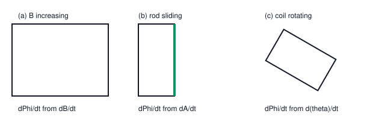

# 05. Faraday's Law of Electromagnetic Induction

**Course:** PHY-103 (Physics–II) · **Unit:** Magnetism
**Prerequisite:** Magnetic Induction / Flux (Topic 01)
**Leads to:** Lenz's Law (Topic 06), Self-Induction (Topic 07)

---

## A. Physical Idea

Topics 01–04 dealt with **static** currents and fields — a steady current in a steady field feels forces and torques, but nothing about the field itself changes with time. Michael Faraday discovered (1831) something qualitatively new: a *changing* magnetic flux through a circuit generates an electromotive force (emf) in that circuit, even without any battery. This is **electromagnetic induction**, and it is the working principle behind every electric generator, transformer, and induction motor.

Crucially, it does not matter *why* the flux is changing — whether $B$ itself is changing in time, the area of the circuit is changing, or the orientation of the circuit relative to $\mathbf B$ is changing — only the *rate of change of flux* matters.

## B. Definition

**Electromagnetic induction:** the production of an emf (and hence, in a closed circuit, a current) due to a change in magnetic flux linked with a circuit.

> Plain-English: whenever the "amount" of magnetic field passing through a loop changes, that loop develops a voltage — even with no battery anywhere in sight.

**Faraday's laws (qualitative statement):**
1. Whenever the magnetic flux linked with a circuit changes, an emf is induced in the circuit.
2. The magnitude of the induced emf is proportional to the rate of change of flux linkage.

## C. Governing Equation

$$
\mathcal{E} = -\frac{d\Phi_B}{dt} \qquad\text{(single loop)}\qquad\qquad \mathcal{E} = -N\frac{d\Phi_B}{dt}\qquad\text{(N turns)}
$$

| Symbol | Meaning |
|---|---|
| $\mathcal{E}$ | induced electromotive force (V) |
| $\Phi_B$ | magnetic flux through one turn of the circuit (Wb) |
| $N$ | number of turns |
| $t$ | time (s) |

## D. Derivation / Justification

Faraday's law, unlike the force laws of Topics 02–04, is fundamentally an **experimental law** — it is not derived from more basic principles within classical electromagnetism at this level (in advanced treatments it follows from the Maxwell–Faraday equation, $\nabla\times\mathbf E = -\partial\mathbf B/\partial t$, itself an empirical postulate of Maxwell's equations). What can be derived, however, is the *consistency* of the law with the flux definition and with the motional-emf picture. We derive the motional-emf special case explicitly, since it shows the mechanism concretely.

**Special case: motional emf.** Consider a conducting rod of length $\ell$ sliding with velocity $v$ along two rails, in a uniform field $B$ perpendicular to the plane of the rails, such that the enclosed circuit area increases as the rod moves.

**Step 1.** A charge carrier (charge $q$) inside the moving rod moves with the rod's velocity $\mathbf v$ (plus its own drift, which we ignore as a small correction) and so, in field $\mathbf B$, feels a force $\mathbf F = q\mathbf v\times\mathbf B$, of magnitude $F = qvB$ (rod perpendicular to $\mathbf B$ and to $\mathbf v$), directed along the rod's length.

**Step 2.** This force does work on the charge as it moves along the rod's length $\ell$; the work done per unit charge, integrated along the rod, defines the motional emf:
$$
\mathcal{E} = \int_0^\ell \frac{F}{q}\,d\ell' = \int_0^\ell vB\,d\ell' = vB\ell
$$
(assuming $v$, $B$ uniform along the rod).

**Step 3.** Now compute $d\Phi_B/dt$ directly. If the rod is at position $x$ at time $t$, the enclosed area is $A = \ell x$, so:
$$
\Phi_B = B\ell x
$$
$$
\frac{d\Phi_B}{dt} = B\ell\frac{dx}{dt} = B\ell v
$$

**Step 4.** Comparing Steps 2 and 3:
$$
\mathcal{E} = B\ell v = \frac{d\Phi_B}{dt}
$$
which matches Faraday's law in magnitude; the minus sign (Lenz's law, Topic 06) fixes the direction/polarity of $\mathcal E$ so that the induced current opposes the increasing flux.

**What must be memorized:** $\mathcal E = -N\,d\Phi_B/dt$.
**What must be understood:** the law is empirical/fundamental, but the motional-emf case shows explicitly *why* it holds — it is the Lorentz force acting on carriers in a conductor whose geometry relative to the field is changing.

## E. Vector/Directional Analysis and the Three Ways Flux Can Change

Since $\Phi_B = \int\mathbf B\cdot d\mathbf A = BA\cos\theta$ for a uniform field over a flat loop, its time derivative can arise from *any* of the three factors changing:

1. **$B$ changing, $A,\theta$ fixed:** $\dfrac{d\Phi_B}{dt} = A\cos\theta\,\dfrac{dB}{dt}$ — e.g., a stationary loop near a solenoid whose current (and hence field) is varying.
2. **$A$ changing, $B,\theta$ fixed:** $\dfrac{d\Phi_B}{dt} = B\cos\theta\,\dfrac{dA}{dt}$ — e.g., the sliding-rod motional-emf case above, or a loop being stretched/shrunk.
3. **$\theta$ changing, $B,A$ fixed:** $\dfrac{d\Phi_B}{dt} = -BA\sin\theta\,\dfrac{d\theta}{dt}$ — e.g., a coil rotating in a uniform field (the basis of an AC generator).

Any real situation may combine two or three of these simultaneously, in which case the product rule must be applied to all three factors:
$$
\frac{d\Phi_B}{dt} = \frac{dB}{dt}A\cos\theta + B\frac{dA}{dt}\cos\theta - BA\sin\theta\frac{d\theta}{dt}
$$

**The negative sign:** it encodes Lenz's law — the induced emf always acts in the direction that would oppose the *change* producing it (fully explored in Topic 06). Losing this sign does not affect the *magnitude* calculations in most exam numericals, but it is essential for determining current *direction*.

## F. Units and Dimensions

| Quantity | Symbol | SI Unit | Dimension |
|---|---|---|---|
| Induced emf | $\mathcal E$ | volt (V) | $\mathsf{M\,L^2\,T^{-3}\,I^{-1}}$ |
| Magnetic flux | $\Phi_B$ | weber (Wb) | $\mathsf{M\,L^2\,T^{-2}\,I^{-1}}$ |
| Time | $t$ | second (s) | $\mathsf T$ |

**Dimensional check:** $[d\Phi_B/dt] = \mathsf{M\,L^2\,T^{-2}\,I^{-1}}/\mathsf T = \mathsf{M\,L^2\,T^{-3}\,I^{-1}}$ = volt. ✓

## G. Diagram

*Figure 1: Three ways flux can change through a loop — (a) $B$ increasing with fixed loop, (b) area increasing via a sliding rod, (c) loop rotating in a fixed field. Each induces an emf $\mathcal E = -d\Phi_B/dt$.*

## Definitions & Key Terms

1. **Electromotive force (emf), $\mathcal E$** — the energy per unit charge supplied by a source (here, by the changing flux) that drives current around a circuit.
   > Plain-English: the "push" that drives current, measured in volts, even though it isn't a simple resistive voltage drop.

2. **Flux linkage, $N\Phi_B$** — the total flux "linked" by all $N$ turns of a coil, treated as if each turn contributes independently.
   > Plain-English: multiply the flux through one loop by the number of loops to get the total effective flux for a coil.

3. **Motional emf** — emf generated specifically because a conductor moves through a magnetic field, changing the enclosed area.
   > Plain-English: the voltage that appears just from physically dragging a wire through a field.

## Worked Examples

### Example 1 — Foundational

**Given:** The flux through a single loop changes uniformly from $2\times10^{-3}\ \text{Wb}$ to $5\times10^{-3}\ \text{Wb}$ in $0.5\ \text{s}$.
**Required:** Magnitude of induced emf.
**Principle:** $|\mathcal E| = |\Delta\Phi_B/\Delta t|$ (uniform rate).

**Substitution:**
$$
|\mathcal E| = \frac{(5\times10^{-3})-(2\times10^{-3})}{0.5}
$$

**Algebra:**
$$
|\mathcal E| = \frac{3\times10^{-3}}{0.5} = 6\times10^{-3}\ \text{V}
$$

**Unit check:** Wb/s = V ✓

**Final answer:** $\boxed{|\mathcal E| = 6\ \text{mV}}$

**Interpretation:** The direction (sign) of this emf depends on the loop's chosen orientation and is determined separately using Lenz's law (Topic 06).

---

### Example 2 — Intermediate

**Given:** A 200-turn coil of area $4\times10^{-3}\ \text{m}^2$ sits with its plane perpendicular to a field that varies as $B(t) = 0.05t^2\ \text{T}$ (t in seconds).
**Required:** Induced emf at $t=3\ \text{s}$.
**Principle:** $\mathcal E = -N\,d\Phi_B/dt = -NA\,dB/dt$ (area and orientation fixed).

**Step 1 — Differentiate $B(t)$:**
$$
\frac{dB}{dt} = 0.10t
$$
At $t=3\ \text{s}$: $\dfrac{dB}{dt} = 0.30\ \text{T/s}$.

**Step 2 — Substitute:**
$$
\mathcal E = -N A\frac{dB}{dt} = -(200)(4\times10^{-3})(0.30)
$$

**Algebra:**
$$
\mathcal E = -0.24\ \text{V}
$$

**Unit check:** (turns)(m²)(T/s) = V ✓

**Final answer:** $\boxed{|\mathcal E| = 0.24\ \text{V}}$ (magnitude; the negative sign indicates the emf opposes the increasing flux, per Lenz's law)

**Interpretation:** Because $B(t)$ is quadratic, the induced emf itself grows *linearly* with time — a common source of exam confusion when students forget to differentiate before substituting the specific time.

---

### Example 3 — Advanced / Exam-Level

**Given:** A rectangular loop of width $\ell = 0.2\ \text{m}$ has one side free to slide, starting at $x_0=0$ at $t=0$ with the enclosed area increasing as the sliding side moves with velocity $v(t) = 2t\ \text{m/s}$ (starting from rest, uniformly accelerating), in a uniform field $B=0.6\ \text{T}$ perpendicular to the loop's plane.
**Required:** Induced emf as a function of time, and its value at $t=2\ \text{s}$.
**Principle:** $\mathcal E = -B\ell\,\dfrac{dx}{dt} = -B\ell v(t)$ (motional emf, area changing).

**Step 1 — Express area as a function of time.** Since $v(t)=2t$, position $x(t) = \int_0^t v\,dt' = \int_0^t 2t'\,dt' = t^2$.

**Step 2 — Flux as a function of time:**
$$
\Phi_B(t) = B\ell x(t) = B\ell t^2
$$

**Step 3 — Differentiate:**
$$
\mathcal E(t) = -\frac{d\Phi_B}{dt} = -B\ell(2t) = -2B\ell t
$$

**Step 4 — Substitute values** ($B=0.6\ \text{T}$, $\ell=0.2\ \text{m}$):
$$
\mathcal E(t) = -2(0.6)(0.2)t = -0.24t\ \text{V}
$$

**Step 5 — Evaluate at $t=2\ \text{s}$:**
$$
\mathcal E(2) = -0.24(2) = -0.48\ \text{V}
$$

**Unit check:** T·m·(m/s) = V ✓ (since motional-emf form $B\ell v$ has units T·m·m/s = V)

**Final answer:** $\boxed{\mathcal E(t) = -0.24t\ \text{V};\quad |\mathcal E(2\ \text{s})| = 0.48\ \text{V}}$

**Interpretation:** Because the sliding side accelerates, the emf grows linearly with time rather than staying constant — this exam-style problem tests whether the student can combine kinematics (finding $x(t)$ from $v(t)$) with Faraday's law, rather than simply plugging into $\mathcal E = B\ell v$ at a single instant without accounting for the full time-dependence via differentiation of flux.

## Common Mistakes

- ❌ **Mistake:** Assuming flux can only change because $B$ changes.
  ✅ **Correct:** Flux changes whenever $B$, $A$, or $\theta$ (or any combination) changes — always identify *which* factor(s) are varying before differentiating.

- ❌ **Mistake:** Dropping the negative sign and then getting the current direction wrong.
  ✅ **Correct:** Keep the sign symbolically through the calculation; interpret it via Lenz's law (Topic 06) for direction, while using the magnitude for numerical answers unless direction is explicitly asked.

- ❌ **Mistake:** Using average rate ($\Delta\Phi_B/\Delta t$) when the flux changes non-uniformly (e.g., $B(t)=kt^2$).
  ✅ **Correct:** For non-uniform (non-linear-in-time) changes, differentiate $\Phi_B(t)$ properly; $\Delta\Phi_B/\Delta t$ only gives the *average* emf over the interval, not the instantaneous value.

- ❌ **Mistake:** Forgetting to multiply by $N$ for a multi-turn coil.
  ✅ **Correct:** $\mathcal E = -N\,d\Phi_B/dt$; each turn contributes its own emf, and turns in series add.

- ❌ **Mistake:** Confusing units — writing flux in tesla or emf in weber.
  ✅ **Correct:** $B$ is in tesla, $\Phi_B$ is in weber, $\mathcal E$ is in volts; keep these strictly separated when checking units.

## Practice Problems

1. **Conceptual:** A magnet is held stationary inside a stationary coil. Is there an induced emf? Explain using Faraday's law.
2. **Short derivation:** A circular loop of radius $r(t) = r_0(1+\alpha t)$ expands uniformly in a constant field $B_0$ perpendicular to its plane. Derive $\mathcal E(t)$.
   

   
Solution

   Step 1: $\Phi_B(t) = B_0\pi r(t)^2 = B_0\pi r_0^2(1+\alpha t)^2$.

   Step 2: $\dfrac{d\Phi_B}{dt} = B_0\pi r_0^2\cdot 2(1+\alpha t)\alpha = 2\pi B_0 r_0^2\alpha(1+\alpha t)$.

   Step 3: $\mathcal E = -\dfrac{d\Phi_B}{dt} = -2\pi B_0 r_0^2\alpha(1+\alpha t)$.

   **Answer:** $\mathcal E(t) = -2\pi\alpha B_0 r_0^2(1+\alpha t)$
   

3. **Numerical:** A coil of 150 turns, area $2\times10^{-3}\ \text{m}^2$, has its flux linkage change from $0.03\ \text{Wb-turns}$ to $0.09\ \text{Wb-turns}$ in $0.02\ \text{s}$. Find the average induced emf.
   

   
Solution

   $\mathcal E = \dfrac{\Delta(N\Phi_B)}{\Delta t} = \dfrac{0.09-0.03}{0.02} = \dfrac{0.06}{0.02} = 3\ \text{V}$

   **Answer:** $\mathcal E = 3\ \text{V}$ (magnitude)
   

4. **Vector/direction:** A loop lies in the $xy$-plane; $\mathbf B(t) = B_0(1+kt)\hat{\mathbf z}$ is increasing. Using the right-hand rule and Lenz's law qualitatively (full treatment in Topic 06), state (without full derivation) the sense (cw/ccw, viewed from $+z$) of the induced current.
   

   
Solution

   Since $B_z$ is increasing, the induced current must create a magnetic moment opposing the increase, i.e., pointing along $-\hat{\mathbf z}$ inside the loop. By the right-hand rule, a current that produces a $-\hat z$ moment flows **clockwise** when viewed from $+z$.

   **Answer:** Clockwise (viewed from $+z$).
   

5. **Exam-style, multi-step:** A square coil of side $10\ \text{cm}$, 60 turns, rotates at constant angular velocity $\omega = 100\ \text{rad/s}$ about an axis in its own plane, in a uniform field $B=0.2\ \text{T}$ perpendicular to the rotation axis. If $\theta(t)=\omega t$ (angle between the coil normal and $\mathbf B$), derive the emf as a function of time and find its maximum value.
   

   
Solution

   Step 1: $\Phi_B(t) = BA\cos(\omega t)$, with $A = (0.1)^2 = 0.01\ \text{m}^2$.

   Step 2: $\mathcal E(t) = -N\dfrac{d\Phi_B}{dt} = -N\cdot BA\cdot(-\omega\sin\omega t) = NBA\omega\sin\omega t$.

   Step 3: Maximum emf occurs when $\sin\omega t = 1$: $\mathcal E_{max} = NBA\omega = (60)(0.2)(0.01)(100)$.

   $$
   \mathcal E_{max} = 12\ \text{V}
   $$

   **Answer:** $\mathcal E(t) = 12\sin(100t)\ \text{V}$; $\mathcal E_{max}=12\ \text{V}$. (This is the standard AC-generator emf formula.)
   

## Summary

| Concept | Key Result | Condition / Limit |
|---|---|---|
| Faraday's law | $\mathcal E = -N\,d\Phi_B/dt$ | General |
| Motional emf | $\mathcal E = B\ell v$ | Rod sliding on rails, uniform $B$ |
| Rotating coil | $\mathcal E = NBA\omega\sin\omega t$ | Uniform field, constant $\omega$ |
| Three causes of changing flux | $B$, $A$, or $\theta$ varying (or combinations) | — |
| Sign | Encodes Lenz's law (opposition to change) | — |

Faraday's law tells us *that* and *how much* emf is induced; Lenz's law, next, completes the picture by fixing the *direction* of the induced current, and rooting the whole phenomenon in energy conservation.
