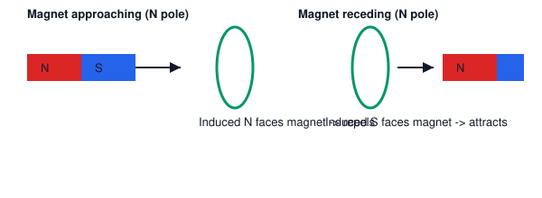

# 06. Lenz's Law

**Course:** PHY-103 (Physics–II) · **Unit:** Magnetism
**Prerequisite:** Faraday's Law (Topic 05)
**Leads to:** Self-Induction (Topic 07)

---

## A. Physical Idea

Faraday's law gives the *magnitude* of an induced emf but its negative sign hides a deep physical principle first stated clearly by Heinrich Lenz (1834): the induced current always flows in the direction that **opposes the change** in flux that produced it — not the flux itself, but its *change*. This opposition is not an arbitrary rule; it is a direct consequence of **energy conservation**. If the induced current instead *aided* the change in flux, the process would runaway, generating energy from nothing — a violation of the first law of thermodynamics. Lenz's law is therefore the qualitative, direction-giving twin of Faraday's law's quantitative, magnitude-giving statement.

## B. Definition

**Lenz's law:** the direction of an induced current is always such that it opposes the change in magnetic flux that produces it.

> Plain-English: nature "resists" any change in flux — if flux is increasing, the induced current tries to fight the increase; if flux is decreasing, the induced current tries to prop it up.

## C. Governing Equation

Lenz's law is encoded in the **sign** of Faraday's law:
$$
\mathcal{E} = -N\frac{d\Phi_B}{dt}
$$
The minus sign means the induced emf drives a current whose own magnetic field opposes $d\Phi_B/dt$.

## D. Physical/Logical Derivation: Why the Negative Sign Must Exist (Energy Argument)

**Step 1.** Suppose, for contradiction, the induced current instead *reinforced* the change in flux (i.e., imagine the sign in Faraday's law were positive rather than negative).

**Step 2.** As the external flux increases, the induced current would add to that increase, which would in turn induce an even larger emf, which would drive an even larger current, further increasing flux — a positive feedback loop with no natural limit.

**Step 3.** Such an unbounded increase in current and field would mean unbounded electrical and magnetic energy being generated from nothing (no external energy source is doing proportionally increasing work), directly violating conservation of energy.

**Step 4.** Therefore the induced current must oppose, not reinforce, the change in flux — establishing the necessity of the negative sign. This is a **consistency argument**, not a derivation from a deeper law within this course's scope; the rigorous derivation ultimately traces to the Maxwell–Faraday equation and, at a deeper level, to the requirement that physical laws respect energy conservation.

**Quantitative energy check (mechanical work vs. induced current, motional-emf case):** For the sliding-rod system of Topic 05, once current $I=\mathcal E/R$ flows, the rod (now carrying current in field $B$) experiences a magnetic force $F=BI\ell$ that — by Lenz's law — must oppose the rod's motion (i.e., act as a retarding force). An external agent must do work against this force to keep the rod moving at constant velocity; this external mechanical work exactly equals the electrical energy dissipated in the circuit's resistance, confirming energy conservation.

## E. Vector/Directional Analysis — Applying Lenz's Law

**Procedure (right-hand rule application):**
1. Determine whether flux through the loop (in a chosen reference direction) is increasing or decreasing.
2. The induced current opposes this change: if flux is increasing (in the reference direction), the induced current creates a magnetic moment **opposing** that direction; if flux is decreasing, the induced current creates a magnetic moment **reinforcing** that direction (to prop up the flux).
3. Use the right-hand curl rule in reverse: curl the right-hand fingers in the direction that would produce the required opposing (or reinforcing) magnetic moment; the fingers now show the induced current's direction around the loop.

**Case-by-case examples:**

- **Magnet's north pole approaching a coil, magnet moving toward it:** flux through the coil (in the direction from the magnet toward the coil) is increasing. Induced current flows so as to create a north pole facing the approaching magnet (like poles repel) — opposing the approach.
- **Magnet's north pole moving away from a coil:** flux is decreasing. Induced current flows so as to create a south pole facing the receding magnet (unlike poles attract) — opposing the departure.
- **Increasing external flux through a stationary loop:** induced current flows to create an opposing magnetic field inside the loop (opposing the increase).
- **Decreasing external flux through a stationary loop:** induced current flows to create a reinforcing magnetic field inside the loop (opposing the decrease by trying to maintain the flux).

**Critical distinction:** the induced current opposes the **change in flux**, not the field itself. A steady, unchanging field — however strong — induces nothing. Only $d\Phi_B/dt \ne 0$ produces an emf, and the resulting current's field always acts to counter *that rate of change*, whichever direction the underlying field itself points.

## F. Units and Dimensions

Lenz's law is a directional/qualitative law; the associated quantities retain the units of Topic 05.

| Quantity | Symbol | SI Unit |
|---|---|---|
| Induced emf | $\mathcal E$ | volt (V) |
| Induced current | $I$ | ampere (A) |
| Induced magnetic moment | $m$ | A·m² |

## G. Diagram

*Figure 1: Left — north pole approaching a coil induces a current creating an opposing north pole (repulsion). Right — north pole receding induces a current creating an attracting south pole.*

## Definitions & Key Terms

1. **Lenz's law** — the induced current opposes the change in flux causing it.
   > Plain-English: nature resists change in magnetic flux, not the flux itself.

2. **Back-emf** — a specific application of Lenz's law where the induced emf opposes the applied emf or the motion causing it (relevant again in Topic 07, self-induction).
   > Plain-English: a "pushback" voltage that appears whenever current or flux is changing.

3. **Eddy currents** — induced currents circulating within a bulk conductor (rather than a wire loop) due to changing flux, which by Lenz's law oppose the motion or flux change causing them.
   > Plain-English: swirling currents inside a solid metal block that appear when it moves through or experiences a changing field, and which resist that motion (used in electromagnetic braking).

## Worked Examples

### Example 1 — Foundational

**Given:** A bar magnet's south pole is pushed toward a coil, viewed such that the coil lies in the plane of the page and the magnet approaches from the left.
**Required:** State the direction of the induced current in the coil (as seen from the magnet's side) and explain using Lenz's law.
**Principle:** Opposition to approaching flux requires the coil to present a repelling pole to the approaching magnet.

**Reasoning:** Since the south pole approaches, the coil must present a south pole on its near face to repel it (like poles repel).

**Final answer:** By the right-hand rule, to produce a south pole facing the magnet, the induced current must flow **clockwise** as viewed from the magnet's side.

**Interpretation:** No numerical calculation is needed here — this is purely a directional application of Lenz's law, a very common short-answer exam question.

---

### Example 2 — Intermediate

**Given:** A circular loop of resistance $R=2\ \Omega$ and area $A=0.05\ \text{m}^2$ lies perpendicular to a magnetic field that decreases uniformly from $0.8\ \text{T}$ to $0.2\ \text{T}$ in $0.3\ \text{s}$.
**Required:** (a) Magnitude of induced current. (b) Direction of induced current relative to the field's own direction (reinforcing or opposing the original field inside the loop).
**Principle:** $|\mathcal E| = A\,|\Delta B/\Delta t|$; direction from Lenz's law (flux decreasing → induced current reinforces the original field direction).

**Step 1 — Rate of change:**
$$
\frac{\Delta B}{\Delta t} = \frac{0.2-0.8}{0.3} = \frac{-0.6}{0.3} = -2\ \text{T/s}
$$

**Step 2 — emf magnitude:**
$$
|\mathcal E| = A\left|\frac{\Delta B}{\Delta t}\right| = (0.05)(2) = 0.1\ \text{V}
$$

**Step 3 — Current magnitude:**
$$
I = \frac{|\mathcal E|}{R} = \frac{0.1}{2} = 0.05\ \text{A}
$$

**Step 4 — Direction:** Since $B$ is *decreasing*, Lenz's law requires the induced current to create a field in the *same* direction as the original $B$ inside the loop — i.e., the induced current's own magnetic moment reinforces (props up) the weakening field.

**Final answer:** $\boxed{I = 0.05\ \text{A} = 50\ \text{mA}}$, flowing in the sense that reinforces the original field direction inside the loop.

**Interpretation:** This demonstrates that "opposing the change" can mean the induced current's field points in the *same* direction as the external field, when that external field is decreasing — a frequent point of confusion.

---

### Example 3 — Advanced / Exam-Level

**Given:** A conducting square loop of side $a$, resistance $R$, is being pulled with constant velocity $v$ out of a uniform magnetic field region $B$ (the field exists only to the left of a sharp boundary; the loop starts fully inside the field and exits to the right, so only the right side of the loop is inside the field-free region while the left side remains in the field, during the exit process).
**Required:** Using Lenz's law and Faraday's law together, (a) find the induced current during the exit, (b) find the direction of the force needed to keep the loop moving at constant $v$ (i.e., determine whether an external agent must do positive work), and (c) show this is consistent with energy conservation by comparing electrical power dissipated to mechanical power delivered.
**Principle:** As the loop exits, the enclosed flux decreases (area within the field shrinks); Lenz's law predicts an induced current opposing this decrease, which in turn creates a retarding force on the loop (opposing its exit, i.e., opposing $v$) — this is the mechanism of magnetic braking.

**Step 1 — Rate of flux change.** As the loop exits at speed $v$, the width of the loop still inside the field decreases at rate $v$, so the enclosed area decreases at rate $av$ (side $a$ times speed $v$):
$$
\left|\frac{d\Phi_B}{dt}\right| = B\cdot a v
$$

**Step 2 — Induced emf and current:**
$$
|\mathcal E| = Bav, \qquad I = \frac{Bav}{R}
$$

**Step 3 — Direction (Lenz's law):** flux (into the page, say) is decreasing, so the induced current flows to reinforce it — i.e., clockwise (if into-page is the reference), by the right-hand rule.

**Step 4 — Force on the current-carrying side still in the field.** Only the left side (length $a$, still inside the field) carries current in the presence of $B$ and experiences a force $F = BIa$ (the right side, outside the field, and the top/bottom sides parallel to $v$, either feel no force or forces that cancel). Using $F=I\mathbf L\times\mathbf B$ with the current direction found in Step 3, this force acts **opposite to $v$** — a retarding force, consistent with Lenz's law (opposing the motion that causes the flux change).

**Step 5 — Magnitude of the retarding force:**
$$
F = BIa = B\left(\frac{Bav}{R}\right)a = \frac{B^2a^2v}{R}
$$

**Step 6 — Energy check.** To maintain constant velocity, an external agent must supply a force equal and opposite to this retarding force, doing mechanical work at rate:
$$
P_{mech} = Fv = \frac{B^2a^2v^2}{R}
$$
Electrical power dissipated in the loop's resistance:
$$
P_{elec} = I^2R = \left(\frac{Bav}{R}\right)^2R = \frac{B^2a^2v^2}{R}
$$

**Final answer:**
$$
\boxed{I = \frac{Bav}{R}\text{ (reinforcing direction)};\quad F_{retard} = \frac{B^2a^2v^2}{Rv}=\frac{B^2a^2v}{R};\quad P_{mech}=P_{elec}=\frac{B^2a^2v^2}{R}}
$$

**Interpretation:** $P_{mech}=P_{elec}$ exactly, confirming that the mechanical work done by whatever pulls the loop out is completely converted into electrical (and ultimately, resistive-heat) energy — the quantitative face of the energy-conservation argument that *justifies* Lenz's law in the first place.

## Common Mistakes

- ❌ **Mistake:** Thinking the induced current opposes the magnetic field itself.
  ✅ **Correct:** It opposes the *change* in flux; if the field is decreasing, the induced current's field points in the *same* direction as the original field (see Example 2).

- ❌ **Mistake:** Applying Lenz's law without first determining whether flux is increasing or decreasing.
  ✅ **Correct:** Always establish the sign of $d\Phi_B/dt$ first — the direction rule depends entirely on this.

- ❌ **Mistake:** Believing Lenz's law and Faraday's law are independent, separately-memorized rules.
  ✅ **Correct:** Lenz's law is literally the meaning of the negative sign in Faraday's law — they are one law viewed from two angles (magnitude vs. direction).

- ❌ **Mistake:** Assuming the induced current does no work or has no mechanical consequence.
  ✅ **Correct:** As Example 3 shows, the induced current produces a real retarding (or accelerating, depending on setup) force that has measurable mechanical effects (magnetic braking, damping).

## Practice Problems

1. **Conceptual:** Explain, in terms of energy conservation, why a superconducting loop (zero resistance) would maintain a *permanently* induced current if the external flux through it were suddenly changed and then held fixed.
2. **Short derivation:** Show that the retarding force on a conducting loop being pulled out of a field region (as in Example 3) always acts to decelerate the loop, regardless of the loop's exact shape, using only the sign relationships in Faraday's and Lenz's laws (conceptual/qualitative derivation, no need to redo the full algebra).
   

   
Solution

   Step 1: Motion out of the field decreases $\Phi_B$, so by Faraday's law $\mathcal E \ne 0$ and drives a current.

   Step 2: By Lenz's law, that current's magnetic moment opposes the decrease, meaning the induced current, interacting with the *external* field still present at the loop's edge, must produce a force opposing the loop's own motion (otherwise the change in flux would be reinforced, not opposed, contradicting Lenz's law).

   **Answer:** Any current whose associated force *aided* the exit would increase the rate of flux decrease, contradicting Lenz's law; hence the force must always retard the motion.
   

3. **Numerical:** A coil of $N=80$ turns, area $3\times10^{-3}\ \text{m}^2$, resistance $5\ \Omega$, is in a field increasing at $0.4\ \text{T/s}$. Find the induced current.
   

   
Solution

   $|\mathcal E| = NA\,dB/dt = (80)(3\times10^{-3})(0.4) = 0.096\ \text{V}$

   $I = \mathcal E/R = 0.096/5 = 0.0192\ \text{A}$

   **Answer:** $I \approx 19.2\ \text{mA}$
   

4. **Vector/direction:** A conducting ring lies flat on a table; a bar magnet is dropped, north pole down, straight through the ring's center. Describe (qualitatively) how the induced current direction changes as the magnet approaches, passes through, and recedes below the ring.
   

   
Solution

   While approaching from above: flux (downward, say) increases; induced current opposes this — flows so as to repel the magnet (creates a north pole facing up).

   While receding below: flux (downward) through the ring, now from the pole moving away, decreases; induced current reverses direction to reinforce/attract, trying to pull the magnet back (creates a south pole facing down toward the receding magnet).

   **Answer:** The induced current reverses direction at the instant the magnet passes through the plane of the ring — repelling on approach, attracting on departure — consistent with Lenz's law throughout.
   

5. **Exam-style, multi-step:** A rectangular loop (resistance $R$, sides $a$ and $b$, with $a$ parallel to a long straight current-carrying wire at distance $d$ from the near side, $b$ perpendicular to the wire) initially at rest is moved directly away from the wire with constant speed $v$. Given the wire's field at distance $x$ is $B(x)=\mu_0 I_{wire}/(2\pi x)$, set up (do not necessarily fully evaluate) the expression for the induced emf as a function of the loop's near-side distance $x(t) = d+vt$, and state the direction of the induced current using Lenz's law (current in the wire assumed to flow "upward," producing field circling it per the right-hand rule).
   

   
Solution

   Step 1: Flux through the loop at near-side distance $x$: $\Phi_B(x) = \displaystyle\int_x^{x+a} \frac{\mu_0 I_{wire}}{2\pi x'}b\,dx' = \frac{\mu_0 I_{wire}b}{2\pi}\ln\!\left(\frac{x+a}{x}\right)$.

   Step 2: With $x=x(t)=d+vt$, $\mathcal E(t) = -\dfrac{d\Phi_B}{dt} = -\dfrac{d\Phi_B}{dx}\cdot\dfrac{dx}{dt} = -\dfrac{d\Phi_B}{dx}\cdot v$.

   Step 3 (direction): As the loop moves away, $x$ increases, so $\Phi_B$ (which decreases with increasing $x$, since the loop is on average farther from the wire and in a weaker field) is decreasing. By Lenz's law, the induced current flows so as to reinforce the original flux direction — i.e., in the same rotational sense as the field produced by the wire's current at the loop's location.

   **Answer:** $\mathcal E(t) = -v\,\dfrac{d}{dx}\!\left[\dfrac{\mu_0 I_{wire}b}{2\pi}\ln\!\left(\dfrac{x+a}{x}\right)\right]_{x=d+vt}$; induced current flows to reinforce the (decreasing) flux from the wire, i.e., in the same sense as the wire's own field circulation at the loop.
   

## Summary

| Concept | Key Result | Condition / Limit |
|---|---|---|
| Lenz's law | Induced current opposes the *change* in flux | General |
| Physical basis | Conservation of energy | General |
| Increasing flux | Induced current's field opposes the external field | — |
| Decreasing flux | Induced current's field reinforces the external field | — |
| Mechanical consequence | Retarding force on any conductor whose motion causes the flux change | Motional-emf / eddy-current situations |

Lenz's law explains the *direction* of induction; the next two topics (Self- and Mutual Induction) apply Faraday's and Lenz's laws to circuits interacting with their *own* changing current, and with a *neighboring* circuit's changing current, respectively.
