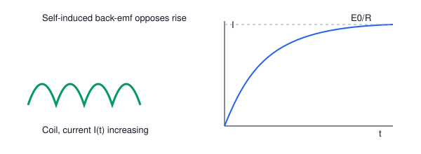

# 07. Self-Induction

**Course:** PHY-103 (Physics–II) · **Unit:** Magnetism
**Prerequisite:** Faraday's Law (Topic 05), Lenz's Law (Topic 06)
**Leads to:** Mutual Induction (Topic 08), Electromagnetic Oscillation (Topic 11)

---

## A. Physical Idea

A current-carrying circuit produces its own magnetic flux linking itself. If that current changes with time, the self-produced flux also changes, and — by Faraday's law — an emf is induced **in the very same circuit**. By Lenz's law, this self-induced emf always opposes the change in current that produces it, acting like a kind of "electrical inertia." This phenomenon is **self-induction**, and the circuit property that quantifies it is the **self-inductance** $L$.

Self-inductance plays a role in circuits analogous to the role mass plays in mechanics: it resists sudden changes in current (as mass resists sudden changes in velocity), and it stores energy in its magnetic field (as a moving mass stores kinetic energy).

## B. Definition

**Self-induction:** the phenomenon in which a changing current in a circuit induces an emf in the same circuit due to the changing self-linked flux.

> Plain-English: when the current in a coil changes, the coil "fights back" with its own voltage, because the field it makes for itself is also changing.

**Self-inductance ($L$):** the ratio of the flux linkage of a circuit to the current producing it, $L = N\Phi_B/I$; equivalently, the proportionality constant relating induced emf to rate of change of current.

> Plain-English: a number describing how strongly a coil opposes changes in its own current — bigger $L$ means a bigger "electrical inertia."

## C. Governing Equation

$$
\mathcal E = -L\frac{dI}{dt}, \qquad L = \frac{N\Phi_B}{I}
$$

| Symbol | Meaning |
|---|---|
| $\mathcal E$ | self-induced emf (V) |
| $L$ | self-inductance (H) |
| $I$ | current in the circuit (A) |
| $N\Phi_B$ | flux linkage (Wb-turns) |

## D. Derivation

**Step 1 — Flux linkage proportional to current.** For a circuit whose geometry is fixed (no moving parts) and surrounded by a linear (non-saturating) magnetic medium, the self-linked flux $\Phi_B$ produced by the circuit's own current $I$ is directly proportional to $I$ (since $B$ everywhere is proportional to the source current by the Biot–Savart law, and flux is a linear integral of $B$):
$$
N\Phi_B \propto I \quad\Rightarrow\quad N\Phi_B = LI
$$
where $L$ is defined as the constant of proportionality — the **self-inductance**, dependent only on geometry (turns, area, core material), not on $I$ itself (for linear media).

**Step 2 — Apply Faraday's law.** Since flux linkage changes only because $I$ changes (geometry fixed):
$$
\mathcal E = -\frac{d(N\Phi_B)}{dt} = -\frac{d(LI)}{dt}
$$

**Step 3 — With $L$ constant (fixed geometry, linear medium), take it outside the derivative:**
$$
\boxed{\mathcal E = -L\frac{dI}{dt}}
$$

**What must be memorized:** $\mathcal E=-L\,dI/dt$ and $L=N\Phi_B/I$.
**What must be understood:** $L$ is a purely geometric/material property; the self-induced emf's sign (Lenz's law) always opposes the *change* in current — it opposes an increasing current by acting like a "back-emf," and opposes a decreasing current by trying to sustain it.

## Energy Stored in an Inductor

**Step 1 — Power delivered against the back-emf.** To force a changing current through an inductor, an external source must do work against the self-induced back-emf $\mathcal E_{back} = L\,dI/dt$ (the source emf must equal this to push current through, in an otherwise resistanceless inductor). The instantaneous power delivered by the source to the inductor is:
$$
P = \mathcal E_{back}\cdot I = L\frac{dI}{dt}\cdot I
$$

**Step 2 — Total energy = integral of power over time**, as current builds from $0$ to a final value $I$:
$$
U = \int_0^t P\,dt' = \int_0^t LI\frac{dI}{dt'}dt' = \int_0^I LI\,dI
$$
(changing the integration variable from $t'$ to $I$ using $dI = (dI/dt')dt'$)

**Step 3 — Evaluate the integral** (treating $L$ as constant):
$$
U = L\int_0^I I\,dI = L\left[\frac{I^2}{2}\right]_0^I = \frac{1}{2}LI^2
$$

$$
\boxed{U = \frac{1}{2}LI^2}
$$

**What must be memorized:** $U = \tfrac12 LI^2$.
**What must be understood:** this is directly analogous to $KE=\tfrac12mv^2$, with $L\leftrightarrow m$ and $I\leftrightarrow v$; the energy is stored in the magnetic field established by the current, and is recoverable (e.g., released back into a circuit) when the current decreases.

## RL Transient Behavior (Qualitative)

When a circuit containing resistance $R$ and inductance $L$ in series is suddenly connected to a battery of emf $\mathcal E_0$, Kirchhoff's voltage law gives $\mathcal E_0 = IR + L\,dI/dt$. Solving this first-order linear differential equation (standard result, not re-derived in full here since it belongs to circuit theory beyond this unit's core scope) yields:
$$
I(t) = \frac{\mathcal E_0}{R}\left(1-e^{-t/\tau}\right), \qquad \tau = \frac{L}{R}
$$
The current rises gradually rather than instantaneously, with **time constant** $\tau = L/R$ — a direct, measurable consequence of self-inductance opposing sudden changes in current. (This result is provided for physical context; full derivation belongs to a circuits course, but the qualitative behavior — current cannot jump discontinuously through an inductor — is an important exam-level concept.)

## E. Vector Analysis

Self-inductance itself is a scalar (it relates the magnitude of flux linkage to the magnitude of current, both referenced to a consistent circuit orientation), but direction still matters in the underlying physics:

- The self-induced emf's *polarity* always opposes the *change* in current (Lenz's law applied to the circuit's own flux), exactly as in Topic 06.
- If current is increasing, the self-induced emf acts like a source pushing current backward (opposing the increase) — a genuine "back-emf."
- If current is decreasing, the self-induced emf acts to sustain the current in its original direction (opposing the decrease) — this is why switches controlling inductive loads (e.g., relay coils, motor windings) can produce sparks: the inductor "fights" the sudden drop to zero current by momentarily maintaining a large voltage.

## F. Units and Dimensions

| Quantity | Symbol | SI Unit | Dimension |
|---|---|---|---|
| Self-inductance | $L$ | henry (H) = V·s/A = Wb/A | $\mathsf{M\,L^2\,T^{-2}\,I^{-2}}$ |
| Energy stored | $U$ | joule (J) | $\mathsf{M\,L^2\,T^{-2}}$ |
| Time constant | $\tau$ | second (s) | $\mathsf T$ |

**Dimensional check ($U=\tfrac12LI^2$):** $[LI^2] = (\mathsf{M\,L^2\,T^{-2}\,I^{-2}})(\mathsf I^2) = \mathsf{M\,L^2\,T^{-2}}$ = joule. ✓
**Dimensional check ($\tau=L/R$):** $[L]/[R] = (\mathsf{M\,L^2\,T^{-2}\,I^{-2}})/(\mathsf{M\,L^2\,T^{-3}\,I^{-2}}) = \mathsf T$ = second. ✓

## G. Diagram

*Figure 1: A solenoid/coil carrying increasing current $I(t)$ generates a self-induced back-emf $\mathcal E = -L\,dI/dt$ opposing the increase; the associated RL circuit shows the exponential rise of current toward $\mathcal E_0/R$.*

## Definitions & Key Terms

1. **Self-inductance ($L$)** — $L = N\Phi_B/I$, the flux linkage per unit current in a single circuit.
   > Plain-English: how much magnetic "memory" a coil has of its own current.

2. **Back-emf** — the self-induced emf that opposes a change in the circuit's own current.
   > Plain-English: the coil's own resistance to being told to change its current.

3. **Time constant ($\tau=L/R$)** — the characteristic time over which current in an RL circuit approaches its steady-state value.
   > Plain-English: roughly how long it takes the current to "catch up" after the circuit is switched on.

4. **Henry (H)** — the SI unit of inductance; a circuit has inductance $1\ \text H$ if a current changing at $1\ \text{A/s}$ induces an emf of $1\ \text V$.
   > Plain-English: the "size" unit for electrical inertia.

## Worked Examples

### Example 1 — Foundational

**Given:** A coil has self-inductance $L=0.2\ \text H$; the current through it changes at a constant rate of $5\ \text{A/s}$.
**Required:** Induced emf.
**Principle:** $|\mathcal E| = L\,|dI/dt|$.

**Substitution:**
$$
|\mathcal E| = (0.2)(5)
$$

**Algebra:**
$$
|\mathcal E| = 1.0\ \text V
$$

**Unit check:** H·(A/s) = V ✓

**Final answer:** $\boxed{|\mathcal E| = 1.0\ \text V}$

**Interpretation:** The sign of $\mathcal E$ depends on whether the current is increasing or decreasing, per Lenz's law — the magnitude alone is asked for here.

---

### Example 2 — Intermediate

**Given:** A solenoid of $N=500$ turns carries current $I=2\ \text A$ and has a self-linked flux per turn of $\Phi_B = 4\times10^{-4}\ \text{Wb}$.
**Required:** (a) Self-inductance $L$. (b) Energy stored in the field.

**Part (a):**
$$
L = \frac{N\Phi_B}{I} = \frac{(500)(4\times10^{-4})}{2}
$$
$$
L = \frac{0.2}{2} = 0.1\ \text H
$$

**Part (b):**
$$
U = \frac12LI^2 = \frac12(0.1)(2)^2 = \frac12(0.1)(4)
$$
$$
U = 0.2\ \text J
$$

**Unit check:** H·A² = (V·s/A)(A²) = V·A·s = W·s = J ✓

**Final answer:** $\boxed{L = 0.1\ \text H;\quad U = 0.2\ \text J}$

**Interpretation:** Doubling the current would quadruple the stored energy (since $U\propto I^2$) — a very common exam trap where students assume a linear relationship.

---

### Example 3 — Advanced / Exam-Level

**Given:** An RL circuit has $R=10\ \Omega$, $L=0.5\ \text H$, connected suddenly to a battery of emf $\mathcal E_0=20\ \text V$.
**Required:** (a) Time constant $\tau$. (b) Current at $t=\tau$ (one time constant after switching on). (c) Energy stored in the inductor's field at that instant. (d) Verify energy balance qualitatively: state (without a full integral) what the remaining battery energy is doing at that instant.
**Principle:** $I(t) = \dfrac{\mathcal E_0}{R}(1-e^{-t/\tau})$, $\tau=L/R$, $U=\tfrac12LI^2$.

**Step 1 — Time constant:**
$$
\tau = \frac{L}{R} = \frac{0.5}{10} = 0.05\ \text s
$$

**Step 2 — Steady-state (final) current:**
$$
I_{final} = \frac{\mathcal E_0}{R} = \frac{20}{10} = 2\ \text A
$$

**Step 3 — Current at $t=\tau$:**
$$
I(\tau) = I_{final}\left(1-e^{-1}\right) = 2(1-0.3679) = 2(0.6321)
$$
$$
I(\tau) = 1.264\ \text A
$$

**Step 4 — Energy stored at $t=\tau$:**
$$
U(\tau) = \frac12LI(\tau)^2 = \frac12(0.5)(1.264)^2 = \frac12(0.5)(1.598)
$$
$$
U(\tau) = 0.3995\ \text J \approx 0.40\ \text J
$$

**Step 5 — Qualitative energy balance:** At any instant, the battery supplies energy at rate $\mathcal E_0 I$; part of this goes into resistive (Joule) heating at rate $I^2R$, and the remainder goes into building the magnetic field energy at rate $L I\,dI/dt$. At $t=\tau$, the current is still increasing, so energy continues flowing into both the resistor (as heat, permanently lost) and the inductor's field (recoverable), until steady state ($dI/dt\to0$) is reached, after which all delivered energy is dissipated as heat and the field energy stays constant at $U=\tfrac12LI_{final}^2$.

**Final answer:** $\boxed{\tau=0.05\ \text s;\quad I(\tau)\approx1.264\ \text A;\quad U(\tau)\approx0.40\ \text J}$

**Interpretation:** This example combines the exponential-rise formula (provided as a standard circuit-theory result) with the energy formula from this topic — a typical multi-concept exam question linking Topics 05–07.

## Common Mistakes

- ❌ **Mistake:** Believing self-inductance depends on the current flowing through the coil.
  ✅ **Correct:** For a linear (non-saturating) magnetic medium, $L$ depends only on geometry (turns, area, length, core permeability) — it is defined as $N\Phi_B/I$, but this ratio is constant, not dependent on the actual value of $I$ at a given moment.

- ❌ **Mistake:** Writing $U = LI^2$ (forgetting the factor of $\tfrac12$).
  ✅ **Correct:** $U=\tfrac12LI^2$ — the factor of $\tfrac12$ arises from integrating $I\,dI$, exactly as in $KE=\tfrac12mv^2$.

- ❌ **Mistake:** Confusing self-inductance ($L$, one circuit) with mutual inductance ($M$, two circuits) — treated fully in Topic 08.
  ✅ **Correct:** Self-inductance relates a circuit's own flux to its own current; mutual inductance relates flux in *one* circuit to current in a *different*, neighboring circuit.

- ❌ **Mistake:** Assuming current changes instantaneously when a switch is closed in an inductive circuit.
  ✅ **Correct:** Current through an inductor changes continuously (never discontinuously) because a discontinuous $dI/dt$ would require infinite induced emf; this underlies the smooth exponential rise/fall in RL circuits.

- ❌ **Mistake:** Mixing up units — using weber for inductance or henry for flux.
  ✅ **Correct:** $L$ is in henry (H); $\Phi_B$ is in weber (Wb); $N\Phi_B/I$ correctly gives H = Wb/A.

## Practice Problems

1. **Conceptual:** Explain physically why breaking a switch in a circuit with a large inductance (e.g., a motor winding) can produce a visible spark, using the concept of self-induced back-emf.
2. **Short derivation:** Starting from $L=N\Phi_B/I$ and the fact that for a long solenoid $\Phi_B = \mu_0 n I \cdot A$ (with $n=N/\ell$ turns per unit length), derive the standard formula $L = \mu_0 n^2 A\ell$ for a solenoid's self-inductance.
   

   
Solution

   Step 1: $\Phi_B$ (per turn) $= \mu_0 n I A = \mu_0\dfrac{N}{\ell}IA$.

   Step 2: $L = \dfrac{N\Phi_B}{I} = \dfrac{N}{I}\cdot\mu_0\dfrac{N}{\ell}IA = \mu_0\dfrac{N^2}{\ell}A$.

   Step 3: Using $n=N/\ell \Rightarrow N = n\ell$, so $N^2 = n^2\ell^2$:
   $$
   L = \mu_0\frac{n^2\ell^2}{\ell}A = \mu_0 n^2 A\ell
   $$

   **Answer:** $L = \mu_0 n^2 A\ell$
   

3. **Numerical:** A coil has $L=2\ \text H$. Find the emf induced when the current changes from $3\ \text A$ to $7\ \text A$ in $0.4\ \text s$ (assume uniform rate).
   

   
Solution

   $\dfrac{dI}{dt} = \dfrac{7-3}{0.4} = 10\ \text{A/s}$; $|\mathcal E| = L\,|dI/dt| = (2)(10) = 20\ \text V$

   **Answer:** $|\mathcal E| = 20\ \text V$
   

4. **Direction/qualitative:** In an RL circuit being switched OFF (battery suddenly disconnected, inductor and resistor remain in a closed loop), state the direction of the current immediately after switching, relative to its direction just before, and explain using Lenz's law.
   

   
Solution

   Immediately after switching off, the inductor's self-induced emf acts to sustain the *same* current direction as before (opposing the decrease), so current continues flowing in the same direction as before the switch (though decaying to zero over time), not reversing instantaneously.

   **Answer:** Same direction as before switching; it decays smoothly toward zero, never reversing (for a simple RL discharge loop).
   

5. **Exam-style, multi-step:** A coil of self-inductance $L=0.3\ \text H$ and negligible resistance carries a current that varies as $I(t) = 4\sin(50t)\ \text A$. (a) Find the induced emf as a function of time. (b) Find the maximum energy stored in the coil's field over one cycle.
   

   
Solution

   Step 1: $\dfrac{dI}{dt} = 4(50)\cos(50t) = 200\cos(50t)$.

   Step 2: $\mathcal E(t) = -L\dfrac{dI}{dt} = -(0.3)(200\cos50t) = -60\cos(50t)\ \text V$.

   Step 3: Maximum energy occurs when $|I|$ is maximum, i.e., $|I|_{max}=4\ \text A$:
   $$
   U_{max} = \frac12LI_{max}^2 = \frac12(0.3)(4)^2 = \frac12(0.3)(16) = 2.4\ \text J
   $$

   **Answer:** $\mathcal E(t) = -60\cos(50t)\ \text V$; $U_{max} = 2.4\ \text J$.
   

## Summary

| Concept | Key Result | Condition / Limit |
|---|---|---|
| Self-induced emf | $\mathcal E = -L\,dI/dt$ | Fixed geometry, linear medium |
| Self-inductance | $L = N\Phi_B/I$ | Geometric/material property |
| Energy stored | $U = \tfrac12LI^2$ | General (linear inductor) |
| Solenoid inductance | $L = \mu_0 n^2 A\ell$ | Long ideal solenoid, air core |
| RL time constant | $\tau = L/R$ | Series RL circuit |

Self-induction describes a circuit's response to its *own* changing current; the next topic, mutual induction, extends the same reasoning to *two* coupled circuits, where a changing current in one induces an emf in the other.
