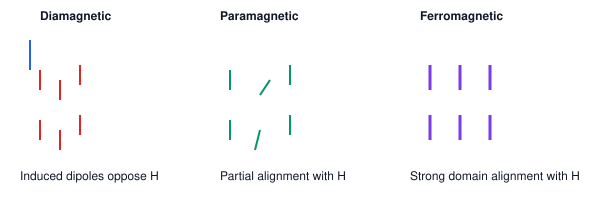

# 09. Classification of Magnetic Materials

**Course:** PHY-103 (Physics–II) · **Unit:** Magnetism
**Prerequisite:** Torque on a Current-Carrying Loop (Topic 03, for the atomic-dipole picture)
**Leads to:** Hysteresis Curve (Topic 10)

---

## A. Physical Idea

Every atom contains moving electrons — orbiting the nucleus and spinning about their own axes — each behaving like a tiny current loop with its own magnetic dipole moment (Topic 03). When a material is placed in an external magnetic field, these atomic dipoles respond in one of a few characteristic ways, depending on the material's electronic structure. This microscopic response, when summed over the enormous number of atoms in a bulk sample, determines whether the material is weakly repelled, weakly attracted, or strongly attracted by an external magnet — the basis for classifying magnetic materials as **diamagnetic**, **paramagnetic**, or **ferromagnetic**.

## B. Definition

**Magnetization ($\mathbf M$):** the net magnetic dipole moment per unit volume of a material, $\mathbf M = \mathbf m_{net}/V$.

> Plain-English: how strongly and in what direction all the tiny atomic magnets inside a material line up, on average.

**Magnetic susceptibility ($\chi_m$):** the dimensionless constant relating magnetization to the applied field, $\mathbf M = \chi_m\mathbf H$.

> Plain-English: a number telling you how "responsive" a material's internal magnetism is to an external field.

**Relative permeability ($\mu_r$):** $\mu_r = 1+\chi_m$, relating the material's total field response to that of free space.

> Plain-English: how much the material "amplifies" (or slightly reduces) the magnetic field compared to empty space.

## C. Governing Relations

$$
\mathbf B = \mu_0(\mathbf H+\mathbf M) = \mu_0(1+\chi_m)\mathbf H = \mu_0\mu_r\mathbf H = \mu\mathbf H
$$

| Symbol | Meaning |
|---|---|
| $\mathbf B$ | total magnetic flux density inside the material (T) |
| $\mathbf H$ | magnetic field intensity, from free (external) currents only (A/m) |
| $\mathbf M$ | magnetization (A/m) |
| $\chi_m$ | magnetic susceptibility (dimensionless) |
| $\mu_r$ | relative permeability (dimensionless) |
| $\mu_0$ | permeability of free space, $4\pi\times10^{-7}\ \text{T·m/A}$ |
| $\mu=\mu_0\mu_r$ | absolute permeability of the material (T·m/A) |

⚠️ **Convention note:** $\mathbf H$ (sometimes itself loosely called "the magnetic field") is introduced here specifically because, unlike $\mathbf B$, it is determined only by free currents and is unaffected by the material's own magnetization — making it the natural independent variable for defining $\chi_m$ and $\mu_r$. This distinguishes it from $\mathbf B$, the total field, which is the quantity used throughout Topics 01–08.

## D. Microscopic Origin and Classification

### Diamagnetism

**Origin:** In *all* materials, an applied external field slightly modifies the orbital motion of electrons (via Faraday's/Lenz's law applied at the atomic scale — the changing flux through each electron "orbit" induces a tiny opposing current, i.e., an induced magnetic moment opposing the applied field, by Lenz's law). This effect is universal but extremely weak, and is only the *dominant* observable effect in materials where electrons are otherwise paired up with no net atomic magnetic moment to begin with (so there's no larger competing effect to mask it).

- **Susceptibility:** $\chi_m$ small and **negative** ($-10^{-6}$ to $-10^{-5}$ typically).
- **Response to field:** weakly repelled; induced $\mathbf M$ opposes $\mathbf H$.
- **Temperature dependence:** essentially independent of temperature (it's a field-induced orbital effect, not related to pre-existing dipole alignment).
- **Examples:** bismuth, copper, water, most organic and biological materials, superconductors (perfect diamagnets, $\chi_m=-1$).
- **Applications:** magnetic levitation demonstrations (e.g., diamagnetic levitation of small objects), shielding.

### Paramagnetism

**Origin:** Atoms/ions in the material possess a net permanent magnetic dipole moment (due to unpaired electrons), but in the absence of a field, thermal agitation randomizes their orientations, giving zero net magnetization. An applied field partially aligns these dipoles (competing against thermal randomization), producing a net magnetization in the *same* direction as the field.

- **Susceptibility:** $\chi_m$ small and **positive** ($10^{-5}$ to $10^{-3}$ typically).
- **Response to field:** weakly attracted; induced $\mathbf M$ aligns with $\mathbf H$.
- **Temperature dependence:** follows **Curie's law**, $\chi_m \propto 1/T$ — higher temperature means more thermal randomization, hence weaker net alignment and smaller susceptibility.
- **Examples:** aluminum, platinum, oxygen (gas), sodium.
- **Applications:** adiabatic demagnetization for reaching very low temperatures; some sensors.

### Ferromagnetism

**Origin:** In certain materials (mainly iron, nickel, cobalt, and their alloys), a strong **quantum-mechanical exchange interaction** between neighboring atomic dipoles causes them to spontaneously align *parallel* to each other, even without an external field, within small regions called **domains**. In an unmagnetized sample, different domains point in different (random) directions, so the bulk sample shows negligible net magnetization; applying an external field grows the domains aligned with the field (domain-wall motion) and rotates others into alignment, producing very large net magnetization.

- **Susceptibility:** $\chi_m$ large and **positive** (can be $10^2$ to $10^5$), and — unlike dia-/paramagnetism — **not constant**: it depends on the field history (see Topic 10, Hysteresis).
- **Response to field:** strongly attracted; large induced $\mathbf M$ aligns with $\mathbf H$.
- **Temperature dependence:** ferromagnetism disappears above a critical temperature, the **Curie temperature** $T_C$ (e.g., $\sim1043\ \text K$ for iron), above which the material becomes merely paramagnetic (thermal agitation overcomes the exchange interaction).
- **Examples:** iron, nickel, cobalt, and various alloys (e.g., alnico, permalloy).
- **Applications:** transformer and motor cores, permanent magnets, magnetic recording media, electromagnets.

## E. Vector Analysis

- For diamagnetic materials, $\mathbf M$ is **antiparallel** to $\mathbf H$ (opposing), consistent with $\chi_m<0$.
- For paramagnetic and ferromagnetic materials, $\mathbf M$ is **parallel** to $\mathbf H$ (reinforcing), consistent with $\chi_m>0$.
- In all three cases, for **isotropic linear media** (not ferromagnets under strong/varying field, which are neither strictly linear nor isotropic in general), $\mathbf B$, $\mathbf H$, and $\mathbf M$ are all parallel (or antiparallel) vectors along the same axis — no cross-product/angle dependence arises here because the material's response is (in the linear regime) a simple scalar multiple of the applied field, not a rotational or perpendicular effect.

## F. Units and Dimensions

| Quantity | Symbol | SI Unit | Dimension |
|---|---|---|---|
| Magnetic field intensity | $H$ | A/m | $\mathsf{I\,L^{-1}}$ |
| Magnetization | $M$ | A/m | $\mathsf{I\,L^{-1}}$ |
| Susceptibility | $\chi_m$ | dimensionless | — |
| Relative permeability | $\mu_r$ | dimensionless | — |
| Permeability | $\mu$ | T·m/A = H/m | $\mathsf{M\,L\,T^{-2}\,I^{-2}}$ |

**Dimensional check ($\mathbf B=\mu_0\mathbf H$):** $[\mu_0][H] = (\text{T·m/A})(\text{A/m}) = \text T$. ✓ (Since $\mathbf M$ has the same units as $\mathbf H$, $\mathbf B=\mu_0(\mathbf H+\mathbf M)$ is dimensionally consistent.)

## G. Comparison Table

| Property | Diamagnetic | Paramagnetic | Ferromagnetic |
|---|---|---|---|
| Microscopic origin | Induced orbital moments (Lenz's-law-like opposition) | Partial alignment of pre-existing atomic dipoles | Spontaneous domain alignment via exchange interaction |
| Susceptibility $\chi_m$ | Small, negative ($\sim-10^{-5}$) | Small, positive ($\sim10^{-4}$) | Large, positive ($10^2$–$10^5$), field-history-dependent |
| Relative permeability $\mu_r$ | Slightly less than 1 | Slightly more than 1 | Much greater than 1 (often 100s–1000s) |
| Direction of $\mathbf M$ relative to $\mathbf H$ | Opposed | Aligned | Strongly aligned |
| Effect of temperature | Negligible | $\chi_m\propto1/T$ (Curie's law) | Disappears above Curie temperature $T_C$ |
| Typical examples | Bismuth, copper, water | Aluminum, platinum, oxygen | Iron, nickel, cobalt |
| Typical application | Magnetic shielding, levitation demos | Adiabatic demagnetization, sensors | Transformer/motor cores, permanent magnets |

## Diagram

*Figure 1: Schematic atomic dipole orientations with no field (top row) and with an applied field $\mathbf H$ (bottom row) for the three material classes. Diamagnetic dipoles are induced opposite to $\mathbf H$; paramagnetic dipoles partially align with $\mathbf H$; ferromagnetic domains strongly align with $\mathbf H$.*

## Definitions & Key Terms

1. **Domain** — a microscopic region within a ferromagnetic material in which atomic dipoles are already spontaneously aligned.
   > Plain-English: a tiny "neighborhood" inside a magnet where all the atoms already agree on which way to point.

2. **Curie temperature ($T_C$)** — the temperature above which a ferromagnetic material loses its spontaneous magnetization and becomes paramagnetic.
   > Plain-English: heat a magnet enough and it "forgets" how to be magnetic.

3. **Curie's law** — $\chi_m = C/T$ for paramagnetic materials, where $C$ is the Curie constant.
   > Plain-English: paramagnets get "less magnetic" (in terms of susceptibility) as they heat up, because heat scrambles the atomic dipole alignment.

## Worked Examples

### Example 1 — Foundational

**Given:** A sample has magnetic susceptibility $\chi_m = -0.9\times10^{-5}$.
**Required:** Classify the material and state its relative permeability.
**Principle:** Sign of $\chi_m$ determines classification; $\mu_r=1+\chi_m$.

**Reasoning:** $\chi_m<0$ and small in magnitude → diamagnetic.

**Substitution:**
$$
\mu_r = 1+\chi_m = 1+(-0.9\times10^{-5}) = 0.999991
$$

**Final answer:** $\boxed{\text{Diamagnetic; } \mu_r \approx 0.999991\ (\text{slightly less than }1)}$

**Interpretation:** A diamagnetic material's $\mathbf B$ inside is very slightly *less* than $\mu_0 H$ (the vacuum value), consistent with $\mu_r<1$.

---

### Example 2 — Intermediate

**Given:** A paramagnetic salt has Curie constant $C = 2.5\times10^{-3}\ \text K$. Find its susceptibility at (a) $T_1=300\ \text K$ (room temperature) and (b) $T_2=4\ \text K$ (near liquid-helium temperature).
**Principle:** Curie's law, $\chi_m = C/T$.

**Part (a):**
$$
\chi_m(300\ \text K) = \frac{2.5\times10^{-3}}{300} = 8.33\times10^{-6}
$$

**Part (b):**
$$
\chi_m(4\ \text K) = \frac{2.5\times10^{-3}}{4} = 6.25\times10^{-4}
$$

**Final answer:** $\boxed{\chi_m(300\text K)\approx8.33\times10^{-6};\quad \chi_m(4\text K)\approx6.25\times10^{-4}}$

**Interpretation:** Susceptibility increases by roughly a factor of 75 as temperature drops from 300 K to 4 K, illustrating why paramagnetic cooling techniques (adiabatic demagnetization) are effective specifically at very low temperatures, where the susceptibility (and hence the achievable magnetic cooling effect) is largest.

---

### Example 3 — Advanced / Exam-Level

**Given:** An iron sample ($\mu_r \approx 2000$, treated as approximately linear for this estimate — a simplification, since real ferromagnets are non-linear, see Topic 10) is placed in an external field intensity $H = 500\ \text{A/m}$.
**Required:** (a) Find $B$ inside the material. (b) Find the magnetization $M$. (c) Compare the relative contributions of $\mu_0H$ (the "vacuum" part) and $\mu_0M$ (the "material" part) to the total $B$.
**Principle:** $B=\mu_0\mu_rH$; $M = \chi_mH = (\mu_r-1)H$; $B=\mu_0(H+M)$.

**Step 1 — Total field $B$:**
$$
B = \mu_0\mu_rH = (4\pi\times10^{-7})(2000)(500)
$$
$$
B = (4\pi\times10^{-7})(1.0\times10^6) = 4\pi\times10^{-1} \approx 1.2566\ \text T
$$

**Step 2 — Magnetization:**
$$
M = (\mu_r-1)H = (1999)(500) = 9.995\times10^{5}\ \text{A/m}
$$

**Step 3 — Compare contributions.** $B = \mu_0H+\mu_0M$:
$$
\mu_0H = (4\pi\times10^{-7})(500) = 6.283\times10^{-4}\ \text T
$$
$$
\mu_0M = (4\pi\times10^{-7})(9.995\times10^5) \approx 1.256\ \text T
$$

**Final answer:** $\boxed{B\approx1.2566\ \text T;\quad M\approx9.995\times10^5\ \text{A/m};\quad \mu_0M\ (\approx1.256\ \text T)\text{ dominates over }\mu_0H\ (\approx6.28\times10^{-4}\ \text T)\text{ by a factor of }\sim2000}$

**Interpretation:** For a strongly ferromagnetic material, the field inside is overwhelmingly due to the material's *own* magnetization, not the small externally applied $H$ — this is precisely why ferromagnetic cores dramatically amplify the field of a coil (transformers, electromagnets), and also why treating $\mu_r$ as constant is only a rough approximation, since real ferromagnetic response is strongly non-linear and history-dependent (Topic 10).

## Common Mistakes

- ❌ **Mistake:** Assuming all materials are either "magnetic" (attracted) or "non-magnetic."
  ✅ **Correct:** Every material has *some* magnetic response — diamagnetic (weakly repelled), paramagnetic (weakly attracted), or ferromagnetic (strongly attracted); "non-magnetic" in everyday language usually just means "not ferromagnetic."

- ❌ **Mistake:** Confusing $\mathbf B$ (total field, tesla) with $\mathbf H$ (field intensity from free currents only, A/m) — treating them as the same quantity with the same units.
  ✅ **Correct:** They are related but distinct: $\mathbf B=\mu_0(\mathbf H+\mathbf M)$; only in vacuum (where $\mathbf M=0$) does $\mathbf B=\mu_0\mathbf H$ give a simple proportionality.

- ❌ **Mistake:** Treating ferromagnetic $\mu_r$ as a fixed constant, independent of field strength or history.
  ✅ **Correct:** Ferromagnetic response is strongly non-linear and depends on prior magnetization history (hysteresis, Topic 10); $\mu_r$ values quoted are typically approximate, "initial" or "maximum" values, not universal constants.

- ❌ **Mistake:** Believing paramagnetism and ferromagnetism are simply "different strengths" of the same effect.
  ✅ **Correct:** They arise from different microscopic mechanisms — paramagnetism from independent, thermally-randomized dipole alignment; ferromagnetism from cooperative, quantum-exchange-driven spontaneous domain alignment.

- ❌ **Mistake:** Forgetting that ferromagnetism disappears above the Curie temperature.
  ✅ **Correct:** Above $T_C$, a former ferromagnet behaves as an ordinary paramagnet, following (approximately) the Curie–Weiss law, a modified form of Curie's law.

## Practice Problems

1. **Conceptual:** Explain, at the atomic level, why diamagnetism is present in *all* materials but is only observable as the dominant effect in materials with no net atomic magnetic moment.
2. **Short derivation:** Starting from $\mathbf B=\mu_0(\mathbf H+\mathbf M)$ and $\mathbf M=\chi_m\mathbf H$, derive $\mu_r = 1+\chi_m$.
   

   
Solution

   Step 1: $\mathbf B = \mu_0(\mathbf H+\chi_m\mathbf H) = \mu_0(1+\chi_m)\mathbf H$.

   Step 2: By definition, $\mathbf B=\mu_0\mu_r\mathbf H$.

   Step 3: Comparing, $\mu_0\mu_r = \mu_0(1+\chi_m) \Rightarrow \mu_r = 1+\chi_m$.

   **Answer:** $\mu_r = 1+\chi_m$
   

3. **Numerical:** A paramagnetic material has $\mu_r = 1.0003$ at $H=1000\ \text{A/m}$. Find $M$ and $B$.
   

   
Solution

   $\chi_m = \mu_r-1 = 0.0003$

   $M = \chi_mH = (0.0003)(1000) = 0.3\ \text{A/m}$

   $B = \mu_0\mu_rH = (4\pi\times10^{-7})(1.0003)(1000) \approx 1.2571\times10^{-3}\ \text T$

   **Answer:** $M=0.3\ \text{A/m}$; $B\approx1.257\ \text{mT}$
   

4. **Comparison/vector:** Two samples, A ($\chi_m=+2\times10^{-4}$) and B ($\chi_m=-1\times10^{-5}$), are placed in the same field $\mathbf H$. State, with justification, the direction of $\mathbf M$ relative to $\mathbf H$ for each, and which sample is more strongly affected in magnitude.
   

   
Solution

   Sample A: $\chi_m>0$, so $\mathbf M$ is parallel (aligned) with $\mathbf H$ — paramagnetic.

   Sample B: $\chi_m<0$, so $\mathbf M$ is antiparallel (opposed) to $\mathbf H$ — diamagnetic.

   Magnitude comparison: $|\chi_{m,A}| = 2\times10^{-4} > |\chi_{m,B}|=1\times10^{-5}$, so Sample A is more strongly affected (by a factor of 20).

   **Answer:** A: aligned (paramagnetic); B: opposed (diamagnetic); A is affected 20× more strongly in magnitude.
   

5. **Exam-style, multi-step:** A paramagnetic sample has Curie constant $C=1.8\times10^{-3}\ \text K$. At what temperature does its susceptibility equal $9\times10^{-6}$? If the sample were instead a ferromagnet with $T_C = 800\ \text K$ and behaves as an ideal paramagnet obeying the Curie–Weiss law $\chi_m = C/(T-T_C)$ for $T>T_C$ with the same $C$, find the temperature at which the same susceptibility value would be reached.
   

   
Solution

   Step 1 (Curie's law): $\chi_m = C/T \Rightarrow T = C/\chi_m = (1.8\times10^{-3})/(9\times10^{-6}) = 200\ \text K$.

   Step 2 (Curie–Weiss law): $\chi_m = C/(T-T_C) \Rightarrow T-T_C = C/\chi_m = 200\ \text K$ (same ratio as Step 1, since $C$ and $\chi_m$ are unchanged).

   Step 3: $T = T_C+200 = 800+200 = 1000\ \text K$.

   **Answer:** Simple paramagnet: $T=200\ \text K$. Curie–Weiss (former ferromagnet above $T_C$): $T=1000\ \text K$ — a much higher temperature is needed to reach the same (relatively small) susceptibility, since the material only becomes "ordinary paramagnetic" once well above its Curie temperature.
   

## Summary

| Concept | Key Result | Condition / Limit |
|---|---|---|
| Magnetization | $\mathbf M = \chi_m\mathbf H$ | Linear, isotropic media |
| Total field | $\mathbf B=\mu_0(\mathbf H+\mathbf M)=\mu_0\mu_r\mathbf H$ | General |
| Diamagnetism | $\chi_m<0$, small, T-independent | All materials, dominant when no net atomic moment |
| Paramagnetism | $\chi_m>0$, small, $\chi_m\propto1/T$ (Curie's law) | Unpaired electrons, thermal randomization |
| Ferromagnetism | $\chi_m>0$, large, history-dependent, vanishes above $T_C$ | Exchange-coupled domains |

Ferromagnetic materials, because their magnetization depends on field history rather than simply on the instantaneous field, exhibit the phenomenon of hysteresis — examined in full in the next topic.
