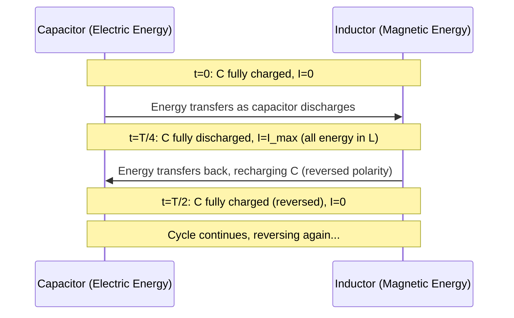

# 11. Electromagnetic Oscillation

**Course:** PHY-103 (Physics–II) · **Unit:** Magnetism · **Topic 11 of 13**

---

## A. Physical Idea

We have separately studied energy stored in a capacitor's electric field ($U_E = q^2/2C$) and energy stored in an inductor's magnetic field ($U_B = \frac12LI^2$, Topic 7). If a charged capacitor is connected directly to an inductor (forming a closed loop with no resistance), the system does not simply settle to equilibrium — instead, energy **oscillates back and forth** between the capacitor's electric field and the inductor's magnetic field, in a process directly analogous to the exchange between kinetic and potential energy in a mechanical oscillator like a mass on a spring.

## B. The Energy-Exchange Picture

**Stage 1.** At $t=0$, the capacitor is fully charged (charge $q=Q_{max}$) and no current flows ($I=0$). All energy is in the electric field: $U_E = Q_{max}^2/2C$, $U_B=0$.

**Stage 2.** The capacitor begins to discharge through the inductor. As current builds, energy transfers from the capacitor's electric field into the inductor's magnetic field. Partway through, $U_E$ has decreased and $U_B$ has correspondingly increased, with the total $U_E+U_B$ remaining constant (since there's no resistance to dissipate energy).

**Stage 3.** When the capacitor is fully discharged ($q=0$), all the energy now resides in the inductor's magnetic field: $U_B = \frac12LI_{max}^2 = Q_{max}^2/2C$ (by energy conservation), and current is at its maximum, $I=I_{max}$.

**Stage 4.** The current, still flowing (driven by the inductor's own self-induced tendency to maintain it), now begins to *recharge* the capacitor with **opposite polarity**. Energy flows back from the magnetic field into the electric field.

**Stage 5.** The capacitor reaches its maximum charge again (now with reversed polarity), current momentarily returns to zero, and the whole cycle repeats in the opposite sense — this is one full **electromagnetic oscillation**.

This continuous back-and-forth energy exchange, in the absence of resistance, would continue indefinitely — an **ideal LC oscillator**. In any real circuit, resistance (however small) dissipates a little energy each cycle, causing the oscillation to gradually decay (a "damped" oscillation), but the ideal, undamped case captures the essential physics.

## C. Mathematical Model — Preview

The rigorous mathematical description of this energy exchange — the differential equation governing $q(t)$, the resulting angular frequency, and the explicit energy expressions — is developed in full in the next topic, **L-C Oscillations**. There, we will derive:

$$
\frac{d^2q}{dt^2}+\frac{1}{LC}q=0, \qquad \omega = \frac{1}{\sqrt{LC}}
$$

This topic establishes the *conceptual* foundation (energy exchange, analogy to mechanical oscillation) that the next topic formalizes mathematically.

## D. Connection to the L-C Circuit

The physical requirement driving this oscillation is simply **Kirchhoff's voltage law** applied to a loop containing a charged capacitor and an inductor: the voltage across the capacitor ($q/C$) must, at every instant, equal the self-induced back-emf of the inductor ($L\,dI/dt$, with $I=dq/dt$), since there is no resistor to drop additional voltage and no external source. This single constraint is what produces the perpetual (in the ideal case) exchange of energy — neither the electric nor magnetic energy alone is conserved, but the *sum* always is.

## Vector/Directional Analysis

Unlike previous topics, LC oscillation is fundamentally a **scalar, time-dependent** phenomenon (charge and current as functions of time) rather than a spatial vector-field problem — but the *direction* of current reverses every half-cycle, exactly analogous to how the *velocity* of a mass on a spring reverses direction every half-cycle of mechanical oscillation. This directional reversal is essential: it's precisely what allows the capacitor to recharge with opposite polarity each half-cycle.

## Units and Dimensions

| Quantity | Symbol | SI Unit | Dimension |
|---|---|---|---|
| Electric energy | $U_E$ | J | $\text{M L}^2\text{T}^{-2}$ |
| Magnetic energy | $U_B$ | J | $\text{M L}^2\text{T}^{-2}$ |
| Charge | $q$ | C | $\text{I T}$ |
| Current | $I$ | A | $\text{I}$ |

Both $U_E=q^2/2C$ and $U_B=\frac12LI^2$ must have identical dimensions (joules), since they represent the same total conserved energy at different points in the cycle — a useful dimensional consistency check.

---

## Definitions & Key Terms

1. **Electromagnetic oscillation** — the periodic exchange of energy between the electric field of a capacitor and the magnetic field of an inductor in a closed LC loop.
   > Plain-English: energy "sloshes" back and forth between a capacitor and an inductor, like water sloshing between two connected tanks.

2. **Ideal LC oscillator** — an idealized LC circuit with zero resistance, in which oscillation continues indefinitely without energy loss.
   > Plain-English: a "frictionless" electrical oscillator — a useful idealization, though real circuits always have some resistance.

3. **Damped oscillation** — the realistic case where resistance gradually dissipates energy, causing the oscillation amplitude to decrease over time.

---

## Worked Examples

### Example 1 — Foundational

An LC circuit has a capacitor charged to $Q_{max}=5\times10^{-4}\ \text{C}$ with $C=2\times10^{-6}\ \text{F}$. At the instant the capacitor is momentarily fully discharged, what is the energy stored in the inductor?

1. **Given:** $Q_{max}=5\times10^{-4}\ \text{C}$, $C=2\times10^{-6}\ \text{F}$.
2. **Required:** $U_B$ at $q=0$.
3. **Principle:** By energy conservation, $U_B$ (at $q=0$) $=U_E$ (at $t=0$, when $I=0$) $= Q_{max}^2/2C$.
4. **Substitution:** $U_B = (5\times10^{-4})^2/(2\times2\times10^{-6})$.
5. **Algebra:** Numerator $=2.5\times10^{-7}$; denominator $=4\times10^{-6}$; $U_B = 2.5\times10^{-7}/4\times10^{-6} = 0.0625$.
6. **Unit check:** C²/F = J ✅
7. **Final answer:** $\boxed{U_B = 0.0625\ \text{J}}$
8. **Interpretation:** All the initial electric-field energy has, at this instant, been fully transferred to the magnetic field — none is lost, consistent with the ideal (lossless) LC assumption.

### Example 2 — Intermediate

For the same circuit ($C=2\times10^{-6}\ \text{F}$, total energy $0.0625\ \text{J}$), if $L=0.1\ \text{H}$, find the maximum current $I_{max}$ (occurring when the capacitor is fully discharged).

1. **Given:** $U_{total}=0.0625\ \text{J}$, $L=0.1\ \text{H}$.
2. **Required:** $I_{max}$.
3. **Equation:** $U_{total} = \frac12LI_{max}^2$ (all energy is magnetic at this instant).
4. **Substitution:** $0.0625 = 0.5\times0.1\times I_{max}^2$.
5. **Algebra:** $0.0625 = 0.05\,I_{max}^2 \implies I_{max}^2 = 1.25$.
6. **Take square root:** $I_{max}=\sqrt{1.25}$.
7. **Unit check:** $\sqrt{\text{J/H}} = \sqrt{\text{V·s/H} \cdot \text{A/V}}$... more directly, dimensional analysis of $U=\frac12LI^2$ confirms A ✅
8. **Final answer:** $\boxed{I_{max} \approx 1.118\ \text{A}}$

### Example 3 — Advanced / Exam-Level

At some intermediate instant in the oscillation of the circuit above ($C=2\times10^{-6}\ \text{F}$, $L=0.1\ \text{H}$, total energy $0.0625\ \text{J}$), the charge on the capacitor is measured as $q=3\times10^{-4}\ \text{C}$. Find the current at this instant.

1. **Given:** $q=3\times10^{-4}\ \text{C}$, $C=2\times10^{-6}\ \text{F}$, $U_{total}=0.0625\ \text{J}$, $L=0.1\ \text{H}$.
2. **Required:** $I$ at this instant.
3. **Principle:** $U_{total} = U_E + U_B = \dfrac{q^2}{2C} + \dfrac12LI^2$.
4. **Compute $U_E$:** $U_E = (3\times10^{-4})^2/(2\times2\times10^{-6}) = 9\times10^{-8}/4\times10^{-6} = 0.0225\ \text{J}$.
5. **Solve for $U_B$:** $U_B = U_{total}-U_E = 0.0625-0.0225 = 0.04\ \text{J}$.
6. **Solve for $I$:** $0.04 = \frac12\times0.1\times I^2 \implies I^2 = 0.04/0.05 = 0.8$.
7. **Take square root:** $I = \sqrt{0.8}$.
8. **Final answer:** $\boxed{I \approx 0.894\ \text{A}}$
9. **Interpretation:** At any intermediate instant, the total energy splits between electric and magnetic forms; as $q$ decreases from $Q_{max}$, $I$ correspondingly increases from zero, exactly tracking the conservation law $U_E+U_B=\text{constant}$.

---

## Diagram

*Figure 1: Schematic sequence of one full LC oscillation cycle, showing energy exchange between capacitor and inductor.*

---

## Common Mistakes

- ❌ **Mistake:** Believing energy is lost (disappears) as it moves from the capacitor to the inductor.
  ✅ **Correct:** In an ideal (resistanceless) LC circuit, total energy $U_E+U_B$ is exactly conserved at every instant — energy only *transforms* between electric and magnetic forms, never disappears.

- ❌ **Mistake:** Assuming current is maximum when charge is maximum.
  ✅ **Correct:** Current and charge are $90^\circ$ out of phase — current is **maximum** exactly when charge (and hence electric energy) is **zero**, and vice versa.

- ❌ **Mistake:** Thinking the oscillation would continue forever in any real circuit.
  ✅ **Correct:** Real circuits always have some resistance, which dissipates energy as heat each cycle, causing the oscillation amplitude to decay over time (damped oscillation); only the idealized, resistance-free LC circuit oscillates indefinitely.

- ❌ **Mistake:** Treating the capacitor's recharging (in the second half-cycle) as being with the *same* polarity as initially.
  ✅ **Correct:** The capacitor recharges with **reversed** polarity each half-cycle — this reversal is essential to the oscillatory (rather than merely decaying) nature of the process.

---

## Practice Problems

1. Describe, in words, the four key stages of one complete LC oscillation cycle.
2. Explain why an LC circuit is a valid electrical analogy to a mass-spring mechanical oscillator.
3. In an ideal LC circuit, is the sum $U_E + U_B$ constant, increasing, or decreasing with time? Justify your answer.
4. Explain physically what causes real LC oscillations to eventually die out, even though the idealized case predicts perpetual oscillation.
5. **(Exam-style, no scaffolding)** An LC circuit has total stored energy 0.5 J. At a certain instant, the magnetic energy is three times the electric energy. Find the electric energy and magnetic energy at that instant.

Solution (Problem 5)

Step 1: Let electric energy $=x$; then magnetic energy $=3x$.

Step 2: Total: $x+3x = 0.5 \implies 4x=0.5$.

Step 3: $x = 0.125\ \text{J}$ (electric); $3x = 0.375\ \text{J}$ (magnetic).

**Answer:** $U_E = 0.125\ \text{J}$, $U_B = 0.375\ \text{J}$

---

## Summary

| Concept | Key Result | Condition / Limit |
|---|---|---|
| Energy conservation | $U_E+U_B = \text{constant}$ | Ideal (resistanceless) LC circuit |
| Extremes | $I=0$ when $q=Q_{max}$; $I=I_{max}$ when $q=0$ | 90° phase relationship |
| Realistic behavior | Amplitude decays due to resistance | Real (non-ideal) circuits |

This qualitative and energy-based picture of electromagnetic oscillation sets the stage for the next topic, **L-C Oscillations**, where we derive the governing differential equation and obtain explicit, quantitative expressions for $q(t)$, $I(t)$, and the oscillation frequency.
