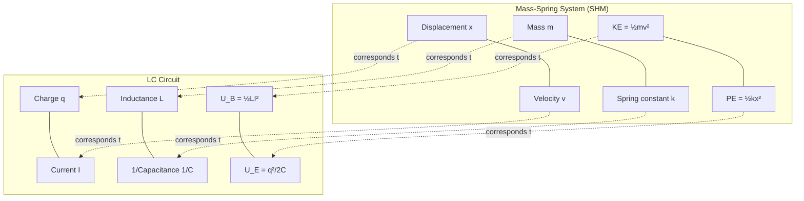

# 13. L-C Oscillations and Simple Harmonic Motion — Analogy

**Course:** PHY-103 (Physics–II) · **Unit:** Magnetism · **Topic 13 of 13**

---

## A. Physical Idea

Topic 12 showed that the LC differential equation, $\ddot{q}+\dfrac{1}{LC}q=0$, has *exactly* the same mathematical structure as the SHM equation for a mass on a spring, $\ddot{x}+\dfrac{k}{m}x=0$. This is not a coincidence or a superficial resemblance — both systems arise from the same underlying physical pattern: a "restoring influence" proportional to displacement (or charge) causing back-and-forth oscillation, with energy continuously exchanged between two complementary forms (kinetic ↔ potential for SHM; magnetic ↔ electric for LC). Making this analogy explicit and quantitative deepens understanding of both systems and allows results from one (well-studied) system to be immediately carried over to the other.

## B. Definition

**LC–SHM analogy:** the mathematical correspondence between the equations governing charge/current oscillation in an ideal LC circuit and displacement/velocity oscillation in an ideal mass-spring system.

> **Plain-English meaning:** an LC circuit is, mathematically, "the same equation" as a mass bouncing on a spring — only the names of the variables change.

## C. The Correspondence Table

| SHM (mass-spring) | LC Oscillation |
|---|---|
| Displacement $x$ | Charge $q$ |
| Velocity $v=\dot{x}$ | Current $I=\dot{q}$ |
| Mass $m$ | Inductance $L$ |
| Spring constant $k$ | $1/C$ |
| Kinetic energy $\frac12mv^2$ | Magnetic energy $\frac12LI^2$ |
| Potential energy $\frac12kx^2$ | Electric energy $\dfrac{q^2}{2C}$ |
| Angular frequency $\omega=\sqrt{k/m}$ | $\omega=1/\sqrt{LC}$ |
| Governing equation $\ddot{x}+\dfrac{k}{m}x=0$ | Governing equation $\ddot{q}+\dfrac{1}{LC}q=0$ |
| Restoring force $F=-kx$ | Restoring "voltage" $V=-q/C$ |

## D. Mathematical Derivation of the Correspondence

**Step 1 — Write both governing equations side by side.**

Mechanical SHM (Newton's second law for a mass $m$ on a spring of constant $k$, with restoring force $F=-kx$):

$$
m\ddot{x} = -kx \implies \ddot{x}+\frac{k}{m}x=0
$$

Electrical LC oscillation (derived in Topic 12 from Kirchhoff's voltage law):

$$
L\ddot{q} = -\frac{q}{C} \implies \ddot{q}+\frac{1}{LC}q=0
$$

**Step 2 — Match terms.** Both equations have the identical form $\ddot{y}+\Omega^2y=0$. Comparing coefficient by coefficient:

$$
x \leftrightarrow q, \qquad m \leftrightarrow L, \qquad k \leftrightarrow \frac{1}{C}, \qquad \frac{k}{m}\leftrightarrow\frac{1}{LC}
$$

**Step 3 — Derive the corresponding frequency relations.** Since $\omega_{SHM}=\sqrt{k/m}$, substituting the correspondence $k\to1/C$, $m\to L$:

$$
\omega_{LC} = \sqrt{\frac{1/C}{L}} = \sqrt{\frac{1}{LC}} = \frac{1}{\sqrt{LC}}
$$

This exactly reproduces the result derived independently (via Kirchhoff's law) in Topic 12 — confirming the correspondence is not just formal notation-matching but produces physically correct, independently verifiable results.

**Step 4 — Derive the energy correspondence.** Mechanical kinetic energy is $\frac12mv^2$; substituting $m\to L$ and $v=\dot x \to I=\dot q$:

$$
\frac12mv^2 \longrightarrow \frac12LI^2 = U_B
$$

Mechanical potential energy (spring) is $\frac12kx^2$; substituting $k\to1/C$ and $x\to q$:

$$
\frac12kx^2 \longrightarrow \frac12\cdot\frac1C\cdot q^2 = \frac{q^2}{2C} = U_E
$$

This shows the electric energy $U_E$ plays the role of potential energy (energy stored due to "displacement"/charge configuration) and the magnetic energy $U_B$ plays the role of kinetic energy (energy associated with "motion"/current flow) — a direct, derivable correspondence, not merely a naming convention.

## E. Similarities

1. **Same differential equation form** → sinusoidal solutions with the same mathematical structure: $x(t)=A\cos(\omega t+\phi) \leftrightarrow q(t)=Q_{max}\cos(\omega t+\phi)$.
2. **Two energy reservoirs, continuously exchanging**, with total energy conserved in the ideal (lossless) case for both systems.
3. **$90^\circ$ phase relationship** between the two conjugate quantities: velocity leads/lags displacement by $90^\circ$ in SHM, exactly as current leads/lags charge by $90^\circ$ in LC oscillation.
4. **Both admit damping and driven-oscillation extensions**: adding friction (mechanical) or resistance (electrical) causes decay; adding a periodic driving force (mechanical) or driving emf (electrical, RLC + AC source) produces resonance phenomena with mathematically identical resonance conditions.

## F. Important Differences

1. **Physical nature of the "restoring force."** In SHM, the restoring force is a genuine mechanical force (tension/compression in a spring) obeying Hooke's law directly. In LC oscillation, there is no literal force on the charge in the same sense — the "restoring" effect arises from the capacitor's voltage $q/C$ opposing further charge buildup via circuit-level voltage balance (Kirchhoff's law), not a spatial force field.

2. **Nature of the oscillating quantities.** $x$ and $v$ in SHM are directly measurable spatial/kinematic quantities with immediate physical/geometric meaning. $q$ and $I$ in LC oscillation are electrical quantities with no direct spatial displacement — nothing physically "moves back and forth" through space in the way a pendulum bob does.

3. **Mechanism of damping.** Mechanical damping typically arises from friction or air resistance (a velocity-dependent force, $F_{damp}=-bv$). Electrical damping arises from resistive (Ohmic) dissipation, $V_{damp}=IR$ — different physical mechanisms, even though mathematically both introduce an analogous first-derivative damping term into the respective differential equations (giving the RLC circuit an equation directly analogous to the damped mass-spring-dashpot system).

4. **What "mass" and "spring constant" represent physically.** Inductance $L$ represents the circuit's opposition to a *changing* current (analogous to inertia, opposition to changing velocity) — but it has no association with any physical mass moving. Capacitance's reciprocal $1/C$ represents how strongly the capacitor "resists" being charged further — an electrical property, not a mechanical stiffness.

## Units and Dimensions — Cross-Check of the Analogy

| Mechanical Quantity | Unit | Electrical Analog | Unit |
|---|---|---|---|
| $m$ | kg | $L$ | H |
| $k$ | N/m | $1/C$ | F$^{-1}$ |
| $x$ | m | $q$ | C |
| $v$ | m/s | $I$ | A |
| $\omega=\sqrt{k/m}$ | rad/s | $\omega=1/\sqrt{LC}$ | rad/s |

Though the dimensional formulas of $m$ and $L$ (or $k$ and $1/C$) are entirely different physical quantities in the SI system, the **combination** $\sqrt{k/m}$ and $\sqrt{1/(LC)}$ both correctly reduce to units of rad/s (T$^{-1}$) — confirming the analogy is dimensionally self-consistent within each system separately, even though $m\ne L$ and $k\ne1/C$ as physical dimensions.

---

## Definitions & Key Terms

1. **Mathematical analogy (isomorphism)** — a correspondence in which two physically distinct systems obey equations of identical mathematical form, allowing solutions and intuition to transfer between them.
   > Plain-English: "same math, different physics" — solving one system automatically tells you how to solve the other.

2. **Electromechanical analogy** — the general principle (of which LC/SHM is one instance) that electrical circuit elements ($L$, $C$, $R$) have direct mathematical analogs among mechanical elements (mass, spring, damper).

---

## Worked Examples

### Example 1 — Foundational

A mass-spring system has $m=0.5\ \text{kg}$, $k=2\ \text{N/m}$. Using the LC–SHM correspondence, what values of $L$ and $C$ would produce an LC circuit with the *same* angular frequency?

1. **Given:** $m=0.5\ \text{kg}$, $k=2\ \text{N/m}$.
2. **Required:** Corresponding $L$, $C$ (not unique — only their combination $1/LC$ must match $k/m$, so we choose $L=m$, $C=1/k$ as the natural/simplest correspondence).
3. **Correspondence:** $L\leftrightarrow m$, $C\leftrightarrow1/k$.
4. **Substitution:** $L = 0.5\ \text{H}$; $C = 1/2 = 0.5\ \text{F}$.
5. **Verify:** $\omega_{SHM}=\sqrt{k/m}=\sqrt{2/0.5}=\sqrt4=2\ \text{rad/s}$. $\omega_{LC}=1/\sqrt{LC}=1/\sqrt{0.5\times0.5}=1/0.5=2\ \text{rad/s}$. ✅ Matches.
6. **Final answer:** $\boxed{L=0.5\ \text{H},\ C=0.5\ \text{F}}$ gives the same $\omega=2\ \text{rad/s}$ as the given mechanical system.

### Example 2 — Intermediate

In an LC circuit, at some instant the magnetic energy is twice the electric energy. By analogy with an SHM system at the equivalent instant, what is the ratio of kinetic to potential energy, and what does this imply about the displacement relative to the amplitude?

1. **Given:** $U_B = 2U_E$ in the LC circuit.
2. **Required:** Corresponding KE:PE ratio and implication for $x/A$ in the SHM analogy.
3. **Correspondence:** $U_B\leftrightarrow\text{KE}$, $U_E\leftrightarrow\text{PE}$, so $\text{KE}=2\,\text{PE}$ at the analogous instant.
4. **Use SHM energy relations:** $\text{PE}=\frac12kx^2$, total energy $E=\frac12kA^2$; since $\text{KE}=E-\text{PE}$, we have $E-\text{PE}=2\,\text{PE} \implies E=3\,\text{PE}$.
5. **Solve for $x/A$:** $\frac12kx^2 = \frac13\cdot\frac12kA^2 \implies x^2 = A^2/3$.
6. **Final answer:** $\boxed{x = A/\sqrt3 \approx 0.577\,A}$ — the mass is displaced to about 58% of its maximum amplitude when its kinetic energy is twice its potential energy, by direct analogy with the LC circuit's charge being at the corresponding fraction of $Q_{max}$.

### Example 3 — Advanced / Exam-Level

Explain, using the analogy, why adding a resistor $R$ in series in an LC circuit is mathematically analogous to adding friction/damping to a mass-spring system, and predict (by analogy, without re-deriving) the qualitative effect on the oscillation.

1. **Given:** RLC series circuit (resistor added to LC circuit); need qualitative behavior by analogy to a damped mass-spring-dashpot system.
2. **Required:** Explanation and qualitative prediction.
3. **Reasoning — extend Kirchhoff's law with resistance:** With a resistor added, Kirchhoff's voltage law gives $L\ddot q + R\dot q + q/C = 0$, i.e. $\ddot q + \dfrac{R}{L}\dot q + \dfrac1{LC}q = 0$.
4. **Reasoning — compare to damped mechanical oscillator:** A mass-spring system with a velocity-dependent friction/damping force $F_{damp}=-b\dot x$ obeys $m\ddot x+b\dot x+kx=0$, i.e. $\ddot x + \dfrac{b}{m}\dot x+\dfrac{k}{m}x=0$ — the **same** mathematical form, with $R\leftrightarrow b$ (damping coefficient) added to the existing $L\leftrightarrow m$, $1/C\leftrightarrow k$ correspondence.
5. **Predicted qualitative behavior (by analogy, without re-derivation):** Just as mechanical friction causes oscillation amplitude to decay exponentially over time (eventually settling to rest, or in extreme damping, not oscillating at all — critical/overdamping), the resistor $R$ in an RLC circuit causes the charge/current oscillation amplitude to **decay exponentially** with time, dissipating energy as heat in the resistor, and (for sufficiently large $R$) can suppress oscillation entirely (overdamped regime).
6. **Conclusion:** $\boxed{\text{Adding } R \text{ is exactly analogous to adding mechanical friction: both introduce a first-derivative "damping" term, causing exponential amplitude decay rather than perpetual oscillation.}}$ This demonstrates the power of the analogy: qualitative (and, with more algebra, fully quantitative) predictions about the electrical system can be made by direct reference to well-understood mechanical damped-oscillator behavior.

---

## Diagram

*Figure 1: Term-by-term correspondence between the mechanical mass-spring SHM system and the electrical LC oscillator.*

---

## Common Mistakes

- ❌ **Mistake:** Treating the LC–SHM analogy as a mere coincidence of similar-looking formulas.
  ✅ **Correct:** The analogy is a genuine mathematical isomorphism — both systems satisfy the identical differential equation $\ddot y + \Omega^2y=0$, derivable independently in each case (Newton's law for SHM, Kirchhoff's law for LC), so *any* result proven for one system (frequency, energy conservation, damping behavior, resonance) transfers rigorously to the other.

- ❌ **Mistake:** Assuming $L$ corresponds to $k$ (spring constant) rather than $m$ (mass).
  ✅ **Correct:** $L\leftrightarrow m$ and $1/C\leftrightarrow k$ (equivalently $C\leftrightarrow1/k$) — inductance behaves like inertia (opposing change in current), which is the electrical analog of mass (opposing change in velocity).

- ❌ **Mistake:** Believing something physically "moves through space" in an LC circuit analogous to the mass's spatial motion.
  ✅ **Correct:** Charge and current are electrical quantities, not spatial ones — the analogy is purely mathematical/structural, not physically literal.

- ❌ **Mistake:** Assuming magnetic energy corresponds to potential energy.
  ✅ **Correct:** Magnetic energy $U_B=\frac12LI^2$ corresponds to **kinetic** energy $\frac12mv^2$ (both depend on the "rate" quantity, $I$ or $v$); electric energy $U_E=q^2/2C$ corresponds to **potential** energy $\frac12kx^2$ (both depend on the "displacement" quantity, $q$ or $x$).

---

## Practice Problems

1. State the correspondence between each pair: ($x$, $q$), ($m$, $L$), ($k$, $1/C$), and explain the physical reasoning behind each pairing.
2. Derive $\omega_{LC}=1/\sqrt{LC}$ from $\omega_{SHM}=\sqrt{k/m}$ purely using the term-by-term substitution, without re-deriving from Kirchhoff's law.
3. Explain why magnetic energy corresponds to kinetic energy and not potential energy in the LC–SHM analogy.
4. Identify one similarity and one important difference between LC oscillation and mechanical SHM, with justification for each.
5. **(Exam-style, no scaffolding)** A mass-spring system has period $T=1.2\ \text{s}$ with $m=0.3\ \text{kg}$. Using the LC–SHM analogy (with $L=m$, $C=1/k$), find the capacitance of an LC circuit with $L=0.3\ \text{H}$ that has the same period.

Solution (Problem 5)

Step 1: Since both systems are constructed to have matching periods and the correspondence uses $L=m=0.3$ H directly, the LC circuit period formula is $T=2\pi\sqrt{LC}$, matching the mechanical $T=2\pi\sqrt{m/k}$ under the substitution $L\to m$, $C\to1/k$.

Step 2: We are told $T=1.2\ \text{s}$ and $L=0.3\ \text{H}$; solve for $C$ using $T=2\pi\sqrt{LC}$.

Step 3: $\sqrt{LC} = T/(2\pi) = 1.2/(2\pi) \approx 0.191$.

Step 4: $LC = (0.191)^2 \approx 0.0365$.

Step 5: $C = 0.0365/0.3 \approx 0.1217$.

**Answer:** $C \approx 0.122\ \text{F}$

---

## Summary

| Concept | Key Result | Condition / Limit |
|---|---|---|
| Core correspondence | $x\leftrightarrow q$, $m\leftrightarrow L$, $k\leftrightarrow1/C$ | Ideal, lossless systems |
| Frequency | $\omega_{LC}=1/\sqrt{LC} \Leftrightarrow \omega_{SHM}=\sqrt{k/m}$ | Direct substitution |
| Energy | $U_B\leftrightarrow\text{KE}$, $U_E\leftrightarrow\text{PE}$ | Both systems conserve total energy |
| Damping analogy | $R\leftrightarrow b$ (friction coefficient) | RLC ↔ damped mass-spring-dashpot |

This completes the Magnetism unit. Together, these thirteen topics progress from the basic definition of the magnetic field, through forces and torques it exerts, through induction phenomena it enables, through the classification and hysteretic behavior of magnetic materials, and finally to the dynamic, oscillatory behavior of LC circuits — unified at the end by their deep mathematical kinship with simple harmonic motion.
