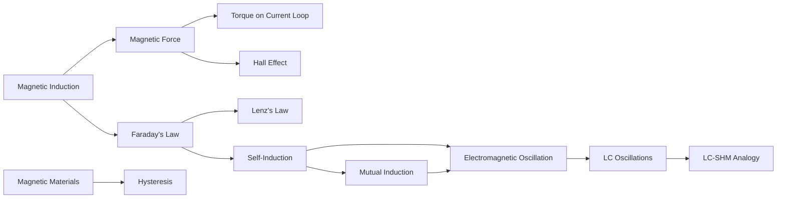

# Magnetism — PHY-103 (Physics–II)

**Course:** PHY-103, Physics–II · **Credit:** 3 · **Total Hours:** 45 · **Unit:** Magnetism (13 topics)

This unit builds a complete picture of magnetism, in the exact syllabus order: from the basic definition of the magnetic field, through forces and torques, through electromagnetic induction, through the classification and hysteretic behavior of magnetic materials, and finally to the oscillatory dynamics of LC circuits and their analogy with simple harmonic motion.

---

## Topic Index

| # | File | Topic |
|---|---|---|
| 01 | [01_magnetic_induction.md](01_magnetic_induction.md) | Magnetic Induction |
| 02 | [02_magnetic_force_on_current_carrying_conductor.md](02_magnetic_force_on_current_carrying_conductor.md) | Magnetic Force on a Current-Carrying Conductor |
| 03 | [03_torque_on_current_carrying_loop.md](03_torque_on_current_carrying_loop.md) | Torque on a Current-Carrying Loop |
| 04 | [04_hall_effect.md](04_hall_effect.md) | Hall Effect |
| 05 | [05_faradays_law.md](05_faradays_law.md) | Faraday's Law of Electromagnetic Induction |
| 06 | [06_lenzs_law.md](06_lenzs_law.md) | Lenz's Law |
| 07 | [07_self_induction.md](07_self_induction.md) | Self-Induction |
| 08 | [08_mutual_induction.md](08_mutual_induction.md) | Mutual Induction |
| 09 | [09_classification_of_magnetic_materials.md](09_classification_of_magnetic_materials.md) | Classification of Magnetic Materials |
| 10 | [10_hysteresis_curve.md](10_hysteresis_curve.md) | Hysteresis Curve |
| 11 | [11_electromagnetic_oscillation.md](11_electromagnetic_oscillation.md) | Electromagnetic Oscillation |
| 12 | [12_lc_oscillations.md](12_lc_oscillations.md) | L-C Oscillations |
| 13 | [13_lc_oscillation_shm_analogy.md](13_lc_oscillation_shm_analogy.md) | Analogy of L-C Oscillations with SHM |

---

## Prerequisite / Conceptual-Flow Diagram

---

## Formula Cheat Sheet

| Topic | Key Formula |
|---|---|
| Magnetic Induction | $\Phi_B = BA\cos\theta$; $\mathbf F = q\mathbf v\times\mathbf B$ |
| Force on Conductor | $\mathbf F = I\mathbf L\times\mathbf B$ |
| Torque on Loop | $\boldsymbol\tau = \mathbf m\times\mathbf B$, $\tau=mB\sin\theta$, $m=NIA$ |
| Hall Effect | $V_H = IB/(nqt)$, $R_H=1/(nq)$ |
| Faraday's Law | $\mathcal E = -N\,d\Phi_B/dt$ |
| Lenz's Law | Direction: induced current opposes $d\Phi_B/dt$ |
| Self-Induction | $\mathcal E=-L\,dI/dt$; $U=\frac12LI^2$ |
| Mutual Induction | $\mathcal E_2=-M\,dI_1/dt$; $M=k\sqrt{L_1L_2}$ |
| Magnetic Materials | $\mathbf M=\chi\mathbf H$; $\mu_r=1+\chi$ |
| Hysteresis | Loop area $=\oint H\,dB$ = energy loss/volume/cycle |
| LC Oscillations | $\ddot q + \dfrac1{LC}q=0$; $\omega=1/\sqrt{LC}$; $T=2\pi\sqrt{LC}$ |
| LC–SHM Analogy | $x\leftrightarrow q$, $m\leftrightarrow L$, $k\leftrightarrow1/C$ |

---

## Notation Conventions

| Symbol | Meaning |
|---|---|
| $\mathbf B$ | Magnetic induction / flux density (vector), tesla |
| $\Phi_B$ | Magnetic flux, weber |
| $\mathcal E$ | Induced emf, volt |
| $L$ | Self-inductance, henry |
| $M$ | Mutual inductance, henry |
| $I$ | Current, ampere |
| $q$ | Charge (Hall effect, LC context), coulomb |
| $\omega$ | Angular frequency, rad/s |
| $T$ | Period, seconds |
| $\mathbf m$ | Magnetic dipole moment, A·m² |
| $\tau$ | Torque, N·m |
| $\chi$, $\mu_r$ | Magnetic susceptibility, relative permeability (dimensionless) |

Bold symbols ($\mathbf B$, $\mathbf F$, $\mathbf L$, $\mathbf m$, $\boldsymbol\tau$) denote vector quantities; non-bold symbols with the same letter (e.g. $B$, $F$) denote their magnitudes.

---

## Important Vector Rules

- **Right-hand rule (force):** for $\mathbf F=q\mathbf v\times\mathbf B$ or $\mathbf F=I\mathbf L\times\mathbf B$ — point fingers along $\mathbf v$ (or $\mathbf L$/current direction), curl toward $\mathbf B$; thumb gives $\mathbf F$ (for positive charge/conventional current).
- **Right-hand rule (dipole moment):** curl fingers along the current's circulation direction around a loop; thumb gives $\mathbf m$.
- **Cross-product magnitude:** $|\mathbf A\times\mathbf B|=AB\sin\theta$; zero at $\theta=0^\circ,180^\circ$; maximum at $\theta=90^\circ$.
- **Lenz's law direction check:** always identify what flux is doing (increasing/decreasing), then determine which current direction *opposes* that specific change — never assume opposition to the field itself.

---

## Important Exam Warnings

- Always distinguish the angle used in $\Phi_B=BA\cos\theta$ (between $\mathbf B$ and the surface **normal**) from the angle used in $\tau=mB\sin\theta$ (also between $\mathbf m$/normal and $\mathbf B$, but appearing as $\sin$, not $\cos$) — a very common source of exam errors.
- Never drop the negative sign in Faraday's/self-induction formulas when explaining direction/physical meaning, even though magnitude calculations often use $|\mathcal E|$.
- Retentivity ($B_r$, tesla) and coercivity ($H_c$, A/m) are frequently confused — check units to verify which is being asked for.
- In LC problems, always take the square root when solving for $\omega$ from $\omega^2=1/LC$.
