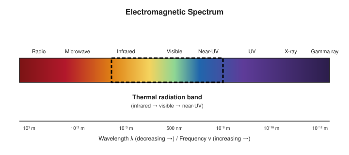
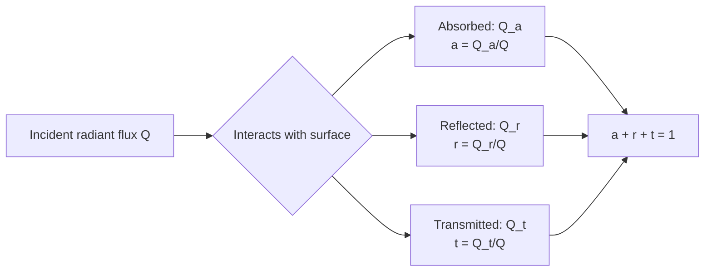

# 01 — Properties of Radiation

## 1. Overview

Every body above absolute zero continuously emits energy in the form of **electromagnetic
radiation**, purely as a consequence of its temperature. This is called **thermal
(radiant) radiation**, and it is fundamentally different from the discrete-line spectra of
atomic emission or the conductive/convective heat transfer studied in
[Kinetic Theory of Gases](../kinetic_theory_of_gases/01_heat.md). This topic sets up the
vocabulary (emission, absorption, reflection, transmission) that every subsequent topic in
this unit — [Blackbody Radiation](02_blackbody_radiation.md) through
[Stefan–Boltzmann Law](08_stefan_boltzmann_law.md) — builds on.

> **Notation:** $\lambda$ = wavelength [m]; $\nu$ = frequency [Hz]; $c$ = speed of light in
> vacuum $= 3\times10^8$ m/s; $T$ = absolute temperature [K].

---

## 2. Definitions & Key Terms

**1. Thermal Radiation** — *Electromagnetic energy emitted by a body solely because of its
temperature, spanning mainly the infrared, visible, and near-ultraviolet bands.*

**2. Radiant Energy ($Q$)** — *The total electromagnetic energy emitted, transmitted, or
absorbed by a body, measured in joules (J).*

**3. Radiant Flux (Radiant Power, $\Phi$)** — *Radiant energy per unit time, $\Phi = dQ/dt$,
measured in watts (W).*

**4. Monochromatic (Spectral) Quantity** — *A radiative quantity evaluated at, or per unit
interval of, a single wavelength $\lambda$ (subscript $\lambda$), as opposed to a quantity
integrated over all wavelengths (unsubscripted, "total").*

---

## 3. Core Content

### 3.1 Nature of Thermal Radiation

Thermal radiation obeys the same laws as all electromagnetic waves: it travels at speed
$c$ in vacuum, requires no medium, obeys $c = \nu\lambda$, and carries energy in quanta
$E = h\nu$ (formalized later in [Quantum Theory of Radiation](09_quantum_theory_of_radiation.md)).
Unlike a discrete atomic-line spectrum, thermal radiation from a hot solid or dense gas is
**continuous** — it contains all wavelengths, with intensity distributed according to
temperature (this distribution is the subject of Planck's law, Topic 02/09).

### 3.2 Four Fundamental Interactions of Incident Radiation

When radiant energy $Q$ (per unit time) is incident on the surface of a body, it is
divided into three parts:

$$Q = Q_a + Q_r + Q_t$$

where $Q_a$ is absorbed, $Q_r$ is reflected, and $Q_t$ is transmitted. Dividing through by
$Q$:

$$a + r + t = 1$$

where $a$ = absorptive power (Topic 04), $r$ = reflecting power (Topic 05), $t$ =
transmitting power (Topic 06) — each a dimensionless fraction between 0 and 1. A fourth
quantity, **emissive power** $E$ (Topic 03), is independent of any incident beam: it
characterizes energy the body itself radiates due to its temperature.

### 3.3 Idealized Limiting Cases

| Body | Property | Idealization |
|---|---|---|
| Perfect blackbody | $a = 1$ | Absorbs all incident radiation, none reflected/transmitted |
| Perfect reflector | $r = 1$ | Polished mirror-like surface |
| Perfectly transparent body | $t = 1$ | E.g. a thin vacuum window |
| Opaque body | $t = 0$ | $a + r = 1$ (most solids, in the thermal band) |

### 3.4 Wavelength Dependence

Real surfaces do not absorb/reflect/transmit uniformly at all wavelengths — $a$, $r$, $t$
are generally functions of $\lambda$ (and, in general, of the angle of incidence and
temperature). A surface that looks perfectly black to visible light (soot, $a_{\text{vis}}
\approx 0.95$) may reflect strongly in the far infrared. This wavelength dependence is why
"blackbody" is an idealization requiring $a_\lambda = 1$ at *every* $\lambda$
simultaneously — the subject of Topic 02.

### 3.5 Why Radiation Matters for Heat Transfer

Unlike conduction and convection, radiative heat transfer requires no medium and scales as
$T^4$ (Stefan–Boltzmann law, Topic 08), making it dominant at high temperatures (furnaces,
stellar surfaces, filaments) and the only mechanism of heat loss to/from a vacuum
(spacecraft thermal control, Earth's energy balance with space).

---

## 4. Worked Examples

### Example 1 — 🟢 Foundational

**Problem:** A surface receives 500 W of radiant flux. It absorbs 350 W, reflects 100 W,
and transmits the rest. Find $a$, $r$, $t$ and verify $a+r+t=1$.

**Solution**

$Q_t = 500 - 350 - 100 = 50$ W

$$a = \frac{350}{500} = 0.70, \quad r = \frac{100}{500} = 0.20, \quad t = \frac{50}{500} = 0.10$$

$$a + r + t = 0.70 + 0.20 + 0.10 = \boxed{1.00} \checkmark$$

---

### Example 2 — 🟡 Intermediate

**Problem:** An opaque body ($t=0$) has absorptive power $a_\lambda = 0.8$ for
$\lambda < 1\;\mu\text{m}$ and $a_\lambda = 0.3$ for $\lambda \geq 1\;\mu\text{m}$.
If 60% of the incident energy at a given moment lies below $1\;\mu\text{m}$ and 40% above,
find the effective (weighted-average) absorptive power.

**Solution**

$$a_{\text{eff}} = (0.60)(0.8) + (0.40)(0.3) = 0.48 + 0.12 = \boxed{0.60}$$

Since $t = 0$: $r_{\text{eff}} = 1 - a_{\text{eff}} = \boxed{0.40}$

---

### Example 3 — 🔴 Advanced / Exam-Level

**Problem:** A satellite surface in vacuum ($t=0$) must be designed so it absorbs minimally
in sunlight (short-$\lambda$, mostly visible/near-IR, $\bar{\lambda} \approx 0.5\;\mu$m)
but emits well in the far-IR ($\bar{\lambda} \approx 10\;\mu$m) to shed internally
generated heat. Explain, using $a+r=1$, what spectral character $a_\lambda$ must have, and
name a real coating family with this property.

**Solution**

We require $a_\lambda$ (equivalently $r_\lambda = 1-a_\lambda$) to be **low at short
$\lambda$** (so $r \to 1$, most sunlight reflected, little absorbed) and, by Kirchhoff's
law (Topic 07, $E_\lambda \propto a_\lambda$), **high at long $\lambda$** (so the surface
is also a good *emitter* in the far-IR, radiating internal heat away efficiently). This is
a **selective surface**: $a_\lambda(0.5\,\mu\text{m}) \ll a_\lambda(10\,\mu\text{m})$.
White paints and certain silvered/aluminized Teflon (second-surface mirror) coatings used
on spacecraft radiators approximate this behaviour — low solar absorptance, high thermal
IR emittance — which is exactly the opposite spectral shape from a solar absorber coating
(used on solar-thermal collectors, which wants the reverse).

---

## 5. Applications

**Textile/Fabric Thermal Comfort** — Fabric coatings and fibre finishes are engineered
with specific $a_\lambda$, $r_\lambda$ profiles: reflective/metallized fabrics (e.g.
emergency blankets, firefighter gear) maximize $r$ in the thermal-IR band to reduce
radiative heat exchange with the wearer's body or an external fire source.

**Greenhouse Effect** — Glass has high $t_\lambda$ for visible sunlight but low $t_\lambda$
(high $a_\lambda$) for the longer-wavelength IR re-radiated by the warmed interior —
trapping energy inside, the same physical principle scaled up to atmospheric CO₂ and
other greenhouse gases.

---

## 6. Diagram / Visual

*Figure 1: The thermal radiation band (infrared through near-ultraviolet) within the full
electromagnetic spectrum — the region governed by the emission/absorption/reflection/
transmission properties developed in this unit.*

*Figure 2: The three-way split of incident radiant flux at any real surface.*

---

## 7. Common Mistakes

- ❌ **Mistake:** Treating $a$, $r$, $t$ as universal constants for a material.
  ✅ **Correct:** They are generally functions of wavelength, angle of incidence, surface
  finish, and temperature — a single number is only a (sometimes crude) average.

- ❌ **Mistake:** Confusing emissive power $E$ (a property of a body's own temperature)
  with absorptive power $a$ (a response to *incident* radiation).
  ✅ **Correct:** $E$ is emitted regardless of incoming radiation; $a$, $r$, $t$ describe
  what happens to radiation arriving from elsewhere. They are linked only via Kirchhoff's
  law (Topic 07) at thermal equilibrium.

- ❌ **Mistake:** Assuming $t = 0$ always.
  ✅ **Correct:** True for most opaque solids in the visible/thermal-IR, but false for
  glass, thin films, and gases — always state the assumption explicitly.

---

## 8. Practice Problems

**Problem 1:** A body absorbs 45% and transmits 15% of incident radiant energy. Find its
reflecting power.

Solution

$r = 1 - a - t = 1 - 0.45 - 0.15 = \boxed{0.40\ (40\%)}$

---

**Problem 2 (Exam-level):** Two surfaces A and B receive the same incident flux $Q$.
Surface A: $a_A = 0.9$, $t_A = 0$. Surface B: $a_B = 0.5$, $t_B = 0.2$. Which surface
reflects more energy, and by what factor?

Solution

$r_A = 1 - 0.9 - 0 = 0.10 \implies Q_{r,A} = 0.10\,Q$

$r_B = 1 - 0.5 - 0.2 = 0.30 \implies Q_{r,B} = 0.30\,Q$

Surface B reflects more, by a factor of $0.30/0.10 = \boxed{3}$.

---

## 9. Summary

| Quantity | Symbol | Definition | Range |
|---|---|---|---|
| Absorptive power | $a$ | $Q_a/Q$ | $0$–$1$ |
| Reflecting power | $r$ | $Q_r/Q$ | $0$–$1$ |
| Transmitting power | $t$ | $Q_t/Q$ | $0$–$1$ |
| Emissive power | $E$ | Energy self-emitted per unit area, time | $\geq 0$ W/m² |
| Conservation | — | $a + r + t = 1$ | — |

Next: [→ Blackbody and Blackbody Radiation](02_blackbody_radiation.md) — the idealized
limit $a_\lambda = 1$ for all $\lambda$.

---

## 10. References

1. **Halliday, Resnick & Walker — *Fundamentals of Physics*, 10th ed., §18-7.** Thermal
   radiation and radiative heat transfer basics.
2. **Serway & Jewett — *Physics for Scientists and Engineers*, 9th ed., Ch. 40.** Radiation
   properties leading into quantum physics.
3. **HyperPhysics — Thermal Radiation.**
   [http://hyperphysics.phy-astr.gsu.edu/hbase/thermo/radfr.html](http://hyperphysics.phy-astr.gsu.edu/hbase/thermo/radfr.html)
