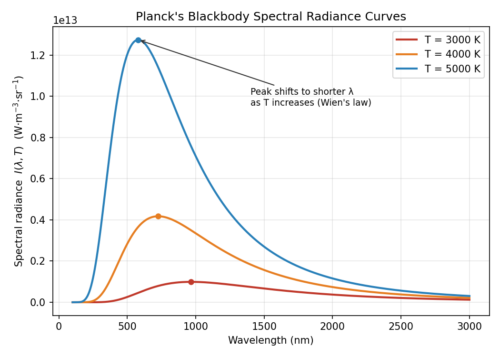
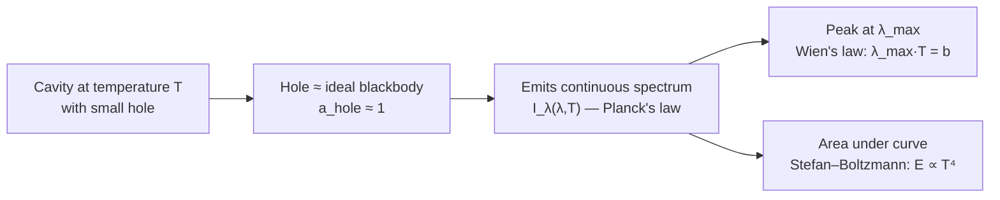

# 02 — Blackbody and Blackbody Radiation

## 1. Overview

A **blackbody** is the idealized limit introduced in
[Properties of Radiation](01_properties_of_radiation.md): a surface with absorptive power
$a_\lambda = 1$ at every wavelength. Because it is also the theoretically *best possible*
emitter (proved via Kirchhoff's Law, Topic 07), the spectrum of radiation it emits —
**blackbody radiation** — depends on temperature alone, not on the material. This
universal spectrum is the experimental puzzle that could not be explained by classical
physics and directly motivated Planck's quantum hypothesis
([Quantum Theory of Radiation](09_quantum_theory_of_radiation.md)).

> **Notation:** $I_\lambda(\lambda,T)$ = spectral radiance [W·m⁻³·sr⁻¹ or W·m⁻²·µm⁻¹];
> $T$ = absolute temperature [K]; $h$ = Planck constant $= 6.626\times10^{-34}$ J·s;
> $k_B$ = Boltzmann constant $=1.38\times10^{-23}$ J/K.

---

## 2. Definitions & Key Terms

**1. Blackbody** — *An idealized surface that absorbs all incident electromagnetic
radiation, at every wavelength and angle ($a_\lambda \equiv 1$), reflecting and
transmitting none.*

**2. Cavity Radiator** — *The standard laboratory realization of a blackbody: a hollow
enclosure held at uniform temperature $T$ with a small aperture. Radiation entering the
hole reflects internally many times and is essentially completely absorbed before it can
escape, so the hole itself radiates (nearly) ideal blackbody spectrum.*

**3. Spectral Radiance** $I_\lambda(\lambda,T)$ — *Power emitted per unit area, per unit
wavelength interval, per unit solid angle, at wavelength $\lambda$ and temperature $T$
(Planck's function).*

**4. Wien's Displacement Law** — *The wavelength of peak emission is inversely
proportional to temperature: $\lambda_{\max}T = b$, with $b = 2.898\times10^{-3}$ m·K.*

---

## 3. Core Content

### 3.1 Why a Small Hole in a Cavity is (Nearly) a Perfect Blackbody

Consider an opaque enclosure at uniform temperature $T$ with a small hole of area $A_{\text{hole}}$
much smaller than the internal cavity surface area. Any ray entering the hole undergoes
many internal reflections/absorptions before it has any real chance of re-emerging; the
probability of escape after $n$ reflections at internal absorptivity $a_{\text{wall}} < 1$
falls as $(1-a_{\text{wall}})^n \to 0$. Hence the hole absorbs essentially all incident
radiation ($a_{\text{hole}} \approx 1$) regardless of the wall material — this is the
standard experimental blackbody.

### 3.2 Planck's Radiation Law (Statement)

The spectral radiance emitted by a blackbody at temperature $T$, as a function of
wavelength, is given by **Planck's law**:

$$\boxed{I_\lambda(\lambda,T) = \frac{2hc^2}{\lambda^5}\,\frac{1}{e^{hc/\lambda k_BT}-1}}$$

The full statistical-mechanical derivation (quantizing the cavity's electromagnetic modes
as an ensemble of quantum oscillators and applying Bose–Einstein statistics) is developed
in detail in [Quantum Theory of Radiation](09_quantum_theory_of_radiation.md); here the
law is used descriptively to characterize the blackbody spectrum's shape and limits.

### 3.3 Key Features of the Spectrum

- **Continuous:** unlike atomic line spectra, $I_\lambda$ is smooth and nonzero over all
  $\lambda > 0$.
- **Single peak:** for fixed $T$, $I_\lambda$ rises from zero, reaches a maximum at
  $\lambda_{\max}$, then falls — never bimodal.
- **Total area under the curve** (integrated over all $\lambda$) gives the total emissive
  power, which scales as $T^4$ — this is exactly the Stefan–Boltzmann law (Topic 08),
  derivable by integrating Planck's law over $\lambda$.
- **Universal:** at a given $T$, every true blackbody — regardless of material — has
  *identical* $I_\lambda(\lambda,T)$.

### 3.4 Wien's Displacement Law

Differentiating $I_\lambda(\lambda,T)$ with respect to $\lambda$ at fixed $T$ and setting
the result to zero (solving the resulting transcendental equation numerically) gives:

$$\boxed{\lambda_{\max}\,T = b = 2.898\times10^{-3}\;\text{m·K}}$$

As $T$ increases, $\lambda_{\max}$ decreases — the peak shifts toward shorter (bluer)
wavelengths, visible as the familiar "red hot → white hot → blue hot" progression of a
heated filament.

### 3.5 Classical Failure at Short Wavelengths

At long wavelengths, Planck's law reduces to the classical Rayleigh–Jeans form (Topic 09);
at short wavelengths, however, the classical prediction diverges ($I_\lambda \to \infty$
as $\lambda \to 0$) while the real, measured spectrum (and Planck's formula) correctly
falls back to zero. This divergence, dubbed the "ultraviolet catastrophe," is resolved
only by the quantization $E = h\nu$ — detailed in Topic 09.

---

## 4. Worked Examples

### Example 1 — 🟢 Foundational

**Problem:** The Sun's surface radiates approximately as a blackbody with peak wavelength
$\lambda_{\max} \approx 500$ nm. Estimate the Sun's surface temperature.

**Solution**

$$T = \frac{b}{\lambda_{\max}} = \frac{2.898\times10^{-3}}{500\times10^{-9}} = \boxed{5796\;\text{K} \approx 5800\;\text{K}}$$

(Matches the accepted photospheric temperature of the Sun, ≈ 5778 K.)

---

### Example 2 — 🟡 Intermediate

**Problem:** A tungsten filament lamp operates at $T = 2900$ K. (a) Find $\lambda_{\max}$.
(b) Is this in the visible range? What does this imply about the lamp's luminous
efficiency?

**Solution**

**(a)**
$$\lambda_{\max} = \frac{b}{T} = \frac{2.898\times10^{-3}}{2900} = 9.99\times10^{-7}\;\text{m} \approx \boxed{1000\;\text{nm (near-IR)}}$$

**(b)** Visible light spans roughly 400–700 nm. Since $\lambda_{\max} \approx 1000$ nm
lies well into the infrared, most of the filament's radiated energy is emitted as heat
(IR) rather than visible light — consistent with the well-known low luminous efficiency
(~2–3%) of incandescent bulbs.

---

### Example 3 — 🔴 Advanced / Exam-Level

**Problem:** Two stars A and B are both well-approximated as blackbodies. Star A has
$\lambda_{\max,A} = 290$ nm and Star B has $\lambda_{\max,B} = 580$ nm. (a) Find the ratio
$T_A/T_B$. (b) Using the (yet-to-be-derived) Stefan–Boltzmann result $E \propto T^4$, find
the ratio of their total emissive power per unit area, $E_A/E_B$.

**Solution**

**(a)** By Wien's law, $T \propto 1/\lambda_{\max}$:

$$\frac{T_A}{T_B} = \frac{\lambda_{\max,B}}{\lambda_{\max,A}} = \frac{580}{290} = \boxed{2}$$

Star A is twice as hot as Star B.

**(b)**
$$\frac{E_A}{E_B} = \left(\frac{T_A}{T_B}\right)^4 = 2^4 = \boxed{16}$$

Star A radiates 16 times more power per unit surface area than Star B, illustrating why
even a modest temperature difference produces a large difference in radiated power — the
core reason the $T^4$ law (Topic 08) dominates high-temperature heat transfer.

---

## 5. Applications

**Pyrometry / Non-Contact Thermometry** — Measuring $\lambda_{\max}$ (or the full spectral
shape) of radiation from a furnace, molten metal, or kiln lets engineers infer temperature
without physical contact — essential in textile dyeing/finishing ovens and metal
processing where direct thermometry is impractical.

**Astrophysics** — Stellar surface temperatures, from cool red dwarfs (~3000 K, peak in
IR) to hot blue giants (>20,000 K, peak in UV), are routinely estimated from their
blackbody-like spectra using Wien's law, exactly as in Example 3 above.

---

## 6. Diagram / Visual

*Figure 1: Planck spectral-radiance curves at 3000 K, 4000 K, and 5000 K. The peak
wavelength shifts to shorter λ and the total area (total power) increases sharply with T,
illustrating both Wien's displacement law and the T⁴ scaling of Stefan–Boltzmann's law.*

*Figure 2: From idealized cavity to the two key empirical laws extracted from the
blackbody spectrum.*

---

## 7. Common Mistakes

- ❌ **Mistake:** Thinking "blackbody" means visually black at room temperature.
  ✅ **Correct:** "Blackbody" refers to perfect absorptivity/emissivity, not visible
  colour — a blackbody at high $T$ can appear white or blue-white (e.g., the Sun).

- ❌ **Mistake:** Assuming the blackbody spectrum depends on the cavity's wall material.
  ✅ **Correct:** The spectrum depends on $T$ *alone* — this material-independence is the
  entire reason blackbody radiation could be treated as a universal physical law.

- ❌ **Mistake:** Applying Wien's law with $T$ in Celsius.
  ✅ **Correct:** $T$ must be the absolute (Kelvin) temperature; using °C gives wildly
  wrong $\lambda_{\max}$.

---

## 8. Practice Problems

**Problem 1:** The cosmic microwave background radiation is a near-perfect blackbody
spectrum peaking at $\lambda_{\max} \approx 1.06$ mm. Find its temperature.

Solution

$$T = \frac{b}{\lambda_{\max}} = \frac{2.898\times10^{-3}}{1.06\times10^{-3}} = \boxed{2.73\;\text{K}}$$

(This matches the accepted CMB temperature of 2.725 K, a landmark confirmation of Big Bang
cosmology.)

---

**Problem 2 (Exam-level):** A blackbody's peak wavelength shifts from 800 nm to 400 nm
after heating. (a) By what factor did $T$ increase? (b) By what factor did the total
emissive power (per unit area) increase?

Solution

**(a)** $T \propto 1/\lambda_{\max}$, so $T_2/T_1 = 800/400 = \boxed{2}$ (temperature
doubled).

**(b)** $E \propto T^4 \implies E_2/E_1 = 2^4 = \boxed{16}$ (16-fold increase).

---

## 9. Summary

| Quantity | Formula | Notes |
|---|---|---|
| Planck's law | $I_\lambda = \dfrac{2hc^2}{\lambda^5}\dfrac{1}{e^{hc/\lambda k_BT}-1}$ | Full derivation in Topic 09 |
| Wien's displacement law | $\lambda_{\max}T = 2.898\times10^{-3}\;\text{m·K}$ | Peak shifts shorter as $T$ ↑ |
| Total power scaling | $E \propto T^4$ | Proved in Topic 08 |
| Blackbody idealization | $a_\lambda \equiv 1$ | Realized experimentally by a cavity + small hole |

Next: [→ Emissive Power](03_emissive_power.md) — formally defining $E$ before applying it
to $a$, $r$, $t$, Kirchhoff's law, and Stefan–Boltzmann's law.

---

## 10. References

1. **Halliday, Resnick & Walker — *Fundamentals of Physics*, 10th ed., §40-1.** Blackbody
   radiation, cavity radiator model.
2. **Serway & Jewett — *Physics for Scientists and Engineers*, 9th ed., §40.1.** Planck's
   law and Wien's law with worked astrophysical examples.
3. **HyperPhysics — Blackbody Radiation.**
   [http://hyperphysics.phy-astr.gsu.edu/hbase/mod6.html](http://hyperphysics.phy-astr.gsu.edu/hbase/mod6.html)
4. **MIT OCW 8.04 — Quantum Physics I, Lecture Notes on Blackbody Radiation.**
