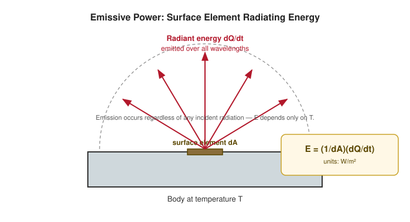
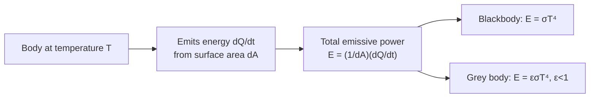

# 03 — Emissive Power

## 1. Overview

Emissive power quantifies how much radiant energy a body gives off on its own, purely as
a function of its temperature — independent of whatever incident radiation it may also be
receiving. It is the "output" counterpart to the absorptive, reflecting, and transmitting
powers of [Properties of Radiation](01_properties_of_radiation.md), and is the quantity
that [Kirchhoff's Law](07_kirchhoffs_law.md) links back to absorptive power, and that
[Stefan–Boltzmann's Law](08_stefan_boltzmann_law.md) shows scales as $T^4$.

> **Notation:** $E$ = total emissive power [W/m²]; $E_\lambda$ = spectral (monochromatic)
> emissive power [W/m²/m of $\lambda$]; $A$ = surface area [m²].

---

## 2. Definitions & Key Terms

**1. Total Emissive Power ($E$)** — *The total radiant energy emitted per unit time, per
unit area of a surface, summed over all wavelengths, at a given temperature:*
$$E = \frac{1}{A}\frac{dQ_{\text{emitted}}}{dt}\qquad[\text{W/m}^2]$$

**2. Spectral (Monochromatic) Emissive Power ($E_\lambda$)** — *The emissive power per unit
wavelength interval at wavelength $\lambda$, such that* $E = \int_0^\infty E_\lambda\,d\lambda$.

**3. Emissivity ($\varepsilon$)** — *The ratio of a real surface's emissive power to that of
a blackbody at the same temperature,* $\varepsilon = E_{\text{real}}/E_{\text{black}} \leq 1$.

**4. Radiant Exitance** — *A synonym for total emissive power used in some optics/photometry
texts; identical physical quantity to $E$ here.*

---

## 3. Core Content

### 3.1 Formal Definition

For a small surface element of area $dA$ emitting radiant power $dQ/dt$ (summed over all
wavelengths, into the full hemisphere above the surface), the emissive power is:

$$E = \frac{1}{dA}\frac{dQ}{dt}$$

$E$ has SI units of W/m² (or, per unit wavelength, $E_\lambda$ has units W·m⁻³, i.e.
W per m² per m of $\lambda$).

### 3.2 Relation to Blackbody Emission

For an ideal blackbody, $E_\lambda(\lambda,T)$ is precisely the Planck spectral radiance
function of [Blackbody Radiation](02_blackbody_radiation.md) (integrated over solid angle),
and the total $E_{\text{black}}(T) = \sigma T^4$ (Stefan–Boltzmann, Topic 08). A real
surface emits less at every wavelength:

$$E_\lambda^{\text{real}}(\lambda,T) = \varepsilon_\lambda(\lambda,T)\,E_\lambda^{\text{black}}(\lambda,T), \qquad 0 \leq \varepsilon_\lambda \leq 1$$

A **grey body** is the common simplifying idealization where $\varepsilon_\lambda =
\varepsilon$ = constant, independent of $\lambda$, so that $E_{\text{real}} = \varepsilon
\sigma T^4$.

### 3.3 Why $E$ Depends Only on the Body, Not on Incident Radiation

Emissive power is fundamentally different from absorptive/reflecting/transmitting power:
those three describe the *fate of incoming* radiation, whereas $E$ describes radiation the
body emits from its own internal thermal energy — a body in complete darkness (zero
incident flux) still has a well-defined, nonzero $E$ as long as $T > 0$.

### 3.4 Typical Emissivities

| Surface | $\varepsilon$ (approx.) |
|---|---|
| Blackbody (ideal) | 1.00 |
| Lampblack / soot | 0.95 |
| Human skin | 0.98 |
| Oxidized steel | 0.80 |
| Polished aluminium | 0.05 |
| Polished silver | 0.02 |

Polished metals are poor emitters (and, by Kirchhoff's law, poor absorbers) — which is why
they are used for radiation shields and vacuum-flask coatings.

---

## 4. Worked Examples

### Example 1 — 🟢 Foundational

**Problem:** A hot surface of area $2\times10^{-4}$ m² radiates a measured total power of
11.34 W. Find its total emissive power $E$.

**Solution**

$$E = \frac{P}{A} = \frac{11.34}{2\times10^{-4}} = \boxed{5.67\times10^{4}\;\text{W/m}^2}$$

(This happens to equal $\sigma T^4$ at $T=1000$ K — always compute $E$ from the measured
power and area directly; only assume blackbody behaviour, $E=\sigma T^4$, when the surface
is explicitly stated or assumed to be an ideal blackbody.)

---

### Example 2 — 🟡 Intermediate

**Problem:** A grey body has emissivity $\varepsilon = 0.6$ and is at $T = 800$ K. Find its
total emissive power. ($\sigma = 5.67\times10^{-8}$ W m⁻² K⁻⁴)

**Solution**

$$E = \varepsilon\sigma T^4 = 0.6 \times 5.67\times10^{-8} \times (800)^4$$

$(800)^4 = 4.096\times10^{11}$

$$E = 0.6 \times 5.67\times10^{-8} \times 4.096\times10^{11} = 0.6 \times 2.322\times10^4$$

$$\boxed{E \approx 1.39\times10^4\;\text{W/m}^2}$$

---

### Example 3 — 🔴 Advanced / Exam-Level

**Problem:** Two spheres, A (blackbody, radius $r_A = 2$ cm) and B (grey body,
$\varepsilon_B = 0.5$, radius $r_B = 4$ cm), are both at $T = 500$ K. Find the ratio of
their total radiated *power* (not just emissive power), $P_A/P_B$.

**Solution**

Power = $E \times$ surface area $= E \times 4\pi r^2$.

$$P_A = \sigma T^4 \times 4\pi r_A^2, \qquad P_B = \varepsilon_B\sigma T^4 \times 4\pi r_B^2$$

$$\frac{P_A}{P_B} = \frac{1 \times r_A^2}{\varepsilon_B \times r_B^2} = \frac{(0.02)^2}{0.5\times(0.04)^2} = \frac{4\times10^{-4}}{0.5\times1.6\times10^{-3}} = \frac{4\times10^{-4}}{8\times10^{-4}}$$

$$\boxed{\frac{P_A}{P_B} = 0.5}$$

Despite being the ideal emitter, sphere A radiates only half the total power of B, because
B's much larger surface area ($r_B = 2r_A \Rightarrow$ area $4\times$ larger) more than
compensates for its lower emissivity.

---

## 5. Applications

**Thermal Imaging & Textile Quality Control** — Infrared cameras measure apparent
radiance (related to $E$) of fabric surfaces during drying/finishing; because
$\varepsilon$ varies with fibre type and finish, calibration against known emissivities is
essential for accurate non-contact temperature readings on a production line.

**Vacuum Flask (Thermos) Design** — Silvering the inner wall gives low $\varepsilon$, so
the emissive power (and, by Kirchhoff's law, the absorptive power) is minimized —
suppressing radiative heat transfer between the hot/cold contents and the outer wall.

---

## 6. Diagram / Visual

*Figure 1: A surface element $dA$ radiating energy $dQ/dt$; emissive power
$E = dQ/(A\,dt)$, summed over all emitted wavelengths.*

*Figure 2: From surface emission to the emissive-power definitions used throughout this
unit.*

---

## 7. Common Mistakes

- ❌ **Mistake:** Confusing emissive power (a rate per unit area) with total radiated
  energy or power.
  ✅ **Correct:** $E$ [W/m²] must be multiplied by surface area to get total power [W],
  and by time to get total energy [J].

- ❌ **Mistake:** Assuming $\varepsilon$ is a single universal constant for a material.
  ✅ **Correct:** $\varepsilon$ generally depends on wavelength, temperature, and surface
  finish (oxidation, roughness, coating) — the constant-$\varepsilon$ "grey body" is a
  simplifying approximation.

- ❌ **Mistake:** Using $E = \sigma T^4$ for a non-blackbody without the $\varepsilon$
  factor.
  ✅ **Correct:** Only true blackbodies satisfy $E = \sigma T^4$ exactly; real surfaces
  need $E = \varepsilon\sigma T^4$.

---

## 8. Practice Problems

**Problem 1:** A blackbody at 600 K has surface area $0.01$ m². Find the total power
radiated. ($\sigma = 5.67\times10^{-8}$ W m⁻² K⁻⁴)

Solution

$E = \sigma T^4 = 5.67\times10^{-8}\times(600)^4 = 5.67\times10^{-8}\times1.296\times10^{11} = 7348\;\text{W/m}^2$

$P = EA = 7348 \times 0.01 = \boxed{73.5\;\text{W}}$

---

**Problem 2 (Exam-level):** A grey filament with $\varepsilon = 0.4$ must radiate the same
total power as a blackbody at 1000 K of the same area. What temperature must the filament
reach?

Solution

$\varepsilon\sigma T_f^4 = \sigma(1000)^4 \implies T_f^4 = \dfrac{(1000)^4}{0.4} = 2.5\times10^{12}$

$T_f = (2.5\times10^{12})^{1/4} = \boxed{1257\;\text{K (approx.)}}$

---

## 9. Summary

| Quantity | Formula | Notes |
|---|---|---|
| Total emissive power | $E = \dfrac{1}{dA}\dfrac{dQ}{dt}$ | W/m² |
| Spectral emissive power | $E = \int_0^\infty E_\lambda\,d\lambda$ | — |
| Blackbody emissive power | $E = \sigma T^4$ | Ideal limit |
| Grey body emissive power | $E = \varepsilon\sigma T^4$ | $\varepsilon < 1$ |
| Emissivity | $\varepsilon = E_{\text{real}}/E_{\text{black}}$ | $0 \leq \varepsilon \leq 1$ |

Next: [→ Absorptive Power](04_absorptive_power.md) — the incident-side counterpart, linked
to $E$ via Kirchhoff's law.

---

## 10. References

1. **Halliday, Resnick & Walker — *Fundamentals of Physics*, 10th ed., §18-7.** Radiative
   heat transfer and emissivity.
2. **Young & Freedman — *University Physics*, 14th ed., §17.7.** Emissive power, Stefan's
   law, grey-body approximation.
3. **HyperPhysics — Emissivity.**
   [http://hyperphysics.phy-astr.gsu.edu/hbase/thermo/emis.html](http://hyperphysics.phy-astr.gsu.edu/hbase/thermo/emis.html)
