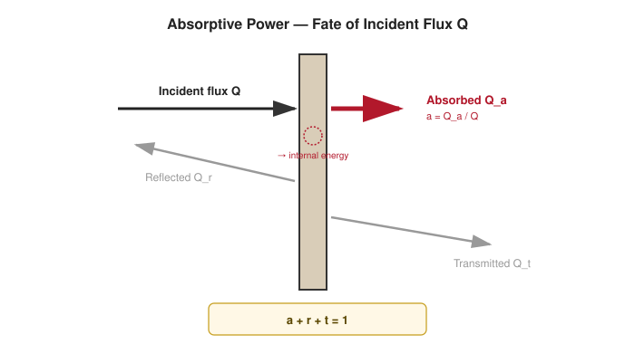
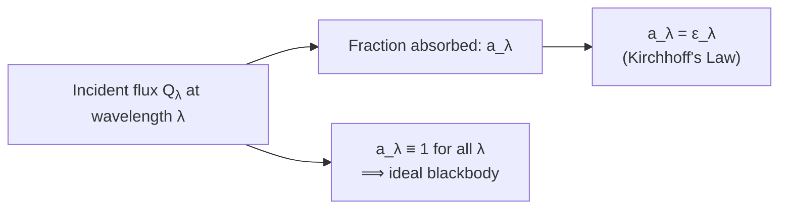

# 04 — Absorptive Power

## 1. Overview

Absorptive power measures what fraction of *incident* radiant energy a surface absorbs,
one of the three-way split introduced in [Properties of Radiation](01_properties_of_radiation.md)
alongside reflecting power (Topic 05) and transmitting power (Topic 06). It is the bridge
quantity linking incoming radiation to a body's internal energy, and — via
[Kirchhoff's Law](07_kirchhoffs_law.md) — to its own emissive power (Topic 03). The
blackbody of [Topic 02](02_blackbody_radiation.md) is precisely the idealization
$a_\lambda \equiv 1$.

> **Notation:** $Q$ = total incident radiant energy; $Q_a$ = absorbed portion; $a$ = total
> absorptive power (dimensionless, $0$–$1$); $a_\lambda$ = spectral (monochromatic)
> absorptive power at wavelength $\lambda$.

---

## 2. Definitions & Key Terms

**1. Absorptive Power ($a$)** — *The fraction of total incident radiant energy that a
surface absorbs:* $a = Q_a/Q$, dimensionless, $0 \leq a \leq 1$.

**2. Spectral Absorptive Power ($a_\lambda$)** — *The fraction of incident energy absorbed
specifically at wavelength $\lambda$; generally $a_\lambda$ varies with $\lambda$.*

**3. Absorptivity** — *Synonym for absorptive power, used interchangeably in most
textbooks; some texts reserve "absorptivity" for the material property and "absorptance"
for the measured value on a particular sample/finish.*

**4. Selective Absorber** — *A surface whose $a_\lambda$ varies strongly with wavelength
(e.g. high in visible, low in IR), as opposed to a grey body where $a_\lambda \approx$
constant.*

---

## 3. Core Content

### 3.1 Formal Definition

If a surface receives total incident radiant flux $Q$ (energy per unit time) and absorbs
$Q_a$ of it, converting that energy into internal (thermal) energy of the body:

$$a = \frac{Q_a}{Q}, \qquad 0 \leq a \leq 1$$

For monochromatic (single-wavelength) incident radiation of flux $Q_\lambda\,d\lambda$:

$$a_\lambda = \frac{dQ_a}{dQ_\lambda}$$

and the total absorptive power for a real (non-uniform) incident spectrum is the
intensity-weighted average of $a_\lambda$ over the actual incident spectrum — this is why
the *same surface* can have different total $a$ under sunlight vs. under a tungsten lamp,
since the two sources have different spectral distributions.

### 3.2 The Blackbody as $a_\lambda = 1$

A perfect blackbody is defined by $a_\lambda(\lambda) = 1$ for *every* $\lambda$
simultaneously — not merely a high average. Real "black" surfaces (lampblack, carbon
nanotube coatings) achieve $a \approx 0.95$–$0.99$ over the visible/near-IR but never
reach exactly 1, and typically their $a_\lambda$ still varies somewhat across the full
spectrum.

### 3.3 Relation to Kirchhoff's Law

At thermal equilibrium, a body's absorptive power at a given wavelength equals its
*emissivity* at that same wavelength:

$$a_\lambda = \varepsilon_\lambda$$

This is proved formally in [Kirchhoff's Law](07_kirchhoffs_law.md); it is the reason good
absorbers (like soot) are also good emitters, and poor absorbers (polished metals) are
poor emitters.

### 3.4 Factors Affecting Absorptive Power

- **Surface colour/finish:** dark, matte surfaces have higher $a$ in the visible band than
  light, polished surfaces.
- **Wavelength:** the same surface can be a strong absorber at one $\lambda$ and a weak
  absorber at another (selective absorbers, Example 3 below).
- **Angle of incidence:** $a$ generally decreases as the angle from the surface normal
  increases (grazing incidence reflects more).
- **Temperature:** for some materials $a_\lambda$ shifts measurably with the absorbing
  body's own temperature.

---

## 4. Worked Examples

### Example 1 — 🟢 Foundational

**Problem:** A surface absorbs 240 W out of 400 W of incident radiant flux. Find $a$.

**Solution**

$$a = \frac{Q_a}{Q} = \frac{240}{400} = \boxed{0.60}$$

---

### Example 2 — 🟡 Intermediate

**Problem:** An opaque surface ($t=0$) reflects 35% of incident light. Find its absorptive
power, and — using Kirchhoff's law — its emissivity at the same wavelength.

**Solution**

Since $t=0$: $a = 1 - r = 1 - 0.35 = \boxed{0.65}$

By Kirchhoff's law, $\varepsilon = a = \boxed{0.65}$ (at the same wavelength and
temperature).

---

### Example 3 — 🔴 Advanced / Exam-Level

**Problem:** A solar-thermal collector coating is designed as a **selective absorber**:
$a_\lambda = 0.92$ for $\lambda < 2.5\;\mu\text{m}$ (covers most of the solar spectrum) and
$a_\lambda = 0.10$ for $\lambda \geq 2.5\;\mu\text{m}$ (covers the collector's own thermal
IR re-emission at its ~350 K operating temperature). If 95% of incoming solar energy lies
below $2.5\;\mu$m and 5% above, while 98% of the collector's own thermal emission lies
above $2.5\;\mu$m, find (a) the effective absorptivity for sunlight and (b) the effective
emissivity for the collector's own thermal radiation. Comment on why this asymmetry is
desirable.

**Solution**

**(a)** Effective absorptivity for solar input:
$$a_{\text{solar}} = (0.95)(0.92) + (0.05)(0.10) = 0.874 + 0.005 = \boxed{0.879}$$

**(b)** By Kirchhoff's law, $\varepsilon_\lambda = a_\lambda$ at each $\lambda$. Effective
emissivity for the collector's own (mostly long-$\lambda$) thermal emission:
$$\varepsilon_{\text{thermal}} = (0.02)(0.92) + (0.98)(0.10) = 0.0184 + 0.098 = \boxed{0.116}$$

**Comment:** The coating absorbs ~88% of incoming sunlight (good solar collector) but
re-emits only ~12% as efficiently as a blackbody at its own operating temperature (poor
thermal emitter), meaning very little of the absorbed solar energy is radiated back away —
this asymmetric spectral selectivity is exactly what makes selective-surface solar
absorber coatings far more efficient than a plain black (grey, $a=\varepsilon$ at all
$\lambda$) painted collector, which would re-radiate a much larger share of collected heat.

---

## 5. Applications

**Solar-Thermal Textile Drying/Curing** — Selective-absorber principles (Example 3) are
used in solar dryers and radiant curing ovens for textile finishing, where maximizing
absorbed solar/IR-lamp energy while minimizing radiative loss improves energy efficiency.

**Camouflage and IR Signature Management** — Military fabrics and coatings are engineered
with controlled $a_\lambda$ in the thermal-IR band to reduce detectability by IR imaging,
directly exploiting the wavelength-dependence discussed in §3.4.

---

## 6. Diagram / Visual

*Figure 1: Incident flux $Q$ striking a surface; the absorbed component $Q_a$ (highlighted)
defines $a = Q_a/Q$, with $a+r+t=1$.*

*Figure 2: Absorptive power's two defining relationships — to emissivity and to the
blackbody idealization.*

---

## 7. Common Mistakes

- ❌ **Mistake:** Treating $a$ as a fixed material property independent of the incident
  spectrum.
  ✅ **Correct:** The *total* $a$ for a given surface depends on the spectral shape of the
  incident radiation (Example 3) — only $a_\lambda$ at a specific wavelength is
  unambiguous.

- ❌ **Mistake:** Applying $a = \varepsilon$ (Kirchhoff's law) at different wavelengths or
  different temperatures for the absorbing vs. emitting process.
  ✅ **Correct:** Kirchhoff's law strictly requires $a_\lambda = \varepsilon_\lambda$ at the
  *same* $\lambda$ and *same* $T$ — it is a statement about a single surface in thermal
  equilibrium with its surroundings, not a general shortcut.

- ❌ **Mistake:** Assuming a black-looking surface has $a \approx 1$ at all wavelengths.
  ✅ **Correct:** Visual blackness only tells you about $a$ in the visible band; the same
  surface may be a poor absorber in the IR (see the selective-absorber discussion above).

---

## 8. Practice Problems

**Problem 1:** A surface absorbs 180 J out of 300 J of incident radiant energy in 10 s.
Find its absorptive power.

Solution

$a = Q_a/Q = 180/300 = \boxed{0.60}$ (time does not matter — $a$ is a ratio of energies,
and the elapsed time cancels since both quantities are measured over the same interval.)

---

**Problem 2 (Exam-level):** An opaque body has $a_\lambda = 0.9$ for visible light and
$a_\lambda = 0.2$ for infrared. Under a source where 70% of the flux is visible and 30% is
infrared, find the effective absorptive power and the effective reflecting power.

Solution

$a_{\text{eff}} = (0.7)(0.9) + (0.3)(0.2) = 0.63 + 0.06 = \boxed{0.69}$

Since $t=0$ (opaque): $r_{\text{eff}} = 1 - a_{\text{eff}} = \boxed{0.31}$

---

## 9. Summary

| Quantity | Formula | Notes |
|---|---|---|
| Absorptive power | $a = Q_a/Q$ | $0$–$1$, dimensionless |
| Spectral absorptive power | $a_\lambda = dQ_a/dQ_\lambda$ | Wavelength-dependent |
| Blackbody condition | $a_\lambda \equiv 1$ | All $\lambda$ simultaneously |
| Kirchhoff's relation | $a_\lambda = \varepsilon_\lambda$ | Same $\lambda$, same $T$, equilibrium |

Next: [→ Reflecting Power](05_reflecting_power.md) — the second component of the
$a+r+t=1$ split.

---

## 10. References

1. **Halliday, Resnick & Walker — *Fundamentals of Physics*, 10th ed., §18-7.** Absorption
   and radiative equilibrium.
2. **Serway & Jewett — *Physics for Scientists and Engineers*, 9th ed., Ch. 40.**
   Absorptivity and Kirchhoff's law.
3. **HyperPhysics — Absorptivity and Selective Surfaces.**
   [http://hyperphysics.phy-astr.gsu.edu/hbase/thermo/thermo.html](http://hyperphysics.phy-astr.gsu.edu/hbase/thermo/thermo.html)
