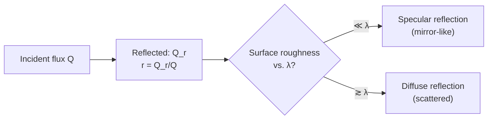

# 05 — Reflecting Power

## 1. Overview

Reflecting power is the second member of the incident-flux split
$a+r+t=1$ introduced in [Properties of Radiation](01_properties_of_radiation.md), measuring
the fraction of incident radiant energy a surface reflects rather than absorbing
([Absorptive Power](04_absorptive_power.md)) or transmitting
([Transmitting Power](06_transmitting_power.md)). Because $r_\lambda = 1 - a_\lambda$ for an
opaque surface, high reflecting power is the direct counterpart of low absorptivity, with
the same Kirchhoff's-law implications for emissivity.

> **Notation:** $Q$ = total incident radiant flux; $Q_r$ = reflected portion; $r$ = total
> reflecting power ($0$–$1$); $r_\lambda$ = spectral reflecting power.

---

## 2. Definitions & Key Terms

**1. Reflecting Power ($r$)** — *The fraction of total incident radiant energy reflected
by a surface:* $r = Q_r/Q$, dimensionless, $0 \leq r \leq 1$.

**2. Specular Reflection** — *Mirror-like reflection where the reflected ray leaves at the
same angle as the angle of incidence (to the surface normal), preserving the beam's
directionality.*

**3. Diffuse Reflection** — *Reflection scattered over a range of angles due to surface
roughness at the wavelength scale, as from matte or textured surfaces (most fabrics,
unpolished materials).*

**4. Albedo** — *A near-synonym used in astronomy/climatology for the fraction of incident
(usually solar) radiation a surface or planet reflects — physically identical to $r$.*

---

## 3. Core Content

### 3.1 Formal Definition

$$r = \frac{Q_r}{Q}, \qquad 0 \leq r \leq 1$$

with the spectral version $r_\lambda = dQ_r/dQ_\lambda$ generally wavelength-dependent, and
for an opaque body ($t=0$):

$$r = 1 - a$$

### 3.2 Specular vs. Diffuse Reflection

Whether reflection is specular or diffuse depends on surface roughness relative to the
wavelength of the incident radiation:

- **Specular:** surface irregularities $\ll \lambda$ (polished metals, mirrors, calm water
  surface for visible light).
- **Diffuse:** surface irregularities $\gtrsim \lambda$ (matte paint, most fabrics, paper,
  unpolished stone).

Total reflecting power $r$ as defined here (energy-based) does not distinguish specular
from diffuse — both contribute to $Q_r$ — but the distinction matters for applications
(imaging vs. diffuse illumination) and for how reflected energy is angularly distributed.

### 3.3 Wavelength Dependence and Colour

The visible colour of an opaque object is a direct consequence of $r_\lambda$: a red cloth
reflects strongly in the red band ($\lambda \approx 620$–$700$ nm) and absorbs strongly
elsewhere in the visible. White surfaces have high, roughly flat $r_\lambda$ across the
visible band; black surfaces have low $r_\lambda$ across the same band (hence high
$a_\lambda$, by $a=1-r$ for opaque bodies).

### 3.4 Reflecting Power and Radiative Cooling

Since $r_\lambda = 1-a_\lambda = 1-\varepsilon_\lambda$ (Kirchhoff's law, opaque body), a
highly reflective surface is necessarily a poor emitter. This trade-off is why:

- Polished/silvered surfaces (low $\varepsilon$, high $r$) are used to *suppress*
  radiative heat loss (thermos flasks, spacecraft multi-layer insulation).
- Matte black surfaces (high $\varepsilon$, low $r$) are used to *maximize* radiative heat
  loss (heat-sink fins, radiator coatings).

---

## 4. Worked Examples

### Example 1 — 🟢 Foundational

**Problem:** A polished aluminium sheet reflects 92 W out of 100 W of incident IR
radiation. Find $r$ and, assuming the sheet is opaque, its absorptive power $a$.

**Solution**

$$r = \frac{92}{100} = \boxed{0.92}$$

Opaque ⟹ $a = 1 - r = 1 - 0.92 = \boxed{0.08}$

---

### Example 2 — 🟡 Intermediate

**Problem:** An opaque fabric sample has $a_\lambda = 0.75$ in the visible band. What is
its reflecting power in the same band, and — qualitatively — is the fabric likely to look
light or dark?

**Solution**

$$r_\lambda = 1 - a_\lambda = 1 - 0.75 = \boxed{0.25}$$

With only 25% of visible light reflected, the fabric reflects relatively little visible
light and will appear **dark** in colour (consistent with high absorptivity dominating the
visible response).

---

### Example 3 — 🔴 Advanced / Exam-Level

**Problem:** A spacecraft radiator panel needs to reflect as much incident sunlight as
possible (to avoid overheating) while still radiating internally generated heat
efficiently in the thermal-IR. Two candidate coatings are proposed:
- Coating X: $r_{\text{solar}} = 0.85$, $\varepsilon_{\text{IR}} = 0.85$ (selective, like a
  white paint).
- Coating Y: $r_{\text{solar}} = 0.95$, $\varepsilon_{\text{IR}} = 0.05$ (polished metal).

If absorbed solar power on the panel (unshielded case, $r=0$) would be 500 W, compute the
absorbed solar power for each coating, and comment on which coating better serves the
stated dual goal (reflect sunlight, radiate own heat).

**Solution**

Absorbed solar power $= (1-r_{\text{solar}}) \times 500$ W (using $a_{\text{solar}} =
1-r_{\text{solar}}$ for an opaque coating):

Coating X: $a_X = 1-0.85 = 0.15 \implies P_{\text{abs},X} = 0.15\times500 = \boxed{75\;\text{W}}$

Coating Y: $a_Y = 1-0.95 = 0.05 \implies P_{\text{abs},Y} = 0.05\times500 = \boxed{25\;\text{W}}$

Coating Y absorbs less solar power (better at the first goal), but its low
$\varepsilon_{\text{IR}}=0.05$ means it radiates internal heat very poorly (worse at the
second goal) — by Kirchhoff's law, a good reflector at all wavelengths is a poor emitter
at all wavelengths. **Coating X is the better overall choice**: it sacrifices some solar
rejection but gains far more thermal-IR emissivity, which real spacecraft radiator
coatings (e.g. white thermal-control paints) exploit deliberately.

---

## 5. Applications

**Reflective/Heat-Reflective Textiles** — Metallized or aluminized fabric coatings (space
blankets, firefighting suits, cold-storage garment linings) are engineered for high $r$ in
the thermal-IR band, reducing radiative heat exchange between the wearer and the
environment.

**Building & Roofing (Cool Roofs)** — High-$r$ ("cool roof") coatings reflect solar
radiation to reduce building heat gain, directly analogous to the spacecraft-coating logic
of Example 3, but optimizing primarily for the solar band rather than for thermal-IR
emission.

---

## 6. Diagram / Visual

*Figure 1: Incident flux $Q$ striking a surface; the reflected component $Q_r$
(highlighted) defines $r = Q_r/Q$, with $a+r+t=1$.*

*Figure 2: Reflected flux and the specular/diffuse distinction governed by surface
roughness relative to wavelength.*

---

## 7. Common Mistakes

- ❌ **Mistake:** Assuming $r = 1 - a$ always, even for non-opaque (transmitting) bodies.
  ✅ **Correct:** $r = 1-a$ only holds when $t=0$ (opaque); in general $r = 1-a-t$.

- ❌ **Mistake:** Equating reflecting power with visual "shininess."
  ✅ **Correct:** A rough white surface can have high total $r$ (diffuse reflection) while
  looking matte, not mirror-like — $r$ is about total reflected *energy*, not the angular
  pattern of reflection.

- ❌ **Mistake:** Forgetting that high reflectivity implies low emissivity (Kirchhoff's
  law) when designing for both solar rejection and heat radiation simultaneously.
  ✅ **Correct:** These two goals trade off against each other unless a wavelength-
  selective coating is used (Example 3).

---

## 8. Practice Problems

**Problem 1:** An opaque, non-selective surface has $r = 0.30$. Find its absorptive power.

Solution

$a = 1 - r = 1 - 0.30 = \boxed{0.70}$

---

**Problem 2 (Exam-level):** A window pane is semi-transparent: it reflects 8%, absorbs 2%,
and transmits the rest of incident visible light. Find $t$, and state whether $r=1-a$ can
be applied here.

Solution

$t = 1 - r - a = 1 - 0.08 - 0.02 = \boxed{0.90}$

$r=1-a$ **cannot** be applied here since $t \neq 0$ — that shortcut is valid only for
opaque bodies. The general relation $a+r+t=1$ must be used instead.

---

## 9. Summary

| Quantity | Formula | Notes |
|---|---|---|
| Reflecting power | $r = Q_r/Q$ | $0$–$1$, dimensionless |
| Opaque-body shortcut | $r = 1 - a$ | Only valid if $t=0$ |
| General relation | $r = 1-a-t$ | Always valid |
| Kirchhoff consequence | $r_\lambda = 1-\varepsilon_\lambda$ (opaque) | High $r$ ⟹ low emissivity |

Next: [→ Transmitting Power](06_transmitting_power.md) — completing the $a+r+t=1$ triad.

---

## 10. References

1. **Halliday, Resnick & Walker — *Fundamentals of Physics*, 10th ed., §18-7.**
   Reflection and radiative balance.
2. **Young & Freedman — *University Physics*, 14th ed., §17.7.** Reflectivity, albedo, and
   surface finish effects.
3. **HyperPhysics — Reflection Coefficients.**
   [http://hyperphysics.phy-astr.gsu.edu/hbase/phyopt/reflec.html](http://hyperphysics.phy-astr.gsu.edu/hbase/phyopt/reflec.html)
