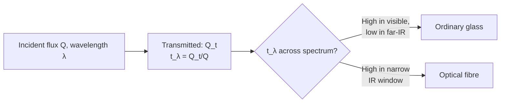

# 06 — Transmitting Power

## 1. Overview

Transmitting power completes the three-way split of incident radiant flux introduced in
[Properties of Radiation](01_properties_of_radiation.md): the fraction of energy that
passes *through* a body rather than being absorbed
([Absorptive Power](04_absorptive_power.md)) or reflected
([Reflecting Power](05_reflecting_power.md)). Most bulk solids studied in earlier topics
are opaque ($t \approx 0$), but transmitting power is essential wherever radiation must
pass through a medium — windows, optical fibres, atmospheric gases, and thin films — and
completes the identity $a+r+t=1$ used throughout this unit.

> **Notation:** $Q$ = total incident radiant flux; $Q_t$ = transmitted portion; $t$ =
> total transmitting power ($0$–$1$); $t_\lambda$ = spectral transmitting power;
> $T_r$ = transmittance (synonym for $t$, avoided here to prevent clash with temperature
> $T$).

---

## 2. Definitions & Key Terms

**1. Transmitting Power ($t$)** — *The fraction of total incident radiant energy that
passes through a body:* $t = Q_t/Q$, dimensionless, $0 \leq t \leq 1$.

**2. Opaque Body** — *A body with $t \approx 0$ at the wavelengths of interest; most
everyday solids are opaque in the visible/thermal-IR.*

**3. Transparent Body** — *A body with $t \approx 1$ at the wavelengths of interest (e.g.
clean glass in the visible, air in most of the thermal-IR outside absorption bands).*

**4. Translucent Body** — *A body that transmits radiation but diffusely, scattering it
internally (e.g. frosted glass, some fabrics) rather than transmitting a coherent,
undistorted beam.*

---

## 3. Core Content

### 3.1 Formal Definition

$$t = \frac{Q_t}{Q}, \qquad 0 \leq t \leq 1$$

with spectral version $t_\lambda = dQ_t/dQ_\lambda$. Transmitting power generally depends
strongly on both wavelength and the thickness of the transmitting medium: thicker samples
transmit less (more material for absorption/scattering to act over), typically following
an exponential (Beer–Lambert-type) attenuation with path length, though the detailed
attenuation law is outside this unit's scope.

### 3.2 Wavelength Selectivity

Transmitting power is often strongly wavelength-dependent even in materials considered
"transparent":

- **Ordinary glass:** $t_\lambda$ high across the visible band but drops sharply in the
  far infrared and ultraviolet — glass is opaque to most thermal-IR, which is central to
  the greenhouse-effect discussion in Topic 01.
- **Water:** highly transparent to visible light but strongly absorbing (low $t_\lambda$)
  in the infrared beyond a few micrometres.
- **The atmosphere:** has distinct "atmospheric windows" — wavelength bands (e.g. much of
  the visible, and a window around 8–13 µm) where $t_\lambda$ is high, separated by bands
  of strong absorption by water vapour, CO₂, and ozone.

### 3.3 Combined Behaviour with $a$ and $r$

For a general (non-opaque) body, all three quantities can be simultaneously significant,
and the identity from Topic 01 applies at every wavelength:

$$a_\lambda + r_\lambda + t_\lambda = 1$$

Engineering a coating or material for a target $t_\lambda$ profile (e.g. IR-blocking
window films that keep $t_\lambda$ high in the visible but low in the near-IR) requires
controlling all three simultaneously, since increasing one necessarily decreases the sum
of the other two.

### 3.4 Opacity as the Common Simplification

Because most solid bodies discussed in Topics 03–08 (metals, most fabrics, most building
materials) have negligible transmitting power in the thermal-IR band relevant to
everyday radiative heat transfer, the simplifying assumption $t=0$ (so $a+r=1$) is used by
default unless a material is specifically identified as transmissive (glass, thin films,
gases).

---

## 4. Worked Examples

### Example 1 — 🟢 Foundational

**Problem:** A glass pane transmits 78 W out of 100 W of incident visible light. Find $t$.

**Solution**

$$t = \frac{78}{100} = \boxed{0.78}$$

---

### Example 2 — 🟡 Intermediate

**Problem:** A window film reflects 10% and absorbs 25% of incident near-infrared solar
radiation. Find its transmitting power $t$ in the near-IR.

**Solution**

$$t = 1 - a - r = 1 - 0.25 - 0.10 = \boxed{0.65}$$

---

### Example 3 — 🔴 Advanced / Exam-Level

**Problem:** A greenhouse-style glass roof has $t_{\text{vis}} = 0.90$ (visible sunlight,
mostly transmitted inward) and $t_{\text{IR}} = 0.05$ (thermal-IR re-radiated by the
warmed interior, mostly blocked). Of 1000 W of incident visible sunlight, all the
transmitted portion is absorbed by interior surfaces and re-radiated entirely as
thermal-IR. Estimate the ratio of IR power trapped inside to power that would escape if
the roof were instead fully IR-transparent ($t_{\text{IR}}=1$), and explain the physical
significance.

**Solution**

Transmitted visible power (enters greenhouse): $0.90 \times 1000 = 900$ W. This is fully
absorbed and re-radiated as IR from interior surfaces — call this $Q_{\text{IR}} = 900$ W
incident on the *inside* of the glass roof.

With the real roof ($t_{\text{IR}}=0.05$): IR power escaping $= 0.05\times900 = 45$ W, so
IR power *trapped* (reflected/absorbed by the glass, re-radiated back down or retained) $=
900-45 = 855$ W.

With a hypothetical fully IR-transparent roof ($t_{\text{IR}}=1$): all 900 W of IR would
escape immediately, trapping $0$ W.

$$\text{Ratio (trapped, real vs. hypothetical)} = \frac{855}{0} \to \boxed{\text{undefined (real roof traps essentially all IR; hypothetical traps none)}}$$

**Physical significance:** This asymmetry — high $t$ for incoming visible sunlight, low
$t$ for outgoing thermal-IR — is precisely the **greenhouse effect** mechanism: energy
enters easily but is largely retained once converted to longer-wavelength thermal
radiation, causing net energy accumulation and a temperature rise inside.

---

## 5. Applications

**Technical Textiles (UV-Blocking, IR-Reflective Fabrics)** — Fabric coatings and
laminates are engineered with controlled $t_\lambda$: UV-protective clothing minimizes
$t_{\text{UV}}$ while keeping $t_{\text{visible}}$ high (so the fabric still looks and
feels like ordinary cloth), directly applying the wavelength-selectivity concept of §3.2.

**Fibre-Optic Communication** — Optical fibres are engineered for extremely high $t$
(minimal attenuation) at the specific infrared wavelengths (~1310 nm, ~1550 nm) used for
long-haul data transmission, exploiting the fibre material's natural transmission windows.

---

## 6. Diagram / Visual

*Figure 1: Incident flux $Q$ striking a surface; the transmitted component $Q_t$
(highlighted) defines $t = Q_t/Q$, with $a+r+t=1$. (Same underlying flux-split geometry as
[Absorptive Power](04_absorptive_power.md) and [Reflecting Power](05_reflecting_power.md),
each emphasizing a different component.)*

*Figure 2: Transmitted flux and two real-world examples of wavelength-selective
transmission.*

---

## 7. Common Mistakes

- ❌ **Mistake:** Assuming transmitting power is independent of sample thickness.
  ✅ **Correct:** $t$ generally decreases with increasing path length through the medium —
  a "transmitting power" value is only meaningful for a specified thickness/sample.

- ❌ **Mistake:** Treating $t=0$ as always true for solids.
  ✅ **Correct:** Glass, thin polymer films, and many gases have significant $t$ at
  relevant wavelengths; the $t=0$ opaque-body shortcut used in Topics 03, 05, 07, 08 is an
  explicit simplification, not a universal law.

- ❌ **Mistake:** Confusing "transparent" (high $t$, coherent image transmitted) with
  "translucent" (moderate $t$, but diffusely scattered, no clear image).
  ✅ **Correct:** Both can have similar total $t$ values but very different angular
  distributions of the transmitted energy.

---

## 8. Practice Problems

**Problem 1:** A thin film reflects 5% and transmits 90% of incident light. Find its
absorptive power.

Solution

$a = 1 - r - t = 1 - 0.05 - 0.90 = \boxed{0.05}$

---

**Problem 2 (Exam-level):** An IR-blocking window coating is designed so that
$t_{\text{vis}} = 0.85$ and $t_{\text{IR}} = 0.02$. If a room receives 800 W of visible
sunlight and re-radiates all absorbed energy as 800 × 0.85 = 680 W of interior thermal-IR
striking the window from inside, estimate the fraction of that interior IR power that
escapes through the window, and compare qualitatively to a plain glass window with
$t_{\text{IR}} = 0.05$ (Example 3 case).

Solution

Escaping IR power $= 0.02 \times 680 = 13.6$ W, i.e. a fraction $0.02$ (2%) escapes.

Compared to plain glass ($t_{\text{IR}}=0.05$, i.e. 5% escapes), the IR-blocking coating
retains proportionally **more** heat inside for the same absorbed solar input — useful for
winter heat retention, but potentially undesirable in summer where excess heat buildup
(over-trapping) may be a problem, illustrating the need for seasonal/adaptive glazing
strategies in building design.

---

## 9. Summary

| Quantity | Formula | Notes |
|---|---|---|
| Transmitting power | $t = Q_t/Q$ | $0$–$1$, dimensionless |
| Spectral transmitting power | $t_\lambda = dQ_t/dQ_\lambda$ | Strongly wavelength-dependent |
| Full identity | $a_\lambda + r_\lambda + t_\lambda = 1$ | Always valid, any $\lambda$ |
| Opaque-body default | $t \approx 0$ | Used unless material is stated as transmissive |

Next: [→ Kirchhoff's Law](07_kirchhoffs_law.md) — linking absorptive power back to
emissive power at thermal equilibrium.

---

## 10. References

1. **Halliday, Resnick & Walker — *Fundamentals of Physics*, 10th ed., §18-7.**
   Transmission and radiative balance in a general medium.
2. **Serway & Jewett — *Physics for Scientists and Engineers*, 9th ed., Ch. 40.**
   Transmittance and the $a+r+t=1$ identity.
3. **HyperPhysics — Atmospheric Windows and Transmission.**
   [http://hyperphysics.phy-astr.gsu.edu/hbase/thermo/thermo.html](http://hyperphysics.phy-astr.gsu.edu/hbase/thermo/thermo.html)
