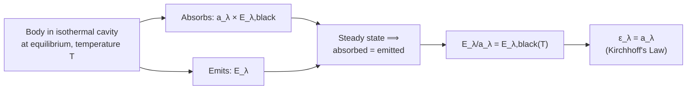

# 07 — Kirchhoff's Law

## 1. Overview

Kirchhoff's Law of thermal radiation (Gustav Kirchhoff, 1859) is the theoretical bridge
connecting [Emissive Power](03_emissive_power.md) and
[Absorptive Power](04_absorptive_power.md): at thermal equilibrium, a body's spectral
emissivity equals its spectral absorptivity, at every wavelength. This single result
explains why good absorbers are good emitters, justifies treating the blackbody
($a_\lambda=1$) as simultaneously the *best possible* emitter, and sets up the derivation
of the [Stefan–Boltzmann Law](08_stefan_boltzmann_law.md) in the next topic.

> **Notation:** $E_\lambda$ = spectral emissive power; $a_\lambda$ = spectral absorptive
> power; $\varepsilon_\lambda$ = spectral emissivity; subscript "black" denotes the
> blackbody (ideal) reference values.

---

## 2. Definitions & Key Terms

**1. Kirchhoff's Law** — *At thermal equilibrium, the ratio of spectral emissive power to
spectral absorptive power is the same for all bodies at a given temperature and
wavelength, and equals the spectral emissive power of a blackbody at that temperature and
wavelength:*
$$\frac{E_\lambda}{a_\lambda} = E_{\lambda,\text{black}}(T)$$

**2. Thermal Equilibrium (radiative)** — *A state in which a body's temperature is
constant because the rate of radiant energy absorbed equals the rate emitted — the
condition under which Kirchhoff's law strictly applies.*

**3. Spectral Emissivity ($\varepsilon_\lambda$)** — *The ratio $E_\lambda/E_{\lambda,\text{black}}$;
Kirchhoff's law is often stated compactly as $\varepsilon_\lambda = a_\lambda$.*

---

## 3. Core Content

### 3.1 Derivation via a Cavity in Equilibrium

Consider a small body placed inside an evacuated, isothermal cavity (walls at uniform
temperature $T$), as in the ideal blackbody cavity of [Topic 02](02_blackbody_radiation.md).
At thermal equilibrium the body's temperature equals $T$, and — since its temperature is
constant — the net radiative power exchanged between the body and the cavity walls must
be zero at every wavelength (otherwise the body's temperature, or the spectral energy
density inside the cavity, would keep changing, violating the assumed steady state).

The cavity interior is filled with blackbody radiation characterized by $E_{\lambda,\text{black}}(T)$.
In unit time, the body:

- **absorbs** energy at rate $a_\lambda(\lambda,T)\,E_{\lambda,\text{black}}(T)\,d\lambda$
  (incident blackbody flux times its own absorptivity), and
- **emits** energy at rate $E_\lambda(\lambda,T)\,d\lambda$ (its own spectral emissive
  power).

Equilibrium at each wavelength requires these to be equal:

$$E_\lambda(\lambda,T) = a_\lambda(\lambda,T)\,E_{\lambda,\text{black}}(T)$$

$$\boxed{\frac{E_\lambda}{a_\lambda} = E_{\lambda,\text{black}}(T)}$$

Since the right-hand side depends only on $\lambda$ and $T$ — not on the body's material —
this ratio is **universal**: every object at the same temperature and wavelength has the
same $E_\lambda/a_\lambda$, equal to the blackbody value.

### 3.2 The Compact Statement: $\varepsilon_\lambda = a_\lambda$

Dividing both sides by $E_{\lambda,\text{black}}(T)$ and using the definition of spectral
emissivity $\varepsilon_\lambda = E_\lambda/E_{\lambda,\text{black}}$:

$$\boxed{\varepsilon_\lambda(\lambda,T) = a_\lambda(\lambda,T)}$$

This is the form of Kirchhoff's law most often quoted: **a surface's ability to emit
radiation at a given wavelength and temperature exactly equals its ability to absorb
radiation at that same wavelength and temperature.**

### 3.3 Consequence: The Blackbody is the Best Possible Emitter

Since $a_\lambda \leq 1$ for any real surface, and $\varepsilon_\lambda = a_\lambda$, it
follows that $\varepsilon_\lambda \leq 1$ for every surface — no real body can emit more
radiation than a blackbody at the same temperature and wavelength. The blackbody
($a_\lambda\equiv1 \Rightarrow \varepsilon_\lambda\equiv1$) is therefore simultaneously the
perfect absorber *and* the theoretical upper bound on emission — this equivalence is the
entire justification for treating the blackbody's Planck spectrum (Topic 02) as the
reference against which all real emitters are measured (via the emissivity, Topic 03).

### 3.4 Conditions of Validity

Kirchhoff's law as derived here strictly requires:

- **Thermal equilibrium** — the body and its surroundings at the same temperature.
- **Local applicability at each wavelength** — the law holds wavelength-by-wavelength
  ($\varepsilon_\lambda = a_\lambda$); the corresponding *total* quantities
  ($\varepsilon = a$, integrated over all $\lambda$) hold exactly only for grey bodies, or
  approximately when the incident spectrum resembles the body's own equilibrium emission
  spectrum.
- It does **not**, by itself, say anything about reflecting or transmitting power
  individually beyond what follows from $a=1-r-t$.

---

## 4. Worked Examples

### Example 1 — 🟢 Foundational

**Problem:** A surface has absorptive power $a_\lambda = 0.4$ at $\lambda=2\;\mu$m and
$T=500$ K. Using Kirchhoff's law, find its spectral emissivity at the same $\lambda$ and $T$.

**Solution**

$$\varepsilon_\lambda = a_\lambda = \boxed{0.4}$$

(Direct statement of Kirchhoff's law — no further calculation needed.)

---

### Example 2 — 🟡 Intermediate

**Problem:** At $T=800$ K and $\lambda = 3\;\mu$m, a blackbody has spectral emissive power
$E_{\lambda,\text{black}} = 1.2\times10^5$ W·m⁻³. A real surface at the same $T$ and
$\lambda$ has spectral emissive power $E_\lambda = 3.0\times10^4$ W·m⁻³. Find the surface's
absorptive power at this wavelength.

**Solution**

$$\varepsilon_\lambda = \frac{E_\lambda}{E_{\lambda,\text{black}}} = \frac{3.0\times10^4}{1.2\times10^5} = 0.25$$

By Kirchhoff's law: $a_\lambda = \varepsilon_\lambda = \boxed{0.25}$

---

### Example 3 — 🔴 Advanced / Exam-Level

**Problem:** Explain, using Kirchhoff's law, why a white ceramic teapot and a black cast
iron teapot, both filled with boiling water and left in a room at 20 °C, cool at
noticeably different rates via radiation — and why this reasoning would *not* directly
apply if both teapots were instead compared for how quickly they *heated up* under direct
strong sunlight of a spectrum very different from either teapot's own thermal emission
spectrum.

**Solution**

**Cooling comparison (radiative loss to room at ~20°C):** Both teapots radiate primarily
in the thermal-IR (peak wavelength around 8–10 µm at their own surface temperatures, by
Wien's law). At *this* wavelength range, the black iron teapot has high $a_\lambda$
(hence, by Kirchhoff's law, high $\varepsilon_\lambda$) and radiates heat away rapidly; the
white ceramic teapot — despite looking white in *visible* light — can still have
comparatively high $\varepsilon_\lambda$ in the thermal-IR (many "white" ceramics and
paints are actually good IR emitters, since visible colour is governed by a completely
different part of the spectrum than thermal-IR emissivity), so the visible colour alone is
not a reliable predictor.

**Heating under sunlight (different spectral regime):** Solar radiation peaks in the
visible (~500 nm, from the Sun's ~5800 K blackbody spectrum, Topic 02), a wavelength range
*far* from the teapots' own room-temperature thermal-IR emission band. Kirchhoff's law
relates $\varepsilon_\lambda$ and $a_\lambda$ **at the same wavelength**; a surface's
absorptivity for incoming sunlight (visible-band $a_\lambda$) is governed by its visible-
light colour/finish, which is generally *unrelated* to its thermal-IR emissivity governing
radiative cooling. This is exactly why selective-surface coatings (Topic 04, Example 3)
can be engineered to decouple solar absorption from thermal-IR emission — a strategy that
would be impossible if Kirchhoff's law forced $a_{\text{visible}} = \varepsilon_{\text{IR}}$
for the same surface, which it does not, since these are different wavelengths.

---

## 5. Applications

**Emissivity-Corrected Infrared Thermometry** — Non-contact IR thermometers must be
calibrated with the target surface's emissivity (via Kirchhoff's law, effectively its
absorptivity at the same wavelength) or they systematically misread temperature — a
critical calibration step in textile drying/finishing process control.

**Radiation Shielding Design** — Multi-layer insulation (e.g. spacecraft blankets) uses
alternating low-emissivity (high-reflectivity, low-absorptivity by Kirchhoff's law) foil
layers to suppress radiative heat transfer between layers, directly exploiting
$\varepsilon_\lambda = a_\lambda$ to minimize both absorption and re-emission simultaneously.

---

## 6. Diagram / Visual

*Figure 1: Two surfaces A and B inside an isothermal enclosure at temperature T, in
radiative equilibrium. Kirchhoff's law requires $E_A/a_A = E_B/a_B = E_{\text{black}}(T)$
for both surfaces.*

*Figure 2: Logical derivation chain from cavity equilibrium to Kirchhoff's law.*

---

## 7. Common Mistakes

- ❌ **Mistake:** Applying $\varepsilon = a$ (total, integrated quantities) unconditionally
  for any incident spectrum.
  ✅ **Correct:** The rigorous statement is wavelength-by-wavelength,
  $\varepsilon_\lambda = a_\lambda$; the *total* $\varepsilon = a$ only follows exactly for
  a grey body (constant $\varepsilon_\lambda$) or when the incident spectrum matches the
  body's own blackbody emission spectrum at its temperature.

- ❌ **Mistake:** Assuming Kirchhoff's law links absorptivity for *incoming sunlight* to
  emissivity for the body's *own* thermal-IR radiation.
  ✅ **Correct:** The law compares $a_\lambda$ and $\varepsilon_\lambda$ at the *same*
  wavelength — solar absorptivity (visible band) and thermal emissivity (IR band) are
  generally independent, which is exactly what makes selective surfaces possible
  (Example 3).

- ❌ **Mistake:** Thinking Kirchhoff's law requires the body to actually be in a cavity.
  ✅ **Correct:** The cavity is a derivation device; the law is a statement about the
  intrinsic relationship between a material's absorptivity and emissivity at thermal
  equilibrium, applicable generally.

---

## 8. Practice Problems

**Problem 1:** A surface has $\varepsilon_\lambda = 0.55$ at $\lambda = 5\;\mu$m. What is
its absorptive power at the same wavelength and temperature?

Solution

By Kirchhoff's law: $a_\lambda = \varepsilon_\lambda = \boxed{0.55}$

---

**Problem 2 (Exam-level):** A blackbody at 900 K has $E_{\lambda,\text{black}} =
2.5\times10^5$ W·m⁻³ at $\lambda=4\;\mu$m. A real surface at the same temperature and
wavelength absorbs 30% of incident radiation at that wavelength. Find the real surface's
spectral emissive power $E_\lambda$ at $\lambda=4\;\mu$m, $T=900$ K.

Solution

By Kirchhoff's law: $\varepsilon_\lambda = a_\lambda = 0.30$

$$E_\lambda = \varepsilon_\lambda \times E_{\lambda,\text{black}} = 0.30\times2.5\times10^5 = \boxed{7.5\times10^4\;\text{W·m}^{-3}}$$

---

## 9. Summary

| Statement | Formula | Notes |
|---|---|---|
| Kirchhoff's Law (ratio form) | $E_\lambda/a_\lambda = E_{\lambda,\text{black}}(T)$ | Universal, material-independent |
| Kirchhoff's Law (compact form) | $\varepsilon_\lambda = a_\lambda$ | Same $\lambda$, same $T$, equilibrium |
| Consequence | $\varepsilon_\lambda \leq 1$ always | Blackbody = best possible emitter |
| Key limitation | Wavelength-specific | Solar absorptivity ≠ IR emissivity in general |

Next: [→ Stefan–Boltzmann Law](08_stefan_boltzmann_law.md) — integrating the blackbody
spectrum over all wavelengths to get the total $T^4$ emissive power.

---

## 10. References

1. **Halliday, Resnick & Walker — *Fundamentals of Physics*, 10th ed., §18-7.**
   Kirchhoff's law and its equilibrium derivation.
2. **Kirchhoff, G. (1860) — "Über das Verhältnis zwischen dem Emissionsvermögen und dem
   Absorptionsvermögen der Körper für Wärme und Licht."** Original statement of the law.
3. **HyperPhysics — Kirchhoff's Law of Thermal Radiation.**
   [http://hyperphysics.phy-astr.gsu.edu/hbase/thermo/kirchhoff.html](http://hyperphysics.phy-astr.gsu.edu/hbase/thermo/kirchhoff.html)
