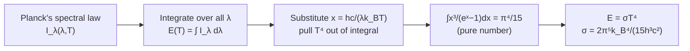

# 08 — Stefan–Boltzmann Law

## 1. Overview

The Stefan–Boltzmann Law states that the total emissive power of a blackbody is
proportional to the **fourth power** of its absolute temperature, $E = \sigma T^4$. It
follows directly from integrating Planck's spectral radiance function
([Blackbody Radiation](02_blackbody_radiation.md)) over all wavelengths, and explains why
even modest temperature changes produce large changes in radiated power — the reason
radiative heat transfer dominates at high temperature. Josef Stefan found the $T^4$ law
empirically in 1879; Ludwig Boltzmann derived it theoretically from thermodynamics in
1884, predating Planck's full quantum derivation by over a decade.

> **Notation:** $E$ = total emissive power [W/m²]; $\sigma$ = Stefan–Boltzmann constant
> $= 5.67\times10^{-8}$ W m⁻² K⁻⁴; $P$ = total radiated power [W]; $A$ = surface area [m²].

---

## 2. Definitions & Key Terms

**1. Stefan–Boltzmann Law** — *The total emissive power of a blackbody scales as the
fourth power of its absolute temperature:* $E = \sigma T^4$.

**2. Stefan–Boltzmann Constant ($\sigma$)** — *The proportionality constant,*
$\sigma = 5.670374\times10^{-8}\;\text{W m}^{-2}\text{K}^{-4}$, *expressible in terms of
more fundamental constants* ($h$, $c$, $k_B$) *as shown in the derivation below.*

**3. Net Radiative Power (Prevost's Exchange)** — *A body at temperature $T$ in
surroundings at temperature $T_s$ radiates $\sigma T^4$ but also absorbs radiation from
its surroundings; the net rate of heat loss is* $P_{\text{net}} = \varepsilon\sigma A(T^4 - T_s^4)$.

---

## 3. Core Content

### 3.1 Derivation by Integrating Planck's Law

The total emissive power is the integral of the spectral radiance
$I_\lambda(\lambda,T)$ (Topic 02) over all wavelengths:

$$E(T) = \int_0^\infty I_\lambda(\lambda,T)\,d\lambda = \int_0^\infty \frac{2\pi hc^2}{\lambda^5}\,\frac{1}{e^{hc/\lambda k_BT}-1}\,d\lambda$$

(the factor $2\pi$ here accounts for integration over the emitting hemisphere's solid
angle, folded into the constant relative to the spectral radiance form used in Topic 02).

**Substitution:** let $x = \dfrac{hc}{\lambda k_BT}$, so $\lambda = \dfrac{hc}{k_BTx}$ and
$d\lambda = -\dfrac{hc}{k_BTx^2}\,dx$. Substituting and simplifying the powers of
$\lambda$ and $T$:

$$E(T) = \frac{2\pi k_B^4T^4}{h^3c^2}\int_0^\infty \frac{x^3}{e^x-1}\,dx$$

**Key step:** every factor of $T$ has been pulled outside the integral, leaving a pure
number (independent of $T$) multiplying $T^4$. The definite integral is a standard result:

$$\int_0^\infty \frac{x^3}{e^x-1}\,dx = \frac{\pi^4}{15}$$

Substituting back:

$$\boxed{E(T) = \left(\frac{2\pi^5 k_B^4}{15h^3c^2}\right)T^4 = \sigma T^4}$$

with

$$\sigma = \frac{2\pi^5k_B^4}{15h^3c^2} = 5.670\times10^{-8}\;\text{W m}^{-2}\text{K}^{-4}$$

This derivation is why the $T^4$ scaling is not an independent empirical law but a direct
*consequence* of Planck's quantum radiation law — historically, Stefan and Boltzmann
established the $T^4$ dependence and even estimated $\sigma$ using classical/
thermodynamic arguments (Boltzmann, via radiation pressure and the Carnot cycle) more than
a decade before Planck's 1900 derivation of the full spectral shape.

### 3.2 Real (Non-Ideal) Bodies

For a real surface with emissivity $\varepsilon \leq 1$ (Topic 03), radiating into
surroundings at temperature $T_s$:

$$E_{\text{real}} = \varepsilon\sigma T^4$$

and, accounting for radiation absorbed *from* the surroundings (which are also radiating,
Prevost's theory of exchanges), the **net** rate of radiative heat loss from a body of
area $A$, temperature $T$, in surroundings at $T_s$, is:

$$\boxed{P_{\text{net}} = \varepsilon\sigma A\left(T^4 - T_s^4\right)}$$

This net form correctly predicts zero net heat transfer when $T=T_s$ (thermal
equilibrium), positive net loss when $T>T_s$, and net *gain* when $T<T_s$.

### 3.3 Why $T^4$ Matters Physically

Because power scales as the fourth power of temperature, doubling absolute temperature
increases radiated power by a factor of $2^4=16$; a 10% increase in $T$ increases power by
roughly $(1.1)^4 \approx 1.46$, i.e. 46%. This strong nonlinearity is why radiative losses
become the dominant heat-transfer mechanism at high temperature (furnaces, filaments,
stellar surfaces) even though they may be negligible at room temperature compared to
conduction/convection.

---

## 4. Worked Examples

### Example 1 — 🟢 Foundational

**Problem:** Find the total emissive power of a blackbody at $T=400$ K.
($\sigma=5.67\times10^{-8}$ W m⁻² K⁻⁴)

**Solution**

$$E = \sigma T^4 = 5.67\times10^{-8}\times(400)^4 = 5.67\times10^{-8}\times2.56\times10^{10}$$

$$\boxed{E \approx 1452\;\text{W/m}^2}$$

---

### Example 2 — 🟡 Intermediate

**Problem:** A metal sphere of radius 5 cm, emissivity $\varepsilon=0.85$, is at 600 K in a
room at 300 K. Find the net rate of radiative heat loss.

**Solution**

Surface area: $A = 4\pi r^2 = 4\pi(0.05)^2 = 0.03142\;\text{m}^2$

$$P_{\text{net}} = \varepsilon\sigma A(T^4 - T_s^4) = 0.85\times5.67\times10^{-8}\times0.03142\times\left[(600)^4-(300)^4\right]$$

$(600)^4 = 1.296\times10^{11}$, $(300)^4 = 8.1\times10^9$

$$T^4-T_s^4 = 1.296\times10^{11}-0.081\times10^{11} = 1.215\times10^{11}$$

$$P_{\text{net}} = 0.85\times5.67\times10^{-8}\times0.03142\times1.215\times10^{11}$$

$$= 0.85\times5.67\times10^{-8}\times3.818\times10^{9} = 0.85\times216.4$$

$$\boxed{P_{\text{net}} \approx 184\;\text{W}}$$

---

### Example 3 — 🔴 Advanced / Exam-Level

**Problem:** Using the Stefan–Boltzmann law and the fact that the Sun (radius $R_\odot =
6.96\times10^8$ m, surface temperature $\approx5778$ K) radiates as a near-blackbody,
estimate the total power output (luminosity) of the Sun, and use it to estimate the solar
flux (intensity) reaching Earth at distance $d = 1.496\times10^{11}$ m, assuming the power
spreads uniformly over a sphere of that radius.

**Solution**

**Solar luminosity:**

$$L_\odot = \sigma T^4 \times 4\pi R_\odot^2$$

$T^4 = (5778)^4 = 1.114\times10^{15}\;\text{K}^4$

$4\pi R_\odot^2 = 4\pi(6.96\times10^8)^2 = 6.087\times10^{18}\;\text{m}^2$

$$L_\odot = 5.67\times10^{-8}\times1.114\times10^{15}\times6.087\times10^{18}$$

$$= 5.67\times10^{-8}\times6.782\times10^{33} \approx 3.85\times10^{26}\;\text{W}$$

(This matches the accepted solar luminosity, $\approx 3.83\times10^{26}$ W, within
rounding.)

**Flux at Earth:** spreading $L_\odot$ over a sphere of radius $d$:

$$I = \frac{L_\odot}{4\pi d^2} = \frac{3.85\times10^{26}}{4\pi(1.496\times10^{11})^2} = \frac{3.85\times10^{26}}{2.813\times10^{23}}$$

$$\boxed{I \approx 1369\;\text{W/m}^2}$$

(This matches the accepted solar constant, $\approx 1361$–$1366$ W/m², confirming the
blackbody approximation for the Sun is excellent.)

---

## 5. Applications

**Thermal Design of Textile Drying Ovens/Furnaces** — Radiative heat transfer equations
based on $P_{\text{net}}=\varepsilon\sigma A(T^4-T_s^4)$ are used to size industrial
drying/curing ovens where radiant heating panels operate at high $T$, since even modest
increases in panel temperature substantially boost radiant heat delivery to the fabric.

**Climate Science — Earth's Energy Balance** — Earth's effective radiating temperature
(~255 K, from balancing absorbed solar flux against $\sigma T^4$ outgoing IR emission) is
a foundational calculation in climate science, directly using the Stefan–Boltzmann law
derived here (extended by greenhouse-gas absorption effects from Topic 06).

---

## 6. Diagram / Visual

*Figure 1: Total emissive power $E=\sigma T^4$ versus temperature, marked at Earth's
average surface temperature, a heated filament, and the Sun's photosphere — illustrating
the steep nonlinearity of the $T^4$ scaling.*

*Figure 2: Derivation chain from Planck's spectral law to the Stefan–Boltzmann $T^4$ law.*

---

## 7. Common Mistakes

- ❌ **Mistake:** Using $E=\sigma T^4$ (not net form) to compute actual heat loss in a room
  or lab setting.
  ✅ **Correct:** A body always also *absorbs* radiation from its surroundings; the
  physically meaningful quantity for heat loss is the **net** form,
  $P_{\text{net}}=\varepsilon\sigma A(T^4-T_s^4)$, not just $\sigma T^4$ alone.

- ❌ **Mistake:** Forgetting the emissivity factor $\varepsilon$ for real (non-black)
  surfaces.
  ✅ **Correct:** $E=\sigma T^4$ is exact only for an ideal blackbody; real surfaces need
  $E=\varepsilon\sigma T^4$ (Topic 03).

- ❌ **Mistake:** Using Celsius temperature in $T^4$.
  ✅ **Correct:** $T$ must be absolute (Kelvin) — using °C gives a nonsensical result,
  especially near/below 0°C where the sign or magnitude would be wrong.

---

## 8. Practice Problems

**Problem 1:** Find the blackbody emissive power at $T=1500$ K.
($\sigma=5.67\times10^{-8}$ W m⁻² K⁻⁴)

Solution

$(1500)^4 = 5.0625\times10^{12}$

$E = 5.67\times10^{-8}\times5.0625\times10^{12} = \boxed{2.87\times10^5\;\text{W/m}^2}$

---

**Problem 2 (Exam-level):** A tungsten filament ($\varepsilon=0.35$, area $A=1\times10^{-5}$ m²)
operates at $T=2500$ K in a bulb where the glass envelope is at $T_s=350$ K. Find the net
radiative power dissipated by the filament.

Solution

$(2500)^4 = 3.906\times10^{13}$, $(350)^4 = 1.501\times10^{10}$ (negligible by comparison
but included for completeness)

$T^4-T_s^4 \approx 3.906\times10^{13}-0.0015\times10^{13} \approx 3.905\times10^{13}$

$$P_{\text{net}} = 0.35\times5.67\times10^{-8}\times1\times10^{-5}\times3.905\times10^{13}$$

$= 0.35\times5.67\times10^{-8}\times3.905\times10^{8} = 0.35\times221.4$

$$\boxed{P_{\text{net}} \approx 77.5\;\text{W}}$$

---

## 9. Summary

| Quantity | Formula | Notes |
|---|---|---|
| Total emissive power (blackbody) | $E = \sigma T^4$ | Ideal limit |
| Real surface | $E = \varepsilon\sigma T^4$ | $\varepsilon<1$ |
| Net radiative power | $P_{\text{net}} = \varepsilon\sigma A(T^4-T_s^4)$ | Accounts for absorbed surroundings radiation |
| Stefan–Boltzmann constant | $\sigma = 2\pi^5k_B^4/(15h^3c^2) = 5.67\times10^{-8}$ W m⁻² K⁻⁴ | Derivable from Planck's law |
| Key definite integral | $\int_0^\infty x^3/(e^x-1)\,dx = \pi^4/15$ | Standard result used in derivation |

Next: [→ Quantum Theory of Radiation](09_quantum_theory_of_radiation.md) — the full
derivation of Planck's law that both Topics 02 and 08 relied on descriptively.

---

## 10. References

1. **Halliday, Resnick & Walker — *Fundamentals of Physics*, 10th ed., §18-7.**
   Stefan–Boltzmann law and radiative heat transfer applications.
2. **Stefan, J. (1879); Boltzmann, L. (1884).** Original empirical ($T^4$ fit) and
   thermodynamic derivations.
3. **HyperPhysics — Stefan–Boltzmann Law.**
   [http://hyperphysics.phy-astr.gsu.edu/hbase/thermo/stefan.html](http://hyperphysics.phy-astr.gsu.edu/hbase/thermo/stefan.html)
4. **NASA/NSSDC — Solar Fact Sheet** (solar luminosity and solar constant reference
   values used in Example 3).
