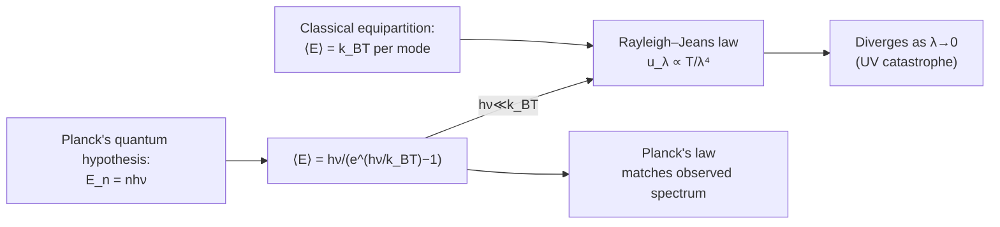

# 09 — Quantum Theory of Radiation

## 1. Overview

By the late 1800s, classical electromagnetism and statistical mechanics predicted a
blackbody spectrum ([Topic 02](02_blackbody_radiation.md)) that diverges at short
wavelengths — a failure so dramatic it was later nicknamed the "ultraviolet catastrophe."
Max Planck's 1900 resolution — that a cavity's electromagnetic oscillators can only
exchange energy in discrete quanta $E=h\nu$ — not only fixed the blackbody spectrum but
launched quantum theory itself, the framework underlying every remaining topic in this
unit: [Special Relativity](10_special_theory_of_relativity.md) through
[Compton Effect](14_compton_effect.md).

> **Notation:** $h$ = Planck constant $=6.626\times10^{-34}$ J·s; $\nu$ = frequency [Hz];
> $k_B$ = Boltzmann constant; $c$ = speed of light; $n$ = non-negative integer (quantum
> number).

---

## 2. Definitions & Key Terms

**1. Ultraviolet Catastrophe** — *The divergence of the classical (Rayleigh–Jeans)
prediction for blackbody spectral radiance as $\lambda\to0$ ($\nu\to\infty$), in sharp
contradiction with the observed, finite spectrum.*

**2. Planck's Quantum Hypothesis** — *The postulate that the energy of an electromagnetic
oscillator of frequency $\nu$ is restricted to discrete values* $E_n = nh\nu$, $n=0,1,2,\ldots$,
*rather than the continuous range allowed classically.*

**3. Rayleigh–Jeans Law** — *The classical prediction for blackbody spectral radiance,
derived by assigning each cavity mode the classical equipartition energy $k_BT$:*
$I_\lambda^{\text{RJ}}(\lambda,T) = 2ck_BT/\lambda^4$.

**4. Photon** — *The quantum of electromagnetic energy, $E=h\nu$; Planck's 1900 hypothesis
concerned quantized oscillator energy levels, while Einstein's 1905 photoelectric-effect
work (Topic 13) went further, proposing that light itself is quantized into photons.*

---

## 3. Core Content

### 3.1 The Classical (Rayleigh–Jeans) Approach and Its Failure

Classically, the electromagnetic field inside a cavity can be decomposed into standing-
wave modes. The number of modes per unit volume in a wavelength interval $d\lambda$ is:

$$dN = \frac{8\pi}{\lambda^4}\,d\lambda$$

(a purely geometric/wave-counting result, independent of any quantum assumption).
Classical statistical mechanics (equipartition theorem) assigns each mode an average
thermal energy $k_BT$, independent of frequency. Multiplying:

$$u_\lambda(\lambda,T)\,d\lambda = \frac{8\pi k_BT}{\lambda^4}\,d\lambda \quad\text{(Rayleigh–Jeans law, energy density form)}$$

**The catastrophe:** as $\lambda\to0$ (i.e. $\nu\to\infty$, the ultraviolet and beyond),
$u_\lambda \to \infty$ — predicting infinite radiated energy density at short wavelengths,
and an infinite total emissive power when integrated over all $\lambda$. This directly
contradicts both everyday experience (a hot object does not radiate infinite UV/X-ray
power) and precise cavity-radiation measurements, which show the spectrum peaking and then
falling back toward zero at short $\lambda$ (Topic 02, §3.5).

### 3.2 Planck's Quantum Hypothesis

Planck's resolution (1900) was to abandon the classical equipartition assumption.
Instead, he postulated that an oscillator of frequency $\nu$ can only possess energies
that are integer multiples of a fundamental quantum $h\nu$:

$$E_n = nh\nu, \qquad n=0,1,2,3,\ldots$$

where $h$ is a new fundamental constant (now called Planck's constant). This is a
profound departure from classical mechanics, where an oscillator's energy could take *any*
value continuously.

### 3.3 Average Oscillator Energy Under Quantization

With quantized energy levels, statistical mechanics (Boltzmann distribution — the
probability of occupying level $E_n$ is $\propto e^{-E_n/k_BT}$) gives the *average*
energy of an oscillator at temperature $T$ as:

$$\langle E\rangle = \frac{\sum_{n=0}^\infty nh\nu\,e^{-nh\nu/k_BT}}{\sum_{n=0}^\infty e^{-nh\nu/k_BT}}$$

Evaluating this standard geometric-series sum (using $\sum x^n = 1/(1-x)$ and
differentiating with respect to the exponent) yields:

$$\boxed{\langle E\rangle = \frac{h\nu}{e^{h\nu/k_BT}-1}}$$

**Two limiting checks:**

- **Low frequency / high temperature** ($h\nu \ll k_BT$): expanding
  $e^{h\nu/k_BT}-1 \approx h\nu/k_BT$, giving $\langle E\rangle \to k_BT$ — recovering the
  classical equipartition result exactly, as it must (correspondence principle).
- **High frequency / low temperature** ($h\nu \gg k_BT$): $\langle E\rangle \to h\nu\,e^{-h\nu/k_BT} \to 0$
  exponentially — high-frequency modes are "frozen out," carrying negligible energy. This
  exponential suppression is precisely what eliminates the ultraviolet catastrophe.

### 3.4 Deriving Planck's Law from the Quantized Average Energy

Multiplying the (classical, purely geometric) mode-density result from §3.1 by the
**quantized** average energy per mode (§3.3), instead of the classical $k_BT$:

$$u_\lambda(\lambda,T)\,d\lambda = \frac{8\pi}{\lambda^4}\,d\lambda \times \frac{hc/\lambda}{e^{hc/\lambda k_BT}-1}$$

(using $\nu = c/\lambda$), which rearranges to Planck's radiation law exactly as quoted in
[Topic 02](02_blackbody_radiation.md):

$$\boxed{I_\lambda(\lambda,T) = \frac{2hc^2}{\lambda^5}\,\frac{1}{e^{hc/\lambda k_BT}-1}}$$

This single formula correctly reduces to the Rayleigh–Jeans law at long $\lambda$
(recovering classical behaviour where it was already experimentally confirmed) and falls
exponentially to zero at short $\lambda$ (curing the ultraviolet catastrophe), matching
the measured blackbody spectrum across its *entire* range — the first triumph of quantum
theory.

### 3.5 Historical and Conceptual Significance

Planck initially viewed energy quantization as a mathematical device to fit the data
rather than a literal physical restriction on oscillator energies — famously calling it
"an act of desperation." It was Einstein's 1905 photoelectric-effect explanation
([Topic 13](13_photoelectric_effect.md)), proposing that light *itself* travels in
discrete photon packets $E=h\nu$ (not merely that cavity oscillators are quantized), that
established quantization as a fundamental feature of nature rather than a calculational
trick — a conceptual leap subsequently confirmed by the [Compton Effect](14_compton_effect.md).

---

## 4. Worked Examples

### Example 1 — 🟢 Foundational

**Problem:** Find the energy of a single photon of frequency $\nu = 5\times10^{14}$ Hz
(visible green light). ($h=6.626\times10^{-34}$ J·s)

**Solution**

$$E = h\nu = 6.626\times10^{-34}\times5\times10^{14} = \boxed{3.31\times10^{-19}\;\text{J} \approx 2.07\;\text{eV}}$$

---

### Example 2 — 🟡 Intermediate

**Problem:** For an oscillator of frequency $\nu = 6\times10^{13}$ Hz (mid-infrared) at
$T=300$ K, compare the quantum average energy $\langle E\rangle$ to the classical
prediction $k_BT$. ($h=6.626\times10^{-34}$ J·s, $k_B=1.38\times10^{-23}$ J/K)

**Solution**

$$h\nu = 6.626\times10^{-34}\times6\times10^{13} = 3.98\times10^{-20}\;\text{J}$$

$$k_BT = 1.38\times10^{-23}\times300 = 4.14\times10^{-21}\;\text{J}$$

$$\frac{h\nu}{k_BT} = \frac{3.98\times10^{-20}}{4.14\times10^{-21}} = 9.61$$

$$\langle E\rangle = \frac{h\nu}{e^{h\nu/k_BT}-1} = \frac{3.98\times10^{-20}}{e^{9.61}-1} = \frac{3.98\times10^{-20}}{14913-1} \approx \frac{3.98\times10^{-20}}{14912}$$

$$\boxed{\langle E\rangle \approx 2.67\times10^{-24}\;\text{J}}$$

Compare to classical $k_BT = 4.14\times10^{-21}$ J — the quantum result is about
**1550 times smaller**, showing this mode is strongly "frozen out" at room temperature
($h\nu \gg k_BT$), exactly the suppression mechanism that prevents the ultraviolet
catastrophe.

---

### Example 3 — 🔴 Advanced / Exam-Level

**Problem:** Show explicitly that in the limit $h\nu \ll k_BT$, the quantum average energy
formula $\langle E\rangle = h\nu/(e^{h\nu/k_BT}-1)$ reduces to the classical equipartition
result $k_BT$, using a Taylor expansion, and state the physical significance of this
limit for the Rayleigh–Jeans law.

**Solution**

Let $x = h\nu/k_BT \ll 1$. Using the Taylor expansion $e^x = 1+x+\frac{x^2}{2}+\ldots$:

$$e^x - 1 \approx x + \frac{x^2}{2} = x\left(1+\frac{x}{2}\right)$$

Substituting:

$$\langle E\rangle = \frac{h\nu}{e^x-1} \approx \frac{h\nu}{x(1+x/2)} = \frac{h\nu}{x}\cdot\frac{1}{1+x/2}$$

Since $x = h\nu/k_BT$: $h\nu/x = h\nu \times (k_BT/h\nu) = k_BT$. And for small $x$,
$1/(1+x/2) \approx 1-x/2 \approx 1$. So:

$$\langle E\rangle \approx k_BT\left(1-\frac{x}{2}\right) \to \boxed{k_BT \quad \text{as } x\to0}$$

**Physical significance:** This confirms that Planck's quantized-oscillator result is not
an alternative to classical physics but *contains* it as the low-frequency (or
high-temperature) limit — the correspondence principle. It is exactly this limit that
reproduces the Rayleigh–Jeans law (§3.1), which is why Rayleigh–Jeans works well at long
wavelengths/low frequencies but fails catastrophically at high frequencies, where the full
quantum $\langle E\rangle$ formula is required (Example 2).

---

## 5. Applications

**LED and Solid-State Lighting Design** — Semiconductor light-emitting diodes rely
directly on the quantized-energy concept ($E=h\nu$) established here: photon energy
(hence emitted colour) is set by the semiconductor's band-gap energy, a direct engineering
application of Planck's quantum hypothesis extended to solid-state electron energy levels.

**Quantum Statistics in Modern Photonics** — The Bose–Einstein statistics underlying the
$1/(e^{h\nu/k_BT}-1)$ occupation factor (§3.3) is the same statistical framework used to
describe laser gain media, photon statistics in fibre-optic communication noise analysis,
and superconducting quantum devices.

---

## 6. Diagram / Visual

*Figure 1: Rayleigh–Jeans classical prediction (dashed) diverges as λ→0, while Planck's
quantum law (solid) correctly matches the observed spectrum and falls to zero — the
resolution of the "ultraviolet catastrophe."*

*Figure 2: Two derivation paths — classical (top, fails) and quantum (bottom, succeeds) —
converging at low frequency, where Planck's result correctly reduces to Rayleigh–Jeans.*

---

## 7. Common Mistakes

- ❌ **Mistake:** Thinking Planck quantized light itself in 1900.
  ✅ **Correct:** Planck's 1900 hypothesis quantized the *energy levels of cavity wall
  oscillators*; it was Einstein (1905, Topic 13) who proposed that light itself
  propagates as discrete photon quanta.

- ❌ **Mistake:** Believing the Rayleigh–Jeans law is simply "wrong" everywhere.
  ✅ **Correct:** It is the correct long-wavelength (low-frequency) limit of Planck's law
  (Example 3) — it fails specifically and only at short wavelengths/high frequencies.

- ❌ **Mistake:** Using $\langle E\rangle = h\nu$ (a single quantum) instead of the full
  Bose–Einstein-weighted average $h\nu/(e^{h\nu/k_BT}-1)$.
  ✅ **Correct:** The average energy per mode is temperature-dependent and generally much
  less than one quantum at high frequency (Example 2) — $h\nu$ alone is just the *size* of
  one quantum, not the average occupation.

---

## 8. Practice Problems

**Problem 1:** Find the photon energy (in eV) for red light of wavelength 650 nm.
($h=6.626\times10^{-34}$ J·s, $c=3\times10^8$ m/s, $1\;\text{eV}=1.6\times10^{-19}$ J)

Solution

$E = hc/\lambda = (6.626\times10^{-34}\times3\times10^8)/(650\times10^{-9}) = 3.058\times10^{-19}\;\text{J}$

$E_{\text{eV}} = 3.058\times10^{-19}/1.6\times10^{-19} = \boxed{1.91\;\text{eV}}$

---

**Problem 2 (Exam-level):** At what temperature does $h\nu = k_BT$ exactly, for
$\nu=1\times10^{13}$ Hz (far-infrared)? Comment on what this temperature represents
physically for that particular mode.

Solution

$T = h\nu/k_B = (6.626\times10^{-34}\times10^{13})/(1.38\times10^{-23}) = 6.626\times10^{-21}/1.38\times10^{-23}$

$$T = \boxed{480\;\text{K (approx.)}}$$

At this temperature, $h\nu=k_BT$ exactly, i.e. $x=1$ in the notation of Example 3 — the
crossover point between the "frozen out" quantum-suppressed regime ($T<480$ K, where this
mode carries far less than $k_BT$ of energy) and the classical-equipartition regime
($T\gg480$ K, where $\langle E\rangle \to k_BT$ as in Example 3).

---

## 9. Summary

| Quantity | Formula | Notes |
|---|---|---|
| Classical mode density | $dN = (8\pi/\lambda^4)\,d\lambda$ | Purely geometric, no quantum assumption |
| Rayleigh–Jeans law | $u_\lambda = 8\pi k_BT/\lambda^4$ | Diverges as $\lambda\to0$ |
| Planck quantization | $E_n = nh\nu$ | Discrete oscillator energy levels |
| Average quantum energy | $\langle E\rangle = h\nu/(e^{h\nu/k_BT}-1)$ | Reduces to $k_BT$ at low $\nu$ |
| Planck's radiation law | $I_\lambda = \dfrac{2hc^2}{\lambda^5}\dfrac{1}{e^{hc/\lambda k_BT}-1}$ | Matches observed spectrum everywhere |

Next: [→ Special Theory of Relativity](10_special_theory_of_relativity.md) — the second
pillar of early-20th-century physics, developed independently of but contemporaneously
with quantum theory.

---

## 10. References

1. **Planck, M. (1900) — "Zur Theorie des Gesetzes der Energieverteilung im
   Normalspektrum."** Original derivation of the quantum radiation law.
2. **Halliday, Resnick & Walker — *Fundamentals of Physics*, 10th ed., §40-2.** Planck's
   quantum theory of blackbody radiation, worked in detail.
3. **Serway & Jewett — *Physics for Scientists and Engineers*, 9th ed., §40.1–40.2.**
   Rayleigh–Jeans law, ultraviolet catastrophe, and Planck's resolution.
4. **MIT OCW 8.04 — Quantum Physics I**, lecture notes on the historical development of
   quantum theory from blackbody radiation.
