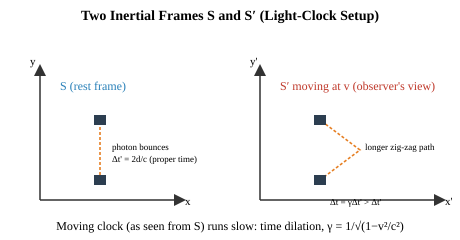
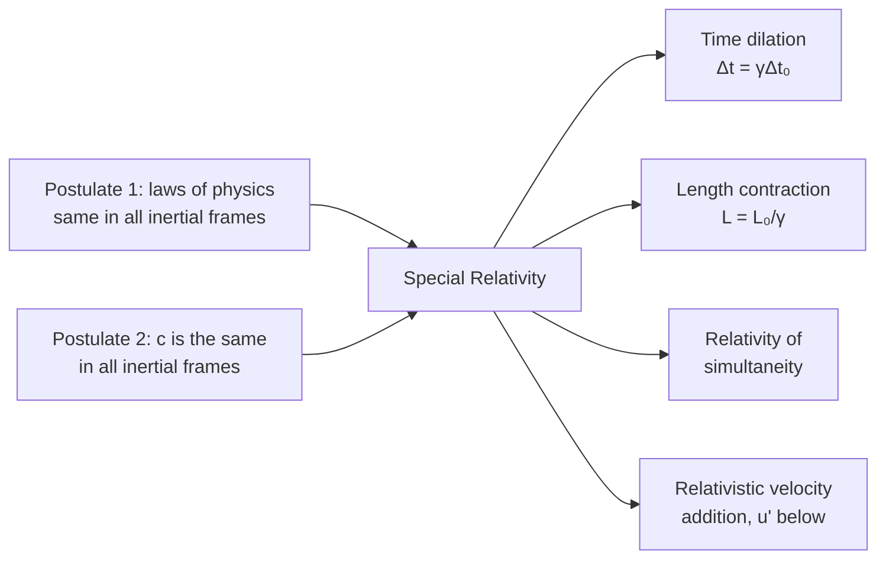

# 10 — Special Theory of Relativity

## 1. Overview

Einstein's Special Theory of Relativity (1905) rebuilds the classical notions of space and
time from two postulates, resolving the conflict between Newtonian mechanics (where
velocities add simply) and Maxwell's electromagnetism (which fixes the speed of light $c$
as a universal constant). Its consequences — time dilation, length contraction, and a new
velocity-addition rule — replace the Galilean transformation with the
[Lorentz Transformation](11_lorentz_transformation.md) developed in the next topic, and
underlie mass–energy equivalence, a cornerstone of all subsequent 20th-century physics.

> **Notation:** $c$ = speed of light in vacuum $=3\times10^8$ m/s; $v$ = relative velocity
> between two inertial frames; $\beta = v/c$; $\gamma = 1/\sqrt{1-\beta^2}$ (Lorentz
> factor); $S$, $S'$ = two inertial reference frames.

---

## 2. Definitions & Key Terms

**1. Inertial Frame of Reference** — *A reference frame in which a body subject to no net
force moves at constant velocity (Newton's first law holds).*

**2. Postulates of Special Relativity** — *(i) The laws of physics are identical in all
inertial frames (principle of relativity); (ii) The speed of light in vacuum, $c$, is the
same in all inertial frames, regardless of the motion of the source or observer.*

**3. Proper Time ($\Delta t_0$)** — *The time interval between two events measured in the
reference frame in which both events occur at the same spatial location (the "rest frame"
of the clock).*

**4. Proper Length ($L_0$)** — *The length of an object measured in the reference frame in
which the object is at rest.*

**5. Lorentz Factor ($\gamma$)** — *The dimensionless factor* $\gamma=1/\sqrt{1-v^2/c^2}
\geq1$ *that governs the magnitude of time dilation and length contraction.*

---

## 3. Core Content

### 3.1 The Two Postulates and Why They Conflict with Galilean Relativity

Classically (Galilean relativity), if a source emits light at speed $c$ in its own rest
frame, an observer moving toward the source at speed $v$ would measure the light's speed
as $c+v$ — velocities simply add. But Maxwell's equations predict $c$ as a fixed constant
determined by the vacuum permittivity and permeability, with no reference to any observer's
motion, and the Michelson–Morley experiment (1887) found no evidence of a hypothesized
"ether" that would make light's speed depend on observer motion. Einstein resolved this by
*elevating* the constancy of $c$ to a postulate, and — rather than searching for special
motion-dependent corrections to electromagnetism — accepted that classical assumptions
about absolute, universal time and space must instead be revised.

### 3.2 Time Dilation — Derivation via the Light Clock

Consider a "light clock": a photon bounces vertically between two mirrors separated by
distance $d$, in a frame $S'$ where the clock is at rest. One "tick" (round trip) takes
proper time:

$$\Delta t_0 = \frac{2d}{c}$$

Now view the same clock from frame $S$, relative to which the clock moves horizontally at
speed $v$. During one tick (as measured in $S$, duration $\Delta t$), the clock itself
moves a horizontal distance $v\,\Delta t$, so the photon's path is now the diagonal of a
triangle, not a straight vertical line — a *longer* path than $2d$:

$$c\,\Delta t = 2\sqrt{d^2 + \left(\frac{v\,\Delta t}{2}\right)^2}$$

Squaring both sides and using $d = c\Delta t_0/2$:

$$c^2\Delta t^2 = 4d^2 + v^2\Delta t^2 = c^2\Delta t_0^2 + v^2\Delta t^2$$

$$\Delta t^2(c^2-v^2) = c^2\Delta t_0^2 \implies \Delta t^2 = \frac{\Delta t_0^2}{1-v^2/c^2}$$

$$\boxed{\Delta t = \gamma\,\Delta t_0, \qquad \gamma = \frac{1}{\sqrt{1-v^2/c^2}}}$$

Since $\gamma \geq 1$ always, $\Delta t \geq \Delta t_0$: **a moving clock is observed to
run slow** ("time dilation") — the clock's own proper time $\Delta t_0$ is the *minimum*
elapsed time any observer will measure between the two ticking events.

### 3.3 Length Contraction

Consider a rod of proper length $L_0$ at rest in frame $S'$, oriented along the direction
of relative motion. An observer in $S$ (relative to whom the rod moves at speed $v$)
measures the time $\Delta t$ for the rod to pass a fixed point, related to $L_0$ via the
rod's own rest-frame measurement and the time-dilation result above. Working through the
consistent transformation (full derivation via the Lorentz transformation in Topic 11)
gives:

$$\boxed{L = \frac{L_0}{\gamma} = L_0\sqrt{1-\frac{v^2}{c^2}}}$$

Since $\gamma\geq1$, $L\leq L_0$: **a moving object is measured as shorter** along its
direction of motion (length contraction); there is no contraction perpendicular to the
motion.

### 3.4 Relativity of Simultaneity

Two events that are simultaneous in one inertial frame are, in general, **not**
simultaneous in a different inertial frame moving relative to the first — a direct
consequence of the finite, frame-independent speed of light combined with the relativity
of "distance traveled" for signals reaching spatially separated observers. This is not a
measurement artifact but a fundamental feature of spacetime structure, formalized
mathematically by the Lorentz transformation (Topic 11), where the transformed time
coordinate $t'$ depends explicitly on the *position* $x$, not just on $t$.

### 3.5 Relativistic Velocity Addition

Replacing the classical (Galilean) velocity-addition rule $u' = u - v$, the relativistic
rule for combining a velocity $u$ (measured in frame $S$) with the relative frame velocity
$v$ is:

$$u' = \frac{u-v}{1-\dfrac{uv}{c^2}}$$

This formula guarantees that combining any two sub-light velocities never produces a
result exceeding $c$ — e.g. combining $u=c$ with any $v<c$ still yields $u'=c$, consistent
with postulate (ii).

---

## 4. Worked Examples

### Example 1 — 🟢 Foundational

**Problem:** A spaceship travels at $v=0.8c$ relative to Earth. A clock on the spaceship
ticks off $\Delta t_0 = 10$ s (proper time, as measured on the ship). How much time
elapses on Earth clocks for the same two events?

**Solution**

$$\gamma = \frac{1}{\sqrt{1-(0.8)^2}} = \frac{1}{\sqrt{1-0.64}} = \frac{1}{\sqrt{0.36}} = \frac{1}{0.6} = 1.667$$

$$\Delta t = \gamma\,\Delta t_0 = 1.667\times10 = \boxed{16.7\;\text{s}}$$

---

### Example 2 — 🟡 Intermediate (Length Contraction)

**Problem:** A rod has proper length $L_0 = 2$ m. It moves at $v=0.6c$ relative to an
observer, oriented along its direction of motion. Find the length measured by the
observer.

**Solution**

$$\gamma = \frac{1}{\sqrt{1-(0.6)^2}} = \frac{1}{\sqrt{0.64}} = \frac{1}{0.8} = 1.25$$

$$L = \frac{L_0}{\gamma} = \frac{2}{1.25} = \boxed{1.6\;\text{m}}$$

---

### Example 3 — 🔴 Advanced / Exam-Level (Velocity Addition & Simultaneity)

**Problem:** Two spaceships, A and B, each move away from Earth in opposite directions,
each at speed $0.75c$ relative to Earth. (a) Find the speed of ship B as measured by an
observer on ship A, using relativistic velocity addition. (b) Explain qualitatively (no
calculation required) why events simultaneous on Earth would generally not be simultaneous
as measured from ship A.

**Solution**

**(a)** Let Earth's frame be $S$. Ship A moves at $v=+0.75c$ (taking A's direction as
positive); ship B moves at $u=-0.75c$ in Earth's frame (opposite direction). We want $u'$,
B's velocity as measured *from* A's frame:

$$u' = \frac{u-v}{1-uv/c^2} = \frac{-0.75c - 0.75c}{1-\dfrac{(-0.75c)(0.75c)}{c^2}} = \frac{-1.5c}{1+0.5625}$$

$$u' = \frac{-1.5c}{1.5625} = \boxed{-0.96c}$$

Ship B recedes from ship A at $0.96c$ — **not** $1.5c$ as naive (classical) addition would
suggest, and correctly remains below $c$, consistent with postulate (ii).

**(b)** Events simultaneous in Earth's frame $S$ occur at the same time coordinate $t$ but
generally at *different* spatial positions $x$. Because ship A is moving relative to
Earth, the Lorentz transformation (Topic 11) mixes space and time coordinates: A's time
coordinate $t'$ for an event depends not only on Earth's $t$ but also on the event's
position $x$. Since the two Earth-simultaneous events occur at different $x$, they map to
different $t'$ values in A's frame — so A does **not** measure them as simultaneous. This
is the relativity of simultaneity (§3.4), and it is not a signal-delay illusion but a
genuine difference in what "the same moment" means across inertial frames.

---

## 5. Applications

**GPS Satellite Timing Corrections** — GPS satellites move at several km/s relative to
ground receivers; time-dilation and gravitational (general-relativistic) corrections,
though minuscule per orbit, must be applied continuously or accumulated positioning errors
would reach kilometres within a day — a direct real-world necessity of these formulas.

**Particle Accelerator Design** — Particles accelerated to relativistic speeds (a
significant fraction of $c$) in accelerators used for materials research (including
polymer/fibre modification via electron-beam irradiation) require relativistic energy and
momentum formulas rather than Newtonian mechanics for accurate beam-dynamics calculations.

---

## 6. Diagram / Visual

*Figure 1: A light clock at rest in frame S traces a vertical path; observed from frame S′
(in relative motion), the same clock's light path is a longer diagonal zig-zag, requiring
more elapsed time — the geometric origin of time dilation.*

*Figure 2: The two postulates and their four principal consequences developed in this
topic.*

---

## 7. Common Mistakes

- ❌ **Mistake:** Applying $\Delta t=\gamma\Delta t_0$ or $L=L_0/\gamma$ without correctly
  identifying which frame measures the *proper* (rest-frame) quantity.
  ✅ **Correct:** $\Delta t_0$ is always the interval measured by a clock present at both
  events (its own rest frame); $L_0$ is always the length measured in the object's own
  rest frame. Reversing which frame is "proper" gives the reciprocal (wrong) answer.

- ❌ **Mistake:** Using classical velocity addition ($u'=u-v$) at relativistic speeds.
  ✅ **Correct:** The relativistic formula (§3.5) must be used whenever speeds are an
  appreciable fraction of $c$; classical addition is only the low-speed approximation
  ($uv/c^2 \ll 1$).

- ❌ **Mistake:** Believing time dilation/length contraction are optical illusions or
  measurement artifacts caused by signal travel time.
  ✅ **Correct:** These are genuine differences in the measured spacetime intervals
  between inertial frames — a distinct physical effect from (and to be corrected for
  separately from) the finite light-travel-time delay in *observing* distant events.

---

## 8. Practice Problems

**Problem 1:** A muon has a proper mean lifetime of $\Delta t_0=2.2\;\mu$s. If it moves at
$v=0.99c$, find its mean lifetime as measured in the lab frame.

Solution

$\gamma = 1/\sqrt{1-(0.99)^2} = 1/\sqrt{1-0.9801} = 1/\sqrt{0.0199} = 1/0.1411 = 7.09$

$\Delta t = \gamma\Delta t_0 = 7.09\times2.2 = \boxed{15.6\;\mu\text{s}}$

(This time-dilation effect is why muons created by cosmic rays high in the atmosphere,
despite their short proper lifetime, survive long enough — in the lab/Earth frame — to
reach ground-based detectors, a classic experimental confirmation of relativity.)

---

**Problem 2 (Exam-level):** A spacecraft of proper length 100 m travels at $v=0.9c$ past a
space station. (a) Find its contracted length as measured from the station. (b) A light
signal is emitted from the spacecraft's nose and tail simultaneously *in the spacecraft's
own frame*; will an observer on the station measure these two emissions as simultaneous?
Explain briefly.

Solution

**(a)** $\gamma = 1/\sqrt{1-0.81} = 1/\sqrt{0.19} = 1/0.436 = 2.294$

$L = L_0/\gamma = 100/2.294 = \boxed{43.6\;\text{m}}$

**(b)** No. Events simultaneous in the spacecraft's frame (which is in relative motion
with respect to the station) are generally **not** simultaneous in the station's frame —
this is the relativity of simultaneity (§3.4). The station observer will measure the two
emissions as occurring at different times.

---

## 9. Summary

| Quantity | Formula | Notes |
|---|---|---|
| Lorentz factor | $\gamma = 1/\sqrt{1-v^2/c^2}$ | Always $\geq1$ |
| Time dilation | $\Delta t = \gamma\Delta t_0$ | Moving clock runs slow |
| Length contraction | $L = L_0/\gamma$ | Moving object appears shorter (along motion) |
| Relativistic velocity addition | $u' = \dfrac{u-v}{1-uv/c^2}$ | Never exceeds $c$ |
| Simultaneity | Frame-dependent | Not an artifact — genuine physical effect |

Next: [→ Lorentz Transformation](11_lorentz_transformation.md) — the coordinate
transformation from which every result in this topic can be derived systematically.

---

## 10. References

1. **Einstein, A. (1905) — "Zur Elektrodynamik bewegter Körper."** Original paper
   introducing special relativity.
2. **Halliday, Resnick & Walker — *Fundamentals of Physics*, 10th ed., Ch. 37.** Time
   dilation, length contraction, and relativistic velocity addition.
3. **Serway & Jewett — *Physics for Scientists and Engineers*, 9th ed., Ch. 39.**
   Complete treatment of special relativity postulates and consequences.
4. **MIT OCW 8.03 — Vibrations and Waves**, supplementary notes on relativistic kinematics.
