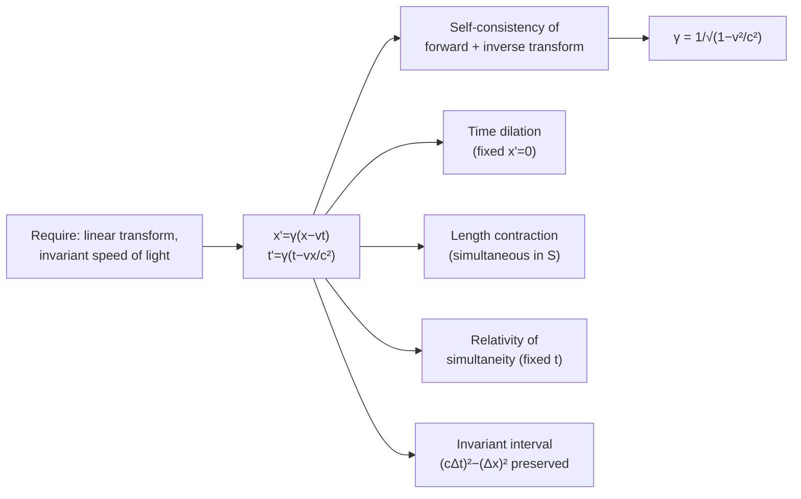

# 11 — Lorentz Transformation

## 1. Overview

The Lorentz Transformation is the set of coordinate-transformation equations relating the
space and time coordinates of an event as measured in one inertial frame to those measured
in another, moving frame — replacing the classical Galilean transformation and providing
the single mathematical source from which every result of
[Special Relativity](10_special_theory_of_relativity.md) (time dilation, length
contraction, relativity of simultaneity, velocity addition) can be derived systematically,
rather than case-by-case as in the previous topic.

> **Notation:** $S(x,y,z,t)$, $S'(x',y',z',t')$ = two inertial frames, with $S'$ moving at
> constant velocity $v$ along the common $x$-axis relative to $S$; $\beta=v/c$;
> $\gamma=1/\sqrt{1-\beta^2}$.

---

## 2. Definitions & Key Terms

**1. Galilean Transformation** — *The classical (pre-relativistic) coordinate
transformation:* $x'=x-vt$, $y'=y$, $z'=z$, $t'=t$ *(time treated as absolute, identical in
all frames).*

**2. Lorentz Transformation** — *The relativistically correct coordinate transformation
between inertial frames in relative motion along a common axis, reducing to the Galilean
transformation when* $v \ll c$.

**3. Invariant Interval** — *The quantity* $(c\,\Delta t)^2 - (\Delta x)^2$ *(for events
along the $x$-axis), which has the same value in every inertial frame — the relativistic
generalization of the classical notion of a fixed, frame-independent distance.*

**4. Four-Vector / Spacetime Event** — *A point* $(x,y,z,t)$ *treated as a single object in
four-dimensional spacetime; the Lorentz transformation is the rotation-like operation
relating the spacetime coordinates of the same event in different inertial frames.*

---

## 3. Core Content

### 3.1 Setting Up the Problem

Let frame $S'$ move at constant velocity $v$ along the $+x$ direction relative to frame
$S$, with their origins coinciding at $t=t'=0$. We seek the transformation $x,t \to x',t'$
consistent with both postulates of relativity (Topic 10): the correct transformation must
(i) be linear in $x,t$ (so that a uniformly moving object in one frame remains uniformly
moving in the other), and (ii) leave the speed of light invariant.

### 3.2 Derivation

Assume a linear transformation of the form:

$$x' = \gamma(x - vt), \qquad t' = \gamma\left(t - \frac{vx}{c^2}\right)$$

with $\gamma$ to be determined. This form is motivated by requiring: (a) consistency with
the Galilean limit $v\ll c$ ($\gamma\to1$ recovers $x'\approx x-vt$, $t'\approx t$), and
(b) symmetry — the inverse transformation (from $S'$ back to $S$) must have the same form
with $v\to-v$.

**Determining $\gamma$:** Consider a light pulse emitted from the common origin at
$t=t'=0$, travelling along $+x$. By postulate (ii), it satisfies $x=ct$ in $S$ **and**
$x'=ct'$ in $S'$. Substituting into the assumed transformation:

$$ct' = \gamma(ct-vt) = \gamma t(c-v)$$

$$t' = \gamma\left(t-\frac{v(ct)}{c^2}\right) = \gamma t\left(1-\frac{v}{c}\right)$$

Setting $ct' = c\times[\gamma t(1-v/c)]$ equal to the first expression $\gamma t(c-v)$:

$$c\gamma t\left(1-\frac{v}{c}\right) = \gamma t(c-v)$$

This holds identically (both sides equal $\gamma t(c-v)$), confirming the assumed form is
self-consistent for the light ray but does not yet fix $\gamma$. To pin down $\gamma$,
require that the transformation, combined with its inverse ($v \to -v$), returns the
original coordinates:

$$x = \gamma(x'+vt'), \qquad t = \gamma\left(t'+\frac{vx'}{c^2}\right)$$

Substituting the forward transformation into the inverse and demanding consistency for
arbitrary $x,t$ yields:

$$\gamma^2\left(1-\frac{v^2}{c^2}\right) = 1 \implies \boxed{\gamma = \frac{1}{\sqrt{1-v^2/c^2}}}$$

— exactly the Lorentz factor already introduced via the light-clock argument in Topic 10,
now derived directly from the coordinate transformation itself.

### 3.3 The Complete Lorentz Transformation

$$\boxed{x' = \gamma(x-vt), \qquad y'=y, \qquad z'=z, \qquad t' = \gamma\left(t-\frac{vx}{c^2}\right)}$$

with the inverse transformation obtained by swapping primed/unprimed coordinates and
$v\to-v$:

$$x = \gamma(x'+vt'), \qquad t = \gamma\left(t'+\frac{vx'}{c^2}\right)$$

Note that $y,z$ (perpendicular to the relative motion) are unaffected — consistent with
the statement in Topic 10 that length contraction occurs only along the direction of
motion.

### 3.4 Recovering Time Dilation, Length Contraction, and Simultaneity

**Time dilation:** consider a clock at rest at fixed $x'=0$ in $S'$ (proper frame). Two
ticks at $t'_1, t'_2$ (so $\Delta t_0 = t'_2-t'_1$) transform to:

$$t = \gamma\left(t'+\frac{v\cdot0}{c^2}\right) = \gamma t' \implies \Delta t = \gamma\,\Delta t_0$$

— exactly the time-dilation result of Topic 10, now derived directly from the
transformation rather than from the light-clock geometry.

**Length contraction:** consider a rod at rest in $S'$, with ends at fixed $x'_1, x'_2$
(so $L_0=x'_2-x'_1$). To measure its length in $S$, both ends must be located
*simultaneously in $S$* (at the same $t$). Using $x'=\gamma(x-vt)$ for each end at the
same $t$:

$$L_0 = x'_2-x'_1 = \gamma(x_2-vt)-\gamma(x_1-vt) = \gamma(x_2-x_1) = \gamma L$$

$$\implies L = \frac{L_0}{\gamma}$$

— exactly the length-contraction result of Topic 10.

**Relativity of simultaneity:** for two events at the same time $t$ in $S$ ($t_1=t_2=t$)
but different positions $x_1 \neq x_2$:

$$t'_2-t'_1 = \gamma\left[(t_2-t_1) - \frac{v(x_2-x_1)}{c^2}\right] = -\gamma\frac{v(x_2-x_1)}{c^2} \neq 0$$

confirming that events simultaneous in $S$ (where $t_2-t_1=0$) are *not* simultaneous in
$S'$ whenever $x_1\neq x_2$ — the algebraic origin of the qualitative argument given in
Topic 10, Example 3(b).

### 3.5 The Invariant Spacetime Interval

Direct substitution shows that the quantity:

$$(c\Delta t)^2 - (\Delta x)^2 = (c\Delta t')^2 - (\Delta x')^2$$

is preserved by the Lorentz transformation — this **invariant interval** plays the role in
spacetime that ordinary distance plays in Euclidean space under rotations, and is the
foundation of the four-dimensional (Minkowski) spacetime diagram used to visualize
relativistic effects.

---

## 4. Worked Examples

### Example 1 — 🟢 Foundational

**Problem:** An event occurs at $x=6\times10^8$ m, $t=2$ s in frame $S$. Frame $S'$ moves
at $v=0.6c$ relative to $S$. Find $x'$ and $t'$.

**Solution**

$$\gamma = \frac{1}{\sqrt{1-0.36}} = \frac{1}{0.8} = 1.25$$

$$x' = \gamma(x-vt) = 1.25\left[6\times10^8 - (0.6\times3\times10^8)(2)\right] = 1.25\left[6\times10^8-3.6\times10^8\right]$$

$$x' = 1.25\times2.4\times10^8 = \boxed{3\times10^8\;\text{m}}$$

$$t' = \gamma\left(t-\frac{vx}{c^2}\right) = 1.25\left[2-\frac{(1.8\times10^8)(6\times10^8)}{9\times10^{16}}\right] = 1.25\left[2-\frac{1.08\times10^{17}}{9\times10^{16}}\right]$$

$$t' = 1.25\left[2-1.2\right] = 1.25\times0.8 = \boxed{1\;\text{s}}$$

---

### Example 2 — 🟡 Intermediate

**Problem:** Using the Lorentz transformation, verify that a light signal emitted at
$x=0,t=0$ traveling at $x=ct$ in frame $S$ also satisfies $x'=ct'$ in frame $S'$ (moving at
speed $v$), confirming the constancy of $c$.

**Solution**

Substitute $x=ct$ into the transformation:

$$x' = \gamma(x-vt) = \gamma(ct-vt) = \gamma t(c-v)$$

$$t' = \gamma\left(t-\frac{vx}{c^2}\right) = \gamma\left(t-\frac{v(ct)}{c^2}\right) = \gamma t\left(1-\frac{v}{c}\right) = \gamma t\,\frac{c-v}{c}$$

Now compute $x'/t'$:

$$\frac{x'}{t'} = \frac{\gamma t(c-v)}{\gamma t(c-v)/c} = c$$

$$\boxed{x' = ct' \quad\checkmark}$$

confirming the speed of light is indeed $c$ in frame $S'$ as well, exactly as postulate
(ii) requires — the Lorentz transformation was constructed precisely to guarantee this.

---

### Example 3 — 🔴 Advanced / Exam-Level

**Problem:** Two events occur in frame $S$: Event 1 at $(x_1,t_1) = (0,0)$, Event 2 at
$(x_2,t_2) = (3\times10^8\text{ m}, 2\text{ s})$. (a) Compute the invariant interval
$(c\Delta t)^2-(\Delta x)^2$. (b) Frame $S'$ moves at $v=0.5c$ relative to $S$. Find the
time interval $\Delta t'$ between the two events in $S'$, and verify the invariant
interval is preserved.

**Solution**

**(a)** $c\Delta t = 3\times10^8\times2 = 6\times10^8$ m; $\Delta x = 3\times10^8$ m

$$(c\Delta t)^2-(\Delta x)^2 = (6\times10^8)^2-(3\times10^8)^2 = 3.6\times10^{17}-0.9\times10^{17} = \boxed{2.7\times10^{17}\;\text{m}^2}$$

**(b)** $\gamma = 1/\sqrt{1-0.25} = 1/\sqrt{0.75} = 1.1547$

$$\Delta t' = \gamma\left(\Delta t - \frac{v\Delta x}{c^2}\right) = 1.1547\left[2 - \frac{(1.5\times10^8)(3\times10^8)}{9\times10^{16}}\right]$$

$$= 1.1547\left[2-\frac{4.5\times10^{16}}{9\times10^{16}}\right] = 1.1547[2-0.5] = 1.1547\times1.5 = \boxed{1.732\;\text{s}}$$

$$\Delta x' = \gamma(\Delta x - v\Delta t) = 1.1547\left[3\times10^8-(1.5\times10^8)(2)\right] = 1.1547[3\times10^8-3\times10^8] = 0$$

Checking the invariant: $(c\Delta t')^2-(\Delta x')^2 = (3\times10^8\times1.732)^2 - 0^2 =
(5.196\times10^8)^2 = 2.7\times10^{17}\;\text{m}^2$ — **matches part (a) exactly**,
confirming the interval is frame-independent even though $\Delta t$, $\Delta x$
individually differ between $S$ and $S'$. (Note $\Delta x'=0$: in $S'$, both events occur
at the *same* location — $S'$ is the frame in which a single clock could be present at
both events, making $\Delta t' = 1.732$ s the *proper time* between them.)

---

## 5. Applications

**Particle Physics Detector Data Analysis** — Reconstructing particle trajectories and
decay times in accelerator experiments requires transforming coordinates between the lab
frame and the particle's own rest frame using exactly this Lorentz transformation.

**Relativistic Doppler Effect in Spectroscopy** — The Lorentz transformation of wave
phase (frequency and wavevector) underlies the relativistic Doppler shift used in
astronomy to measure recession velocities of distant galaxies from spectral line shifts.

---

## 6. Diagram / Visual

*Figure 1: Minkowski spacetime diagram — the $S$ frame's axes are orthogonal (black); the
$S'$ frame's axes (blue, for a frame moving at speed $v$) are tilted symmetrically about
the light worldline (orange, 45°), and a line of simultaneity in $S'$ (red) is tilted
relative to the $S$-frame's horizontal simultaneity lines — the geometric picture behind
the relativity of simultaneity derived algebraically in §3.4.*

*Figure 2: From the two postulates to the full Lorentz transformation and its four
derived consequences.*

---

## 7. Common Mistakes

- ❌ **Mistake:** Using the Galilean transformation ($x'=x-vt$, $t'=t$) at relativistic
  speeds.
  ✅ **Correct:** The Galilean transformation is only the $v\ll c$ (i.e. $\gamma\to1$)
  limit of the Lorentz transformation — always use the full Lorentz form unless
  explicitly working in the non-relativistic approximation.

- ❌ **Mistake:** Forgetting the $-vx/c^2$ term in the time transformation.
  ✅ **Correct:** Unlike Galilean relativity, relativistic time transformation mixes in
  the spatial coordinate — omitting this term silently reintroduces the (wrong) assumption
  of absolute simultaneity.

- ❌ **Mistake:** Applying the length-contraction shortcut $L=L_0/\gamma$ without ensuring
  both rod-end positions are measured *simultaneously* in the observing frame.
  ✅ **Correct:** The derivation in §3.4 explicitly requires $t_1=t_2$ in the frame
  making the measurement — length is only well-defined as a simultaneous-endpoints
  measurement.

---

## 8. Practice Problems

**Problem 1:** An event occurs at $x=0$, $t=5$ s in frame $S$. Frame $S'$ moves at
$v=0.6c$ relative to $S$. Find $t'$.

Solution

$\gamma = 1/\sqrt{1-0.36} = 1.25$

$t' = \gamma(t - vx/c^2) = 1.25(5 - 0) = \boxed{6.25\;\text{s}}$ (since $x=0$, the spatial
term vanishes here).

---

**Problem 2 (Exam-level):** Two events are simultaneous in frame $S$ ($\Delta t=0$),
separated by $\Delta x = 4\times10^8$ m. Frame $S'$ moves at $v=0.5c$ relative to $S$.
Find $\Delta t'$ between the two events as measured in $S'$, and state which event occurs
first in $S'$ (the one at larger or smaller $x$).

Solution

$\gamma = 1/\sqrt{1-0.25} = 1.1547$

$$\Delta t' = \gamma\left(\Delta t - \frac{v\Delta x}{c^2}\right) = 1.1547\left(0-\frac{(1.5\times10^8)(4\times10^8)}{9\times10^{16}}\right)$$

$$= 1.1547\left(-\frac{6\times10^{16}}{9\times10^{16}}\right) = 1.1547\times(-0.667) = \boxed{-0.770\;\text{s}}$$

Since $\Delta t' = t'_2 - t'_1 < 0$ (taking event 2 as the one at larger $x$), event 2
(larger $x$) occurs **before** event 1 in $S'$ — the two events, simultaneous in $S$, are
measured in $S'$ as occurring in a definite time order, with the more distant (in the
direction of $S'$'s motion) event happening first.

---

## 9. Summary

| Quantity | Formula | Notes |
|---|---|---|
| Lorentz transformation | $x'=\gamma(x-vt)$, $t'=\gamma(t-vx/c^2)$ | $y'=y$, $z'=z$ unaffected |
| Lorentz factor | $\gamma=1/\sqrt{1-v^2/c^2}$ | Derived from self-consistency |
| Time dilation (from transform) | $\Delta t=\gamma\Delta t_0$ | Fixed $x'$ in moving frame |
| Length contraction (from transform) | $L=L_0/\gamma$ | Simultaneous measurement required |
| Invariant interval | $(c\Delta t)^2-(\Delta x)^2$ = same in all frames | Foundation of Minkowski spacetime |

Next: [→ de Broglie Wave](12_de_broglie_wave.md) — returning to the quantum side of
modern physics, extending wave–particle duality from photons to matter.

---

## 10. References

1. **Einstein, A. (1905) — "Zur Elektrodynamik bewegter Körper."** Original derivation of
   the Lorentz transformation from the two postulates.
2. **Halliday, Resnick & Walker — *Fundamentals of Physics*, 10th ed., §37-4.** Lorentz
   transformation equations and consequences.
3. **Serway & Jewett — *Physics for Scientists and Engineers*, 9th ed., §39.4.**
   Full derivation with worked spacetime-interval examples.
4. **HyperPhysics — Lorentz Transformation.**
   [http://hyperphysics.phy-astr.gsu.edu/hbase/Relativ/tdil.html](http://hyperphysics.phy-astr.gsu.edu/hbase/Relativ/tdil.html)
