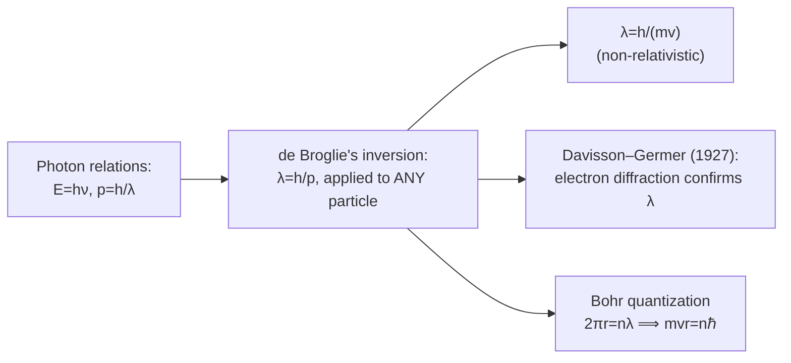

# 12 — de Broglie Wave

## 1. Overview

By 1924, Einstein's photon hypothesis ([Topic 09](09_quantum_theory_of_radiation.md)) had
established that light — traditionally understood as a wave — also exhibits particle-like
behaviour. Louis de Broglie proposed the symmetric, and far bolder, converse: that
**matter** — traditionally understood as particles — should also exhibit wave-like
behaviour, with a wavelength inversely proportional to momentum. This hypothesis, initially
speculative, was confirmed experimentally within three years and underlies both the
[Photoelectric Effect](13_photoelectric_effect.md)/[Compton Effect](14_compton_effect.md)
duality discussions that follow and the entire framework of quantum mechanics (Schrödinger's
wave equation was directly motivated by de Broglie's idea).

> **Notation:** $\lambda$ = de Broglie wavelength [m]; $p$ = momentum [kg·m/s]; $h$ =
> Planck constant; $m$ = mass [kg]; $v$ = speed [m/s]; $K$ = kinetic energy [J].

---

## 2. Definitions & Key Terms

**1. de Broglie Hypothesis** — *Every moving particle of momentum $p$ has an associated
wave (the "matter wave") of wavelength* $\lambda = h/p$.

**2. Matter Wave** — *The wave associated with a moving particle via the de Broglie
relation; not a physical oscillation of the particle's substance, but (in the later,
rigorous quantum-mechanical formulation) a probability-amplitude wave.*

**3. Wave–Particle Duality** — *The principle that both light and matter exhibit both
wave-like (interference, diffraction) and particle-like (localized momentum, energy
exchange in discrete quanta) behaviour, depending on the experiment performed.*

**4. de Broglie Wavelength ($\lambda$)** — *The specific wavelength value given by the de
Broglie relation for a particle of given momentum.*

---

## 3. Core Content

### 3.1 Motivation: Symmetry with the Photon Relations

For a photon, two relations connect its particle-like and wave-like descriptions:

$$E = h\nu \qquad \text{(energy, from Planck/Einstein)}$$

$$p = \frac{E}{c} = \frac{h\nu}{c} = \frac{h}{\lambda} \qquad \text{(momentum, from relativistic energy-momentum relation with } m=0\text{)}$$

De Broglie's hypothesis was to invert the second relation and apply it universally — to
*any* particle with momentum $p$, not just to massless photons:

$$\boxed{\lambda = \frac{h}{p}}$$

For a non-relativistic particle of mass $m$ moving at speed $v$, $p=mv$, so:

$$\boxed{\lambda = \frac{h}{mv}}$$

### 3.2 Why Matter Waves Are Not Observed in Everyday Life

Because $h=6.626\times10^{-34}$ J·s is extraordinarily small, the de Broglie wavelength of
any macroscopic object (even a very light, slow one) is absurdly tiny compared to any
apparatus that could reveal wave behaviour (such as a diffraction grating with comparable
slit spacing) — see Example 1. Wave effects only become experimentally accessible for
very light particles (electrons, neutrons) at modest speeds, where $\lambda$ can approach
atomic length scales (comparable to crystal lattice spacings, ~0.1–1 nm).

### 3.3 Relation for Kinetic Energy

Since $p=mv$ and kinetic energy $K=\frac{1}{2}mv^2=\frac{p^2}{2m}$, momentum can be
expressed as $p=\sqrt{2mK}$, giving a form of the de Broglie relation useful when kinetic
energy (rather than speed) is given directly — as is common for electrons accelerated
through a known potential difference:

$$\lambda = \frac{h}{\sqrt{2mK}}$$

For an electron accelerated from rest through potential difference $V$ (so $K=eV$):

$$\lambda = \frac{h}{\sqrt{2meV}}$$

### 3.4 Experimental Confirmation: Davisson–Germer Experiment

In 1927, Davisson and Germer fired a beam of electrons at a nickel crystal and observed a
diffraction pattern — intensity maxima and minima at specific scattering angles,
exactly as expected for wave diffraction off a periodic crystal lattice (analogous to
X-ray diffraction). The measured wavelength from the diffraction pattern matched the
de Broglie prediction $\lambda=h/p$ (computed from the electrons' known accelerating
voltage) to within experimental accuracy — direct, unambiguous confirmation that electrons,
long regarded as point particles, genuinely exhibit wave behaviour.

### 3.5 The Bohr Model Connection

De Broglie's hypothesis also provided a physical justification for the previously *ad hoc*
Bohr quantization condition in atomic theory: an electron's allowed circular orbit
(circumference $2\pi r$) must contain a whole number of de Broglie wavelengths,
$2\pi r = n\lambda$, which — substituting $\lambda=h/p=h/(mv)$ — directly reproduces Bohr's
quantized angular momentum condition $mvr = n\hbar$ (originally postulated without physical
justification), retroactively explaining *why* only certain orbits are stable.

---

## 4. Worked Examples

### Example 1 — 🟢 Foundational

**Problem:** Find the de Broglie wavelength of (a) a 0.15 kg baseball moving at 40 m/s,
and (b) an electron ($m_e=9.11\times10^{-31}$ kg) moving at $2\times10^6$ m/s. Compare the
two results and comment on observability.

**Solution**

**(a)** $\lambda_{\text{ball}} = \dfrac{h}{mv} = \dfrac{6.626\times10^{-34}}{0.15\times40} = \dfrac{6.626\times10^{-34}}{6}$

$$\boxed{\lambda_{\text{ball}} \approx 1.1\times10^{-34}\;\text{m}}$$

This is roughly $10^{19}$ times smaller than a proton's diameter — utterly unobservable
with any conceivable apparatus, which is why macroscopic objects show no detectable wave
behaviour.

**(b)** $\lambda_e = \dfrac{6.626\times10^{-34}}{9.11\times10^{-31}\times2\times10^6} = \dfrac{6.626\times10^{-34}}{1.822\times10^{-24}}$

$$\boxed{\lambda_e \approx 3.64\times10^{-10}\;\text{m} = 0.364\;\text{nm}}$$

This is comparable to typical atomic spacings in a crystal lattice (~0.1–0.3 nm) — exactly
why electron diffraction from crystals (Davisson–Germer) is experimentally observable.

---

### Example 2 — 🟡 Intermediate

**Problem:** An electron is accelerated from rest through a potential difference of
$V=150$ V. Find its de Broglie wavelength. ($e=1.6\times10^{-19}$ C,
$m_e=9.11\times10^{-31}$ kg)

**Solution**

$$K = eV = 1.6\times10^{-19}\times150 = 2.4\times10^{-17}\;\text{J}$$

$$\lambda = \frac{h}{\sqrt{2m_eK}} = \frac{6.626\times10^{-34}}{\sqrt{2\times9.11\times10^{-31}\times2.4\times10^{-17}}}$$

$$\sqrt{2\times9.11\times10^{-31}\times2.4\times10^{-17}} = \sqrt{4.373\times10^{-47}} = 6.613\times10^{-24}$$

$$\lambda = \frac{6.626\times10^{-34}}{6.613\times10^{-24}} = \boxed{1.00\times10^{-10}\;\text{m} = 1.00\;\text{Å}}$$

(A convenient rule of thumb: electrons accelerated through ~150 V have de Broglie
wavelength close to 1 Å, comparable to X-ray wavelengths and typical atomic spacings —
the basis of low-energy electron diffraction techniques.)

---

### Example 3 — 🔴 Advanced / Exam-Level

**Problem:** Using the Bohr-model connection (§3.5), show that requiring an integer number
of de Broglie wavelengths around a circular orbit of radius $r$ reproduces the Bohr
quantization condition $L=mvr=n\hbar$ (where $\hbar=h/2\pi$), and use this to find the
allowed radii $r_n$ for the hydrogen atom given the Coulomb-force circular-orbit relation
$mv^2/r = ke^2/r^2$ (with $k=1/4\pi\varepsilon_0$).

**Solution**

**Step 1 — Quantization condition:** Requiring a whole number of wavelengths around the
circumference:

$$2\pi r = n\lambda = n\frac{h}{mv} \implies mvr = \frac{nh}{2\pi} = n\hbar$$

which is exactly the Bohr angular-momentum quantization postulate, now derived from the
wave picture rather than assumed.

**Step 2 — Combine with the Coulomb-force condition:** From circular motion,
$mv^2/r=ke^2/r^2 \implies v^2 = ke^2/(mr)$. From quantization, $v=n\hbar/(mr)$, so
$v^2 = n^2\hbar^2/(m^2r^2)$. Setting the two expressions for $v^2$ equal:

$$\frac{n^2\hbar^2}{m^2r^2} = \frac{ke^2}{mr}$$

$$\frac{n^2\hbar^2}{mr} = ke^2 \implies r = \frac{n^2\hbar^2}{mke^2}$$

$$\boxed{r_n = \frac{n^2\hbar^2}{mke^2} = n^2 a_0}$$

where $a_0=\hbar^2/(mke^2)$ is the Bohr radius ($\approx0.529$ Å for $n=1$) — the allowed
orbit radii scale as $n^2$, directly recovering the standard Bohr-model result entirely
from the requirement that an integer number of de Broglie wavelengths fit around each
orbit, giving physical meaning to what was originally an unexplained quantization rule.

---

## 5. Applications

**Electron Microscopy** — Because electrons accelerated to typical microscope voltages
(tens to hundreds of kV) have de Broglie wavelengths thousands of times shorter than
visible light, electron microscopes achieve far higher resolution than optical microscopes
— directly exploiting $\lambda=h/p$ to image nanoscale structures, including fibre/polymer
morphology in textile materials science.

**Neutron Diffraction in Materials Science** — Thermal neutrons have de Broglie
wavelengths comparable to interatomic spacings, making neutron diffraction a standard tool
for probing crystal and polymer structure (complementary to X-ray diffraction, with
different sensitivity, e.g. to light elements like hydrogen).

---

## 6. Diagram / Visual

*Figure 1: A particle of momentum $p=mv$ is associated with a matter wave of wavelength
$\lambda=h/p$ — the de Broglie relation extending wave–particle duality from photons to
all matter.*

*Figure 2: From the photon's wave–particle relations to de Broglie's universal matter-wave
hypothesis and its two major consequences.*

---

## 7. Common Mistakes

- ❌ **Mistake:** Using $\lambda=h/p$ with relativistic particles without the correct
  (relativistic) momentum.
  ✅ **Correct:** For particles moving at an appreciable fraction of $c$, the relativistic
  momentum $p=\gamma mv$ must be used; the non-relativistic $p=mv$ form (used throughout
  this topic) is valid only when $v\ll c$.

- ❌ **Mistake:** Thinking the de Broglie wave is a physical vibration of the particle's
  material substance, like a sound wave in a medium.
  ✅ **Correct:** The rigorous interpretation (developed later in quantum mechanics via the
  Schrödinger equation) is that the matter wave is a probability-amplitude wave — its
  intensity gives the probability of finding the particle at a given location, not a
  literal mechanical oscillation.

- ❌ **Mistake:** Expecting wave behaviour to be observable for any particle, regardless of
  mass/speed.
  ✅ **Correct:** Wave effects are only experimentally significant when $\lambda$ is
  comparable to the relevant physical length scale of the apparatus (Example 1) — light,
  slow particles (electrons, neutrons) at accessible energies satisfy this; macroscopic
  objects never do.

---

## 8. Practice Problems

**Problem 1:** Find the de Broglie wavelength of a proton ($m_p=1.67\times10^{-27}$ kg)
moving at $v=5\times10^5$ m/s.

Solution

$\lambda = h/(mv) = (6.626\times10^{-34})/(1.67\times10^{-27}\times5\times10^5) = (6.626\times10^{-34})/(8.35\times10^{-22})$

$$\boxed{\lambda \approx 7.94\times10^{-13}\;\text{m}}$$

---

**Problem 2 (Exam-level):** An electron and a proton are each accelerated from rest
through the same potential difference $V$. Find the ratio $\lambda_e/\lambda_p$ of their
de Broglie wavelengths, in terms of their masses only.

Solution

For both particles, $K=eV$ (same charge magnitude, same $V$), and
$\lambda=h/\sqrt{2mK}=h/\sqrt{2meV}$, so:

$$\frac{\lambda_e}{\lambda_p} = \frac{\sqrt{2m_peV}}{\sqrt{2m_eeV}} = \sqrt{\frac{m_p}{m_e}}$$

Since $m_p/m_e \approx 1836$:

$$\boxed{\frac{\lambda_e}{\lambda_p} = \sqrt{1836} \approx 42.8}$$

The (much lighter) electron has a de Broglie wavelength about 43 times longer than the
proton's, for the same accelerating voltage — lighter particles have longer matter waves
at equal kinetic energy, which is why electron (not proton) diffraction is the standard
tool for atomic-scale structural studies at modest accelerating voltages.

---

## 9. Summary

| Quantity | Formula | Notes |
|---|---|---|
| de Broglie relation | $\lambda = h/p$ | Universal — light and matter |
| Non-relativistic form | $\lambda = h/(mv)$ | $v \ll c$ |
| In terms of kinetic energy | $\lambda = h/\sqrt{2mK}$ | Useful for accelerated particles |
| Electron accelerated through $V$ | $\lambda = h/\sqrt{2meV}$ | ~1 Å at ~150 V |
| Bohr quantization (derived) | $2\pi r = n\lambda \Rightarrow mvr=n\hbar$ | Physical basis for Bohr model |

Next: [→ Photoelectric Effect](13_photoelectric_effect.md) — the historical experiment
that first forced physics to take the particle nature of light seriously, setting up the
wave–particle symmetry completed by this topic.

---

## 10. References

1. **de Broglie, L. (1924) — Doctoral thesis, "Recherches sur la théorie des quanta."**
   Original hypothesis of matter waves.
2. **Davisson, C. & Germer, L. (1927) — "Diffraction of Electrons by a Crystal of
   Nickel."** *Physical Review*. First experimental confirmation.
3. **Halliday, Resnick & Walker — *Fundamentals of Physics*, 10th ed., §39-2.** de Broglie
   wavelength, electron diffraction, Bohr-model connection.
4. **HyperPhysics — de Broglie Waves.**
   [http://hyperphysics.phy-astr.gsu.edu/hbase/quantum/debrog.html](http://hyperphysics.phy-astr.gsu.edu/hbase/quantum/debrog.html)
