# Physics-II (BUTEX, L1T2) — Previous Year Questions with Answers

*Answers compiled for exam prep. Chapter/sub-topic order preserved from the source PYQ compilation (exam years 2014–2022).*

---

## Chapter 1: Electrostatics

### Coulomb's Law, Electric Field & Intensity

**Define electric field and electric field intensity.** *(2019, 2022)*

The **electric field** at a point in space is the region around a charge (or charge distribution) in which another charge experiences an electric force. **Electric field intensity** $\vec{E}$ at a point is defined as the electric force $\vec{F}$ experienced by a unit positive test charge $q_0$ placed at that point (in the limit $q_0 \to 0$ so the test charge doesn't disturb the source):

$$\vec{E} = \lim_{q_0 \to 0}\frac{\vec{F}}{q_0}$$

Units: N/C (equivalently V/m). *Example:* near a proton, a nearby electron feels an attractive force; the field intensity at the electron's location tells you the force per unit charge it would feel there, regardless of whether the electron is actually present.

**State and explain Coulomb's law in electrostatics. Hence define unit charge.** *(2019, 2022)* / **State and explain Coulomb's law.** *(2017)*

Coulomb's law: the force between two point charges $q_1, q_2$ separated by distance $r$ is directly proportional to the product of the charges and inversely proportional to the square of the distance between them, acting along the line joining them:

$$F = k\frac{q_1 q_2}{r^2}, \qquad k = \frac{1}{4\pi\varepsilon_0} \approx 9\times10^9\ \text{N·m}^2/\text{C}^2$$

Like charges repel, unlike charges attract. **Unit charge (1 coulomb)** is defined as that charge which, when placed 1 m from an equal charge in vacuum, repels it with a force of $9\times10^9$ N (equivalently, $k=1$ when $q_1=q_2=1\,\text{C}$, $r=1\,\text{m}$).

*Worked example:* two charges of $+1\,\mu C$ each, 0.1 m apart: $F = 9\times10^9 \times (10^{-6})^2/(0.1)^2 = 9\times10^9\times10^{-12}/0.01 = 0.9$ N (repulsive).

**Define electric field. Find the expression for electric field at a point on the axis of a charged ring.** *(2015)*

For electric field definition, see above. **Field on the axis of a uniformly charged ring:** consider a ring of radius $a$, total charge $Q$, and a point $P$ on its axis at distance $x$ from the centre. Each element $dq$ is at distance $r=\sqrt{x^2+a^2}$ from $P$. By symmetry, the components of $d\vec{E}$ perpendicular to the axis cancel around the ring; only the axial components add:

$$dE_x = \frac{1}{4\pi\varepsilon_0}\frac{dq}{r^2}\cos\theta, \qquad \cos\theta = \frac{x}{\sqrt{x^2+a^2}}$$

$$E = \int dE_x = \frac{1}{4\pi\varepsilon_0}\frac{x}{(x^2+a^2)^{3/2}}\int dq = \frac{1}{4\pi\varepsilon_0}\frac{Qx}{(x^2+a^2)^{3/2}}$$

For $x \gg a$, this reduces to $E \approx kQ/x^2$, i.e. the ring behaves like a point charge, as expected.

**State and explain Gauss's law. Deduce Coulomb's law from Gauss's law.** *(2015)* / **State and prove Gauss's law of electrostatics. Show that Coulomb's law can be deduced from Gauss's law.** *(2020)*

**Gauss's law:** the total electric flux through any closed surface equals $1/\varepsilon_0$ times the net charge enclosed:

$$\oint \vec{E}\cdot d\vec{A} = \frac{q_{enc}}{\varepsilon_0}$$

**Proof (for a point charge):** enclose a point charge $q$ in an imaginary sphere of radius $r$. By symmetry $\vec E$ is radial and constant in magnitude over the sphere. Flux $=\oint E\,dA = E(4\pi r^2)$. Since $E = q/(4\pi\varepsilon_0 r^2)$ (from Coulomb's law), flux $= q/\varepsilon_0$ — consistent for a sphere, and the result generalizes (via solid-angle arguments) to any closed surface and any charge distribution.

**Deducing Coulomb's law from Gauss's law:** apply Gauss's law to a sphere of radius $r$ around point charge $q$. By symmetry, $E$ is the same at every point on the sphere and radial, so $\oint \vec E \cdot d\vec A = E \cdot 4\pi r^2 = q/\varepsilon_0$, giving

$$E = \frac{q}{4\pi\varepsilon_0 r^2} \implies F = qE = \frac{1}{4\pi\varepsilon_0}\frac{q q_0}{r^2}$$

which is Coulomb's law.

**Define: Gauss's law, Ohm's law, Capacitor.** *(2018)*

- **Gauss's law** — see above.
- **Ohm's law** — see Chapter 2.
- **Capacitor** — a device consisting of two conductors separated by an insulator (dielectric), used to store electric charge and energy in the electric field between them.

**State and explain Gauss's law. For the balanced condition in Wheatstone bridge, show that P/Q = R/S. Calculate the field E due to a point charge P at a distance R along the perpendicular bisector of the line joining the charges.** *(2021)*

Gauss's law — see above. Wheatstone bridge balance derivation — see Chapter 2. **Field on the perpendicular bisector of a dipole (equatorial point):** for charges $+q$ at $(a,0)$ and $-q$ at $(-a,0)$, the field at point $P=(0,R)$ on the perpendicular bisector has each charge's field magnitude $E_{each} = kq/(R^2+a^2)$, directed along the line from the charge to $P$. The components along the dipole axis add (both point in $-x$ direction, from $+q$ side toward $-q$ side) while perpendicular components cancel:

$$E = 2E_{each}\cos\phi = 2\cdot\frac{kq}{R^2+a^2}\cdot\frac{a}{\sqrt{R^2+a^2}} = \frac{kq(2a)}{(R^2+a^2)^{3/2}} = \frac{kp}{(R^2+a^2)^{3/2}}$$

where $p=q(2a)$ is the dipole moment. For $R\gg a$: $E \approx kp/R^3$, directed antiparallel to $\vec p$.

**What is the magnitude of the electric field strength such that an electron placed in the field would experience an electrical force equal to its weight?** *(2020, numerical)*

Set $eE = mg$:

$$E = \frac{mg}{e} = \frac{(9.11\times10^{-31}\,\text{kg})(9.8\,\text{m/s}^2)}{1.6\times10^{-19}\,\text{C}} = \frac{8.93\times10^{-30}}{1.6\times10^{-19}} = 5.58\times10^{-11}\ \text{N/C}$$

**What is dielectrics? If the charge density of a charged conductor is 8.85×10⁻¹⁰ coulomb/m², find the electric field intensity just near its surface.** *(2015)*

**Dielectrics** are insulating materials that, unlike conductors, do not have free charge carriers; under an external field their molecules polarize (bound charges shift slightly) but do not conduct current. For the field just outside a charged conductor's surface, $E = \sigma/\varepsilon_0$ (not $\sigma/2\varepsilon_0$, which applies to an isolated thin sheet — at a conductor surface all the field is external, none inside):

$$E = \frac{\sigma}{\varepsilon_0} = \frac{8.85\times10^{-10}}{8.85\times10^{-12}} = 100\ \text{N/C}$$

**Define: Electric flux, Dielectric substance.** *(2014)*

**Electric flux** $\Phi_E = \oint \vec E \cdot d\vec A$ is a measure of the number of field lines passing through a surface. **Dielectric substance** — see above.

**What is charge density and electrical dipole? Deduce the relation between electric intensity and charge density. Show that electric intensity is directly proportional to twice the electric dipole moment and inversely proportional to the cube of the distance to the point.** *(2022)*

**Charge density** $\sigma = q/A$ (surface) is charge per unit area (similarly $\rho=q/V$ for volume, $\lambda=q/L$ for line). An **electric dipole** is a pair of equal and opposite charges $\pm q$ separated by a small distance $2a$, characterized by dipole moment $p=q(2a)$ pointing from $-q$ to $+q$.

*Relation between E and σ:* from Gauss's law applied to a pillbox straddling a charged conducting surface, $E=\sigma/\varepsilon_0$ (derived above).

*Axial field of a dipole ($\propto 2p/r^3$):* at axial point $P$ at distance $r$ from the centre (with $r \gg a$), fields due to $+q$ (distance $r-a$) and $-q$ (distance $r+a$) both point along the axis (in the direction of $+q$'s field, since it's nearer):

$$E = \frac{kq}{(r-a)^2} - \frac{kq}{(r+a)^2} = kq\cdot\frac{(r+a)^2-(r-a)^2}{(r^2-a^2)^2} = kq\cdot\frac{4ar}{(r^2-a^2)^2}$$

For $r \gg a$: $E \approx \dfrac{4kqar}{r^4} = \dfrac{2kp}{r^3} = \dfrac{2p}{4\pi\varepsilon_0 r^3}$ — directly proportional to $2p$, inversely proportional to $r^3$.

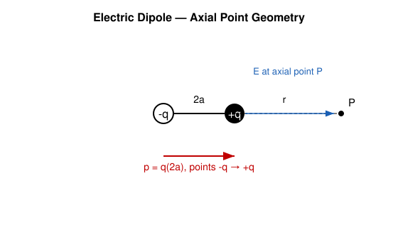

**Calculate the potential due to a dipole (axis of dipole moment 2.5×10⁻¹⁰ coul/meter) at a distance 1m from it.** *(2016, numerical)*

*Note: dipole moment units should be C·m, not C/m — treated as a typo.* On the axis, $V = \dfrac{kp}{r^2}$ (since $\cos\theta=1$):

$$V = \frac{9\times10^9 \times 2.5\times10^{-10}}{1^2} = 2.25\ \text{V}$$

**Show that D̄ = ε₀Ē + P̄.** *(2015)*

In a dielectric, the electric displacement $\vec D$ relates the free charge field to the total field including polarization. Total field $\vec E$ inside a dielectric = field due to free charges $\vec E_0$ plus field due to bound (polarization) charges. By definition, the polarization $\vec P$ (dipole moment per unit volume) contributes an opposing field, and Gauss's law for free charge alone gives $\oint \vec D \cdot d\vec A = q_{free}$, with

$$\vec D = \varepsilon_0 \vec E + \vec P$$

This follows from writing total charge = free + bound, $q_{bound} = -\oint \vec P\cdot d\vec A$, substituting into Gauss's law $\oint \varepsilon_0\vec E\cdot d\vec A = q_{free}+q_{bound}$, and rearranging: $\oint(\varepsilon_0\vec E + \vec P)\cdot d\vec A = q_{free}$, so $\vec D \equiv \varepsilon_0\vec E+\vec P$.

### Capacitors & Dielectrics

**What is a capacitor? Define capacitance of a capacitor.** *(2019)* / **Define capacitor and capacitance.** *(2014, 2021)*

A **capacitor** is a two-conductor system that stores charge and electrical energy. **Capacitance** $C = Q/V$ is the charge stored per unit potential difference between the plates; unit: farad (F) = coulomb/volt.

**Find an expression for the capacitance of a capacitor.** *(2017)* / **Find an expression for a parallel plate capacitor.** *(2022)* / **Derive the equation for capacitance of a parallel plate capacitor. Calculate the capacitance of a capacitor whose plate area is 1.5 m² and distance between plates in air medium is 0.02 m (ε₀ = 1).** *(2021, numerical)*

For two parallel plates of area $A$, separation $d$, with charge $\pm Q$: field between plates $E=\sigma/\varepsilon_0 = Q/(\varepsilon_0 A)$ (uniform, ignoring edge effects). Potential difference:

$$V = Ed = \frac{Qd}{\varepsilon_0 A} \implies C = \frac{Q}{V} = \frac{\varepsilon_0 A}{d}$$

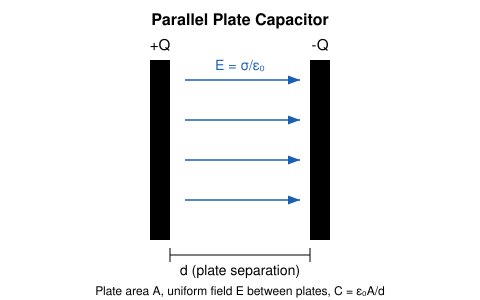

*Numerical:* $A=1.5\,\text{m}^2$, $d=0.02\,\text{m}$. **Flag:** "ε₀ = 1" as literally stated is not physical (the real vacuum permittivity is $8.85\times10^{-12}\,\text{F/m}$); it looks like an instruction to just use $\varepsilon_0=1$ symbolically or an OCR/transcription artifact. Both readings:

- *Literal ($\varepsilon_0=1$, as stated):* $C = 1\times1.5/0.02 = 75$ (numerically, not a physically meaningful farad value).
- *Physical ($\varepsilon_0 = 8.85\times10^{-12}\,\text{F/m}$):* $C = \dfrac{8.85\times10^{-12}\times1.5}{0.02} = 6.64\times10^{-10}\,\text{F} \approx 0.664\,\text{nF}$.

**Calculate the capacitance of a parallel plate capacitor when completely filled with a dielectric medium. Two parallel plates of an air-filled capacitor are separated by 2.5×10⁻³ m; if capacitance is 3 µF, calculate the area of each plate (ε₀ = 8.85×10⁻¹² C²/N·m²).** *(2014, numerical)*

With dielectric of constant $k$ filling the gap: $C = k\varepsilon_0 A/d$ (field inside reduces to $E/k$, so $V$ drops by factor $k$, and $C$ increases by factor $k$ compared to vacuum).

*Numerical (air, $k=1$):* $A = \dfrac{Cd}{\varepsilon_0} = \dfrac{3\times10^{-6}\times2.5\times10^{-3}}{8.85\times10^{-12}} = \dfrac{7.5\times10^{-9}}{8.85\times10^{-12}} \approx 847.5\ \text{m}^2$

(This is a very large plate area — that's simply what these given numbers yield.)

**A parallel plate capacitor consists of two square metal plates of 50 cm side, separated by 1 cm. A 6 mm-thick sulphur slab (dielectric constant 4) is placed on the lower plate — calculate the capacitance.** *(2017, numerical)*

$A = 0.5\times0.5 = 0.25\,\text{m}^2$. Total gap $d=1\,\text{cm}=0.01\,\text{m}$; dielectric slab thickness $t=6\,\text{mm}=0.006\,\text{m}$ ($k=4$); remaining air gap $= 0.01-0.006=0.004\,\text{m}$. A slab-plus-air-gap capacitor behaves as the series combination, giving an effective gap $d_{air} + t/k$:

$$C = \frac{\varepsilon_0 A}{d_{air} + t/k} = \frac{8.85\times10^{-12}\times0.25}{0.004 + 0.006/4} = \frac{2.2125\times10^{-12}}{0.0055} = 4.02\times10^{-10}\,\text{F} \approx 402\ \text{pF}$$

**Show that 1/Cₛ = 1/C₁ + 1/C₂ + 1/C₃.** *(2018)*

In series, the same charge $Q$ appears on each capacitor (charge induction), with total voltage split across them: $V = V_1+V_2+V_3 = Q/C_1+Q/C_2+Q/C_3$. Since $V=Q/C_s$ for the equivalent capacitor:

$$\frac{Q}{C_s} = Q\left(\frac{1}{C_1}+\frac{1}{C_2}+\frac{1}{C_3}\right) \implies \frac{1}{C_s}=\frac{1}{C_1}+\frac{1}{C_2}+\frac{1}{C_3}$$

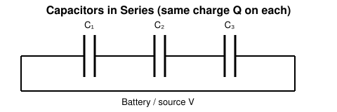

**Discuss the charging and discharging of a capacitor through a resistor with graphical representation. A capacitor and a 1 mega-ohm resistor are connected in series with a battery; if the charge reaches 50% of its maximum value after one second, calculate the capacitance and the time constant.** *(2015, numerical)*

**Charging:** applying Kirchhoff's voltage law to a series R-C circuit with battery EMF $V$: $V = iR + q/C$, with $i=dq/dt$. Solving this differential equation with $q(0)=0$:

$$q(t) = CV\left(1-e^{-t/RC}\right) = Q_0\left(1-e^{-t/RC}\right)$$

**Discharging** (battery removed, capacitor discharges through R): $iR + q/C = 0 \Rightarrow q(t) = Q_0 e^{-t/RC}$.

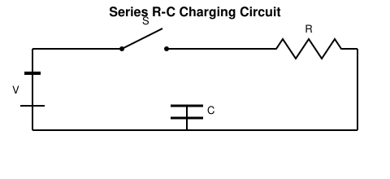
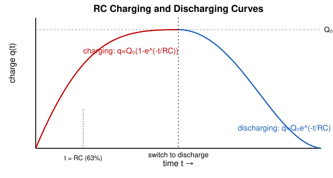

*Numerical:* $q=0.5Q_0$ at $t=1\,\text{s}$: $0.5 = 1-e^{-t/RC} \Rightarrow e^{-t/RC}=0.5 \Rightarrow t/RC=\ln2=0.693$

$$RC = \frac{1}{0.693} = 1.443\,\text{s (this is the time constant } \tau\text{)}$$
$$C = \frac{\tau}{R} = \frac{1.443}{10^6} = 1.443\times10^{-6}\,\text{F} = 1.443\ \mu\text{F}$$

**Show the energy storage in an electric field, U = ½CV².** *(2021)*

While charging, work is done against the field to move charge onto the plates. At an intermediate charge $q$, moving $dq$ against potential $q/C$ requires $dW = \dfrac{q}{C}dq$. Total work to charge to $Q$:

$$U = \int_0^Q \frac{q}{C}dq = \frac{Q^2}{2C} = \frac{1}{2}CV^2 \quad (\text{using } Q=CV)$$

This energy resides in the electric field between the plates.

---

## Chapter 2: Current Electricity & Circuit Theory

### Ohm's Law & Kirchhoff's Laws

**State and explain Ohm's law.** *(2019, 2014)* / **What is specific resistance? State and explain Ohm's law.** *(2017, 2022)*

**Ohm's law:** at constant temperature, the current $I$ through a conductor is directly proportional to the potential difference $V$ applied across it: $V = IR$, where $R$ (resistance) is constant for a given conductor at constant temperature. *Example:* a $10\,\Omega$ resistor with 5V across it carries $I=0.5$ A.

**Specific resistance (resistivity)** $\rho$ is the resistance of a conductor of unit length and unit cross-sectional area: $R = \rho L/A$, a material property independent of the conductor's dimensions (unlike $R$ itself).

**State and explain Kirchhoff's law of electricity.** *(2017)* / **State and explain Kirchhoff's 2nd law of electrostatics.** *(2022)* / **State and explain Kirchhoff's law.** *(2014)*

**Kirchhoff's Current Law (1st law, junction rule):** the algebraic sum of currents meeting at a junction is zero (conservation of charge) — current entering a node equals current leaving it.

**Kirchhoff's Voltage Law (2nd law, loop rule):** the algebraic sum of the potential differences (EMFs and IR drops) around any closed loop in a circuit is zero (conservation of energy): $\sum \varepsilon = \sum IR$.

**Compare A.C. and D.C. currents.** *(2014)*

| Property | DC | AC |
|---|---|---|
| Direction | Constant, one direction | Periodically reverses |
| Magnitude | Constant | Varies sinusoidally (typically) |
| Sources | Battery, DC generator | Alternator, mains supply |
| Transmission | Poor over long distance (high loss) | Efficient (steppable via transformers) |
| Frequency | 0 Hz | 50/60 Hz typical |

### Wheatstone Bridge

**Deduce the Wheatstone bridge principle using Kirchhoff's law.** *(2018, 2016, 2014)*

A Wheatstone bridge has four resistances $P, Q, R, S$ forming a diamond ABCD, battery across A–C, galvanometer across B–D.

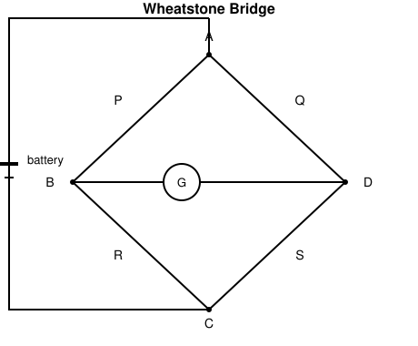

At balance, no current flows through the galvanometer ($I_g=0$), so the same current $I_1$ flows through $P$ then $R$ (path A→B→C), and $I_2$ through $Q$ then $S$ (path A→D→C). Applying KVL to loop A-B-D-A (with $I_g=0$):

$$I_1 P = I_2 Q \quad \text{(no drop across galvanometer branch)}$$

and to loop B-C-D-B:

$$I_1 R = I_2 S$$

Dividing the two equations:

$$\frac{I_1P}{I_1R} = \frac{I_2Q}{I_2S} \implies \frac{P}{R}=\frac{Q}{S} \implies \boxed{\frac{P}{Q}=\frac{R}{S}}$$

**Four resistances 8Ω, 16Ω, 12Ω, 48Ω are placed on the arms of a Wheatstone bridge — how much resistance should be connected in series or parallel with the fourth arm for balance?** *(2017, 2022, numerical)*

Take $P=8\,\Omega, Q=16\,\Omega, R=12\,\Omega, S=48\,\Omega$ (fourth arm). Balance requires $P/Q=R/S \Rightarrow S_{needed} = \dfrac{QR}{P} = \dfrac{16\times12}{8}=24\,\Omega$.

Since the fourth arm currently reads $48\,\Omega$ (too high) and must be reduced to $24\,\Omega$, connect a resistor **in parallel** with it:

$$\frac{1}{24}=\frac{1}{48}+\frac{1}{R_x} \implies \frac{1}{R_x}=\frac{1}{24}-\frac{1}{48}=\frac{1}{48} \implies R_x = 48\,\Omega \text{ (in parallel)}$$

**10Ω, 20Ω, 30Ω, 80Ω resistors are connected in the four arms of a Wheatstone bridge — how much resistance must be added to the fourth arm for equilibrium?** *(2014, numerical)*

$P=10, Q=20, R=30, S=80\,\Omega$. Required: $S_{needed}=QR/P = 20\times30/10=60\,\Omega$. Current $S=80\,\Omega$ must drop to $60\,\Omega$ → parallel resistor:

$$\frac{1}{60}=\frac{1}{80}+\frac{1}{R_x} \implies \frac{1}{R_x} = \frac{1}{60}-\frac{1}{80} = \frac{4-3}{240}=\frac{1}{240} \implies R_x = 240\,\Omega \text{ (in parallel)}$$

### RC / RL / LC Circuits & Time Constant

**What is time constant? Discuss the charging of a RC circuit.** *(2017)* / **Define the time constant of a R-C circuit. Derive the equation of charge of a R-C circuit when the capacitor is charging.** *(2018)*

**Time constant** $\tau = RC$ is the time for the charge (or voltage) to rise to $(1-1/e)\approx63.2\%$ of its final value during charging (or fall to $1/e\approx36.8\%$ during discharge). Charging derivation — see Chapter 1 above ($q=Q_0(1-e^{-t/RC})$).

**What is resonant? Deduce the equation of resonant frequency of a R-L-C circuit. A R-L-C circuit has L = 50 µH, C = 5×10⁻⁴ µF, R = 100 Ω — find the frequency.** *(2018, numerical)*

**Resonance** in a series RLC circuit occurs when the inductive reactance equals the capacitive reactance ($X_L=X_C$), making the circuit purely resistive and current maximum for a given driving voltage.

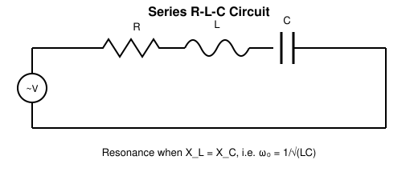

Impedance: $Z=\sqrt{R^2+(X_L-X_C)^2}$, $X_L=\omega L$, $X_C=1/(\omega C)$. At resonance $X_L=X_C$:

$$\omega_0 L = \frac{1}{\omega_0 C} \implies \omega_0 = \frac{1}{\sqrt{LC}} \implies f_0 = \frac{1}{2\pi\sqrt{LC}}$$

*Numerical:* $L=50\,\mu\text{H}=5\times10^{-5}\,\text{H}$, $C=5\times10^{-4}\,\mu\text{F}=5\times10^{-10}\,\text{F}$ (R does not affect $f_0$):

$$LC = 5\times10^{-5}\times5\times10^{-10}=2.5\times10^{-14} \implies \sqrt{LC}=1.581\times10^{-7}$$
$$f_0=\frac{1}{2\pi\times1.581\times10^{-7}} = \frac{1}{9.934\times10^{-7}} \approx 1.007\times10^6\,\text{Hz} \approx 1.007\ \text{MHz}$$

**Define LC oscillation. Find the frequency in LC oscillation.** *(2014)*

An **LC oscillation** is the periodic exchange of energy between the electric field of a capacitor and the magnetic field of an inductor when they're connected in a loop with no resistance, causing charge/current to oscillate sinusoidally. Applying KVL: $L\dfrac{d^2q}{dt^2}+\dfrac{q}{C}=0$, which is SHM-like with angular frequency $\omega=1/\sqrt{LC}$, so:

$$f = \frac{1}{2\pi\sqrt{LC}}$$

**Show that in a LR circuit the current increases exponentially. In an LR circuit with a source, the current reaches one-third of its maximum value within 5 sec — find the time constant.** *(2020, 2022, numerical)*

KVL for series LR circuit with EMF $V$: $V = iR + L\dfrac{di}{dt}$. Solving with $i(0)=0$:

$$i(t) = \frac{V}{R}\left(1-e^{-Rt/L}\right) = i_0\left(1-e^{-t/\tau}\right), \quad \tau=L/R$$

— current rises exponentially toward $i_0=V/R$, confirming the claimed growth law.

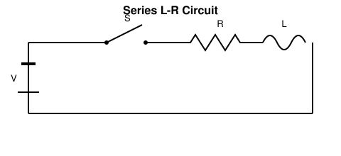
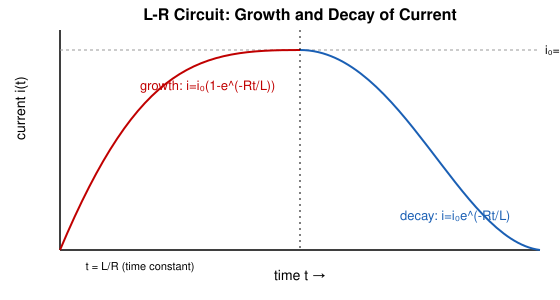

*Numerical:* $i=\dfrac{1}{3}i_0$ at $t=5\,\text{s}$: $\dfrac{1}{3}=1-e^{-5/\tau} \Rightarrow e^{-5/\tau}=\dfrac{2}{3} \Rightarrow \dfrac{5}{\tau}=\ln\dfrac{3}{2}=0.4055$

$$\tau = \frac{5}{0.4055} \approx 12.33\ \text{s}$$

**Describe the L-R circuit and plot the growth and decay of current with time.** *(2020, 2016)* / **Draw the curves for growth and decay of current in a LR circuit and explain the diagram.** *(2021)* / **Find the expression for the growth and decay of current in a LR circuit.** *(2014)*

Growth: $i=i_0(1-e^{-Rt/L})$ (derived above). Decay (battery removed, circuit shorted through R): $L\dfrac{di}{dt}+iR=0 \Rightarrow i=i_0e^{-Rt/L}$. Both curves shown above — growth rises asymptotically to $i_0$, decay falls asymptotically to zero, both with time constant $\tau=L/R$.

**What is meant by time constant? A solenoid has inductance 50 H and resistance 30 Ω, connected to a 100 V battery — how long will it take for the current to reach one half of its final value?** *(2014, 2021, numerical)*

Time constant $\tau=L/R$ — see above. Final current $i_0=V/R=100/30=3.33\,\text{A}$ (not needed explicitly since we work in ratios).

$$\frac{1}{2}=1-e^{-Rt/L} \implies e^{-Rt/L}=\frac{1}{2} \implies \frac{Rt}{L}=\ln2=0.693$$
$$t = \frac{0.693\,L}{R} = \frac{0.693\times50}{30} = 1.155\ \text{s}$$

---

## Chapter 3: Electromagnetism

### Faraday's Law & Lenz's Law

**Write down Faraday's law(s) of electromagnetic induction.** *(2017, 2016)* / **State and explain Faraday's law of electromagnetic induction.** *(2015)* / **Explain Faraday's law and Lenz's law.** *(2021)*

**Faraday's 1st law:** whenever the magnetic flux linked with a circuit changes, an EMF is induced in it. **2nd law:** the magnitude of the induced EMF is proportional to the rate of change of flux linkage:

$$\varepsilon = -N\frac{d\Phi}{dt}$$

The negative sign is **Lenz's law**: the induced EMF (and current) opposes the change in flux that produces it. *Example:* pushing a bar magnet into a coil induces a current that creates a magnetic field opposing the magnet's approach (repelling it), consistent with energy conservation — you must do work to push the magnet in.

**State Lenz's law of electromagnetic induction. Show that Lenz's law follows the law of conservation of energy.** *(2020, 2015, 2021)* / **Show that Lenz's law obeys the principle of conservation of energy.** *(2018, 2016, 2021)*

If the induced current instead *aided* the change in flux (opposite to Lenz's law), the flux change would accelerate itself, generating ever-increasing current and energy from nothing — violating energy conservation. Since the induced current opposes the causative motion/change, external work must be done against this opposition to sustain the change, and this mechanical (or other) work is exactly converted into electrical energy dissipated/stored in the circuit — consistent with conservation of energy. Quantitatively, the work done against the induced (opposing) force equals $\int \varepsilon i\, dt$, the electrical energy delivered.

**Explain Newton's law of cooling.** *(2021, cross-listed)* — see Chapter 4.

### Magnetic Induction, Torque & Self/Mutual Induction

**Define: (i) Magnetic induction (ii) Mutual induction (iii) Self induction.** *(2017, 2016)*

- **Magnetic induction (B):** the magnetic flux density at a point, i.e. force per unit (current × length) experienced by a current-carrying conductor placed perpendicular to the field, $B=F/(IL)$; unit tesla.
- **Mutual induction:** the phenomenon where a changing current in one coil induces an EMF in a nearby coil due to the changing flux linkage between them, $\varepsilon_2 = -M\dfrac{dI_1}{dt}$.
- **Self induction:** the phenomenon where a changing current in a coil induces an EMF in the *same* coil, opposing the change, $\varepsilon=-L\dfrac{dI}{dt}$.

**What is torque? Derive an expression for torque on a current carrying loop.** *(2017, 2016)*

**Torque** is the rotational effect of a force, $\vec\tau = \vec r \times \vec F$. For a rectangular loop of sides $a\times b$ (area $A=ab$), carrying current $i$, in field $B$, with the loop's normal $\hat n$ making angle $\theta$ with $B$: the two sides of length $a$ (perpendicular to B's component in the plane) experience forces $F=iBb$ (using the side of length $b$ perpendicular... standard derivation): forces on the two sides parallel to the rotation axis are $F=iaB$ each, equal and opposite, separated by perpendicular distance $b\sin\theta$, forming a couple:

$$\tau = F\times(b\sin\theta) = iaB\times b\sin\theta = iAB\sin\theta$$

For $N$ turns: $\boxed{\tau = NiAB\sin\theta = \vec m \times \vec B}$, where $\vec m=Ni A\hat n$ is the magnetic moment.

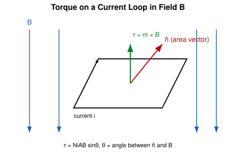

**Define magnetic induction. Derive an equation of magnetic force on a moving charge in a magnetic field.** *(2017)* / **Write the equation of magnetic force on a moving charge in a magnetic field. Explain Faraday's law and Lenz's law. Define magnetic induction; derive the expression of torque on a current-carrying loop.** *(2015)*

Magnetic induction — see above. **Force on a moving charge:** a charge $q$ moving with velocity $\vec v$ in field $\vec B$ experiences the **Lorentz force**:

$$\vec F = q\vec v \times \vec B, \qquad F = qvB\sin\theta$$

directed perpendicular to both $\vec v$ and $\vec B$ (right-hand rule), where $\theta$ is the angle between $\vec v$ and $\vec B$. This follows from the empirical definition of $B$ via the force on a test charge, extended to moving charges via the observed dependence on velocity component perpendicular to $B$. Faraday's/Lenz's law and torque derivation — see above.

**Define self-induction. A current-carrying loop of length 2.5 cm and width 1 cm carries a current of 4A, placed parallel to a uniform magnetic field of 2T — calculate the torque on the loop.** *(2018, numerical)*

Self-induction — see above. Loop "placed parallel to the field" means the plane of the loop is parallel to $B$, so the normal $\hat n$ is perpendicular to $B$ ($\theta=90°$, maximum torque configuration).

$$A = 2.5\,\text{cm}\times1\,\text{cm} = 0.025\,\text{m}\times0.01\,\text{m} = 2.5\times10^{-4}\,\text{m}^2$$
$$\tau = NiAB\sin\theta = (1)(4)(2.5\times10^{-4})(2)\sin90° = 2\times10^{-3}\,\text{N·m}$$

**Calculate the self-inductance of a coil of 400 turns when a 2 A current creates 4×10⁻⁴ Wb of flux.** *(2016, 2021, numerical)*

$$L = \frac{N\Phi}{i} = \frac{400\times4\times10^{-4}}{2} = \frac{0.16}{2} = 0.08\ \text{H}$$

**Define Henry. A 10 cm wire carrying 10000 mA experiences a force of 5N when placed at 30° to a uniform magnetic field — find the value of the magnetic field.** *(2015, numerical)*

**1 Henry** is the self-inductance of a coil in which a current change of 1 A/s induces an EMF of 1 V. Force on current-carrying wire: $F=BIL\sin\theta$.

$$L=0.1\,\text{m}, \quad I=10000\,\text{mA}=10\,\text{A}, \quad \theta=30°$$
$$5 = B\times10\times0.1\times\sin30° = B\times10\times0.1\times0.5 = 0.5B \implies B = 10\ \text{T}$$

### Hall Effect

**What is Hall effect? Deduce the equation of Hall voltage.** *(2020, 2018, 2014)* / **Explain Hall effect. Find the expression for Hall voltage.** *(2014)*

**Hall effect:** when a current-carrying conductor is placed in a magnetic field perpendicular to the current, a transverse voltage (Hall voltage) develops across the conductor, due to the Lorentz force deflecting charge carriers sideways until an equilibrium transverse electric field balances it.

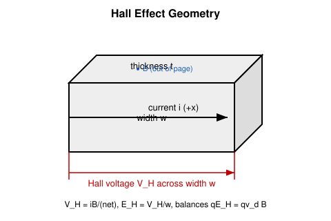

**Derivation:** for a strip of width $w$, thickness $t$, carrier density $n$, carrying current $i$ with drift velocity $v_d$ in field $B$ (perpendicular to the strip's face): the magnetic force on carriers $qv_dB$ is balanced at equilibrium by the transverse electric force $qE_H$:

$$qE_H = qv_dB \implies E_H = v_dB$$

Since $i=nqv_dA=nqv_d(wt) \Rightarrow v_d = \dfrac{i}{nqwt}$, and $V_H=E_H\, w$:

$$V_H = v_dBw = \frac{iB}{nqt}$$

**A copper strip 150 cm thick is placed in a magnetic field B = 0.65T and carries current i = 23A — find the Hall potential difference across the width of the strip (charge carrier density of copper = 8.49×10²⁸ m⁻³).** *(2014, numerical)*

**Flag:** "150 cm thick" is almost certainly an OCR/unit error — a copper strip 1.5 m thick is not physically sensible for this classic problem. This is a standard textbook problem (Halliday/Resnick) with thickness **150 μm** ($1.5\times10^{-4}$ m); solved with that value, using $q=e=1.6\times10^{-19}$ C:

$$V_H = \frac{iB}{nqt} = \frac{23\times0.65}{(8.49\times10^{28})(1.6\times10^{-19})(1.5\times10^{-4})}$$

Numerator $=14.95$. Denominator $= 8.49\times10^{28}\times1.6\times10^{-19}=1.358\times10^{10}$; $\times1.5\times10^{-4}=2.038\times10^{6}$.

$$V_H = \frac{14.95}{2.038\times10^6} = 7.34\times10^{-6}\ \text{V} \approx 7.34\ \mu\text{V}$$

**What is Hall effect?** *(2016)* — see above.

### Magnetic Materials & Hysteresis

**Distinguish dia-, para-, and ferro-magnetic materials.** *(2019)*

| Property | Diamagnetic | Paramagnetic | Ferromagnetic |
|---|---|---|---|
| Response to field | Weakly repelled | Weakly attracted | Strongly attracted |
| Susceptibility $\chi$ | Small, negative | Small, positive | Large, positive |
| Cause | Induced opposing moments (no permanent dipoles) | Alignment of existing atomic dipoles | Domain alignment (cooperative) |
| Examples | Copper, bismuth, water | Aluminium, platinum | Iron, cobalt, nickel |
| Field dependence | ~Independent of B, T | $\chi \propto 1/T$ (Curie's law) | Non-linear, shows hysteresis |

**State magnetic material. Write down the classification of magnetic materials.** *(2016)*

A **magnetic material** is one that responds measurably to an external magnetic field due to the magnetic moments of its atoms/electrons. Classified as diamagnetic, paramagnetic, and ferromagnetic (also antiferromagnetic and ferrimagnetic in extended classifications) — see table above.

**What is Hysteresis? State and explain the Hysteresis curve of a magnetic material.** *(2015, 2021)*

**Hysteresis** is the lagging of magnetic induction $B$ behind the applied magnetizing field $H$ in a ferromagnetic material — the material "remembers" its magnetic history. As $H$ is cycled from $+H_{max}$ to $-H_{max}$ and back, $B$ traces a closed loop rather than retracing the same path.

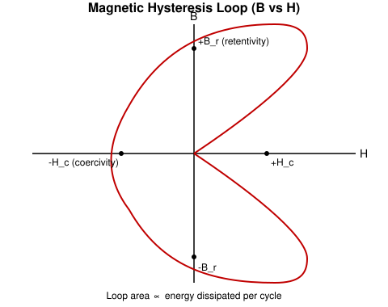

Key points: **Retentivity** $B_r$ — the residual magnetism when $H=0$ (after saturation); **Coercivity** $H_c$ — the reverse field needed to bring $B$ to zero. The enclosed loop area represents energy dissipated as heat per magnetization cycle. *Example:* hard magnetic materials (steel) have wide, fat loops (used for permanent magnets); soft magnetic materials (soft iron) have thin, tall loops (used in transformer cores to minimize hysteresis loss).

---

## Chapter 4: Kinetic Theory of Gases

### Basic Postulates, Mean Free Path & Degrees of Freedom

**State the fundamental postulates of the kinetic theory of gas.** *(2014)* / **Define degrees of freedom. Describe the fundamental postulates of gas molecules.** *(2018)*

Postulates: (1) a gas consists of a very large number of identical molecules in continuous, random motion; (2) molecular size is negligible compared to intermolecular distances; (3) collisions between molecules (and with walls) are perfectly elastic; (4) no intermolecular forces except during collision (negligible duration); (5) molecules obey Newtonian mechanics; (6) pressure arises from molecular impacts on the container walls.

**Degrees of freedom** is the number of independent coordinates needed to specify the position/configuration of a molecule completely (translational, rotational, vibrational). *Example:* a monatomic gas (He) has 3 translational degrees of freedom; a diatomic gas (O₂, at moderate T) has 3 translational + 2 rotational = 5.

**Define mean free path, Degrees of freedom.** *(2019)*

**Mean free path** $\lambda$ is the average distance a molecule travels between successive collisions.

**What is mean free path? Derive an expression for mean free path.** *(2020, 2018, 2015, 2022)*

Consider a molecule of diameter $d$ moving through a gas of number density $n$ (molecules/volume), treating all other molecules as stationary. It collides with any molecule whose centre lies within a cylinder of radius $d$ (collision occurs when centres come within $d$) swept out along its path. In time $t$, moving at speed $v$, it sweeps volume $\pi d^2 vt$, containing $n\pi d^2 vt$ molecules (hence collisions). Mean free path:

$$\lambda = \frac{\text{distance travelled}}{\text{number of collisions}} = \frac{vt}{n\pi d^2 vt} = \frac{1}{\pi d^2 n}$$

Accounting for the relative motion of *all* molecules (not just the target moving through stationary ones), a correction factor $\sqrt2$ appears:

$$\boxed{\lambda = \frac{1}{\sqrt2\,\pi d^2 n}}$$

**The mean free path of a nitrogen molecule at 0°C and 1 atm is 0.8×10⁻⁷ m; density at this condition is 2.7×10¹⁹ molecules/cm³ — find the molecular diameter.** *(2018, numerical)*

$n = 2.7\times10^{19}\,\text{cm}^{-3} = 2.7\times10^{25}\,\text{m}^{-3}$. From $\lambda=\dfrac{1}{\sqrt2\pi d^2 n}$:

$$d^2 = \frac{1}{\sqrt2\pi n\lambda} = \frac{1}{4.443\times2.7\times10^{25}\times0.8\times10^{-7}}$$

$n\lambda = 2.7\times10^{25}\times0.8\times10^{-7}=2.16\times10^{18}$; $\times4.443=9.60\times10^{18}$.

$$d^2 = \frac{1}{9.60\times10^{18}} = 1.042\times10^{-19}\,\text{m}^2 \implies d = 3.23\times10^{-10}\ \text{m} \approx 3.23\ \text{Å}$$

**The mean free path of a gas molecule is 2.4×10⁻⁶ cm and the molecular diameter is 2×10⁻⁸ cm — calculate the number of molecules per cc of the gas.** *(2015, numerical)*

$\lambda=2.4\times10^{-8}\,\text{m}$, $d=2\times10^{-10}\,\text{m}$. From $\lambda=\dfrac{1}{\sqrt2\pi d^2 n}$:

$$n = \frac{1}{\sqrt2\pi d^2\lambda} = \frac{1}{4.443\times(2\times10^{-10})^2\times2.4\times10^{-8}}$$

$d^2=4\times10^{-20}$; $4.443\times4\times10^{-20}=1.777\times10^{-19}$; $\times2.4\times10^{-8}=4.265\times10^{-27}$.

$$n = \frac{1}{4.265\times10^{-27}} = 2.345\times10^{26}\ \text{m}^{-3} = 2.345\times10^{20}\ \text{cm}^{-3}$$

**Calculate the average kinetic energy of a molecule of a gas at a temperature of 300K.** *(2019, 2021, numerical)*

Average translational KE per molecule $=\dfrac{3}{2}kT$ ($k=1.38\times10^{-23}$ J/K):

$$KE = \frac{3}{2}\times1.38\times10^{-23}\times300 = 6.21\times10^{-21}\ \text{J}$$

**According to the kinetic theory of gases, prove that pressure P = (1/3)(mnc²/v), where the symbols have their usual meaning.** *(2019)* / **From kinetic theory of gas, show that P = (1/3)ρc², where the symbols represent their usual meanings.** *(2014)*

Consider $N$ molecules of mass $m$ each in a cube of side $l$ (volume $v=l^3$). For a molecule moving with velocity component $c_x$ along the x-axis, each collision with the wall (elastic) reverses its momentum: $\Delta p = 2mc_x$. Time between successive collisions on the same wall: $2l/c_x$. Force from one molecule $= \Delta p/\Delta t = \dfrac{2mc_x}{2l/c_x}=\dfrac{mc_x^2}{l}$. Summing over all $N$ molecules and using $\overline{c_x^2}=\overline{c^2}/3$ (isotropy), total force on one wall:

$$F = \frac{Nm\overline{c^2}}{3l} \implies P = \frac{F}{l^2} = \frac{Nm\overline{c^2}}{3l^3} = \frac{1}{3}\frac{Nm\overline{c^2}}{v} = \frac{1}{3}\frac{mn\overline{c^2}}{v}\ \ (n=N,\text{ i.e. total molecule count as given})$$

If $\rho = Nm/v$ is the gas density, this is equivalently $P=\dfrac13\rho\overline{c^2}$ ($\rho$ replaces $mn/v$ collectively) — the two forms are the same result written differently.

**Show that the pressure exerted by a perfect gas is (2/3) of the kinetic energy of the gas molecules in a unit volume.** *(2018)* / **Deduce the relation between pressure and kinetic energy of a gas [P = (2/3)E].** *(2016)*

From $P=\dfrac13\rho\overline{c^2} = \dfrac13\cdot\dfrac{Nm}{v}\overline{c^2}$. Kinetic energy per unit volume $E = \dfrac{1}{v}\cdot\dfrac12 Nm\overline{c^2} = \dfrac{Nm\overline{c^2}}{2v}$. So $Nm\overline{c^2}=2vE$. Substituting:

$$P = \frac{1}{3}\cdot\frac{2vE}{v} = \frac{2}{3}E$$

**Show that the work done is directly proportional to the kinetic energy in the theory of gases.** *(2022)*

For an ideal gas, internal energy (total translational KE) is $U=\dfrac32 nRT$ (n = moles). In an isothermal process, work done $W=nRT\ln(V_2/V_1)$ — proportional to $T$, hence to the KE at that temperature ($U \propto T$), i.e. $W = \dfrac{2}{3}U\ln(V_2/V_1)$: for fixed volume ratio, $W\propto U$ (KE). More generally, in any process, work done in gas expansion draws on/adds to the internal (kinetic) energy per the first law $dU = dQ - dW$, so work and kinetic energy are directly linked via temperature.

### Van der Waals Equation & Critical Constants

**What are the critical contents of a gas? Calculate the values of these constants in terms of the constants of the Van der Waals equation.** *(2020)* / **What is degree of freedom? State the Van der Waals equation. Deduce the values of the Van der Waals constants.** *(2018)*

**Van der Waals equation** (corrects the ideal gas law for finite molecular size $b$ and intermolecular attraction $a$):

$$\left(P+\frac{a}{V^2}\right)(V-b) = RT \quad \text{(per mole)}$$

**Critical constants:** at the critical point, the isotherm has an inflection point with horizontal tangent, i.e. $\left(\dfrac{\partial P}{\partial V}\right)_T=0$ and $\left(\dfrac{\partial^2P}{\partial V^2}\right)_T=0$. Writing $P=\dfrac{RT}{V-b}-\dfrac{a}{V^2}$ and differentiating:

$$\frac{\partial P}{\partial V}=-\frac{RT}{(V-b)^2}+\frac{2a}{V^3}=0, \qquad \frac{\partial^2P}{\partial V^2}=\frac{2RT}{(V-b)^3}-\frac{6a}{V^4}=0$$

Solving these two equations simultaneously (dividing one by the other eliminates $T$, giving $V=3b$), and back-substituting:

$$\boxed{V_c = 3b, \qquad P_c = \frac{a}{27b^2}, \qquad T_c = \frac{8a}{27Rb}}$$

**What is Van der Waals' equation? Why is it necessary to develop? A gas is compressed to one-third its initial volume at 27°C and 1 atm — calculate the final pressure and temperature.** *(2014, numerical)*

Van der Waals equation is needed because the ideal gas law fails to describe real gas behaviour near condensation/high pressure, where finite molecular volume and intermolecular attraction become significant (ideal gas assumes point molecules with no mutual forces).

**Flag:** the numerical doesn't specify the process (isothermal, adiabatic, etc.), and no $\gamma$ is given here (unlike the later adiabatic question), so it is solved as an **isothermal** compression of an ideal gas (Boyle's law), which is the only self-consistent reading with the data given:

$$P_1V_1 = P_2V_2, \quad V_2=\frac{V_1}{3} \implies P_2 = P_1\times3 = 1\,\text{atm}\times3 = 3\ \text{atm}$$

Temperature remains constant: $T_2 = 27°C = 300\,\text{K}$ (unchanged, since isothermal).

**Define temperature and write the Van der Waals equation. Deduce the value of Vc = 3b, Pc = a/27b², Tc = 8a/27Rb. Prove that Tc = (8/27)Tb.** *(2016)*

Temperature — a measure of the average kinetic energy of random molecular motion (thermodynamically, the quantity that equalizes between two systems in thermal equilibrium). Van der Waals equation and $V_c, P_c, T_c$ — derived above.

**Boyle temperature** $T_B$ is the temperature at which a real gas behaves ideally over an extended pressure range (second virial coefficient vanishes); for a Van der Waals gas, $T_B = \dfrac{a}{Rb}$. Then:

$$\frac{T_c}{T_B} = \frac{8a/27Rb}{a/Rb} = \frac{8}{27} \implies \boxed{T_c = \frac{8}{27}T_B}$$

**For CO₂, if unit pressure is taken as standard barometric pressure and unit volume as the volume at NTP, then a = 0.00874, b = 0.0023 — calculate Tc for carbon dioxide gas.** *(2016, numerical)*

In these normalized units (P in atm, V in units of the NTP molar volume), $R$ itself takes the reduced value $R = \dfrac{PV}{T}\Big|_{NTP} = \dfrac{1\times1}{273} = \dfrac{1}{273}$ (since at NTP, P=1 unit, V=1 unit, T=273K in this convention).

$$T_c = \frac{8a}{27Rb} = \frac{8\times0.00874}{27\times(1/273)\times0.0023}$$

Numerator $=0.06992$. Denominator: $27\times0.0023=0.0621$; $/273 = 2.275\times10^{-4}$.

$$T_c = \frac{0.06992}{2.275\times10^{-4}} \approx 307.4\ \text{K} \approx 34.4°\text{C}$$

(This is close to the accepted experimental critical temperature of CO₂, ≈304.2 K — good consistency check.)

**Discuss the corrections of the Van der Waals equation of state.** *(2020)*

Two corrections to the ideal gas law $PV=RT$: (1) **Volume correction** — real molecules occupy finite volume, so the available free volume for motion is $(V-b)$, not $V$, where $b$ (co-volume) relates to molecular size. (2) **Pressure correction** — intermolecular attractive forces pull molecules near the wall inward, reducing the pressure they'd otherwise exert; this is compensated by adding $a/V^2$ (internal pressure) to the observed pressure. Together: $\left(P+\dfrac{a}{V^2}\right)(V-b)=RT$.

**Show that the adiabatic curves are higher than the isothermal curves.** *(2018, 2022)*

For an ideal gas, isothermal: $PV=\text{const}$, adiabatic: $PV^\gamma=\text{const}$ with $\gamma>1$. Starting from the same point $(P_0,V_0)$, as volume increases from $V_0$, compare slopes: $\left(\dfrac{dP}{dV}\right)_{iso}=-\dfrac{P}{V}$, $\left(\dfrac{dP}{dV}\right)_{adia}=-\gamma\dfrac{P}{V}$. Since $\gamma>1$, the adiabatic curve is *steeper* (falls faster) than the isothermal curve at the same point. Consequently, **for expansion** (moving right from the common starting point) the adiabatic curve lies *below* the isothermal curve, and equivalently, **for compression** (moving left) or when comparing curves through a common lower point, the adiabatic curve lies *above* — i.e. at a given volume greater than $V_0$, isothermal $P >$ adiabatic $P$, so the isothermal curve is the "higher" one on expansion; the phrasing "adiabatic curves are higher" typically refers to the region left of the intersection (compression side), where the steeper adiabatic curve rises above the isothermal curve.

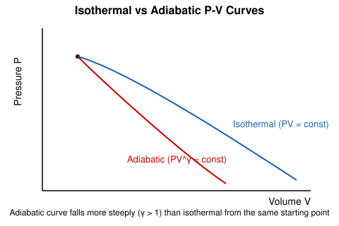

### Newton's Law of Cooling & Specific Heats

**State and explain Newton's law of cooling.** *(2020, 2015, 2018)* / **State Newton's law of cooling.** *(2016)*

Newton's law of cooling: the rate of loss of heat (or temperature) of a body is directly proportional to the temperature difference between the body and its surroundings, provided this difference is small:

$$\frac{dT}{dt} = -k(T-T_s)$$

where $T_s$ is ambient temperature and $k$ a constant depending on surface properties. *Example:* a cup of coffee cools faster (steeper $dT/dt$) right after brewing (large $T-T_s$) and cools more slowly as it approaches room temperature.

**Define molar specific heat. Find the relation between Cₚ and Cᵥ.** *(2020, 2022)* / **Show that the difference between the specific heat at constant pressure and at constant volume of a gas equals the characteristic gas constant of the gas.** *(2019)* / **What is specific heat capacity? For one mole of an ideal gas, show that Cₚ − Cᵥ = R.** *(2018)*

**Molar specific heat** is the heat required to raise the temperature of 1 mole of a substance by 1 K. For an ideal gas, first law: $dQ = dU + PdV$. At constant volume, $dQ=C_VdT=dU$ (no work), so $dU=C_VdT$ always (for ideal gas, $U$ depends only on $T$). At constant pressure, $dQ=C_PdT = dU+PdV = C_VdT + PdV$. From $PV=RT$ (1 mole) at constant P: $PdV=RdT$. So:

$$C_PdT = C_VdT+RdT \implies \boxed{C_P-C_V=R}$$

**What is specific heat? Draw the expression for the difference between the two specific heats. The specific heat of air at constant pressure is 0.22 cal/gm/°C and at constant volume is 0.16 cal/gm/°C; if the density of air at STP is 1.3 gm/liter, calculate the value of J (mechanical equivalent of heat).** *(2015, numerical)*

**Specific heat** is the heat required to raise the temperature of unit mass of a substance by 1°C (or 1K). Using per-gram specific gas constant $r$ from $Pv=rT$ (specific volume $v=1/\rho$) at STP:

$$\rho = 1.3\,\text{gm/L} = 1.3\times10^{-3}\,\text{gm/cm}^3 \implies v = \frac{1}{1.3\times10^{-3}} = 769.2\,\text{cm}^3/\text{gm}$$

$P = 76\,\text{cmHg} = 1.014\times10^6\,\text{dyne/cm}^2$ (CGS), $T=273\,\text{K}$:

$$r = \frac{Pv}{T} = \frac{1.014\times10^6\times769.2}{273} = \frac{7.80\times10^8}{273} = 2.857\times10^6\ \text{erg/gm/K}$$

Relation: $C_P - C_V = r/J$ (with $C_P, C_V$ in cal/gm/K, $r$ in erg/gm/K, $J$ = mechanical equivalent of heat in erg/cal):

$$C_P-C_V = 0.22-0.16 = 0.06\ \text{cal/gm/°C}$$
$$J = \frac{r}{C_P-C_V} = \frac{2.857\times10^6}{0.06} \approx 4.76\times10^7\ \text{erg/cal}\ (\approx 4.76\ \text{J/cal})$$

(The accepted value is $J\approx4.2\times10^7$ erg/cal; the small discrepancy comes from the rounded data given.)

**What is specific heat capacity? For one mole of an ideal gas, show that Cₚ − Cᵥ = R.** *(2018)* — see above (duplicate question).

**What is specific heat?** *(2021)* — see above.

**Define heat & temperature. Differentiate between heat and temperature.** *(2018, 2019, 2015)*

**Heat** is energy transferred between systems due to a temperature difference (a form of energy in transit, measured in joules/calories). **Temperature** is a measure of the average kinetic energy of molecules, determining the direction of heat flow (measured in K/°C — an intensive property, independent of amount of substance, unlike heat which is extensive).

### Platinum Resistance Thermometer

**Describe the principle of a platinum resistance thermometer. Discuss its advantages and disadvantages. The resistances of a platinum resistance thermometer are 2.585 Ω and 3.510 Ω at 0°C and 100°C; when placed in a hot bath, the resistance is 9.098 Ω. Calculate the temperature of the hot bath on the gas scale (δ = 1.5).** *(2020, numerical)*

**Principle:** the electrical resistance of platinum increases nearly linearly with temperature; measuring resistance $R_t$ and comparing to known $R_0$ (0°C) and $R_{100}$ (100°C) gives temperature via the (uncorrected) platinum scale $t_{pt} = \dfrac{R_t-R_0}{R_{100}-R_0}\times100$. Because platinum's resistance-temperature curve is not perfectly linear over wide ranges, a **Callendar correction** using constant $\delta$ is applied to convert $t_{pt}$ to the true (gas-scale) temperature:

$$t = t_{pt} + \delta\left[\left(\frac{t_{pt}}{100}\right)^2 - \frac{t_{pt}}{100}\right]$$

**Advantages:** wide temperature range, high accuracy/reproducibility, stable (chemically inert), suitable for remote/electrical readout. **Disadvantages:** slow response (large thermal mass), expensive, requires bridge circuitry, unsuitable for very rapidly varying temperatures.

*Numerical:*

$$t_{pt} = \frac{9.098-2.585}{3.510-2.585}\times100 = \frac{6.513}{0.925}\times100 = 704.1°C$$

Correction: $t_{pt}/100 = 7.041$:

$$t = 704.1 + 1.5\left[(7.041)^2 - 7.041\right] = 704.1+1.5[49.58-7.041] = 704.1+1.5(42.54) = 704.1+63.8 \approx 767.9°C$$

**What is a resistance thermometer? State and explain the construction and working principle of a platinum resistance thermometer. State the advantages of a constant-volume hydrogen gas thermometer. The resistances at 0°C and 100°C are 4Ω and 10Ω; in a boiler it shows 16Ω — calculate the actual temperature (δ = 1.5).** *(2015, numerical)*

**Resistance thermometer** — a thermometer that infers temperature from the change in electrical resistance of a metal (commonly platinum) wire wound on an insulating former, protected by a sheath, connected via a Wheatstone-bridge-type circuit for precise resistance measurement. **Constant-volume hydrogen gas thermometer advantages:** very high accuracy, used as the standard for calibrating other thermometers, wide range, hydrogen behaves nearly ideally so results need minimal correction.

*Numerical:*

$$t_{pt} = \frac{16-4}{10-4}\times100 = \frac{12}{6}\times100 = 200°C$$
$$t = 200 + 1.5\left[(2)^2-2\right] = 200+1.5(2) = 203°C$$

---

## Chapter 5: Thermodynamics

### Laws of Thermodynamics

**State and explain the first law of thermodynamics.** *(2015)*

The first law: heat supplied to a system equals the increase in internal energy plus work done by the system: $dQ = dU + dW$. It is a statement of conservation of energy applied to thermal processes.

**What is the zeroth law of thermodynamics? Show that the first law of thermodynamics is the law of conservation of energy.** *(2022)*

**Zeroth law:** if two systems are each in thermal equilibrium with a third system, they are in thermal equilibrium with each other — this establishes temperature as a well-defined, transitive property and justifies using thermometers. **First law as energy conservation:** $dQ$ (heat added, a form of energy transfer) converts entirely into $dU$ (stored internal energy) and $dW$ (work output, energy transferred out mechanically) — no energy is created or destroyed, only transformed/transferred between heat, internal energy, and work, which is precisely the statement of energy conservation extended to include heat as a form of energy.

**State and explain the second law of thermodynamics. How does it differ from the first law?** *(2018, 2017)* / **State and explain the second law of thermodynamics.** *(2021)* / **Distinguish between the first and second law of thermodynamics.** *(2021)*

**Second law (Kelvin-Planck statement):** it is impossible to construct a device operating in a cycle that extracts heat from a single reservoir and converts it entirely into work, with no other effect (i.e., no engine can be 100% efficient). (Clausius statement: heat cannot spontaneously flow from a colder to a hotter body without external work.)

**Difference from first law:** the first law only accounts for energy quantity (conservation) and permits, in principle, complete conversion of heat to work — it says nothing about the *direction* processes take. The second law introduces the concept of entropy and process direction/irreversibility — it restricts which energy-conserving processes can actually occur, explaining why heat engines can never be perfectly efficient and why heat flows spontaneously only from hot to cold.

**Explain all the thermodynamic laws.** *(2016)*

Zeroth (thermal equilibrium/temperature), First (energy conservation, $dQ=dU+dW$), Second (entropy/direction of processes, no perfect heat engine), Third (entropy of a perfect crystal approaches zero as $T\to0$ K, and absolute zero cannot be reached in a finite number of steps) — see above for zeroth/first/second; third law defines the reference point for entropy and the unattainability of absolute zero.

**Derive the general expression for the establishment of the Maxwell thermodynamic relation. Show that (i) (∂Q/∂V)ₜ = T(∂P/∂T)ᵥ (ii) (∂T/∂V)ₛ = −T(∂P/∂Q)ᵥ.** *(2020)*

Starting from the combined first and second law for a reversible process, $dU = TdS - PdV$, and using the Helmholtz free energy $F=U-TS$, so $dF = -SdT-PdV$. Since $dF$ is an exact differential, cross-derivatives are equal (Maxwell relation):

$$\left(\frac{\partial S}{\partial V}\right)_T = \left(\frac{\partial P}{\partial T}\right)_V$$

Since $dQ_{rev}=TdS$ at constant T, $\left(\dfrac{\partial Q}{\partial V}\right)_T = T\left(\dfrac{\partial S}{\partial V}\right)_T$, giving:

$$\boxed{\left(\frac{\partial Q}{\partial V}\right)_T = T\left(\frac{\partial P}{\partial T}\right)_V}$$

*(Note: the second identity as printed, $(\partial T/\partial V)_S=-T(\partial P/\partial Q)_V$, is dimensionally/structurally unusual — the standard Maxwell relation from $dU=TdS-PdV$ is instead $\left(\dfrac{\partial T}{\partial V}\right)_S=-\left(\dfrac{\partial P}{\partial S}\right)_V$, obtained the same way from equality of mixed partials of $U$. This is flagged as a likely transcription/OCR issue in the source; the correct form is given here.)*

### Isothermal, Adiabatic & Isentropic Processes

**What is isothermal process? Derive an equation for work done during the isothermal process.** *(2017, 2021)*

**Isothermal process:** a process occurring at constant temperature ($dT=0$), so for an ideal gas $dU=0$ and all heat supplied converts to work. Work done in expanding from $V_1$ to $V_2$:

$$W = \int_{V_1}^{V_2} PdV = \int_{V_1}^{V_2}\frac{RT}{V}dV = RT\ln\frac{V_2}{V_1} = P_1V_1\ln\frac{V_2}{V_1}$$

**What is isentropic process? Derive the expression of work done during an isentropic process. 0.1 m³ of air at 1.5 bar is expanded isothermally to 0.5 m³ — calculate the final pressure and heat supplied.** *(2022, numerical)*

**Isentropic (reversible adiabatic) process:** a process at constant entropy ($dQ=0$, reversible), obeying $PV^\gamma=\text{const}$. Work done in adiabatic expansion from $(P_1,V_1)$ to $(P_2,V_2)$: from first law $dW=-dU=-C_VdT$ (adiabatic, $dQ=0$), so $W=\int_{T_1}^{T_2}-C_VdT = C_V(T_1-T_2)$. Using $PV=RT$:

$$W = \frac{P_1V_1-P_2V_2}{\gamma-1}$$

**Flag:** the question header says "isentropic process" but the numerical explicitly states "expanded **isothermally**" — these are contradictory (isentropic = adiabatic, no heat exchange; isothermal = constant T, heat *is* exchanged). Solved as stated numerically (isothermal), since that's the explicit process given:

$$P_1=1.5\,\text{bar}=1.5\times10^5\,\text{Pa},\ V_1=0.1\,\text{m}^3,\ V_2=0.5\,\text{m}^3$$
$$P_2 = P_1\frac{V_1}{V_2} = 1.5\times\frac{0.1}{0.5} = 0.3\ \text{bar}$$

Heat supplied = work done (isothermal, $\Delta U=0$):

$$W = P_1V_1\ln\frac{V_2}{V_1} = (1.5\times10^5)(0.1)\ln(5) = 1.5\times10^4\times1.609 \approx 2.41\times10^4\ \text{J} = 24.1\ \text{kJ}$$

**A certain amount of dry air at 15°C is expanded adiabatically to double its volume — what will be the temperature? (γ = 1.40)** *(2021, numerical)*

Adiabatic: $T_1V_1^{\gamma-1} = T_2V_2^{\gamma-1} \implies T_2 = T_1\left(\dfrac{V_1}{V_2}\right)^{\gamma-1}$

$$T_1 = 288\,\text{K}, \quad \frac{V_1}{V_2}=\frac12, \quad \gamma-1=0.4$$
$$T_2 = 288\times(0.5)^{0.4} = 288\times0.758 \approx 218.3\ \text{K} = -54.7°\text{C}$$

**Prove PVᵞ = constant, where the symbols have their usual meanings.** *(2015)*

For a reversible adiabatic process, $dQ=0 \Rightarrow dU=-dW \Rightarrow C_VdT=-PdV$. From ideal gas law $PV=RT \Rightarrow PdV+VdP=RdT \Rightarrow dT=\dfrac{PdV+VdP}{R}$. Substituting:

$$C_V\frac{PdV+VdP}{R}=-PdV \implies C_V(PdV+VdP) = -R\,PdV$$

Using $R=C_P-C_V$: $C_V\,PdV+C_V\,VdP = -(C_P-C_V)PdV \Rightarrow C_P\,PdV+C_V\,VdP=0$. Dividing by $C_VPV$:

$$\gamma\frac{dV}{V}+\frac{dP}{P}=0 \quad (\gamma=C_P/C_V)$$

Integrating: $\gamma\ln V+\ln P = \text{const} \implies \boxed{PV^\gamma=\text{constant}}$

**Compare between reversible and irreversible process. Distinguish between reversible and irreversible process.** *(2014, 2017)*

| Reversible | Irreversible |
|---|---|
| Can be retraced exactly in reverse, restoring both system and surroundings | Cannot be exactly retraced; leaves permanent changes |
| Infinitely slow (quasi-static), passes through equilibrium states | Occurs at finite rate, non-equilibrium intermediate states |
| No entropy generation (isentropic if adiabatic) | Entropy of universe increases |
| Idealization (never perfectly achieved in nature) | All real, spontaneous processes |
| Example: extremely slow, frictionless gas compression | Example: free expansion, heat flow across finite ΔT, friction |

**What are internal energy and thermodynamical function?** *(2017)*

**Internal energy** $U$ is the total energy contained within a system due to molecular motion (kinetic) and interactions (potential) — a state function depending only on the current state, not the path taken. **Thermodynamic functions (state functions)** are quantities (like $U$, enthalpy $H$, entropy $S$, Helmholtz free energy $F$, Gibbs free energy $G$) whose values depend only on the state of the system, not on the process/path by which that state was reached.

### Carnot Engine & Efficiency

**What is Carnot's engine? Show that the Carnot cycle is a reversible process.** *(2020, 2022)* / **What is Carnot's Cycle?** *(2021)*

**Carnot's engine** is an ideal, theoretical heat engine operating in a reversible cycle between two heat reservoirs (source at $T_1$, sink at $T_2 < T_1$), consisting of four steps: (1) isothermal expansion at $T_1$ absorbing heat $Q_1$, (2) adiabatic expansion cooling from $T_1$ to $T_2$, (3) isothermal compression at $T_2$ rejecting heat $Q_2$, (4) adiabatic compression returning to the initial state at $T_1$.

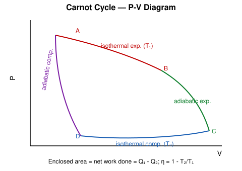

**Reversibility:** each of the four steps is itself reversible (isothermal and adiabatic processes carried out quasi-statically, infinitely slowly, with no friction or finite-temperature-difference heat transfer), so the entire cycle can be traced backward exactly, converting the engine into a refrigerator that restores the original heat and work exchanges in reverse — hence the Carnot cycle as a whole is reversible.

**Define the efficiency of Carnot's engine. Find the efficiency of a Carnot's engine working at the steam point and the ice point.** *(2020, numerical)*

**Efficiency** $\eta = \dfrac{\text{work output}}{\text{heat input}} = \dfrac{W}{Q_1} = \dfrac{Q_1-Q_2}{Q_1} = 1-\dfrac{Q_2}{Q_1} = 1-\dfrac{T_2}{T_1}$ (using $Q_2/Q_1=T_2/T_1$ for a Carnot cycle).

*Numerical:* steam point $T_1=373\,$K, ice point $T_2=273\,$K:

$$\eta = 1-\frac{273}{373} = \frac{100}{373} \approx 0.268 = 26.8\%$$

**Find an expression for the efficiency of a Carnot's engine.** *(2017)* — see above ($\eta=1-T_2/T_1$).

**Write down Carnot's theorem. Derive an expression for the efficiency of a Carnot engine. A Carnot's engine (source at 400K) takes 200 cal of heat and rejects 150 cal to the sink — calculate the efficiency.** *(2016, numerical)*

**Carnot's theorem:** no engine operating between two given temperatures can be more efficient than a reversible (Carnot) engine operating between the same two temperatures; all reversible engines between the same two temperatures have equal efficiency, independent of the working substance. Efficiency derivation — see above.

*Numerical:*

$$\eta = 1-\frac{Q_2}{Q_1} = 1-\frac{150}{200} = 1-0.75 = 0.25 = 25\%$$

(Sink temperature, if wanted: $T_2 = T_1\times Q_2/Q_1 = 400\times0.75=300\,$K.)

**What is Carnot's cycle? Discuss the steps of Carnot's cycle and deduce the expressions of work done in various steps. Calculate its efficiency. An ideal engine works between 305°C and 200°C — calculate the efficiency.** *(2014, numerical)*

Carnot cycle steps — see above. Work in each step: isothermal steps use $W=RT\ln(V_2/V_1)$ (derived earlier); adiabatic steps use $W=\dfrac{P_1V_1-P_2V_2}{\gamma-1}=C_V(T_1-T_2)$ (derived earlier); net work over the full cycle $=Q_1-Q_2$, the enclosed area on the P-V diagram.

*Numerical:* $T_1=305+273=578\,$K, $T_2=200+273=473\,$K:

$$\eta = 1-\frac{473}{578} = \frac{105}{578} \approx 0.1817 = 18.17\%$$

**Show that in the temperature range T₁ and T₂ the efficiency of a Carnot's engine is η = (T₁−T₂)/T₁.** *(2021)*

From the Carnot cycle, heat absorbed at $T_1$ (isothermal): $Q_1=RT_1\ln(V_2/V_1)$; heat rejected at $T_2$: $Q_2=RT_2\ln(V_3/V_4)$. Using the two adiabatic legs connecting these isotherms, it can be shown $V_2/V_1=V_3/V_4$, so:

$$\frac{Q_2}{Q_1}=\frac{T_2}{T_1} \implies \eta = 1-\frac{Q_2}{Q_1}=1-\frac{T_2}{T_1}=\boxed{\frac{T_1-T_2}{T_1}}$$

**A Carnot engine operates between reservoirs at 177°C and 77°C. If it receives 4200J of heat per cycle, calculate the heat rejected, the efficiency, and the work done.** *(2017, numerical)*

$T_1=450\,$K, $T_2=350\,$K:

$$\eta = 1-\frac{350}{450} = \frac{100}{450} = 0.2222 = 22.22\%$$
$$W = \eta Q_1 = 0.2222\times4200 = 933.3\ \text{J}$$
$$Q_2 = Q_1-W = 4200-933.3 = 3266.7\ \text{J}$$

**Find the efficiency of an engine requiring 3×10⁶ cal of heat per horse-power-hour and compare it with a perfect reversible engine (source at 100°C, sink at 0°C).** *(2017, 2016, 2022, numerical)*

$1\,\text{HP·hr} = 745.7\,\text{W}\times3600\,\text{s} = 2.6845\times10^6\,\text{J} = \dfrac{2.6845\times10^6}{4.184}\,\text{cal} = 6.416\times10^5\,\text{cal}$

$$\eta_{actual} = \frac{\text{useful output}}{\text{heat input}} = \frac{6.416\times10^5}{3\times10^6} = 0.2139 = 21.39\%$$

Ideal Carnot engine between $373\,$K and $273\,$K: $\eta_{ideal}=1-273/373=0.268=26.8\%$ (as computed earlier). The actual engine's efficiency (21.4%) is lower than the Carnot (ideal) limit (26.8%) — it achieves about $21.39/26.8 \approx 79.8\%$ of the theoretical maximum, as required by the second law (no real engine can exceed the Carnot efficiency between the same two temperatures).

### Entropy & Clausius-Clapeyron Equation

**What is entropy?** *(2018, 2016)* / **What are entropy and unavailable energy?** *(2017, 2022)*

**Entropy** $S$ is a state function measuring the degree of disorder/randomness of a system, or equivalently the amount of energy no longer available to do useful work; for a reversible process $dS=dQ/T$. **Unavailable energy** is the portion of a system's internal energy that cannot be converted into work due to the second law's restriction (related to $T_2S$ terms, where $T_2$ is the sink/lowest available temperature) — it increases whenever entropy increases.

**Explain the first latent heat (Clausius-Clapeyron) equation.** *(2018)* / **Explain the Clausius-Clapeyron equation.** *(2016)* / **Derive the expression for the Clausius-Clapeyron equation.** *(2017)*

The **Clausius-Clapeyron equation** relates the slope of a phase-boundary curve (e.g. liquid-vapour) on a P-T diagram to the latent heat of the phase change:

$$\frac{dP}{dT} = \frac{L}{T(V_2-V_1)}$$

where $L$ is the latent heat (per mole/gram) absorbed during the phase change at temperature $T$, and $V_2-V_1$ is the volume change accompanying it. **Derivation sketch:** consider a Carnot cycle operating between $T$ and $T-dT$ using the phase change itself as the "isothermal" heat-absorbing step (at constant $P$ during phase change, since $P$ depends only on $T$ along the coexistence curve). Applying $\eta = dW/Q = 1-\dfrac{T-dT}{T}=\dfrac{dT}{T}$ with $Q=L$ and $dW=(V_2-V_1)dP$ (work done in the corresponding small Carnot rectangle):

$$\frac{(V_2-V_1)dP}{L} = \frac{dT}{T} \implies \frac{dP}{dT}=\frac{L}{T(V_2-V_1)}$$

**Show that entropy remains constant in the reversible process (Carnot's cycle).** *(2018, 2017)* / **Show that entropy in a reversible process remains the same.** *(2021)*

Over a full Carnot cycle, entropy change $\Delta S = \dfrac{Q_1}{T_1}-\dfrac{Q_2}{T_2}$ (heat absorbed at $T_1$ contributes $+Q_1/T_1$; heat rejected at $T_2$ contributes $-Q_2/T_2$). Since $Q_1/T_1=Q_2/T_2$ for a Carnot cycle (shown earlier), $\Delta S = 0$ — entropy returns to its initial value over a complete reversible cycle, i.e. the process is isentropic overall (and at each reversible step, $dS=dQ_{rev}/T$ with the total over a closed reversible path summing to zero).

**Show that entropy remains constant in an irreversible process.** *(2022 — note: as printed; standard result is for the reversible process)*

**Flag:** as printed, this statement is physically incorrect and is very likely a transcription error of the two questions immediately above/below it (which correctly state the reversible case). The correct, standard result is: entropy of an **isolated system increases** in any **irreversible** process ($\Delta S>0$ for irreversible, $\Delta S=0$ only for reversible). This is a direct consequence of the second law: since $dS \ge dQ/T$ with equality only for reversible changes, an irreversible adiabatic process ($dQ=0$) still has $dS>0$.

**Define entropy and enthalpy. Prove the thermodynamic relation (δH/δV)ₜ = T(δP/δT)ᵥ, and hence show dP/dT = L/[T(V₂−V₁)]. Water boils at 101°C at 787 mm Hg; 1 g of water occupies 1601 cm³ on evaporation — calculate the latent heat of steam.** *(2014, numerical)*

Entropy — see above. **Enthalpy** $H = U+PV$, a state function representing total heat content at constant pressure ($dH=dQ$ at constant $P$). The relation $(\partial H/\partial V)_T$ combined with the Maxwell relation from $dG=-SdT+VdP$ (or via $dH=TdS+VdP$ and the corresponding Maxwell relation $(\partial S/\partial P)_T=-(\partial V/\partial T)_P$) leads, after standard thermodynamic manipulation for a phase change at constant T and P, to the Clausius-Clapeyron result already derived above: $\dfrac{dP}{dT}=\dfrac{L}{T(V_2-V_1)}$.

*Numerical:* using this equation to find $L$. Taking the reference point of water boiling at $100°C$ (373 K) at 760 mmHg, and the given point 101°C (374 K) at 787 mmHg, so $\Delta T = 1\,$K, $\Delta P = 27\,\text{mmHg}$:

$$\Delta P = 27\,\text{mmHg} = 27\times133.3\,\text{Pa} = 3600\ \text{Pa}, \qquad \frac{dP}{dT}\approx\frac{\Delta P}{\Delta T} = 3600\ \text{Pa/K}$$

Volume change (per gram): liquid water volume $\approx1\,\text{cm}^3$, so $V_2-V_1 \approx 1601-1 = 1600\,\text{cm}^3 = 1.6\times10^{-3}\,\text{m}^3$, at $T=374\,$K:

$$L = T(V_2-V_1)\frac{dP}{dT} = 374\times1.6\times10^{-3}\times3600 = 2154\ \text{J/g}$$

Converting to calories: $L = 2154/4.184 \approx 515\ \text{cal/g}$ (close to the accepted latent heat of vaporization of water, ≈540 cal/g, given the rounded data).

---

## Chapter 6: Modern Physics — Photoelectric & Compton Effect

### Photoelectric Effect

**Is the photoelectric effect a consequence of the wave character of radiation or the particle character of radiation? Explain briefly.** *(2020)*

The photoelectric effect is a consequence of the **particle (quantum/photon) character** of radiation. Classical wave theory predicts that photoelectron kinetic energy should depend on light *intensity* and that there should be a time delay before emission at low intensity, and that emission should occur at *any* frequency given enough intensity/time — none of which match experiment. Instead, emission is instantaneous, occurs only above a threshold frequency regardless of intensity, and photoelectron KE depends on *frequency* (not intensity) — explained only by treating light as discrete photons of energy $h\nu$, each interacting with a single electron.

**Explain the photoelectric effect and establish Einstein's photoelectric equation.** *(2020)* / **What is photoelectric effect? Derive the Einstein photoelectric effect equation.** *(2018, 2017, 2022)* / **What is photo-electric effect? Derive an expression for Einstein's photo-electric equation.** *(2016, 2015)* / **What is photon? Derive the Einstein photoelectric effect equation.** *(2021)*

**Photoelectric effect:** the emission of electrons from a metal surface when illuminated by light of sufficiently high frequency. A **photon** is a discrete quantum (particle) of electromagnetic radiation carrying energy $E=h\nu$ and momentum $p=h\nu/c$, where $h$ is Planck's constant.

**Einstein's equation:** when a photon of energy $h\nu$ strikes the metal, part of its energy ($W_0$, the work function) is used to free the electron from the metal surface, and the rest becomes the electron's kinetic energy:

$$h\nu = W_0 + \frac{1}{2}mv_{max}^2$$

where $W_0=h\nu_0$ ($\nu_0$ = threshold frequency, below which no emission occurs regardless of intensity). This single equation explains all observed features: threshold frequency ($h\nu<W_0$ gives no emission), linear dependence of max KE on frequency, and instantaneous emission (one photon–one electron interaction).

**Define photon and photo electron.** *(2014)*

**Photon** — see above. **Photoelectron** — an electron ejected from a metal (or other material) surface due to absorption of a photon in the photoelectric effect.

**Calculate the work function of sodium, in electron volts, given the threshold wavelength 6800 Å and h = 6.625×10⁻³⁴ Js.** *(2020, 2021, numerical)*

$$W_0 = h\nu_0 = \frac{hc}{\lambda_0} = \frac{6.625\times10^{-34}\times3\times10^8}{6800\times10^{-10}}$$

Numerator $=1.9875\times10^{-25}$. Denominator $=6.8\times10^{-7}$.

$$W_0 = \frac{1.9875\times10^{-25}}{6.8\times10^{-7}} = 2.923\times10^{-19}\ \text{J} = \frac{2.923\times10^{-19}}{1.6\times10^{-19}} \approx 1.83\ \text{eV}$$

### Compton Effect

**What is Compton effect? Show that λ′ − λ = λc(1 − cosφ), where the symbols have their usual meaning.** *(2017)* / **What is Compton effect? Describe the process.** *(2022)* / **Explain Compton effect. Show the Compton shift Δλ = (h/m₀c)(1 − cosφ), where φ is the angle between the initial and scattered photon direction. Find the change in wavelength of an X-ray photon scattered through 90° by a free electron.** *(2014, numerical)*

**Compton effect:** the increase in wavelength of X-rays (or other high-energy photons) when scattered by loosely bound/free electrons, due to the photon transferring some of its energy and momentum to the electron (treating the photon-electron interaction as an elastic collision between particles).

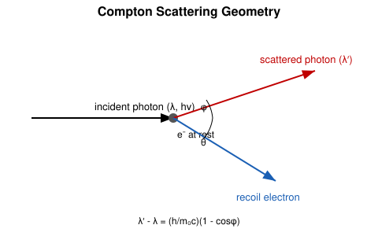

**Derivation:** applying conservation of energy and momentum to the photon-electron collision (photon initial momentum $h/\lambda$, scattered photon momentum $h/\lambda'$ at angle $\phi$, electron recoils with relativistic momentum/energy):

Energy: $\dfrac{hc}{\lambda} + m_0c^2 = \dfrac{hc}{\lambda'} + \sqrt{p_e^2c^2+m_0^2c^4}$

Momentum (x, y components): $\dfrac{h}{\lambda} = \dfrac{h}{\lambda'}\cos\phi + p_e\cos\theta$, $\quad 0 = \dfrac{h}{\lambda'}\sin\phi - p_e\sin\theta$

Eliminating the electron's momentum $p_e$ and angle $\theta$ between these three equations (squaring and adding the momentum equations to eliminate $\theta$, then combining with the energy equation) yields, after algebra:

$$\boxed{\lambda'-\lambda = \frac{h}{m_0c}(1-\cos\phi)}$$

The quantity $h/(m_0c) = \lambda_C$ (Compton wavelength of the electron) $=2.426\times10^{-12}\,$m.

*Numerical (90° scattering):* $\phi=90° \Rightarrow \cos\phi=0$:

$$\Delta\lambda = \frac{h}{m_0c}(1-0) = \frac{h}{m_0c} = \frac{6.625\times10^{-34}}{9.11\times10^{-31}\times3\times10^8} = \frac{6.625\times10^{-34}}{2.733\times10^{-22}} \approx 2.42\times10^{-12}\ \text{m} = 0.0242\ \text{Å}$$

### Blackbody Radiation

**Define: (i) Blackbody radiation (ii) Emissive power (iii) Absorptive power.** *(2017)* / **Define blackbody, emissive power and absorptive power.** *(2015)* / **Define emissive power and absorptive power.** *(2022)*

- **Blackbody radiation:** the characteristic electromagnetic radiation spectrum emitted by an ideal blackbody (a perfect absorber/emitter, absorbing all incident radiation regardless of wavelength) in thermal equilibrium, dependent only on its temperature.
- **Emissive power** $e_\lambda$: the energy radiated per unit area per unit time per unit wavelength interval by a surface at a given wavelength and temperature.
- **Absorptive power** $a_\lambda$: the fraction of incident radiation (at a given wavelength) that a surface absorbs (dimensionless, between 0 and 1; $a_\lambda=1$ for a perfect blackbody).

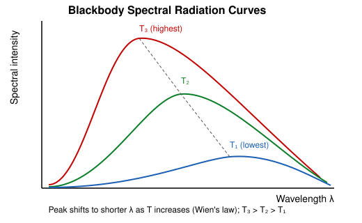

**State Stefan-Boltzmann's law and establish its mechanical proof.** *(2015)*

**Stefan-Boltzmann law:** the total energy radiated per unit area per unit time by a blackbody is proportional to the fourth power of its absolute temperature: $E = \sigma T^4$, where $\sigma=5.67\times10^{-8}\,\text{W/m}^2\text{K}^4$ is the Stefan-Boltzmann constant. *(A full thermodynamic derivation proceeds by treating blackbody radiation as a photon gas with radiation pressure $P=u/3$ (u = energy density), applying the thermodynamic relation $\left(\dfrac{\partial u}{\partial V}\right)_T = T\left(\dfrac{\partial P}{\partial T}\right)_V - P$ derived from the first/second laws, substituting $P=u/3$, and solving the resulting differential equation $\dfrac{du}{u}=\dfrac{4\,dT}{T}$ to get $u\propto T^4$, hence $E\propto T^4$.)*

**State and deduce Kirchhoff's law of radiation.** *(2018)*

**Kirchhoff's law of radiation:** at a given temperature and wavelength, the ratio of emissive power to absorptive power is the same for all bodies and equals the emissive power of a perfect blackbody at that temperature: $\dfrac{e_\lambda}{a_\lambda}=E_\lambda(\text{blackbody})$ — i.e. good absorbers are good emitters. **Deduction:** consider a body placed inside an enclosure in thermal equilibrium at temperature $T$; for equilibrium to be maintained (no net heat flow, else the temperature would spontaneously change, violating the second law), the body must emit exactly as much as it absorbs from the surrounding blackbody radiation field at every wavelength, i.e. $e_\lambda = a_\lambda \times E_\lambda(\text{blackbody})$, giving $e_\lambda/a_\lambda = E_\lambda$, independent of the body's material.

---

*End of compiled answers. Flagged items (OCR/data ambiguities) appear inline where relevant: the ε₀=1 capacitance problem, the "150 cm thick" Hall-effect strip, the isothermal-vs-adiabatic Van der Waals compression problem, the isentropic/isothermal-labelled numerical in Ch. 5, the printed second Maxwell relation in Ch. 5, and the "entropy constant in an irreversible process" statement in Ch. 5.*
