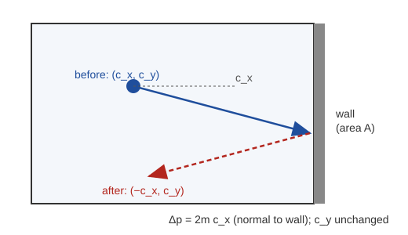
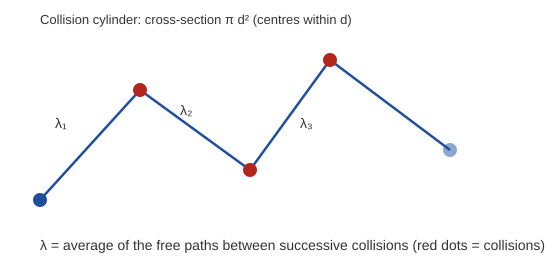
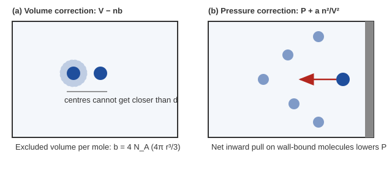
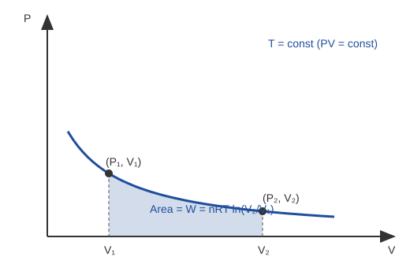
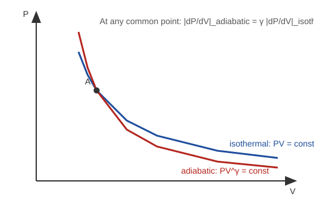
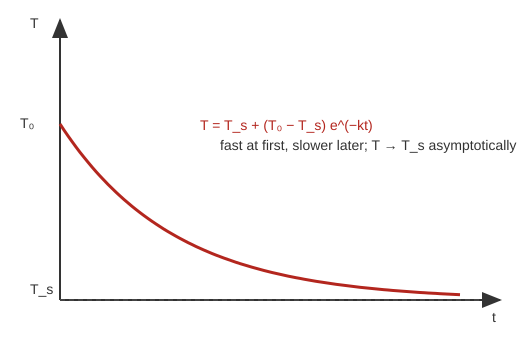
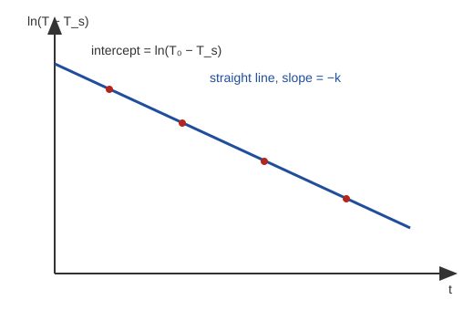
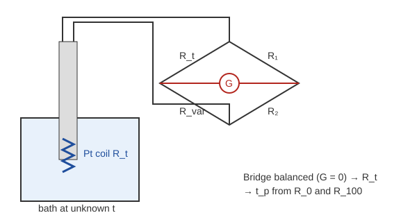
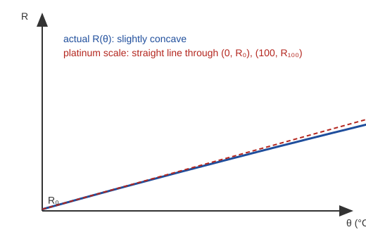

# Physics-II CT Preparation
## Kinetic Theory of Gases & Thermodynamics

Source: *Kinetic Theory of Gases & Thermodynamics — Solved Question Bank* (exam span 2016–2023, 20 questions, 9 topic groups).

**Constants (as supplied):**

| Constant | Value |
|---|---|
| $R$ | $8.31\ \mathrm{J\,mol^{-1}K^{-1}}$ |
| $k$ (Boltzmann) | $1.38\times10^{-23}\ \mathrm{J\,K^{-1}}$ |
| $N_A$ | $6.02\times10^{23}\ \mathrm{mol^{-1}}$ |
| $1\ \mathrm{eV}$ | $1.6\times10^{-19}\ \mathrm{J}$ |

**Notation used throughout**

| Symbol | Meaning |
|---|---|
| $N$ | number of molecules |
| $n=N/V$ | **number density** (molecules per unit volume) |
| $n_{\rm mol}$ | number of **moles** |
| $m$ | mass of one molecule |
| $\rho=Nm/V$ | mass density |
| $\sigma$ | molecular diameter |
| $\overline{c^2}$ | mean-square speed; $c_{\rm rms}=\sqrt{\overline{c^2}}$ |
| $f$ | degrees of freedom |
| $W$ | work done **by** the gas; $\Delta U=Q-W$ |

---

## 1. CT Strategy

1. **Derivations first.** Pressure, mean free path, critical constants, isothermal work, adiabatic slope and Newton's cooling are the long answers. Practise writing each from memory using the *30-second exam skeleton* after each solution.
2. **Then the numericals.** Three numericals (Q17, Q18, Q19) cover the whole chapter's numerical style. Watch units.
3. **Then definitions and tables.** Short marks: heat vs temperature, degrees of freedom, postulates, van der Waals equation.
4. **Write the formula first, then substitute.** Method marks are given for the formula and the substitution.
5. **Keep $n$ and $n_{\rm mol}$ separate.** Number density and moles are different things.
6. **Use two layers.** Study the full derivation once for understanding. Revise from the exam skeleton.

---

## 2. Priority Map

> Priority based on repetition in the supplied 2016–2023 question bank. It is **not** a prediction. A frequently repeated question is not guaranteed to appear in the CT, and a rare one can.

### Tier 1 — Must Master
- Mean free path derivation (Q7) and numerical (Q18) — 5 years / 2 years
- Newton's law of cooling (Q15) — 5 years
- Pressure from kinetic theory (Q5)
- Pressure vs kinetic-energy density (Q6)
- Average kinetic energy (Q17)
- Isothermal work (Q13)
- Adiabatic vs isothermal slope (Q14)

### Tier 2 — Strong Preparation
- Degrees of freedom (Q2) — 4 years
- Kinetic-theory postulates (Q3)
- van der Waals equation (Q8)
- Volume and pressure corrections (Q9)
- Critical constants (Q11)
- $C_P-C_V=R$ (Q12)

### Tier 3 — Short-Answer / Secondary
- Heat vs temperature (Q1)
- Molar specific heat (Q4)
- Units of $a$ and $b$ (Q10)
- Platinum resistance thermometer (Q16) and numerical (Q19)

### Question index

| Q | Topic | Appearances in source | Tier |
|---|---|---|---|
| Q1 | Heat and temperature | 3 (2016, 2018, 2019) | 3 |
| Q2 | Degrees of freedom | 4 (2018, 2019, 2022, 2023) | 2 |
| Q3 | Postulates | 2 (2018, 2023) | 2 |
| Q4 | Molar specific heat | 1 (2020) | 3 |
| Q5 | Pressure from kinetic theory | 1 (2019) | 1 |
| Q6 | $P=\tfrac23E$ | repeated (grouped with Q5, Q17; year list not given) | 1 |
| Q7 | Mean free path | 5 (2018, 2019, 2020, 2022, 2023) | 1 |
| Q8 | van der Waals equation | 2 (2018, 2023) | 2 |
| Q9 | Volume and pressure corrections | 2 (2016, 2018) | 2 |
| Q10 | Units of $a$, $b$ | 1 (2016) | 3 |
| Q11 | Critical constants | 1 (2018) | 2 |
| Q12 | $C_P-C_V=R$ | year list not given | 2 |
| Q13 | Isothermal work | 2 (2017, 2021) | 1 |
| Q14 | Adiabatic steeper | 3 (2018, 2022, 2023) | 1 |
| Q15 | Newton's cooling | 5 (2016, 2018, 2020, 2021, 2022) | 1 |
| Q16 | PRT | 1 (2020) | 3 |
| Q17 | Average KE at 300 K | 2 (2019, 2021) | 1 |
| Q18 | Mean free path numerical | 2 (2018, 2019) | 1 |
| Q19 | PRT numerical | 1 (2020) | 3 |
| Q20 | Self-inductance (out of topic) | 1 (2016) | Appendix |

---

## 3. Fundamental Concepts

### Q1. Define heat and temperature. Differentiate between heat and temperature.

**Exam frequency:** 3 appearances (2016, 2018, 2019)

**Priority:** Secondary

### Answer
- **Heat:** the energy transferred between systems because of a temperature difference. It flows spontaneously from hot to cold. Heat is energy *in transit*. A body does not "contain" heat.
- **Temperature:** a physical quantity that describes the thermal state of a body and determines the direction of heat transfer. In kinetic theory, for an ideal gas, it is a measure of the average translational kinetic energy of a molecule:

$$
\frac12m\overline{c^2}=\frac32kT
$$

### Comparison table

| Basis | Heat | Temperature |
|---|---|---|
| Nature | Energy transfer | Thermal state variable |
| Depends on amount? | Yes, for the total energy transferred | No, intensive |
| Unit | J (also cal) | K (also °C) |
| Instrument | Calorimeter / calorimetric measurement | Thermometer |
| Direction | Transfers hot → cold spontaneously | Determines the direction of heat transfer |
| Molecular picture | Energy transferred between molecular motions | Average translational KE per molecule (ideal gas) |

### Final Result

$$
\boxed{\text{Heat = energy transferred due to }\Delta T;\qquad \tfrac12m\overline{c^2}=\tfrac32kT}
$$

### CT Memory Hook
> **Remember:** Heat is *what flows*; temperature tells *which way it flows*.

---

## 4. Degrees of Freedom

### Q2. Define degrees of freedom of a gas molecule.

**Exam frequency:** 4 appearances (2018, 2019, 2022, 2023)

**Priority:** High

### Answer
The **degrees of freedom** $f$ of a molecule are the number of independent coordinates required to specify its configuration (i.e. its independent modes of motion):

$$
f=3N_{\rm a}-r
$$

where $N_{\rm a}$ is the number of atoms in the molecule and $r$ is the number of independent constraints (rigid bonds) between the atoms.

### Standard table (rigid molecule, vibrations frozen — usual CT assumption)

| Molecule | Translational | Rotational | Total $f$ | $\gamma=1+2/f$ |
|---|---:|---:|---:|---:|
| Monatomic | 3 | 0 | 3 | $5/3$ |
| Diatomic | 3 | 2 | 5 | $7/5$ |
| Linear triatomic | 3 | 2 | 5 | $7/5$ |
| Non-linear triatomic | 3 | 3 | 6 | $4/3$ |

> **Careful about vibrations.** The table counts translation and rotation only. For a rigid linear triatomic molecule, $3N_{\rm a}-r=9-4=5$. If vibrational modes are also counted, a linear molecule has $3N_{\rm a}-5$ vibrational modes ($=1$ for a diatomic, $4$ for a linear triatomic). Each vibrational mode contributes **two** quadratic energy terms (kinetic + potential), so it adds $2\times\tfrac12R=R$ to $C_V$. A value like $f=7$ for a linear triatomic molecule is not a standard classical count. Use $f=5$ unless the question explicitly says vibrations are active.

### Derivation (energy and heat capacities)
**Step 1.** Equipartition: each degree of freedom carries on average $\tfrac12kT$ per molecule.

**Step 2.** Energy of $N$ molecules ($N=n_{\rm mol}N_A$, $R=N_Ak$):

$$
U=N\cdot\frac f2kT=\frac f2\,n_{\rm mol}RT
$$

For one mole: $U=\dfrac f2RT$.

**Step 3.** Heat capacities:

$$
C_V=\frac{dU}{dT}=\frac f2R,\qquad C_P=C_V+R=\left(\frac f2+1\right)R
$$

**Step 4.** Ratio:

$$
\gamma=\frac{C_P}{C_V}=\frac{f/2+1}{f/2}=1+\frac2f
$$

### Final Result

$$
\boxed{U=\frac f2\,n_{\rm mol}RT,\quad C_V=\frac f2R,\quad C_P=C_V+R,\quad \gamma=1+\frac2f}
$$

### CT Memory Hook
> **Remember:** $f=3$ (mono), $5$ (di / linear), $6$ (non-linear) → $\gamma=\tfrac53,\ \tfrac75,\ \tfrac43$.

---

## 5. Kinetic Theory Postulates

### Q3. Describe the fundamental postulates of the kinetic theory of gas molecules.

**Exam frequency:** 2 appearances (2018, 2023)

**Priority:** High

### Answer
1. A gas contains a very large number of molecules.
2. The molecules are extremely small compared with the volume of the gas (the total molecular volume is negligible).
3. The molecules are in continuous, random motion.
4. Molecular velocities have a distribution of values. Individual molecules have different speeds.
5. Molecules collide with each other and with the walls of the container.
6. In the ideal model, collisions are perfectly elastic.
7. Between collisions, molecules move approximately in straight lines with uniform velocity.
8. Intermolecular forces are neglected except during collisions.
9. The duration of a collision is negligible compared with the time between collisions.
10. Gravitational effects are neglected where appropriate.

### CT Memory Hook
> **Remember:** *many, tiny, random, elastic, free (no forces), instantaneous collisions.*

---

## 6. Pressure from Kinetic Theory

### Q5. According to kinetic theory, prove that the pressure exerted by a perfect gas is $P=\dfrac13\dfrac{Nm}{V}\overline{c^2}=\dfrac13\rho\overline{c^2}$.

**Exam frequency:** 1 appearance (2019)

**Priority:** Must Master

### Answer
Pressure is the average force per unit area produced by elastic molecular collisions with the wall.

### Derivation
Take a cube of side $l$, $V=l^3$, containing $N$ molecules each of mass $m$.

**Step 1 — speed components.** A molecule has velocity components $c_x,c_y,c_z$:

$$
c^2=c_x^2+c_y^2+c_z^2
$$

**Step 2 — one collision.** Elastic collision with the wall normal to $x$ reverses $c_x$. Momentum change of the molecule is $-2mc_x$, so the wall receives

$$
\Delta p_x=2mc_x
$$

**Step 3 — time between collisions with the same wall.** The molecule travels $2l$ along $x$ between hits:

$$
\Delta t=\frac{2l}{c_x}
$$

**Step 4 — force from one molecule.**

$$
F=\frac{\Delta p_x}{\Delta t}=\frac{2mc_x}{2l/c_x}=\frac{mc_x^2}{l}
$$

**Step 5 — all molecules.**

$$
F_x=\frac ml\sum_{i=1}^{N}c_{xi}^2=\frac{Nm}{l}\,\overline{c_x^2}
$$

**Step 6 — pressure.**

$$
P=\frac{F_x}{l^2}=\frac{Nm\,\overline{c_x^2}}{l^3}=\frac{Nm}{V}\,\overline{c_x^2}
$$

**Step 7 — isotropy.** Random motion has no preferred direction, so

$$
\overline{c_x^2}=\overline{c_y^2}=\overline{c_z^2}=\frac13\overline{c^2}
$$

**Step 8 — result.**

$$
P=\frac13\frac{Nm}{V}\overline{c^2}=\frac13\rho\overline{c^2}
$$

**RMS speed.** Since $\overline{c^2}=c_{\rm rms}^2$:

$$
c_{\rm rms}=\sqrt{\frac{3P}{\rho}}
$$

### Final Result

$$
\boxed{P=\frac13\frac{Nm}{V}\overline{c^2}=\frac13\rho\,c_{\rm rms}^2},\qquad
\boxed{c_{\rm rms}=\sqrt{\frac{3P}{\rho}}}
$$

> **Note.** The shape of the container does not matter. The cube is for convenience. $c_{\rm rms}=\sqrt{\overline{c^2}}$ is **not** the same as the mean speed $\bar c$.

### 30-Second Exam Skeleton
1. Cube of side $l$, $N$ molecules, mass $m$.
2. Momentum change per collision $=2mc_x$.
3. Time between hits $=2l/c_x$ (collision frequency $=c_x/2l$).
4. Force $=mc_x^2/l$.
5. Sum over molecules: $F=\dfrac{Nm}{l}\overline{c_x^2}$.
6. $P=F/l^2$ and $\overline{c_x^2}=\tfrac13\overline{c^2}$.
7. $\boxed{P=\tfrac13\rho\overline{c^2}}$.

### CT Memory Hook
> **Remember:** $2mc_x$ per hit × $c_x/2l$ hits per second → $mc_x^2/l$. The $\tfrac13$ is "one of three directions".

---

## 7. Pressure and Kinetic Energy

### Q6. Deduce the relation between pressure and kinetic energy per unit volume of a gas.

**Exam frequency:** repeated across the bank (year list not given)

**Priority:** Must Master

### Answer
The pressure of a perfect gas is two-thirds of the translational kinetic energy per unit volume.

### Three quantities to keep apart

| Quantity | Expression |
|---|---|
| KE per molecule | $\overline K=\tfrac12m\overline{c^2}$ |
| Total KE of all molecules | $K_{\rm tot}=\tfrac12Nm\overline{c^2}$ |
| KE density (per unit volume) | $E=\dfrac{K_{\rm tot}}{V}=\dfrac NV\cdot\tfrac12m\overline{c^2}$ |

### Derivation
**Step 1.** From Q5:

$$
P=\frac13\frac{Nm}{V}\overline{c^2}
$$

**Step 2.** Write $\dfrac{Nm}{V}\overline{c^2}=2\cdot\dfrac NV\cdot\dfrac12m\overline{c^2}=2E$.

**Step 3.**

$$
P=\frac13(2E)=\frac23E
$$

Also $PV=\tfrac23K_{\rm tot}$.

### Final Result

$$
\boxed{P=\frac23E}
$$

### Variant — "pressure/work is directly proportional to the kinetic energy of the molecules"
- At fixed volume, $P=\dfrac{2K_{\rm tot}}{3V}\;\Rightarrow\;P\propto K_{\rm tot}$.
- Combining with $PV=Nk T$: $K_{\rm tot}=\tfrac32NkT$, so $\overline K=\tfrac32kT$.
- In an adiabatic expansion ($Q=0$), the work done by the gas $W=-\Delta U=-\Delta K_{\rm tot}$ (monatomic gas). The gas does work at the expense of its molecular kinetic energy.

### 30-Second Exam Skeleton
1. $P=\tfrac13\dfrac{Nm}{V}\overline{c^2}$.
2. $E=\dfrac NV\cdot\tfrac12m\overline{c^2}$.
3. So $\dfrac{Nm\overline{c^2}}{V}=2E$.
4. $\boxed{P=\tfrac23E}$.

### CT Memory Hook
> **Remember:** the $\tfrac12$ in $\tfrac12mc^2$ turns $\tfrac13$ into $\tfrac23$.

---

## 8. Mean Free Path

### Q7. What is mean free path? Derive an expression for the mean free path of a gas molecule.

**Exam frequency:** 5 appearances (2018, 2019, 2020, 2022, 2023)

**Priority:** Must Master

### Answer
The **mean free path** $\lambda$ is the average distance travelled by a gas molecule between two successive collisions:

$$
\lambda=\frac SN
$$

where $S$ is the total path travelled and $N$ is the number of collisions in that path.

### Derivation
Treat molecules as hard spheres of diameter $\sigma$. Let $n=N/V$ be the number density.

**Step 1 — collision condition.** Two molecules collide if their centres come within a distance $\sigma$. So the moving molecule effectively has a "collision cross-section" $\pi\sigma^2$ (radius $\sigma$ circle).

**Step 2 — Clausius (other molecules at rest).** In travelling a path $S$, the molecule sweeps a cylinder of volume $\pi\sigma^2S$. Every molecule whose centre is in that cylinder is hit:

$$
N_{\rm coll}=\pi\sigma^2S\,n
$$

$$
\lambda=\frac S{N_{\rm coll}}=\frac1{\pi\sigma^2n}
$$

**Step 3 — correction for motion of all molecules.** Other molecules also move. The relevant speed is the **mean relative speed**, which is $\sqrt2$ times the mean speed. The collision rate increases by $\sqrt2$, so $\lambda$ decreases by $\sqrt2$:

$$
\lambda=\frac1{\sqrt2\,\pi\sigma^2n}
$$

**Step 4 — in terms of $P$ and $T$.** From $PV=NkT$: $n=\dfrac NV=\dfrac P{kT}$:

$$
\lambda=\frac{kT}{\sqrt2\,\pi\sigma^2P}
$$

**Step 5 — dependence.**

$$
\lambda\propto T\quad(P\text{ constant}),\qquad \lambda\propto\frac1P\quad(T\text{ constant})
$$

### Final Result

$$
\boxed{\lambda=\frac1{\sqrt2\,\pi\sigma^2n}=\frac{kT}{\sqrt2\,\pi\sigma^2P}}
$$

> **Note.** $n$ here is the number of molecules per unit volume, not the number of moles. $\lambda$ does not depend on the speed of the molecules, only on their size and density.

### 30-Second Exam Skeleton
1. $\lambda=S/N_{\rm coll}$.
2. Collision if centres within $\sigma$ → cross-section $\pi\sigma^2$.
3. Path $S$ sweeps volume $\pi\sigma^2S$ → collisions $=\pi\sigma^2Sn$ → $\lambda=\dfrac1{\pi\sigma^2n}$.
4. Relative motion of all molecules → factor $\sqrt2$.
5. $\boxed{\lambda=\dfrac1{\sqrt2\pi\sigma^2n}}$; with $n=P/kT$: $\lambda=\dfrac{kT}{\sqrt2\pi\sigma^2P}$.

### CT Memory Hook
> **Remember:** cross-section $\pi\sigma^2$, density $n$, relative-motion factor $\sqrt2$ in the denominator.

---

## 9. van der Waals Equation

### Q8. State the van der Waals equation of state for real gases.

**Exam frequency:** 2 appearances (2018, 2023)

**Priority:** High

### Answer
For one mole of gas:

$$
\boxed{\left(P+\frac a{V^2}\right)(V-b)=RT}
$$

For $n_{\rm mol}$ moles:

$$
\boxed{\left[P+a\left(\frac{n_{\rm mol}}V\right)^2\right](V-n_{\rm mol}b)=n_{\rm mol}RT}
$$

- $a$: correction for intermolecular **attraction**.
- $b$: correction for the finite **volume** of the molecules.

For $a,b\to0$ the equation reduces to the ideal-gas law $PV=RT$.

### CT Memory Hook
> **Remember:** *pressure gets a plus ($+a/V^2$), volume gets a minus ($-b$).*

---

### Q9. Discuss in detail the volume correction and pressure correction in the van der Waals equation of state.

**Exam frequency:** 2 appearances (2016, 2018)

**Priority:** High

### Answer
The ideal-gas law assumes point molecules with no attraction. Real gases deviate, especially at high pressure and low temperature. van der Waals made two corrections.

### (i) Volume correction
Molecules have a finite size, so the volume actually available for their motion is less than the container volume $V$. For one mole:

$$
V_{\rm eff}=V-b
$$

$b$ is subtracted because part of the container volume is excluded by the molecules themselves. In the simple hard-sphere model, $b$ is about four times the actual volume of the molecules in one mole:

$$
b\approx4V_{\rm molecular}
$$

### (ii) Pressure correction
A molecule in the interior of the gas is pulled equally in all directions. A molecule near the wall is pulled **inward** by those behind it, so it strikes the wall with less momentum and the measured pressure is **lower** than the ideal pressure. The reduction is proportional to $1/V^2$ (it depends on both the number of molecules striking the wall and the number attracting them, each $\propto 1/V$):

$$
P_{\rm ideal}=P+\frac a{V^2}
$$

### Combining

$$
\boxed{\left(P+\frac a{V^2}\right)(V-b)=RT}
$$

> **Note.** The van der Waals equation is an approximate model, not an exact law.

### CT Memory Hook
> **Remember:** size → $V-b$; stickiness → $P+a/V^2$.

---

### Q10. Deduce the values/units of the van der Waals constants $a$ and $b$.

**Exam frequency:** 1 appearance (2016)

**Priority:** Secondary

### Answer
**Step 1 — units of $a$.** $a/V^2$ has units of pressure ($V$ = molar volume):

$$
[a]=[P][V^2]=\mathrm{Pa\,m^6\,mol^{-2}}
$$

Equivalent forms: $\mathrm{N\,m^4\,mol^{-2}}$ or $\mathrm{J\,m^3\,mol^{-2}}$.

**Step 2 — units of $b$.** $b$ is subtracted from $V$:

$$
[b]=\mathrm{m^3\,mol^{-1}}
$$

**Step 3 — from critical constants** (derived in Q11, using $V_c=3b$ etc.):

$$
b=\frac{RT_c}{8P_c},\qquad a=\frac{27R^2T_c^2}{64P_c}
$$

### SI vs common alternatives

| Constant | SI | Common alternative |
|---|---|---|
| $a$ | $\mathrm{Pa\,m^6\,mol^{-2}}$ | $\mathrm{atm\,L^2\,mol^{-2}}$ ($1\ \mathrm{atm\,L^2}=0.1013\ \mathrm{Pa\,m^6}$) |
| $b$ | $\mathrm{m^3\,mol^{-1}}$ | $\mathrm{L\,mol^{-1}}$ ($1\ \mathrm{L}=10^{-3}\ \mathrm{m^3}$) |

### Final Result

$$
\boxed{[a]=\mathrm{Pa\,m^6\,mol^{-2}},\qquad [b]=\mathrm{m^3\,mol^{-1}}}
$$

---

## 10. Critical Constants

### Q11. What are the critical constants of a gas? Derive them in terms of the van der Waals constants $a$ and $b$.

**Exam frequency:** 1 appearance (2018)

**Priority:** High

### Answer
Above a certain temperature a gas cannot be liquefied by pressure alone. The special values at the critical point are the **critical constants**:

- **Critical temperature** $T_c$: the highest temperature at which the gas can be liquefied by pressure.
- **Critical pressure** $P_c$: the pressure needed to liquefy the gas at $T_c$.
- **Critical (molar) volume** $V_c$: the volume of one mole at $T_c$ and $P_c$.

At the critical point the isotherm has a **horizontal inflection**:

$$
\left(\frac{\partial P}{\partial V}\right)_T=0,\qquad\left(\frac{\partial^2P}{\partial V^2}\right)_T=0
$$

### Derivation
**Step 1.** For one mole:

$$
P=\frac{RT}{V-b}-\frac a{V^2}
$$

**Step 2 — derivatives.**

$$
\begin{aligned}
\frac{\partial P}{\partial V}&=-\frac{RT}{(V-b)^2}+\frac{2a}{V^3}\\[4pt]
\frac{\partial^2P}{\partial V^2}&=\frac{2RT}{(V-b)^3}-\frac{6a}{V^4}
\end{aligned}
$$

**Step 3 — critical conditions.**

$$
\frac{RT_c}{(V_c-b)^2}=\frac{2a}{V_c^3}\quad(1)\qquad
\frac{2RT_c}{(V_c-b)^3}=\frac{6a}{V_c^4}\quad(2)
$$

**Step 4 — $V_c$.** Divide (1) by (2):

$$
\frac{V_c-b}{2}=\frac{V_c}{3}\;\Rightarrow\;V_c=3b
$$

**Step 5 — $T_c$.** Put $V_c=3b$ in (1):

$$
RT_c=\frac{2a(2b)^2}{27b^3}=\frac{8a}{27b}\;\Rightarrow\;T_c=\frac{8a}{27Rb}
$$

**Step 6 — $P_c$.**

$$
P_c=\frac{RT_c}{V_c-b}-\frac a{V_c^2}=\frac{8a/27b}{2b}-\frac a{9b^2}=\frac{4a-3a}{27b^2}=\frac a{27b^2}
$$

**Step 7 — critical coefficient.**

$$
Z_c=\frac{P_cV_c}{RT_c}=\frac{(a/27b^2)(3b)}{8a/27b}=\frac38
$$

### Final Result

$$
\boxed{V_c=3b,\qquad T_c=\frac{8a}{27Rb},\qquad P_c=\frac a{27b^2}}
$$

$$
\boxed{Z_c=\frac{P_cV_c}{RT_c}=\frac38}\qquad\left(\text{its reciprocal is }\frac{RT_c}{P_cV_c}=\frac83\right)
$$

> **Careful.** The compressibility factor is $Z_c=\dfrac{P_cV_c}{RT_c}=\dfrac38=0.375$. The number $\dfrac83$ is its **reciprocal**, $\dfrac{RT_c}{P_cV_c}$. Always write which ratio you mean. Do not confuse critical constants ($T_c,P_c,V_c$) with the van der Waals constants ($a,b$).

### 30-Second Exam Skeleton
1. $P=\dfrac{RT}{V-b}-\dfrac a{V^2}$.
2. $\partial P/\partial V=0\to\dfrac{RT_c}{(V_c-b)^2}=\dfrac{2a}{V_c^3}$.
3. $\partial^2P/\partial V^2=0\to\dfrac{2RT_c}{(V_c-b)^3}=\dfrac{6a}{V_c^4}$.
4. Divide: $V_c=3b$.
5. Back-substitute: $T_c=\dfrac{8a}{27Rb}$, $P_c=\dfrac a{27b^2}$.
6. $\dfrac{P_cV_c}{RT_c}=\dfrac38$.

### CT Memory Hook
> **Remember:** "3, 8, 27" → $V_c=3b$, $T_c=\dfrac{8a}{27Rb}$, $P_c=\dfrac{a}{27b^2}$.

---

## 11. Specific Heat Capacities

### Q4. Define molar specific heat of a gas.

**Exam frequency:** 1 appearance (2020)

**Priority:** Secondary

### Answer
The **molar specific heat** is the heat required to raise the temperature of one mole of the gas by $1\ \mathrm K$ under a specified condition:

$$
C=\frac1{n_{\rm mol}}\frac{dQ}{dT}
$$

For a gas it depends on the process:

$$
C_V=\left(\frac{\partial Q}{\partial T}\right)_V\ (\text{per mole}),\qquad C_P=\left(\frac{\partial Q}{\partial T}\right)_P\ (\text{per mole})
$$

with

$$
C_P-C_V=R,\qquad\gamma=\frac{C_P}{C_V},\qquad C_V=\frac f2R
$$

### CT Memory Hook
> **Remember:** at constant pressure the gas expands and does work, so $C_P>C_V$.

---

### Q12. Show that the difference between the molar specific heats at constant pressure and constant volume equals the gas constant.

**Exam frequency:** year list not given in source

**Priority:** High

### Answer
For an ideal gas, $C_P-C_V=R$ (Mayer's relation).

### Derivation
Take 1 mole of an ideal gas.

**Step 1 — first law.**

$$
\delta Q=dU+P\,dV
$$

**Step 2 — constant volume** ($dV=0$):

$$
\delta Q_V=dU=C_V\,dT
$$

For an ideal gas $U$ depends only on $T$, so $dU=C_V\,dT$ holds in every process.

**Step 3 — constant pressure.**

$$
\delta Q_P=C_P\,dT=dU+P\,dV=C_V\,dT+P\,dV
$$

**Step 4 — use $PV=RT$** at constant $P$: $P\,dV=R\,dT$.

**Step 5.**

$$
C_P\,dT=C_V\,dT+R\,dT\;\Rightarrow\;C_P-C_V=R
$$

### Consequences
With $\gamma=C_P/C_V$:

$$
C_V=\frac R{\gamma-1},\qquad C_P=\frac{\gamma R}{\gamma-1}
$$

### Final Result

$$
\boxed{C_P-C_V=R}
$$

### 30-Second Exam Skeleton
1. $\delta Q=dU+P\,dV$.
2. Constant $V$: $C_V\,dT=dU$.
3. Constant $P$: $C_P\,dT=dU+P\,dV$.
4. $PV=RT\Rightarrow P\,dV=R\,dT$.
5. $\boxed{C_P-C_V=R}$.

### CT Memory Hook
> **Remember:** the extra heat at constant pressure is the work $P\,dV=R\,dT$.

### Table — $C_V$, $C_P$ and $\gamma$

| Gas | $f$ | $C_V$ | $C_P$ | $\gamma$ |
|---|---|---|---|---|
| Monatomic | 3 | $\tfrac32R$ | $\tfrac52R$ | $1.67$ |
| Diatomic (rigid) | 5 | $\tfrac52R$ | $\tfrac72R$ | $1.40$ |
| Non-linear polyatomic (rigid) | 6 | $3R$ | $4R$ | $1.33$ |

---

## 12. Isothermal Process

### Q13. What is an isothermal process? Derive an equation for the work done during an isothermal expansion.

**Exam frequency:** 2 appearances (2017, 2021)

**Priority:** Must Master

### Answer
An **isothermal process** is a thermodynamic process that occurs at constant temperature. For an ideal gas:

$$
PV=n_{\rm mol}RT=\text{constant}
$$

### Derivation
**Step 1.** Work for a small expansion: $dW=P\,dV$.

**Step 2.** Total work from $V_1$ to $V_2$:

$$
W=\int_{V_1}^{V_2}P\,dV
$$

**Step 3.** Use $P=\dfrac{n_{\rm mol}RT}{V}$ ($T$ constant):

$$
\begin{aligned}
W&=n_{\rm mol}RT\int_{V_1}^{V_2}\frac{dV}V\\
&=n_{\rm mol}RT\,\ln\frac{V_2}{V_1}
\end{aligned}
$$

**Step 4.** Isothermal: $P_1V_1=P_2V_2\Rightarrow\dfrac{V_2}{V_1}=\dfrac{P_1}{P_2}$.

**Step 5.** First law: $\Delta U=0$ for an ideal gas at constant $T$, so with $\Delta U=Q-W$:

$$
Q=W
$$

All the heat absorbed is converted to work.

### Final Result

$$
\boxed{W=n_{\rm mol}RT\ln\frac{V_2}{V_1}=n_{\rm mol}RT\ln\frac{P_1}{P_2}=2.303\,n_{\rm mol}RT\log_{10}\frac{V_2}{V_1}}
$$

> **Note.** $\ln$ is the natural logarithm. $W>0$ for expansion (work done **by** the gas) and $W<0$ for compression (work done **on** the gas). The work equals the area under the $P$–$V$ curve.

### 30-Second Exam Skeleton
1. Isothermal: $T$ constant, $PV=$ const.
2. $W=\int_{V_1}^{V_2}P\,dV$ with $P=n_{\rm mol}RT/V$.
3. $W=n_{\rm mol}RT\ln(V_2/V_1)$.
4. $=n_{\rm mol}RT\ln(P_1/P_2)$.
5. $\Delta U=0\Rightarrow Q=W$.

### CT Memory Hook
> **Remember:** $\int dV/V=\ln$; constant $T$ means $\Delta U=0$, so heat in = work out.

---

## 13. Adiabatic Process

### Q14. Show that adiabatic curves are steeper than isothermal curves on a $P$–$V$ indicator diagram.

**Exam frequency:** 3 appearances (2018, 2022, 2023)

**Priority:** Must Master

### Answer
An **adiabatic process** is one in which no heat is exchanged with the surroundings ($Q=0$). For an ideal gas undergoing a quasi-static adiabatic process:

$$
PV^\gamma=\text{constant}
$$

> **Supporting derivation of $PV^\gamma=\text{const}$.** For one mole, $dU=-P\,dV$ and $dU=C_V\,dT$, so $C_V\,dT=-P\,dV$. Differentiating $PV=RT$ gives $P\,dV+V\,dP=R\,dT$. Eliminating $dT$: $C_V\,V\,dP+(C_V+R)\,P\,dV=0$, i.e. $C_V\,V\,dP+C_P\,P\,dV=0$. Hence $\dfrac{dP}{P}+\gamma\dfrac{dV}{V}=0$ and $PV^\gamma=\text{const}$.

### Derivation
**Step 1 — adiabatic slope.** Differentiate $PV^\gamma=\text{const}$:

$$
V^\gamma\,dP+\gamma PV^{\gamma-1}\,dV=0
$$

$$
\left(\frac{dP}{dV}\right)_{\rm ad}=-\gamma\frac PV
$$

**Step 2 — isothermal slope.** Differentiate $PV=\text{const}$: $P\,dV+V\,dP=0$:

$$
\left(\frac{dP}{dV}\right)_{\rm iso}=-\frac PV
$$

**Step 3 — compare at the same point $(P,V)$.**

$$
\frac{\text{slope}_{\rm ad}}{\text{slope}_{\rm iso}}=\gamma
$$

**Step 4.** Since $C_P>C_V$, $\gamma>1$, so the adiabatic curve is steeper.

### Physical explanation
In an adiabatic expansion the gas does work at the expense of its internal energy, so the temperature falls and the pressure drops faster than in the isothermal case. In an isothermal expansion heat flows in and keeps $T$ constant.

### Final Result

$$
\boxed{\left(\frac{dP}{dV}\right)_{\rm ad}=-\gamma\frac PV=\gamma\left(\frac{dP}{dV}\right)_{\rm iso}}
$$

### Table — Isothermal vs Adiabatic

| Basis | Isothermal | Adiabatic |
|---|---|---|
| Condition | $T$ constant | $Q=0$ |
| Equation | $PV=\text{const}$ | $PV^\gamma=\text{const}$ |
| Slope $dP/dV$ | $-P/V$ | $-\gamma P/V$ |
| Heat exchange | Yes ($Q=W$) | None |
| Internal energy | $\Delta U=0$ (ideal gas) | $\Delta U=-W$ |
| Temperature | Constant | Changes (falls on expansion) |
| Process speed | Slow, good thermal contact | Fast or well insulated |

### 30-Second Exam Skeleton
1. Isothermal: $PV=C\Rightarrow dP/dV=-P/V$.
2. Adiabatic: $PV^\gamma=C\Rightarrow dP/dV=-\gamma P/V$.
3. Ratio $=\gamma>1$.
4. So the adiabatic curve is steeper.

### CT Memory Hook
> **Remember:** for an adiabatic curve, multiply the isothermal slope by $\gamma$.

---

## 14. Newton's Law of Cooling

### Q15. State and explain Newton's law of cooling. Give its graphical representation and discuss its experimental limitations.

**Exam frequency:** 5 appearances (2016, 2018, 2020, 2021, 2022)

**Priority:** Must Master

### Answer
> The rate of loss of heat of a body is proportional to the temperature difference between the body and its surroundings, provided the temperature difference is sufficiently small and other conditions remain suitable.

### Derivation
Let $T$ = temperature of the body, $T_s$ = surroundings (constant), $T_0$ = initial temperature of the body.

**Step 1.**

$$
\frac{dT}{dt}=-k(T-T_s),\qquad k>0
$$

**Step 2 — separate and integrate.**

$$
\begin{aligned}
\int_{T_0}^{T}\frac{dT}{T-T_s}&=-k\int_0^t dt\\
\ln\frac{T-T_s}{T_0-T_s}&=-kt
\end{aligned}
$$

**Step 3.**

$$
T(t)=T_s+(T_0-T_s)\,e^{-kt}
$$

### Explanation
- Initial cooling is fast because $T-T_s$ is large.
- Cooling becomes slower as the body approaches $T_s$.
- $T\to T_s$ asymptotically (never exactly reached in finite time).

### Graphs
**Cooling curve ($T$ vs $t$):**

**Experimental linear test ($\ln(T-T_s)$ vs $t$):**

Taking logs of the result: $\ln(T-T_s)=\ln(T_0-T_s)-kt$. A straight line of slope $-k$ confirms the law.

### Experimental limitations
1. The law is best for **small** temperature differences (roughly 30 K is often quoted as an experimental guideline, not a strict cutoff).
2. The surrounding temperature should stay approximately constant.
3. Convection conditions (air flow) must be controlled.
4. The body should have a nearly uniform temperature.
5. $k$ is not universal. It depends on surface area, surface finish, the material and the surroundings.
6. Evaporation, thermometer lag and the heat capacity of the measuring equipment introduce errors.
7. At large temperature differences, radiative loss varies as $T^4$ (Stefan–Boltzmann), so the cooling becomes nonlinear.

### Final Result

$$
\boxed{\frac{dT}{dt}=-k(T-T_s)\;\Longrightarrow\;T(t)=T_s+(T_0-T_s)\,e^{-kt}}
$$

### 30-Second Exam Skeleton
1. Statement: rate of heat loss $\propto(T-T_s)$ for small $\Delta T$.
2. $\dfrac{dT}{dt}=-k(T-T_s)$.
3. $\int\dfrac{dT}{T-T_s}=-k\int dt$.
4. $\ln\dfrac{T-T_s}{T_0-T_s}=-kt$.
5. $\boxed{T=T_s+(T_0-T_s)e^{-kt}}$.
6. Plot $\ln(T-T_s)$ vs $t$ → straight line, slope $-k$.

### CT Memory Hook
> **Remember:** exponential decay of the *excess* temperature, $T-T_s$, with the surroundings as the floor.

---

## 15. Platinum Resistance Thermometer

### Q16. Describe the working principle and construction of a platinum resistance thermometer. Discuss its main advantages and disadvantages.

**Exam frequency:** 1 appearance (2020)

**Priority:** Secondary

### Principle
The electrical resistance of platinum varies predictably (almost linearly) with temperature. Measuring the resistance gives the temperature.

### Construction
- A fine platinum wire, wound as a coil,
- on an insulating, heat-resistant support (mica or ceramic frame),
- inside a protective enclosure (glass or quartz or metal tube),
- with electrical leads (plus compensating dummy leads to cancel lead resistance),
- connected to a resistance-measuring circuit (Wheatstone/Callendar–Griffiths bridge or precision ohmmeter).

### Basic relation
$$
R_\theta=R_0(1+\alpha\theta)\;\Rightarrow\;\alpha=\frac{R_{100}-R_0}{100R_0}
$$

Temperature on the **platinum scale** ($R_\theta$ measured):

$$
\boxed{\theta=\frac{R_\theta-R_0}{R_{100}-R_0}\times100^\circ\mathrm C}
$$

### Callendar correction
Platinum's resistance is not exactly linear, so $t_{pt}$ differs slightly from the **gas-scale** temperature $t$:

$$
t-t_{pt}=\delta\left(\frac t{100}\right)\left(\frac t{100}-1\right)
$$

with $\delta\approx1.5$ for pure platinum. See Q19.

### Advantages
- Accurate and reproducible.
- Wide usable range.
- Sensitive.
- Stable over long periods.

### Disadvantages
- Expensive.
- Requires electrical measuring equipment.
- Thermal inertia can slow the response.
- Self-heating error from the measuring current.
- Fragile; contamination at high temperature changes the resistance.

### CT Memory Hook
> **Remember:** *measure $R$, then use $\theta=100\,\dfrac{R_\theta-R_0}{R_{100}-R_0}$ (platinum scale); Callendar converts to gas scale.*

---

## 16. Numerical Problems

### Q17. Calculate the average kinetic energy of a molecule of a gas at a temperature of 300 K.

**Exam frequency:** 2 appearances (2019, 2021)

**Priority:** Must Master

**Given**
- $T=300\ \mathrm K$
- $k=1.38\times10^{-23}\ \mathrm{J\,K^{-1}}$

**Required** Average translational kinetic energy $\overline K$ of **one** molecule.

**Formula**

$$
\overline K=\frac12m\overline{c^2}=\frac32kT
$$

**Unit Conversion** $1\ \mathrm{eV}=1.6\times10^{-19}\ \mathrm J$.

**Substitution**

$$
\overline K=\frac32(1.38\times10^{-23})(300)=6.21\times10^{-21}\ \mathrm J
$$

**Answer**

$$
\boxed{\overline K=6.21\times10^{-21}\ \mathrm J\;\approx\;0.039\ \mathrm{eV}}
$$

**Common CT Mistake.** Writing $\tfrac32RT$ (that is per **mole**, $\approx3.7\ \mathrm{kJ/mol}$). Per molecule use $\tfrac32kT$.

> This is the average translational kinetic energy **per molecule**.

---

### Q18. The mean free path of a nitrogen molecule at $0^\circ\mathrm C$ and 1 atm is $0.8\times10^{-7}$ m. At this temperature and pressure its molecular (number) density is $2.7\times10^{19}$ molecules/cm³. What is the molecular diameter?

**Exam frequency:** 2 appearances (2018, 2019)

**Priority:** Must Master

**Given**
- $\lambda=0.8\times10^{-7}\ \mathrm m$
- $n=2.7\times10^{19}\ \mathrm{cm^{-3}}$

**Required** Molecular diameter $\sigma$.

**Formula**

$$
\lambda=\frac1{\sqrt2\,\pi\sigma^2n}\;\Rightarrow\;\sigma=\sqrt{\frac1{\sqrt2\,\pi\,n\lambda}}
$$

**Unit Conversion**

$$
n=2.7\times10^{19}\ \mathrm{cm^{-3}}\times10^{6}\ \frac{\mathrm{cm^3}}{\mathrm{m^3}}=2.7\times10^{25}\ \mathrm{m^{-3}}
$$

**Substitution**

$$
\begin{aligned}
n\lambda&=(2.7\times10^{25})(0.8\times10^{-7})=2.16\times10^{18}\ \mathrm{m^{-2}}\\
\sqrt2\,\pi\,n\lambda&=4.443\times2.16\times10^{18}=9.60\times10^{18}\ \mathrm{m^{-2}}\\
\sigma^2&=\frac1{9.60\times10^{18}}=1.04\times10^{-19}\ \mathrm{m^2}\\
\sigma&=3.23\times10^{-10}\ \mathrm m
\end{aligned}
$$

**Answer**

$$
\boxed{\sigma\approx3.2\times10^{-10}\ \mathrm m=3.2\ \text{Å}=3.2\times10^{-8}\ \mathrm{cm}}
$$

**Common CT Mistake.** Using $2.7\times10^{19}$ as if it were per m³. It is per cm³, so convert to $2.7\times10^{25}\ \mathrm{m^{-3}}$.

---

### Q19. The resistances of a platinum resistance thermometer are 2.585 Ω and 3.510 Ω at 0 °C and 100 °C. In a hot bath its resistance is 9.098 Ω. Calculate the temperature of the bath on the gas scale. Callendar constant $\delta=1.5$.

**Exam frequency:** 1 appearance (2020)

**Priority:** Secondary

**Given**
- $R_0=2.585\ \Omega$, $R_{100}=3.510\ \Omega$, $R_t=9.098\ \Omega$
- $\delta=1.5$

**Required** Temperature $t$ of the bath on the **gas scale**.

**Formula** (two stages)

$$
t_{pt}=100\,\frac{R_t-R_0}{R_{100}-R_0},\qquad
t-t_{pt}=\delta\left(\frac t{100}\right)\left(\frac t{100}-1\right)
$$

**Unit Conversion** Not required ($R$ in Ω, $t$ in °C).

**Step 1 — platinum-scale temperature**

$$
t_{pt}=100\times\frac{9.098-2.585}{3.510-2.585}=100\times\frac{6.513}{0.925}\approx704.1^\circ\mathrm C
$$

> $704.1^\circ\mathrm C$ is the **platinum-scale** temperature, **not** the final answer.

**Step 2 — Callendar correction.** Let $x=t/100$:

$$
\begin{aligned}
100x-704.1&=1.5(x^2-x)\\
1.5x^2-101.5x+704.1&=0
\end{aligned}
$$

$$
x=\frac{101.5\pm\sqrt{101.5^2-4(1.5)(704.1)}}{3}=\frac{101.5\pm77.96}{3}
$$

- $x\approx7.847$ → $t\approx784.7^\circ\mathrm C$ (physically meaningful, close to $t_{pt}$).
- $x\approx59.8$ → $t\approx5980^\circ\mathrm C$ (rejected: absurd).

**Answer**

$$
\boxed{t\approx784.7^\circ\mathrm C\approx785^\circ\mathrm C\ \text{(gas scale)}}
$$

**Common CT Mistake.** Stopping at $704.1^\circ\mathrm C$ (the platinum-scale value), or keeping the wrong quadratic root.

---

## 17. Frequently Repeated Questions

Based on repetition in the supplied 2016–2023 question bank (not a prediction).

| Rank | Question | Appearances | Where |
|---:|---|---:|---|
| 1= | Mean free path (Q7) | 5 | Section 8 |
| 1= | Newton's law of cooling (Q15) | 5 | Section 14 |
| 3 | Degrees of freedom (Q2) | 4 | Section 4 |
| 4= | Heat and temperature (Q1) | 3 | Section 3 |
| 4= | Adiabatic steeper than isothermal (Q14) | 3 | Section 13 |
| 6= | Postulates (Q3) | 2 | Section 5 |
| 6= | van der Waals equation (Q8) | 2 | Section 9 |
| 6= | Volume and pressure corrections (Q9) | 2 | Section 9 |
| 6= | Isothermal work (Q13) | 2 | Section 12 |
| 6= | Average KE at 300 K (Q17) | 2 | Section 16 |
| 6= | Mean free path numerical (Q18) | 2 | Section 16 |

### Table — Ideal gas vs real gas

| Basis | Ideal gas | Real gas |
|---|---|---|
| Molecular size | Negligible | Finite |
| Intermolecular forces | None (except in collisions) | Present |
| Equation of state | $PV=n_{\rm mol}RT$ | $\left[P+a(n_{\rm mol}/V)^2\right](V-n_{\rm mol}b)=n_{\rm mol}RT$ |
| Can be liquefied? | No (in the model) | Yes, below $T_c$ |
| Valid | Always (in the model) | Ideal law fails at high $P$, low $T$ |

### Table — Monatomic vs diatomic vs polyatomic (rigid, vibrations not counted)

| Property | Monatomic | Diatomic | Linear triatomic | Non-linear triatomic |
|---|---:|---:|---:|---:|
| $f$ | 3 | 5 | 5 | 6 |
| $C_V$ | $\tfrac32R$ | $\tfrac52R$ | $\tfrac52R$ | $3R$ |
| $C_P$ | $\tfrac52R$ | $\tfrac72R$ | $\tfrac72R$ | $4R$ |
| $\gamma$ | $\tfrac53$ | $\tfrac75$ | $\tfrac75$ | $\tfrac43$ |

---

## 18. One-Page Formula Sheet

**Kinetic theory**

$$
P=\frac13\rho\overline{c^2},\quad P=\frac23E,\quad \overline K=\frac32kT,\quad c_{\rm rms}=\sqrt{\frac{3kT}m}=\sqrt{\frac{3P}\rho}
$$

**Degrees of freedom**

$$
U=\frac f2n_{\rm mol}RT,\quad C_V=\frac f2R,\quad C_P=C_V+R,\quad\gamma=1+\frac2f
$$

**Mean free path**

$$
\lambda=\frac1{\sqrt2\pi\sigma^2n}=\frac{kT}{\sqrt2\pi\sigma^2P}
$$

**van der Waals**

$$
\left(P+\frac a{V^2}\right)(V-b)=RT,\quad V_c=3b,\quad T_c=\frac{8a}{27Rb},\quad P_c=\frac a{27b^2},\quad Z_c=\frac{P_cV_c}{RT_c}=\frac38
$$

$$
b=\frac{RT_c}{8P_c},\qquad a=\frac{27R^2T_c^2}{64P_c}
$$

**Thermodynamics** ($\Delta U=Q-W$)

$$
C_P-C_V=R,\quad C_V=\frac R{\gamma-1},\quad C_P=\frac{\gamma R}{\gamma-1}
$$

$$
\text{Isothermal: }PV=\text{const},\quad W_{\rm iso}=n_{\rm mol}RT\ln\frac{V_2}{V_1},\quad Q=W
$$

$$
\text{Adiabatic: }PV^\gamma=\text{const},\quad\left(\frac{dP}{dV}\right)_{\rm ad}=-\gamma\frac PV,\quad\left(\frac{dP}{dV}\right)_{\rm iso}=-\frac PV
$$

**Newton's cooling**

$$
\frac{dT}{dt}=-k(T-T_s),\qquad T=T_s+(T_0-T_s)e^{-kt}
$$

**Platinum resistance thermometer**

$$
R_\theta=R_0(1+\alpha\theta),\quad\theta=100\,\frac{R_\theta-R_0}{R_{100}-R_0},\quad t-t_{pt}=\delta\left(\frac t{100}\right)\left(\frac t{100}-1\right)
$$

**Constants:** $R=8.31\ \mathrm{J\,mol^{-1}K^{-1}}$, $k=1.38\times10^{-23}\ \mathrm{J\,K^{-1}}$, $N_A=6.02\times10^{23}\ \mathrm{mol^{-1}}$, $1\ \mathrm{eV}=1.6\times10^{-19}\ \mathrm J$.

---

## 19. Last-Minute CT Revision Checklist

### Before the CT, I should be able to:

- [ ] Define heat and temperature.
- [ ] Explain degrees of freedom.
- [ ] List kinetic-theory postulates.
- [ ] Derive pressure from kinetic theory.
- [ ] Derive $P=2E/3$.
- [ ] Define and derive mean free path.
- [ ] Solve the molecular-diameter numerical.
- [ ] Write the van der Waals equation.
- [ ] Explain the volume correction.
- [ ] Explain the pressure correction.
- [ ] Derive the critical constants.
- [ ] Derive $C_P-C_V=R$.
- [ ] Derive isothermal work.
- [ ] Explain the adiabatic process.
- [ ] Prove the adiabatic curve is steeper.
- [ ] State and derive Newton's cooling equation.
- [ ] Explain Newton's cooling limitations.
- [ ] Explain the platinum resistance thermometer.
- [ ] Solve the PRT numerical.
- [ ] Calculate the average molecular kinetic energy.
- [ ] Recall every formula without looking.

---

## Appendix — Cross-Disciplinary / Out-of-Topic Question

> Included in the supplied question bank, but **not** part of the main Kinetic Theory & Thermodynamics topic group. It belongs to electromagnetic induction.

### Q20. Calculate the self-inductance of a coil of 400 turns when a current of 2 A creates $4\times10^{-4}$ Wb of magnetic flux.

**Exam frequency:** 1 appearance (2016)

**Given**
- $N=400$ turns
- $I=2\ \mathrm A$
- $\Phi=4\times10^{-4}\ \mathrm{Wb}$ (flux through each turn)

**Required** Self-inductance $L$.

**Formula**

$$
L=\frac{N\Phi}{I}
$$

**Substitution**

$$
L=\frac{400\times4\times10^{-4}}{2}=\frac{0.16}{2}=0.08\ \mathrm H
$$

**Answer**

$$
\boxed{L=0.08\ \mathrm H=80\ \mathrm{mH}}
$$

**Common CT Mistake.** Forgetting the factor $N$ (flux linkage $=N\Phi$, not $\Phi$).
