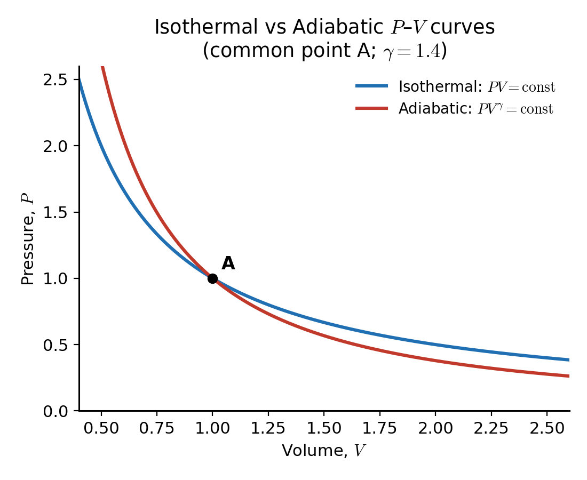
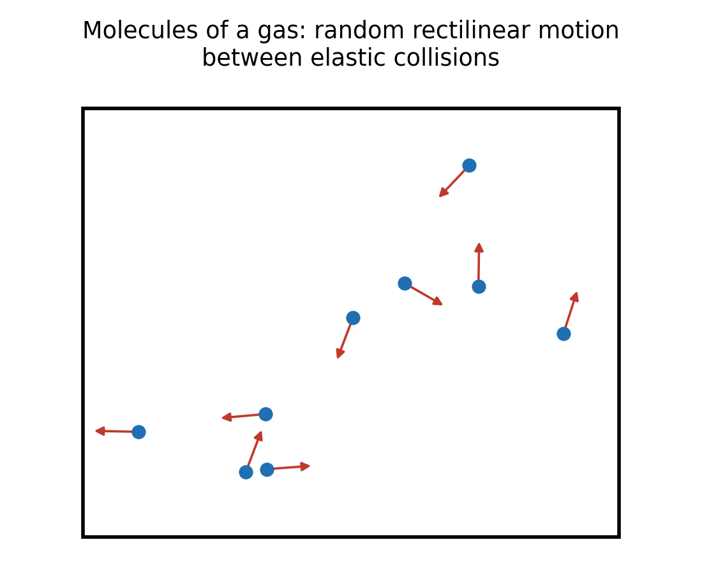
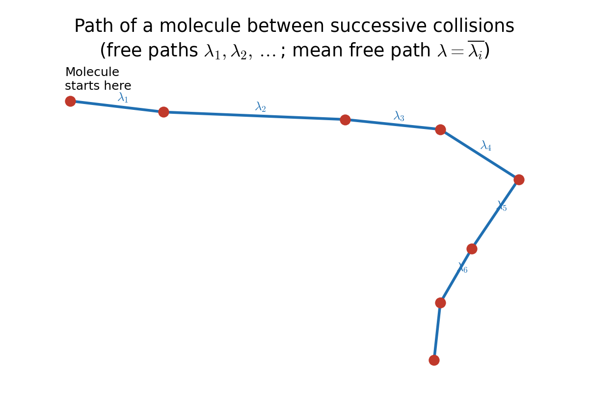
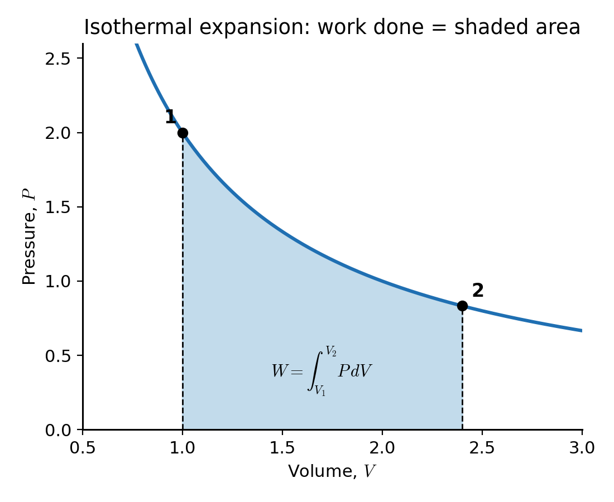
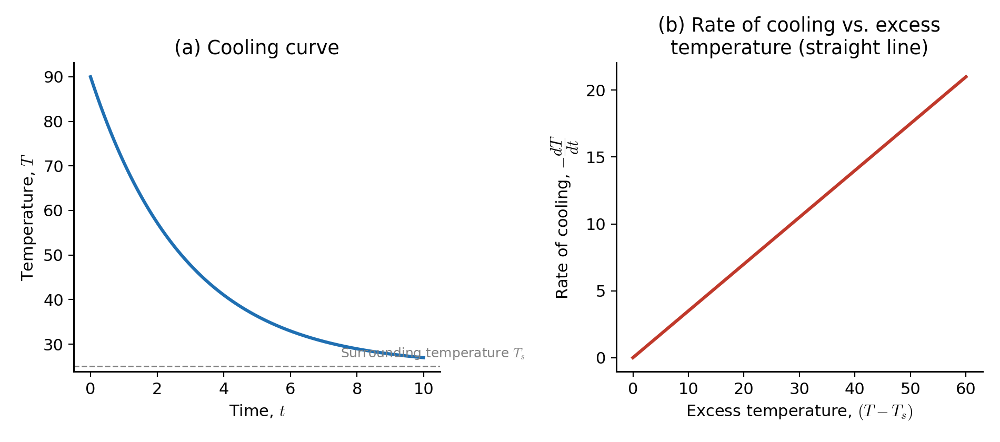
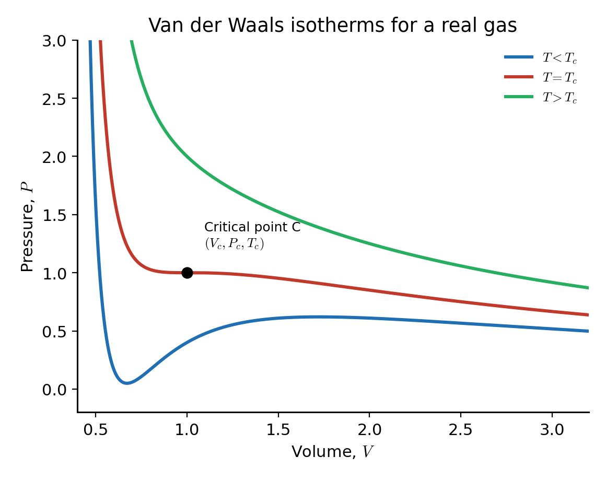
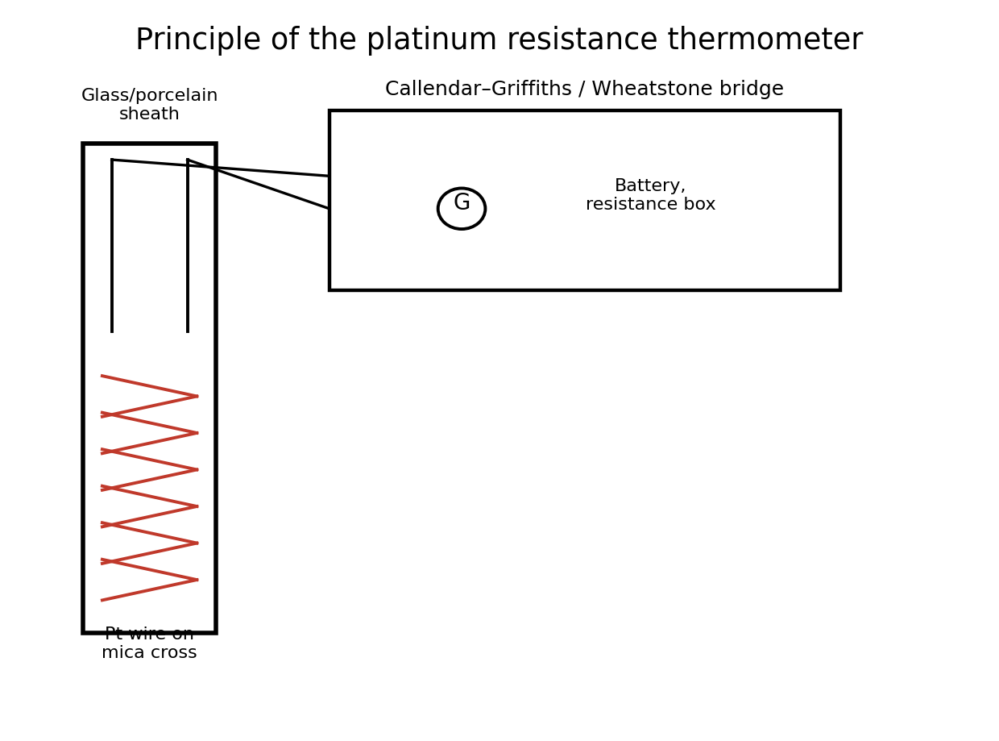
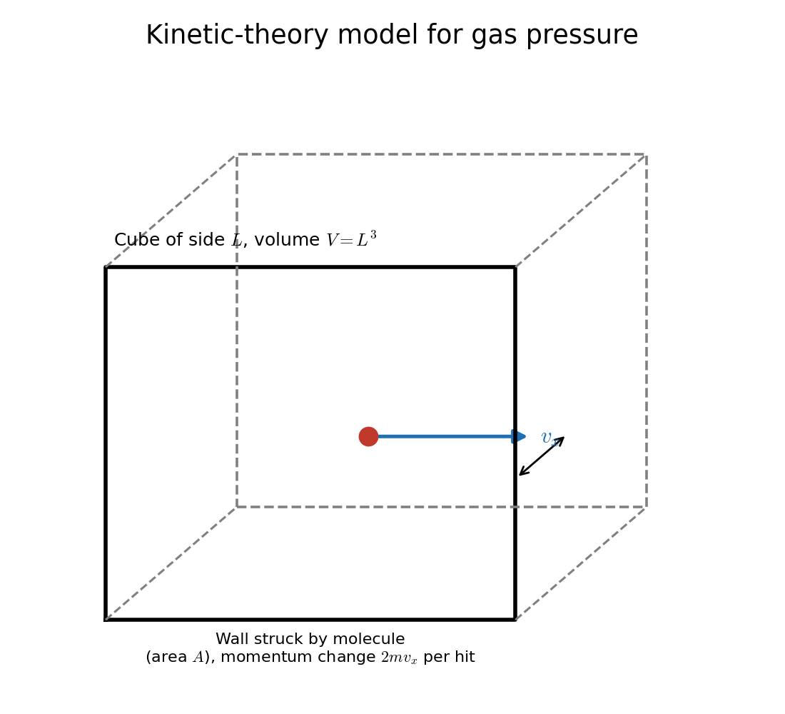

# Physics Answer Sheet

## Kinetic Theory of Gases & Thermal Physics

> **Source note:** All 22 questions below are reproduced from the uploaded scan in their original numbering, wording, and year grouping. Question 17 is marked in the source as partially visible ("… state Van-der-Waal's equation") — the missing lead-in text is **not** reconstructed; only the legible portion is answered. Question 20 is an electromagnetism question (self-inductance) that appears in the same "Not dated" block as the kinetic-theory questions and is answered here for completeness of coverage.

---

## 2023

### 1. Show that the adiabatic curves are steeper / higher than isothermal curves. `[5. (a)]`

**Answer:**

**Isothermal process** (constant $T$): from Boyle's law,

$$
PV = \text{constant} = C_1
$$

Differentiating with respect to $V$:

$$
P\,dV + V\,dP = 0 \quad\Rightarrow\quad \left(\frac{dP}{dV}\right)_{\text{iso}} = -\frac{P}{V}
$$

**Adiabatic process** (no heat exchange, $Q=0$): from the adiabatic gas equation,

$$
PV^{\gamma} = \text{constant} = C_2,\qquad \gamma = \frac{C_p}{C_v}
$$

Differentiating with respect to $V$:

$$
V^{\gamma}\,dP + P\,\gamma V^{\gamma-1}\,dV = 0
$$

$$
\left(\frac{dP}{dV}\right)_{\text{adia}} = -\gamma\frac{P}{V}
$$

**Comparison at a common point A $(P,V)$:**

$$
\left(\frac{dP}{dV}\right)_{\text{adia}} = \gamma\left(\frac{dP}{dV}\right)_{\text{iso}}
$$

Since $\gamma = C_p/C_v > 1$ for every real gas (monatomic $\gamma=1.67$, diatomic $\gamma=1.4$),

$$
\left|\left(\frac{dP}{dV}\right)_{\text{adia}}\right| > \left|\left(\frac{dP}{dV}\right)_{\text{iso}}\right|
$$

$$
\boxed{\text{Slope of adiabatic curve} = \gamma \times \text{Slope of isothermal curve}}
$$

**Physical interpretation:** In an adiabatic compression, the temperature itself rises (no heat leaves the gas), which pushes the pressure up faster than a compression at constant temperature. Hence, at any point they cross, the adiabatic $P$–$V$ curve is steeper (rises higher for the same $dV$) than the isothermal curve.

---

### 2. Define degrees of freedom. Describe the fundamental postulates of gas molecules. `[7. (a)]`

**Answer:**

**Definition:**
The number of degrees of freedom of a molecule is the total number of independent coordinates (or independent modes of motion) required to completely specify its position, configuration, and energy state in space.

For a system of $N$ point particles with $k$ independent constraint equations,

$$
f = 3N - k
$$

**Examples**

| Molecule type | Translational | Rotational | Total $f$ |
|---|---|---|---|
| Monatomic (e.g. He, Ar) | 3 | 0 | 3 |
| Diatomic (e.g. $O_2$, $N_2$), rigid | 3 | 2 | 5 |
| Triatomic non-linear (e.g. $H_2O$) | 3 | 3 | 6 |

Each degree of freedom, by the **law of equipartition of energy**, is associated on average with energy $\tfrac{1}{2}k_BT$ per molecule.

**Fundamental postulates of the kinetic theory of gases**

1. A gas consists of a very large number of identical molecules, treated as rigid, perfectly elastic spheres whose actual size is negligible compared to the average distance between them (they are effectively point masses).
2. The molecules are in a state of continuous, random translational motion, moving with all possible speeds and in all directions with equal probability (isotropy).
3. Molecules exert **no force on one another** except during the instant of collision — between collisions each molecule moves in a straight line with constant velocity, obeying Newton's laws of motion.
4. Collisions between molecules, and between molecules and the walls of the container, are **perfectly elastic** — kinetic energy and momentum are conserved in every collision.
5. The duration of a collision is negligibly small compared with the time a molecule spends travelling freely between two successive collisions.
6. The density and distribution of molecules is uniform throughout the container, so the gas is homogeneous.
7. The pressure exerted by the gas on the walls of the container arises purely from the continual bombardment (momentum transfer) of molecules on the walls.
8. Although individual molecular velocities constantly change due to collisions, the **statistical distribution of velocities** (the Maxwell–Boltzmann distribution) remains constant at a given temperature — the gas as a whole is in a steady statistical state.
9. The effect of gravity on molecular motion is neglected.

---

### 3. What is mean free path? Derive an expression for mean free path. `[7. (b)]`

**Answer:**

**Definition:**
The **mean free path** ($\lambda$) of a gas molecule is the average distance travelled by the molecule between two successive collisions with other molecules.

$$
\lambda = \frac{\text{total distance travelled in time } t}{\text{number of collisions in time } t}
$$

**Derivation (elementary treatment — target molecules assumed stationary):**

Consider a molecule of diameter $d$ moving with mean speed $\bar{c}$ through a gas containing $n$ molecules per unit volume. Two molecules collide whenever their centres approach within a distance $d$ of each other. Hence the moving molecule can be imagined to sweep out an effective cylinder of radius $d$ (cross-sectional area $\sigma = \pi d^2$, called the **collision cross-section**) as it travels.

In one second, the length of the cylinder swept out is $\bar{c}$, so the volume swept is

$$
\text{Volume swept per second} = \pi d^2 \bar{c}
$$

Number of collisions suffered per second (= number of molecules whose centres lie inside this cylinder):

$$
Z = n\,\pi d^2 \bar{c}
$$

Since the molecule travels a distance $\bar{c}$ in one second and makes $Z$ collisions in that time, the mean free path is:

$$
\lambda = \frac{\bar{c}}{Z} = \frac{\bar{c}}{n\pi d^2\bar{c}} = \frac{1}{\pi d^2 n} \quad \text{(elementary result)}
$$

**Correction for the motion of all molecules (Maxwellian treatment):**

The elementary derivation above wrongly assumes only the *test* molecule moves. When all molecules are moving with a Maxwellian speed distribution, the **relevant relative speed** between colliding pairs is $\sqrt{2}\,\bar{c}$ instead of $\bar{c}$. Repeating the derivation with the relative speed:

$$
Z = n\,\pi d^2\,(\sqrt{2}\,\bar{c})
$$

$$
\boxed{\lambda = \frac{\bar{c}}{Z} = \frac{1}{\sqrt{2}\,\pi d^2 n}}
$$

where:

$$
d = \text{molecular diameter},\qquad n = \text{number density of molecules (molecules/m}^3)
$$

This corrected form, $\lambda = 1/(\sqrt{2}\pi d^2 n)$, is the standard expression used in kinetic theory.

---

### 4. The mean free path of nitrogen molecule at 0°C and 1 atm pressure is $0.8\times10^{-7}$ m. At this temperature and pressure its density is $2.7\times10^{19}$ molecules/cm³. What is the molecular diameter? `[7. (c)]`

**Answer:**

### Given

$$
\lambda = 0.8\times10^{-7}\ \text{m}, \qquad n = 2.7\times10^{19}\ \text{molecules/cm}^3 = 2.7\times10^{25}\ \text{molecules/m}^3
$$

### Required

$$
d = \text{molecular diameter of nitrogen}
$$

### Formula

Using the (Maxwell-corrected) mean-free-path expression derived in Q.3:

$$
\lambda = \frac{1}{\sqrt{2}\,\pi d^2 n} \quad\Rightarrow\quad d = \sqrt{\dfrac{1}{\sqrt{2}\,\pi\, n\, \lambda}}
$$

### Substitution

$$
d = \sqrt{\dfrac{1}{\sqrt{2}\times\pi\times(2.7\times10^{25})\times(0.8\times10^{-7})}}
$$

### Calculation

$$
\sqrt{2}\,\pi = 4.443
$$

$$
n\lambda = (2.7\times10^{25})(0.8\times10^{-7}) = 2.16\times10^{18}\ \text{m}^{-1}
$$

$$
\sqrt{2}\,\pi\, n\,\lambda = 4.443 \times 2.16\times10^{18} = 9.60\times10^{18}\ \text{m}^{-1}
$$

$$
d^2 = \frac{1}{9.60\times10^{18}} = 1.042\times10^{-19}\ \text{m}^2
$$

$$
d = \sqrt{1.042\times10^{-19}} = 3.23\times10^{-10}\ \text{m}
$$

### Answer

$$
\boxed{d \approx 3.23\times10^{-10}\ \text{m} = 3.23\ \text{Å} = 0.323\ \text{nm}}
$$

This is of the correct order of magnitude for a nitrogen molecule's kinetic diameter (the accepted spectroscopic value is close to $3.7$ Å; the small difference is expected because the mean-free-path method is only an effective, collision-cross-section estimate).

---

## 2022

### 5. Show that the work done is directly proportional to kinetic energy of theory of gases. `[4. (a)]`

**Answer:**

**Starting point — pressure of a gas from kinetic theory:**

$$
P = \frac{1}{3}\frac{Nm\bar{c}^2}{V}
$$

where $N$ = number of molecules, $m$ = mass of one molecule, $\bar{c}^2$ = mean square speed, $V$ = volume.

Multiplying both sides by $V$:

$$
PV = \frac{1}{3}Nm\bar{c}^2
$$

The total translational kinetic energy of all the gas molecules is:

$$
E = N\times\frac{1}{2}m\bar{c}^2 = \frac{1}{2}Nm\bar{c}^2
$$

so that $Nm\bar{c}^2 = 2E$. Substituting:

$$
PV = \frac{1}{3}(2E) = \frac{2}{3}E
$$

$$
\boxed{PV = \frac{2}{3}E \quad\Longleftrightarrow\quad E = \frac{3}{2}PV}
$$

**Connection to work done:** For any process in which a gas changes its volume (e.g. an isothermal expansion from $V_1$ to $V_2$), the elementary work done by the gas is $dW = P\,dV$, and quantities such as $\int P\,dV$ therefore scale directly with the product $PV$. Since $PV = \tfrac{2}{3}E$ at every instant, the pressure–volume product — and hence the work the gas is capable of doing — is **directly proportional to the total translational kinetic energy $E$ of its molecules**:

$$
W \propto PV \propto E
$$

Doubling the mean kinetic energy of the molecules (e.g. by doubling $T$, since $E\propto T$) doubles $PV$ and therefore doubles the work obtainable from a given expansion ratio.

---

## 2021

### 6. What is isothermal process? Derive an expression of work done during isothermal process. `[5. (b)]`

**Answer:**

**Definition:**
An **isothermal process** is a thermodynamic process that occurs at **constant temperature** ($T = \text{constant}$, $dT = 0$). Since the internal energy of an ideal gas depends only on temperature, $dU = 0$ throughout the process, so by the first law of thermodynamics ($dQ = dU + dW$), all the heat supplied is used entirely to do external work: $dQ = dW$.

For an ideal gas undergoing an isothermal process, Boyle's Law applies:

$$
PV = \text{constant}
$$

**Derivation of work done:**

Consider $n$ moles of an ideal gas expanding isothermally and quasi-statically from volume $V_1$ to $V_2$ at temperature $T$. The elementary work done by the gas in an infinitesimal expansion $dV$ is:

$$
dW = P\,dV
$$

From the ideal gas equation, $PV = nRT \Rightarrow P = \dfrac{nRT}{V}$. Substituting:

$$
dW = \frac{nRT}{V}\,dV
$$

Total work done as the gas expands from $V_1$ to $V_2$ (T constant, so it comes out of the integral):

$$
W = \int_{V_1}^{V_2} \frac{nRT}{V}\,dV = nRT\int_{V_1}^{V_2}\frac{dV}{V} = nRT\Big[\ln V\Big]_{V_1}^{V_2}
$$

$$
\boxed{W = nRT\ln\left(\frac{V_2}{V_1}\right) = 2.303\,nRT\log_{10}\left(\frac{V_2}{V_1}\right)}
$$

Since $P_1V_1 = P_2V_2 = nRT$ (Boyle's Law), this can equivalently be written as:

$$
W = P_1V_1\ln\left(\frac{V_2}{V_1}\right) = nRT\ln\left(\frac{P_1}{P_2}\right)
$$

Graphically, $W$ equals the **area under the $P$–$V$ curve** between $V_1$ and $V_2$ (the shaded region above). If the gas expands, $V_2>V_1$, $W>0$ (gas does positive work on the surroundings); if it is compressed, $W<0$ (work is done on the gas).

---

### 7. Calculate the average kinetic energy of a molecule of a gas at the temperature 300K. `[5. (c)]`

**Answer:**

### Given

$$
T = 300\ \text{K}, \qquad k_B = 1.38\times10^{-23}\ \text{J/K (Boltzmann constant)}
$$

### Required

$$
\bar{\varepsilon} = \text{average translational kinetic energy of one molecule}
$$

### Formula

From kinetic theory, $PV = \tfrac{1}{3}Nm\bar{c}^2$, and for an ideal gas $PV = Nk_BT$. Equating:

$$
\frac{1}{3}Nm\bar{c}^2 = Nk_BT \quad\Rightarrow\quad \frac{1}{2}m\bar{c}^2 = \frac{3}{2}k_BT
$$

$$
\bar{\varepsilon} = \frac{3}{2}k_BT
$$

(This is the equipartition result: $\tfrac12 k_BT$ for each of the 3 translational degrees of freedom.)

### Substitution

$$
\bar{\varepsilon} = \frac{3}{2}\times(1.38\times10^{-23}\ \text{J/K})\times(300\ \text{K})
$$

### Calculation

$$
\bar{\varepsilon} = 1.5\times 1.38\times10^{-23}\times300 = 1.5\times 4.14\times10^{-21}
$$

$$
\bar{\varepsilon} = 6.21\times10^{-21}\ \text{J}
$$

### Answer

$$
\boxed{\bar{\varepsilon} = 6.21\times10^{-21}\ \text{J} \approx 0.0388\ \text{eV per molecule}}
$$

---

### 8. Explain Newton's law of cooling. `[6. (a)]`

**Answer:**

**Statement:**
Newton's law of cooling states that the rate at which a hot body loses heat (and hence the rate of fall of its temperature) is **directly proportional to the excess of its temperature over the temperature of the surroundings**, provided this excess is small (typically less than about 30 °C) and heat is lost mainly by convection and radiation (not forced conditions).

**Mathematical form:**

If $T$ is the instantaneous temperature of the body and $T_s$ is the (constant) surrounding temperature,

$$
-\frac{dT}{dt} \propto (T - T_s)
$$

$$
-\frac{dT}{dt} = k(T-T_s)
$$

where $k$ is a positive constant depending on the nature of the surface, its area, and the surrounding conditions. The negative sign shows temperature decreasing with time.

**Derivation of the cooling curve:**

Separating variables and integrating, with $T=T_0$ at $t=0$:

$$
\int_{T_0}^{T}\frac{dT}{T-T_s} = -k\int_0^t dt
$$

$$
\ln\left(\frac{T-T_s}{T_0-T_s}\right) = -kt
$$

$$
\boxed{T = T_s + (T_0-T_s)\,e^{-kt}}
$$

so the excess temperature $(T-T_s)$ decays **exponentially** with time.

**Experimental verification:** A plot of $\ln(T-T_s)$ against $t$ gives a straight line of slope $-k$ (graph (a) is the raw exponential; taking its log linearises it). Equivalently, a plot of the rate of cooling $(-dT/dt)$ against the excess temperature $(T-T_s)$ gives a straight line through the origin, as in graph (b) above — this straight line is the standard experimental confirmation of the law.

**Conditions of validity / limitations:**
- Valid only for **small** temperature excess over the surroundings.
- Loss of heat should be by natural convection and radiation, not forced convection.
- Surrounding temperature $T_s$ must remain constant.
- Breaks down at large temperature differences, where radiative loss follows the (non-linear) Stefan–Boltzmann $T^4$ law instead; Newton's law is essentially the low-$\Delta T$ linear approximation of the more general radiative/convective cooling laws.

---

## 2020

### 9. What are the critical constants of a gas? Calculate the values of these constants in terms of the constants of the Vander Waals equation. `[4. (a)]`

**Answer:**

**Definition:**
The **critical constants** of a gas are the values of pressure, volume, and temperature — the **critical pressure** $P_c$, **critical volume** $V_c$, and **critical temperature** $T_c$ — at the **critical point**, the unique state at which the distinction between the liquid and gaseous phases disappears (the isotherm has a horizontal point of inflection there).

**Derivation from the Van der Waals equation:**

For 1 mole of a real gas,

$$
\left(P+\frac{a}{V^2}\right)(V-b) = RT
$$

Expanding and multiplying through by $V^2$:

$$
PV^3 -(Pb+RT)V^2 + aV - ab = 0
$$

Dividing by $P$:

$$
V^3 - \left(b+\frac{RT}{P}\right)V^2 + \frac{a}{P}V - \frac{ab}{P} = 0 \qquad (*)
$$

At the critical point, this cubic in $V$ has **three equal roots**, all equal to $V_c$ (the critical isotherm has a horizontal inflection, so $(V-V_c)^3=0$):

$$
(V-V_c)^3 = V^3 - 3V_cV^2 + 3V_c^2V - V_c^3 = 0
$$

Comparing coefficients with equation $(*)$ (evaluated at $P=P_c,\ T=T_c$):

$$
3V_c = b + \frac{RT_c}{P_c} \qquad (i)
$$

$$
3V_c^2 = \frac{a}{P_c} \qquad (ii)
$$

$$
V_c^3 = \frac{ab}{P_c} \qquad (iii)
$$

**Solving:** Dividing (iii) by (ii):

$$
\frac{V_c^3}{3V_c^2} = \frac{ab/P_c}{a/P_c} = b \quad\Rightarrow\quad \frac{V_c}{3} = b \quad\Rightarrow\quad \boxed{V_c = 3b}
$$

Substituting into (ii):

$$
P_c = \frac{a}{3V_c^2} = \frac{a}{3(3b)^2} \quad\Rightarrow\quad \boxed{P_c = \frac{a}{27b^2}}
$$

Substituting $V_c=3b$ and $P_c=a/27b^2$ into (i):

$$
3(3b) = b + \frac{RT_c}{a/27b^2} \quad\Rightarrow\quad 9b-b = \frac{27b^2RT_c}{a}
$$

$$
8b = \frac{27b^2RT_c}{a}\quad\Rightarrow\quad T_c = \frac{8ab}{27b^2R}\quad\Rightarrow\quad \boxed{T_c = \frac{8a}{27Rb}}
$$

**Summary — critical constants in terms of Van der Waals constants $a,b$:**

$$
V_c = 3b, \qquad P_c = \frac{a}{27b^2}, \qquad T_c = \frac{8a}{27Rb}
$$

A useful check is the **critical coefficient**, which the Van der Waals equation predicts to be a universal constant for all gases:

$$
\frac{P_cV_c}{RT_c} = \frac{3}{8} = 0.375
$$

---

### 10. Describe the principle of a platinum resistance thermometer. Discuss its advantages and disadvantages. `[4. (b)]`

**Answer:**

**Principle:**
The electrical resistance of a pure platinum wire increases almost linearly with temperature over a wide range. By measuring this resistance accurately (usually with a Wheatstone-bridge type circuit, such as the **Callendar–Griffiths bridge**), the temperature of the surroundings of the wire can be deduced.

A fine platinum wire is wound non-inductively on a mica or silica cross/frame (to allow free thermal expansion without residual strain) and enclosed in a protective glass or porcelain sheath. Leads (with compensating leads to cancel lead-wire resistance) connect it to the bridge.

A first ("platinum-scale") estimate of temperature is obtained from the linear interpolation formula:

$$
t_{pt} = \frac{R_t - R_0}{R_{100}-R_0}\times 100\ ^\circ\text{C}
$$

where $R_0, R_{100}, R_t$ are the resistances at 0 °C, 100 °C, and the unknown temperature respectively. Because platinum's resistance–temperature relation is not perfectly linear, this is refined using **Callendar's equation** (see Q.11) to get the true Celsius temperature.

**Advantages**

- High melting point and chemical inertness — platinum resists oxidation and corrosion, so it can be used over a very wide range, roughly $-200\,^\circ\text{C}$ to $1200\,^\circ\text{C}$.
- Excellent reproducibility and long-term stability — platinum can be obtained in very pure form, giving highly repeatable readings.
- High precision — capable of resolving temperature differences as small as $0.01\,^\circ\text{C}$.
- Because it is an electrical measurement, readings can be transmitted, recorded, or automated easily and taken from a distance.
- It is used as one of the interpolation standards in the International Temperature Scale between the triple point of hydrogen and the freezing point of antimony.

**Disadvantages**

- Expensive, since platinum is a precious metal.
- Fragile — the fine wire and delicate winding are easily damaged by mechanical shock or vibration.
- Relatively large thermal capacity/mass compared with, e.g., a thermocouple, giving a **slower response time** — unsuitable for rapidly fluctuating temperatures.
- Self-heating: the measuring current itself dissipates a little power ($I^2R$) in the wire, introducing a small systematic error unless the current is kept very small.
- Requires a bridge circuit and correction (lead-resistance compensation, Callendar correction) rather than a direct readout, making it more complex than a liquid-in-glass thermometer.

---

### 11. The values of resistances of a platinum resistance thermometer are 2.585 ohms and 3.510 ohms at 0°C and 100°C respectively. When placed in a hot bath, the resistance is found to be 9.098 ohms. Calculate the temperature of the hot bath on the gas scale. Assume δ = 1.5 for platinum. `[4. (c)]`

**Answer:**

### Given

$$
R_0 = 2.585\ \Omega,\quad R_{100} = 3.510\ \Omega,\quad R_t = 9.098\ \Omega,\quad \delta = 1.5
$$

### Required

$$
t = \text{temperature of the hot bath on the gas (Celsius) scale}
$$

### Formula

**Step 1 — platinum scale temperature** (linear interpolation):

$$
t_{pt} = \frac{R_t-R_0}{R_{100}-R_0}\times 100
$$

**Step 2 — Callendar's correction** to convert to the true gas-scale temperature $t$:

$$
t - t_{pt} = \delta\left(\frac{t}{100}\right)\left(\frac{t}{100}-1\right)
$$

### Substitution and Calculation

**Step 1:**

$$
t_{pt} = \frac{9.098-2.585}{3.510-2.585}\times100 = \frac{6.513}{0.925}\times100 = 704.1\ ^\circ\text{C}
$$

**Step 2:** Substitute $t_{pt}=704.1$, $\delta=1.5$ into Callendar's equation and solve for $t$:

$$
t - 704.1 = 1.5\left(\frac{t}{100}\right)\left(\frac{t}{100}-1\right) = 0.00015\,t^2 - 0.015\,t
$$

$$
0.00015\,t^2 - 1.015\,t + 704.1 = 0
$$

Multiplying through by $1/0.00015$:

$$
t^2 - 6766.7\,t + 4{,}694{,}000 = 0
$$

Applying the quadratic formula:

$$
t = \frac{6766.7 \pm \sqrt{6766.7^2 - 4(4{,}694{,}000)}}{2} = \frac{6766.7\pm\sqrt{27{,}011{,}800}}{2} = \frac{6766.7\pm 5197.3}{2}
$$

Taking the physically sensible root (the other root, $\approx 5982\,^\circ\text{C}$, is unphysically large for a "hot bath"):

$$
t = \frac{6766.7 - 5197.3}{2} = \frac{1569.4}{2}
$$

**Check by back-substitution:** at $t=784.7$: correction $=1.5(7.847)(6.847)=80.6$, and $t_{pt}+80.6 = 704.1+80.6=784.7\ ^\circ\text{C}$ ✓ (self-consistent).

### Answer

$$
\boxed{t \approx 784.7\ ^\circ\text{C}}
$$

---

### 12. Define molar specific heat. Find the relation between Cp and Cv. `[(c)]`

**Answer:**

**Definition:**
The **molar specific heat** of a substance is the amount of heat required to raise the temperature of **one mole** of the substance through 1 K (or 1 °C). For a gas, its value depends on the conditions under which heat is added, giving two principal values:

- $C_v$ — molar specific heat **at constant volume**
- $C_p$ — molar specific heat **at constant pressure**

$$
C_v = \left(\frac{dQ}{dT}\right)_V, \qquad C_p = \left(\frac{dQ}{dT}\right)_P
$$

**Derivation of $C_p - C_v = R$ (Mayer's relation):**

By the first law of thermodynamics, for 1 mole of gas:

$$
dQ = dU + P\,dV
$$

**At constant volume** ($dV=0$): $dQ = dU$, so

$$
C_v = \left(\frac{dU}{dT}\right)_V = \frac{dU}{dT}
$$

(for an ideal gas $U$ depends only on $T$, so the partial derivative equals the total derivative).

**At constant pressure:**

$$
C_p = \left(\frac{dQ}{dT}\right)_P = \frac{dU}{dT} + P\left(\frac{dV}{dT}\right)_P
$$

$$
C_p = C_v + P\left(\frac{dV}{dT}\right)_P
$$

For 1 mole of an ideal gas, $PV = RT$. Differentiating with respect to $T$ at constant $P$:

$$
P\left(\frac{dV}{dT}\right)_P = R
$$

Substituting:

$$
\boxed{C_p - C_v = R}
$$

This is **Mayer's relation** — the difference between the molar specific heats of an ideal gas at constant pressure and constant volume equals the universal gas constant $R$ ($\approx 8.314\ \text{J mol}^{-1}\text{K}^{-1}$). Physically, $C_p>C_v$ because at constant pressure some of the heat supplied must also do external work $P\,dV$ as the gas expands, in addition to raising its internal energy.

---

## 2019

### 13. Differentiate between heat and temperature. `[4. (a)]`

**Answer:**

| Heat | Temperature |
|---|---|
| A form of energy that is transferred between two bodies (or a body and its surroundings) because of a difference in temperature. | A measure of the degree of hotness or coldness of a body; determines the direction of heat flow. |
| An extensive, path-dependent quantity — depends on the mass, material, and the specific process. | An intensive property — does not depend on the amount (mass) of the substance. |
| SI unit: joule (J) (sometimes calorie). | SI unit: kelvin (K) (also °C, °F). |
| Measured using a calorimeter. | Measured using a thermometer. |
| Flows spontaneously from a body at higher temperature to one at lower temperature. | Is the quantity whose *difference* determines whether/how heat will flow — heat does not flow because of "high" or "low" temperature alone, but because of a temperature *difference*. |
| Can be zero even if a body has a well-defined temperature (a body at 300 K in isolation is exchanging no heat with anything). | Every body possesses a definite temperature at thermal equilibrium, whether or not heat is flowing. |
| Defined thermodynamically via the first law: $dQ = dU + dW$. | Defined via the zeroth law of thermodynamics — the common property shared by systems in mutual thermal equilibrium. |

---

### 14. Show that the difference between the specific heat at constant pressure and specific heat at constant volume of a gas is equal to the characteristic gas constant of the gas. `[4. (b)]`

**Answer:**

Let $c_p, c_v$ be the **specific** heats (heat capacity **per unit mass**) at constant pressure and constant volume, and let $r$ be the **specific (characteristic) gas constant** of the gas (i.e. $r = R/M$, where $M$ is the molar mass), so that for unit mass of gas:

$$
Pv = rT
$$

where $v$ is the specific volume (volume per unit mass).

**Applying the first law of thermodynamics to unit mass of gas:**

$$
dq = du + P\,dv
$$

**At constant volume** ($dv=0$):

$$
c_v = \left(\frac{dq}{dT}\right)_v = \frac{du}{dT}
$$

**At constant pressure:**

$$
c_p = \left(\frac{dq}{dT}\right)_P = \frac{du}{dT} + P\left(\frac{dv}{dT}\right)_P = c_v + P\left(\frac{dv}{dT}\right)_P
$$

Differentiating the characteristic gas equation $Pv=rT$ with respect to $T$ at constant $P$:

$$
P\left(\frac{dv}{dT}\right)_P = r
$$

Substituting:

$$
\boxed{c_p - c_v = r}
$$

Hence the difference between the specific heats at constant pressure and constant volume of a gas equals its **characteristic (specific) gas constant** $r$. (This is the per-unit-mass form of Mayer's relation derived in Q.12, where the molar version gives $C_p-C_v=R$; dividing throughout by molar mass $M$ gives $c_p-c_v = R/M = r$.)

---

### 15. According to the principle of kinetic theory of gases, prove that the pressure exerted by a perfect gas is given by $P = \dfrac{1}{3}\dfrac{mnc^2}{V}$, where the symbols have their usual meaning. `[6.]`

**Answer:**

**Setup:** Consider $n$ molecules, each of mass $m$, enclosed in a cubical container of side $L$ (volume $V=L^3$). Let a molecule have velocity components $(v_x, v_y, v_z)$ along the three mutually perpendicular edges of the cube, so that its speed $c$ satisfies $c^2 = v_x^2+v_y^2+v_z^2$.

**Momentum change per collision:** Consider the molecule's motion along the $x$-axis, striking the wall (area $L^2$) perpendicular to $x$. Since collisions with the wall are perfectly elastic, the molecule rebounds with velocity $-v_x$. Change in momentum of the molecule per collision:

$$
\Delta p = mv_x - (-mv_x) = 2mv_x
$$

**Time between successive collisions with the same wall:** The molecule must travel to the opposite wall and back, a distance $2L$, at speed $v_x$:

$$
\Delta t = \frac{2L}{v_x}
$$

**Force exerted by one molecule on the wall** (rate of momentum transfer):

$$
F_1 = \frac{\Delta p}{\Delta t} = \frac{2mv_x}{2L/v_x} = \frac{mv_x^2}{L}
$$

**Total force from all $n$ molecules** along $x$ (using the mean square $x$-velocity, $\overline{v_x^2}$):

$$
F = \frac{m}{L}\sum v_x^2 = \frac{nm\,\overline{v_x^2}}{L}
$$

**Pressure on the wall** (force per unit area, $A=L^2$):

$$
P = \frac{F}{L^2} = \frac{nm\,\overline{v_x^2}}{L^3} = \frac{nm\,\overline{v_x^2}}{V}
$$

**Isotropy of molecular motion:** since molecular motion is completely random, there is no preferred direction, so:

$$
\overline{v_x^2} = \overline{v_y^2} = \overline{v_z^2}
$$

and since $\overline{c^2} = \overline{v_x^2}+\overline{v_y^2}+\overline{v_z^2} = 3\,\overline{v_x^2}$,

$$
\overline{v_x^2} = \frac{\overline{c^2}}{3}
$$

Substituting back:

$$
P = \frac{nm}{V}\times\frac{\overline{c^2}}{3}
$$

$$
\boxed{P = \frac{1}{3}\,\frac{mn\overline{c^2}}{V}}
$$

where $m$ = mass of a molecule, $n$ = number of molecules, $\overline{c^2}$ = mean square speed, $V$ = volume of the container. This is the fundamental pressure equation of the kinetic theory of gases.

---

## 2018

### 16. Show that the pressure exerted by a perfect gas is 2/3 of the kinetic energy of the gas molecules in a unit volume. `[(b)]`

**Answer:**

From Q.15, the fundamental pressure relation of kinetic theory (for $n$ molecules in volume $V$) is:

$$
P = \frac{1}{3}\,\frac{mn\overline{c^2}}{V}
$$

which can be rewritten as:

$$
P = \frac{2}{3}\times\left(\frac{1}{2}\,\frac{mn\overline{c^2}}{V}\right)
$$

Now, $\dfrac{1}{2}m\overline{c^2}$ is the average translational kinetic energy of **one** molecule, so the total translational kinetic energy of all $n$ molecules is $\dfrac{1}{2}mn\overline{c^2}$, and the kinetic energy **per unit volume** is:

$$
E = \frac{\text{Total KE}}{V} = \frac{1}{2}\,\frac{mn\overline{c^2}}{V}
$$

Substituting into the expression for $P$:

$$
\boxed{P = \frac{2}{3}E}
$$

**Conclusion:** The pressure exerted by a perfect gas is exactly two-thirds of the total translational kinetic energy of its molecules contained in unit volume. This result directly links the macroscopic, measurable quantity $P$ to the microscopic kinetic energy of molecular motion, and (via $E\propto T$) is the bridge between kinetic theory and the ideal-gas temperature scale.

---

### 17. … state Van-der-Waal's equation. `[5. (a)]`

> **Source note:** The uploaded scan shows this question as partially visible/cropped — only the trailing clause "… state Van-der-Waal's equation" is legible. The missing lead-in wording (likely asking to first state the ideal gas equation and its limitations before introducing the Van der Waals correction) is **not** reconstructed here. Only the visible, supported portion is answered below.

**Answer (visible portion only): Van der Waals' equation**

The ideal gas equation $PV = RT$ assumes point-sized molecules with no mutual forces, and fails to describe real gases, especially at high pressure and low temperature. Van der Waals introduced two correction terms to account for (i) the finite size of molecules and (ii) intermolecular attraction (see Q.22 for the full derivation of these corrections). The resulting equation of state, for **one mole** of a real gas, is:

$$
\boxed{\left(P + \frac{a}{V^2}\right)(V-b) = RT}
$$

and for $n$ moles occupying volume $V$:

$$
\left(P + \frac{an^2}{V^2}\right)(V-nb) = nRT
$$

where:

$$
P = \text{observed pressure},\quad V = \text{molar volume},\quad T = \text{absolute temperature}
$$

$$
a = \text{measure of intermolecular attraction (units: Pa·m}^6\text{mol}^{-2}\text{)}
$$

$$
b = \text{co-volume, related to the finite size of molecules (units: m}^3\text{mol}^{-1}\text{)}
$$

$a$ and $b$ are constants characteristic of the particular gas (**Van der Waals constants**), determined empirically or from the critical constants (see Q.18).

---

### 18. Deduce the values of Van-der-Waal constant. `[5. (b)]`

**Answer:**

From Q.9, the critical constants of a Van der Waals gas were found, in terms of $a$ and $b$, to be:

$$
V_c = 3b \qquad (i), \qquad P_c = \frac{a}{27b^2}\qquad (ii), \qquad T_c = \frac{8a}{27Rb}\qquad(iii)
$$

We now invert these relations to express the **Van der Waals constants $a, b$** in terms of the experimentally measurable critical constants $P_c, V_c, T_c$.

**Finding $b$:** From (i) directly,

$$
\boxed{b = \frac{V_c}{3}}
$$

**Finding $a$:** From (ii),

$$
a = 27P_cb^2
$$

Substituting $b = V_c/3$:

$$
a = 27P_c\left(\frac{V_c}{3}\right)^2 = 27P_c\times\frac{V_c^2}{9}
$$

$$
\boxed{a = 3P_cV_c^2}
$$

**Finding $R$ in terms of critical constants (consistency check):** From (iii),

$$
R = \frac{8a}{27bT_c}
$$

Substituting $a=3P_cV_c^2$ and $b=V_c/3$:

$$
R = \frac{8(3P_cV_c^2)}{27\left(\dfrac{V_c}{3}\right)T_c} = \frac{24P_cV_c^2}{9V_cT_c} = \frac{8P_cV_c}{3T_c}
$$

$$
\boxed{R = \frac{8P_cV_c}{3T_c}}
$$

**Summary:**

$$
a = 3P_cV_c^2, \qquad b = \frac{V_c}{3}, \qquad R = \frac{8P_cV_c}{3T_c}
$$

These allow the Van der Waals constants of any real gas to be calculated directly from its experimentally measured critical pressure, volume, and temperature.

---

### 19. Deduce the relation between pressure and kinetic energy of gas or $[P = 2/3\ E]$. `[(b)]`

**Answer:**

*(This question asks for the same physical result as Q.16, from the same source paper; it is answered here independently and in full, as required.)*

Starting from the ideal-gas form of the kinetic-theory pressure relation for $n$ molecules of mass $m$ in volume $V$ (derived in Q.15):

$$
PV = \frac{1}{3}nm\overline{c^2}
$$

The average translational kinetic energy of a single molecule is $\bar{\varepsilon} = \tfrac{1}{2}m\overline{c^2}$, so the **total** kinetic energy of all $n$ molecules in the volume $V$ is:

$$
E_{\text{total}} = n\times\frac{1}{2}m\overline{c^2} = \frac{1}{2}nm\overline{c^2}
$$

$$
\Rightarrow\quad nm\overline{c^2} = 2E_{\text{total}}
$$

Substituting into the pressure relation:

$$
PV = \frac{1}{3}(2E_{\text{total}}) = \frac{2}{3}E_{\text{total}}
$$

Let $E = E_{\text{total}}/V$ denote the kinetic energy **per unit volume**. Dividing both sides by $V$:

$$
\boxed{P = \frac{2}{3}E}
$$

**Physical significance:** This shows that gas pressure is a direct macroscopic manifestation of the microscopic translational kinetic energy density of the molecules — a rise in kinetic energy density (e.g., due to heating, since $E\propto T$) produces a proportional rise in pressure at constant volume, consistent with Gay-Lussac's law.

---

## Not dated

### 20. Calculate self inductance of a coil of 400 turns when 2 Amp and create $4\times10^{-4}$ Wb of flux. `[(c)]`

**Answer:**

> **Note:** This question is an electromagnetism problem (self-inductance), distinct in topic from the kinetic-theory-of-gases questions above, but it appears in the same source block and is answered here for complete coverage of the paper.

### Given

$$
N = 400\ \text{turns}, \qquad I = 2\ \text{A}, \qquad \phi = 4\times10^{-4}\ \text{Wb}
$$

### Required

$$
L = \text{self-inductance of the coil}
$$

### Formula

By definition, the self-inductance $L$ of a coil relates the flux linkage $N\phi$ to the current producing it:

$$
N\phi = LI \quad\Rightarrow\quad L = \frac{N\phi}{I}
$$

### Substitution

$$
L = \frac{400\times(4\times10^{-4})}{2}
$$

### Calculation

$$
L = \frac{0.16}{2} = 0.08\ \text{H}
$$

### Answer

$$
\boxed{L = 0.08\ \text{H} = 80\ \text{mH}}
$$

---

### 21. Define temperature and write Van der Waal's equation. `[5. (a)]`

**Answer:**

**Definition:**
**Temperature** is the physical quantity that measures the degree of hotness or coldness of a body and determines the direction of net heat flow between two bodies placed in thermal contact. Formally, it is defined through the **zeroth law of thermodynamics**: if two systems are each in thermal equilibrium with a third system, they are in thermal equilibrium with each other; temperature is the common property shared by all systems in mutual thermal equilibrium. Two bodies at the same temperature exchange no net heat when brought into thermal contact.

- SI unit: **kelvin (K)**, defined via the absolute (thermodynamic) temperature scale, with $0\ \text{K}$ (absolute zero) as the state of minimum possible thermal energy.
- Commonly also expressed in degrees Celsius (°C): $T(\text{K}) = t(^\circ\text{C}) + 273.15$.
- Measured practically using a thermometer (mercury-in-glass, platinum resistance, thermocouple, gas thermometer, etc. — see Q.10 for one such device).

**Van der Waals' equation:**

For 1 mole of a real gas:

$$
\boxed{\left(P+\frac{a}{V^2}\right)(V-b) = RT}
$$

For $n$ moles occupying volume $V$:

$$
\left(P + \frac{an^2}{V^2}\right)(V-nb) = nRT
$$

where $a$ and $b$ are the Van der Waals constants (see Q.17, Q.18, Q.22) that respectively correct the ideal gas equation for intermolecular attraction and finite molecular size.

---

### 22. Discuss the corrections of Vander Waal's equation of state. `[7. (c)]`

**Answer:**

The **ideal gas equation** $PV = RT$ is derived assuming (from kinetic theory postulates, Q.2) that molecules are point masses with negligible volume and exert no forces on each other except during elastic collisions. Real gases depart from this behaviour, especially at **high pressure** (molecules are packed close together) and **low temperature** (molecular kinetic energy is comparable to intermolecular attractive energy). Van der Waals (1873) introduced two physically motivated correction terms.

**(a) Volume correction (correction for finite molecular size)**

Real gas molecules occupy a finite volume, so the space actually available for molecular motion is **less** than the volume $V$ of the container — a molecule cannot penetrate the volume occupied by another molecule.

If $b$ is the volume excluded from motion per mole (it can be shown that $b$ is about four times the actual volume of the molecules in one mole, since the excluded volume around each molecule is a sphere of radius equal to the molecular diameter), the **free volume** available to the gas is:

$$
V_{\text{free}} = V - b
$$

so $V$ in the ideal equation is replaced by $(V-b)$.

**(b) Pressure correction (correction for intermolecular attraction)**

A molecule deep inside the gas is attracted equally in all directions by surrounding molecules, so the net attractive force on it averages to zero. However, a molecule about to strike the wall of the container is pulled **inward** by the net attraction of the molecules behind it (there are no molecules on the outside to balance this pull). This reduces the momentum/force with which it strikes the wall, so the **pressure actually measured, $P$, is less than the "ideal" pressure** the gas would exert if there were no attractive forces:

$$
P_{\text{ideal}} = P + P_i
$$

where $P_i$ is the **internal pressure** due to mutual attraction. Since $P_i$ arises from an interaction between the molecule that is about to strike the wall and the ones pulling it back, it is proportional to the product of two densities (density of molecules striking the wall $\times$ density of molecules attracting them), i.e. proportional to $(N/V)^2 \propto 1/V^2$:

$$
P_i = \frac{a}{V^2}
$$

where $a$ is a constant depending on the strength of intermolecular attraction for the particular gas.

**Combining both corrections**, the ideal gas equation $PV=RT$ becomes the **Van der Waals equation of state**:

$$
\boxed{\left(P+\frac{a}{V^2}\right)(V-b) = RT}
$$

**Nature and dimensions of the constants**

| Constant | Physical meaning | SI dimension |
|---|---|---|
| $a$ | Measure of the strength of intermolecular attractive forces | Pa·m$^6$·mol$^{-2}$ |
| $b$ | Measure of the effective size (excluded volume) of the molecules | m$^3$·mol$^{-1}$ |

Gases with strong intermolecular attraction (e.g. easily liquefiable gases like $CO_2$, $NH_3$) have large $a$; gases made of larger molecules have larger $b$.

**Limitations that remain even after these corrections**

- $a$ and $b$ are treated as constants, but in reality they vary somewhat with temperature and pressure.
- The equation still predicts qualitatively wrong behaviour very close to the critical point and in the two-phase (liquid–vapour coexistence) region — the unphysical "loop" seen on the sub-critical isotherm in the figure below has to be replaced in practice by a horizontal tie-line (Maxwell's equal-area construction).
- It does not incorporate quantum-mechanical effects, which become significant for light gases (He, H$_2$) at very low temperature.

Despite these limitations, the Van der Waals equation was historically the first equation of state to correctly predict the existence of a liquid–gas critical point and the possibility of gas liquefaction, and it remains the standard qualitative model for real-gas behaviour.

---

## Summary Table — Questions and Marks

| Q. No. | Year | Topic | Marks |
|---|---|---|---|
| 1 | 2023 | Adiabatic vs isothermal slope | 5(a) |
| 2 | 2023 | Degrees of freedom & postulates | 7(a) |
| 3 | 2023 | Mean free path — derivation | 7(b) |
| 4 | 2023 | Mean free path — numerical | 7(c) |
| 5 | 2022 | Work done ∝ kinetic energy | 4(a) |
| 6 | 2021 | Isothermal process — work done | 5(b) |
| 7 | 2021 | Average KE of a molecule (numerical) | 5(c) |
| 8 | 2021 | Newton's law of cooling | 6(a) |
| 9 | 2020 | Critical constants from Van der Waals constants | 4(a) |
| 10 | 2020 | Platinum resistance thermometer — principle | 4(b) |
| 11 | 2020 | Platinum resistance thermometer — numerical | 4(c) |
| 12 | 2020 | Molar specific heat, $C_p-C_v=R$ | (c) |
| 13 | 2019 | Heat vs temperature | 4(a) |
| 14 | 2019 | $c_p - c_v = r$ | 4(b) |
| 15 | 2019 | $P=\tfrac{1}{3}mn\overline{c^2}/V$ — derivation | 6 |
| 16 | 2018 | $P = \tfrac{2}{3}E$ | (b) |
| 17 | 2018 | Van der Waals equation (partial question) | 5(a) |
| 18 | 2018 | Van der Waals constants from critical constants | 5(b) |
| 19 | 2018 | $P=\tfrac{2}{3}E$ (independent derivation) | (b) |
| 20 | Not dated | Self-inductance (numerical) | (c) |
| 21 | Not dated | Temperature definition & Van der Waals equation | 5(a) |
| 22 | Not dated | Corrections in Van der Waals equation | 7(c) |
