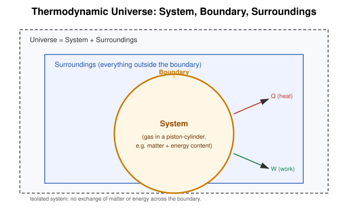
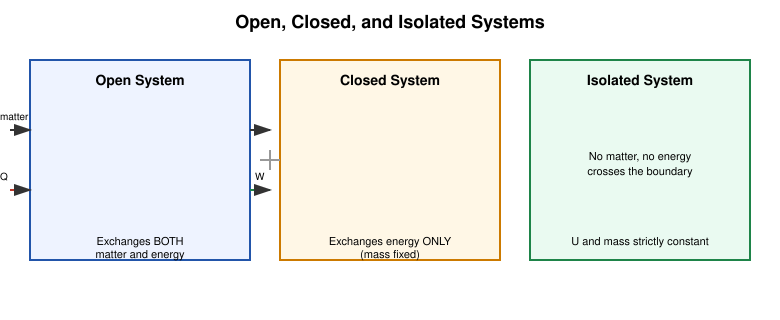
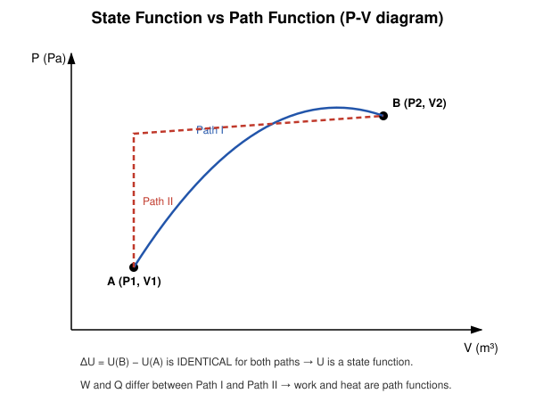

# 1. System & Thermodynamic Functions

## Learning Objectives

By the end of this topic you should be able to:

- Define a thermodynamic system, its boundary, surroundings, and universe.
- Classify a system as open, closed, or isolated.
- Distinguish state variables from path functions, and intensive from extensive properties.
- Explain what constitutes a thermodynamic state and thermodynamic equilibrium.
- Interpret a P–V state diagram and identify state points on it.

## Definition

> **Thermodynamic system**: A specific, macroscopic portion of matter (or a region of space) that is set apart from the rest of the universe for the purpose of thermodynamic study.

Everything outside the system that can interact with it is called the **surroundings**, and the real or imaginary surface separating the system from the surroundings is the **boundary**. The system together with its surroundings constitutes the **thermodynamic universe**.

$$
\text{Universe} = \text{System} + \text{Surroundings}
$$

## Physical Meaning / Intuition

Think of a gas trapped inside a piston–cylinder assembly. The gas is the *system*; the cylinder walls and piston form the *boundary*; the room air, the piston's weight, and any heat reservoir in contact with the cylinder are the *surroundings*. Whether we can meaningfully write down "the pressure of the gas" or "the temperature of the gas" depends entirely on how we have defined this system — thermodynamics never speaks about "the universe's pressure," only about the system's properties.

## Important Terminology

| Term | Meaning |
|---|---|
| System | The matter/region under study |
| Surroundings | Everything external to the system that can exchange energy/matter with it |
| Boundary | The real or conceptual surface separating system and surroundings |
| Universe (thermodynamic) | System + surroundings |
| Thermodynamic state | A condition of the system fully specified by its state variables |
| State variable (state function) | A property depending only on the current state, not on how that state was reached |
| Path function | A quantity that depends on the process/path taken between two states |
| Intensive property | Independent of the amount of matter (e.g. P, T, density) |
| Extensive property | Proportional to the amount of matter (e.g. V, U, mass) |
| Thermodynamic equilibrium | Simultaneous mechanical, thermal, and chemical equilibrium |
| Thermodynamic coordinates | The minimal set of state variables (e.g. P, V, T) needed to specify the state of a simple system |

## Open, Closed, and Isolated Systems

| System type | Matter exchange | Energy exchange | Example |
|---|---|---|---|
| **Open** | Allowed | Allowed | A boiling open kettle, a living cell |
| **Closed** | Not allowed | Allowed | Gas sealed in a piston-cylinder |
| **Isolated** | Not allowed | Not allowed | An ideal insulated thermos flask |

## Mathematical Formulation: State Variables

For a simple, closed, single-phase fluid system (like an ideal gas), the equilibrium state is completely fixed by **any two** of the three coordinates $P$, $V$, $T$, since they are related by an **equation of state**:

$$
PV = nRT
$$

where

- $P$ = pressure (Pa)
- $V$ = volume (m³)
- $n$ = number of moles (mol)
- $R$ = universal gas constant $= 8.314\ \mathrm{J\,mol^{-1}K^{-1}}$
- $T$ = absolute temperature (K)

Once $P$, $V$, $T$ (and $n$) are fixed, *every* other thermodynamic function of the system — internal energy $U$, enthalpy $H$, entropy $S$, etc. — takes on a unique, fixed value. This is precisely what makes them **state functions**.

## State Function vs Path Function

A **state function** $f$ obeys

$$
\oint df = 0 \qquad \text{(over any closed cycle)}
$$

i.e. its change between two states A and B,

$$
\Delta f = f_B - f_A,
$$

is completely independent of the path taken. Examples: $P$, $V$, $T$, $U$, $H$, $S$.

A **path function** (e.g. heat $Q$ or work $W$) has no such property — its value genuinely depends on *how* the system moved from A to B, and it is **not** a perfect (exact) differential. We therefore write $dQ$ and $dW$ (or $đQ$, $đW$) rather than $d(\text{something})$, because there is no "$Q$" or "$W$" function of state to differentiate.

## Derivation: Why $dU$ is Exact but $dW$ Is Not

Consider a simple gas system with independent state variables $P, V$. Any state function $f(P,V)$ has a total differential

$$
df = \left(\frac{\partial f}{\partial P}\right)_V dP + \left(\frac{\partial f}{\partial V}\right)_P dV .
$$

For $df$ to be an **exact differential**, it must satisfy the reciprocity (Euler) test:

$$
\frac{\partial}{\partial V}\left(\frac{\partial f}{\partial P}\right)_V = \frac{\partial}{\partial P}\left(\frac{\partial f}{\partial V}\right)_P .
$$

Internal energy $U(P,V)$ satisfies this test — it is a genuine function of state. Work, $dW = P\,dV$, does **not** satisfy it in general (there is no function $W(P,V)$ whose partial derivatives reproduce $P\,dV$ consistently along arbitrary paths), which is the formal reason $\oint dW \neq 0$ in general, while $\oint dU = 0$ always.

## SI Units and Dimensions

| Quantity | Symbol | SI unit | Dimension |
|---|---|---|---|
| Pressure | $P$ | pascal, Pa ($\mathrm{N/m^2}$) | $\mathrm{M L^{-1} T^{-2}}$ |
| Volume | $V$ | m³ | $\mathrm{L^3}$ |
| Temperature | $T$ | kelvin, K | $\Theta$ |
| Amount of substance | $n$ | mole, mol | — |

## Assumptions and Conditions of Validity

- The system must be in (or infinitesimally close to) **thermodynamic equilibrium** for its state variables to be well defined; a system undergoing violent turbulence does not have a single well-defined $P$ or $T$.
- The ideal-gas equation of state $PV = nRT$ is an approximation valid for dilute gases at moderate pressure and temperature — real gases deviate at high pressure/low temperature (see van der Waals corrections, outside this syllabus).
- "Two independent variables fix the state" holds for a **simple compressible system** with fixed composition; systems with additional work modes (electric, magnetic, surface tension) need extra coordinates.

## Physical Interpretation

Classifying a system correctly is not a bookkeeping exercise — it decides which conservation laws apply. For an isolated system, $\Delta U_{\text{universe}} = 0$ trivially; for an open system, mass flow carries energy across the boundary, and the ordinary closed-system first law must be modified (control-volume/flow analysis, beyond this syllabus). Recognizing state vs path functions is equally practical: it tells us that $\Delta U$ can be computed from *only* the endpoints, saving enormous derivational effort, while $Q$ and $W$ must always be computed along the specific path.

## Important Laws / Theorems / Principles

- **Zeroth Law of Thermodynamics** (implicit prerequisite): If system A is in thermal equilibrium with C, and B is in thermal equilibrium with C, then A and B are in thermal equilibrium with each other. This is what allows temperature to be defined as a state variable in the first place.
- **State postulate**: For a simple compressible system, the state is fixed by two independent intensive properties.

## Worked Numerical Examples

### Problem 1
**Given:** 2 mol of an ideal gas occupies 0.05 m³ at 300 K.
**Required:** Find the pressure.
**Formula:** $PV = nRT$
**Calculation:**
$$
P = \frac{nRT}{V} = \frac{2 \times 8.314 \times 300}{0.05} = \frac{4988.4}{0.05} = 99{,}768\ \mathrm{Pa} \approx 0.998 \times 10^5\ \mathrm{Pa}
$$
**Answer:** $P \approx 99.8\ \mathrm{kPa}$ (≈ 0.985 atm).
**Physical interpretation:** This is close to standard atmospheric pressure — a reasonable state for a gas at room temperature in a moderate volume.

### Problem 2
**Given:** A gas is taken from state A $(P_1=2\times10^5\text{ Pa}, V_1 = 1\times10^{-3}\text{ m}^3)$ to state B $(P_2 = 1\times10^5\text{ Pa}, V_2 = 3\times10^{-3}\text{ m}^3)$ by two different paths.
**Required:** Explain what can and cannot be said about $\Delta U$, $Q$, $W$ without knowing the path.
**Formula:** State function property, $\Delta U = U_B - U_A$.
**Calculation:** Since $U$ is a state function, $\Delta U$ is fixed by A and B alone and is the *same* for both paths (its numeric value would require the gas's specific heat/temperature data, which is not given here — the key result is path-independence).
**Answer:** $\Delta U$ is identical on both paths; $Q$ and $W$ are generally different on the two paths, though $Q - W$ (equal to $\Delta U$, per the First Law) must match.
**Physical interpretation:** This is the practical power of identifying state functions — endpoints alone are enough.

## Conceptual Example

Two mountain hikers start at base camp (state A) and end at the same mountain summit (state B), one taking the steep direct route, the other taking a long winding trail. Their **net change in altitude** (a "state function" of position) is identical. But the **total distance walked** and the **calories burned** (path functions) are very different. This is exactly analogous to $\Delta U$ (state function) versus $Q$ and $W$ (path functions).

## Common Mistakes

- Treating $Q$ or $W$ as if they were properties "possessed" by the system (a system has *no* heat content, only internal energy).
- Confusing "closed" with "isolated" — a closed system can still exchange heat/work.
- Assuming intensive properties are always constant throughout a system in equilibrium — they are position-independent for a *homogeneous* system, but a system can have several equilibrium phases with different intensive properties.
- Forgetting that both $P$ *and* $V$ (or any two independent variables) are needed to fix a state — a single variable such as $T$ alone does not fix $V$ or $P$.

## Exam Essentials

- Definitions: system, boundary, surroundings, universe, open/closed/isolated.
- State function vs path function — definition and the $\oint df = 0$ test.
- Intensive vs extensive properties, with examples.
- The equation of state $PV = nRT$ and what "fixing two variables fixes the state" means.

## Possible Exam Questions

- Define a thermodynamic system and distinguish it from its surroundings and boundary. (short)
- Differentiate between open, closed, and isolated systems with one example each. (short)
- "Internal energy is a state function, but work is not." Justify this statement. (descriptive/derivation)
- Show that $\oint dU = 0$ for any cyclic process but $\oint dW \neq 0$ in general. (derivation)
- 3 mol of an ideal gas occupies 0.08 m³ at a pressure of $1.5\times10^5$ Pa. Find its temperature. (numerical)
- Classify each as intensive or extensive: pressure, mass, volume, density, temperature, internal energy. (conceptual)

## Summary

A thermodynamic system is a chosen region of matter studied in isolation from an (imaginary or real) boundary; everything else is surroundings. Systems are open, closed, or isolated depending on what can cross the boundary. State variables ($P$, $V$, $T$, and derived quantities like $U$) depend only on the current equilibrium state, while $Q$ and $W$ are path functions that depend on the process. For a simple gas, two independent state variables fix the entire equilibrium state via the equation of state $PV = nRT$.

## References

- Halliday, Resnick & Walker, *Fundamentals of Physics* (chapters on temperature and the ideal gas).
- Zemansky & Dittman, *Heat and Thermodynamics*.
- Schroeder, D.V., *An Introduction to Thermal Physics*.
