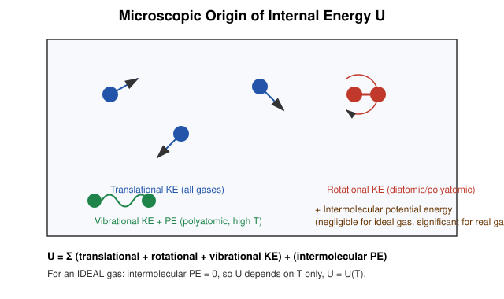
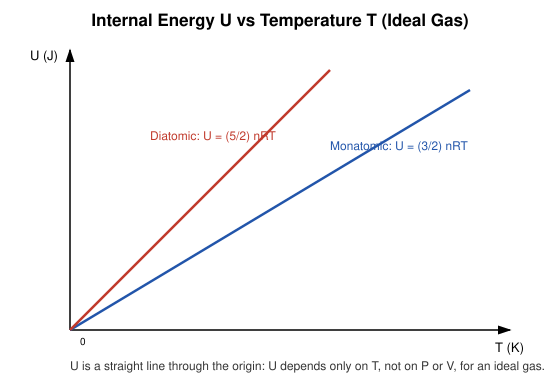

# 2. Internal Energy

## Learning Objectives

- Explain the microscopic origin of internal energy $U$.
- Distinguish the kinetic and potential energy contributions to $U$.
- State why, for an ideal gas, $U$ depends on temperature alone.
- Derive $U$ for monatomic and diatomic ideal gases using the equipartition theorem.

## Definition

> **Internal energy** $U$ is the total energy contained within a system due to the random microscopic motion and configuration of its constituent molecules — the sum of all molecular translational, rotational, and vibrational kinetic energies, plus intermolecular potential energy — **excluding** any bulk kinetic energy (motion of the system as a whole) and any bulk potential energy (e.g. due to external gravity).

$U$ is a **state function** and an **extensive property**.

## Physical Meaning / Intuition

$U$ is "energy stored inside the substance," invisible macroscopically except through its effect on temperature and phase. When you heat a gas at constant volume, none of the added heat goes into moving the container — it all raises the erratic thermal jostling of molecules, i.e. it raises $U$.

## Important Terminology

| Term | Meaning |
|---|---|
| Translational KE | Energy of the center-of-mass motion of a molecule |
| Rotational KE | Energy of molecular rotation about its center of mass |
| Vibrational energy | KE + PE of atoms oscillating about their equilibrium bond length within a molecule |
| Intermolecular PE | Potential energy from attractive/repulsive forces between separate molecules |
| Degrees of freedom (f) | Independent ways a molecule can store energy |
| Equipartition theorem | Each quadratic degree of freedom contributes $\tfrac{1}{2}k_BT$ of average energy per molecule |

## Mathematical Formulation

$$
U = U_{\text{trans}} + U_{\text{rot}} + U_{\text{vib}} + U_{\text{intermolecular PE}}
$$

For $N$ molecules with $f$ active degrees of freedom, the equipartition theorem gives

$$
U = \frac{f}{2} N k_B T = \frac{f}{2} nRT
$$

where $k_B = 1.381\times10^{-23}\ \mathrm{J/K}$ is Boltzmann's constant, and $N k_B = nR$.

### Ideal Gas Internal Energy

For an **ideal gas**, by definition, intermolecular forces (and hence intermolecular PE) are neglected. Therefore $U$ depends **only on temperature**:

$$
U = U(T) \quad \text{(ideal gas — Joule's law of internal energy)}
$$

not on $P$ or $V$ independently.

**Monatomic ideal gas** ($f = 3$, translational only — He, Ne, Ar):

$$
U = \frac{3}{2}nRT
$$

**Diatomic ideal gas** ($f = 5$ at moderate T — 3 translational + 2 rotational; O₂, N₂, H₂ near room temperature):

$$
U = \frac{5}{2}nRT
$$

At very high temperatures, vibrational modes activate in diatomic molecules, adding $f=7$ ($U = \tfrac{7}{2}nRT$), but this is usually outside introductory syllabus expectations.

## Derivation: Monatomic Ideal Gas Internal Energy from Kinetic Theory

From kinetic theory, the mean translational kinetic energy per molecule is

$$
\left\langle \tfrac{1}{2}mv^2 \right\rangle = \tfrac{3}{2}k_BT .
$$

For $N = nN_A$ molecules (no rotational/vibrational energy for a monatomic gas, and no intermolecular PE for an ideal gas):

$$
U = N \left\langle \tfrac{1}{2}mv^2\right\rangle = \tfrac{3}{2}Nk_BT = \tfrac{3}{2}nRT ,
$$

using $Nk_B = nN_Ak_B = nR$.

## Explanation of Variables

| Symbol | Meaning | SI unit |
|---|---|---|
| $U$ | Internal energy | J |
| $n$ | Moles | mol |
| $R$ | Universal gas constant | $\mathrm{J\,mol^{-1}K^{-1}}$ |
| $T$ | Absolute temperature | K |
| $f$ | Degrees of freedom | dimensionless |
| $N$ | Number of molecules | dimensionless |
| $k_B$ | Boltzmann constant | J/K |

## Dimensions

$$
[U] = \mathrm{M\,L^2\,T^{-2}} \quad (\text{joule})
$$

## Assumptions and Conditions of Validity

- $U = U(T)$ only strictly for an **ideal gas**; for real gases $U = U(T,V)$ because intermolecular PE depends on average molecular separation.
- The equipartition formulas assume classical (non-quantized) behavior at the relevant temperature; at very low temperature, vibrational and even rotational modes can "freeze out" quantum mechanically.
- These formulas apply to a fixed amount of substance $n$ undergoing no chemical/nuclear/phase change.

## Physical Interpretation

Since $\Delta U$ depends only on $\Delta T$ for an ideal gas, the internal-energy change between two states can be computed *without knowing the process* — a major simplification that will be used repeatedly with the First Law.

## Important Laws / Theorems / Principles

- **Joule's Law of Internal Energy**: For an ideal gas, $U$ is a function of temperature alone (independent of $P$, $V$).
- **Equipartition Theorem**: Each quadratic energy term contributes $\tfrac12 k_BT$ per molecule on average.

## Worked Numerical Examples

### Problem 1
**Given:** 1 mole of an ideal monatomic gas is heated from 300 K to 500 K.
**Required:** Find $\Delta U$.
**Formula:** $\Delta U = \tfrac{3}{2}nR\Delta T$
**Calculation:**
$$
\Delta U = \tfrac{3}{2}(1)(8.314)(500-300) = \tfrac{3}{2}(8.314)(200) = 2494.2\ \mathrm{J}
$$
**Answer:** $\Delta U \approx 2.49\ \mathrm{kJ}$.
**Physical interpretation:** All of this energy goes into faster random translational motion; there is no rotational/vibrational channel in a monatomic gas.

### Problem 2
**Given:** 2 mol of a diatomic ideal gas ($f=5$) at 400 K.
**Required:** Find total internal energy $U$.
**Formula:** $U = \tfrac{5}{2}nRT$
**Calculation:**
$$
U = \tfrac{5}{2}(2)(8.314)(400) = 5(8.314)(400) = 16{,}628\ \mathrm{J}
$$
**Answer:** $U \approx 16.6\ \mathrm{kJ}$.
**Physical interpretation:** The diatomic gas has more "storage channels" (translation + rotation), so it carries substantially more internal energy than a monatomic gas at the same $n$, $T$.

### Problem 3
**Given:** A monatomic ideal gas expands isothermally at $T = 350\ \mathrm{K}$ from $V_1$ to $V_2 = 2V_1$.
**Required:** Find $\Delta U$.
**Formula:** $\Delta U = \tfrac32 nR\Delta T$
**Calculation:** Since the process is isothermal, $\Delta T = 0$, so
$$
\Delta U = \tfrac32 nR (0) = 0\ \mathrm{J}.
$$
**Answer:** $\Delta U = 0$.
**Physical interpretation:** Because $U$ depends only on $T$ for an ideal gas, *any* isothermal process — regardless of how $P$ or $V$ change — leaves $U$ unchanged.

## Conceptual Example

Compressing an ideal gas isothermally in a well-insulated but perfectly heat-exchanging water bath does not change its internal energy at all, even though you are clearly doing mechanical work on it — the work done shows up entirely as heat rejected to the bath, not as a rise in $U$, precisely because $U$ tracks temperature only.

## Common Mistakes

- Believing that compressing a gas *always* increases $U$ — true only if $T$ rises; not true in an isothermal compression.
- Forgetting the factor of $n$ (moles) and using $R$ with mass instead of moles.
- Using $f=3$ for diatomic gases (forgetting rotational degrees of freedom).
- Confusing "internal energy" with "heat" — $U$ is a property of the system; heat is energy in transit across the boundary.

## Exam Essentials

- $U = U(T)$ only for an ideal gas (Joule's law).
- $U_{\text{mono}} = \tfrac32 nRT$; $U_{\text{dia}} = \tfrac52 nRT$.
- Equipartition: $\tfrac12 k_BT$ per degree of freedom per molecule.

## Possible Exam Questions

- Define internal energy and explain its microscopic origin. (short)
- Why is internal energy of an ideal gas independent of volume? (conceptual)
- Derive the expression for internal energy of a monatomic ideal gas using the kinetic theory of gases. (derivation)
- Two moles of a diatomic gas are heated from 250 K to 450 K at constant volume. Find the increase in internal energy. (numerical)
- Distinguish between the internal energy of an ideal gas and a real gas. (descriptive)

## Summary

Internal energy is the sum of all microscopic kinetic and potential energies of a system's constituent particles. For an ideal gas it depends only on temperature (Joule's law), with $U = \tfrac{f}{2}nRT$ from the equipartition theorem — $\tfrac32nRT$ for monatomic gases and $\tfrac52nRT$ for diatomic gases near room temperature. Because $U$ is a state function, $\Delta U$ can always be computed from the initial and final temperatures alone.

## References

- Halliday, Resnick & Walker, *Fundamentals of Physics*, kinetic theory chapter.
- Schroeder, D.V., *An Introduction to Thermal Physics*, equipartition theorem.
- Zemansky & Dittman, *Heat and Thermodynamics*.
