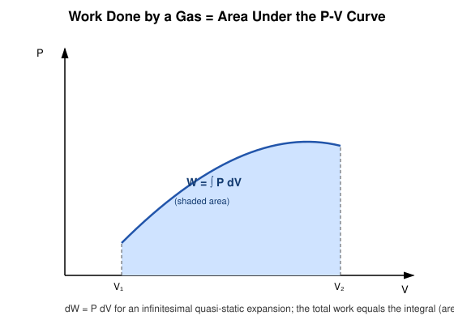
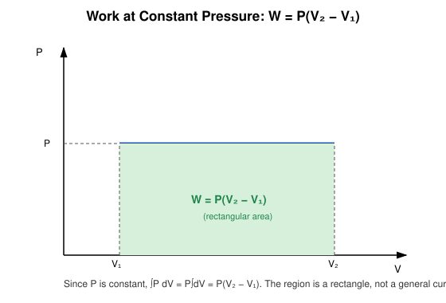
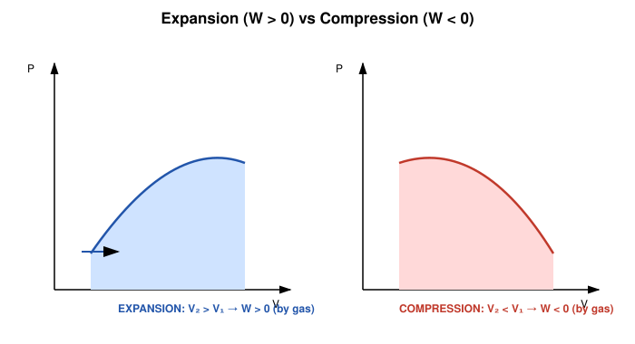

# 3. Work Done by a Gas at Constant Pressure

## Learning Objectives

- Derive the general expression $W = \int P\,dV$ for work done by an expanding/compressing gas.
- Specialize it to $W = P(V_2 - V_1)$ for a constant-pressure (isobaric) process.
- Interpret work geometrically as the area under a P–V curve.
- Apply the correct sign convention consistently.

## Definition

> **Work done by a gas** is the mechanical energy transferred across the system boundary as the gas expands or is compressed against an external pressure (typically via a movable piston).

**Sign convention used throughout this chapter:** $W$ denotes work done **BY** the system (the gas) on the surroundings. Expansion ($dV>0$) gives $W>0$; compression ($dV<0$) gives $W<0$.

## Physical Meaning / Intuition

Imagine gas in a cylinder pushing a piston outward. The gas exerts a force $F = PA$ on the piston (A = piston area). As the piston moves a small distance $dx$, the gas does work $dW = F\,dx = PA\,dx = P\,dV$, since $A\,dx = dV$ is the incremental volume swept.

## Important Terminology

| Term | Meaning |
|---|---|
| Quasi-static process | A process carried out so slowly that the system passes through a continuous sequence of near-equilibrium states |
| P–V diagram | A plot of pressure vs volume used to visualize processes and work |
| Isobaric process | A process at constant pressure |

## Mathematical Formulation and Derivation

Consider a gas in a cylinder of cross-sectional area $A$, at pressure $P$, pushing a piston outward by $dx$. The external force balancing the gas pressure at the piston face is $F = PA$ (quasi-static condition — pressure is uniform and well defined).

Elementary work done by the gas:

$$
dW = F\,dx = (PA)\,dx = P(A\,dx) = P\,dV
$$

Integrating from initial volume $V_1$ to final volume $V_2$:

$$
\boxed{W = \int_{V_1}^{V_2} P\,dV}
$$

This is completely general — valid for **any** quasi-static process, as long as we know $P$ as a function of $V$ along that specific path (which is why $W$ is a path function).

### Constant-Pressure (Isobaric) Special Case

If $P$ is held constant throughout the process, it can be pulled outside the integral:

$$
W = P\int_{V_1}^{V_2} dV = P(V_2 - V_1)
$$

$$
\boxed{W = P(V_2 - V_1) = P\,\Delta V}
$$

### Geometric Meaning

On a P–V diagram, $\int P\,dV$ is exactly the **area under the curve** between $V_1$ and $V_2$. For an isobaric process this area is a simple rectangle of height $P$ and width $(V_2-V_1)$.

## Explanation of Variables

| Symbol | Meaning | SI unit |
|---|---|---|
| $W$ | Work done by the gas | J |
| $P$ | Pressure (constant, in the isobaric case) | Pa |
| $V_1, V_2$ | Initial, final volume | m³ |
| $A$ | Piston cross-sectional area | m² |
| $dx$ | Piston displacement | m |

## SI Units and Dimensions

$$
[W] = [P][V] = (\mathrm{Pa})(\mathrm{m^3}) = \mathrm{N\,m} = \mathrm{J}
$$
$$
[W] = \mathrm{M\,L^2\,T^{-2}}
$$

## Assumptions and Conditions of Validity

- The process must be **quasi-static** (slow enough that $P$ is well-defined and uniform throughout the gas at every instant) for $W=\int P\,dV$ to use the *system's own* pressure.
- For an irreversible process (e.g. sudden expansion against a lower, fixed external pressure $P_{\text{ext}}$), the correct work expression uses $P_{\text{ext}}$, not the system's internal $P$: $W = P_{\text{ext}}(V_2-V_1)$, and it is generally **less** in magnitude than the reversible work for the same volume change.
- No friction, no other work modes (electrical, magnetic) are assumed unless stated.

## Physical Interpretation

Expansion vs compression:

- **Expansion** ($V_2 > V_1$): the gas does *positive* work on the surroundings — it pushes the piston out, converting some of its internal energy or absorbed heat into mechanical output.
- **Compression** ($V_2 < V_1$): $W < 0$ — work is done *on* the gas by the surroundings.

## Important Laws / Theorems / Principles

- Work is fundamentally a **path function**: two processes with the same $V_1, V_2$ but different $P(V)$ relationships give different $W$.
- The isobaric work formula is a special (and the simplest) case of the general integral definition.

## Worked Numerical Examples

### Problem 1 (Easy)
**Given:** A gas at constant pressure $P = 1.5\times10^5$ Pa expands from $V_1 = 2\times10^{-3}\ \mathrm{m^3}$ to $V_2 = 5\times10^{-3}\ \mathrm{m^3}$.
**Required:** Work done by the gas.
**Formula:** $W = P(V_2-V_1)$
**Calculation:**
$$
W = 1.5\times10^5 \times (5\times10^{-3} - 2\times10^{-3}) = 1.5\times10^5 \times 3\times10^{-3} = 450\ \mathrm{J}
$$
**Answer:** $W = 450\ \mathrm{J}$ (done BY the gas).
**Physical interpretation:** The expanding gas transfers 450 J of mechanical energy to the piston/surroundings.

### Problem 2 (Moderate)
**Given:** A gas is compressed at constant pressure of 2 atm from 8 L to 3 L.
**Required:** Work done by the gas, in joules.
**Formula:** $W = P\Delta V$, with unit conversions $1\ \text{atm} = 1.013\times10^5$ Pa, $1\ \text{L} = 10^{-3}\ \mathrm{m^3}$.
**Calculation:**
$$
P = 2 \times 1.013\times10^5 = 2.026\times10^5\ \mathrm{Pa}
$$
$$
\Delta V = (3-8)\times10^{-3}\ \mathrm{m^3} = -5\times10^{-3}\ \mathrm{m^3}
$$
$$
W = (2.026\times10^5)(-5\times10^{-3}) = -1013\ \mathrm{J}
$$
**Answer:** $W \approx -1013\ \mathrm{J}$.
**Physical interpretation:** The negative sign confirms work is done ON the gas during compression, consistent with the "work done by the system" convention.

### Problem 3 (Exam-level)
**Given:** An ideal gas undergoes a two-step process at constant pressure: first heated from $V_1=1\times10^{-3}$ m³ to $V_2 = 4\times10^{-3}$ m³ at $P=1\times10^5$ Pa, then cooled at constant volume back to its original temperature (no further volume change).
**Required:** Total work done by the gas over both steps.
**Formula:** $W = P\Delta V$ for step 1; $W=0$ for step 2 (isochoric).
**Calculation:**
$$
W_1 = (1\times10^5)(4\times10^{-3}-1\times10^{-3}) = (1\times10^5)(3\times10^{-3}) = 300\ \mathrm{J}
$$
$$
W_2 = 0 \quad (\text{no volume change})
$$
$$
W_{\text{total}} = W_1+W_2 = 300\ \mathrm{J}
$$
**Answer:** $W_{\text{total}} = 300\ \mathrm{J}$.
**Physical interpretation:** Only the volume-changing step contributes to work — cooling at fixed volume does no mechanical work even though heat leaves the system.

## Conceptual Example

Two identical gas samples are expanded from the same $V_1$ to the same $V_2$: one isobarically, one by first cooling at constant volume then heating at higher constant pressure. Even though start and end volumes match, the **areas under their P–V paths differ**, so the two processes do different amounts of work — direct proof that work is path-dependent.

## Common Mistakes

- Applying $W=P\Delta V$ to a *non*-constant-pressure process (must use $\int P\,dV$ instead).
- Sign errors: forgetting that compression gives negative work in the "work done by system" convention.
- Confusing $\Delta V$ direction — always $(V_{\text{final}} - V_{\text{initial}})$.
- Ignoring that $P$ in $W=\int P\,dV$ must be the *system's* pressure for a quasi-static/reversible process.

## Exam Essentials

- General formula: $W = \int_{V_1}^{V_2} P\,dV$.
- Isobaric case: $W = P(V_2-V_1)$.
- Geometric meaning: area under the P–V curve.
- Sign convention: $W>0$ for expansion (by the system).

## Possible Exam Questions

- Derive the expression for work done by a gas during a quasi-static expansion. (derivation)
- Show that work done at constant pressure equals $P(V_2-V_1)$. (derivation)
- Explain, with a diagram, why work is represented as the area under a P–V curve. (conceptual/descriptive)
- A gas expands at a constant pressure of $2\times10^5$ Pa from 0.01 m³ to 0.025 m³. Calculate the work done. (numerical)
- Why is work considered a path function rather than a state function? (conceptual)

## Summary

Work done by a gas during a quasi-static volume change is $W = \int P\,dV$, which reduces to $W=P(V_2-V_1)$ at constant pressure. Geometrically, $W$ is the area under the process curve on a P–V diagram. By convention here, $W>0$ for expansion (work done by the system) and $W<0$ for compression.

## References

- Halliday, Resnick & Walker, *Fundamentals of Physics*, chapter on the first law of thermodynamics.
- Zemansky & Dittman, *Heat and Thermodynamics*.
- Schroeder, D.V., *An Introduction to Thermal Physics*.
