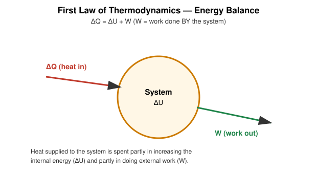

# 4. First Law of Thermodynamics

## Learning Objectives

- State the First Law of Thermodynamics as a statement of energy conservation.
- Apply $\Delta Q = \Delta U + W$ correctly with a stated sign convention.
- Apply the First Law to isothermal, isobaric, isochoric, and adiabatic processes.
- Recognize common alternative sign conventions used in other textbooks.

## Definition

> **The First Law of Thermodynamics** states that energy can be transformed from one form to another (heat ↔ work ↔ internal energy) but cannot be created or destroyed — it is the principle of conservation of energy applied to thermodynamic systems.

**Sign convention used in this document:**

$$
\boxed{\Delta Q = \Delta U + W}
$$

where

- $\Delta Q$ = heat **supplied to** the system (positive if absorbed, negative if released),
- $\Delta U$ = change in internal energy of the system,
- $W$ = work done **BY** the system on the surroundings (positive for expansion).

In differential (infinitesimal) form:

$$
dQ = dU + dW
$$

> **Note on alternative conventions:** Some textbooks (especially in chemistry/IUPAC-based texts) define $W$ as work done **ON** the system, giving $\Delta U = \Delta Q + W$. The physics is identical either way — only the sign of $W$ flips. **Always check which convention a given textbook or exam paper uses**, and never mix the two within one calculation. This document uses the "work done by the system" convention exclusively, consistent with most engineering-physics texts (Halliday, Resnick & Walker; Zemansky).

## Physical Meaning / Intuition

Heat added to a system has exactly two possible destinations: it raises the internal energy (heats the substance up / changes its microscopic energy content) and/or it performs external work (e.g. pushing a piston). There is no third option and no leakage — this is what makes it a conservation law.

## Important Terminology

| Term | Meaning |
|---|---|
| Heat ($Q$) | Energy transferred due to a temperature difference |
| Work ($W$) | Energy transferred by a macroscopic force acting through a displacement |
| Internal energy ($U$) | Microscopic energy content of the system (state function) |
| Adiabatic | No heat exchange, $Q=0$ |
| Isochoric | No volume change, $W=0$ |

## Mathematical Formulation

$$
\Delta Q = \Delta U + W
$$

Rearranged forms useful in different problem types:

$$
\Delta U = \Delta Q - W, \qquad W = \Delta Q - \Delta U
$$

## Derivation / Development

The First Law is fundamentally a **postulate** (an empirical generalization, not derived from more basic laws within classical thermodynamics), but its plausibility follows directly from mechanical energy conservation. Consider a gas doing work $dW = P\,dV$ on a piston while also being supplied heat $dQ$. By conservation of total energy of system + surroundings, whatever energy leaves as heat $dQ$ into the system and is not converted into external mechanical work $dW$ must remain stored within the system as a change in its internal energy $dU$:

$$
dQ = dU + dW
$$

Historically, this equivalence between heat and work-as-forms-of-energy was established experimentally by Joule (see Mechanical Equivalent of Heat), which is what elevated this from "engineers' bookkeeping rule" to a genuine law of physics.

## Explanation of Variables

| Symbol | Meaning | SI unit |
|---|---|---|
| $\Delta Q$ | Heat supplied to system | J |
| $\Delta U$ | Change in internal energy | J |
| $W$ | Work done by system | J |

## SI Units and Dimensions

All three terms have dimensions of energy: $\mathrm{M\,L^2\,T^{-2}}$, measured in joules (J). (Older texts sometimes use calories; $1\ \text{cal} = 4.186\ \mathrm{J}$.)

## Assumptions and Conditions of Validity

- Applies to a **closed system** (fixed mass) — open systems need a modified, flow-energy form of the first law (not covered here).
- Kinetic and potential energy of the system *as a whole* (bulk motion, external gravitational PE) are assumed unchanged/negligible; only internal, molecular-level energy is tracked by $U$.
- Valid for both reversible and irreversible processes — the First Law itself places **no restriction on direction**; that role belongs to the Second Law (Part 2 of this chapter).

## Physical Interpretation / Application to Different Processes

| Process | Condition | First Law reduces to |
|---|---|---|
| Isochoric | $W=0$ | $\Delta Q = \Delta U$ |
| Isothermal (ideal gas) | $\Delta U = 0$ | $\Delta Q = W$ |
| Adiabatic | $\Delta Q = 0$ | $\Delta U = -W$ |
| Isobaric | $W = P\Delta V$ | $\Delta Q = \Delta U + P\Delta V$ |
| Cyclic | $\Delta U = 0$ (returns to start) | $\Delta Q_{\text{net}} = W_{\text{net}}$ |

## Important Laws / Theorems / Principles

- **First Law of Thermodynamics** (energy conservation applied to heat/work/internal energy).
- Corollary: **Perpetual motion machines of the first kind are impossible** — no engine can produce more work output than the energy input it receives, since that would violate $\Delta Q = \Delta U + W$.

## Worked Numerical Examples

### Problem 1 (Easy)
**Given:** A gas absorbs 500 J of heat and does 200 J of work on its surroundings.
**Required:** Change in internal energy.
**Formula:** $\Delta U = \Delta Q - W$
**Calculation:**
$$
\Delta U = 500 - 200 = 300\ \mathrm{J}
$$
**Answer:** $\Delta U = +300\ \mathrm{J}$ (internal energy increases).
**Physical interpretation:** Not all absorbed heat went into work; the surplus raised the gas's internal energy (and hence temperature, for an ideal gas).

### Problem 2 (Moderate)
**Given:** In an isochoric process, 800 J of heat is removed from a gas.
**Required:** Find $\Delta U$ and $W$.
**Formula:** $W = 0$ (constant volume); $\Delta Q = \Delta U$
**Calculation:**
$$
W = 0
$$
$$
\Delta U = \Delta Q = -800\ \mathrm{J}
$$
**Answer:** $\Delta U = -800\ \mathrm{J}$, $W = 0$.
**Physical interpretation:** With no volume change, all the heat removed directly lowers the internal energy (and temperature).

### Problem 3 (Exam-level)
**Given:** An ideal gas is compressed adiabatically, and 150 J of work is done ON the gas during the process.
**Required:** Find $\Delta U$.
**Formula:** $\Delta Q = 0$ (adiabatic) $\Rightarrow \Delta U = -W$. Work done ON the gas of 150 J means $W$ (done BY gas) $= -150$ J.
**Calculation:**
$$
\Delta U = -W = -(-150) = +150\ \mathrm{J}
$$
**Answer:** $\Delta U = +150\ \mathrm{J}$.
**Physical interpretation:** With no heat exchange, all the work done on the gas during adiabatic compression converts directly into a rise in internal energy — consistent with the familiar heating of a bicycle pump when compressing air quickly.

## Conceptual Example

A sealed, rigid (isochoric), perfectly insulated (adiabatic) container has $\Delta Q = 0$ and $W = 0$ simultaneously — by the First Law, $\Delta U = 0$ necessarily: nothing can change the internal energy of such a system at all, no matter what happens "inside" it (short of a chemical reaction or similar internal energy conversion), because there is no channel across the boundary for net energy to enter or leave.

## Common Mistakes

- Mixing sign conventions mid-problem (e.g. treating $W$ as "done by" in one line and "done on" in another).
- Forgetting that $\Delta U = 0$ for any isothermal process **only when the gas is ideal**.
- Assuming $Q=0$ automatically means $\Delta T=0$ — false; adiabatic processes generally *do* change temperature (see adiabatic compression heating).
- Applying $\Delta Q = \Delta U + W$ to open systems without modification.

## Exam Essentials

- Exact statement and both algebraic forms of the First Law.
- Application table for isochoric/isothermal/adiabatic/isobaric/cyclic processes.
- Explicit awareness of sign-convention ambiguity across textbooks.

## Possible Exam Questions

- State and explain the First Law of Thermodynamics, clearly defining your sign convention. (short/descriptive)
- Show how the First Law reduces to $\Delta Q = \Delta U$ for an isochoric process. (derivation)
- A gas releases 300 J of heat while 100 J of work is done on it. Find $\Delta U$. (numerical)
- Why does the First Law not forbid heat from flowing spontaneously from a cold body to a hot one, even though this never happens? (conceptual — bridges to Second Law, Part 2)
- Explain why a perpetual motion machine of the first kind is impossible using the First Law. (conceptual)

## Summary

The First Law of Thermodynamics, $\Delta Q = \Delta U + W$ (with $W$ = work done by the system), expresses conservation of energy: heat supplied to a system is partitioned between raising its internal energy and doing external work. It applies universally to closed systems in any process, reversible or not, and specializes neatly for isochoric, isothermal, adiabatic, isobaric, and cyclic processes.

## References

- Halliday, Resnick & Walker, *Fundamentals of Physics*.
- Zemansky & Dittman, *Heat and Thermodynamics*.
- Schroeder, D.V., *An Introduction to Thermal Physics*.
