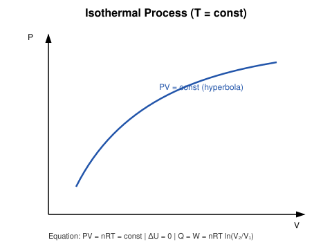
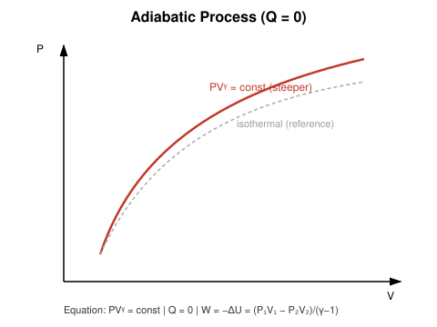
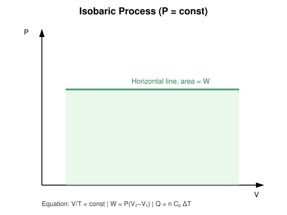
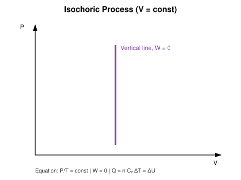
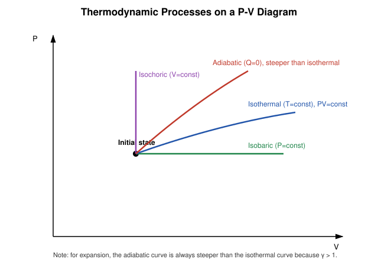

# 5. Thermodynamic Processes

## Learning Objectives

- Define and distinguish isothermal, adiabatic, isobaric, isochoric, and cyclic processes.
- Derive $P$–$V$ relations and work-done formulas for each process.
- Apply the First Law to each process type.
- Read and construct P–V diagrams for each process.

## Definition

> A **thermodynamic process** is any change a system undergoes from one equilibrium state to another, characterized by how its state variables ($P$, $V$, $T$) evolve.

## Physical Meaning / Intuition

Each named process corresponds to holding one particular quantity fixed (or, for adiabatic, blocking one channel of energy transfer) while letting the gas respond. Recognizing which quantity is fixed immediately tells you which term in the First Law vanishes or simplifies.

## Important Terminology

| Term | Meaning |
|---|---|
| Isothermal | Constant temperature ($T = \text{const}$) |
| Adiabatic | No heat exchange ($Q = 0$) |
| Isobaric | Constant pressure ($P = \text{const}$) |
| Isochoric (isometric) | Constant volume ($V = \text{const}$) |
| Cyclic | Returns to its initial state after a sequence of processes |
| Adiabatic index $\gamma$ | Ratio $C_P/C_V$, characterizes how steeply P falls with V during an adiabatic process |

## Isothermal Process

**Condition:** $T = \text{const} \Rightarrow \Delta U = 0$ for an ideal gas.

**P–V relation:** From $PV=nRT$,
$$
PV = \text{const}
$$
a rectangular hyperbola on the P–V diagram.

**Work done:**
$$
W = \int_{V_1}^{V_2} P\,dV = nRT\int_{V_1}^{V_2}\frac{dV}{V} = nRT\ln\!\left(\frac{V_2}{V_1}\right)
$$

**First Law:** $\Delta Q = \Delta U + W = 0 + W \Rightarrow \Delta Q = W$ (all absorbed heat converts to work).

## Adiabatic Process

**Condition:** $Q = 0$ throughout (thermally insulated system, or a process fast enough that negligible heat is exchanged).

**P–V relation:** (derived using $dQ=0$ together with the ideal-gas First Law and $C_V\,dT = -P\,dV$, standard result)
$$
PV^{\gamma} = \text{const}, \qquad \gamma = \frac{C_P}{C_V}
$$

**Work done:**
$$
W = \frac{P_1V_1 - P_2V_2}{\gamma - 1} = -\Delta U = nC_V(T_1-T_2)
$$

**First Law:** $0 = \Delta U + W \Rightarrow \Delta U = -W$.

Since $\gamma>1$, an adiabatic curve is always **steeper** than an isothermal curve through the same point (for expansion, pressure falls faster because no compensating heat flows in to sustain $T$).

## Isobaric Process

**Condition:** $P = \text{const}$.

**V–T relation:** From $PV=nRT$ with $P$ fixed, $V/T = \text{const}$ (Charles's Law behaviour).

**Work done:** $W = P(V_2-V_1)$ (derived in Topic 3).

**Heat:** $\Delta Q = nC_P\Delta T$.

**First Law:** $\Delta Q = \Delta U + P\Delta V$, i.e. $nC_P\Delta T = nC_V\Delta T + nR\Delta T$ (consistent with Mayer's relation, Topic 8).

## Isochoric (Isometric) Process

**Condition:** $V = \text{const}$.

**P–T relation:** $P/T = \text{const}$ (Gay-Lussac's Law).

**Work done:** $W = \int P\,dV = 0$ since $dV=0$.

**Heat:** $\Delta Q = nC_V\Delta T$.

**First Law:** $\Delta Q = \Delta U$ (all heat goes directly into internal energy).

## Cyclic Process (preview — full treatment in Topic 7)

A process (or sequence of processes) that returns the system to its exact initial state. Because $U$ is a state function,

$$
\Delta U_{\text{cycle}} = 0 \quad \Rightarrow \quad \Delta Q_{\text{net}} = W_{\text{net}}
$$

## Comparative Overview

| Process | Constant Quantity | Equation | Work $W$ | Heat $\Delta Q$ | $\Delta U$ | Typical Example |
|---|---|---|---|---|---|---|
| Isothermal | $T$ | $PV=\text{const}$ | $nRT\ln(V_2/V_1)$ | $=W$ | $0$ | Slow gas expansion in a heat bath |
| Adiabatic | $Q$ | $PV^{\gamma}=\text{const}$ | $\dfrac{P_1V_1-P_2V_2}{\gamma-1}$ | $0$ | $-W$ | Rapid compression in a diesel engine |
| Isobaric | $P$ | $V/T=\text{const}$ | $P(V_2-V_1)$ | $nC_P\Delta T$ | $nC_V\Delta T$ | Gas heated in an open piston-cylinder |
| Isochoric | $V$ | $P/T=\text{const}$ | $0$ | $nC_V\Delta T$ | $=\Delta Q$ | Gas heated in a sealed rigid vessel |
| Cyclic | Returns to start | $\oint dU = 0$ | $=\Delta Q_{\text{net}}$ | $=W_{\text{net}}$ | $0$ | Heat engine cycle |

## Explanation of Variables

| Symbol | Meaning | SI unit |
|---|---|---|
| $C_V, C_P$ | Molar specific heats at constant V, P | $\mathrm{J\,mol^{-1}K^{-1}}$ |
| $\gamma$ | Adiabatic index, $C_P/C_V$ | dimensionless |
| $T_1, T_2$ | Initial, final temperature | K |

## Assumptions and Conditions of Validity

- All the P–V relations above (PV=const, $PV^\gamma$=const, etc.) assume an **ideal gas** and a **quasi-static (reversible)** process.
- "Adiabatic" (no heat) is distinct from "isothermal" (no temperature change) — a common confusion; an adiabatic process generally *does* change temperature.
- $\gamma$ is treated as constant, which is a good approximation over modest temperature ranges but strictly varies slightly with $T$ for real gases.

## Physical Interpretation

Engineering devices are built around these idealizations: refrigeration cycles use near-isothermal heat exchange steps, internal combustion engines rely on adiabatic compression/expansion strokes, and pressure cookers exploit isochoric heating.

## Important Laws / Theorems / Principles

- Boyle's Law ($PV=\text{const}$, isothermal), Charles's Law ($V/T=\text{const}$, isobaric), and Gay-Lussac's Law ($P/T=\text{const}$, isochoric) are the classical-era special cases of the ideal gas law realized by these four processes.
- Poisson's relations for adiabatic processes: $PV^\gamma=\text{const}$; equivalently $TV^{\gamma-1}=\text{const}$ and $T^\gamma P^{1-\gamma}=\text{const}$.

## Worked Numerical Examples

### Problem 1 (Isothermal, moderate)
**Given:** 1 mol of ideal gas at 300 K expands isothermally from $V_1=0.01$ m³ to $V_2=0.03$ m³.
**Required:** Work done by the gas.
**Formula:** $W=nRT\ln(V_2/V_1)$
**Calculation:**
$$
W = (1)(8.314)(300)\ln(3) = 2494.2 \times 1.0986 = 2740.0\ \mathrm{J}
$$
**Answer:** $W \approx 2740\ \mathrm{J}$.
**Physical interpretation:** Since $\Delta U=0$, this entire amount of work is supplied as heat absorbed from the surrounding bath.

### Problem 2 (Adiabatic, exam-level)
**Given:** 2 mol of a monatomic ideal gas ($\gamma = 5/3$) is compressed adiabatically; its temperature rises from 300 K to 500 K.
**Required:** Work done by the gas.
**Formula:** $W = nC_V(T_1-T_2)$, with $C_V = \tfrac32 R$ for monatomic gas.
**Calculation:**
$$
C_V = \tfrac32(8.314) = 12.47\ \mathrm{J\,mol^{-1}K^{-1}}
$$
$$
W = (2)(12.47)(300-500) = (2)(12.47)(-200) = -4988\ \mathrm{J}
$$
**Answer:** $W \approx -4988\ \mathrm{J}$ (i.e. ≈ 4988 J done ON the gas).
**Physical interpretation:** Negative $W$ confirms compression; consistent with the rise in temperature since $\Delta U = -W = +4988$ J $>0$.

### Problem 3 (Isochoric, easy)
**Given:** 3 mol of an ideal gas is heated at constant volume so that $\Delta T = 40$ K, $C_V = 20.8\ \mathrm{J\,mol^{-1}K^{-1}}$.
**Required:** Heat absorbed.
**Formula:** $\Delta Q = nC_V\Delta T$
**Calculation:**
$$
\Delta Q = (3)(20.8)(40) = 2496\ \mathrm{J}
$$
**Answer:** $\Delta Q \approx 2496\ \mathrm{J}$, and since $W=0$, $\Delta U = 2496\ \mathrm{J}$ too.

## Conceptual Example

If you rapidly compress the air in a bicycle pump with the outlet blocked, almost no heat has time to escape (approximately adiabatic), so essentially all the mechanical work you do appears as a rise in the air's internal energy — the pump barrel measurably warms up. Contrast this with slowly compressing a gas submerged in a large water bath at fixed temperature (isothermal) — here the same volume change requires *less* work, and the "missing" energy instead flows out as heat to the bath.

## Common Mistakes

- Treating "adiabatic" and "isothermal" as synonyms (they describe entirely different constraints).
- Using $PV=\text{const}$ formulas for an adiabatic process (must use $PV^\gamma=\text{const}$).
- Forgetting that isobaric work uses $P\Delta V$ while isochoric work is *always* zero.
- Sign errors when $T$ decreases in adiabatic expansion (gas does positive work while its own internal energy falls).

## Exam Essentials

- The comparison table (constant quantity, P–V relation, $W$, $\Delta Q$, $\Delta U$) for all four processes.
- Why adiabatic curves are steeper than isothermal curves on a P–V diagram.
- Recognizing which named process a given scenario describes.

## Possible Exam Questions

- Derive the relation $PV^\gamma = \text{const}$ for an adiabatic process (starting from the First Law). (derivation)
- Compare isothermal and adiabatic expansion of an ideal gas on the same P–V diagram, explaining why one curve is steeper. (descriptive/conceptual)
- 2 mol of an ideal gas is heated isobarically at $P=1\times10^5$ Pa; volume changes from 0.02 m³ to 0.05 m³. Find work done. (numerical)
- Why is no work done during an isochoric process even though heat may be transferred? (conceptual)
- Tabulate $W$, $\Delta Q$, $\Delta U$ for isothermal, adiabatic, isobaric, and isochoric processes. (short/tabular)

## Summary

Isothermal, adiabatic, isobaric, and isochoric processes each hold a different quantity fixed ($T$, $Q$, $P$, $V$ respectively), leading to characteristic P–V curves and simplified forms of the First Law. Isothermal curves follow $PV=\text{const}$; adiabatic curves follow the steeper $PV^\gamma=\text{const}$. Isobaric and isochoric processes give the simplest work expressions, $P\Delta V$ and $0$ respectively.

## References

- Halliday, Resnick & Walker, *Fundamentals of Physics*.
- Zemansky & Dittman, *Heat and Thermodynamics*.
- Schroeder, D.V., *An Introduction to Thermal Physics*.
