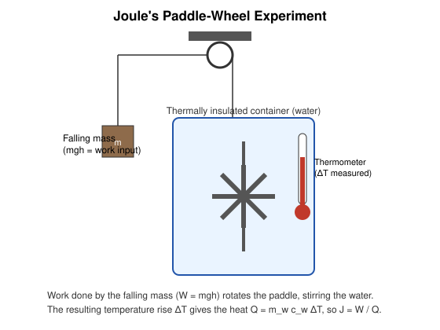

# 6. Mechanical Equivalent of Heat

## Learning Objectives

- Explain the historical significance of Joule's paddle-wheel experiment.
- State and interpret $W = JQ$.
- Understand why, in SI units, $J=1$ (heat and work share the same unit, the joule).

## Definition

> The **mechanical equivalent of heat**, $J$, is the amount of mechanical work required to produce one unit of heat (historically, to raise the temperature of a given mass of water through a specified interval, i.e. to produce one calorie).

$$
W = JQ
$$

## Physical Meaning / Intuition

Before Joule's work (1840s), heat and mechanical energy were treated as fundamentally different quantities, measured in different units (calories vs joules/foot-pounds), governed by the caloric theory in which heat was an indestructible, weightless fluid. Joule's experiments demonstrated that mechanical work can be **completely and reproducibly converted into heat**, with a fixed, universal conversion factor — establishing that heat is simply another form of energy, not a separate substance.

## Important Terminology

| Term | Meaning |
|---|---|
| Calorie | Historical heat unit: energy to raise 1 g of water by 1 °C |
| Joule (J) | SI unit of energy/work |
| $J$ (mechanical equivalent of heat) | Conversion factor between mechanical work and heat, $\approx 4.186\ \mathrm{J/cal}$ |

## Joule's Paddle-Wheel Experiment

**Setup:** A falling mass $m$, connected via a string and pulley system to a paddle wheel immersed in thermally insulated water, does mechanical work as it descends through height $h$. The paddle stirs the water via friction, converting the mechanical work entirely into heat, raising the water's temperature by $\Delta T$.

**Measurement:**

- Work input: $W = mgh$ (potential energy lost by the falling mass, converted via the paddle).
- Heat produced: $Q = m_w c_w \Delta T$, where $m_w$ is the mass of water, $c_w$ its specific heat capacity.

**Result:** Joule found the ratio $W/Q$ to be constant regardless of the experimental details (mass, height, amount of water) — this constant is $J$.

$$
J = \frac{W}{Q} \approx 4.186\ \mathrm{J/cal} \quad (\text{modern accepted value})
$$

## Mathematical Formulation

$$
\boxed{W = JQ}
$$

In SI units, since both $W$ and $Q$ are measured directly in joules, $J \equiv 1$ (dimensionless, a mere unit-consistency statement) — the formula $W=JQ$ is *only* needed when $Q$ is expressed in calories and $W$ in joules (or similar mixed-unit situations), which was essential in the pre-SI era but is largely a historical/pedagogical artifact today.

## Explanation of Variables

| Symbol | Meaning | SI unit |
|---|---|---|
| $W$ | Mechanical work done | J |
| $Q$ | Heat produced | cal (historically) or J (SI) |
| $J$ | Mechanical equivalent of heat | J/cal (historically); $=1$ in pure SI |
| $m$ | Falling mass | kg |
| $g$ | Acceleration due to gravity | $\mathrm{m/s^2}$ |
| $h$ | Height of fall | m |
| $m_w$ | Mass of water | kg |
| $c_w$ | Specific heat capacity of water | $\mathrm{J\,kg^{-1}K^{-1}}$ (or cal g⁻¹°C⁻¹) |
| $\Delta T$ | Temperature rise | K (or °C) |

## SI Units and Dimensions

$$
[W]=[Q] = \mathrm{M\,L^2\,T^{-2}}\ (\text{joule})
$$

$J$ itself is dimensionless when both sides are expressed in the same unit system; it carries units of $\mathrm{J/cal}$ only when converting between the joule and the (now largely obsolete) calorie.

## Assumptions and Conditions of Validity

- The system (water + paddle assembly) must be **thermally insulated**, so that essentially all mechanical work converts to a measurable temperature rise, with no heat loss to the surroundings.
- Friction between the paddle and water is assumed to be the *only* dissipative mechanism converting the ordered mechanical work into disordered thermal energy.
- The experiment assumes water's specific heat $c_w$ is known accurately over the (small) temperature range used.

## Physical Interpretation

Joule's result is historically one of the most important confirmations that **heat is a form of energy**, directly paving the way for the First Law of Thermodynamics as a general statement of energy conservation. It closed the door on the caloric theory (which held heat to be a conserved, indestructible fluid) since work — clearly *not* a fluid — could be shown to fully and reproducibly generate heat.

## Important Laws / Theorems / Principles

- **Joule's discovery**: the equivalence of heat and mechanical work, quantified by a universal constant $J$.
- This directly underlies the historical adoption of the joule as the SI unit for **all** forms of energy, replacing separate "heat units" and "work units."

## Worked Numerical Examples

### Problem 1 (Easy)
**Given:** A 2 kg mass falls through a height of 3 m, doing work via a paddle wheel on 0.5 kg of water (specific heat $c_w = 4186\ \mathrm{J\,kg^{-1}K^{-1}}$), assuming $g=9.8\ \mathrm{m/s^2}$.
**Required:** Temperature rise of the water.
**Formula:** $W = mgh$; $Q = m_wc_w\Delta T$; $W=Q$ (all work converts to heat, ideal case).
**Calculation:**
$$
W = (2)(9.8)(3) = 58.8\ \mathrm{J}
$$
$$
\Delta T = \frac{W}{m_wc_w} = \frac{58.8}{(0.5)(4186)} = \frac{58.8}{2093} = 0.0281\ \mathrm{K}
$$
**Answer:** $\Delta T \approx 0.028\ \mathrm{K}$ (a tiny rise — illustrating why Joule needed very sensitive thermometry and repeated trials/large heights).
**Physical interpretation:** This shows quantitatively how much mechanical effort corresponds to a barely-measurable heating — the reason Joule's experiment demanded extraordinary experimental precision for its time.

### Problem 2 (Moderate — historical-style, calorie units)
**Given:** 8000 J of mechanical work is done on an insulated calorimeter, and 1900 cal of heat is measured.
**Required:** Compute the mechanical equivalent of heat $J$ (in J/cal), and compare to the accepted value.
**Formula:** $J = W/Q$
**Calculation:**
$$
J = \frac{8000\ \mathrm{J}}{1900\ \mathrm{cal}} = 4.21\ \mathrm{J/cal}
$$
**Answer:** $J\approx 4.21\ \mathrm{J/cal}$, close to the accepted $4.186\ \mathrm{J/cal}$ (≈ 0.6% deviation, plausible experimental error).
**Physical interpretation:** Small deviations from the accepted constant reflect real experimental uncertainty (heat losses, thermometer calibration) — Joule's own repeated refinements over years progressively reduced this error.

### Problem 3 (Exam-level)
**Given:** A paddle-wheel apparatus is driven by a mass of 5 kg falling repeatedly through 2 m, 50 times, stirring 1 kg of water initially at 20 °C. Take $c_w=4186\ \mathrm{J\,kg^{-1}K^{-1}}$, $g=9.8\ \mathrm{m/s^2}$.
**Required:** Final temperature of the water (assume no heat loss).
**Formula:** $W_{\text{total}} = n(mgh)$; $\Delta T = W_{\text{total}}/(m_wc_w)$
**Calculation:**
$$
W_{\text{total}} = 50 \times (5)(9.8)(2) = 50 \times 98 = 4900\ \mathrm{J}
$$
$$
\Delta T = \frac{4900}{(1)(4186)} = 1.171\ \mathrm{K}
$$
$$
T_f = 20 + 1.17 = 21.17\ ^\circ\mathrm{C}
$$
**Answer:** $T_f \approx 21.2\ ^\circ\mathrm{C}$.
**Physical interpretation:** Repeated mechanical work accumulates additively as heat, exactly mirroring how Joule increased his apparatus's number of falls/height to obtain a measurable, precise ΔT.

## Conceptual Example

Rubbing your hands together vigorously on a cold day is a direct, everyday demonstration of the mechanical equivalent of heat: the mechanical work of friction between your palms is converted entirely into thermal energy, which you feel as warmth — the same underlying physics as Joule's paddle wheel, just less precisely quantified.

## Common Mistakes

- Treating $J$ as if it were a fundamental physical constant with deep theoretical origin — it is simply a **unit-conversion factor** between historically independent units (calorie and joule).
- Forgetting to convert units consistently when calories and joules are mixed in a problem.
- Assuming all input work converts to heat in *every* real setup — this only holds when there is no other useful output (e.g. no net change in KE/PE of the system, well-insulated apparatus).

## Exam Essentials

- $W = JQ$; in SI, $J=1$ once $Q$ is also expressed in joules.
- Description and purpose of Joule's paddle-wheel experiment.
- Modern accepted value $\approx 4.186\ \mathrm{J/cal}$.
- Historical significance: refuted caloric theory, established heat as a form of energy.

## Possible Exam Questions

- Describe Joule's paddle-wheel experiment and explain how it establishes the mechanical equivalent of heat. (descriptive)
- Why is $J=1$ in the SI system? (conceptual)
- A falling mass of 4 kg through 2.5 m stirs 0.4 kg of water via a paddle wheel. Find the temperature rise. (numerical)
- Explain the historical significance of Joule's discovery for the development of the First Law of Thermodynamics. (descriptive/conceptual)

## Summary

The mechanical equivalent of heat, $J$, quantifies the equivalence between mechanical work and heat as established by Joule's paddle-wheel experiment: work done by a falling mass, converted via a paddle into water-stirring friction, produces a reproducible temperature rise related to the work by $W=JQ$, with the modern value $J\approx4.186\ \mathrm{J/cal}$. This result was historically decisive in establishing heat as a form of energy and underpins the First Law of Thermodynamics.

## References

- Halliday, Resnick & Walker, *Fundamentals of Physics*.
- Zemansky & Dittman, *Heat and Thermodynamics*.
- Standard university thermal-physics lecture notes on the history of the First Law.
