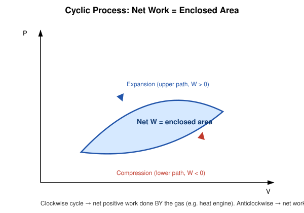

# 7. Cyclic Process

## Learning Objectives

- Define a cyclic process and explain why $\Delta U=0$ over a complete cycle.
- Show that net heat absorbed equals net work done over a cycle.
- Interpret the enclosed area on a P–V diagram as net work.
- Distinguish clockwise (net work output) from anticlockwise (net work input) cycles.

## Definition

> A **cyclic process** is a sequence of thermodynamic processes that returns the system exactly to its initial state, so that every state variable resumes its original value at the end of the cycle.

## Physical Meaning / Intuition

Because the system ends up exactly where it started, any *state function* (like $U$, $P$, $V$, $T$) must return to its original value — it would be nonsensical for a state function to have a nonzero "net change" after coming back to the very same state. Heat and work, being *path functions*, have no such constraint — they can (and generally do) have nonzero cumulative totals over the cycle.

## Important Terminology

| Term | Meaning |
|---|---|
| Cyclic process | Sequence of processes returning to the initial state |
| Net work $W_{\text{net}}$ | Total work done by the system over one complete cycle |
| Net heat $Q_{\text{net}}$ | Total heat absorbed by the system over one complete cycle |
| Heat engine | A device operating on a repeated clockwise cycle to convert net heat into net work |

## Mathematical Formulation

Since $U$ is a state function,

$$
\Delta U_{\text{cycle}} = \oint dU = 0
$$

Applying the First Law ($\Delta Q = \Delta U + W$) over the full cycle:

$$
Q_{\text{net}} = \Delta U_{\text{cycle}} + W_{\text{net}} = 0 + W_{\text{net}}
$$

$$
\boxed{Q_{\text{net}} = W_{\text{net}}}
$$

## Derivation

Consider a cycle composed of several sub-processes 1→2→3→...→1. Summing the First Law over each leg,

$$
\sum_i \Delta Q_i = \sum_i \Delta U_i + \sum_i W_i
$$

The left and right sums are simply $Q_{\text{net}}$ and $W_{\text{net}}$. For the internal energy terms, because $U$ is a state function, the sum **telescopes**:

$$
\sum_i \Delta U_i = (U_2-U_1)+(U_3-U_2)+\cdots+(U_1-U_n) = 0
$$

every intermediate $U$ value cancels, leaving only the (zero) difference between the initial and final — identical — states. Hence $Q_{\text{net}} = W_{\text{net}}$ exactly.

## Explanation of Variables

| Symbol | Meaning | SI unit |
|---|---|---|
| $Q_{\text{net}}$ | Sum of all heat exchanges over the cycle | J |
| $W_{\text{net}}$ | Sum of all work done over the cycle | J |
| $\Delta U_{\text{cycle}}$ | Net change in internal energy over the cycle (always 0) | J |

## Geometric Meaning: Net Work as Enclosed Area

On a P–V diagram, a cyclic process traces a **closed loop**. The work done during the "outward" (expansion) leg is the area under that upper curve; the work done during the "return" (compression) leg is the area under the lower curve, counted negatively (since $V$ decreases). The net result is that:

$$
W_{\text{net}} = \text{(area enclosed by the loop)}
$$

- **Clockwise** loop: expansion happens at higher average pressure than compression → $W_{\text{net}} > 0$ (net work output) — the operating principle of a **heat engine**.
- **Anticlockwise** loop: $W_{\text{net}} < 0$ (net work input) — the operating principle of a **refrigerator/heat pump**.

## SI Units and Dimensions

$$
[Q_{\text{net}}] = [W_{\text{net}}] = \mathrm{M\,L^2\,T^{-2}}\ (\text{joule})
$$

## Assumptions and Conditions of Validity

- The system must return to **exactly** its original state (same $P$, $V$, $T$, phase, composition) — an approximate return does not give exactly $\Delta U=0$.
- Sub-processes making up the cycle need not individually be reversible for $Q_{\text{net}}=W_{\text{net}}$ to hold — this result is a direct consequence of $U$ being a state function and holds regardless of reversibility.

## Physical Interpretation

Every practical heat engine (petrol/diesel engines, steam turbines, refrigeration cycles) operates cyclically so that it can run continuously rather than as a one-shot process. The cyclic constraint is precisely what makes "net work per cycle" and "net heat per cycle" meaningful, repeatable quantities — an engine's power output is simply $W_{\text{net}}$ per cycle multiplied by the cycle frequency.

## Important Laws / Theorems / Principles

- $U$ being a state function directly implies $\oint dU=0$ for any cycle.
- Net work equals the enclosed area of the P–V loop — a purely geometric restatement of $Q_{\text{net}}=W_{\text{net}}$.

## Worked Numerical Examples

### Problem 1 (Easy)
**Given:** In a complete cycle, a gas absorbs 600 J of heat during the expansion leg and rejects 250 J during the compression leg.
**Required:** Net work done by the gas over the cycle.
**Formula:** $W_{\text{net}} = Q_{\text{net}} = Q_{\text{absorbed}} - Q_{\text{rejected}}$
**Calculation:**
$$
Q_{\text{net}} = 600 - 250 = 350\ \mathrm{J}
$$
**Answer:** $W_{\text{net}} = 350\ \mathrm{J}$.
**Physical interpretation:** This is the useful work output the engine delivers per cycle.

### Problem 2 (Moderate)
**Given:** A cyclic process consists of an isobaric expansion at $P=2\times10^5$ Pa from $V_1=1\times10^{-3}$ m³ to $V_2=3\times10^{-3}$ m³, followed by an isochoric pressure drop back to the original pressure, then an isobaric compression back to $V_1$ at the lower pressure $P'=1\times10^5$ Pa.
**Required:** Net work done over the cycle (rectangular loop).
**Formula:** For a rectangular P–V loop, $W_{\text{net}} = (P-P')(V_2-V_1)$.
**Calculation:**
$$
W_{\text{net}} = (2\times10^5 - 1\times10^5)(3\times10^{-3}-1\times10^{-3}) = (1\times10^5)(2\times10^{-3}) = 200\ \mathrm{J}
$$
**Answer:** $W_{\text{net}} = 200\ \mathrm{J}$.
**Physical interpretation:** This equals the rectangular area enclosed by the loop on the P–V diagram, confirming the geometric interpretation directly.

### Problem 3 (Exam-level)
**Given:** An engine undergoes a cycle in which it absorbs 1200 J from a hot reservoir and rejects 800 J to a cold reservoir.
**Required:** (a) Net work output, (b) thermal efficiency (fraction of absorbed heat converted to work — a preview concept fully developed in Part 2).
**Formula:** $W_{\text{net}} = Q_{\text{in}} - Q_{\text{out}}$; $\eta = W_{\text{net}}/Q_{\text{in}}$
**Calculation:**
$$
W_{\text{net}} = 1200-800 = 400\ \mathrm{J}
$$
$$
\eta = \frac{400}{1200} = 0.333 = 33.3\%
$$
**Answer:** $W_{\text{net}}=400\ \mathrm{J}$, $\eta \approx 33.3\%$.
**Physical interpretation:** Only a third of the absorbed heat is converted to useful work; the rest is necessarily rejected — a preview of why no heat engine can be 100% efficient (developed fully via the Second Law and Carnot's theorem in Part 2).

## Conceptual Example

A four-stroke petrol engine's piston returns to top-dead-centre at the end of every cycle — same volume, same (average) pressure and temperature as the start of the previous cycle. Despite this, the engine has clearly done net mechanical work turning the crankshaft: that net output corresponds exactly to the enclosed area of its P–V indicator diagram, even though $\Delta U=0$ over each complete cycle.

## Common Mistakes

- Assuming $\Delta U=0$ implies no heat or work occurs during the cycle — false; $\Delta U=0$ only for the *net* change; large heat and work exchanges occur throughout, they simply cancel in $U$, not in $Q$ or $W$.
- Forgetting to account for sign (clockwise vs anticlockwise) when computing enclosed area.
- Confusing "net work done by the system" with "work done during just one leg" of the cycle.

## Exam Essentials

- $\Delta U_{\text{cycle}}=0$; therefore $Q_{\text{net}}=W_{\text{net}}$.
- Net work = enclosed area of the P–V loop.
- Clockwise loop → engine (net work output); anticlockwise → refrigerator (net work input).

## Possible Exam Questions

- Show that $\Delta U=0$ for any complete thermodynamic cycle. (derivation)
- Explain why the net work done in a cyclic process equals the area enclosed by the P–V loop. (descriptive/conceptual)
- A cyclic process absorbs 900 J and rejects 550 J. Find the net work done. (numerical)
- Distinguish between a clockwise and an anticlockwise cyclic process in terms of their practical application. (conceptual)

## Summary

In a cyclic process, the system returns to its initial state, so $\Delta U_{\text{cycle}}=0$, which forces $Q_{\text{net}}=W_{\text{net}}$. Geometrically, this net work equals the area enclosed by the cycle's loop on a P–V diagram — positive (net output) for a clockwise loop as in a heat engine, negative (net input) for an anticlockwise loop as in a refrigerator.

## References

- Halliday, Resnick & Walker, *Fundamentals of Physics*.
- Zemansky & Dittman, *Heat and Thermodynamics*.
- Schroeder, D.V., *An Introduction to Thermal Physics*.
